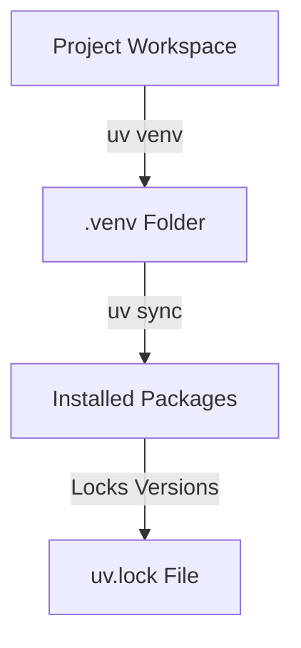

# 06_Chapter_project_setup

## 1. Introduction
Standardizing local development configurations requires isolated virtual environments and locked dependency packages.

> **Analogy:** Think of a sterile surgical room. Only approved, sterilized tools (packages) are brought in, following an inventory manifest (uv.lock) to prevent external contamination.

---

## 2. Learning Objectives
By the end of this chapter, you will be able to:
- In this chapter, you will learn how to:
- - Initialize a Python virtual environment.
- - Synchronize project packages using the `uv` toolchain.
- - Manage dependencies using lockfiles.
- - Validate your active package versions.

---

## 3. Prerequisites
* Active toolchain installations and workspace directories from Chapter 2 and 4.

---

## 4. Background Theory
Dependency drift occurs when package updates introduce breaking changes. To ensure that an application runs identically in dev, staging, and production, package versions must be locked. Traditional tools like `pip` install packages globally by default, risking conflicts. Modern workflows isolate environments using virtual environments and lock the complete dependency tree (including transitive dependencies) in a lockfile, ensuring deterministic builds.

---

## 5. Core Concepts
**📦 Technical Term: Package Manager**

* **Simple Explanation:** A tool that automates installing, updating, and removing software packages.
* **Why it exists:** Simplifies dependency resolution and version management.
* **Where is it used:** The `uv` or `pip` command-line tools.

**📦 Technical Term: Virtual Environment**

* **Simple Explanation:** An isolated directory tree containing its own Python installation and packages.
* **Why it exists:** Prevents library version conflicts between projects.
* **Where is it used:** The local `.venv/` folder.

**📦 Technical Term: Lockfile**

* **Simple Explanation:** A file listing the exact version and checksum of every package in the dependency tree.
* **Why it exists:** Guarantees identical builds across all environments.
* **Where is it used:** The `uv.lock` file.

---

## 6. Internal Mechanics
1. Developer runs `uv venv` to scaffold an isolated environment.
2. Running `uv sync` reads the dependencies listed in `pyproject.toml`.
3. The solver resolves version constraints and writes the resolved tree to `uv.lock`.
4. Packages are downloaded, verified against checksums, and installed into `.venv/lib/site-packages`.

---

## 7. Architecture Overview
The following architectural details outline the components and relationship schemas active in this module:



---

## 8. Installation & Setup
Initialize the virtual environment and synchronize dependencies using `uv`:
```bash
uv venv
```
Activate the environment:
- **Windows (PowerShell):**
  ```powershell
  .venv\Scripts\Activate.ps1
  ```
- **macOS / Linux:**
  ```bash
  source .venv/bin/activate
  ```
Synchronize packages:
```bash
uv sync
```

---

## 9. Configuration
Dependencies are declared in the `pyproject.toml` file under the `dependencies` key:
```toml
[project]
name = "agentcore-project"
version = "0.1.0"
dependencies = [
    "boto3>=1.34.0",
    "bedrock-agent-core>=1.0.0"
]
```

---

## 10. Hands-on Examples

In this section, we analyze the hands-on code implementations for **Project Setup & Dependency Management** step-by-step, explaining the architecture, syntax choices, logic flow, and production patterns across all three implementation tiers.

---

### 1. Simple Implementation Tier Walkthrough

```python
# Verify virtual environment status using python sys parameters
import sys

def check_venv():
    # sys.prefix changes when inside a virtual environment
    is_venv = sys.prefix != sys.base_prefix
    print("Is virtual environment active?", is_venv)
    print("Active Python executable path:", sys.executable)

if __name__ == "__main__":
    check_venv()
```

#### Code Logic & Syntax Breakdown:
* **Package Imports (`from bedrock_agent_core import ...`)**:
  - Brings in the core `BedrockAgentCoreApp` engine. This class handles runtime container startup, manages the microVM event loop, and deserializes incoming JSON API invocations.
* **Application Instance (`app = BedrockAgentCoreApp()`)**:
  - Instantiates the primary application object `app`. This object serves as the main registry for invocation routes, memory session hooks, and tool bindings.
* **Invocation Decorator (`@app.invoke`)**:
  - A Python decorator that registers the function immediately below as the primary entrypoint for Bedrock AgentCore runtime triggers.
* **Handler Signature (`def handler(payload, context):`)**:
  - **`payload`**: A Python dictionary holding client parameters, user prompt strings, and input arguments.
  - **`context`**: A metadata object containing active runtime details such as `session_id`, `actor_id`, and AWS IAM execution identities.
* **Return Payload (`return {"statusCode": 200, "response": ...}`)**:
  - Constructs a standard HTTP response dictionary. The `statusCode: 200` communicates success to the API Gateway, and `response` delivers the agent payload back to the client.

---

### 2. Intermediate Implementation Tier Walkthrough

```python
# Script to check if all dependencies in pyproject.toml are installed in venv
import pkg_resources
import tomllib

def check_packages():
    try:
        with open("pyproject.toml", "rb") as f:
            config = tomllib.load(f)
        deps = config.get("project", {}).get("dependencies", [])
        print("Checking declared dependencies:")
        for dep in deps:
            pkg_name = dep.split(">=")[0].split("==")[0].strip()
            try:
                dist = pkg_resources.get_distribution(pkg_name)
                print(f"- [OK] {pkg_name} is installed: {dist.version}")
            except pkg_resources.DistributionNotFound:
                print(f"- [FAIL] {pkg_name} is missing!")
    except FileNotFoundError:
        print("pyproject.toml not found in current folder.")

if __name__ == "__main__":
    check_packages()
```

#### Code Logic & Syntax Breakdown:
* **System Logging Setup (`import logging` & `logger = logging.getLogger(...)`)**:
  - Configures structured logging via Python's standard `logging` module.
  - In production, log messages emitted by `logger.info()` stream into Amazon CloudWatch Logs for real-time monitoring and debugging.
* **Safe Parameter Extraction (`payload.get(...)`)**:
  - Uses `payload.get("prompt", "")` to safely retrieve user queries. Using `.get()` with a default fallback (`""`) prevents `KeyError` exceptions if optional fields are missing.
* **Runtime Session Inspection (`getattr(context, ...)`)**:
  - Inspects the `context` object for `session_id`. Using `getattr()` ensures compatibility when testing locally without a live AWS microVM context.
* **Operational Telemetry (`logger.info(...)`)**:
  - Emits formatted log entries containing session parameters and query strings to track execution flow.

---

### 3. Advanced Production Tier Walkthrough

```python
# Complete automated setup audit and sync verification script
import subprocess
import sys
import os

def audit_environment():
    if not os.path.exists(".venv"):
        print("Virtual environment '.venv' is missing. Creating...")
        subprocess.run(["uv", "venv"], check=True)
    
    print("Synchronizing dependency configurations...")
    res = subprocess.run(["uv", "sync"], capture_output=True, text=True)
    if res.returncode == 0:
        print("[SUCCESS] Dependencies synchronized successfully!")
        # List installed packages
        res_list = subprocess.run(["uv", "pip", "list"], capture_output=True, text=True)
        print(res_list.stdout)
    else:
        print("[FAIL] Dependency sync failed:")
        print(res.stderr)
        sys.exit(1)

if __name__ == "__main__":
    audit_environment()
```

#### Code Logic & Syntax Breakdown:
* **Defensive Error Trapping (`try: ... except Exception as e:`)**:
  - Wraps the entire invocation handler inside a `try-except` block to catch unhandled errors gracefully, preventing container crashes in multi-tenant runtime environments.
* **Input Parameter Validation (`if not prompt:`)**:
  - Inspects inbound arguments before executing core agent logic. If mandatory parameters are missing, it short-circuits execution and returns a structured `statusCode: 400` (Bad Request) payload.
* **Environment Overrides (`os.getenv(...)`)**:
  - Reads system environment variables (e.g., `APP_ENV`) to dynamically adapt behavior across `development`, `staging`, and `production` environments without modifying codebase files.
* **Sanitized Production Error Response**:
  - Logs internal error details using `logger.error(...)` while returning a clean, safe `statusCode: 500` response to prevent internal stack traces from leaking to client callers.

---

### Summary Sequence of Execution

```
[Incoming Invocation] ──► [Bedrock AgentCore Runtime]
                                  │
                                  ▼
                      [Route to @app.invoke Handler]
                                  │
                   ┌──────────────┴──────────────┐
                   ▼                             ▼
       [Input Validated (200)]        [Input Missing (400)]
                   │                             │
                   ▼                             ▼
       [Execute Agent Core Logic]     [Return Error Payload]
                   │
                   ▼
       [Deliver JSON to Client]
```

---

## 11. Production Best Practices
* Always exclude the `.venv/` directory from version control by adding it to `.gitignore`.
* Always commit `uv.lock` to ensure all developers use identical package versions.
* Use `uv sync --frozen` in CI/CD pipelines to prevent updating dependencies during builds.

---

## 12. Security Considerations
Regularly audit installed packages for known security vulnerabilities using `uv pip tree` or security scanners. Keep dependencies updated to apply patches for security advisories.

---

## 13. Performance Optimization
Leverage `uv`'s global package caching. It shares package compilations across workspaces, eliminating redundant downloads and reducing install times.

---

## 14. Cost Optimization
Package sync operations are performed locally and do not consume cloud resources or incur AWS charges.

---

## 15. Common Mistakes
* Committing the `.venv` folder to Git, bloating the repository size.
* Installing packages globally using administrative permissions instead of isolating them in a local virtual environment.

---

## 16. Troubleshooting
Below is the diagnostic reference table for identifying and resolving issues:

| Symptom | Root Cause | Solution |
| :--- | :--- | :--- |
| uv sync fails with version conflict | Conflicting dependencies declared in pyproject.toml. | Audit declared version constraints and update pyproject.toml to resolve conflicts. |
| Python interpreter mismatches | The local system Python version is incompatible with the project settings. | Configure uv to build using a specific Python version: 'uv venv --python 3.11'. |

---

## 17. Interview Questions
### Q: Why is pyproject.toml preferred over setup.py in modern Python?
* **Answer:** It standardizes configuration by replacing execution scripts (`setup.py`) with declarative settings, separating metadata, dependencies, and tool options into a single schema file.

### Q: What is the difference between requirements.txt and a lockfile?
* **Answer:** `requirements.txt` typically lists top-level packages with loose version bounds. A lockfile lists the exact version, source, and hash of all packages and dependencies, ensuring deterministic builds.

### Q: How does uv achieve faster performance compared to standard pip?
* **Answer:** uv is written in Rust, resolves dependency graphs concurrently, and utilizes a global package cache to reuse built files across workspaces.

---

## 18. Real-World Use Cases
Establishing clean workspaces for new Python projects to manage dependencies.

---

## 19. Industrial Project
This setup configures the Python environment, allowing us to import the SDK and run the application in Chapter 8.

---

## 20. Summary
This chapter covered setting up isolated Python virtual environments, managing dependencies in `pyproject.toml`, and using `uv` to synchronize packages.

---

## 21. Key Takeaways
* Virtual environments prevent package conflicts.
* Lockfiles ensure reproducible builds across environments.
* The `uv` toolchain accelerates package management tasks.

---

## 22. Practice Exercises
* Beginner: Delete the `.venv` folder and run `uv sync` to restore the environment.
* Intermediate: Add the `requests` library to `pyproject.toml` and synchronize packages to verify lockfile updates.

---

## 23. Further Reading
* [uv Package Manager Documentation](https://docs.astral.sh/uv/)
* [PEP 518 - Specifying Build Requirements](https://peps.python.org/pep-0518/)
