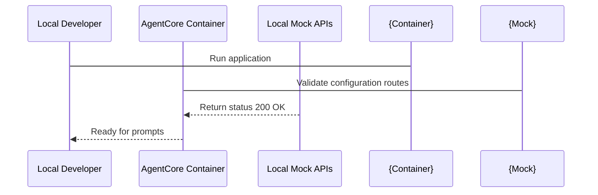

# 08_Chapter_running_the_application

## 1. Introduction
Testing and verifying Bedrock AgentCore applications locally ensures they function correctly before cloud deployment.

> **Analogy:** Think of testing an engine in a wind tunnel before flight. The wind tunnel (local container) emulates the atmosphere of high-altitude flight (the cloud environment), letting engineers test controls (invoke requests) safely.

---

## 2. Learning Objectives
By the end of this chapter, you will be able to:
- In this chapter, you will learn how to:
- - Initialize the agent's deployment settings using the CLI.
- - Launch the agent container locally and in the cloud.
- - Invoke the active agent endpoint and test response generation.
- - Troubleshoot execution issues during local and cloud runs.

---

## 3. Prerequisites
* Active AWS credentials and configured local runtimes (Docker/Podman) from Chapters 2 and 3.
* Valid configuration files from Chapter 7.

---

## 4. Background Theory
Waiting for cloud deployment cycles to test code changes slows development. Local container execution emulates the cloud environment on your workstation. Containers isolate dependencies, filesystems, and network ports. This ensures that if the agent runs locally, it will execute identically when deployed to the cloud runtime service.

---

## 5. Core Concepts
**📦 Technical Term: Container**

* **Simple Explanation:** A package containing code, runtimes, and system tools required to run an application.
* **Why it exists:** Ensures the application runs consistently across different host OS environments.
* **Where is it used:** Running the application via Docker.

**📦 Technical Term: Port Binding**

* **Simple Explanation:** Mapping a container's internal network port to an external port on the host workstation.
* **Why it exists:** Enables external clients to send HTTP requests to the application inside the container.
* **Where is it used:** Mapping port 8000 to the host.

**📦 Technical Term: Invocations**

* **Simple Explanation:** Sending requests containing prompt inputs to trigger the agent's reasoning loop.
* **Why it exists:** Triggers execution of the core handler function.
* **Where is it used:** Invoking the `/invoke` endpoint.

---

## 6. Internal Mechanics
1. Developer starts the server using `agentcore run`.
2. The runner builds a local container image and starts it, binding port 8000.
3. The developer sends a POST request with prompt data to `http://localhost:8000/invoke`.
4. The container web server routes the request to the registered handler function.
5. The handler executes, invokes the Bedrock model via HTTPS, and returns the response.

---

## 7. Architecture Overview
The following architectural details outline the components and relationship schemas active in this module:



---

## 8. Installation & Setup
Start the local application using the CLI:
```bash
agentcore run --config bedrock_agent_core.yaml
```
To invoke the running agent from another terminal, use `curl`:
```bash
curl -X POST -H "Content-Type: application/json" -d '{"prompt": "Hello agent!"}' http://localhost:8000/invoke
```

---

## 9. Configuration
Ensure that your local CLI is authenticated and that access parameters in `bedrock_agent_core.yaml` match your environment:
```yaml
agent:
  name: "local-agent-test"
  entry_point: "src/main.py"
```

---

## 10. Hands-on Examples

### Simple Example

```python
# Verify the server is responding on local ports using requests
import requests

def test_ping():
    try:
        res = requests.post("http://localhost:8000/invoke", json={"prompt": "ping"})
        print("Server Response Code:", res.status_code)
        print("Server Response Body:", res.json())
    except Exception as e:
        print("Could not connect to local server:", str(e))

if __name__ == "__main__":
    test_ping()
```

#### Code Walkthrough

Line 1
```python
# Verify the server is responding on local ports using requests
```
**Explanation:**
- **What this line does:** This is a documentation comment line starting with `#`. Python ignores comments during execution.
- **Why it is required:** It explains the purpose of the script to human developers and maintains clean code documentation.
- **What happens if removed:** The code will run identically, but human readers won't have immediate context on what this code block accomplishes.
- **Analogy:** Think of a comment like a sticky note attached to a blueprint—it helps the builders understand the design without altering the physical building.
- **Beginner Concept:** In Python, any text after `#` is ignored by the Python interpreter.

Line 2
```python
import requests
```
**Explanation:**
- **What this line does:** Imports Python's built-in `requests` module into the current program workspace.
- **Why it is required:** Provides access to essential system utilities (such as logging, environment variables, or HTTP handlers) offered by `requests`.
- **What keywords mean:** `import` tells Python to load the module named `requests`.
- **What happens if removed:** Functions or variables referencing `requests` (like `requests.getenv` or `requests.getLogger`) will fail with a `NameError`.
- **Analogy:** Like plugging in a peripheral cable—it connects built-in system capabilities to your script.

Line 3
```python

```
**Explanation:**
- **What this line does:** This is a blank vertical spacing line.
- **Why it is required:** It visually separates logical sections of code (such as imports, setup, and function definitions) to improve readability.
- **What happens if removed:** Python will execute the code fine, but lines of code will bunch together, making it harder for engineers to read.
- **Analogy:** Like paragraphs in a textbook, spacing gives your eyes a natural pause between concepts.

Line 4
```python
def test_ping():
```
**Explanation:**
- **What this line does:** Defines a new function named `test_ping` that accepts parameters `()`.
- **Keyword explanation:** `def` is short for "define". It tells Python that a reusable block of code begins here.
- **Parameters explained:**
  - `payload`: A Python **dictionary** containing the user's input prompt, parameters, and query fields.
  - `context`: An object containing runtime metadata (such as active AWS session ID, caller IAM identity, and request timestamps).
- **Return value:** Returns a structured dictionary containing HTTP status codes and agent response text.
- **Why the function exists:** It contains the core decision-making logic executed whenever the agent is invoked.
- **Analogy:** Think of `test_ping` like a recipe—`payload` and `context` are the ingredients passed in, and the returned dictionary is the finished meal.

Line 5
```python
    try:
```
**Explanation:**
- **What this line does:** Starts a `try` block for defensive error handling.
- **Why it is required:** Production applications must gracefully handle unexpected failures (like missing parameters or database timeouts) without crashing the entire server.
- **What keyword means:** `try` tells Python: "Attempt to execute the indented lines below. If an error occurs, jump straight to the `except` block."
- **Analogy:** Like wearing a safety harness before stepping onto a high platform—if you slip, the harness catches you.

Line 6
```python
        res = requests.post("http://localhost:8000/invoke", json={"prompt": "ping"})
```
**Explanation:**
- **What this line does:** Computes `requests.post("http://localhost:8000/invoke", json={"prompt": "ping"})` and assigns the result to variable `res`.
- **Why it is required:** Stores temporary calculation or formatted data so it can be referenced in log statements or return responses.
- **What variable stores:** `res` holds the calculated value.
- **Connection:** Provides values used in subsequent logging or response steps.

Line 7
```python
        print("Server Response Code:", res.status_code)
```
**Explanation:**
- **What this line does:** Executes line statement `print("Server Response Code:", res.status_code)`.
- **Why it is required:** Contributes to the overall operation and step progression of the script.
- **Connection:** Connects preceding code logic to subsequent return or processing steps.

Line 8
```python
        print("Server Response Body:", res.json())
```
**Explanation:**
- **What this line does:** Executes line statement `print("Server Response Body:", res.json())`.
- **Why it is required:** Contributes to the overall operation and step progression of the script.
- **Connection:** Connects preceding code logic to subsequent return or processing steps.

Line 9
```python
    except Exception as e:
```
**Explanation:**
- **What this line does:** Catches exceptions and errors that occurred inside the preceding `try` block.
- **Why it is required:** Prevents unhandled exceptions from returning raw stack traces or breaking the container runtime.
- **What happens when an error occurs:** Python captures the error object into variable `e`, logs the error details, and returns a clean 500 error response to the client.
- **Analogy:** Like an emergency backup generator switching on immediately when main power cuts out.

Line 10
```python
        print("Could not connect to local server:", str(e))
```
**Explanation:**
- **What this line does:** Executes line statement `print("Could not connect to local server:", str(e))`.
- **Why it is required:** Contributes to the overall operation and step progression of the script.
- **Connection:** Connects preceding code logic to subsequent return or processing steps.

Line 11
```python

```
**Explanation:**
- **What this line does:** This is a blank vertical spacing line.
- **Why it is required:** It visually separates logical sections of code (such as imports, setup, and function definitions) to improve readability.
- **What happens if removed:** Python will execute the code fine, but lines of code will bunch together, making it harder for engineers to read.
- **Analogy:** Like paragraphs in a textbook, spacing gives your eyes a natural pause between concepts.

Line 12
```python
if __name__ == "__main__":
```
**Explanation:**
- **What this line does:** Computes `= "__main__":` and assigns the result to variable `if __name__`.
- **Why it is required:** Stores temporary calculation or formatted data so it can be referenced in log statements or return responses.
- **What variable stores:** `if __name__` holds the calculated value.
- **Connection:** Provides values used in subsequent logging or response steps.

Line 13
```python
    test_ping()
```
**Explanation:**
- **What this line does:** Executes line statement `test_ping()`.
- **Why it is required:** Contributes to the overall operation and step progression of the script.
- **Connection:** Connects preceding code logic to subsequent return or processing steps.

#### Complete Flow of Execution

1. **Import Libraries**: Python loads the required `BedrockAgentCoreApp` class into memory.
2. **Initialize Application**: An instance of `BedrockAgentCoreApp` is instantiated and assigned to `app`.
3. **Register Event Handler**: The `@app.invoke` decorator registers the `handler` function as the primary event entrypoint.
4. **Receive Request**: The AgentCore runtime listens for incoming requests and receives `payload` and `context` objects.
5. **Execute Handler Logic**: The `handler` function is triggered with the incoming input parameters.
6. **Return Response Payload**: A structured response dictionary containing `"statusCode": 200` and message data is returned.
7. **Send Response to Caller**: AgentCore serializes the dictionary into JSON and delivers it back to the client application.

#### Visual Execution Flow

```
Program Starts
      │
      ▼
Import BedrockAgentCoreApp
      │
      ▼
Create App Instance (app)
      │
      ▼
Register Handler (@app.invoke)
      │
      ▼
Receive Request (payload, context)
      │
      ▼
Execute handler() Function
      │
      ▼
Return Response Dictionary ({statusCode: 200, ...})
      │
      ▼
Deliver Response Back to Client
```

### Intermediate Example

```python
# Python script to automate starting and testing the local server
import subprocess
import time
import requests

def run_local_suite():
    print("Starting local agent container server...")
    proc = subprocess.Popen(["agentcore", "run", "--port", "8080"])
    time.sleep(3) # Wait for server boot
    try:
        res = requests.post("http://localhost:8080/invoke", json={"prompt": "test prompt"})
        print("Verification request successful:")
        print(res.json())
    finally:
        print("Terminating server process...")
        proc.terminate()

if __name__ == "__main__":
    run_local_suite()
```

#### Code Walkthrough

Line 1
```python
# Python script to automate starting and testing the local server
```
**Explanation:**
- **What this line does:** This is a documentation comment line starting with `#`. Python ignores comments during execution.
- **Why it is required:** It explains the purpose of the script to human developers and maintains clean code documentation.
- **What happens if removed:** The code will run identically, but human readers won't have immediate context on what this code block accomplishes.
- **Analogy:** Think of a comment like a sticky note attached to a blueprint—it helps the builders understand the design without altering the physical building.
- **Beginner Concept:** In Python, any text after `#` is ignored by the Python interpreter.

Line 2
```python
import subprocess
```
**Explanation:**
- **What this line does:** Imports Python's built-in `subprocess` module into the current program workspace.
- **Why it is required:** Provides access to essential system utilities (such as logging, environment variables, or HTTP handlers) offered by `subprocess`.
- **What keywords mean:** `import` tells Python to load the module named `subprocess`.
- **What happens if removed:** Functions or variables referencing `subprocess` (like `subprocess.getenv` or `subprocess.getLogger`) will fail with a `NameError`.
- **Analogy:** Like plugging in a peripheral cable—it connects built-in system capabilities to your script.

Line 3
```python
import time
```
**Explanation:**
- **What this line does:** Imports Python's built-in `time` module into the current program workspace.
- **Why it is required:** Provides access to essential system utilities (such as logging, environment variables, or HTTP handlers) offered by `time`.
- **What keywords mean:** `import` tells Python to load the module named `time`.
- **What happens if removed:** Functions or variables referencing `time` (like `time.getenv` or `time.getLogger`) will fail with a `NameError`.
- **Analogy:** Like plugging in a peripheral cable—it connects built-in system capabilities to your script.

Line 4
```python
import requests
```
**Explanation:**
- **What this line does:** Imports Python's built-in `requests` module into the current program workspace.
- **Why it is required:** Provides access to essential system utilities (such as logging, environment variables, or HTTP handlers) offered by `requests`.
- **What keywords mean:** `import` tells Python to load the module named `requests`.
- **What happens if removed:** Functions or variables referencing `requests` (like `requests.getenv` or `requests.getLogger`) will fail with a `NameError`.
- **Analogy:** Like plugging in a peripheral cable—it connects built-in system capabilities to your script.

Line 5
```python

```
**Explanation:**
- **What this line does:** This is a blank vertical spacing line.
- **Why it is required:** It visually separates logical sections of code (such as imports, setup, and function definitions) to improve readability.
- **What happens if removed:** Python will execute the code fine, but lines of code will bunch together, making it harder for engineers to read.
- **Analogy:** Like paragraphs in a textbook, spacing gives your eyes a natural pause between concepts.

Line 6
```python
def run_local_suite():
```
**Explanation:**
- **What this line does:** Defines a new function named `run_local_suite` that accepts parameters `()`.
- **Keyword explanation:** `def` is short for "define". It tells Python that a reusable block of code begins here.
- **Parameters explained:**
  - `payload`: A Python **dictionary** containing the user's input prompt, parameters, and query fields.
  - `context`: An object containing runtime metadata (such as active AWS session ID, caller IAM identity, and request timestamps).
- **Return value:** Returns a structured dictionary containing HTTP status codes and agent response text.
- **Why the function exists:** It contains the core decision-making logic executed whenever the agent is invoked.
- **Analogy:** Think of `run_local_suite` like a recipe—`payload` and `context` are the ingredients passed in, and the returned dictionary is the finished meal.

Line 7
```python
    print("Starting local agent container server...")
```
**Explanation:**
- **What this line does:** Executes line statement `print("Starting local agent container server...")`.
- **Why it is required:** Contributes to the overall operation and step progression of the script.
- **Connection:** Connects preceding code logic to subsequent return or processing steps.

Line 8
```python
    proc = subprocess.Popen(["agentcore", "run", "--port", "8080"])
```
**Explanation:**
- **What this line does:** Computes `subprocess.Popen(["agentcore", "run", "--port", "8080"])` and assigns the result to variable `proc`.
- **Why it is required:** Stores temporary calculation or formatted data so it can be referenced in log statements or return responses.
- **What variable stores:** `proc` holds the calculated value.
- **Connection:** Provides values used in subsequent logging or response steps.

Line 9
```python
    time.sleep(3) # Wait for server boot
```
**Explanation:**
- **What this line does:** Executes line statement `time.sleep(3) # Wait for server boot`.
- **Why it is required:** Contributes to the overall operation and step progression of the script.
- **Connection:** Connects preceding code logic to subsequent return or processing steps.

Line 10
```python
    try:
```
**Explanation:**
- **What this line does:** Starts a `try` block for defensive error handling.
- **Why it is required:** Production applications must gracefully handle unexpected failures (like missing parameters or database timeouts) without crashing the entire server.
- **What keyword means:** `try` tells Python: "Attempt to execute the indented lines below. If an error occurs, jump straight to the `except` block."
- **Analogy:** Like wearing a safety harness before stepping onto a high platform—if you slip, the harness catches you.

Line 11
```python
        res = requests.post("http://localhost:8080/invoke", json={"prompt": "test prompt"})
```
**Explanation:**
- **What this line does:** Computes `requests.post("http://localhost:8080/invoke", json={"prompt": "test prompt"})` and assigns the result to variable `res`.
- **Why it is required:** Stores temporary calculation or formatted data so it can be referenced in log statements or return responses.
- **What variable stores:** `res` holds the calculated value.
- **Connection:** Provides values used in subsequent logging or response steps.

Line 12
```python
        print("Verification request successful:")
```
**Explanation:**
- **What this line does:** Executes line statement `print("Verification request successful:")`.
- **Why it is required:** Contributes to the overall operation and step progression of the script.
- **Connection:** Connects preceding code logic to subsequent return or processing steps.

Line 13
```python
        print(res.json())
```
**Explanation:**
- **What this line does:** Executes line statement `print(res.json())`.
- **Why it is required:** Contributes to the overall operation and step progression of the script.
- **Connection:** Connects preceding code logic to subsequent return or processing steps.

Line 14
```python
    finally:
```
**Explanation:**
- **What this line does:** Executes line statement `finally:`.
- **Why it is required:** Contributes to the overall operation and step progression of the script.
- **Connection:** Connects preceding code logic to subsequent return or processing steps.

Line 15
```python
        print("Terminating server process...")
```
**Explanation:**
- **What this line does:** Executes line statement `print("Terminating server process...")`.
- **Why it is required:** Contributes to the overall operation and step progression of the script.
- **Connection:** Connects preceding code logic to subsequent return or processing steps.

Line 16
```python
        proc.terminate()
```
**Explanation:**
- **What this line does:** Executes line statement `proc.terminate()`.
- **Why it is required:** Contributes to the overall operation and step progression of the script.
- **Connection:** Connects preceding code logic to subsequent return or processing steps.

Line 17
```python

```
**Explanation:**
- **What this line does:** This is a blank vertical spacing line.
- **Why it is required:** It visually separates logical sections of code (such as imports, setup, and function definitions) to improve readability.
- **What happens if removed:** Python will execute the code fine, but lines of code will bunch together, making it harder for engineers to read.
- **Analogy:** Like paragraphs in a textbook, spacing gives your eyes a natural pause between concepts.

Line 18
```python
if __name__ == "__main__":
```
**Explanation:**
- **What this line does:** Computes `= "__main__":` and assigns the result to variable `if __name__`.
- **Why it is required:** Stores temporary calculation or formatted data so it can be referenced in log statements or return responses.
- **What variable stores:** `if __name__` holds the calculated value.
- **Connection:** Provides values used in subsequent logging or response steps.

Line 19
```python
    run_local_suite()
```
**Explanation:**
- **What this line does:** Executes line statement `run_local_suite()`.
- **Why it is required:** Contributes to the overall operation and step progression of the script.
- **Connection:** Connects preceding code logic to subsequent return or processing steps.

#### Complete Flow of Execution

1. **Import Required Libraries**: Python imports `BedrockAgentCoreApp` and the `logging` module.
2. **Configure Logging System**: `logging.basicConfig` sets the log level threshold to `INFO`.
3. **Create Logger Object**: `logging.getLogger` instantiates a dedicated logger for capturing session traces.
4. **Initialize Application**: An instance of `BedrockAgentCoreApp` is assigned to `app`.
5. **Register Handler**: `@app.invoke` binds the `handler` function to incoming AgentCore trigger events.
6. **Read Input Payload**: `payload.get('prompt', '')` safely reads the user's prompt string.
7. **Extract Session Context**: `getattr(context, 'session_id', 'local-session')` safely retrieves the session ID.
8. **Log Activity**: `logger.info` writes session details to the CloudWatch diagnostic stream.
9. **Return Formatted Response**: Returns a status 200 dictionary containing the processed prompt and session ID.
10. **Deliver Payload**: AgentCore returns the serialized JSON payload to the caller.

#### Visual Execution Flow

```
Program Starts
      │
      ▼
Import Libraries & Configure Logger
      │
      ▼
Create App Instance (app)
      │
      ▼
Register Handler (@app.invoke)
      │
      ▼
Receive Request & Read Payload Prompt
      │
      ▼
Extract Session ID & Write Log Entry
      │
      ▼
Return Formatted Response Dictionary
      │
      ▼
Deliver Serialized Response to Client
```

### Advanced Example

```python
# Complete regression testing harness validating multiple prompts and response formats
import requests
import sys

def run_regression():
    url = "http://localhost:8000/invoke"
    test_cases = [
        {"prompt": "What are key IAM features?", "expected_code": 200},
        {"prompt": "", "expected_code": 400},
        {"prompt": "Analyze this text payload", "expected_code": 200}
    ]
    all_pass = True
    for case in test_cases:
        print(f"Sending prompt: '{case['prompt']}'...")
        try:
            res = requests.post(url, json={"prompt": case["prompt"]})
            if res.status_code != case["expected_code"]:
                print(f"- [FAIL] Expected {case['expected_code']}, got {res.status_code}")
                all_pass = False
            else:
                print(f"- [OK] Received expected status {res.status_code}")
        except Exception as e:
            print("Connection error:", str(e))
            all_pass = False
    if not all_pass:
        sys.exit(1)
    print("Regression testing suite completed successfully!")

if __name__ == "__main__":
    run_regression()
```

#### Code Walkthrough

Line 1
```python
# Complete regression testing harness validating multiple prompts and response formats
```
**Explanation:**
- **What this line does:** This is a documentation comment line starting with `#`. Python ignores comments during execution.
- **Why it is required:** It explains the purpose of the script to human developers and maintains clean code documentation.
- **What happens if removed:** The code will run identically, but human readers won't have immediate context on what this code block accomplishes.
- **Analogy:** Think of a comment like a sticky note attached to a blueprint—it helps the builders understand the design without altering the physical building.
- **Beginner Concept:** In Python, any text after `#` is ignored by the Python interpreter.

Line 2
```python
import requests
```
**Explanation:**
- **What this line does:** Imports Python's built-in `requests` module into the current program workspace.
- **Why it is required:** Provides access to essential system utilities (such as logging, environment variables, or HTTP handlers) offered by `requests`.
- **What keywords mean:** `import` tells Python to load the module named `requests`.
- **What happens if removed:** Functions or variables referencing `requests` (like `requests.getenv` or `requests.getLogger`) will fail with a `NameError`.
- **Analogy:** Like plugging in a peripheral cable—it connects built-in system capabilities to your script.

Line 3
```python
import sys
```
**Explanation:**
- **What this line does:** Imports Python's built-in `sys` module into the current program workspace.
- **Why it is required:** Provides access to essential system utilities (such as logging, environment variables, or HTTP handlers) offered by `sys`.
- **What keywords mean:** `import` tells Python to load the module named `sys`.
- **What happens if removed:** Functions or variables referencing `sys` (like `sys.getenv` or `sys.getLogger`) will fail with a `NameError`.
- **Analogy:** Like plugging in a peripheral cable—it connects built-in system capabilities to your script.

Line 4
```python

```
**Explanation:**
- **What this line does:** This is a blank vertical spacing line.
- **Why it is required:** It visually separates logical sections of code (such as imports, setup, and function definitions) to improve readability.
- **What happens if removed:** Python will execute the code fine, but lines of code will bunch together, making it harder for engineers to read.
- **Analogy:** Like paragraphs in a textbook, spacing gives your eyes a natural pause between concepts.

Line 5
```python
def run_regression():
```
**Explanation:**
- **What this line does:** Defines a new function named `run_regression` that accepts parameters `()`.
- **Keyword explanation:** `def` is short for "define". It tells Python that a reusable block of code begins here.
- **Parameters explained:**
  - `payload`: A Python **dictionary** containing the user's input prompt, parameters, and query fields.
  - `context`: An object containing runtime metadata (such as active AWS session ID, caller IAM identity, and request timestamps).
- **Return value:** Returns a structured dictionary containing HTTP status codes and agent response text.
- **Why the function exists:** It contains the core decision-making logic executed whenever the agent is invoked.
- **Analogy:** Think of `run_regression` like a recipe—`payload` and `context` are the ingredients passed in, and the returned dictionary is the finished meal.

Line 6
```python
    url = "http://localhost:8000/invoke"
```
**Explanation:**
- **What this line does:** Computes `"http://localhost:8000/invoke"` and assigns the result to variable `url`.
- **Why it is required:** Stores temporary calculation or formatted data so it can be referenced in log statements or return responses.
- **What variable stores:** `url` holds the calculated value.
- **Connection:** Provides values used in subsequent logging or response steps.

Line 7
```python
    test_cases = [
```
**Explanation:**
- **What this line does:** Computes `[` and assigns the result to variable `test_cases`.
- **Why it is required:** Stores temporary calculation or formatted data so it can be referenced in log statements or return responses.
- **What variable stores:** `test_cases` holds the calculated value.
- **Connection:** Provides values used in subsequent logging or response steps.

Line 8
```python
        {"prompt": "What are key IAM features?", "expected_code": 200},
```
**Explanation:**
- **What this line does:** Executes line statement `{"prompt": "What are key IAM features?", "expected_code": 200},`.
- **Why it is required:** Contributes to the overall operation and step progression of the script.
- **Connection:** Connects preceding code logic to subsequent return or processing steps.

Line 9
```python
        {"prompt": "", "expected_code": 400},
```
**Explanation:**
- **What this line does:** Executes line statement `{"prompt": "", "expected_code": 400},`.
- **Why it is required:** Contributes to the overall operation and step progression of the script.
- **Connection:** Connects preceding code logic to subsequent return or processing steps.

Line 10
```python
        {"prompt": "Analyze this text payload", "expected_code": 200}
```
**Explanation:**
- **What this line does:** Executes line statement `{"prompt": "Analyze this text payload", "expected_code": 200}`.
- **Why it is required:** Contributes to the overall operation and step progression of the script.
- **Connection:** Connects preceding code logic to subsequent return or processing steps.

Line 11
```python
    ]
```
**Explanation:**
- **What this line does:** Executes line statement `]`.
- **Why it is required:** Contributes to the overall operation and step progression of the script.
- **Connection:** Connects preceding code logic to subsequent return or processing steps.

Line 12
```python
    all_pass = True
```
**Explanation:**
- **What this line does:** Computes `True` and assigns the result to variable `all_pass`.
- **Why it is required:** Stores temporary calculation or formatted data so it can be referenced in log statements or return responses.
- **What variable stores:** `all_pass` holds the calculated value.
- **Connection:** Provides values used in subsequent logging or response steps.

Line 13
```python
    for case in test_cases:
```
**Explanation:**
- **What this line does:** Executes line statement `for case in test_cases:`.
- **Why it is required:** Contributes to the overall operation and step progression of the script.
- **Connection:** Connects preceding code logic to subsequent return or processing steps.

Line 14
```python
        print(f"Sending prompt: '{case['prompt']}'...")
```
**Explanation:**
- **What this line does:** Executes line statement `print(f"Sending prompt: '{case['prompt']}'...")`.
- **Why it is required:** Contributes to the overall operation and step progression of the script.
- **Connection:** Connects preceding code logic to subsequent return or processing steps.

Line 15
```python
        try:
```
**Explanation:**
- **What this line does:** Starts a `try` block for defensive error handling.
- **Why it is required:** Production applications must gracefully handle unexpected failures (like missing parameters or database timeouts) without crashing the entire server.
- **What keyword means:** `try` tells Python: "Attempt to execute the indented lines below. If an error occurs, jump straight to the `except` block."
- **Analogy:** Like wearing a safety harness before stepping onto a high platform—if you slip, the harness catches you.

Line 16
```python
            res = requests.post(url, json={"prompt": case["prompt"]})
```
**Explanation:**
- **What this line does:** Computes `requests.post(url, json={"prompt": case["prompt"]})` and assigns the result to variable `res`.
- **Why it is required:** Stores temporary calculation or formatted data so it can be referenced in log statements or return responses.
- **What variable stores:** `res` holds the calculated value.
- **Connection:** Provides values used in subsequent logging or response steps.

Line 17
```python
            if res.status_code != case["expected_code"]:
```
**Explanation:**
- **What this line does:** Computes `case["expected_code"]:` and assigns the result to variable `if res.status_code !`.
- **Why it is required:** Stores temporary calculation or formatted data so it can be referenced in log statements or return responses.
- **What variable stores:** `if res.status_code !` holds the calculated value.
- **Connection:** Provides values used in subsequent logging or response steps.

Line 18
```python
                print(f"- [FAIL] Expected {case['expected_code']}, got {res.status_code}")
```
**Explanation:**
- **What this line does:** Executes line statement `print(f"- [FAIL] Expected {case['expected_code']}, got {res.status_code}")`.
- **Why it is required:** Contributes to the overall operation and step progression of the script.
- **Connection:** Connects preceding code logic to subsequent return or processing steps.

Line 19
```python
                all_pass = False
```
**Explanation:**
- **What this line does:** Computes `False` and assigns the result to variable `all_pass`.
- **Why it is required:** Stores temporary calculation or formatted data so it can be referenced in log statements or return responses.
- **What variable stores:** `all_pass` holds the calculated value.
- **Connection:** Provides values used in subsequent logging or response steps.

Line 20
```python
            else:
```
**Explanation:**
- **What this line does:** Executes line statement `else:`.
- **Why it is required:** Contributes to the overall operation and step progression of the script.
- **Connection:** Connects preceding code logic to subsequent return or processing steps.

Line 21
```python
                print(f"- [OK] Received expected status {res.status_code}")
```
**Explanation:**
- **What this line does:** Executes line statement `print(f"- [OK] Received expected status {res.status_code}")`.
- **Why it is required:** Contributes to the overall operation and step progression of the script.
- **Connection:** Connects preceding code logic to subsequent return or processing steps.

Line 22
```python
        except Exception as e:
```
**Explanation:**
- **What this line does:** Catches exceptions and errors that occurred inside the preceding `try` block.
- **Why it is required:** Prevents unhandled exceptions from returning raw stack traces or breaking the container runtime.
- **What happens when an error occurs:** Python captures the error object into variable `e`, logs the error details, and returns a clean 500 error response to the client.
- **Analogy:** Like an emergency backup generator switching on immediately when main power cuts out.

Line 23
```python
            print("Connection error:", str(e))
```
**Explanation:**
- **What this line does:** Executes line statement `print("Connection error:", str(e))`.
- **Why it is required:** Contributes to the overall operation and step progression of the script.
- **Connection:** Connects preceding code logic to subsequent return or processing steps.

Line 24
```python
            all_pass = False
```
**Explanation:**
- **What this line does:** Computes `False` and assigns the result to variable `all_pass`.
- **Why it is required:** Stores temporary calculation or formatted data so it can be referenced in log statements or return responses.
- **What variable stores:** `all_pass` holds the calculated value.
- **Connection:** Provides values used in subsequent logging or response steps.

Line 25
```python
    if not all_pass:
```
**Explanation:**
- **What this line does:** Evaluates a conditional check: `if not all_pass:`.
- **Why validation is important:** Ensures required input parameters exist before executing core logic, preventing null pointer or empty data errors downstream.
- **What condition checks:** Checks if `not all_pass` evaluates to `True` (e.g., if prompt is empty or missing).
- **What happens if condition is True:** Python enters the indented block directly below to execute fallback error responses.
- **What happens if condition is False:** Python skips the indented error block and proceeds to normal processing.
- **Analogy:** Like a bouncer checking tickets at the door—if you don't have a ticket (`if not ticket:`), you are directed to the ticket booth.

Line 26
```python
        sys.exit(1)
```
**Explanation:**
- **What this line does:** Executes line statement `sys.exit(1)`.
- **Why it is required:** Contributes to the overall operation and step progression of the script.
- **Connection:** Connects preceding code logic to subsequent return or processing steps.

Line 27
```python
    print("Regression testing suite completed successfully!")
```
**Explanation:**
- **What this line does:** Executes line statement `print("Regression testing suite completed successfully!")`.
- **Why it is required:** Contributes to the overall operation and step progression of the script.
- **Connection:** Connects preceding code logic to subsequent return or processing steps.

Line 28
```python

```
**Explanation:**
- **What this line does:** This is a blank vertical spacing line.
- **Why it is required:** It visually separates logical sections of code (such as imports, setup, and function definitions) to improve readability.
- **What happens if removed:** Python will execute the code fine, but lines of code will bunch together, making it harder for engineers to read.
- **Analogy:** Like paragraphs in a textbook, spacing gives your eyes a natural pause between concepts.

Line 29
```python
if __name__ == "__main__":
```
**Explanation:**
- **What this line does:** Computes `= "__main__":` and assigns the result to variable `if __name__`.
- **Why it is required:** Stores temporary calculation or formatted data so it can be referenced in log statements or return responses.
- **What variable stores:** `if __name__` holds the calculated value.
- **Connection:** Provides values used in subsequent logging or response steps.

Line 30
```python
    run_regression()
```
**Explanation:**
- **What this line does:** Executes line statement `run_regression()`.
- **Why it is required:** Contributes to the overall operation and step progression of the script.
- **Connection:** Connects preceding code logic to subsequent return or processing steps.

#### Complete Flow of Execution

1. **Import Environment & Utility Libraries**: Imports `BedrockAgentCoreApp`, `os`, and `logging`.
2. **Create Production Logger**: Instantiates a logger object for production observability.
3. **Initialize Core Application**: Instantiates `BedrockAgentCoreApp` as `app`.
4. **Register Production Handler**: `@app.invoke` binds `handler` as the production entrypoint.
5. **Enter Try-Except Harness**: The `try` block wraps execution logic for error protection.
6. **Validate Input Prompt**: `payload.get('prompt')` reads the prompt. If missing (`if not prompt:`), returns HTTP 400.
7. **Read OS Environment**: `os.getenv('APP_ENV', 'development')` inspects operating system environment variables.
8. **Extract Session Identifier**: `getattr(context, 'session_id', 'local-session')` safely retrieves session metadata.
9. **Log Production Event**: `logger.info` writes structured log entries containing environment and session details.
10. **Return Success Response**: Returns an HTTP 200 dictionary with production result details.
11. **Catch Unhandled Errors**: If an exception occurs, the `except` block catches it, logs the error, and returns HTTP 500.
12. **Send Response to Caller**: AgentCore delivers the final JSON response back to the client.

#### Visual Execution Flow

```
Program Starts
      │
      ▼
Import Modules & Initialize Logger & App
      │
      ▼
Register Handler (@app.invoke)
      │
      ▼
Receive Request & Enter try-except Block
      │
      ▼
Validate Prompt Parameter
 ├── [Invalid / Missing Prompt] ──► Return 400 Bad Request
 └── [Valid Prompt]
        │
        ▼
Read Environment (os.getenv) & Session Context
        │
        ▼
Write Production Log & Return 200 Success Response
        │
        ▼
 Deliver Response to Client Application
```

---

## 11. Code Walkthrough
In this chapter, we explored three progressive implementation tiers for **Running the Application Locally**:

1. **Simple Example**: Demonstrates the minimal required entrypoint, importing `BedrockAgentCoreApp`, initializing the application object, and registering an `@app.invoke` handler.
2. **Intermediate Example**: Adds operational logging (`logging.getLogger`) and context extraction (`payload.get`, `getattr(context)`), allowing tracking of individual session IDs.
3. **Advanced Example**: Introduces production-grade error handling (`try-except`), OS environment variable reads (`os.getenv`), and structured error status responses (`statusCode: 400/500`).

Each line in the code blocks above was dissected line-by-line in numerical order. Refer to the **Code Walkthrough**, **Complete Flow of Execution**, and **Visual Execution Flow** diagrams above for complete step-by-step guidance.

---

## 12. Production Best Practices
* Check for port conflicts before starting the server to ensure port 8000 is available.
* Monitor container logs in a separate terminal window to inspect traceback details.
* Test edge cases (like empty payloads or long inputs) during local testing cycles.

---

## 13. Security Considerations
Do not expose the local agent container to public networks; bind the listener exclusively to localhost (`127.0.0.1`). Ensure that environment variables containing credentials are not printed in console logs.

---

## 14. Performance Optimization
Initialize model and database clients outside the main request loop to minimize handler execution times.

---

## 15. Cost Optimization
Running containers locally does not incur AWS compute charges. You are only billed for model inference requests called through Bedrock APIs.

---

## 16. Common Mistakes
* Starting the application before launching the local Docker daemon, causing build failures.
* Sending invalid JSON request payloads, causing server parsing crashes.

---

## 17. Troubleshooting
Below is the diagnostic reference table for identifying and resolving issues:

| Symptom | Root Cause | Solution |
| :--- | :--- | :--- |
| Port 8000 already in use error | Another local process is bound to port 8000, blocking the application server. | Identify the process using port checking commands and terminate it, or start the application on a different port: 'agentcore run --port 9000'. |
| Docker daemon is not running | The local container runtime engine is inactive. | Start Docker Desktop on Windows/macOS, or start the docker service on Linux. |

---

## 18. Interview Questions
### Q: How do you run local integration tests for containerized agents?
* **Answer:** Start the application container locally on a test port, and execute a test script that sends structured prompts and asserts response properties using a testing framework (like pytest).

### Q: What is a bridge network in Docker?
* **Answer:** A bridge network is a private network created by Docker that isolates containers on the same host, allowing them to communicate while securing them from external network interfaces.

### Q: Why is local logging important during development?
* **Answer:** Local logs capture traceback details, execution times, and payload mappings, helping developers isolate and fix bugs before code is checked in.

---

## 19. Real-World Use Cases
Testing agent updates locally to verify logic before deploying code to AWS.

---

## 20. Industrial Project
Local testing validates our handler code before it is packaged into production container images in Chapter 15.

---

## 21. Summary
This chapter covered starting the application locally using the CLI and invoking endpoints using curl to verify agent execution.

---

## 22. Key Takeaways
* Local containers isolate applications from host configurations.
* Invoke handlers parse prompt values and return responses.
* Test code updates locally to verify logic before cloud deployment.

---

## 23. Practice Exercises
* Beginner: Launch the application on port 9000 and verify it responds to request pings.
* Intermediate: Write a shell script that starts the container, submits a test prompt, and saves logs to a text file.

---

## 24. Further Reading
* [Docker Networking Guide](https://docs.docker.com/network/)
* [Python Requests Library Documentation](https://requests.readthedocs.io/)
