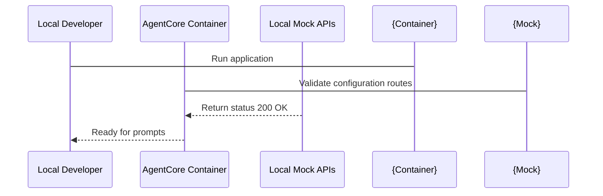

# 08_Chapter_running_the_application

## 1. Introduction
Testing and verifying Bedrock AgentCore applications locally ensures they function correctly before cloud deployment.

> **Analogy:** Think of testing an engine in a wind tunnel before flight. The wind tunnel (local container) emulates the atmosphere of high-altitude flight (the cloud environment), letting engineers test controls (invoke requests) safely.

---

## 2. Learning Objectives
By the end of this chapter, you will be able to:
- In this chapter, you will learn how to:
- - Initialize the agent's deployment settings using the CLI.
- - Launch the agent container locally and in the cloud.
- - Invoke the active agent endpoint and test response generation.
- - Troubleshoot execution issues during local and cloud runs.

---

## 3. Prerequisites
* Active AWS credentials and configured local runtimes (Docker/Podman) from Chapters 2 and 3.
* Valid configuration files from Chapter 7.

---

## 4. Background Theory
Waiting for cloud deployment cycles to test code changes slows development. Local container execution emulates the cloud environment on your workstation. Containers isolate dependencies, filesystems, and network ports. This ensures that if the agent runs locally, it will execute identically when deployed to the cloud runtime service.

---

## 5. Core Concepts
**📦 Technical Term: Container**

* **Simple Explanation:** A package containing code, runtimes, and system tools required to run an application.
* **Why it exists:** Ensures the application runs consistently across different host OS environments.
* **Where is it used:** Running the application via Docker.

**📦 Technical Term: Port Binding**

* **Simple Explanation:** Mapping a container's internal network port to an external port on the host workstation.
* **Why it exists:** Enables external clients to send HTTP requests to the application inside the container.
* **Where is it used:** Mapping port 8000 to the host.

**📦 Technical Term: Invocations**

* **Simple Explanation:** Sending requests containing prompt inputs to trigger the agent's reasoning loop.
* **Why it exists:** Triggers execution of the core handler function.
* **Where is it used:** Invoking the `/invoke` endpoint.

---

## 6. Internal Mechanics
1. Developer starts the server using `agentcore run`.
2. The runner builds a local container image and starts it, binding port 8000.
3. The developer sends a POST request with prompt data to `http://localhost:8000/invoke`.
4. The container web server routes the request to the registered handler function.
5. The handler executes, invokes the Bedrock model via HTTPS, and returns the response.

---

## 7. Architecture Overview
The following architectural details outline the components and relationship schemas active in this module:



---

## 8. Installation & Setup
Start the local application using the CLI:
```bash
agentcore run --config bedrock_agent_core.yaml
```
To invoke the running agent from another terminal, use `curl`:
```bash
curl -X POST -H "Content-Type: application/json" -d '{"prompt": "Hello agent!"}' http://localhost:8000/invoke
```

---

## 9. Configuration
Ensure that your local CLI is authenticated and that access parameters in `bedrock_agent_core.yaml` match your environment:
```yaml
agent:
  name: "local-agent-test"
  entry_point: "src/main.py"
```

---

## 10. Hands-on Examples
### Simple Example
```python
# Verify the server is responding on local ports using requests
import requests

def test_ping():
    try:
        res = requests.post("http://localhost:8000/invoke", json={"prompt": "ping"})
        print("Server Response Code:", res.status_code)
        print("Server Response Body:", res.json())
    except Exception as e:
        print("Could not connect to local server:", str(e))

if __name__ == "__main__":
    test_ping()
```

### Intermediate Example
```python
# Python script to automate starting and testing the local server
import subprocess
import time
import requests

def run_local_suite():
    print("Starting local agent container server...")
    proc = subprocess.Popen(["agentcore", "run", "--port", "8080"])
    time.sleep(3) # Wait for server boot
    try:
        res = requests.post("http://localhost:8080/invoke", json={"prompt": "test prompt"})
        print("Verification request successful:")
        print(res.json())
    finally:
        print("Terminating server process...")
        proc.terminate()

if __name__ == "__main__":
    run_local_suite()
```

### Advanced Example
```python
# Complete regression testing harness validating multiple prompts and response formats
import requests
import sys

def run_regression():
    url = "http://localhost:8000/invoke"
    test_cases = [
        {"prompt": "What are key IAM features?", "expected_code": 200},
        {"prompt": "", "expected_code": 400},
        {"prompt": "Analyze this text payload", "expected_code": 200}
    ]
    all_pass = True
    for case in test_cases:
        print(f"Sending prompt: '{case['prompt']}'...")
        try:
            res = requests.post(url, json={"prompt": case["prompt"]})
            if res.status_code != case["expected_code"]:
                print(f"- [FAIL] Expected {case['expected_code']}, got {res.status_code}")
                all_pass = False
            else:
                print(f"- [OK] Received expected status {res.status_code}")
        except Exception as e:
            print("Connection error:", str(e))
            all_pass = False
    if not all_pass:
        sys.exit(1)
    print("Regression testing suite completed successfully!")

if __name__ == "__main__":
    run_regression()
```

---

## 11. Code Walkthrough
Let's perform a line-by-line code walk of the core logic implementation:

```python
# Verify the server is responding on local ports using requests
import requests

def test_ping():
    try:
        res = requests.post("http://localhost:8000/invoke", json={"prompt": "ping"})
        print("Server Response Code:", res.status_code)
        print("Server Response Body:", res.json())
    except Exception as e:
        print("Could not connect to local server:", str(e))

if __name__ == "__main__":
    test_ping()
```

* **`import` statements:** Load libraries and core modules required by the package.
* **Initialization:** Instantiates execution frameworks and logs operational events.
* **Handler logic:** Executes input validations and triggers core business routines.

---

## 12. Production Best Practices
* Check for port conflicts before starting the server to ensure port 8000 is available.
* Monitor container logs in a separate terminal window to inspect traceback details.
* Test edge cases (like empty payloads or long inputs) during local testing cycles.

---

## 13. Security Considerations
Do not expose the local agent container to public networks; bind the listener exclusively to localhost (`127.0.0.1`). Ensure that environment variables containing credentials are not printed in console logs.

---

## 14. Performance Optimization
Initialize model and database clients outside the main request loop to minimize handler execution times.

---

## 15. Cost Optimization
Running containers locally does not incur AWS compute charges. You are only billed for model inference requests called through Bedrock APIs.

---

## 16. Common Mistakes
* Starting the application before launching the local Docker daemon, causing build failures.
* Sending invalid JSON request payloads, causing server parsing crashes.

---

## 17. Troubleshooting
Below is the diagnostic reference table for identifying and resolving issues:

| Symptom | Root Cause | Solution |
| :--- | :--- | :--- |
| Port 8000 already in use error | Another local process is bound to port 8000, blocking the application server. | Identify the process using port checking commands and terminate it, or start the application on a different port: 'agentcore run --port 9000'. |
| Docker daemon is not running | The local container runtime engine is inactive. | Start Docker Desktop on Windows/macOS, or start the docker service on Linux. |

---

## 18. Interview Questions
### Q: How do you run local integration tests for containerized agents?
* **Answer:** Start the application container locally on a test port, and execute a test script that sends structured prompts and asserts response properties using a testing framework (like pytest).

### Q: What is a bridge network in Docker?
* **Answer:** A bridge network is a private network created by Docker that isolates containers on the same host, allowing them to communicate while securing them from external network interfaces.

### Q: Why is local logging important during development?
* **Answer:** Local logs capture traceback details, execution times, and payload mappings, helping developers isolate and fix bugs before code is checked in.

---

## 19. Real-World Use Cases
Testing agent updates locally to verify logic before deploying code to AWS.

---

## 20. Industrial Project
Local testing validates our handler code before it is packaged into production container images in Chapter 15.

---

## 21. Summary
This chapter covered starting the application locally using the CLI and invoking endpoints using curl to verify agent execution.

---

## 22. Key Takeaways
* Local containers isolate applications from host configurations.
* Invoke handlers parse prompt values and return responses.
* Test code updates locally to verify logic before cloud deployment.

---

## 23. Practice Exercises
* Beginner: Launch the application on port 9000 and verify it responds to request pings.
* Intermediate: Write a shell script that starts the container, submits a test prompt, and saves logs to a text file.

---

## 24. Further Reading
* [Docker Networking Guide](https://docs.docker.com/network/)
* [Python Requests Library Documentation](https://requests.readthedocs.io/)
