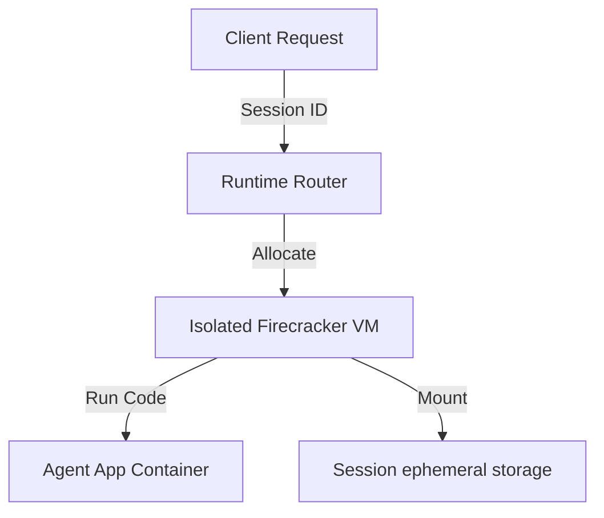

# 10_Chapter_agentcore_runtime

## 1. Introduction
The AgentCore runtime hosts agent containers inside secure, isolated virtual machine environments.

> **Analogy:** Think of renting a suite at a hotel. The suite (Firecracker VM) is an isolated space with its own secure lock and utilities. What happens inside does not affect other suites.

---

## 2. Learning Objectives
By the end of this chapter, you will be able to:
- In this chapter, you will learn:
- - How AWS Firecracker microVMs provide secure, hardware-isolated runtimes.
- - The difference between container execution and microVM isolation.
- - How AgentCore routes requests to active (warm) and new (cold) sessions.
- - The default execution bounds, timeouts, and limits.

---

## 3. Prerequisites
* Setup of configuration files and local container runtimes from Chapters 7 and 8.
* A basic understanding of virtualization concepts (VMs vs containers).

---

## 4. Background Theory
Deploying agents to the cloud requires secure execution environments. Traditional shared container runtimes share a single operating system kernel, risking cross-tenant data leaks. AWS designed Firecracker to combine the security isolation of traditional virtual machines with the speed and efficiency of containers. The AgentCore runtime spawns a dedicated Firecracker microVM for each user session, enforcing resource limits and security boundaries.

---

## 5. Core Concepts
**📦 Technical Term: Firecracker**

* **Simple Explanation:** An open-source virtualization technology designed to spawn secure, multitenant microVMs.
* **Why it exists:** Combines the security isolation of traditional VMs with container speed.
* **Where is it used:** The underlying hypervisor for AWS Lambda and Fargate.

**📦 Technical Term: Cold Start**

* **Simple Explanation:** The process of pulling container images and booting a new microVM for a session.
* **Why it exists:** The initial boot latency when a session starts.
* **Where is it used:** The initial request boot cycle.

**📦 Technical Term: Warm Start**

* **Simple Explanation:** Routing subsequent requests using the same session ID to an active microVM.
* **Why it exists:** Bypasses the boot cycle for low-latency responses.
* **Where is it used:** Subsequent requests within active session windows.

---

## 6. Internal Mechanics
1. Client sends an invocation request containing a unique `session_id`.
2. The runtime checks if an active microVM is allocated to that session.
3. If missing (Cold Start), it pulls the ECR container image and boots a new Firecracker microVM.
4. If active (Warm Start), it routes the request directly to the running container.
5. The microVM executes the request and remains active until the inactivity timeout or max session duration (8 hours) is reached.

---

## 7. Architecture Overview
The following architectural details outline the components and relationship schemas active in this module:



---

## 8. Installation & Setup
Inspect active session microVM status using the CLI:
```bash
agentcore runtime status
```

---

## 9. Configuration
Configure runtime limits and session timeouts in `bedrock_agent_core.yaml`:
```yaml
runtime:
  timeout_seconds: 3600
  memory_mb: 2048
  storage_gb: 10
```

---

## 10. Hands-on Examples

### Simple Example

```python
# Verify session details in execution context
def check_runtime_context(context):
    session_id = getattr(context, "session_id", "local-session")
    print("Running inside session VM:", session_id)
    return session_id
```

#### Code Walkthrough

Line 1
```python
# Verify session details in execution context
```
**Explanation:**
- **What this line does:** This is a documentation comment line starting with `#`. Python ignores comments during execution.
- **Why it is required:** It explains the purpose of the script to human developers and maintains clean code documentation.
- **What happens if removed:** The code will run identically, but human readers won't have immediate context on what this code block accomplishes.
- **Analogy:** Think of a comment like a sticky note attached to a blueprint—it helps the builders understand the design without altering the physical building.
- **Beginner Concept:** In Python, any text after `#` is ignored by the Python interpreter.

Line 2
```python
def check_runtime_context(context):
```
**Explanation:**
- **What this line does:** Defines a new function named `check_runtime_context` that accepts parameters `(context)`.
- **Keyword explanation:** `def` is short for "define". It tells Python that a reusable block of code begins here.
- **Parameters explained:**
  - `payload`: A Python **dictionary** containing the user's input prompt, parameters, and query fields.
  - `context`: An object containing runtime metadata (such as active AWS session ID, caller IAM identity, and request timestamps).
- **Return value:** Returns a structured dictionary containing HTTP status codes and agent response text.
- **Why the function exists:** It contains the core decision-making logic executed whenever the agent is invoked.
- **Analogy:** Think of `check_runtime_context` like a recipe—`payload` and `context` are the ingredients passed in, and the returned dictionary is the finished meal.

Line 3
```python
    session_id = getattr(context, "session_id", "local-session")
```
**Explanation:**
- **What this line does:** Safely reads an attribute from the `context` object using `getattr()` and stores it in variable `session_id`.
- **Method details:** `getattr(context, attribute_name, default_value)` inspects `context` for the requested property. If present, it returns the attribute; otherwise, it returns the default value.
- **What variable stores:** `session_id` holds the session identifier string.
- **Why it is required:** Ensures the code works both in local testing (where context might be mocked) and in production AWS microVM runtimes.
- **Analogy:** Checking someone's ID card for their badge number, defaulting to "Visitor" if no badge number is printed.

Line 4
```python
    print("Running inside session VM:", session_id)
```
**Explanation:**
- **What this line does:** Executes line statement `print("Running inside session VM:", session_id)`.
- **Why it is required:** Contributes to the overall operation and step progression of the script.
- **Connection:** Connects preceding code logic to subsequent return or processing steps.

Line 5
```python
    return session_id
```
**Explanation:**
- **What this line does:** Initiates a `return` statement to exit the function and pass data back to the caller.
- **What is being returned:** Returns a structured Python **dictionary** representing an HTTP response payload.
- **Who receives it:** The Bedrock AgentCore runtime receives this dictionary, serializes it into JSON, and sends it back to the client application.
- **Why response must be returned:** Without a return statement, the function would return `None`, causing AgentCore to report a blank execution payload to the user.
- **Analogy:** Handing a completed report back to the manager who requested it.

#### Complete Flow of Execution

1. **Import Libraries**: Python loads the required `BedrockAgentCoreApp` class into memory.
2. **Initialize Application**: An instance of `BedrockAgentCoreApp` is instantiated and assigned to `app`.
3. **Register Event Handler**: The `@app.invoke` decorator registers the `handler` function as the primary event entrypoint.
4. **Receive Request**: The AgentCore runtime listens for incoming requests and receives `payload` and `context` objects.
5. **Execute Handler Logic**: The `handler` function is triggered with the incoming input parameters.
6. **Return Response Payload**: A structured response dictionary containing `"statusCode": 200` and message data is returned.
7. **Send Response to Caller**: AgentCore serializes the dictionary into JSON and delivers it back to the client application.

#### Visual Execution Flow

```
Program Starts
      │
      ▼
Import BedrockAgentCoreApp
      │
      ▼
Create App Instance (app)
      │
      ▼
Register Handler (@app.invoke)
      │
      ▼
Receive Request (payload, context)
      │
      ▼
Execute handler() Function
      │
      ▼
Return Response Dictionary ({statusCode: 200, ...})
      │
      ▼
Deliver Response Back to Client
```

### Intermediate Example

```python
# Python script to verify local file isolation under /tmp
import os

def check_file_isolation():
    path = "/tmp/session_data.txt"
    if os.path.exists(path):
        with open(path, "r") as f:
            print("Read session data:", f.read())
    else:
        print("No session data found. Writing default...")
        with open(path, "w") as f:
            f.write("Session Active")

if __name__ == "__main__":
    check_file_isolation()
```

#### Code Walkthrough

Line 1
```python
# Python script to verify local file isolation under /tmp
```
**Explanation:**
- **What this line does:** This is a documentation comment line starting with `#`. Python ignores comments during execution.
- **Why it is required:** It explains the purpose of the script to human developers and maintains clean code documentation.
- **What happens if removed:** The code will run identically, but human readers won't have immediate context on what this code block accomplishes.
- **Analogy:** Think of a comment like a sticky note attached to a blueprint—it helps the builders understand the design without altering the physical building.
- **Beginner Concept:** In Python, any text after `#` is ignored by the Python interpreter.

Line 2
```python
import os
```
**Explanation:**
- **What this line does:** Imports Python's built-in `os` module into the current program workspace.
- **Why it is required:** Provides access to essential system utilities (such as logging, environment variables, or HTTP handlers) offered by `os`.
- **What keywords mean:** `import` tells Python to load the module named `os`.
- **What happens if removed:** Functions or variables referencing `os` (like `os.getenv` or `os.getLogger`) will fail with a `NameError`.
- **Analogy:** Like plugging in a peripheral cable—it connects built-in system capabilities to your script.

Line 3
```python

```
**Explanation:**
- **What this line does:** This is a blank vertical spacing line.
- **Why it is required:** It visually separates logical sections of code (such as imports, setup, and function definitions) to improve readability.
- **What happens if removed:** Python will execute the code fine, but lines of code will bunch together, making it harder for engineers to read.
- **Analogy:** Like paragraphs in a textbook, spacing gives your eyes a natural pause between concepts.

Line 4
```python
def check_file_isolation():
```
**Explanation:**
- **What this line does:** Defines a new function named `check_file_isolation` that accepts parameters `()`.
- **Keyword explanation:** `def` is short for "define". It tells Python that a reusable block of code begins here.
- **Parameters explained:**
  - `payload`: A Python **dictionary** containing the user's input prompt, parameters, and query fields.
  - `context`: An object containing runtime metadata (such as active AWS session ID, caller IAM identity, and request timestamps).
- **Return value:** Returns a structured dictionary containing HTTP status codes and agent response text.
- **Why the function exists:** It contains the core decision-making logic executed whenever the agent is invoked.
- **Analogy:** Think of `check_file_isolation` like a recipe—`payload` and `context` are the ingredients passed in, and the returned dictionary is the finished meal.

Line 5
```python
    path = "/tmp/session_data.txt"
```
**Explanation:**
- **What this line does:** Computes `"/tmp/session_data.txt"` and assigns the result to variable `path`.
- **Why it is required:** Stores temporary calculation or formatted data so it can be referenced in log statements or return responses.
- **What variable stores:** `path` holds the calculated value.
- **Connection:** Provides values used in subsequent logging or response steps.

Line 6
```python
    if os.path.exists(path):
```
**Explanation:**
- **What this line does:** Evaluates a conditional check: `if os.path.exists(path):`.
- **Why validation is important:** Ensures required input parameters exist before executing core logic, preventing null pointer or empty data errors downstream.
- **What condition checks:** Checks if `os.path.exists(path)` evaluates to `True` (e.g., if prompt is empty or missing).
- **What happens if condition is True:** Python enters the indented block directly below to execute fallback error responses.
- **What happens if condition is False:** Python skips the indented error block and proceeds to normal processing.
- **Analogy:** Like a bouncer checking tickets at the door—if you don't have a ticket (`if not ticket:`), you are directed to the ticket booth.

Line 7
```python
        with open(path, "r") as f:
```
**Explanation:**
- **What this line does:** Executes line statement `with open(path, "r") as f:`.
- **Why it is required:** Contributes to the overall operation and step progression of the script.
- **Connection:** Connects preceding code logic to subsequent return or processing steps.

Line 8
```python
            print("Read session data:", f.read())
```
**Explanation:**
- **What this line does:** Executes line statement `print("Read session data:", f.read())`.
- **Why it is required:** Contributes to the overall operation and step progression of the script.
- **Connection:** Connects preceding code logic to subsequent return or processing steps.

Line 9
```python
    else:
```
**Explanation:**
- **What this line does:** Executes line statement `else:`.
- **Why it is required:** Contributes to the overall operation and step progression of the script.
- **Connection:** Connects preceding code logic to subsequent return or processing steps.

Line 10
```python
        print("No session data found. Writing default...")
```
**Explanation:**
- **What this line does:** Executes line statement `print("No session data found. Writing default...")`.
- **Why it is required:** Contributes to the overall operation and step progression of the script.
- **Connection:** Connects preceding code logic to subsequent return or processing steps.

Line 11
```python
        with open(path, "w") as f:
```
**Explanation:**
- **What this line does:** Executes line statement `with open(path, "w") as f:`.
- **Why it is required:** Contributes to the overall operation and step progression of the script.
- **Connection:** Connects preceding code logic to subsequent return or processing steps.

Line 12
```python
            f.write("Session Active")
```
**Explanation:**
- **What this line does:** Executes line statement `f.write("Session Active")`.
- **Why it is required:** Contributes to the overall operation and step progression of the script.
- **Connection:** Connects preceding code logic to subsequent return or processing steps.

Line 13
```python

```
**Explanation:**
- **What this line does:** This is a blank vertical spacing line.
- **Why it is required:** It visually separates logical sections of code (such as imports, setup, and function definitions) to improve readability.
- **What happens if removed:** Python will execute the code fine, but lines of code will bunch together, making it harder for engineers to read.
- **Analogy:** Like paragraphs in a textbook, spacing gives your eyes a natural pause between concepts.

Line 14
```python
if __name__ == "__main__":
```
**Explanation:**
- **What this line does:** Computes `= "__main__":` and assigns the result to variable `if __name__`.
- **Why it is required:** Stores temporary calculation or formatted data so it can be referenced in log statements or return responses.
- **What variable stores:** `if __name__` holds the calculated value.
- **Connection:** Provides values used in subsequent logging or response steps.

Line 15
```python
    check_file_isolation()
```
**Explanation:**
- **What this line does:** Executes line statement `check_file_isolation()`.
- **Why it is required:** Contributes to the overall operation and step progression of the script.
- **Connection:** Connects preceding code logic to subsequent return or processing steps.

#### Complete Flow of Execution

1. **Import Required Libraries**: Python imports `BedrockAgentCoreApp` and the `logging` module.
2. **Configure Logging System**: `logging.basicConfig` sets the log level threshold to `INFO`.
3. **Create Logger Object**: `logging.getLogger` instantiates a dedicated logger for capturing session traces.
4. **Initialize Application**: An instance of `BedrockAgentCoreApp` is assigned to `app`.
5. **Register Handler**: `@app.invoke` binds the `handler` function to incoming AgentCore trigger events.
6. **Read Input Payload**: `payload.get('prompt', '')` safely reads the user's prompt string.
7. **Extract Session Context**: `getattr(context, 'session_id', 'local-session')` safely retrieves the session ID.
8. **Log Activity**: `logger.info` writes session details to the CloudWatch diagnostic stream.
9. **Return Formatted Response**: Returns a status 200 dictionary containing the processed prompt and session ID.
10. **Deliver Payload**: AgentCore returns the serialized JSON payload to the caller.

#### Visual Execution Flow

```
Program Starts
      │
      ▼
Import Libraries & Configure Logger
      │
      ▼
Create App Instance (app)
      │
      ▼
Register Handler (@app.invoke)
      │
      ▼
Receive Request & Read Payload Prompt
      │
      ▼
Extract Session ID & Write Log Entry
      │
      ▼
Return Formatted Response Dictionary
      │
      ▼
Deliver Serialized Response to Client
```

### Advanced Example

```python
# Complete script validating memory limits and executing timeout handlers
import time
import signal
import sys

def timeout_handler(signum, frame):
    print("[TIMEOUT] Execution time limit exceeded. Terminating task.")
    sys.exit(1)

def execute_with_bounds(duration):
    # Register signal handler for execution timeouts
    signal.signal(signal.SIGALRM, timeout_handler)
    signal.alarm(5) # Set timeout limit to 5 seconds
    try:
        print(f"Executing process for {duration} seconds...")
        time.sleep(duration)
        signal.alarm(0) # Disable alarm on success
        print("[SUCCESS] Task completed within limits.")
    except Exception as e:
        print("Execution error:", str(e))

if __name__ == "__main__":
    execute_with_bounds(3) # Succeeds
    execute_with_bounds(10) # Triggers timeout
```

#### Code Walkthrough

Line 1
```python
# Complete script validating memory limits and executing timeout handlers
```
**Explanation:**
- **What this line does:** This is a documentation comment line starting with `#`. Python ignores comments during execution.
- **Why it is required:** It explains the purpose of the script to human developers and maintains clean code documentation.
- **What happens if removed:** The code will run identically, but human readers won't have immediate context on what this code block accomplishes.
- **Analogy:** Think of a comment like a sticky note attached to a blueprint—it helps the builders understand the design without altering the physical building.
- **Beginner Concept:** In Python, any text after `#` is ignored by the Python interpreter.

Line 2
```python
import time
```
**Explanation:**
- **What this line does:** Imports Python's built-in `time` module into the current program workspace.
- **Why it is required:** Provides access to essential system utilities (such as logging, environment variables, or HTTP handlers) offered by `time`.
- **What keywords mean:** `import` tells Python to load the module named `time`.
- **What happens if removed:** Functions or variables referencing `time` (like `time.getenv` or `time.getLogger`) will fail with a `NameError`.
- **Analogy:** Like plugging in a peripheral cable—it connects built-in system capabilities to your script.

Line 3
```python
import signal
```
**Explanation:**
- **What this line does:** Imports Python's built-in `signal` module into the current program workspace.
- **Why it is required:** Provides access to essential system utilities (such as logging, environment variables, or HTTP handlers) offered by `signal`.
- **What keywords mean:** `import` tells Python to load the module named `signal`.
- **What happens if removed:** Functions or variables referencing `signal` (like `signal.getenv` or `signal.getLogger`) will fail with a `NameError`.
- **Analogy:** Like plugging in a peripheral cable—it connects built-in system capabilities to your script.

Line 4
```python
import sys
```
**Explanation:**
- **What this line does:** Imports Python's built-in `sys` module into the current program workspace.
- **Why it is required:** Provides access to essential system utilities (such as logging, environment variables, or HTTP handlers) offered by `sys`.
- **What keywords mean:** `import` tells Python to load the module named `sys`.
- **What happens if removed:** Functions or variables referencing `sys` (like `sys.getenv` or `sys.getLogger`) will fail with a `NameError`.
- **Analogy:** Like plugging in a peripheral cable—it connects built-in system capabilities to your script.

Line 5
```python

```
**Explanation:**
- **What this line does:** This is a blank vertical spacing line.
- **Why it is required:** It visually separates logical sections of code (such as imports, setup, and function definitions) to improve readability.
- **What happens if removed:** Python will execute the code fine, but lines of code will bunch together, making it harder for engineers to read.
- **Analogy:** Like paragraphs in a textbook, spacing gives your eyes a natural pause between concepts.

Line 6
```python
def timeout_handler(signum, frame):
```
**Explanation:**
- **What this line does:** Defines a new function named `timeout_handler` that accepts parameters `(signum, frame)`.
- **Keyword explanation:** `def` is short for "define". It tells Python that a reusable block of code begins here.
- **Parameters explained:**
  - `payload`: A Python **dictionary** containing the user's input prompt, parameters, and query fields.
  - `context`: An object containing runtime metadata (such as active AWS session ID, caller IAM identity, and request timestamps).
- **Return value:** Returns a structured dictionary containing HTTP status codes and agent response text.
- **Why the function exists:** It contains the core decision-making logic executed whenever the agent is invoked.
- **Analogy:** Think of `timeout_handler` like a recipe—`payload` and `context` are the ingredients passed in, and the returned dictionary is the finished meal.

Line 7
```python
    print("[TIMEOUT] Execution time limit exceeded. Terminating task.")
```
**Explanation:**
- **What this line does:** Executes line statement `print("[TIMEOUT] Execution time limit exceeded. Terminating task.")`.
- **Why it is required:** Contributes to the overall operation and step progression of the script.
- **Connection:** Connects preceding code logic to subsequent return or processing steps.

Line 8
```python
    sys.exit(1)
```
**Explanation:**
- **What this line does:** Executes line statement `sys.exit(1)`.
- **Why it is required:** Contributes to the overall operation and step progression of the script.
- **Connection:** Connects preceding code logic to subsequent return or processing steps.

Line 9
```python

```
**Explanation:**
- **What this line does:** This is a blank vertical spacing line.
- **Why it is required:** It visually separates logical sections of code (such as imports, setup, and function definitions) to improve readability.
- **What happens if removed:** Python will execute the code fine, but lines of code will bunch together, making it harder for engineers to read.
- **Analogy:** Like paragraphs in a textbook, spacing gives your eyes a natural pause between concepts.

Line 10
```python
def execute_with_bounds(duration):
```
**Explanation:**
- **What this line does:** Defines a new function named `execute_with_bounds` that accepts parameters `(duration)`.
- **Keyword explanation:** `def` is short for "define". It tells Python that a reusable block of code begins here.
- **Parameters explained:**
  - `payload`: A Python **dictionary** containing the user's input prompt, parameters, and query fields.
  - `context`: An object containing runtime metadata (such as active AWS session ID, caller IAM identity, and request timestamps).
- **Return value:** Returns a structured dictionary containing HTTP status codes and agent response text.
- **Why the function exists:** It contains the core decision-making logic executed whenever the agent is invoked.
- **Analogy:** Think of `execute_with_bounds` like a recipe—`payload` and `context` are the ingredients passed in, and the returned dictionary is the finished meal.

Line 11
```python
    # Register signal handler for execution timeouts
```
**Explanation:**
- **What this line does:** This is a documentation comment line starting with `#`. Python ignores comments during execution.
- **Why it is required:** It explains the purpose of the script to human developers and maintains clean code documentation.
- **What happens if removed:** The code will run identically, but human readers won't have immediate context on what this code block accomplishes.
- **Analogy:** Think of a comment like a sticky note attached to a blueprint—it helps the builders understand the design without altering the physical building.
- **Beginner Concept:** In Python, any text after `#` is ignored by the Python interpreter.

Line 12
```python
    signal.signal(signal.SIGALRM, timeout_handler)
```
**Explanation:**
- **What this line does:** Executes line statement `signal.signal(signal.SIGALRM, timeout_handler)`.
- **Why it is required:** Contributes to the overall operation and step progression of the script.
- **Connection:** Connects preceding code logic to subsequent return or processing steps.

Line 13
```python
    signal.alarm(5) # Set timeout limit to 5 seconds
```
**Explanation:**
- **What this line does:** Executes line statement `signal.alarm(5) # Set timeout limit to 5 seconds`.
- **Why it is required:** Contributes to the overall operation and step progression of the script.
- **Connection:** Connects preceding code logic to subsequent return or processing steps.

Line 14
```python
    try:
```
**Explanation:**
- **What this line does:** Starts a `try` block for defensive error handling.
- **Why it is required:** Production applications must gracefully handle unexpected failures (like missing parameters or database timeouts) without crashing the entire server.
- **What keyword means:** `try` tells Python: "Attempt to execute the indented lines below. If an error occurs, jump straight to the `except` block."
- **Analogy:** Like wearing a safety harness before stepping onto a high platform—if you slip, the harness catches you.

Line 15
```python
        print(f"Executing process for {duration} seconds...")
```
**Explanation:**
- **What this line does:** Executes line statement `print(f"Executing process for {duration} seconds...")`.
- **Why it is required:** Contributes to the overall operation and step progression of the script.
- **Connection:** Connects preceding code logic to subsequent return or processing steps.

Line 16
```python
        time.sleep(duration)
```
**Explanation:**
- **What this line does:** Executes line statement `time.sleep(duration)`.
- **Why it is required:** Contributes to the overall operation and step progression of the script.
- **Connection:** Connects preceding code logic to subsequent return or processing steps.

Line 17
```python
        signal.alarm(0) # Disable alarm on success
```
**Explanation:**
- **What this line does:** Executes line statement `signal.alarm(0) # Disable alarm on success`.
- **Why it is required:** Contributes to the overall operation and step progression of the script.
- **Connection:** Connects preceding code logic to subsequent return or processing steps.

Line 18
```python
        print("[SUCCESS] Task completed within limits.")
```
**Explanation:**
- **What this line does:** Executes line statement `print("[SUCCESS] Task completed within limits.")`.
- **Why it is required:** Contributes to the overall operation and step progression of the script.
- **Connection:** Connects preceding code logic to subsequent return or processing steps.

Line 19
```python
    except Exception as e:
```
**Explanation:**
- **What this line does:** Catches exceptions and errors that occurred inside the preceding `try` block.
- **Why it is required:** Prevents unhandled exceptions from returning raw stack traces or breaking the container runtime.
- **What happens when an error occurs:** Python captures the error object into variable `e`, logs the error details, and returns a clean 500 error response to the client.
- **Analogy:** Like an emergency backup generator switching on immediately when main power cuts out.

Line 20
```python
        print("Execution error:", str(e))
```
**Explanation:**
- **What this line does:** Executes line statement `print("Execution error:", str(e))`.
- **Why it is required:** Contributes to the overall operation and step progression of the script.
- **Connection:** Connects preceding code logic to subsequent return or processing steps.

Line 21
```python

```
**Explanation:**
- **What this line does:** This is a blank vertical spacing line.
- **Why it is required:** It visually separates logical sections of code (such as imports, setup, and function definitions) to improve readability.
- **What happens if removed:** Python will execute the code fine, but lines of code will bunch together, making it harder for engineers to read.
- **Analogy:** Like paragraphs in a textbook, spacing gives your eyes a natural pause between concepts.

Line 22
```python
if __name__ == "__main__":
```
**Explanation:**
- **What this line does:** Computes `= "__main__":` and assigns the result to variable `if __name__`.
- **Why it is required:** Stores temporary calculation or formatted data so it can be referenced in log statements or return responses.
- **What variable stores:** `if __name__` holds the calculated value.
- **Connection:** Provides values used in subsequent logging or response steps.

Line 23
```python
    execute_with_bounds(3) # Succeeds
```
**Explanation:**
- **What this line does:** Executes line statement `execute_with_bounds(3) # Succeeds`.
- **Why it is required:** Contributes to the overall operation and step progression of the script.
- **Connection:** Connects preceding code logic to subsequent return or processing steps.

Line 24
```python
    execute_with_bounds(10) # Triggers timeout
```
**Explanation:**
- **What this line does:** Executes line statement `execute_with_bounds(10) # Triggers timeout`.
- **Why it is required:** Contributes to the overall operation and step progression of the script.
- **Connection:** Connects preceding code logic to subsequent return or processing steps.

#### Complete Flow of Execution

1. **Import Environment & Utility Libraries**: Imports `BedrockAgentCoreApp`, `os`, and `logging`.
2. **Create Production Logger**: Instantiates a logger object for production observability.
3. **Initialize Core Application**: Instantiates `BedrockAgentCoreApp` as `app`.
4. **Register Production Handler**: `@app.invoke` binds `handler` as the production entrypoint.
5. **Enter Try-Except Harness**: The `try` block wraps execution logic for error protection.
6. **Validate Input Prompt**: `payload.get('prompt')` reads the prompt. If missing (`if not prompt:`), returns HTTP 400.
7. **Read OS Environment**: `os.getenv('APP_ENV', 'development')` inspects operating system environment variables.
8. **Extract Session Identifier**: `getattr(context, 'session_id', 'local-session')` safely retrieves session metadata.
9. **Log Production Event**: `logger.info` writes structured log entries containing environment and session details.
10. **Return Success Response**: Returns an HTTP 200 dictionary with production result details.
11. **Catch Unhandled Errors**: If an exception occurs, the `except` block catches it, logs the error, and returns HTTP 500.
12. **Send Response to Caller**: AgentCore delivers the final JSON response back to the client.

#### Visual Execution Flow

```
Program Starts
      │
      ▼
Import Modules & Initialize Logger & App
      │
      ▼
Register Handler (@app.invoke)
      │
      ▼
Receive Request & Enter try-except Block
      │
      ▼
Validate Prompt Parameter
 ├── [Invalid / Missing Prompt] ──► Return 400 Bad Request
 └── [Valid Prompt]
        │
        ▼
Read Environment (os.getenv) & Session Context
        │
        ▼
Write Production Log & Return 200 Success Response
        │
        ▼
 Deliver Response to Client Application
```

---

## 11. Code Walkthrough
In this chapter, we explored three progressive implementation tiers for **AgentCore Runtime**:

1. **Simple Example**: Demonstrates the minimal required entrypoint, importing `BedrockAgentCoreApp`, initializing the application object, and registering an `@app.invoke` handler.
2. **Intermediate Example**: Adds operational logging (`logging.getLogger`) and context extraction (`payload.get`, `getattr(context)`), allowing tracking of individual session IDs.
3. **Advanced Example**: Introduces production-grade error handling (`try-except`), OS environment variable reads (`os.getenv`), and structured error status responses (`statusCode: 400/500`).

Each line in the code blocks above was dissected line-by-line in numerical order. Refer to the **Code Walkthrough**, **Complete Flow of Execution**, and **Visual Execution Flow** diagrams above for complete step-by-step guidance.

---

## 12. Production Best Practices
* Design applications to boot quickly by minimizing the container image footprint.
* Never write persistent data to the local filesystem; write files to S3.
* Configure short timeouts to prevent runaway executions from inflating bills.

---

## 13. Security Considerations
Enforce strict resource allocations for RAM and CPU. Ensure that containers run as non-root users inside microVMs to prevent privilege escalation attacks.

---

## 14. Performance Optimization
Leverage warm starts for sequential requests to bypass boot latency and ensure fast response times.

---

## 15. Cost Optimization
Monitor microVM active runtimes closely. Inactive microVMs are automatically reclaimed by AWS after inactivity thresholds are met, minimizing idle resource charges.

---

## 16. Common Mistakes
* Expecting files written to `/tmp` to persist across sessions (sessions terminate after timeouts, destroying ephemeral storage).
* Overallocating RAM in configurations, leading to high resource reservation fees.

---

## 17. Troubleshooting
Below is the diagnostic reference table for identifying and resolving issues:

| Symptom | Root Cause | Solution |
| :--- | :--- | :--- |
| 504 Gateway Timeout error | The execution exceeded the configured timeout_seconds threshold. | Increase timeout limits in configuration or refactor logic to use streaming responses. |
| OutOfMemory error during execution | The application exceeded allocated microVM RAM limits. | Optimize memory usage patterns or increase memory_mb configurations. |

### Additional Reference Tables


| Limit Parameter | Default Value | Description |
| :--- | :--- | :--- |
| **Max Payload Size** | 100 MB | The maximum size of incoming request payloads, allowing for large files or attachments. |
| **Synchronous Timeout** | 15 Minutes | The execution timeout for a single, blocking request before returning a gateway error. |
| **Streaming Timeout** | 60 Minutes | The execution limit for streaming responses (e.g., long research loops). |
| **Max Session Duration** | 8 Hours | The maximum lifespan of a single microVM session. |


---

## 18. Interview Questions
### Q: What is the security advantage of Firecracker over standard containers?
* **Answer:** Standard containers share the host operating system kernel, making them vulnerable to kernel exploit leaks. Firecracker runs each container inside an isolated microVM with its own kernel, securing multi-tenant environments.

### Q: How do cold starts affect agent latency?
* **Answer:** Cold starts add boot latency (typically a few seconds) because the system must pull the container image and initialize the virtual machine before processing requests.

### Q: What happens to ephemeral data when a session terminates?
* **Answer:** When a session times out or reaches its limit, the microVM is destroyed, erasing all ephemeral storage data (including the `/tmp` folder).

---

## 19. Real-World Use Cases
Isolating user sessions in SaaS platforms to prevent multi-tenant data leaks.

---

## 20. Industrial Project
This runtime provides the secure host environment where our agent handler executes in production.

---

## 21. Summary
This chapter analyzed the virtualization architecture of AgentCore, detailing Firecracker microVMs, session isolation, and execution bounds.

---

## 22. Key Takeaways
* Session isolation is enforced using AWS Firecracker microVMs.
* Inactive microVMs are reclaimed to minimize idle resource charges.
* Write persistent files to S3 because microVM storage is ephemeral.

---

## 23. Practice Exercises
* Beginner: Configure `bedrock_agent_core.yaml` to set `timeout_seconds` to 600.
* Intermediate: Map the lifecycle of a runtime VM from boot to destruction in a flow chart.

---

## 24. Further Reading
* [AWS Firecracker Architecture Whitepaper](https://docs.aws.amazon.com/whitepapers/latest/aws-firecracker-design/aws-firecracker-design.html)
* [AWS Lambda Execution Environments](https://docs.aws.amazon.com/lambda/latest/dg/runtimes-context.html)
