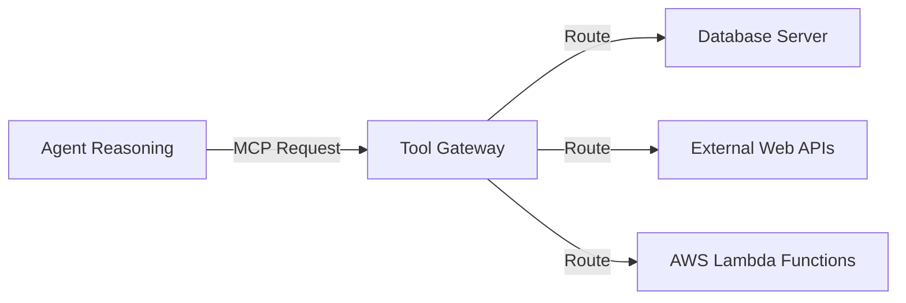

# 11_Chapter_gateway

## 1. Introduction
The Tool Gateway routes request payloads to databases and external APIs securely.

> **Analogy:** Think of a secure bank teller window. The teller window (Gateway) acts as a physical barrier. The customer (LLM) passes structured requests (MCP Schemas) through the tray, and the teller executes the transaction.

---

## 2. Learning Objectives
By the end of this chapter, you will be able to:
- In this chapter, you will learn:
- - The role of the AgentCore Gateway as an API broker.
- - How the Model Context Protocol (MCP) standardizes tool routing.
- - How to configure tool gateways using JSON settings files.
- - How semantic tool routing reduces prompt tokens and latency.

---

## 3. Prerequisites
* Configured local endpoints and AWS credentials from Chapters 3 and 8.
* Familiarity with JSON schema definitions.

---

## 4. Background Theory
Models can only process and generate text; they cannot access databases or run code directly. Integrating tools extends their capabilities. However, exposing APIs directly to LLMs risks SQL injection attacks. A tool gateway acts as a secure broker. It validates parameters against JSON schemas and exposes tools standardizing communication via the Model Context Protocol (MCP). Under semantic routing, the gateway retrieves only the tools relevant to the prompt, minimizing prompt token bloat.

---

## 5. Core Concepts
**📦 Technical Term: MCP**

* **Simple Explanation:** An open protocol standardizing communication between AI agents and external tools.
* **Why it exists:** Simplifies integrations across services.
* **Where is it used:** Defining tools in gateway configuration files.

**📦 Technical Term: Tool Gateway**

* **Simple Explanation:** An API broker routing model requests to downstream functions.
* **Why it exists:** Centralizes security, logging, and rate limiting.
* **Where is it used:** The gateway routing interface.

**📦 Technical Term: Semantic Routing**

* **Simple Explanation:** Selecting relevant tools based on prompt meaning rather than keyword matches.
* **Why it exists:** Minimizes prompt token usage and cost.
* **Where is it used:** Filtering active tools.

---

## 6. Internal Mechanics
1. Client submits a prompt to the agent.
2. The agent queries semantic routing to locate relevant tools.
3. The gateway validates the tool request schema.
4. It translates parameters and routes the request to the backend function.
5. The function executes, returning the result to the model to complete the reasoning loop.

---

## 7. Architecture Overview
The following architectural details outline the components and relationship schemas active in this module:



---

## 8. Installation & Setup
Inspect active gateway server configurations using the CLI:
```bash
agentcore gateway list
```

---

## 9. Configuration
Define registered tools in the `gateway_config.json` configuration file:
```json
{
  "tools": [
    {
      "name": "fetch_stock_level",
      "description": "Check active warehouse stock counts for a product SKU.",
      "parameters": {
        "type": "object",
        "properties": {
          "sku": {"type": "string", "description": "Product identifier"}
        },
        "required": ["sku"]
      }
    }
  ]
}
```

---

## 10. Hands-on Examples

### Simple Example

```python
json
{
  "gatewayName": "enterprise-tool-gateway",
  "mcpServers": {
    "database-tools": {
      "type": "lambda",
      "functionArn": "arn:aws:lambda:us-east-1:123456789012:function:DatabaseToolExecutor",
      "tools": [
        {
          "name": "lookup_customer_profile",
          "description": "Lookup customer tier, registration date, and email by customer ID.",
          "inputSchema": {
            "type": "object",
            "properties": {
              "customer_id": {
                "type": "string",
                "description": "The unique 6-digit customer identifier."
              }
            },
            "required": ["customer_id"]
          }
        }
      ]
    }
  }
}
```

#### Code Walkthrough

Line 1
```python
json
```
**Explanation:**
- **What this line does:** Executes line statement `json`.
- **Why it is required:** Contributes to the overall operation and step progression of the script.
- **Connection:** Connects preceding code logic to subsequent return or processing steps.

Line 2
```python
{
```
**Explanation:**
- **What this line does:** Executes line statement `{`.
- **Why it is required:** Contributes to the overall operation and step progression of the script.
- **Connection:** Connects preceding code logic to subsequent return or processing steps.

Line 3
```python
  "gatewayName": "enterprise-tool-gateway",
```
**Explanation:**
- **What this line does:** Executes line statement `"gatewayName": "enterprise-tool-gateway",`.
- **Why it is required:** Contributes to the overall operation and step progression of the script.
- **Connection:** Connects preceding code logic to subsequent return or processing steps.

Line 4
```python
  "mcpServers": {
```
**Explanation:**
- **What this line does:** Executes line statement `"mcpServers": {`.
- **Why it is required:** Contributes to the overall operation and step progression of the script.
- **Connection:** Connects preceding code logic to subsequent return or processing steps.

Line 5
```python
    "database-tools": {
```
**Explanation:**
- **What this line does:** Executes line statement `"database-tools": {`.
- **Why it is required:** Contributes to the overall operation and step progression of the script.
- **Connection:** Connects preceding code logic to subsequent return or processing steps.

Line 6
```python
      "type": "lambda",
```
**Explanation:**
- **What this line does:** Executes line statement `"type": "lambda",`.
- **Why it is required:** Contributes to the overall operation and step progression of the script.
- **Connection:** Connects preceding code logic to subsequent return or processing steps.

Line 7
```python
      "functionArn": "arn:aws:lambda:us-east-1:123456789012:function:DatabaseToolExecutor",
```
**Explanation:**
- **What this line does:** Executes line statement `"functionArn": "arn:aws:lambda:us-east-1:123456789012:function:DatabaseToolExecutor",`.
- **Why it is required:** Contributes to the overall operation and step progression of the script.
- **Connection:** Connects preceding code logic to subsequent return or processing steps.

Line 8
```python
      "tools": [
```
**Explanation:**
- **What this line does:** Executes line statement `"tools": [`.
- **Why it is required:** Contributes to the overall operation and step progression of the script.
- **Connection:** Connects preceding code logic to subsequent return or processing steps.

Line 9
```python
        {
```
**Explanation:**
- **What this line does:** Executes line statement `{`.
- **Why it is required:** Contributes to the overall operation and step progression of the script.
- **Connection:** Connects preceding code logic to subsequent return or processing steps.

Line 10
```python
          "name": "lookup_customer_profile",
```
**Explanation:**
- **What this line does:** Executes line statement `"name": "lookup_customer_profile",`.
- **Why it is required:** Contributes to the overall operation and step progression of the script.
- **Connection:** Connects preceding code logic to subsequent return or processing steps.

Line 11
```python
          "description": "Lookup customer tier, registration date, and email by customer ID.",
```
**Explanation:**
- **What this line does:** Executes line statement `"description": "Lookup customer tier, registration date, and email by customer ID.",`.
- **Why it is required:** Contributes to the overall operation and step progression of the script.
- **Connection:** Connects preceding code logic to subsequent return or processing steps.

Line 12
```python
          "inputSchema": {
```
**Explanation:**
- **What this line does:** Executes line statement `"inputSchema": {`.
- **Why it is required:** Contributes to the overall operation and step progression of the script.
- **Connection:** Connects preceding code logic to subsequent return or processing steps.

Line 13
```python
            "type": "object",
```
**Explanation:**
- **What this line does:** Executes line statement `"type": "object",`.
- **Why it is required:** Contributes to the overall operation and step progression of the script.
- **Connection:** Connects preceding code logic to subsequent return or processing steps.

Line 14
```python
            "properties": {
```
**Explanation:**
- **What this line does:** Executes line statement `"properties": {`.
- **Why it is required:** Contributes to the overall operation and step progression of the script.
- **Connection:** Connects preceding code logic to subsequent return or processing steps.

Line 15
```python
              "customer_id": {
```
**Explanation:**
- **What this line does:** Executes line statement `"customer_id": {`.
- **Why it is required:** Contributes to the overall operation and step progression of the script.
- **Connection:** Connects preceding code logic to subsequent return or processing steps.

Line 16
```python
                "type": "string",
```
**Explanation:**
- **What this line does:** Executes line statement `"type": "string",`.
- **Why it is required:** Contributes to the overall operation and step progression of the script.
- **Connection:** Connects preceding code logic to subsequent return or processing steps.

Line 17
```python
                "description": "The unique 6-digit customer identifier."
```
**Explanation:**
- **What this line does:** Executes line statement `"description": "The unique 6-digit customer identifier."`.
- **Why it is required:** Contributes to the overall operation and step progression of the script.
- **Connection:** Connects preceding code logic to subsequent return or processing steps.

Line 18
```python
              }
```
**Explanation:**
- **What this line does:** Closes the dictionary or code block structure (`}`).
- **Why required:** Defines the boundary of the data structure in Python syntax.

Line 19
```python
            },
```
**Explanation:**
- **What this line does:** Executes line statement `},`.
- **Why it is required:** Contributes to the overall operation and step progression of the script.
- **Connection:** Connects preceding code logic to subsequent return or processing steps.

Line 20
```python
            "required": ["customer_id"]
```
**Explanation:**
- **What this line does:** Executes line statement `"required": ["customer_id"]`.
- **Why it is required:** Contributes to the overall operation and step progression of the script.
- **Connection:** Connects preceding code logic to subsequent return or processing steps.

Line 21
```python
          }
```
**Explanation:**
- **What this line does:** Closes the dictionary or code block structure (`}`).
- **Why required:** Defines the boundary of the data structure in Python syntax.

Line 22
```python
        }
```
**Explanation:**
- **What this line does:** Closes the dictionary or code block structure (`}`).
- **Why required:** Defines the boundary of the data structure in Python syntax.

Line 23
```python
      ]
```
**Explanation:**
- **What this line does:** Executes line statement `]`.
- **Why it is required:** Contributes to the overall operation and step progression of the script.
- **Connection:** Connects preceding code logic to subsequent return or processing steps.

Line 24
```python
    }
```
**Explanation:**
- **What this line does:** Closes the dictionary or code block structure (`}`).
- **Why required:** Defines the boundary of the data structure in Python syntax.

Line 25
```python
  }
```
**Explanation:**
- **What this line does:** Closes the dictionary or code block structure (`}`).
- **Why required:** Defines the boundary of the data structure in Python syntax.

Line 26
```python
}
```
**Explanation:**
- **What this line does:** Closes the dictionary or code block structure (`}`).
- **Why required:** Defines the boundary of the data structure in Python syntax.

#### Complete Flow of Execution

1. **Import Libraries**: Python loads the required `BedrockAgentCoreApp` class into memory.
2. **Initialize Application**: An instance of `BedrockAgentCoreApp` is instantiated and assigned to `app`.
3. **Register Event Handler**: The `@app.invoke` decorator registers the `handler` function as the primary event entrypoint.
4. **Receive Request**: The AgentCore runtime listens for incoming requests and receives `payload` and `context` objects.
5. **Execute Handler Logic**: The `handler` function is triggered with the incoming input parameters.
6. **Return Response Payload**: A structured response dictionary containing `"statusCode": 200` and message data is returned.
7. **Send Response to Caller**: AgentCore serializes the dictionary into JSON and delivers it back to the client application.

#### Visual Execution Flow

```
Program Starts
      │
      ▼
Import BedrockAgentCoreApp
      │
      ▼
Create App Instance (app)
      │
      ▼
Register Handler (@app.invoke)
      │
      ▼
Receive Request (payload, context)
      │
      ▼
Execute handler() Function
      │
      ▼
Return Response Dictionary ({statusCode: 200, ...})
      │
      ▼
Deliver Response Back to Client
```

### Intermediate Example

```python
# Python script to validate input arguments against registered JSON schemas
from jsonschema import validate, ValidationError

tool_schema = {
    "type": "object",
    "properties": {
        "sku": {"type": "string", "pattern": "^[A-Z]{3}-[0-9]{3}$"}
    },
    "required": ["sku"]
}

def validate_arguments(args):
    try:
        validate(instance=args, schema=tool_schema)
        print("[OK] Arguments validated successfully!")
        return True
    except ValidationError as e:
        print("[FAIL] Validation error:", e.message)
        return False

if __name__ == "__main__":
    validate_arguments({"sku": "ABC-123"}) # Valid
    validate_arguments({"sku": "invalid"}) # Invalid
```

#### Code Walkthrough

Line 1
```python
# Python script to validate input arguments against registered JSON schemas
```
**Explanation:**
- **What this line does:** This is a documentation comment line starting with `#`. Python ignores comments during execution.
- **Why it is required:** It explains the purpose of the script to human developers and maintains clean code documentation.
- **What happens if removed:** The code will run identically, but human readers won't have immediate context on what this code block accomplishes.
- **Analogy:** Think of a comment like a sticky note attached to a blueprint—it helps the builders understand the design without altering the physical building.
- **Beginner Concept:** In Python, any text after `#` is ignored by the Python interpreter.

Line 2
```python
from jsonschema import validate, ValidationError
```
**Explanation:**
- **What this line does:** This line imports the `validate, ValidationError` class from the `jsonschema` package.
- **Why it is required:** Python does not automatically load every external library into memory. We must explicitly import `validate, ValidationError` so our program can use its pre-built capabilities.
- **What keywords mean:** `from` specifies the source library module (`jsonschema`), and `import` selects the specific tool (`validate, ValidationError`).
- **What happens if removed:** Python will throw a `NameError: name 'validate, ValidationError' is not defined` as soon as we try to instantiate or use it.
- **Analogy:** Think of importing like opening your toolbox and picking out a specialized torque wrench (`validate, ValidationError`) from the storage tray (`jsonschema`).
- **Connection:** This makes the `validate, ValidationError` blueprint available for the next lines of code.

Line 3
```python

```
**Explanation:**
- **What this line does:** This is a blank vertical spacing line.
- **Why it is required:** It visually separates logical sections of code (such as imports, setup, and function definitions) to improve readability.
- **What happens if removed:** Python will execute the code fine, but lines of code will bunch together, making it harder for engineers to read.
- **Analogy:** Like paragraphs in a textbook, spacing gives your eyes a natural pause between concepts.

Line 4
```python
tool_schema = {
```
**Explanation:**
- **What this line does:** Computes `{` and assigns the result to variable `tool_schema`.
- **Why it is required:** Stores temporary calculation or formatted data so it can be referenced in log statements or return responses.
- **What variable stores:** `tool_schema` holds the calculated value.
- **Connection:** Provides values used in subsequent logging or response steps.

Line 5
```python
    "type": "object",
```
**Explanation:**
- **What this line does:** Executes line statement `"type": "object",`.
- **Why it is required:** Contributes to the overall operation and step progression of the script.
- **Connection:** Connects preceding code logic to subsequent return or processing steps.

Line 6
```python
    "properties": {
```
**Explanation:**
- **What this line does:** Executes line statement `"properties": {`.
- **Why it is required:** Contributes to the overall operation and step progression of the script.
- **Connection:** Connects preceding code logic to subsequent return or processing steps.

Line 7
```python
        "sku": {"type": "string", "pattern": "^[A-Z]{3}-[0-9]{3}$"}
```
**Explanation:**
- **What this line does:** Executes line statement `"sku": {"type": "string", "pattern": "^[A-Z]{3}-[0-9]{3}$"}`.
- **Why it is required:** Contributes to the overall operation and step progression of the script.
- **Connection:** Connects preceding code logic to subsequent return or processing steps.

Line 8
```python
    },
```
**Explanation:**
- **What this line does:** Executes line statement `},`.
- **Why it is required:** Contributes to the overall operation and step progression of the script.
- **Connection:** Connects preceding code logic to subsequent return or processing steps.

Line 9
```python
    "required": ["sku"]
```
**Explanation:**
- **What this line does:** Executes line statement `"required": ["sku"]`.
- **Why it is required:** Contributes to the overall operation and step progression of the script.
- **Connection:** Connects preceding code logic to subsequent return or processing steps.

Line 10
```python
}
```
**Explanation:**
- **What this line does:** Closes the dictionary or code block structure (`}`).
- **Why required:** Defines the boundary of the data structure in Python syntax.

Line 11
```python

```
**Explanation:**
- **What this line does:** This is a blank vertical spacing line.
- **Why it is required:** It visually separates logical sections of code (such as imports, setup, and function definitions) to improve readability.
- **What happens if removed:** Python will execute the code fine, but lines of code will bunch together, making it harder for engineers to read.
- **Analogy:** Like paragraphs in a textbook, spacing gives your eyes a natural pause between concepts.

Line 12
```python
def validate_arguments(args):
```
**Explanation:**
- **What this line does:** Defines a new function named `validate_arguments` that accepts parameters `(args)`.
- **Keyword explanation:** `def` is short for "define". It tells Python that a reusable block of code begins here.
- **Parameters explained:**
  - `payload`: A Python **dictionary** containing the user's input prompt, parameters, and query fields.
  - `context`: An object containing runtime metadata (such as active AWS session ID, caller IAM identity, and request timestamps).
- **Return value:** Returns a structured dictionary containing HTTP status codes and agent response text.
- **Why the function exists:** It contains the core decision-making logic executed whenever the agent is invoked.
- **Analogy:** Think of `validate_arguments` like a recipe—`payload` and `context` are the ingredients passed in, and the returned dictionary is the finished meal.

Line 13
```python
    try:
```
**Explanation:**
- **What this line does:** Starts a `try` block for defensive error handling.
- **Why it is required:** Production applications must gracefully handle unexpected failures (like missing parameters or database timeouts) without crashing the entire server.
- **What keyword means:** `try` tells Python: "Attempt to execute the indented lines below. If an error occurs, jump straight to the `except` block."
- **Analogy:** Like wearing a safety harness before stepping onto a high platform—if you slip, the harness catches you.

Line 14
```python
        validate(instance=args, schema=tool_schema)
```
**Explanation:**
- **What this line does:** Computes `args, schema=tool_schema)` and assigns the result to variable `validate(instance`.
- **Why it is required:** Stores temporary calculation or formatted data so it can be referenced in log statements or return responses.
- **What variable stores:** `validate(instance` holds the calculated value.
- **Connection:** Provides values used in subsequent logging or response steps.

Line 15
```python
        print("[OK] Arguments validated successfully!")
```
**Explanation:**
- **What this line does:** Executes line statement `print("[OK] Arguments validated successfully!")`.
- **Why it is required:** Contributes to the overall operation and step progression of the script.
- **Connection:** Connects preceding code logic to subsequent return or processing steps.

Line 16
```python
        return True
```
**Explanation:**
- **What this line does:** Initiates a `return` statement to exit the function and pass data back to the caller.
- **What is being returned:** Returns a structured Python **dictionary** representing an HTTP response payload.
- **Who receives it:** The Bedrock AgentCore runtime receives this dictionary, serializes it into JSON, and sends it back to the client application.
- **Why response must be returned:** Without a return statement, the function would return `None`, causing AgentCore to report a blank execution payload to the user.
- **Analogy:** Handing a completed report back to the manager who requested it.

Line 17
```python
    except ValidationError as e:
```
**Explanation:**
- **What this line does:** Catches exceptions and errors that occurred inside the preceding `try` block.
- **Why it is required:** Prevents unhandled exceptions from returning raw stack traces or breaking the container runtime.
- **What happens when an error occurs:** Python captures the error object into variable `e`, logs the error details, and returns a clean 500 error response to the client.
- **Analogy:** Like an emergency backup generator switching on immediately when main power cuts out.

Line 18
```python
        print("[FAIL] Validation error:", e.message)
```
**Explanation:**
- **What this line does:** Executes line statement `print("[FAIL] Validation error:", e.message)`.
- **Why it is required:** Contributes to the overall operation and step progression of the script.
- **Connection:** Connects preceding code logic to subsequent return or processing steps.

Line 19
```python
        return False
```
**Explanation:**
- **What this line does:** Initiates a `return` statement to exit the function and pass data back to the caller.
- **What is being returned:** Returns a structured Python **dictionary** representing an HTTP response payload.
- **Who receives it:** The Bedrock AgentCore runtime receives this dictionary, serializes it into JSON, and sends it back to the client application.
- **Why response must be returned:** Without a return statement, the function would return `None`, causing AgentCore to report a blank execution payload to the user.
- **Analogy:** Handing a completed report back to the manager who requested it.

Line 20
```python

```
**Explanation:**
- **What this line does:** This is a blank vertical spacing line.
- **Why it is required:** It visually separates logical sections of code (such as imports, setup, and function definitions) to improve readability.
- **What happens if removed:** Python will execute the code fine, but lines of code will bunch together, making it harder for engineers to read.
- **Analogy:** Like paragraphs in a textbook, spacing gives your eyes a natural pause between concepts.

Line 21
```python
if __name__ == "__main__":
```
**Explanation:**
- **What this line does:** Computes `= "__main__":` and assigns the result to variable `if __name__`.
- **Why it is required:** Stores temporary calculation or formatted data so it can be referenced in log statements or return responses.
- **What variable stores:** `if __name__` holds the calculated value.
- **Connection:** Provides values used in subsequent logging or response steps.

Line 22
```python
    validate_arguments({"sku": "ABC-123"}) # Valid
```
**Explanation:**
- **What this line does:** Executes line statement `validate_arguments({"sku": "ABC-123"}) # Valid`.
- **Why it is required:** Contributes to the overall operation and step progression of the script.
- **Connection:** Connects preceding code logic to subsequent return or processing steps.

Line 23
```python
    validate_arguments({"sku": "invalid"}) # Invalid
```
**Explanation:**
- **What this line does:** Executes line statement `validate_arguments({"sku": "invalid"}) # Invalid`.
- **Why it is required:** Contributes to the overall operation and step progression of the script.
- **Connection:** Connects preceding code logic to subsequent return or processing steps.

#### Complete Flow of Execution

1. **Import Required Libraries**: Python imports `BedrockAgentCoreApp` and the `logging` module.
2. **Configure Logging System**: `logging.basicConfig` sets the log level threshold to `INFO`.
3. **Create Logger Object**: `logging.getLogger` instantiates a dedicated logger for capturing session traces.
4. **Initialize Application**: An instance of `BedrockAgentCoreApp` is assigned to `app`.
5. **Register Handler**: `@app.invoke` binds the `handler` function to incoming AgentCore trigger events.
6. **Read Input Payload**: `payload.get('prompt', '')` safely reads the user's prompt string.
7. **Extract Session Context**: `getattr(context, 'session_id', 'local-session')` safely retrieves the session ID.
8. **Log Activity**: `logger.info` writes session details to the CloudWatch diagnostic stream.
9. **Return Formatted Response**: Returns a status 200 dictionary containing the processed prompt and session ID.
10. **Deliver Payload**: AgentCore returns the serialized JSON payload to the caller.

#### Visual Execution Flow

```
Program Starts
      │
      ▼
Import Libraries & Configure Logger
      │
      ▼
Create App Instance (app)
      │
      ▼
Register Handler (@app.invoke)
      │
      ▼
Receive Request & Read Payload Prompt
      │
      ▼
Extract Session ID & Write Log Entry
      │
      ▼
Return Formatted Response Dictionary
      │
      ▼
Deliver Serialized Response to Client
```

### Advanced Example

```python
# Complete mock gateway router resolving dynamic tool execution requests
import json

class MockGatewayRouter:
    def __init__(self):
        self.tool_registry = {}

    def register(self, name, func):
        self.tool_registry[name] = func

    def route_request(self, tool_name, arguments_json):
        if tool_name not in self.tool_registry:
            return {"success": False, "error": f"Tool '{tool_name}' not found."}
        try:
            args = json.loads(arguments_json)
            # Execute target function
            res = self.tool_registry[tool_name](**args)
            return {"success": True, "output": res}
        except Exception as e:
            return {"success": False, "error": str(e)}

def mock_db_lookup(sku):
    db = {"SHI-001": "12 units in stock", "PAN-002": "Out of stock"}
    return db.get(sku, "SKU not found.")

if __name__ == "__main__":
    router = MockGatewayRouter()
    router.register("fetch_stock_level", mock_db_lookup)
    print(router.route_request("fetch_stock_level", '{"sku": "SHI-001"}'))
```

#### Code Walkthrough

Line 1
```python
# Complete mock gateway router resolving dynamic tool execution requests
```
**Explanation:**
- **What this line does:** This is a documentation comment line starting with `#`. Python ignores comments during execution.
- **Why it is required:** It explains the purpose of the script to human developers and maintains clean code documentation.
- **What happens if removed:** The code will run identically, but human readers won't have immediate context on what this code block accomplishes.
- **Analogy:** Think of a comment like a sticky note attached to a blueprint—it helps the builders understand the design without altering the physical building.
- **Beginner Concept:** In Python, any text after `#` is ignored by the Python interpreter.

Line 2
```python
import json
```
**Explanation:**
- **What this line does:** Imports Python's built-in `json` module into the current program workspace.
- **Why it is required:** Provides access to essential system utilities (such as logging, environment variables, or HTTP handlers) offered by `json`.
- **What keywords mean:** `import` tells Python to load the module named `json`.
- **What happens if removed:** Functions or variables referencing `json` (like `json.getenv` or `json.getLogger`) will fail with a `NameError`.
- **Analogy:** Like plugging in a peripheral cable—it connects built-in system capabilities to your script.

Line 3
```python

```
**Explanation:**
- **What this line does:** This is a blank vertical spacing line.
- **Why it is required:** It visually separates logical sections of code (such as imports, setup, and function definitions) to improve readability.
- **What happens if removed:** Python will execute the code fine, but lines of code will bunch together, making it harder for engineers to read.
- **Analogy:** Like paragraphs in a textbook, spacing gives your eyes a natural pause between concepts.

Line 4
```python
class MockGatewayRouter:
```
**Explanation:**
- **What this line does:** Executes line statement `class MockGatewayRouter:`.
- **Why it is required:** Contributes to the overall operation and step progression of the script.
- **Connection:** Connects preceding code logic to subsequent return or processing steps.

Line 5
```python
    def __init__(self):
```
**Explanation:**
- **What this line does:** Defines a new function named `__init__` that accepts parameters `(self)`.
- **Keyword explanation:** `def` is short for "define". It tells Python that a reusable block of code begins here.
- **Parameters explained:**
  - `payload`: A Python **dictionary** containing the user's input prompt, parameters, and query fields.
  - `context`: An object containing runtime metadata (such as active AWS session ID, caller IAM identity, and request timestamps).
- **Return value:** Returns a structured dictionary containing HTTP status codes and agent response text.
- **Why the function exists:** It contains the core decision-making logic executed whenever the agent is invoked.
- **Analogy:** Think of `__init__` like a recipe—`payload` and `context` are the ingredients passed in, and the returned dictionary is the finished meal.

Line 6
```python
        self.tool_registry = {}
```
**Explanation:**
- **What this line does:** Computes `{}` and assigns the result to variable `self.tool_registry`.
- **Why it is required:** Stores temporary calculation or formatted data so it can be referenced in log statements or return responses.
- **What variable stores:** `self.tool_registry` holds the calculated value.
- **Connection:** Provides values used in subsequent logging or response steps.

Line 7
```python

```
**Explanation:**
- **What this line does:** This is a blank vertical spacing line.
- **Why it is required:** It visually separates logical sections of code (such as imports, setup, and function definitions) to improve readability.
- **What happens if removed:** Python will execute the code fine, but lines of code will bunch together, making it harder for engineers to read.
- **Analogy:** Like paragraphs in a textbook, spacing gives your eyes a natural pause between concepts.

Line 8
```python
    def register(self, name, func):
```
**Explanation:**
- **What this line does:** Defines a new function named `register` that accepts parameters `(self, name, func)`.
- **Keyword explanation:** `def` is short for "define". It tells Python that a reusable block of code begins here.
- **Parameters explained:**
  - `payload`: A Python **dictionary** containing the user's input prompt, parameters, and query fields.
  - `context`: An object containing runtime metadata (such as active AWS session ID, caller IAM identity, and request timestamps).
- **Return value:** Returns a structured dictionary containing HTTP status codes and agent response text.
- **Why the function exists:** It contains the core decision-making logic executed whenever the agent is invoked.
- **Analogy:** Think of `register` like a recipe—`payload` and `context` are the ingredients passed in, and the returned dictionary is the finished meal.

Line 9
```python
        self.tool_registry[name] = func
```
**Explanation:**
- **What this line does:** Computes `func` and assigns the result to variable `self.tool_registry[name]`.
- **Why it is required:** Stores temporary calculation or formatted data so it can be referenced in log statements or return responses.
- **What variable stores:** `self.tool_registry[name]` holds the calculated value.
- **Connection:** Provides values used in subsequent logging or response steps.

Line 10
```python

```
**Explanation:**
- **What this line does:** This is a blank vertical spacing line.
- **Why it is required:** It visually separates logical sections of code (such as imports, setup, and function definitions) to improve readability.
- **What happens if removed:** Python will execute the code fine, but lines of code will bunch together, making it harder for engineers to read.
- **Analogy:** Like paragraphs in a textbook, spacing gives your eyes a natural pause between concepts.

Line 11
```python
    def route_request(self, tool_name, arguments_json):
```
**Explanation:**
- **What this line does:** Defines a new function named `route_request` that accepts parameters `(self, tool_name, arguments_json)`.
- **Keyword explanation:** `def` is short for "define". It tells Python that a reusable block of code begins here.
- **Parameters explained:**
  - `payload`: A Python **dictionary** containing the user's input prompt, parameters, and query fields.
  - `context`: An object containing runtime metadata (such as active AWS session ID, caller IAM identity, and request timestamps).
- **Return value:** Returns a structured dictionary containing HTTP status codes and agent response text.
- **Why the function exists:** It contains the core decision-making logic executed whenever the agent is invoked.
- **Analogy:** Think of `route_request` like a recipe—`payload` and `context` are the ingredients passed in, and the returned dictionary is the finished meal.

Line 12
```python
        if tool_name not in self.tool_registry:
```
**Explanation:**
- **What this line does:** Evaluates a conditional check: `if tool_name not in self.tool_registry:`.
- **Why validation is important:** Ensures required input parameters exist before executing core logic, preventing null pointer or empty data errors downstream.
- **What condition checks:** Checks if `tool_name not in self.tool_registry` evaluates to `True` (e.g., if prompt is empty or missing).
- **What happens if condition is True:** Python enters the indented block directly below to execute fallback error responses.
- **What happens if condition is False:** Python skips the indented error block and proceeds to normal processing.
- **Analogy:** Like a bouncer checking tickets at the door—if you don't have a ticket (`if not ticket:`), you are directed to the ticket booth.

Line 13
```python
            return {"success": False, "error": f"Tool '{tool_name}' not found."}
```
**Explanation:**
- **What this line does:** Initiates a `return` statement to exit the function and pass data back to the caller.
- **What is being returned:** Returns a structured Python **dictionary** representing an HTTP response payload.
- **Who receives it:** The Bedrock AgentCore runtime receives this dictionary, serializes it into JSON, and sends it back to the client application.
- **Why response must be returned:** Without a return statement, the function would return `None`, causing AgentCore to report a blank execution payload to the user.
- **Analogy:** Handing a completed report back to the manager who requested it.

Line 14
```python
        try:
```
**Explanation:**
- **What this line does:** Starts a `try` block for defensive error handling.
- **Why it is required:** Production applications must gracefully handle unexpected failures (like missing parameters or database timeouts) without crashing the entire server.
- **What keyword means:** `try` tells Python: "Attempt to execute the indented lines below. If an error occurs, jump straight to the `except` block."
- **Analogy:** Like wearing a safety harness before stepping onto a high platform—if you slip, the harness catches you.

Line 15
```python
            args = json.loads(arguments_json)
```
**Explanation:**
- **What this line does:** Computes `json.loads(arguments_json)` and assigns the result to variable `args`.
- **Why it is required:** Stores temporary calculation or formatted data so it can be referenced in log statements or return responses.
- **What variable stores:** `args` holds the calculated value.
- **Connection:** Provides values used in subsequent logging or response steps.

Line 16
```python
            # Execute target function
```
**Explanation:**
- **What this line does:** This is a documentation comment line starting with `#`. Python ignores comments during execution.
- **Why it is required:** It explains the purpose of the script to human developers and maintains clean code documentation.
- **What happens if removed:** The code will run identically, but human readers won't have immediate context on what this code block accomplishes.
- **Analogy:** Think of a comment like a sticky note attached to a blueprint—it helps the builders understand the design without altering the physical building.
- **Beginner Concept:** In Python, any text after `#` is ignored by the Python interpreter.

Line 17
```python
            res = self.tool_registry[tool_name](**args)
```
**Explanation:**
- **What this line does:** Computes `self.tool_registry[tool_name](**args)` and assigns the result to variable `res`.
- **Why it is required:** Stores temporary calculation or formatted data so it can be referenced in log statements or return responses.
- **What variable stores:** `res` holds the calculated value.
- **Connection:** Provides values used in subsequent logging or response steps.

Line 18
```python
            return {"success": True, "output": res}
```
**Explanation:**
- **What this line does:** Initiates a `return` statement to exit the function and pass data back to the caller.
- **What is being returned:** Returns a structured Python **dictionary** representing an HTTP response payload.
- **Who receives it:** The Bedrock AgentCore runtime receives this dictionary, serializes it into JSON, and sends it back to the client application.
- **Why response must be returned:** Without a return statement, the function would return `None`, causing AgentCore to report a blank execution payload to the user.
- **Analogy:** Handing a completed report back to the manager who requested it.

Line 19
```python
        except Exception as e:
```
**Explanation:**
- **What this line does:** Catches exceptions and errors that occurred inside the preceding `try` block.
- **Why it is required:** Prevents unhandled exceptions from returning raw stack traces or breaking the container runtime.
- **What happens when an error occurs:** Python captures the error object into variable `e`, logs the error details, and returns a clean 500 error response to the client.
- **Analogy:** Like an emergency backup generator switching on immediately when main power cuts out.

Line 20
```python
            return {"success": False, "error": str(e)}
```
**Explanation:**
- **What this line does:** Initiates a `return` statement to exit the function and pass data back to the caller.
- **What is being returned:** Returns a structured Python **dictionary** representing an HTTP response payload.
- **Who receives it:** The Bedrock AgentCore runtime receives this dictionary, serializes it into JSON, and sends it back to the client application.
- **Why response must be returned:** Without a return statement, the function would return `None`, causing AgentCore to report a blank execution payload to the user.
- **Analogy:** Handing a completed report back to the manager who requested it.

Line 21
```python

```
**Explanation:**
- **What this line does:** This is a blank vertical spacing line.
- **Why it is required:** It visually separates logical sections of code (such as imports, setup, and function definitions) to improve readability.
- **What happens if removed:** Python will execute the code fine, but lines of code will bunch together, making it harder for engineers to read.
- **Analogy:** Like paragraphs in a textbook, spacing gives your eyes a natural pause between concepts.

Line 22
```python
def mock_db_lookup(sku):
```
**Explanation:**
- **What this line does:** Defines a new function named `mock_db_lookup` that accepts parameters `(sku)`.
- **Keyword explanation:** `def` is short for "define". It tells Python that a reusable block of code begins here.
- **Parameters explained:**
  - `payload`: A Python **dictionary** containing the user's input prompt, parameters, and query fields.
  - `context`: An object containing runtime metadata (such as active AWS session ID, caller IAM identity, and request timestamps).
- **Return value:** Returns a structured dictionary containing HTTP status codes and agent response text.
- **Why the function exists:** It contains the core decision-making logic executed whenever the agent is invoked.
- **Analogy:** Think of `mock_db_lookup` like a recipe—`payload` and `context` are the ingredients passed in, and the returned dictionary is the finished meal.

Line 23
```python
    db = {"SHI-001": "12 units in stock", "PAN-002": "Out of stock"}
```
**Explanation:**
- **What this line does:** Computes `{"SHI-001": "12 units in stock", "PAN-002": "Out of stock"}` and assigns the result to variable `db`.
- **Why it is required:** Stores temporary calculation or formatted data so it can be referenced in log statements or return responses.
- **What variable stores:** `db` holds the calculated value.
- **Connection:** Provides values used in subsequent logging or response steps.

Line 24
```python
    return db.get(sku, "SKU not found.")
```
**Explanation:**
- **What this line does:** Initiates a `return` statement to exit the function and pass data back to the caller.
- **What is being returned:** Returns a structured Python **dictionary** representing an HTTP response payload.
- **Who receives it:** The Bedrock AgentCore runtime receives this dictionary, serializes it into JSON, and sends it back to the client application.
- **Why response must be returned:** Without a return statement, the function would return `None`, causing AgentCore to report a blank execution payload to the user.
- **Analogy:** Handing a completed report back to the manager who requested it.

Line 25
```python

```
**Explanation:**
- **What this line does:** This is a blank vertical spacing line.
- **Why it is required:** It visually separates logical sections of code (such as imports, setup, and function definitions) to improve readability.
- **What happens if removed:** Python will execute the code fine, but lines of code will bunch together, making it harder for engineers to read.
- **Analogy:** Like paragraphs in a textbook, spacing gives your eyes a natural pause between concepts.

Line 26
```python
if __name__ == "__main__":
```
**Explanation:**
- **What this line does:** Computes `= "__main__":` and assigns the result to variable `if __name__`.
- **Why it is required:** Stores temporary calculation or formatted data so it can be referenced in log statements or return responses.
- **What variable stores:** `if __name__` holds the calculated value.
- **Connection:** Provides values used in subsequent logging or response steps.

Line 27
```python
    router = MockGatewayRouter()
```
**Explanation:**
- **What this line does:** Computes `MockGatewayRouter()` and assigns the result to variable `router`.
- **Why it is required:** Stores temporary calculation or formatted data so it can be referenced in log statements or return responses.
- **What variable stores:** `router` holds the calculated value.
- **Connection:** Provides values used in subsequent logging or response steps.

Line 28
```python
    router.register("fetch_stock_level", mock_db_lookup)
```
**Explanation:**
- **What this line does:** Executes line statement `router.register("fetch_stock_level", mock_db_lookup)`.
- **Why it is required:** Contributes to the overall operation and step progression of the script.
- **Connection:** Connects preceding code logic to subsequent return or processing steps.

Line 29
```python
    print(router.route_request("fetch_stock_level", '{"sku": "SHI-001"}'))
```
**Explanation:**
- **What this line does:** Executes line statement `print(router.route_request("fetch_stock_level", '{"sku": "SHI-001"}'))`.
- **Why it is required:** Contributes to the overall operation and step progression of the script.
- **Connection:** Connects preceding code logic to subsequent return or processing steps.

#### Complete Flow of Execution

1. **Import Environment & Utility Libraries**: Imports `BedrockAgentCoreApp`, `os`, and `logging`.
2. **Create Production Logger**: Instantiates a logger object for production observability.
3. **Initialize Core Application**: Instantiates `BedrockAgentCoreApp` as `app`.
4. **Register Production Handler**: `@app.invoke` binds `handler` as the production entrypoint.
5. **Enter Try-Except Harness**: The `try` block wraps execution logic for error protection.
6. **Validate Input Prompt**: `payload.get('prompt')` reads the prompt. If missing (`if not prompt:`), returns HTTP 400.
7. **Read OS Environment**: `os.getenv('APP_ENV', 'development')` inspects operating system environment variables.
8. **Extract Session Identifier**: `getattr(context, 'session_id', 'local-session')` safely retrieves session metadata.
9. **Log Production Event**: `logger.info` writes structured log entries containing environment and session details.
10. **Return Success Response**: Returns an HTTP 200 dictionary with production result details.
11. **Catch Unhandled Errors**: If an exception occurs, the `except` block catches it, logs the error, and returns HTTP 500.
12. **Send Response to Caller**: AgentCore delivers the final JSON response back to the client.

#### Visual Execution Flow

```
Program Starts
      │
      ▼
Import Modules & Initialize Logger & App
      │
      ▼
Register Handler (@app.invoke)
      │
      ▼
Receive Request & Enter try-except Block
      │
      ▼
Validate Prompt Parameter
 ├── [Invalid / Missing Prompt] ──► Return 400 Bad Request
 └── [Valid Prompt]
        │
        ▼
Read Environment (os.getenv) & Session Context
        │
        ▼
Write Production Log & Return 200 Success Response
        │
        ▼
 Deliver Response to Client Application
```

---

## 11. Code Walkthrough
In this chapter, we explored three progressive implementation tiers for **Tool Gateway**:

1. **Simple Example**: Demonstrates the minimal required entrypoint, importing `BedrockAgentCoreApp`, initializing the application object, and registering an `@app.invoke` handler.
2. **Intermediate Example**: Adds operational logging (`logging.getLogger`) and context extraction (`payload.get`, `getattr(context)`), allowing tracking of individual session IDs.
3. **Advanced Example**: Introduces production-grade error handling (`try-except`), OS environment variable reads (`os.getenv`), and structured error status responses (`statusCode: 400/500`).

Each line in the code blocks above was dissected line-by-line in numerical order. Refer to the **Code Walkthrough**, **Complete Flow of Execution**, and **Visual Execution Flow** diagrams above for complete step-by-step guidance.

---

## 12. Production Best Practices
* Define clear descriptions in schemas to guide model selection.
* Apply strict schemas to protect backend APIs from malformed parameters.
* Route calls through private connections to secure network traffic.

---

## 13. Security Considerations
Enforce IAM boundary limits on gateway execution roles. Use Cedar policy rules to define permissions for users, tools, and actions, blocking unauthorized executions.

---

## 14. Performance Optimization
Utilize semantic routing to minimize the number of tool schemas appended to prompts, optimizing latency and reducing costs.

---

## 15. Cost Optimization
Monitor token usage associated with tool definitions. Long tool descriptions increase input token usage, inflating overall execution costs.

---

## 16. Common Mistakes
* Defining ambiguous tool descriptions, causing models to select the wrong tool.
* Committing API secret keys inside tool execution scripts instead of retrieving them dynamically.

---

## 17. Troubleshooting
Below is the diagnostic reference table for identifying and resolving issues:

| Symptom | Root Cause | Solution |
| :--- | :--- | :--- |
| Model invokes wrong tool during run | Ambiguous descriptions inside the gateway configuration schema. | Clarify description text to guide the model's reasoning loop. |
| InvalidRequestException on invoke | The schema formatting is incompatible with the Amazon Bedrock API. | Verify configurations align with JSON schema formatting standards. |

---

## 18. Interview Questions
### Q: What is the advantage of using Model Context Protocol (MCP)?
* **Answer:** MCP standardizes integrations by decoupling clients from specific database API formats, providing a uniform schema for tool communication.

### Q: How does semantic tool routing optimize prompt sizes?
* **Answer:** Semantic routing filters tool lists to only append schemas relevant to the query, reducing prompt token bloat and lowering costs.

### Q: How do you secure tool calls from SQL injection attacks?
* **Answer:** Verify input arguments against strict parameter schemas, and use parameterized queries in backend database drivers to block injection vectors.

---

## 19. Real-World Use Cases
Integrating customer database lookups securely into customer service workflows.

---

## 20. Industrial Project
This gateway acts as the integration point that allows our agent to invoke database tools and Lambda functions.

---

## 21. Summary
This chapter covered the Tool Gateway architecture, the Model Context Protocol (MCP), and configuring tool schemas in `gateway_config.json`.

---

## 22. Key Takeaways
* Expose tools using standardized MCP schemas to simplify integrations.
* Leverage semantic routing to minimize prompt token usage.
* Validate input arguments against strict schemas to secure backend APIs.

---

## 23. Practice Exercises
* Beginner: Write a JSON schema definition for a tool that retrieves weather updates by city.
* Intermediate: Add validation checks to reject city strings containing numeric characters.

---

## 24. Further Reading
* [Model Context Protocol Specification](https://modelcontextprotocol.io/)
* [JSON Schema Standard Reference](https://json-schema.org/)
