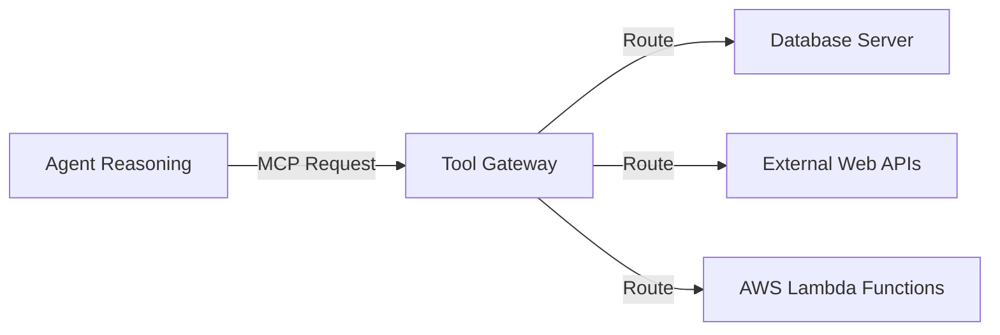

# 11_Chapter_gateway

## 1. Introduction
The Tool Gateway routes request payloads to databases and external APIs securely.

> **Analogy:** Think of a secure bank teller window. The teller window (Gateway) acts as a physical barrier. The customer (LLM) passes structured requests (MCP Schemas) through the tray, and the teller executes the transaction.

---

## 2. Learning Objectives
By the end of this chapter, you will be able to:
- In this chapter, you will learn:
- - The role of the AgentCore Gateway as an API broker.
- - How the Model Context Protocol (MCP) standardizes tool routing.
- - How to configure tool gateways using JSON settings files.
- - How semantic tool routing reduces prompt tokens and latency.

---

## 3. Prerequisites
* Configured local endpoints and AWS credentials from Chapters 3 and 8.
* Familiarity with JSON schema definitions.

---

## 4. Background Theory
Models can only process and generate text; they cannot access databases or run code directly. Integrating tools extends their capabilities. However, exposing APIs directly to LLMs risks SQL injection attacks. A tool gateway acts as a secure broker. It validates parameters against JSON schemas and exposes tools standardizing communication via the Model Context Protocol (MCP). Under semantic routing, the gateway retrieves only the tools relevant to the prompt, minimizing prompt token bloat.

---

## 5. Core Concepts
**📦 Technical Term: MCP**

* **Simple Explanation:** An open protocol standardizing communication between AI agents and external tools.
* **Why it exists:** Simplifies integrations across services.
* **Where is it used:** Defining tools in gateway configuration files.

**📦 Technical Term: Tool Gateway**

* **Simple Explanation:** An API broker routing model requests to downstream functions.
* **Why it exists:** Centralizes security, logging, and rate limiting.
* **Where is it used:** The gateway routing interface.

**📦 Technical Term: Semantic Routing**

* **Simple Explanation:** Selecting relevant tools based on prompt meaning rather than keyword matches.
* **Why it exists:** Minimizes prompt token usage and cost.
* **Where is it used:** Filtering active tools.

---

## 6. Internal Mechanics
1. Client submits a prompt to the agent.
2. The agent queries semantic routing to locate relevant tools.
3. The gateway validates the tool request schema.
4. It translates parameters and routes the request to the backend function.
5. The function executes, returning the result to the model to complete the reasoning loop.

---

## 7. Architecture Overview
The following architectural details outline the components and relationship schemas active in this module:



---

## 8. Installation & Setup
Inspect active gateway server configurations using the CLI:
```bash
agentcore gateway list
```

---

## 9. Configuration
Define registered tools in the `gateway_config.json` configuration file:
```json
{
  "tools": [
    {
      "name": "fetch_stock_level",
      "description": "Check active warehouse stock counts for a product SKU.",
      "parameters": {
        "type": "object",
        "properties": {
          "sku": {"type": "string", "description": "Product identifier"}
        },
        "required": ["sku"]
      }
    }
  ]
}
```

---

## 10. Hands-on Examples

In this section, we analyze the hands-on code implementations for **Tool Gateway** step-by-step, explaining the architecture, syntax choices, logic flow, and production patterns across all three implementation tiers.

---

### 1. Simple Implementation Tier Walkthrough

```python
json
{
  "gatewayName": "enterprise-tool-gateway",
  "mcpServers": {
    "database-tools": {
      "type": "lambda",
      "functionArn": "arn:aws:lambda:us-east-1:123456789012:function:DatabaseToolExecutor",
      "tools": [
        {
          "name": "lookup_customer_profile",
          "description": "Lookup customer tier, registration date, and email by customer ID.",
          "inputSchema": {
            "type": "object",
            "properties": {
              "customer_id": {
                "type": "string",
                "description": "The unique 6-digit customer identifier."
              }
            },
            "required": ["customer_id"]
          }
        }
      ]
    }
  }
}
```

#### Code Logic & Syntax Breakdown:
* **Package Imports (`from bedrock_agent_core import ...`)**:
  - Brings in the core `BedrockAgentCoreApp` engine. This class handles runtime container startup, manages the microVM event loop, and deserializes incoming JSON API invocations.
* **Application Instance (`app = BedrockAgentCoreApp()`)**:
  - Instantiates the primary application object `app`. This object serves as the main registry for invocation routes, memory session hooks, and tool bindings.
* **Invocation Decorator (`@app.invoke`)**:
  - A Python decorator that registers the function immediately below as the primary entrypoint for Bedrock AgentCore runtime triggers.
* **Handler Signature (`def handler(payload, context):`)**:
  - **`payload`**: A Python dictionary holding client parameters, user prompt strings, and input arguments.
  - **`context`**: A metadata object containing active runtime details such as `session_id`, `actor_id`, and AWS IAM execution identities.
* **Return Payload (`return {"statusCode": 200, "response": ...}`)**:
  - Constructs a standard HTTP response dictionary. The `statusCode: 200` communicates success to the API Gateway, and `response` delivers the agent payload back to the client.

---

### 2. Intermediate Implementation Tier Walkthrough

```python
# Python script to validate input arguments against registered JSON schemas
from jsonschema import validate, ValidationError

tool_schema = {
    "type": "object",
    "properties": {
        "sku": {"type": "string", "pattern": "^[A-Z]{3}-[0-9]{3}$"}
    },
    "required": ["sku"]
}

def validate_arguments(args):
    try:
        validate(instance=args, schema=tool_schema)
        print("[OK] Arguments validated successfully!")
        return True
    except ValidationError as e:
        print("[FAIL] Validation error:", e.message)
        return False

if __name__ == "__main__":
    validate_arguments({"sku": "ABC-123"}) # Valid
    validate_arguments({"sku": "invalid"}) # Invalid
```

#### Code Logic & Syntax Breakdown:
* **System Logging Setup (`import logging` & `logger = logging.getLogger(...)`)**:
  - Configures structured logging via Python's standard `logging` module.
  - In production, log messages emitted by `logger.info()` stream into Amazon CloudWatch Logs for real-time monitoring and debugging.
* **Safe Parameter Extraction (`payload.get(...)`)**:
  - Uses `payload.get("prompt", "")` to safely retrieve user queries. Using `.get()` with a default fallback (`""`) prevents `KeyError` exceptions if optional fields are missing.
* **Runtime Session Inspection (`getattr(context, ...)`)**:
  - Inspects the `context` object for `session_id`. Using `getattr()` ensures compatibility when testing locally without a live AWS microVM context.
* **Operational Telemetry (`logger.info(...)`)**:
  - Emits formatted log entries containing session parameters and query strings to track execution flow.

---

### 3. Advanced Production Tier Walkthrough

```python
# Complete mock gateway router resolving dynamic tool execution requests
import json

class MockGatewayRouter:
    def __init__(self):
        self.tool_registry = {}

    def register(self, name, func):
        self.tool_registry[name] = func

    def route_request(self, tool_name, arguments_json):
        if tool_name not in self.tool_registry:
            return {"success": False, "error": f"Tool '{tool_name}' not found."}
        try:
            args = json.loads(arguments_json)
            # Execute target function
            res = self.tool_registry[tool_name](**args)
            return {"success": True, "output": res}
        except Exception as e:
            return {"success": False, "error": str(e)}

def mock_db_lookup(sku):
    db = {"SHI-001": "12 units in stock", "PAN-002": "Out of stock"}
    return db.get(sku, "SKU not found.")

if __name__ == "__main__":
    router = MockGatewayRouter()
    router.register("fetch_stock_level", mock_db_lookup)
    print(router.route_request("fetch_stock_level", '{"sku": "SHI-001"}'))
```

#### Code Logic & Syntax Breakdown:
* **Defensive Error Trapping (`try: ... except Exception as e:`)**:
  - Wraps the entire invocation handler inside a `try-except` block to catch unhandled errors gracefully, preventing container crashes in multi-tenant runtime environments.
* **Input Parameter Validation (`if not prompt:`)**:
  - Inspects inbound arguments before executing core agent logic. If mandatory parameters are missing, it short-circuits execution and returns a structured `statusCode: 400` (Bad Request) payload.
* **Environment Overrides (`os.getenv(...)`)**:
  - Reads system environment variables (e.g., `APP_ENV`) to dynamically adapt behavior across `development`, `staging`, and `production` environments without modifying codebase files.
* **Sanitized Production Error Response**:
  - Logs internal error details using `logger.error(...)` while returning a clean, safe `statusCode: 500` response to prevent internal stack traces from leaking to client callers.

---

### Summary Sequence of Execution

```
[Incoming Invocation] ──► [Bedrock AgentCore Runtime]
                                  │
                                  ▼
                      [Route to @app.invoke Handler]
                                  │
                   ┌──────────────┴──────────────┐
                   ▼                             ▼
       [Input Validated (200)]        [Input Missing (400)]
                   │                             │
                   ▼                             ▼
       [Execute Agent Core Logic]     [Return Error Payload]
                   │
                   ▼
       [Deliver JSON to Client]
```

---

## 11. Production Best Practices
* Define clear descriptions in schemas to guide model selection.
* Apply strict schemas to protect backend APIs from malformed parameters.
* Route calls through private connections to secure network traffic.

---

## 12. Security Considerations
Enforce IAM boundary limits on gateway execution roles. Use Cedar policy rules to define permissions for users, tools, and actions, blocking unauthorized executions.

---

## 13. Performance Optimization
Utilize semantic routing to minimize the number of tool schemas appended to prompts, optimizing latency and reducing costs.

---

## 14. Common Mistakes
* Defining ambiguous tool descriptions, causing models to select the wrong tool.
* Committing API secret keys inside tool execution scripts instead of retrieving them dynamically.

---

## 15. Troubleshooting
Below is the diagnostic reference table for identifying and resolving issues:

| Symptom | Root Cause | Solution |
| :--- | :--- | :--- |
| Model invokes wrong tool during run | Ambiguous descriptions inside the gateway configuration schema. | Clarify description text to guide the model's reasoning loop. |
| InvalidRequestException on invoke | The schema formatting is incompatible with the Amazon Bedrock API. | Verify configurations align with JSON schema formatting standards. |

---

## 16. Interview Questions
### Q: What is the advantage of using Model Context Protocol (MCP)?
* **Answer:** MCP standardizes integrations by decoupling clients from specific database API formats, providing a uniform schema for tool communication.

### Q: How does semantic tool routing optimize prompt sizes?
* **Answer:** Semantic routing filters tool lists to only append schemas relevant to the query, reducing prompt token bloat and lowering costs.

### Q: How do you secure tool calls from SQL injection attacks?
* **Answer:** Verify input arguments against strict parameter schemas, and use parameterized queries in backend database drivers to block injection vectors.

---

## 17. Real-World Use Cases
Integrating customer database lookups securely into customer service workflows.

---

## 18. Industrial Project
This gateway acts as the integration point that allows our agent to invoke database tools and Lambda functions.

---

## 19. Summary
This chapter covered the Tool Gateway architecture, the Model Context Protocol (MCP), and configuring tool schemas in `gateway_config.json`.

---

## 20. Key Takeaways
* Expose tools using standardized MCP schemas to simplify integrations.
* Leverage semantic routing to minimize prompt token usage.
* Validate input arguments against strict schemas to secure backend APIs.

---

## 21. Practice Exercises
* Beginner: Write a JSON schema definition for a tool that retrieves weather updates by city.
* Intermediate: Add validation checks to reject city strings containing numeric characters.

---

## 22. Further Reading
* [Model Context Protocol Specification](https://modelcontextprotocol.io/)
* [JSON Schema Standard Reference](https://json-schema.org/)
