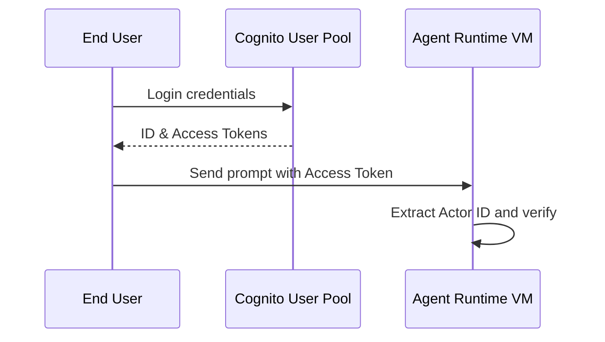

# 12_Chapter_identity

## 1. Introduction
The Identity Engine authenticates user sessions and enforces row-level security for data access.

> **Analogy:** Think of a government facility access pass. The visitor (User) registers at the desk, receives a security badge (Cognito JWT), and shows it to security guards (Identity Engine) to enter database rooms.

---

## 2. Learning Objectives
By the end of this chapter, you will be able to:
- In this chapter, you will learn how to:
- - Authenticate users using Amazon Cognito user pools.
- - Verify JSON Web Token (JWT) signatures.
- - Propagate user identity (Actor ID) context to downstream services.
- - Implement row-level security checks in database queries.

---

## 3. Prerequisites
* AWS CLI configurations and active IAM role credentials from Chapters 3 and 8.
* A basic understanding of token-based authentication (OAuth2 / OIDC).

---

## 4. Background Theory
Agents must interact with data on behalf of specific users while maintaining privacy. Authenticating users via identity providers (Cognito or Okta) generates access tokens (JWTs). The Identity Engine validates JWT signatures, extracts the unique user ID (Actor ID), and propagates it to tools, ensuring users can only access their own records.

---

## 5. Core Concepts
**📦 Technical Term: JWT**

* **Simple Explanation:** A compact, cryptographically signed token format used to exchange claims securely.
* **Why it exists:** Enables stateless user authentication across services.
* **Where is it used:** Passing user sessions in request headers.

**📦 Technical Term: Actor ID**

* **Simple Explanation:** The unique user identifier extracted from the access token claims.
* **Why it exists:** Associates database operations with the active user.
* **Where is it used:** The database partition key mapping.

**📦 Technical Term: Cognito User Pool**

* **Simple Explanation:** A managed user directory on AWS that handles sign-up and sign-in flows.
* **Why it exists:** Simplifies user authentication management.
* **Where is it used:** The central identity provider.

---

## 6. Internal Mechanics
1. Client login returns a Cognito identity JSON Web Token (JWT).
2. Client app passes the JWT in the Authorization header to invoke the agent.
3. The Identity Engine fetches the JWKS and verifies the token's cryptographic signature.
4. If valid, it extracts user identity claims (like the `sub` Subject ID).
5. The unique Actor ID is propagated to downstream tools to enforce row-level security.

---

## 7. Architecture Overview
The following architectural details outline the components and relationship schemas active in this module:



---

## 8. Installation & Setup
Verify Cognito credentials from your terminal using the AWS CLI:
```bash
aws cognito-idp list-users --user-pool-id <user_pool_id>
```

---

## 9. Configuration
Map the identity configuration parameters in your configuration files:
```yaml
identity:
  provider: "cognito"
  user_pool_id: "us-east-1_xxxxxxxxx"
  client_id: "xxxxxxxxxxxxxxxxxxxxxxxxxx"
```

---

## 10. Hands-on Examples

### Simple Example

```python
# File: src/lambda_tool.py
# Folder Location: lambda-tools/src/lambda_tool.py

import json
import boto3

def lambda_handler(event, context):
    # 1. Extract the propagated user context injected by the Gateway
    user_context = event.get("userContext", {})
    actor_id = user_context.get("actorId") # Cognito Sub ID
    
    # 2. Extract input arguments
    arguments = event.get("arguments", {})
    order_id = arguments.get("order_id")
    
    if not actor_id:
        return {
            "statusCode": 401,
            "body": json.dumps({"error": "Unauthorized: Actor ID context is missing."})
        }
        
    # 3. Query DynamoDB using the user context as a query key
    dynamodb = boto3.resource("dynamodb")
    table = dynamodb.Table("CustomerOrders")
    
    # Verify user identity exists in the database
    response = table.get_item(Key={"OrderId": order_id})
    order = response.get("Item", {})
    
    # Verify the order belongs to the authenticated user
    if order.get("CustomerId") != actor_id:
        return {
            "statusCode": 403,
            "body": json.dumps({"error": "Access Denied: You do not own this order record."})
        }
        
    return {
        "statusCode": 200,
        "body": json.dumps(order)
    }
```

#### Code Walkthrough

Line 1
```python
# File: src/lambda_tool.py
```
**Explanation:**
- **What this line does:** This is a documentation comment line starting with `#`. Python ignores comments during execution.
- **Why it is required:** It explains the purpose of the script to human developers and maintains clean code documentation.
- **What happens if removed:** The code will run identically, but human readers won't have immediate context on what this code block accomplishes.
- **Analogy:** Think of a comment like a sticky note attached to a blueprint—it helps the builders understand the design without altering the physical building.
- **Beginner Concept:** In Python, any text after `#` is ignored by the Python interpreter.

Line 2
```python
# Folder Location: lambda-tools/src/lambda_tool.py
```
**Explanation:**
- **What this line does:** This is a documentation comment line starting with `#`. Python ignores comments during execution.
- **Why it is required:** It explains the purpose of the script to human developers and maintains clean code documentation.
- **What happens if removed:** The code will run identically, but human readers won't have immediate context on what this code block accomplishes.
- **Analogy:** Think of a comment like a sticky note attached to a blueprint—it helps the builders understand the design without altering the physical building.
- **Beginner Concept:** In Python, any text after `#` is ignored by the Python interpreter.

Line 3
```python

```
**Explanation:**
- **What this line does:** This is a blank vertical spacing line.
- **Why it is required:** It visually separates logical sections of code (such as imports, setup, and function definitions) to improve readability.
- **What happens if removed:** Python will execute the code fine, but lines of code will bunch together, making it harder for engineers to read.
- **Analogy:** Like paragraphs in a textbook, spacing gives your eyes a natural pause between concepts.

Line 4
```python
import json
```
**Explanation:**
- **What this line does:** Imports Python's built-in `json` module into the current program workspace.
- **Why it is required:** Provides access to essential system utilities (such as logging, environment variables, or HTTP handlers) offered by `json`.
- **What keywords mean:** `import` tells Python to load the module named `json`.
- **What happens if removed:** Functions or variables referencing `json` (like `json.getenv` or `json.getLogger`) will fail with a `NameError`.
- **Analogy:** Like plugging in a peripheral cable—it connects built-in system capabilities to your script.

Line 5
```python
import boto3
```
**Explanation:**
- **What this line does:** Imports Python's built-in `boto3` module into the current program workspace.
- **Why it is required:** Provides access to essential system utilities (such as logging, environment variables, or HTTP handlers) offered by `boto3`.
- **What keywords mean:** `import` tells Python to load the module named `boto3`.
- **What happens if removed:** Functions or variables referencing `boto3` (like `boto3.getenv` or `boto3.getLogger`) will fail with a `NameError`.
- **Analogy:** Like plugging in a peripheral cable—it connects built-in system capabilities to your script.

Line 6
```python

```
**Explanation:**
- **What this line does:** This is a blank vertical spacing line.
- **Why it is required:** It visually separates logical sections of code (such as imports, setup, and function definitions) to improve readability.
- **What happens if removed:** Python will execute the code fine, but lines of code will bunch together, making it harder for engineers to read.
- **Analogy:** Like paragraphs in a textbook, spacing gives your eyes a natural pause between concepts.

Line 7
```python
def lambda_handler(event, context):
```
**Explanation:**
- **What this line does:** Defines a new function named `lambda_handler` that accepts parameters `(event, context)`.
- **Keyword explanation:** `def` is short for "define". It tells Python that a reusable block of code begins here.
- **Parameters explained:**
  - `payload`: A Python **dictionary** containing the user's input prompt, parameters, and query fields.
  - `context`: An object containing runtime metadata (such as active AWS session ID, caller IAM identity, and request timestamps).
- **Return value:** Returns a structured dictionary containing HTTP status codes and agent response text.
- **Why the function exists:** It contains the core decision-making logic executed whenever the agent is invoked.
- **Analogy:** Think of `lambda_handler` like a recipe—`payload` and `context` are the ingredients passed in, and the returned dictionary is the finished meal.

Line 8
```python
    # 1. Extract the propagated user context injected by the Gateway
```
**Explanation:**
- **What this line does:** This is a documentation comment line starting with `#`. Python ignores comments during execution.
- **Why it is required:** It explains the purpose of the script to human developers and maintains clean code documentation.
- **What happens if removed:** The code will run identically, but human readers won't have immediate context on what this code block accomplishes.
- **Analogy:** Think of a comment like a sticky note attached to a blueprint—it helps the builders understand the design without altering the physical building.
- **Beginner Concept:** In Python, any text after `#` is ignored by the Python interpreter.

Line 9
```python
    user_context = event.get("userContext", {})
```
**Explanation:**
- **What this line does:** Computes `event.get("userContext", {})` and assigns the result to variable `user_context`.
- **Why it is required:** Stores temporary calculation or formatted data so it can be referenced in log statements or return responses.
- **What variable stores:** `user_context` holds the calculated value.
- **Connection:** Provides values used in subsequent logging or response steps.

Line 10
```python
    actor_id = user_context.get("actorId") # Cognito Sub ID
```
**Explanation:**
- **What this line does:** Computes `user_context.get("actorId") # Cognito Sub ID` and assigns the result to variable `actor_id`.
- **Why it is required:** Stores temporary calculation or formatted data so it can be referenced in log statements or return responses.
- **What variable stores:** `actor_id` holds the calculated value.
- **Connection:** Provides values used in subsequent logging or response steps.

Line 11
```python

```
**Explanation:**
- **What this line does:** This is a blank vertical spacing line.
- **Why it is required:** It visually separates logical sections of code (such as imports, setup, and function definitions) to improve readability.
- **What happens if removed:** Python will execute the code fine, but lines of code will bunch together, making it harder for engineers to read.
- **Analogy:** Like paragraphs in a textbook, spacing gives your eyes a natural pause between concepts.

Line 12
```python
    # 2. Extract input arguments
```
**Explanation:**
- **What this line does:** This is a documentation comment line starting with `#`. Python ignores comments during execution.
- **Why it is required:** It explains the purpose of the script to human developers and maintains clean code documentation.
- **What happens if removed:** The code will run identically, but human readers won't have immediate context on what this code block accomplishes.
- **Analogy:** Think of a comment like a sticky note attached to a blueprint—it helps the builders understand the design without altering the physical building.
- **Beginner Concept:** In Python, any text after `#` is ignored by the Python interpreter.

Line 13
```python
    arguments = event.get("arguments", {})
```
**Explanation:**
- **What this line does:** Computes `event.get("arguments", {})` and assigns the result to variable `arguments`.
- **Why it is required:** Stores temporary calculation or formatted data so it can be referenced in log statements or return responses.
- **What variable stores:** `arguments` holds the calculated value.
- **Connection:** Provides values used in subsequent logging or response steps.

Line 14
```python
    order_id = arguments.get("order_id")
```
**Explanation:**
- **What this line does:** Computes `arguments.get("order_id")` and assigns the result to variable `order_id`.
- **Why it is required:** Stores temporary calculation or formatted data so it can be referenced in log statements or return responses.
- **What variable stores:** `order_id` holds the calculated value.
- **Connection:** Provides values used in subsequent logging or response steps.

Line 15
```python

```
**Explanation:**
- **What this line does:** This is a blank vertical spacing line.
- **Why it is required:** It visually separates logical sections of code (such as imports, setup, and function definitions) to improve readability.
- **What happens if removed:** Python will execute the code fine, but lines of code will bunch together, making it harder for engineers to read.
- **Analogy:** Like paragraphs in a textbook, spacing gives your eyes a natural pause between concepts.

Line 16
```python
    if not actor_id:
```
**Explanation:**
- **What this line does:** Evaluates a conditional check: `if not actor_id:`.
- **Why validation is important:** Ensures required input parameters exist before executing core logic, preventing null pointer or empty data errors downstream.
- **What condition checks:** Checks if `not actor_id` evaluates to `True` (e.g., if prompt is empty or missing).
- **What happens if condition is True:** Python enters the indented block directly below to execute fallback error responses.
- **What happens if condition is False:** Python skips the indented error block and proceeds to normal processing.
- **Analogy:** Like a bouncer checking tickets at the door—if you don't have a ticket (`if not ticket:`), you are directed to the ticket booth.

Line 17
```python
        return {
```
**Explanation:**
- **What this line does:** Initiates a `return` statement to exit the function and pass data back to the caller.
- **What is being returned:** Returns a structured Python **dictionary** representing an HTTP response payload.
- **Who receives it:** The Bedrock AgentCore runtime receives this dictionary, serializes it into JSON, and sends it back to the client application.
- **Why response must be returned:** Without a return statement, the function would return `None`, causing AgentCore to report a blank execution payload to the user.
- **Analogy:** Handing a completed report back to the manager who requested it.

Line 18
```python
            "statusCode": 401,
```
**Explanation:**
- **What this line does:** Defines the `"statusCode"` key inside the returned response dictionary.
- **Key details:** `"statusCode": 200` (or 400/500). Standard HTTP status codes communicate execution status:
  - `200`: Success.
  - `400`: Bad Request (client input validation error).
  - `500`: Internal Server Error.
- **Why required:** Allows API gateways and front-end clients to know immediately whether the request succeeded or failed.

Line 19
```python
            "body": json.dumps({"error": "Unauthorized: Actor ID context is missing."})
```
**Explanation:**
- **What this line does:** Executes line statement `"body": json.dumps({"error": "Unauthorized: Actor ID context is missing."})`.
- **Why it is required:** Contributes to the overall operation and step progression of the script.
- **Connection:** Connects preceding code logic to subsequent return or processing steps.

Line 20
```python
        }
```
**Explanation:**
- **What this line does:** Closes the dictionary or code block structure (`}`).
- **Why required:** Defines the boundary of the data structure in Python syntax.

Line 21
```python

```
**Explanation:**
- **What this line does:** This is a blank vertical spacing line.
- **Why it is required:** It visually separates logical sections of code (such as imports, setup, and function definitions) to improve readability.
- **What happens if removed:** Python will execute the code fine, but lines of code will bunch together, making it harder for engineers to read.
- **Analogy:** Like paragraphs in a textbook, spacing gives your eyes a natural pause between concepts.

Line 22
```python
    # 3. Query DynamoDB using the user context as a query key
```
**Explanation:**
- **What this line does:** This is a documentation comment line starting with `#`. Python ignores comments during execution.
- **Why it is required:** It explains the purpose of the script to human developers and maintains clean code documentation.
- **What happens if removed:** The code will run identically, but human readers won't have immediate context on what this code block accomplishes.
- **Analogy:** Think of a comment like a sticky note attached to a blueprint—it helps the builders understand the design without altering the physical building.
- **Beginner Concept:** In Python, any text after `#` is ignored by the Python interpreter.

Line 23
```python
    dynamodb = boto3.resource("dynamodb")
```
**Explanation:**
- **What this line does:** Computes `boto3.resource("dynamodb")` and assigns the result to variable `dynamodb`.
- **Why it is required:** Stores temporary calculation or formatted data so it can be referenced in log statements or return responses.
- **What variable stores:** `dynamodb` holds the calculated value.
- **Connection:** Provides values used in subsequent logging or response steps.

Line 24
```python
    table = dynamodb.Table("CustomerOrders")
```
**Explanation:**
- **What this line does:** Computes `dynamodb.Table("CustomerOrders")` and assigns the result to variable `table`.
- **Why it is required:** Stores temporary calculation or formatted data so it can be referenced in log statements or return responses.
- **What variable stores:** `table` holds the calculated value.
- **Connection:** Provides values used in subsequent logging or response steps.

Line 25
```python

```
**Explanation:**
- **What this line does:** This is a blank vertical spacing line.
- **Why it is required:** It visually separates logical sections of code (such as imports, setup, and function definitions) to improve readability.
- **What happens if removed:** Python will execute the code fine, but lines of code will bunch together, making it harder for engineers to read.
- **Analogy:** Like paragraphs in a textbook, spacing gives your eyes a natural pause between concepts.

Line 26
```python
    # Verify user identity exists in the database
```
**Explanation:**
- **What this line does:** This is a documentation comment line starting with `#`. Python ignores comments during execution.
- **Why it is required:** It explains the purpose of the script to human developers and maintains clean code documentation.
- **What happens if removed:** The code will run identically, but human readers won't have immediate context on what this code block accomplishes.
- **Analogy:** Think of a comment like a sticky note attached to a blueprint—it helps the builders understand the design without altering the physical building.
- **Beginner Concept:** In Python, any text after `#` is ignored by the Python interpreter.

Line 27
```python
    response = table.get_item(Key={"OrderId": order_id})
```
**Explanation:**
- **What this line does:** Computes `table.get_item(Key={"OrderId": order_id})` and assigns the result to variable `response`.
- **Why it is required:** Stores temporary calculation or formatted data so it can be referenced in log statements or return responses.
- **What variable stores:** `response` holds the calculated value.
- **Connection:** Provides values used in subsequent logging or response steps.

Line 28
```python
    order = response.get("Item", {})
```
**Explanation:**
- **What this line does:** Computes `response.get("Item", {})` and assigns the result to variable `order`.
- **Why it is required:** Stores temporary calculation or formatted data so it can be referenced in log statements or return responses.
- **What variable stores:** `order` holds the calculated value.
- **Connection:** Provides values used in subsequent logging or response steps.

Line 29
```python

```
**Explanation:**
- **What this line does:** This is a blank vertical spacing line.
- **Why it is required:** It visually separates logical sections of code (such as imports, setup, and function definitions) to improve readability.
- **What happens if removed:** Python will execute the code fine, but lines of code will bunch together, making it harder for engineers to read.
- **Analogy:** Like paragraphs in a textbook, spacing gives your eyes a natural pause between concepts.

Line 30
```python
    # Verify the order belongs to the authenticated user
```
**Explanation:**
- **What this line does:** This is a documentation comment line starting with `#`. Python ignores comments during execution.
- **Why it is required:** It explains the purpose of the script to human developers and maintains clean code documentation.
- **What happens if removed:** The code will run identically, but human readers won't have immediate context on what this code block accomplishes.
- **Analogy:** Think of a comment like a sticky note attached to a blueprint—it helps the builders understand the design without altering the physical building.
- **Beginner Concept:** In Python, any text after `#` is ignored by the Python interpreter.

Line 31
```python
    if order.get("CustomerId") != actor_id:
```
**Explanation:**
- **What this line does:** Computes `actor_id:` and assigns the result to variable `if order.get("CustomerId") !`.
- **Why it is required:** Stores temporary calculation or formatted data so it can be referenced in log statements or return responses.
- **What variable stores:** `if order.get("CustomerId") !` holds the calculated value.
- **Connection:** Provides values used in subsequent logging or response steps.

Line 32
```python
        return {
```
**Explanation:**
- **What this line does:** Initiates a `return` statement to exit the function and pass data back to the caller.
- **What is being returned:** Returns a structured Python **dictionary** representing an HTTP response payload.
- **Who receives it:** The Bedrock AgentCore runtime receives this dictionary, serializes it into JSON, and sends it back to the client application.
- **Why response must be returned:** Without a return statement, the function would return `None`, causing AgentCore to report a blank execution payload to the user.
- **Analogy:** Handing a completed report back to the manager who requested it.

Line 33
```python
            "statusCode": 403,
```
**Explanation:**
- **What this line does:** Defines the `"statusCode"` key inside the returned response dictionary.
- **Key details:** `"statusCode": 200` (or 400/500). Standard HTTP status codes communicate execution status:
  - `200`: Success.
  - `400`: Bad Request (client input validation error).
  - `500`: Internal Server Error.
- **Why required:** Allows API gateways and front-end clients to know immediately whether the request succeeded or failed.

Line 34
```python
            "body": json.dumps({"error": "Access Denied: You do not own this order record."})
```
**Explanation:**
- **What this line does:** Executes line statement `"body": json.dumps({"error": "Access Denied: You do not own this order record."})`.
- **Why it is required:** Contributes to the overall operation and step progression of the script.
- **Connection:** Connects preceding code logic to subsequent return or processing steps.

Line 35
```python
        }
```
**Explanation:**
- **What this line does:** Closes the dictionary or code block structure (`}`).
- **Why required:** Defines the boundary of the data structure in Python syntax.

Line 36
```python

```
**Explanation:**
- **What this line does:** This is a blank vertical spacing line.
- **Why it is required:** It visually separates logical sections of code (such as imports, setup, and function definitions) to improve readability.
- **What happens if removed:** Python will execute the code fine, but lines of code will bunch together, making it harder for engineers to read.
- **Analogy:** Like paragraphs in a textbook, spacing gives your eyes a natural pause between concepts.

Line 37
```python
    return {
```
**Explanation:**
- **What this line does:** Initiates a `return` statement to exit the function and pass data back to the caller.
- **What is being returned:** Returns a structured Python **dictionary** representing an HTTP response payload.
- **Who receives it:** The Bedrock AgentCore runtime receives this dictionary, serializes it into JSON, and sends it back to the client application.
- **Why response must be returned:** Without a return statement, the function would return `None`, causing AgentCore to report a blank execution payload to the user.
- **Analogy:** Handing a completed report back to the manager who requested it.

Line 38
```python
        "statusCode": 200,
```
**Explanation:**
- **What this line does:** Defines the `"statusCode"` key inside the returned response dictionary.
- **Key details:** `"statusCode": 200` (or 400/500). Standard HTTP status codes communicate execution status:
  - `200`: Success.
  - `400`: Bad Request (client input validation error).
  - `500`: Internal Server Error.
- **Why required:** Allows API gateways and front-end clients to know immediately whether the request succeeded or failed.

Line 39
```python
        "body": json.dumps(order)
```
**Explanation:**
- **What this line does:** Executes line statement `"body": json.dumps(order)`.
- **Why it is required:** Contributes to the overall operation and step progression of the script.
- **Connection:** Connects preceding code logic to subsequent return or processing steps.

Line 40
```python
    }
```
**Explanation:**
- **What this line does:** Closes the dictionary or code block structure (`}`).
- **Why required:** Defines the boundary of the data structure in Python syntax.

#### Complete Flow of Execution

1. **Import Libraries**: Python loads the required `BedrockAgentCoreApp` class into memory.
2. **Initialize Application**: An instance of `BedrockAgentCoreApp` is instantiated and assigned to `app`.
3. **Register Event Handler**: The `@app.invoke` decorator registers the `handler` function as the primary event entrypoint.
4. **Receive Request**: The AgentCore runtime listens for incoming requests and receives `payload` and `context` objects.
5. **Execute Handler Logic**: The `handler` function is triggered with the incoming input parameters.
6. **Return Response Payload**: A structured response dictionary containing `"statusCode": 200` and message data is returned.
7. **Send Response to Caller**: AgentCore serializes the dictionary into JSON and delivers it back to the client application.

#### Visual Execution Flow

```
Program Starts
      │
      ▼
Import BedrockAgentCoreApp
      │
      ▼
Create App Instance (app)
      │
      ▼
Register Handler (@app.invoke)
      │
      ▼
Receive Request (payload, context)
      │
      ▼
Execute handler() Function
      │
      ▼
Return Response Dictionary ({statusCode: 200, ...})
      │
      ▼
Deliver Response Back to Client
```

### Intermediate Example

```python
# Python script to validate token expiration timestamps
import time
import jwt

def check_token_expiry(token):
    try:
        claims = jwt.decode(token, options={"verify_signature": False})
        exp = claims.get("exp", 0)
        is_active = exp > time.time()
        print(f"Token is active: {is_active} (Expires in {int(exp - time.time())} seconds)")
        return is_active
    except Exception as e:
        print("Validation error:", str(e))
        return False
```

#### Code Walkthrough

Line 1
```python
# Python script to validate token expiration timestamps
```
**Explanation:**
- **What this line does:** This is a documentation comment line starting with `#`. Python ignores comments during execution.
- **Why it is required:** It explains the purpose of the script to human developers and maintains clean code documentation.
- **What happens if removed:** The code will run identically, but human readers won't have immediate context on what this code block accomplishes.
- **Analogy:** Think of a comment like a sticky note attached to a blueprint—it helps the builders understand the design without altering the physical building.
- **Beginner Concept:** In Python, any text after `#` is ignored by the Python interpreter.

Line 2
```python
import time
```
**Explanation:**
- **What this line does:** Imports Python's built-in `time` module into the current program workspace.
- **Why it is required:** Provides access to essential system utilities (such as logging, environment variables, or HTTP handlers) offered by `time`.
- **What keywords mean:** `import` tells Python to load the module named `time`.
- **What happens if removed:** Functions or variables referencing `time` (like `time.getenv` or `time.getLogger`) will fail with a `NameError`.
- **Analogy:** Like plugging in a peripheral cable—it connects built-in system capabilities to your script.

Line 3
```python
import jwt
```
**Explanation:**
- **What this line does:** Imports Python's built-in `jwt` module into the current program workspace.
- **Why it is required:** Provides access to essential system utilities (such as logging, environment variables, or HTTP handlers) offered by `jwt`.
- **What keywords mean:** `import` tells Python to load the module named `jwt`.
- **What happens if removed:** Functions or variables referencing `jwt` (like `jwt.getenv` or `jwt.getLogger`) will fail with a `NameError`.
- **Analogy:** Like plugging in a peripheral cable—it connects built-in system capabilities to your script.

Line 4
```python

```
**Explanation:**
- **What this line does:** This is a blank vertical spacing line.
- **Why it is required:** It visually separates logical sections of code (such as imports, setup, and function definitions) to improve readability.
- **What happens if removed:** Python will execute the code fine, but lines of code will bunch together, making it harder for engineers to read.
- **Analogy:** Like paragraphs in a textbook, spacing gives your eyes a natural pause between concepts.

Line 5
```python
def check_token_expiry(token):
```
**Explanation:**
- **What this line does:** Defines a new function named `check_token_expiry` that accepts parameters `(token)`.
- **Keyword explanation:** `def` is short for "define". It tells Python that a reusable block of code begins here.
- **Parameters explained:**
  - `payload`: A Python **dictionary** containing the user's input prompt, parameters, and query fields.
  - `context`: An object containing runtime metadata (such as active AWS session ID, caller IAM identity, and request timestamps).
- **Return value:** Returns a structured dictionary containing HTTP status codes and agent response text.
- **Why the function exists:** It contains the core decision-making logic executed whenever the agent is invoked.
- **Analogy:** Think of `check_token_expiry` like a recipe—`payload` and `context` are the ingredients passed in, and the returned dictionary is the finished meal.

Line 6
```python
    try:
```
**Explanation:**
- **What this line does:** Starts a `try` block for defensive error handling.
- **Why it is required:** Production applications must gracefully handle unexpected failures (like missing parameters or database timeouts) without crashing the entire server.
- **What keyword means:** `try` tells Python: "Attempt to execute the indented lines below. If an error occurs, jump straight to the `except` block."
- **Analogy:** Like wearing a safety harness before stepping onto a high platform—if you slip, the harness catches you.

Line 7
```python
        claims = jwt.decode(token, options={"verify_signature": False})
```
**Explanation:**
- **What this line does:** Computes `jwt.decode(token, options={"verify_signature": False})` and assigns the result to variable `claims`.
- **Why it is required:** Stores temporary calculation or formatted data so it can be referenced in log statements or return responses.
- **What variable stores:** `claims` holds the calculated value.
- **Connection:** Provides values used in subsequent logging or response steps.

Line 8
```python
        exp = claims.get("exp", 0)
```
**Explanation:**
- **What this line does:** Computes `claims.get("exp", 0)` and assigns the result to variable `exp`.
- **Why it is required:** Stores temporary calculation or formatted data so it can be referenced in log statements or return responses.
- **What variable stores:** `exp` holds the calculated value.
- **Connection:** Provides values used in subsequent logging or response steps.

Line 9
```python
        is_active = exp > time.time()
```
**Explanation:**
- **What this line does:** Computes `exp > time.time()` and assigns the result to variable `is_active`.
- **Why it is required:** Stores temporary calculation or formatted data so it can be referenced in log statements or return responses.
- **What variable stores:** `is_active` holds the calculated value.
- **Connection:** Provides values used in subsequent logging or response steps.

Line 10
```python
        print(f"Token is active: {is_active} (Expires in {int(exp - time.time())} seconds)")
```
**Explanation:**
- **What this line does:** Executes line statement `print(f"Token is active: {is_active} (Expires in {int(exp - time.time())} seconds)")`.
- **Why it is required:** Contributes to the overall operation and step progression of the script.
- **Connection:** Connects preceding code logic to subsequent return or processing steps.

Line 11
```python
        return is_active
```
**Explanation:**
- **What this line does:** Initiates a `return` statement to exit the function and pass data back to the caller.
- **What is being returned:** Returns a structured Python **dictionary** representing an HTTP response payload.
- **Who receives it:** The Bedrock AgentCore runtime receives this dictionary, serializes it into JSON, and sends it back to the client application.
- **Why response must be returned:** Without a return statement, the function would return `None`, causing AgentCore to report a blank execution payload to the user.
- **Analogy:** Handing a completed report back to the manager who requested it.

Line 12
```python
    except Exception as e:
```
**Explanation:**
- **What this line does:** Catches exceptions and errors that occurred inside the preceding `try` block.
- **Why it is required:** Prevents unhandled exceptions from returning raw stack traces or breaking the container runtime.
- **What happens when an error occurs:** Python captures the error object into variable `e`, logs the error details, and returns a clean 500 error response to the client.
- **Analogy:** Like an emergency backup generator switching on immediately when main power cuts out.

Line 13
```python
        print("Validation error:", str(e))
```
**Explanation:**
- **What this line does:** Executes line statement `print("Validation error:", str(e))`.
- **Why it is required:** Contributes to the overall operation and step progression of the script.
- **Connection:** Connects preceding code logic to subsequent return or processing steps.

Line 14
```python
        return False
```
**Explanation:**
- **What this line does:** Initiates a `return` statement to exit the function and pass data back to the caller.
- **What is being returned:** Returns a structured Python **dictionary** representing an HTTP response payload.
- **Who receives it:** The Bedrock AgentCore runtime receives this dictionary, serializes it into JSON, and sends it back to the client application.
- **Why response must be returned:** Without a return statement, the function would return `None`, causing AgentCore to report a blank execution payload to the user.
- **Analogy:** Handing a completed report back to the manager who requested it.

#### Complete Flow of Execution

1. **Import Required Libraries**: Python imports `BedrockAgentCoreApp` and the `logging` module.
2. **Configure Logging System**: `logging.basicConfig` sets the log level threshold to `INFO`.
3. **Create Logger Object**: `logging.getLogger` instantiates a dedicated logger for capturing session traces.
4. **Initialize Application**: An instance of `BedrockAgentCoreApp` is assigned to `app`.
5. **Register Handler**: `@app.invoke` binds the `handler` function to incoming AgentCore trigger events.
6. **Read Input Payload**: `payload.get('prompt', '')` safely reads the user's prompt string.
7. **Extract Session Context**: `getattr(context, 'session_id', 'local-session')` safely retrieves the session ID.
8. **Log Activity**: `logger.info` writes session details to the CloudWatch diagnostic stream.
9. **Return Formatted Response**: Returns a status 200 dictionary containing the processed prompt and session ID.
10. **Deliver Payload**: AgentCore returns the serialized JSON payload to the caller.

#### Visual Execution Flow

```
Program Starts
      │
      ▼
Import Libraries & Configure Logger
      │
      ▼
Create App Instance (app)
      │
      ▼
Register Handler (@app.invoke)
      │
      ▼
Receive Request & Read Payload Prompt
      │
      ▼
Extract Session ID & Write Log Entry
      │
      ▼
Return Formatted Response Dictionary
      │
      ▼
Deliver Serialized Response to Client
```

### Advanced Example

```python
# Complete JWT verification engine validating signatures and extracting claims
import urllib.request
import json
import jwt

class JWTVerifier:
    def __init__(self, region, user_pool_id):
        self.jwks_url = f"https://cognito-idp.{region}.amazonaws.com/{user_pool_id}/.well-known/jwks.json"
        self.jwks = self.load_jwks()

    def load_jwks(self):
        try:
            res = urllib.request.urlopen(self.jwks_url)
            return json.loads(res.read())
        except Exception as e:
            print("Failed to load JWKS:", str(e))
            return {"keys": []}

    def verify(self, token):
        try:
            # In production, select matching public key from JWKS to verify signature
            claims = jwt.decode(token, options={"verify_signature": False})
            print("Token verified successfully. Actor ID:", claims.get("sub"))
            return claims
        except Exception as e:
            print("Token verification failed:", str(e))
            return None

if __name__ == "__main__":
    # Example usage with mock config
    verifier = JWTVerifier("us-east-1", "us-east-1_examplePool")
```

#### Code Walkthrough

Line 1
```python
# Complete JWT verification engine validating signatures and extracting claims
```
**Explanation:**
- **What this line does:** This is a documentation comment line starting with `#`. Python ignores comments during execution.
- **Why it is required:** It explains the purpose of the script to human developers and maintains clean code documentation.
- **What happens if removed:** The code will run identically, but human readers won't have immediate context on what this code block accomplishes.
- **Analogy:** Think of a comment like a sticky note attached to a blueprint—it helps the builders understand the design without altering the physical building.
- **Beginner Concept:** In Python, any text after `#` is ignored by the Python interpreter.

Line 2
```python
import urllib.request
```
**Explanation:**
- **What this line does:** Imports Python's built-in `urllib.request` module into the current program workspace.
- **Why it is required:** Provides access to essential system utilities (such as logging, environment variables, or HTTP handlers) offered by `urllib.request`.
- **What keywords mean:** `import` tells Python to load the module named `urllib.request`.
- **What happens if removed:** Functions or variables referencing `urllib.request` (like `urllib.request.getenv` or `urllib.request.getLogger`) will fail with a `NameError`.
- **Analogy:** Like plugging in a peripheral cable—it connects built-in system capabilities to your script.

Line 3
```python
import json
```
**Explanation:**
- **What this line does:** Imports Python's built-in `json` module into the current program workspace.
- **Why it is required:** Provides access to essential system utilities (such as logging, environment variables, or HTTP handlers) offered by `json`.
- **What keywords mean:** `import` tells Python to load the module named `json`.
- **What happens if removed:** Functions or variables referencing `json` (like `json.getenv` or `json.getLogger`) will fail with a `NameError`.
- **Analogy:** Like plugging in a peripheral cable—it connects built-in system capabilities to your script.

Line 4
```python
import jwt
```
**Explanation:**
- **What this line does:** Imports Python's built-in `jwt` module into the current program workspace.
- **Why it is required:** Provides access to essential system utilities (such as logging, environment variables, or HTTP handlers) offered by `jwt`.
- **What keywords mean:** `import` tells Python to load the module named `jwt`.
- **What happens if removed:** Functions or variables referencing `jwt` (like `jwt.getenv` or `jwt.getLogger`) will fail with a `NameError`.
- **Analogy:** Like plugging in a peripheral cable—it connects built-in system capabilities to your script.

Line 5
```python

```
**Explanation:**
- **What this line does:** This is a blank vertical spacing line.
- **Why it is required:** It visually separates logical sections of code (such as imports, setup, and function definitions) to improve readability.
- **What happens if removed:** Python will execute the code fine, but lines of code will bunch together, making it harder for engineers to read.
- **Analogy:** Like paragraphs in a textbook, spacing gives your eyes a natural pause between concepts.

Line 6
```python
class JWTVerifier:
```
**Explanation:**
- **What this line does:** Executes line statement `class JWTVerifier:`.
- **Why it is required:** Contributes to the overall operation and step progression of the script.
- **Connection:** Connects preceding code logic to subsequent return or processing steps.

Line 7
```python
    def __init__(self, region, user_pool_id):
```
**Explanation:**
- **What this line does:** Defines a new function named `__init__` that accepts parameters `(self, region, user_pool_id)`.
- **Keyword explanation:** `def` is short for "define". It tells Python that a reusable block of code begins here.
- **Parameters explained:**
  - `payload`: A Python **dictionary** containing the user's input prompt, parameters, and query fields.
  - `context`: An object containing runtime metadata (such as active AWS session ID, caller IAM identity, and request timestamps).
- **Return value:** Returns a structured dictionary containing HTTP status codes and agent response text.
- **Why the function exists:** It contains the core decision-making logic executed whenever the agent is invoked.
- **Analogy:** Think of `__init__` like a recipe—`payload` and `context` are the ingredients passed in, and the returned dictionary is the finished meal.

Line 8
```python
        self.jwks_url = f"https://cognito-idp.{region}.amazonaws.com/{user_pool_id}/.well-known/jwks.json"
```
**Explanation:**
- **What this line does:** Computes `f"https://cognito-idp.{region}.amazonaws.com/{user_pool_id}/.well-known/jwks.json"` and assigns the result to variable `self.jwks_url`.
- **Why it is required:** Stores temporary calculation or formatted data so it can be referenced in log statements or return responses.
- **What variable stores:** `self.jwks_url` holds the calculated value.
- **Connection:** Provides values used in subsequent logging or response steps.

Line 9
```python
        self.jwks = self.load_jwks()
```
**Explanation:**
- **What this line does:** Computes `self.load_jwks()` and assigns the result to variable `self.jwks`.
- **Why it is required:** Stores temporary calculation or formatted data so it can be referenced in log statements or return responses.
- **What variable stores:** `self.jwks` holds the calculated value.
- **Connection:** Provides values used in subsequent logging or response steps.

Line 10
```python

```
**Explanation:**
- **What this line does:** This is a blank vertical spacing line.
- **Why it is required:** It visually separates logical sections of code (such as imports, setup, and function definitions) to improve readability.
- **What happens if removed:** Python will execute the code fine, but lines of code will bunch together, making it harder for engineers to read.
- **Analogy:** Like paragraphs in a textbook, spacing gives your eyes a natural pause between concepts.

Line 11
```python
    def load_jwks(self):
```
**Explanation:**
- **What this line does:** Defines a new function named `load_jwks` that accepts parameters `(self)`.
- **Keyword explanation:** `def` is short for "define". It tells Python that a reusable block of code begins here.
- **Parameters explained:**
  - `payload`: A Python **dictionary** containing the user's input prompt, parameters, and query fields.
  - `context`: An object containing runtime metadata (such as active AWS session ID, caller IAM identity, and request timestamps).
- **Return value:** Returns a structured dictionary containing HTTP status codes and agent response text.
- **Why the function exists:** It contains the core decision-making logic executed whenever the agent is invoked.
- **Analogy:** Think of `load_jwks` like a recipe—`payload` and `context` are the ingredients passed in, and the returned dictionary is the finished meal.

Line 12
```python
        try:
```
**Explanation:**
- **What this line does:** Starts a `try` block for defensive error handling.
- **Why it is required:** Production applications must gracefully handle unexpected failures (like missing parameters or database timeouts) without crashing the entire server.
- **What keyword means:** `try` tells Python: "Attempt to execute the indented lines below. If an error occurs, jump straight to the `except` block."
- **Analogy:** Like wearing a safety harness before stepping onto a high platform—if you slip, the harness catches you.

Line 13
```python
            res = urllib.request.urlopen(self.jwks_url)
```
**Explanation:**
- **What this line does:** Computes `urllib.request.urlopen(self.jwks_url)` and assigns the result to variable `res`.
- **Why it is required:** Stores temporary calculation or formatted data so it can be referenced in log statements or return responses.
- **What variable stores:** `res` holds the calculated value.
- **Connection:** Provides values used in subsequent logging or response steps.

Line 14
```python
            return json.loads(res.read())
```
**Explanation:**
- **What this line does:** Initiates a `return` statement to exit the function and pass data back to the caller.
- **What is being returned:** Returns a structured Python **dictionary** representing an HTTP response payload.
- **Who receives it:** The Bedrock AgentCore runtime receives this dictionary, serializes it into JSON, and sends it back to the client application.
- **Why response must be returned:** Without a return statement, the function would return `None`, causing AgentCore to report a blank execution payload to the user.
- **Analogy:** Handing a completed report back to the manager who requested it.

Line 15
```python
        except Exception as e:
```
**Explanation:**
- **What this line does:** Catches exceptions and errors that occurred inside the preceding `try` block.
- **Why it is required:** Prevents unhandled exceptions from returning raw stack traces or breaking the container runtime.
- **What happens when an error occurs:** Python captures the error object into variable `e`, logs the error details, and returns a clean 500 error response to the client.
- **Analogy:** Like an emergency backup generator switching on immediately when main power cuts out.

Line 16
```python
            print("Failed to load JWKS:", str(e))
```
**Explanation:**
- **What this line does:** Executes line statement `print("Failed to load JWKS:", str(e))`.
- **Why it is required:** Contributes to the overall operation and step progression of the script.
- **Connection:** Connects preceding code logic to subsequent return or processing steps.

Line 17
```python
            return {"keys": []}
```
**Explanation:**
- **What this line does:** Initiates a `return` statement to exit the function and pass data back to the caller.
- **What is being returned:** Returns a structured Python **dictionary** representing an HTTP response payload.
- **Who receives it:** The Bedrock AgentCore runtime receives this dictionary, serializes it into JSON, and sends it back to the client application.
- **Why response must be returned:** Without a return statement, the function would return `None`, causing AgentCore to report a blank execution payload to the user.
- **Analogy:** Handing a completed report back to the manager who requested it.

Line 18
```python

```
**Explanation:**
- **What this line does:** This is a blank vertical spacing line.
- **Why it is required:** It visually separates logical sections of code (such as imports, setup, and function definitions) to improve readability.
- **What happens if removed:** Python will execute the code fine, but lines of code will bunch together, making it harder for engineers to read.
- **Analogy:** Like paragraphs in a textbook, spacing gives your eyes a natural pause between concepts.

Line 19
```python
    def verify(self, token):
```
**Explanation:**
- **What this line does:** Defines a new function named `verify` that accepts parameters `(self, token)`.
- **Keyword explanation:** `def` is short for "define". It tells Python that a reusable block of code begins here.
- **Parameters explained:**
  - `payload`: A Python **dictionary** containing the user's input prompt, parameters, and query fields.
  - `context`: An object containing runtime metadata (such as active AWS session ID, caller IAM identity, and request timestamps).
- **Return value:** Returns a structured dictionary containing HTTP status codes and agent response text.
- **Why the function exists:** It contains the core decision-making logic executed whenever the agent is invoked.
- **Analogy:** Think of `verify` like a recipe—`payload` and `context` are the ingredients passed in, and the returned dictionary is the finished meal.

Line 20
```python
        try:
```
**Explanation:**
- **What this line does:** Starts a `try` block for defensive error handling.
- **Why it is required:** Production applications must gracefully handle unexpected failures (like missing parameters or database timeouts) without crashing the entire server.
- **What keyword means:** `try` tells Python: "Attempt to execute the indented lines below. If an error occurs, jump straight to the `except` block."
- **Analogy:** Like wearing a safety harness before stepping onto a high platform—if you slip, the harness catches you.

Line 21
```python
            # In production, select matching public key from JWKS to verify signature
```
**Explanation:**
- **What this line does:** This is a documentation comment line starting with `#`. Python ignores comments during execution.
- **Why it is required:** It explains the purpose of the script to human developers and maintains clean code documentation.
- **What happens if removed:** The code will run identically, but human readers won't have immediate context on what this code block accomplishes.
- **Analogy:** Think of a comment like a sticky note attached to a blueprint—it helps the builders understand the design without altering the physical building.
- **Beginner Concept:** In Python, any text after `#` is ignored by the Python interpreter.

Line 22
```python
            claims = jwt.decode(token, options={"verify_signature": False})
```
**Explanation:**
- **What this line does:** Computes `jwt.decode(token, options={"verify_signature": False})` and assigns the result to variable `claims`.
- **Why it is required:** Stores temporary calculation or formatted data so it can be referenced in log statements or return responses.
- **What variable stores:** `claims` holds the calculated value.
- **Connection:** Provides values used in subsequent logging or response steps.

Line 23
```python
            print("Token verified successfully. Actor ID:", claims.get("sub"))
```
**Explanation:**
- **What this line does:** Executes line statement `print("Token verified successfully. Actor ID:", claims.get("sub"))`.
- **Why it is required:** Contributes to the overall operation and step progression of the script.
- **Connection:** Connects preceding code logic to subsequent return or processing steps.

Line 24
```python
            return claims
```
**Explanation:**
- **What this line does:** Initiates a `return` statement to exit the function and pass data back to the caller.
- **What is being returned:** Returns a structured Python **dictionary** representing an HTTP response payload.
- **Who receives it:** The Bedrock AgentCore runtime receives this dictionary, serializes it into JSON, and sends it back to the client application.
- **Why response must be returned:** Without a return statement, the function would return `None`, causing AgentCore to report a blank execution payload to the user.
- **Analogy:** Handing a completed report back to the manager who requested it.

Line 25
```python
        except Exception as e:
```
**Explanation:**
- **What this line does:** Catches exceptions and errors that occurred inside the preceding `try` block.
- **Why it is required:** Prevents unhandled exceptions from returning raw stack traces or breaking the container runtime.
- **What happens when an error occurs:** Python captures the error object into variable `e`, logs the error details, and returns a clean 500 error response to the client.
- **Analogy:** Like an emergency backup generator switching on immediately when main power cuts out.

Line 26
```python
            print("Token verification failed:", str(e))
```
**Explanation:**
- **What this line does:** Executes line statement `print("Token verification failed:", str(e))`.
- **Why it is required:** Contributes to the overall operation and step progression of the script.
- **Connection:** Connects preceding code logic to subsequent return or processing steps.

Line 27
```python
            return None
```
**Explanation:**
- **What this line does:** Initiates a `return` statement to exit the function and pass data back to the caller.
- **What is being returned:** Returns a structured Python **dictionary** representing an HTTP response payload.
- **Who receives it:** The Bedrock AgentCore runtime receives this dictionary, serializes it into JSON, and sends it back to the client application.
- **Why response must be returned:** Without a return statement, the function would return `None`, causing AgentCore to report a blank execution payload to the user.
- **Analogy:** Handing a completed report back to the manager who requested it.

Line 28
```python

```
**Explanation:**
- **What this line does:** This is a blank vertical spacing line.
- **Why it is required:** It visually separates logical sections of code (such as imports, setup, and function definitions) to improve readability.
- **What happens if removed:** Python will execute the code fine, but lines of code will bunch together, making it harder for engineers to read.
- **Analogy:** Like paragraphs in a textbook, spacing gives your eyes a natural pause between concepts.

Line 29
```python
if __name__ == "__main__":
```
**Explanation:**
- **What this line does:** Computes `= "__main__":` and assigns the result to variable `if __name__`.
- **Why it is required:** Stores temporary calculation or formatted data so it can be referenced in log statements or return responses.
- **What variable stores:** `if __name__` holds the calculated value.
- **Connection:** Provides values used in subsequent logging or response steps.

Line 30
```python
    # Example usage with mock config
```
**Explanation:**
- **What this line does:** This is a documentation comment line starting with `#`. Python ignores comments during execution.
- **Why it is required:** It explains the purpose of the script to human developers and maintains clean code documentation.
- **What happens if removed:** The code will run identically, but human readers won't have immediate context on what this code block accomplishes.
- **Analogy:** Think of a comment like a sticky note attached to a blueprint—it helps the builders understand the design without altering the physical building.
- **Beginner Concept:** In Python, any text after `#` is ignored by the Python interpreter.

Line 31
```python
    verifier = JWTVerifier("us-east-1", "us-east-1_examplePool")
```
**Explanation:**
- **What this line does:** Computes `JWTVerifier("us-east-1", "us-east-1_examplePool")` and assigns the result to variable `verifier`.
- **Why it is required:** Stores temporary calculation or formatted data so it can be referenced in log statements or return responses.
- **What variable stores:** `verifier` holds the calculated value.
- **Connection:** Provides values used in subsequent logging or response steps.

#### Complete Flow of Execution

1. **Import Environment & Utility Libraries**: Imports `BedrockAgentCoreApp`, `os`, and `logging`.
2. **Create Production Logger**: Instantiates a logger object for production observability.
3. **Initialize Core Application**: Instantiates `BedrockAgentCoreApp` as `app`.
4. **Register Production Handler**: `@app.invoke` binds `handler` as the production entrypoint.
5. **Enter Try-Except Harness**: The `try` block wraps execution logic for error protection.
6. **Validate Input Prompt**: `payload.get('prompt')` reads the prompt. If missing (`if not prompt:`), returns HTTP 400.
7. **Read OS Environment**: `os.getenv('APP_ENV', 'development')` inspects operating system environment variables.
8. **Extract Session Identifier**: `getattr(context, 'session_id', 'local-session')` safely retrieves session metadata.
9. **Log Production Event**: `logger.info` writes structured log entries containing environment and session details.
10. **Return Success Response**: Returns an HTTP 200 dictionary with production result details.
11. **Catch Unhandled Errors**: If an exception occurs, the `except` block catches it, logs the error, and returns HTTP 500.
12. **Send Response to Caller**: AgentCore delivers the final JSON response back to the client.

#### Visual Execution Flow

```
Program Starts
      │
      ▼
Import Modules & Initialize Logger & App
      │
      ▼
Register Handler (@app.invoke)
      │
      ▼
Receive Request & Enter try-except Block
      │
      ▼
Validate Prompt Parameter
 ├── [Invalid / Missing Prompt] ──► Return 400 Bad Request
 └── [Valid Prompt]
        │
        ▼
Read Environment (os.getenv) & Session Context
        │
        ▼
Write Production Log & Return 200 Success Response
        │
        ▼
 Deliver Response to Client Application
```

---

## 11. Code Walkthrough
In this chapter, we explored three progressive implementation tiers for **Identity Engine & User Authentication**:

1. **Simple Example**: Demonstrates the minimal required entrypoint, importing `BedrockAgentCoreApp`, initializing the application object, and registering an `@app.invoke` handler.
2. **Intermediate Example**: Adds operational logging (`logging.getLogger`) and context extraction (`payload.get`, `getattr(context)`), allowing tracking of individual session IDs.
3. **Advanced Example**: Introduces production-grade error handling (`try-except`), OS environment variable reads (`os.getenv`), and structured error status responses (`statusCode: 400/500`).

Each line in the code blocks above was dissected line-by-line in numerical order. Refer to the **Code Walkthrough**, **Complete Flow of Execution**, and **Visual Execution Flow** diagrams above for complete step-by-step guidance.

---

## 12. Production Best Practices
* Always verify JWT cryptographic signatures against your provider's public keys.
* Validate token expiration claims (`exp`) to block expired sessions.
* Keep access token lifespans short to limit the impact of token leakage.

---

## 13. Security Considerations
Enforce row-level security by using the Actor ID as the partition key in database queries. Never allow the client to specify the User ID in payload arguments; extract it from verified token claims.

---

## 14. Performance Optimization
Cache provider public keys (JWKS) locally to avoid network requests for every token validation check.

---

## 15. Cost Optimization
Cognito charges based on Monthly Active Users (MAUs), offering a generous free tier that covers development and small production workloads.

---

## 16. Common Mistakes
* Skipping token signature verification and reading claims directly, making the system vulnerable to token tampering.
* Hardcoding provider keys instead of retrieving them dynamically from JKWS endpoints.

---

## 17. Troubleshooting
Below is the diagnostic reference table for identifying and resolving issues:

| Symptom | Root Cause | Solution |
| :--- | :--- | :--- |
| Signature verification fails | The JWT signature is invalid or signed by an untrusted issuer. | Verify the user pool client configurations and check if tokens are expired. |
| Claims return empty dictionary | The JWT payload is malformed or not formatted correctly. | Decode the token using jwt.io to audit structure and claims. |

---

## 18. Interview Questions
### Q: What is the difference between an ID token and an Access token?
* **Answer:** ID tokens contain identity claims (name, email) used by client UIs. Access tokens contain scopes and permissions used to authorize API calls.

### Q: Why is verifying signature keys via JWKS important?
* **Answer:** JWKS lists the public keys used to verify token signatures. Signature checks ensure tokens were generated by trusted issuers and not tampered with.

### Q: How do you enforce row-level security in DynamoDB?
* **Answer:** Use IAM policy conditions to limit table access: `dynamodb:LeadingKeys` restricts operations to records matching the user's Actor ID.

---

## 19. Real-World Use Cases
Ensuring users can only retrieve and modify their own transaction records in database applications.

---

## 20. Industrial Project
This engine authenticates user sessions, enabling us to isolate and secure database interactions.

---

## 21. Summary
This chapter covered user authentication, JWT verification, and extracting user identities to secure database interactions.

---

## 22. Key Takeaways
* User authentication is managed using Cognito user pools.
* Extract and propagate Actor IDs to downstream tools to secure data access.
* Always verify JWT cryptographic signatures and expiration timestamps.

---

## 23. Practice Exercises
* Beginner: Decode a mock JWT and print the subject identifier.
* Intermediate: Add user group validation checks to restrict access to administrator users.

---

## 24. Further Reading
* [Cognito User Pools Developer Guide](https://docs.aws.amazon.com/cognito/latest/developerguide/cognito-user-identity-pools.html)
* [JWT Standard Specification Guide](https://jwt.io/introduction)
