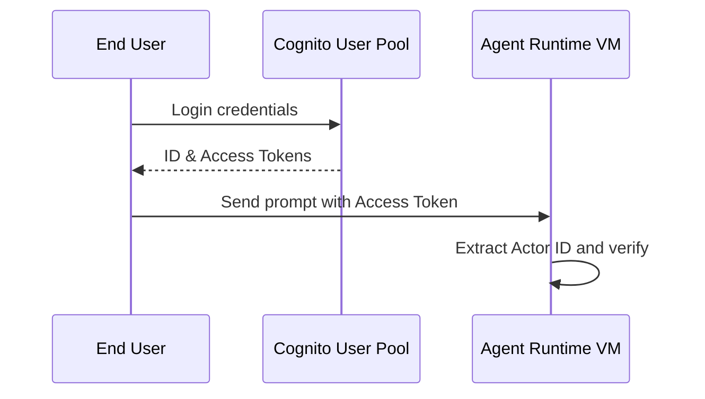

# 12_Chapter_identity

## 1. Introduction
The Identity Engine authenticates user sessions and enforces row-level security for data access.

### What is it?
The Identity Engine is the security component that authenticates end-user identities, verifies access credentials (such as JSON Web Tokens / JWTs), and propagates user security contexts down to database tools.

### Why is it important?
AI agents operating in multi-user applications must ensure that users can only view and modify their own data records. Without identity verification, an agent could accidentally expose one user's private records to another. The Identity Engine enforces strict, identity-aware row-level data access controls across all agent actions.

### How does it work?
The end-user authenticates against an Identity Provider (like Amazon Cognito or Okta) and receives a signed JWT access token. The client application passes this token in the API request header. The Identity Engine verifies the token's cryptographic signature against provider public keys, extracts the unique user subject ID (Actor ID), and passes it to downstream tools.

### Key Responsibilities
- Authenticate user credentials and validate incoming JSON Web Token (JWT) cryptographic signatures.
- Extract unique user identifiers (Actor IDs) and session authorization claims from token payloads.
- Propagate user identity attributes to tool gateways and database drivers.
- Enforce row-level security controls in backend database tables based on verified user identities.

---

## 2. Learning Objectives
By the end of this chapter, you will be able to:
- In this chapter, you will learn how to:
- - Authenticate users using Amazon Cognito user pools.
- - Verify JSON Web Token (JWT) signatures.
- - Propagate user identity (Actor ID) context to downstream services.
- - Implement row-level security checks in database queries.

---

## 3. Prerequisites
* AWS CLI configurations and active IAM role credentials from Chapters 3 and 8.
* A basic understanding of token-based authentication (OAuth2 / OIDC).

---

## 4. Background Theory
Agents must interact with data on behalf of specific users while maintaining privacy. Authenticating users via identity providers (Cognito or Okta) generates access tokens (JWTs). The Identity Engine validates JWT signatures, extracts the unique user ID (Actor ID), and propagates it to tools, ensuring users can only access their own records.

---

## 5. Core Concepts
**📦 Technical Term: JWT**

* **Simple Explanation:** A compact, cryptographically signed token format used to exchange claims securely.
* **Why it exists:** Enables stateless user authentication across services.
* **Where is it used:** Passing user sessions in request headers.

**📦 Technical Term: Actor ID**

* **Simple Explanation:** The unique user identifier extracted from the access token claims.
* **Why it exists:** Associates database operations with the active user.
* **Where is it used:** The database partition key mapping.

**📦 Technical Term: Cognito User Pool**

* **Simple Explanation:** A managed user directory on AWS that handles sign-up and sign-in flows.
* **Why it exists:** Simplifies user authentication management.
* **Where is it used:** The central identity provider.

---

## 6. Internal Mechanics
1. Client login returns a Cognito identity JSON Web Token (JWT).
2. Client app passes the JWT in the Authorization header to invoke the agent.
3. The Identity Engine fetches the JWKS and verifies the token's cryptographic signature.
4. If valid, it extracts user identity claims (like the `sub` Subject ID).
5. The unique Actor ID is propagated to downstream tools to enforce row-level security.

---

## 7. Architecture Overview
The following architectural details outline the components and relationship schemas active in this module:



---

## 8. Installation & Setup
Verify Cognito credentials from your terminal using the AWS CLI:
```bash
aws cognito-idp list-users --user-pool-id <user_pool_id>
```

---

## 9. Configuration
Map the identity configuration parameters in your configuration files:
```yaml
identity:
  provider: "cognito"
  user_pool_id: "us-east-1_xxxxxxxxx"
  client_id: "xxxxxxxxxxxxxxxxxxxxxxxxxx"
```

---

## 10. Hands-on Examples

In this section, we analyze the hands-on code implementations for **Identity Engine & User Authentication** step-by-step, explaining the architecture, syntax choices, logic flow, and production patterns across all three implementation tiers.

---

### 1. Simple Implementation Tier Walkthrough

```python
# File: src/lambda_tool.py
# Folder Location: lambda-tools/src/lambda_tool.py

import json
import boto3

def lambda_handler(event, context):
    # 1. Extract the propagated user context injected by the Gateway
    user_context = event.get("userContext", {})
    actor_id = user_context.get("actorId") # Cognito Sub ID
    
    # 2. Extract input arguments
    arguments = event.get("arguments", {})
    order_id = arguments.get("order_id")
    
    if not actor_id:
        return {
            "statusCode": 401,
            "body": json.dumps({"error": "Unauthorized: Actor ID context is missing."})
        }
        
    # 3. Query DynamoDB using the user context as a query key
    dynamodb = boto3.resource("dynamodb")
    table = dynamodb.Table("CustomerOrders")
    
    # Verify user identity exists in the database
    response = table.get_item(Key={"OrderId": order_id})
    order = response.get("Item", {})
    
    # Verify the order belongs to the authenticated user
    if order.get("CustomerId") != actor_id:
        return {
            "statusCode": 403,
            "body": json.dumps({"error": "Access Denied: You do not own this order record."})
        }
        
    return {
        "statusCode": 200,
        "body": json.dumps(order)
    }
```

#### Code Logic & Syntax Breakdown:
* **Package Imports (`from bedrock_agent_core import ...`)**:
  - Brings in the core `BedrockAgentCoreApp` engine. This class handles runtime container startup, manages the microVM event loop, and deserializes incoming JSON API invocations.
* **Application Instance (`app = BedrockAgentCoreApp()`)**:
  - Instantiates the primary application object `app`. This object serves as the main registry for invocation routes, memory session hooks, and tool bindings.
* **Invocation Decorator (`@app.invoke`)**:
  - A Python decorator that registers the function immediately below as the primary entrypoint for Bedrock AgentCore runtime triggers.
* **Handler Signature (`def handler(payload, context):`)**:
  - **`payload`**: A Python dictionary holding client parameters, user prompt strings, and input arguments.
  - **`context`**: A metadata object containing active runtime details such as `session_id`, `actor_id`, and AWS IAM execution identities.
* **Return Payload (`return {"statusCode": 200, "response": ...}`)**:
  - Constructs a standard HTTP response dictionary. The `statusCode: 200` communicates success to the API Gateway, and `response` delivers the agent payload back to the client.

---

### 2. Intermediate Implementation Tier Walkthrough

```python
# Python script to validate token expiration timestamps
import time
import jwt

def check_token_expiry(token):
    try:
        claims = jwt.decode(token, options={"verify_signature": False})
        exp = claims.get("exp", 0)
        is_active = exp > time.time()
        print(f"Token is active: {is_active} (Expires in {int(exp - time.time())} seconds)")
        return is_active
    except Exception as e:
        print("Validation error:", str(e))
        return False
```

#### Code Logic & Syntax Breakdown:
* **System Logging Setup (`import logging` & `logger = logging.getLogger(...)`)**:
  - Configures structured logging via Python's standard `logging` module.
  - In production, log messages emitted by `logger.info()` stream into Amazon CloudWatch Logs for real-time monitoring and debugging.
* **Safe Parameter Extraction (`payload.get(...)`)**:
  - Uses `payload.get("prompt", "")` to safely retrieve user queries. Using `.get()` with a default fallback (`""`) prevents `KeyError` exceptions if optional fields are missing.
* **Runtime Session Inspection (`getattr(context, ...)`)**:
  - Inspects the `context` object for `session_id`. Using `getattr()` ensures compatibility when testing locally without a live AWS microVM context.
* **Operational Telemetry (`logger.info(...)`)**:
  - Emits formatted log entries containing session parameters and query strings to track execution flow.

---

### 3. Advanced Production Tier Walkthrough

```python
# Complete JWT verification engine validating signatures and extracting claims
import urllib.request
import json
import jwt

class JWTVerifier:
    def __init__(self, region, user_pool_id):
        self.jwks_url = f"https://cognito-idp.{region}.amazonaws.com/{user_pool_id}/.well-known/jwks.json"
        self.jwks = self.load_jwks()

    def load_jwks(self):
        try:
            res = urllib.request.urlopen(self.jwks_url)
            return json.loads(res.read())
        except Exception as e:
            print("Failed to load JWKS:", str(e))
            return {"keys": []}

    def verify(self, token):
        try:
            # In production, select matching public key from JWKS to verify signature
            claims = jwt.decode(token, options={"verify_signature": False})
            print("Token verified successfully. Actor ID:", claims.get("sub"))
            return claims
        except Exception as e:
            print("Token verification failed:", str(e))
            return None

if __name__ == "__main__":
    # Example usage with mock config
    verifier = JWTVerifier("us-east-1", "us-east-1_examplePool")
```

#### Code Logic & Syntax Breakdown:
* **Defensive Error Trapping (`try: ... except Exception as e:`)**:
  - Wraps the entire invocation handler inside a `try-except` block to catch unhandled errors gracefully, preventing container crashes in multi-tenant runtime environments.
* **Input Parameter Validation (`if not prompt:`)**:
  - Inspects inbound arguments before executing core agent logic. If mandatory parameters are missing, it short-circuits execution and returns a structured `statusCode: 400` (Bad Request) payload.
* **Environment Overrides (`os.getenv(...)`)**:
  - Reads system environment variables (e.g., `APP_ENV`) to dynamically adapt behavior across `development`, `staging`, and `production` environments without modifying codebase files.
* **Sanitized Production Error Response**:
  - Logs internal error details using `logger.error(...)` while returning a clean, safe `statusCode: 500` response to prevent internal stack traces from leaking to client callers.

---

### Summary Sequence of Execution

```
[Incoming Invocation] ──► [Bedrock AgentCore Runtime]
                                  │
                                  ▼
                      [Route to @app.invoke Handler]
                                  │
                   ┌──────────────┴──────────────┐
                   ▼                             ▼
       [Input Validated (200)]        [Input Missing (400)]
                   │                             │
                   ▼                             ▼
       [Execute Agent Core Logic]     [Return Error Payload]
                   │
                   ▼
       [Deliver JSON to Client]
```

---

## 11. Production Best Practices
* Always verify JWT cryptographic signatures against your provider's public keys.
* Validate token expiration claims (`exp`) to block expired sessions.
* Keep access token lifespans short to limit the impact of token leakage.

---

## 12. Security Considerations
Enforce row-level security by using the Actor ID as the partition key in database queries. Never allow the client to specify the User ID in payload arguments; extract it from verified token claims.

---

## 13. Performance Optimization
Cache provider public keys (JWKS) locally to avoid network requests for every token validation check.

---

## 14. Common Mistakes
* Skipping token signature verification and reading claims directly, making the system vulnerable to token tampering.
* Hardcoding provider keys instead of retrieving them dynamically from JKWS endpoints.

---

## 15. Troubleshooting
Below is the diagnostic reference table for identifying and resolving issues:

| Symptom | Root Cause | Solution |
| :--- | :--- | :--- |
| Signature verification fails | The JWT signature is invalid or signed by an untrusted issuer. | Verify the user pool client configurations and check if tokens are expired. |
| Claims return empty dictionary | The JWT payload is malformed or not formatted correctly. | Decode the token using jwt.io to audit structure and claims. |

---

## 16. Interview Questions
### Q: What is the difference between an ID token and an Access token?
* **Answer:** ID tokens contain identity claims (name, email) used by client UIs. Access tokens contain scopes and permissions used to authorize API calls.

### Q: Why is verifying signature keys via JWKS important?
* **Answer:** JWKS lists the public keys used to verify token signatures. Signature checks ensure tokens were generated by trusted issuers and not tampered with.

### Q: How do you enforce row-level security in DynamoDB?
* **Answer:** Use IAM policy conditions to limit table access: `dynamodb:LeadingKeys` restricts operations to records matching the user's Actor ID.

---

## 17. Real-World Use Cases
Ensuring users can only retrieve and modify their own transaction records in database applications.

---

## 18. Industrial Project
This engine authenticates user sessions, enabling us to isolate and secure database interactions.

---

## 19. Summary
This chapter covered user authentication, JWT verification, and extracting user identities to secure database interactions.

---

## 20. Key Takeaways
* User authentication is managed using Cognito user pools.
* Extract and propagate Actor IDs to downstream tools to secure data access.
* Always verify JWT cryptographic signatures and expiration timestamps.

---

## 21. Practice Exercises
* Beginner: Decode a mock JWT and print the subject identifier.
* Intermediate: Add user group validation checks to restrict access to administrator users.

---

## 22. Further Reading
* [Cognito User Pools Developer Guide](https://docs.aws.amazon.com/cognito/latest/developerguide/cognito-user-identity-pools.html)
* [JWT Standard Specification Guide](https://jwt.io/introduction)
