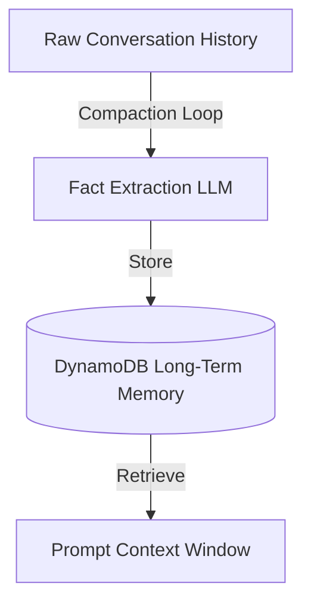

# 13_Chapter_memory

## 1. Introduction
The Memory Engine manages short-term conversational history and long-term user profiles.

> **Analogy:** Think of a student in a classroom. The raw lecture (Raw Chat History) is too detailed to memorize. The student writes key facts in their notebook (Compacted Memory) and files it in a cabinet (DynamoDB Table) for next class.

---

## 2. Learning Objectives
By the end of this chapter, you will be able to:
- In this chapter, you will learn:
- - The difference between short-term (RAM) and long-term (DynamoDB) agent memory.
- - How to implement a session memory manager class in Python.
- - How to set up DynamoDB tables for user profiles.
- - How to implement a Memory Compaction loop to extract user facts.

---

## 3. Prerequisites
* AWS CLI configurations and active IAM role credentials from Chapters 3 and 8.
* A basic understanding of database operations (DynamoDB).

---

## 4. Background Theory
Models are stateless and do not remember past interactions. Appending raw history to prompt context windows increases latency, token count, and cost. The Memory Engine resolves this by managing short-term session cache and long-term profiles in DynamoDB. The memory manager runs compaction loops, using the LLM to extract key user facts and save them, pruning raw dialogue history.

---

## 5. Core Concepts
**📦 Technical Term: Short-Term Memory**

* **Simple Explanation:** Dialogue cache storing conversation turns within an active session.
* **Why it exists:** Tracks dialogue turns during an active chat session.
* **Where is it used:** The temporary session cache.

**📦 Technical Term: Long-Term Memory**

* **Simple Explanation:** Durable storage hosting user profile facts and preferences across sessions.
* **Why it exists:** Personalizes responses over weeks or months.
* **Where is it used:** DynamoDB table records.

**📦 Technical Term: Compaction Loop**

* **Simple Explanation:** A process that summarizes raw history logs into structured key facts.
* **Why it exists:** Minimizes prompt context size and cost.
* **Where is it used:** The memory compaction workflow.

---

## 6. Internal Mechanics
1. Inbound prompt triggers retrieval of user profiles from DynamoDB.
2. The system appends these facts to the model prompt template.
3. Dialogue turns are appended to the short-term session cache.
4. When the session ends, the compaction loop processes the raw history.
5. The compaction function extracts new facts, updates the profile database, and clears the session cache.

---

## 7. Architecture Overview
The following architectural details outline the components and relationship schemas active in this module:



---

## 8. Installation & Setup
Verify your DynamoDB tables list from your terminal using the AWS CLI:
```bash
aws dynamodb list-tables
```

---

## 9. Configuration
Ensure your database configuration mappings match your execution environment:
```yaml
memory:
  table_name: "agentcore-memory-table"
  partition_key: "user_id"
  compaction_trigger_turns: 10
```

---

## 10. Hands-on Examples
### Simple Example
```python
# File: src/memory_manager.py
# Folder Location: agentcore-samples/src/memory_manager.py

import json
from typing import List, Dict, Any

class SessionMemory:
    def __init__(self, session_id: str):
        self.session_id = session_id
        self.turns: List[Dict[str, str]] = []

    def add_message(self, role: str, content: str):
        self.turns.append({"role": role, "content": content})

    def get_conversation_history(self) -> List[Dict[str, str]]:
        return self.turns

class LongTermMemoryStore:
    def __init__(self):
        self.db: Dict[str, Dict[str, Any]] = {}

    def fetch_user_profile(self, user_id: str) -> Dict[str, Any]:
        return self.db.get(user_id, {
            "user_id": user_id,
            "interests": [],
            "past_topics": [],
            "summary": "New user. No historical context."
        })

    def update_user_profile(self, user_id: str, new_profile: Dict[str, Any]):
        self.db[user_id] = new_profile

class MemoryManager:
    def __init__(self, db_store: LongTermMemoryStore):
        self.db_store = db_store

    def run_end_of_session_compaction(self, user_id: str, history: List[Dict[str, str]]):
        profile = self.db_store.fetch_user_profile(user_id)
        for turn in history:
            content = turn["content"].lower()
            if "like" in content or "prefer" in content:
                preference = turn["content"].split("prefer")[-1].strip(" .")
                if preference not in profile["interests"]:
                    profile["interests"].append(preference)
            if "learn" in content or "study" in content:
                topic = turn["content"].split("study")[-1].strip(" .")
                if topic not in profile["past_topics"]:
                    profile["past_topics"].append(topic)
                    
        profile["summary"] = f"User is studying {', '.join(profile['past_topics'])}. Prefers {', '.join(profile['interests'])}."
        self.db_store.update_user_profile(user_id, profile)
```

### Intermediate Example
```python
# Python script to update user profiles using mock database clients
class MockDBStore:
    def __init__(self):
        self.store = {}

    def get_profile(self, user_id):
        return self.store.get(user_id, {"user_id": user_id, "facts": []})

    def put_profile(self, user_id, profile):
        self.store[user_id] = profile
        print(f"Updated database profile for: {user_id}")

if __name__ == "__main__":
    db = MockDBStore()
    profile = db.get_profile("user_123")
    profile["facts"].append("Prefers Python")
    db.put_profile("user_123", profile)
```

### Advanced Example
```python
# Complete memory manager with a compaction loop parsing preference keys
import json

class MemoryManager:
    def __init__(self):
        self.db = {}

    def fetch_profile(self, user_id):
        return self.db.get(user_id, {"user_id": user_id, "interests": [], "summary": "New User"})

    def compact_history(self, user_id, history):
        profile = self.fetch_profile(user_id)
        for turn in history:
            content = turn["content"].lower()
            # Scan for preference keywords
            if "like" in content or "prefer" in content:
                pref = turn["content"].split("prefer")[-1].strip(" .")
                if pref not in profile["interests"]:
                     profile["interests"].append(pref)
        
        profile["summary"] = f"User prefers: {', '.join(profile['interests'])}"
        self.db[user_id] = profile
        print(f"Compacted Profile: {json.dumps(profile)}")

if __name__ == "__main__":
    mgr = MemoryManager()
    chat_log = [
        {"role": "user", "content": "I prefer working with Python"},
        {"role": "assistant", "content": "Understood."}
    ]
    mgr.compact_history("user_789", chat_log)
```

---

## 11. Code Walkthrough
Let's perform a line-by-line code walk of the core logic implementation:

```python
# File: src/memory_manager.py
# Folder Location: agentcore-samples/src/memory_manager.py

import json
from typing import List, Dict, Any

class SessionMemory:
    def __init__(self, session_id: str):
        self.session_id = session_id
        self.turns: List[Dict[str, str]] = []

    def add_message(self, role: str, content: str):
        self.turns.append({"role": role, "content": content})

    def get_conversation_history(self) -> List[Dict[str, str]]:
        return self.turns

class LongTermMemoryStore:
    def __init__(self):
        self.db: Dict[str, Dict[str, Any]] = {}

    def fetch_user_profile(self, user_id: str) -> Dict[str, Any]:
        return self.db.get(user_id, {
            "user_id": user_id,
            "interests": [],
            "past_topics": [],
            "summary": "New user. No historical context."
        })

    def update_user_profile(self, user_id: str, new_profile: Dict[str, Any]):
        self.db[user_id] = new_profile

class MemoryManager:
    def __init__(self, db_store: LongTermMemoryStore):
        self.db_store = db_store

    def run_end_of_session_compaction(self, user_id: str, history: List[Dict[str, str]]):
        profile = self.db_store.fetch_user_profile(user_id)
        for turn in history:
            content = turn["content"].lower()
            if "like" in content or "prefer" in content:
                preference = turn["content"].split("prefer")[-1].strip(" .")
                if preference not in profile["interests"]:
                    profile["interests"].append(preference)
            if "learn" in content or "study" in content:
                topic = turn["content"].split("study")[-1].strip(" .")
                if topic not in profile["past_topics"]:
                    profile["past_topics"].append(topic)
                    
        profile["summary"] = f"User is studying {', '.join(profile['past_topics'])}. Prefers {', '.join(profile['interests'])}."
        self.db_store.update_user_profile(user_id, profile)
```

* **`import` statements:** Load libraries and core modules required by the package.
* **Initialization:** Instantiates execution frameworks and logs operational events.
* **Handler logic:** Executes input validations and triggers core business routines.

---

## 12. Production Best Practices
* Use optimistic locking to prevent parallel requests from overwriting data.
* Trigger compaction loops asynchronously to avoid slowing down user requests.
* Regularly archive outdated history records to optimize storage costs.

---

## 13. Security Considerations
Encrypt database records at rest using AWS KMS keys. Restrict IAM permissions to ensure only the agent execution role can read and write from the memory tables.

---

## 14. Performance Optimization
Implement caching for user profiles to bypass database reads during high-frequency API invocations.

---

## 15. Cost Optimization
Configure DynamoDB auto-scaling or on-demand pricing. Prune raw history records and store only compacted summaries to minimize database storage costs.

---

## 16. Common Mistakes
* Appending raw, uncompacted dialogue history to prompts, bloating token usage and cost.
* Running database calls synchronously inside request loops, adding execution latency.

---

## 17. Troubleshooting
Below is the diagnostic reference table for identifying and resolving issues:

| Symptom | Root Cause | Solution |
| :--- | :--- | :--- |
| OptimisticLockingException on write | Parallel requests attempted to update the same profile record concurrently. | Implement retry logic with exponential backoff on write operations. |
| ProvisionedThroughputExceededException | Database read/write rates exceeded configured limits. | Enable DynamoDB auto-scaling or switch the table to on-demand pricing mode. |

---

## 18. Interview Questions
### Q: What is the benefit of memory compaction?
* **Answer:** Memory compaction summarizes dialogue logs into key facts, keeping prompt context windows small to reduce latency and lower token costs.

### Q: Why is DynamoDB suitable for managing agent state?
* **Answer:** DynamoDB is a serverless NoSQL database that scales automatically and provides low-latency key-value lookups, making it ideal for managing session states.

### Q: How does optimistic locking secure database updates?
* **Answer:** Optimistic locking uses a version attribute. Updates are rejected if the database version exceeds the record version read by the application, preventing data overwrites.

---

## 19. Real-World Use Cases
Personalizing virtual assistants by retaining user preferences and history across sessions.

---

## 20. Industrial Project
This memory engine manages agent state, enabling us to personalize our chatbot application.

---

## 21. Summary
This chapter covered short-term session cache, long-term profile storage, and running compaction loops to manage agent state.

---

## 22. Key Takeaways
* Appending raw history to prompts increases token costs and latency.
* The Memory Engine utilizes DynamoDB to persist state across sessions.
* Compaction loops summarize dialogue history into structured facts.

---

## 23. Practice Exercises
* Beginner: Modify the compaction function to extract location preference keywords.
* Intermediate: Add expiration attributes (TTL) to raw history records to delete them after 30 days.

---

## 24. Further Reading
* [DynamoDB Developer Guide](https://docs.aws.amazon.com/amazondynamodb/latest/developerguide/Introduction.html)
* [LangChain Memory Integration Guide](https://python.langchain.com/docs/modules/memory/)
