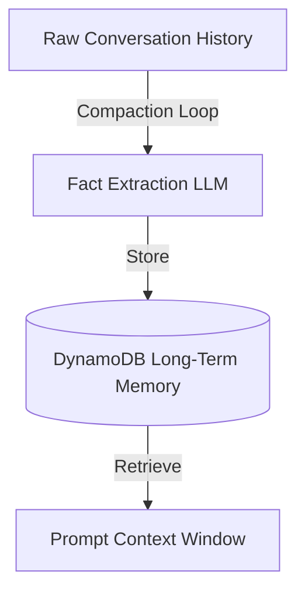

# 13_Chapter_memory

## 1. Introduction
The Memory Engine manages short-term conversational history and long-term user profiles.

> **Analogy:** Think of a student in a classroom. The raw lecture (Raw Chat History) is too detailed to memorize. The student writes key facts in their notebook (Compacted Memory) and files it in a cabinet (DynamoDB Table) for next class.

---

## 2. Learning Objectives
By the end of this chapter, you will be able to:
- In this chapter, you will learn:
- - The difference between short-term (RAM) and long-term (DynamoDB) agent memory.
- - How to implement a session memory manager class in Python.
- - How to set up DynamoDB tables for user profiles.
- - How to implement a Memory Compaction loop to extract user facts.

---

## 3. Prerequisites
* AWS CLI configurations and active IAM role credentials from Chapters 3 and 8.
* A basic understanding of database operations (DynamoDB).

---

## 4. Background Theory
Models are stateless and do not remember past interactions. Appending raw history to prompt context windows increases latency, token count, and cost. The Memory Engine resolves this by managing short-term session cache and long-term profiles in DynamoDB. The memory manager runs compaction loops, using the LLM to extract key user facts and save them, pruning raw dialogue history.

---

## 5. Core Concepts
**📦 Technical Term: Short-Term Memory**

* **Simple Explanation:** Dialogue cache storing conversation turns within an active session.
* **Why it exists:** Tracks dialogue turns during an active chat session.
* **Where is it used:** The temporary session cache.

**📦 Technical Term: Long-Term Memory**

* **Simple Explanation:** Durable storage hosting user profile facts and preferences across sessions.
* **Why it exists:** Personalizes responses over weeks or months.
* **Where is it used:** DynamoDB table records.

**📦 Technical Term: Compaction Loop**

* **Simple Explanation:** A process that summarizes raw history logs into structured key facts.
* **Why it exists:** Minimizes prompt context size and cost.
* **Where is it used:** The memory compaction workflow.

---

## 6. Internal Mechanics
1. Inbound prompt triggers retrieval of user profiles from DynamoDB.
2. The system appends these facts to the model prompt template.
3. Dialogue turns are appended to the short-term session cache.
4. When the session ends, the compaction loop processes the raw history.
5. The compaction function extracts new facts, updates the profile database, and clears the session cache.

---

## 7. Architecture Overview
The following architectural details outline the components and relationship schemas active in this module:



---

## 8. Installation & Setup
Verify your DynamoDB tables list from your terminal using the AWS CLI:
```bash
aws dynamodb list-tables
```

---

## 9. Configuration
Ensure your database configuration mappings match your execution environment:
```yaml
memory:
  table_name: "agentcore-memory-table"
  partition_key: "user_id"
  compaction_trigger_turns: 10
```

---

## 10. Hands-on Examples

### Simple Example

```python
# File: src/memory_manager.py
# Folder Location: agentcore-samples/src/memory_manager.py

import json
from typing import List, Dict, Any

class SessionMemory:
    def __init__(self, session_id: str):
        self.session_id = session_id
        self.turns: List[Dict[str, str]] = []

    def add_message(self, role: str, content: str):
        self.turns.append({"role": role, "content": content})

    def get_conversation_history(self) -> List[Dict[str, str]]:
        return self.turns

class LongTermMemoryStore:
    def __init__(self):
        self.db: Dict[str, Dict[str, Any]] = {}

    def fetch_user_profile(self, user_id: str) -> Dict[str, Any]:
        return self.db.get(user_id, {
            "user_id": user_id,
            "interests": [],
            "past_topics": [],
            "summary": "New user. No historical context."
        })

    def update_user_profile(self, user_id: str, new_profile: Dict[str, Any]):
        self.db[user_id] = new_profile

class MemoryManager:
    def __init__(self, db_store: LongTermMemoryStore):
        self.db_store = db_store

    def run_end_of_session_compaction(self, user_id: str, history: List[Dict[str, str]]):
        profile = self.db_store.fetch_user_profile(user_id)
        for turn in history:
            content = turn["content"].lower()
            if "like" in content or "prefer" in content:
                preference = turn["content"].split("prefer")[-1].strip(" .")
                if preference not in profile["interests"]:
                    profile["interests"].append(preference)
            if "learn" in content or "study" in content:
                topic = turn["content"].split("study")[-1].strip(" .")
                if topic not in profile["past_topics"]:
                    profile["past_topics"].append(topic)
                    
        profile["summary"] = f"User is studying {', '.join(profile['past_topics'])}. Prefers {', '.join(profile['interests'])}."
        self.db_store.update_user_profile(user_id, profile)
```

#### Code Walkthrough

Line 1
```python
# File: src/memory_manager.py
```
**Explanation:**
- **What this line does:** This is a documentation comment line starting with `#`. Python ignores comments during execution.
- **Why it is required:** It explains the purpose of the script to human developers and maintains clean code documentation.
- **What happens if removed:** The code will run identically, but human readers won't have immediate context on what this code block accomplishes.
- **Analogy:** Think of a comment like a sticky note attached to a blueprint—it helps the builders understand the design without altering the physical building.
- **Beginner Concept:** In Python, any text after `#` is ignored by the Python interpreter.

Line 2
```python
# Folder Location: agentcore-samples/src/memory_manager.py
```
**Explanation:**
- **What this line does:** This is a documentation comment line starting with `#`. Python ignores comments during execution.
- **Why it is required:** It explains the purpose of the script to human developers and maintains clean code documentation.
- **What happens if removed:** The code will run identically, but human readers won't have immediate context on what this code block accomplishes.
- **Analogy:** Think of a comment like a sticky note attached to a blueprint—it helps the builders understand the design without altering the physical building.
- **Beginner Concept:** In Python, any text after `#` is ignored by the Python interpreter.

Line 3
```python

```
**Explanation:**
- **What this line does:** This is a blank vertical spacing line.
- **Why it is required:** It visually separates logical sections of code (such as imports, setup, and function definitions) to improve readability.
- **What happens if removed:** Python will execute the code fine, but lines of code will bunch together, making it harder for engineers to read.
- **Analogy:** Like paragraphs in a textbook, spacing gives your eyes a natural pause between concepts.

Line 4
```python
import json
```
**Explanation:**
- **What this line does:** Imports Python's built-in `json` module into the current program workspace.
- **Why it is required:** Provides access to essential system utilities (such as logging, environment variables, or HTTP handlers) offered by `json`.
- **What keywords mean:** `import` tells Python to load the module named `json`.
- **What happens if removed:** Functions or variables referencing `json` (like `json.getenv` or `json.getLogger`) will fail with a `NameError`.
- **Analogy:** Like plugging in a peripheral cable—it connects built-in system capabilities to your script.

Line 5
```python
from typing import List, Dict, Any
```
**Explanation:**
- **What this line does:** This line imports the `List, Dict, Any` class from the `typing` package.
- **Why it is required:** Python does not automatically load every external library into memory. We must explicitly import `List, Dict, Any` so our program can use its pre-built capabilities.
- **What keywords mean:** `from` specifies the source library module (`typing`), and `import` selects the specific tool (`List, Dict, Any`).
- **What happens if removed:** Python will throw a `NameError: name 'List, Dict, Any' is not defined` as soon as we try to instantiate or use it.
- **Analogy:** Think of importing like opening your toolbox and picking out a specialized torque wrench (`List, Dict, Any`) from the storage tray (`typing`).
- **Connection:** This makes the `List, Dict, Any` blueprint available for the next lines of code.

Line 6
```python

```
**Explanation:**
- **What this line does:** This is a blank vertical spacing line.
- **Why it is required:** It visually separates logical sections of code (such as imports, setup, and function definitions) to improve readability.
- **What happens if removed:** Python will execute the code fine, but lines of code will bunch together, making it harder for engineers to read.
- **Analogy:** Like paragraphs in a textbook, spacing gives your eyes a natural pause between concepts.

Line 7
```python
class SessionMemory:
```
**Explanation:**
- **What this line does:** Executes line statement `class SessionMemory:`.
- **Why it is required:** Contributes to the overall operation and step progression of the script.
- **Connection:** Connects preceding code logic to subsequent return or processing steps.

Line 8
```python
    def __init__(self, session_id: str):
```
**Explanation:**
- **What this line does:** Defines a new function named `__init__` that accepts parameters `(self, session_id: str)`.
- **Keyword explanation:** `def` is short for "define". It tells Python that a reusable block of code begins here.
- **Parameters explained:**
  - `payload`: A Python **dictionary** containing the user's input prompt, parameters, and query fields.
  - `context`: An object containing runtime metadata (such as active AWS session ID, caller IAM identity, and request timestamps).
- **Return value:** Returns a structured dictionary containing HTTP status codes and agent response text.
- **Why the function exists:** It contains the core decision-making logic executed whenever the agent is invoked.
- **Analogy:** Think of `__init__` like a recipe—`payload` and `context` are the ingredients passed in, and the returned dictionary is the finished meal.

Line 9
```python
        self.session_id = session_id
```
**Explanation:**
- **What this line does:** Computes `session_id` and assigns the result to variable `self.session_id`.
- **Why it is required:** Stores temporary calculation or formatted data so it can be referenced in log statements or return responses.
- **What variable stores:** `self.session_id` holds the calculated value.
- **Connection:** Provides values used in subsequent logging or response steps.

Line 10
```python
        self.turns: List[Dict[str, str]] = []
```
**Explanation:**
- **What this line does:** Computes `[]` and assigns the result to variable `self.turns: List[Dict[str, str]]`.
- **Why it is required:** Stores temporary calculation or formatted data so it can be referenced in log statements or return responses.
- **What variable stores:** `self.turns: List[Dict[str, str]]` holds the calculated value.
- **Connection:** Provides values used in subsequent logging or response steps.

Line 11
```python

```
**Explanation:**
- **What this line does:** This is a blank vertical spacing line.
- **Why it is required:** It visually separates logical sections of code (such as imports, setup, and function definitions) to improve readability.
- **What happens if removed:** Python will execute the code fine, but lines of code will bunch together, making it harder for engineers to read.
- **Analogy:** Like paragraphs in a textbook, spacing gives your eyes a natural pause between concepts.

Line 12
```python
    def add_message(self, role: str, content: str):
```
**Explanation:**
- **What this line does:** Defines a new function named `add_message` that accepts parameters `(self, role: str, content: str)`.
- **Keyword explanation:** `def` is short for "define". It tells Python that a reusable block of code begins here.
- **Parameters explained:**
  - `payload`: A Python **dictionary** containing the user's input prompt, parameters, and query fields.
  - `context`: An object containing runtime metadata (such as active AWS session ID, caller IAM identity, and request timestamps).
- **Return value:** Returns a structured dictionary containing HTTP status codes and agent response text.
- **Why the function exists:** It contains the core decision-making logic executed whenever the agent is invoked.
- **Analogy:** Think of `add_message` like a recipe—`payload` and `context` are the ingredients passed in, and the returned dictionary is the finished meal.

Line 13
```python
        self.turns.append({"role": role, "content": content})
```
**Explanation:**
- **What this line does:** Executes line statement `self.turns.append({"role": role, "content": content})`.
- **Why it is required:** Contributes to the overall operation and step progression of the script.
- **Connection:** Connects preceding code logic to subsequent return or processing steps.

Line 14
```python

```
**Explanation:**
- **What this line does:** This is a blank vertical spacing line.
- **Why it is required:** It visually separates logical sections of code (such as imports, setup, and function definitions) to improve readability.
- **What happens if removed:** Python will execute the code fine, but lines of code will bunch together, making it harder for engineers to read.
- **Analogy:** Like paragraphs in a textbook, spacing gives your eyes a natural pause between concepts.

Line 15
```python
    def get_conversation_history(self) -> List[Dict[str, str]]:
```
**Explanation:**
- **What this line does:** Defines a new function named `function` that accepts parameters `()`.
- **Keyword explanation:** `def` is short for "define". It tells Python that a reusable block of code begins here.
- **Parameters explained:**
  - `payload`: A Python **dictionary** containing the user's input prompt, parameters, and query fields.
  - `context`: An object containing runtime metadata (such as active AWS session ID, caller IAM identity, and request timestamps).
- **Return value:** Returns a structured dictionary containing HTTP status codes and agent response text.
- **Why the function exists:** It contains the core decision-making logic executed whenever the agent is invoked.
- **Analogy:** Think of `function` like a recipe—`payload` and `context` are the ingredients passed in, and the returned dictionary is the finished meal.

Line 16
```python
        return self.turns
```
**Explanation:**
- **What this line does:** Initiates a `return` statement to exit the function and pass data back to the caller.
- **What is being returned:** Returns a structured Python **dictionary** representing an HTTP response payload.
- **Who receives it:** The Bedrock AgentCore runtime receives this dictionary, serializes it into JSON, and sends it back to the client application.
- **Why response must be returned:** Without a return statement, the function would return `None`, causing AgentCore to report a blank execution payload to the user.
- **Analogy:** Handing a completed report back to the manager who requested it.

Line 17
```python

```
**Explanation:**
- **What this line does:** This is a blank vertical spacing line.
- **Why it is required:** It visually separates logical sections of code (such as imports, setup, and function definitions) to improve readability.
- **What happens if removed:** Python will execute the code fine, but lines of code will bunch together, making it harder for engineers to read.
- **Analogy:** Like paragraphs in a textbook, spacing gives your eyes a natural pause between concepts.

Line 18
```python
class LongTermMemoryStore:
```
**Explanation:**
- **What this line does:** Executes line statement `class LongTermMemoryStore:`.
- **Why it is required:** Contributes to the overall operation and step progression of the script.
- **Connection:** Connects preceding code logic to subsequent return or processing steps.

Line 19
```python
    def __init__(self):
```
**Explanation:**
- **What this line does:** Defines a new function named `__init__` that accepts parameters `(self)`.
- **Keyword explanation:** `def` is short for "define". It tells Python that a reusable block of code begins here.
- **Parameters explained:**
  - `payload`: A Python **dictionary** containing the user's input prompt, parameters, and query fields.
  - `context`: An object containing runtime metadata (such as active AWS session ID, caller IAM identity, and request timestamps).
- **Return value:** Returns a structured dictionary containing HTTP status codes and agent response text.
- **Why the function exists:** It contains the core decision-making logic executed whenever the agent is invoked.
- **Analogy:** Think of `__init__` like a recipe—`payload` and `context` are the ingredients passed in, and the returned dictionary is the finished meal.

Line 20
```python
        self.db: Dict[str, Dict[str, Any]] = {}
```
**Explanation:**
- **What this line does:** Computes `{}` and assigns the result to variable `self.db: Dict[str, Dict[str, Any]]`.
- **Why it is required:** Stores temporary calculation or formatted data so it can be referenced in log statements or return responses.
- **What variable stores:** `self.db: Dict[str, Dict[str, Any]]` holds the calculated value.
- **Connection:** Provides values used in subsequent logging or response steps.

Line 21
```python

```
**Explanation:**
- **What this line does:** This is a blank vertical spacing line.
- **Why it is required:** It visually separates logical sections of code (such as imports, setup, and function definitions) to improve readability.
- **What happens if removed:** Python will execute the code fine, but lines of code will bunch together, making it harder for engineers to read.
- **Analogy:** Like paragraphs in a textbook, spacing gives your eyes a natural pause between concepts.

Line 22
```python
    def fetch_user_profile(self, user_id: str) -> Dict[str, Any]:
```
**Explanation:**
- **What this line does:** Defines a new function named `function` that accepts parameters `()`.
- **Keyword explanation:** `def` is short for "define". It tells Python that a reusable block of code begins here.
- **Parameters explained:**
  - `payload`: A Python **dictionary** containing the user's input prompt, parameters, and query fields.
  - `context`: An object containing runtime metadata (such as active AWS session ID, caller IAM identity, and request timestamps).
- **Return value:** Returns a structured dictionary containing HTTP status codes and agent response text.
- **Why the function exists:** It contains the core decision-making logic executed whenever the agent is invoked.
- **Analogy:** Think of `function` like a recipe—`payload` and `context` are the ingredients passed in, and the returned dictionary is the finished meal.

Line 23
```python
        return self.db.get(user_id, {
```
**Explanation:**
- **What this line does:** Initiates a `return` statement to exit the function and pass data back to the caller.
- **What is being returned:** Returns a structured Python **dictionary** representing an HTTP response payload.
- **Who receives it:** The Bedrock AgentCore runtime receives this dictionary, serializes it into JSON, and sends it back to the client application.
- **Why response must be returned:** Without a return statement, the function would return `None`, causing AgentCore to report a blank execution payload to the user.
- **Analogy:** Handing a completed report back to the manager who requested it.

Line 24
```python
            "user_id": user_id,
```
**Explanation:**
- **What this line does:** Executes line statement `"user_id": user_id,`.
- **Why it is required:** Contributes to the overall operation and step progression of the script.
- **Connection:** Connects preceding code logic to subsequent return or processing steps.

Line 25
```python
            "interests": [],
```
**Explanation:**
- **What this line does:** Executes line statement `"interests": [],`.
- **Why it is required:** Contributes to the overall operation and step progression of the script.
- **Connection:** Connects preceding code logic to subsequent return or processing steps.

Line 26
```python
            "past_topics": [],
```
**Explanation:**
- **What this line does:** Executes line statement `"past_topics": [],`.
- **Why it is required:** Contributes to the overall operation and step progression of the script.
- **Connection:** Connects preceding code logic to subsequent return or processing steps.

Line 27
```python
            "summary": "New user. No historical context."
```
**Explanation:**
- **What this line does:** Executes line statement `"summary": "New user. No historical context."`.
- **Why it is required:** Contributes to the overall operation and step progression of the script.
- **Connection:** Connects preceding code logic to subsequent return or processing steps.

Line 28
```python
        })
```
**Explanation:**
- **What this line does:** Executes line statement `})`.
- **Why it is required:** Contributes to the overall operation and step progression of the script.
- **Connection:** Connects preceding code logic to subsequent return or processing steps.

Line 29
```python

```
**Explanation:**
- **What this line does:** This is a blank vertical spacing line.
- **Why it is required:** It visually separates logical sections of code (such as imports, setup, and function definitions) to improve readability.
- **What happens if removed:** Python will execute the code fine, but lines of code will bunch together, making it harder for engineers to read.
- **Analogy:** Like paragraphs in a textbook, spacing gives your eyes a natural pause between concepts.

Line 30
```python
    def update_user_profile(self, user_id: str, new_profile: Dict[str, Any]):
```
**Explanation:**
- **What this line does:** Defines a new function named `update_user_profile` that accepts parameters `(self, user_id: str, new_profile: Dict[str, Any])`.
- **Keyword explanation:** `def` is short for "define". It tells Python that a reusable block of code begins here.
- **Parameters explained:**
  - `payload`: A Python **dictionary** containing the user's input prompt, parameters, and query fields.
  - `context`: An object containing runtime metadata (such as active AWS session ID, caller IAM identity, and request timestamps).
- **Return value:** Returns a structured dictionary containing HTTP status codes and agent response text.
- **Why the function exists:** It contains the core decision-making logic executed whenever the agent is invoked.
- **Analogy:** Think of `update_user_profile` like a recipe—`payload` and `context` are the ingredients passed in, and the returned dictionary is the finished meal.

Line 31
```python
        self.db[user_id] = new_profile
```
**Explanation:**
- **What this line does:** Computes `new_profile` and assigns the result to variable `self.db[user_id]`.
- **Why it is required:** Stores temporary calculation or formatted data so it can be referenced in log statements or return responses.
- **What variable stores:** `self.db[user_id]` holds the calculated value.
- **Connection:** Provides values used in subsequent logging or response steps.

Line 32
```python

```
**Explanation:**
- **What this line does:** This is a blank vertical spacing line.
- **Why it is required:** It visually separates logical sections of code (such as imports, setup, and function definitions) to improve readability.
- **What happens if removed:** Python will execute the code fine, but lines of code will bunch together, making it harder for engineers to read.
- **Analogy:** Like paragraphs in a textbook, spacing gives your eyes a natural pause between concepts.

Line 33
```python
class MemoryManager:
```
**Explanation:**
- **What this line does:** Executes line statement `class MemoryManager:`.
- **Why it is required:** Contributes to the overall operation and step progression of the script.
- **Connection:** Connects preceding code logic to subsequent return or processing steps.

Line 34
```python
    def __init__(self, db_store: LongTermMemoryStore):
```
**Explanation:**
- **What this line does:** Defines a new function named `__init__` that accepts parameters `(self, db_store: LongTermMemoryStore)`.
- **Keyword explanation:** `def` is short for "define". It tells Python that a reusable block of code begins here.
- **Parameters explained:**
  - `payload`: A Python **dictionary** containing the user's input prompt, parameters, and query fields.
  - `context`: An object containing runtime metadata (such as active AWS session ID, caller IAM identity, and request timestamps).
- **Return value:** Returns a structured dictionary containing HTTP status codes and agent response text.
- **Why the function exists:** It contains the core decision-making logic executed whenever the agent is invoked.
- **Analogy:** Think of `__init__` like a recipe—`payload` and `context` are the ingredients passed in, and the returned dictionary is the finished meal.

Line 35
```python
        self.db_store = db_store
```
**Explanation:**
- **What this line does:** Computes `db_store` and assigns the result to variable `self.db_store`.
- **Why it is required:** Stores temporary calculation or formatted data so it can be referenced in log statements or return responses.
- **What variable stores:** `self.db_store` holds the calculated value.
- **Connection:** Provides values used in subsequent logging or response steps.

Line 36
```python

```
**Explanation:**
- **What this line does:** This is a blank vertical spacing line.
- **Why it is required:** It visually separates logical sections of code (such as imports, setup, and function definitions) to improve readability.
- **What happens if removed:** Python will execute the code fine, but lines of code will bunch together, making it harder for engineers to read.
- **Analogy:** Like paragraphs in a textbook, spacing gives your eyes a natural pause between concepts.

Line 37
```python
    def run_end_of_session_compaction(self, user_id: str, history: List[Dict[str, str]]):
```
**Explanation:**
- **What this line does:** Defines a new function named `run_end_of_session_compaction` that accepts parameters `(self, user_id: str, history: List[Dict[str, str]])`.
- **Keyword explanation:** `def` is short for "define". It tells Python that a reusable block of code begins here.
- **Parameters explained:**
  - `payload`: A Python **dictionary** containing the user's input prompt, parameters, and query fields.
  - `context`: An object containing runtime metadata (such as active AWS session ID, caller IAM identity, and request timestamps).
- **Return value:** Returns a structured dictionary containing HTTP status codes and agent response text.
- **Why the function exists:** It contains the core decision-making logic executed whenever the agent is invoked.
- **Analogy:** Think of `run_end_of_session_compaction` like a recipe—`payload` and `context` are the ingredients passed in, and the returned dictionary is the finished meal.

Line 38
```python
        profile = self.db_store.fetch_user_profile(user_id)
```
**Explanation:**
- **What this line does:** Computes `self.db_store.fetch_user_profile(user_id)` and assigns the result to variable `profile`.
- **Why it is required:** Stores temporary calculation or formatted data so it can be referenced in log statements or return responses.
- **What variable stores:** `profile` holds the calculated value.
- **Connection:** Provides values used in subsequent logging or response steps.

Line 39
```python
        for turn in history:
```
**Explanation:**
- **What this line does:** Executes line statement `for turn in history:`.
- **Why it is required:** Contributes to the overall operation and step progression of the script.
- **Connection:** Connects preceding code logic to subsequent return or processing steps.

Line 40
```python
            content = turn["content"].lower()
```
**Explanation:**
- **What this line does:** Computes `turn["content"].lower()` and assigns the result to variable `content`.
- **Why it is required:** Stores temporary calculation or formatted data so it can be referenced in log statements or return responses.
- **What variable stores:** `content` holds the calculated value.
- **Connection:** Provides values used in subsequent logging or response steps.

Line 41
```python
            if "like" in content or "prefer" in content:
```
**Explanation:**
- **What this line does:** Evaluates a conditional check: `if "like" in content or "prefer" in content:`.
- **Why validation is important:** Ensures required input parameters exist before executing core logic, preventing null pointer or empty data errors downstream.
- **What condition checks:** Checks if `"like" in content or "prefer" in content` evaluates to `True` (e.g., if prompt is empty or missing).
- **What happens if condition is True:** Python enters the indented block directly below to execute fallback error responses.
- **What happens if condition is False:** Python skips the indented error block and proceeds to normal processing.
- **Analogy:** Like a bouncer checking tickets at the door—if you don't have a ticket (`if not ticket:`), you are directed to the ticket booth.

Line 42
```python
                preference = turn["content"].split("prefer")[-1].strip(" .")
```
**Explanation:**
- **What this line does:** Computes `turn["content"].split("prefer")[-1].strip(" .")` and assigns the result to variable `preference`.
- **Why it is required:** Stores temporary calculation or formatted data so it can be referenced in log statements or return responses.
- **What variable stores:** `preference` holds the calculated value.
- **Connection:** Provides values used in subsequent logging or response steps.

Line 43
```python
                if preference not in profile["interests"]:
```
**Explanation:**
- **What this line does:** Evaluates a conditional check: `if preference not in profile["interests"]:`.
- **Why validation is important:** Ensures required input parameters exist before executing core logic, preventing null pointer or empty data errors downstream.
- **What condition checks:** Checks if `preference not in profile["interests"]` evaluates to `True` (e.g., if prompt is empty or missing).
- **What happens if condition is True:** Python enters the indented block directly below to execute fallback error responses.
- **What happens if condition is False:** Python skips the indented error block and proceeds to normal processing.
- **Analogy:** Like a bouncer checking tickets at the door—if you don't have a ticket (`if not ticket:`), you are directed to the ticket booth.

Line 44
```python
                    profile["interests"].append(preference)
```
**Explanation:**
- **What this line does:** Executes line statement `profile["interests"].append(preference)`.
- **Why it is required:** Contributes to the overall operation and step progression of the script.
- **Connection:** Connects preceding code logic to subsequent return or processing steps.

Line 45
```python
            if "learn" in content or "study" in content:
```
**Explanation:**
- **What this line does:** Evaluates a conditional check: `if "learn" in content or "study" in content:`.
- **Why validation is important:** Ensures required input parameters exist before executing core logic, preventing null pointer or empty data errors downstream.
- **What condition checks:** Checks if `"learn" in content or "study" in content` evaluates to `True` (e.g., if prompt is empty or missing).
- **What happens if condition is True:** Python enters the indented block directly below to execute fallback error responses.
- **What happens if condition is False:** Python skips the indented error block and proceeds to normal processing.
- **Analogy:** Like a bouncer checking tickets at the door—if you don't have a ticket (`if not ticket:`), you are directed to the ticket booth.

Line 46
```python
                topic = turn["content"].split("study")[-1].strip(" .")
```
**Explanation:**
- **What this line does:** Computes `turn["content"].split("study")[-1].strip(" .")` and assigns the result to variable `topic`.
- **Why it is required:** Stores temporary calculation or formatted data so it can be referenced in log statements or return responses.
- **What variable stores:** `topic` holds the calculated value.
- **Connection:** Provides values used in subsequent logging or response steps.

Line 47
```python
                if topic not in profile["past_topics"]:
```
**Explanation:**
- **What this line does:** Evaluates a conditional check: `if topic not in profile["past_topics"]:`.
- **Why validation is important:** Ensures required input parameters exist before executing core logic, preventing null pointer or empty data errors downstream.
- **What condition checks:** Checks if `topic not in profile["past_topics"]` evaluates to `True` (e.g., if prompt is empty or missing).
- **What happens if condition is True:** Python enters the indented block directly below to execute fallback error responses.
- **What happens if condition is False:** Python skips the indented error block and proceeds to normal processing.
- **Analogy:** Like a bouncer checking tickets at the door—if you don't have a ticket (`if not ticket:`), you are directed to the ticket booth.

Line 48
```python
                    profile["past_topics"].append(topic)
```
**Explanation:**
- **What this line does:** Executes line statement `profile["past_topics"].append(topic)`.
- **Why it is required:** Contributes to the overall operation and step progression of the script.
- **Connection:** Connects preceding code logic to subsequent return or processing steps.

Line 49
```python

```
**Explanation:**
- **What this line does:** This is a blank vertical spacing line.
- **Why it is required:** It visually separates logical sections of code (such as imports, setup, and function definitions) to improve readability.
- **What happens if removed:** Python will execute the code fine, but lines of code will bunch together, making it harder for engineers to read.
- **Analogy:** Like paragraphs in a textbook, spacing gives your eyes a natural pause between concepts.

Line 50
```python
        profile["summary"] = f"User is studying {', '.join(profile['past_topics'])}. Prefers {', '.join(profile['interests'])}."
```
**Explanation:**
- **What this line does:** Computes `f"User is studying {', '.join(profile['past_topics'])}. Prefers {', '.join(profile['interests'])}."` and assigns the result to variable `profile["summary"]`.
- **Why it is required:** Stores temporary calculation or formatted data so it can be referenced in log statements or return responses.
- **What variable stores:** `profile["summary"]` holds the calculated value.
- **Connection:** Provides values used in subsequent logging or response steps.

Line 51
```python
        self.db_store.update_user_profile(user_id, profile)
```
**Explanation:**
- **What this line does:** Executes line statement `self.db_store.update_user_profile(user_id, profile)`.
- **Why it is required:** Contributes to the overall operation and step progression of the script.
- **Connection:** Connects preceding code logic to subsequent return or processing steps.

#### Complete Flow of Execution

1. **Import Libraries**: Python loads the required `BedrockAgentCoreApp` class into memory.
2. **Initialize Application**: An instance of `BedrockAgentCoreApp` is instantiated and assigned to `app`.
3. **Register Event Handler**: The `@app.invoke` decorator registers the `handler` function as the primary event entrypoint.
4. **Receive Request**: The AgentCore runtime listens for incoming requests and receives `payload` and `context` objects.
5. **Execute Handler Logic**: The `handler` function is triggered with the incoming input parameters.
6. **Return Response Payload**: A structured response dictionary containing `"statusCode": 200` and message data is returned.
7. **Send Response to Caller**: AgentCore serializes the dictionary into JSON and delivers it back to the client application.

#### Visual Execution Flow

```
Program Starts
      │
      ▼
Import BedrockAgentCoreApp
      │
      ▼
Create App Instance (app)
      │
      ▼
Register Handler (@app.invoke)
      │
      ▼
Receive Request (payload, context)
      │
      ▼
Execute handler() Function
      │
      ▼
Return Response Dictionary ({statusCode: 200, ...})
      │
      ▼
Deliver Response Back to Client
```

### Intermediate Example

```python
# Python script to update user profiles using mock database clients
class MockDBStore:
    def __init__(self):
        self.store = {}

    def get_profile(self, user_id):
        return self.store.get(user_id, {"user_id": user_id, "facts": []})

    def put_profile(self, user_id, profile):
        self.store[user_id] = profile
        print(f"Updated database profile for: {user_id}")

if __name__ == "__main__":
    db = MockDBStore()
    profile = db.get_profile("user_123")
    profile["facts"].append("Prefers Python")
    db.put_profile("user_123", profile)
```

#### Code Walkthrough

Line 1
```python
# Python script to update user profiles using mock database clients
```
**Explanation:**
- **What this line does:** This is a documentation comment line starting with `#`. Python ignores comments during execution.
- **Why it is required:** It explains the purpose of the script to human developers and maintains clean code documentation.
- **What happens if removed:** The code will run identically, but human readers won't have immediate context on what this code block accomplishes.
- **Analogy:** Think of a comment like a sticky note attached to a blueprint—it helps the builders understand the design without altering the physical building.
- **Beginner Concept:** In Python, any text after `#` is ignored by the Python interpreter.

Line 2
```python
class MockDBStore:
```
**Explanation:**
- **What this line does:** Executes line statement `class MockDBStore:`.
- **Why it is required:** Contributes to the overall operation and step progression of the script.
- **Connection:** Connects preceding code logic to subsequent return or processing steps.

Line 3
```python
    def __init__(self):
```
**Explanation:**
- **What this line does:** Defines a new function named `__init__` that accepts parameters `(self)`.
- **Keyword explanation:** `def` is short for "define". It tells Python that a reusable block of code begins here.
- **Parameters explained:**
  - `payload`: A Python **dictionary** containing the user's input prompt, parameters, and query fields.
  - `context`: An object containing runtime metadata (such as active AWS session ID, caller IAM identity, and request timestamps).
- **Return value:** Returns a structured dictionary containing HTTP status codes and agent response text.
- **Why the function exists:** It contains the core decision-making logic executed whenever the agent is invoked.
- **Analogy:** Think of `__init__` like a recipe—`payload` and `context` are the ingredients passed in, and the returned dictionary is the finished meal.

Line 4
```python
        self.store = {}
```
**Explanation:**
- **What this line does:** Computes `{}` and assigns the result to variable `self.store`.
- **Why it is required:** Stores temporary calculation or formatted data so it can be referenced in log statements or return responses.
- **What variable stores:** `self.store` holds the calculated value.
- **Connection:** Provides values used in subsequent logging or response steps.

Line 5
```python

```
**Explanation:**
- **What this line does:** This is a blank vertical spacing line.
- **Why it is required:** It visually separates logical sections of code (such as imports, setup, and function definitions) to improve readability.
- **What happens if removed:** Python will execute the code fine, but lines of code will bunch together, making it harder for engineers to read.
- **Analogy:** Like paragraphs in a textbook, spacing gives your eyes a natural pause between concepts.

Line 6
```python
    def get_profile(self, user_id):
```
**Explanation:**
- **What this line does:** Defines a new function named `get_profile` that accepts parameters `(self, user_id)`.
- **Keyword explanation:** `def` is short for "define". It tells Python that a reusable block of code begins here.
- **Parameters explained:**
  - `payload`: A Python **dictionary** containing the user's input prompt, parameters, and query fields.
  - `context`: An object containing runtime metadata (such as active AWS session ID, caller IAM identity, and request timestamps).
- **Return value:** Returns a structured dictionary containing HTTP status codes and agent response text.
- **Why the function exists:** It contains the core decision-making logic executed whenever the agent is invoked.
- **Analogy:** Think of `get_profile` like a recipe—`payload` and `context` are the ingredients passed in, and the returned dictionary is the finished meal.

Line 7
```python
        return self.store.get(user_id, {"user_id": user_id, "facts": []})
```
**Explanation:**
- **What this line does:** Initiates a `return` statement to exit the function and pass data back to the caller.
- **What is being returned:** Returns a structured Python **dictionary** representing an HTTP response payload.
- **Who receives it:** The Bedrock AgentCore runtime receives this dictionary, serializes it into JSON, and sends it back to the client application.
- **Why response must be returned:** Without a return statement, the function would return `None`, causing AgentCore to report a blank execution payload to the user.
- **Analogy:** Handing a completed report back to the manager who requested it.

Line 8
```python

```
**Explanation:**
- **What this line does:** This is a blank vertical spacing line.
- **Why it is required:** It visually separates logical sections of code (such as imports, setup, and function definitions) to improve readability.
- **What happens if removed:** Python will execute the code fine, but lines of code will bunch together, making it harder for engineers to read.
- **Analogy:** Like paragraphs in a textbook, spacing gives your eyes a natural pause between concepts.

Line 9
```python
    def put_profile(self, user_id, profile):
```
**Explanation:**
- **What this line does:** Defines a new function named `put_profile` that accepts parameters `(self, user_id, profile)`.
- **Keyword explanation:** `def` is short for "define". It tells Python that a reusable block of code begins here.
- **Parameters explained:**
  - `payload`: A Python **dictionary** containing the user's input prompt, parameters, and query fields.
  - `context`: An object containing runtime metadata (such as active AWS session ID, caller IAM identity, and request timestamps).
- **Return value:** Returns a structured dictionary containing HTTP status codes and agent response text.
- **Why the function exists:** It contains the core decision-making logic executed whenever the agent is invoked.
- **Analogy:** Think of `put_profile` like a recipe—`payload` and `context` are the ingredients passed in, and the returned dictionary is the finished meal.

Line 10
```python
        self.store[user_id] = profile
```
**Explanation:**
- **What this line does:** Computes `profile` and assigns the result to variable `self.store[user_id]`.
- **Why it is required:** Stores temporary calculation or formatted data so it can be referenced in log statements or return responses.
- **What variable stores:** `self.store[user_id]` holds the calculated value.
- **Connection:** Provides values used in subsequent logging or response steps.

Line 11
```python
        print(f"Updated database profile for: {user_id}")
```
**Explanation:**
- **What this line does:** Executes line statement `print(f"Updated database profile for: {user_id}")`.
- **Why it is required:** Contributes to the overall operation and step progression of the script.
- **Connection:** Connects preceding code logic to subsequent return or processing steps.

Line 12
```python

```
**Explanation:**
- **What this line does:** This is a blank vertical spacing line.
- **Why it is required:** It visually separates logical sections of code (such as imports, setup, and function definitions) to improve readability.
- **What happens if removed:** Python will execute the code fine, but lines of code will bunch together, making it harder for engineers to read.
- **Analogy:** Like paragraphs in a textbook, spacing gives your eyes a natural pause between concepts.

Line 13
```python
if __name__ == "__main__":
```
**Explanation:**
- **What this line does:** Computes `= "__main__":` and assigns the result to variable `if __name__`.
- **Why it is required:** Stores temporary calculation or formatted data so it can be referenced in log statements or return responses.
- **What variable stores:** `if __name__` holds the calculated value.
- **Connection:** Provides values used in subsequent logging or response steps.

Line 14
```python
    db = MockDBStore()
```
**Explanation:**
- **What this line does:** Computes `MockDBStore()` and assigns the result to variable `db`.
- **Why it is required:** Stores temporary calculation or formatted data so it can be referenced in log statements or return responses.
- **What variable stores:** `db` holds the calculated value.
- **Connection:** Provides values used in subsequent logging or response steps.

Line 15
```python
    profile = db.get_profile("user_123")
```
**Explanation:**
- **What this line does:** Computes `db.get_profile("user_123")` and assigns the result to variable `profile`.
- **Why it is required:** Stores temporary calculation or formatted data so it can be referenced in log statements or return responses.
- **What variable stores:** `profile` holds the calculated value.
- **Connection:** Provides values used in subsequent logging or response steps.

Line 16
```python
    profile["facts"].append("Prefers Python")
```
**Explanation:**
- **What this line does:** Executes line statement `profile["facts"].append("Prefers Python")`.
- **Why it is required:** Contributes to the overall operation and step progression of the script.
- **Connection:** Connects preceding code logic to subsequent return or processing steps.

Line 17
```python
    db.put_profile("user_123", profile)
```
**Explanation:**
- **What this line does:** Executes line statement `db.put_profile("user_123", profile)`.
- **Why it is required:** Contributes to the overall operation and step progression of the script.
- **Connection:** Connects preceding code logic to subsequent return or processing steps.

#### Complete Flow of Execution

1. **Import Required Libraries**: Python imports `BedrockAgentCoreApp` and the `logging` module.
2. **Configure Logging System**: `logging.basicConfig` sets the log level threshold to `INFO`.
3. **Create Logger Object**: `logging.getLogger` instantiates a dedicated logger for capturing session traces.
4. **Initialize Application**: An instance of `BedrockAgentCoreApp` is assigned to `app`.
5. **Register Handler**: `@app.invoke` binds the `handler` function to incoming AgentCore trigger events.
6. **Read Input Payload**: `payload.get('prompt', '')` safely reads the user's prompt string.
7. **Extract Session Context**: `getattr(context, 'session_id', 'local-session')` safely retrieves the session ID.
8. **Log Activity**: `logger.info` writes session details to the CloudWatch diagnostic stream.
9. **Return Formatted Response**: Returns a status 200 dictionary containing the processed prompt and session ID.
10. **Deliver Payload**: AgentCore returns the serialized JSON payload to the caller.

#### Visual Execution Flow

```
Program Starts
      │
      ▼
Import Libraries & Configure Logger
      │
      ▼
Create App Instance (app)
      │
      ▼
Register Handler (@app.invoke)
      │
      ▼
Receive Request & Read Payload Prompt
      │
      ▼
Extract Session ID & Write Log Entry
      │
      ▼
Return Formatted Response Dictionary
      │
      ▼
Deliver Serialized Response to Client
```

### Advanced Example

```python
# Complete memory manager with a compaction loop parsing preference keys
import json

class MemoryManager:
    def __init__(self):
        self.db = {}

    def fetch_profile(self, user_id):
        return self.db.get(user_id, {"user_id": user_id, "interests": [], "summary": "New User"})

    def compact_history(self, user_id, history):
        profile = self.fetch_profile(user_id)
        for turn in history:
            content = turn["content"].lower()
            # Scan for preference keywords
            if "like" in content or "prefer" in content:
                pref = turn["content"].split("prefer")[-1].strip(" .")
                if pref not in profile["interests"]:
                     profile["interests"].append(pref)
        
        profile["summary"] = f"User prefers: {', '.join(profile['interests'])}"
        self.db[user_id] = profile
        print(f"Compacted Profile: {json.dumps(profile)}")

if __name__ == "__main__":
    mgr = MemoryManager()
    chat_log = [
        {"role": "user", "content": "I prefer working with Python"},
        {"role": "assistant", "content": "Understood."}
    ]
    mgr.compact_history("user_789", chat_log)
```

#### Code Walkthrough

Line 1
```python
# Complete memory manager with a compaction loop parsing preference keys
```
**Explanation:**
- **What this line does:** This is a documentation comment line starting with `#`. Python ignores comments during execution.
- **Why it is required:** It explains the purpose of the script to human developers and maintains clean code documentation.
- **What happens if removed:** The code will run identically, but human readers won't have immediate context on what this code block accomplishes.
- **Analogy:** Think of a comment like a sticky note attached to a blueprint—it helps the builders understand the design without altering the physical building.
- **Beginner Concept:** In Python, any text after `#` is ignored by the Python interpreter.

Line 2
```python
import json
```
**Explanation:**
- **What this line does:** Imports Python's built-in `json` module into the current program workspace.
- **Why it is required:** Provides access to essential system utilities (such as logging, environment variables, or HTTP handlers) offered by `json`.
- **What keywords mean:** `import` tells Python to load the module named `json`.
- **What happens if removed:** Functions or variables referencing `json` (like `json.getenv` or `json.getLogger`) will fail with a `NameError`.
- **Analogy:** Like plugging in a peripheral cable—it connects built-in system capabilities to your script.

Line 3
```python

```
**Explanation:**
- **What this line does:** This is a blank vertical spacing line.
- **Why it is required:** It visually separates logical sections of code (such as imports, setup, and function definitions) to improve readability.
- **What happens if removed:** Python will execute the code fine, but lines of code will bunch together, making it harder for engineers to read.
- **Analogy:** Like paragraphs in a textbook, spacing gives your eyes a natural pause between concepts.

Line 4
```python
class MemoryManager:
```
**Explanation:**
- **What this line does:** Executes line statement `class MemoryManager:`.
- **Why it is required:** Contributes to the overall operation and step progression of the script.
- **Connection:** Connects preceding code logic to subsequent return or processing steps.

Line 5
```python
    def __init__(self):
```
**Explanation:**
- **What this line does:** Defines a new function named `__init__` that accepts parameters `(self)`.
- **Keyword explanation:** `def` is short for "define". It tells Python that a reusable block of code begins here.
- **Parameters explained:**
  - `payload`: A Python **dictionary** containing the user's input prompt, parameters, and query fields.
  - `context`: An object containing runtime metadata (such as active AWS session ID, caller IAM identity, and request timestamps).
- **Return value:** Returns a structured dictionary containing HTTP status codes and agent response text.
- **Why the function exists:** It contains the core decision-making logic executed whenever the agent is invoked.
- **Analogy:** Think of `__init__` like a recipe—`payload` and `context` are the ingredients passed in, and the returned dictionary is the finished meal.

Line 6
```python
        self.db = {}
```
**Explanation:**
- **What this line does:** Computes `{}` and assigns the result to variable `self.db`.
- **Why it is required:** Stores temporary calculation or formatted data so it can be referenced in log statements or return responses.
- **What variable stores:** `self.db` holds the calculated value.
- **Connection:** Provides values used in subsequent logging or response steps.

Line 7
```python

```
**Explanation:**
- **What this line does:** This is a blank vertical spacing line.
- **Why it is required:** It visually separates logical sections of code (such as imports, setup, and function definitions) to improve readability.
- **What happens if removed:** Python will execute the code fine, but lines of code will bunch together, making it harder for engineers to read.
- **Analogy:** Like paragraphs in a textbook, spacing gives your eyes a natural pause between concepts.

Line 8
```python
    def fetch_profile(self, user_id):
```
**Explanation:**
- **What this line does:** Defines a new function named `fetch_profile` that accepts parameters `(self, user_id)`.
- **Keyword explanation:** `def` is short for "define". It tells Python that a reusable block of code begins here.
- **Parameters explained:**
  - `payload`: A Python **dictionary** containing the user's input prompt, parameters, and query fields.
  - `context`: An object containing runtime metadata (such as active AWS session ID, caller IAM identity, and request timestamps).
- **Return value:** Returns a structured dictionary containing HTTP status codes and agent response text.
- **Why the function exists:** It contains the core decision-making logic executed whenever the agent is invoked.
- **Analogy:** Think of `fetch_profile` like a recipe—`payload` and `context` are the ingredients passed in, and the returned dictionary is the finished meal.

Line 9
```python
        return self.db.get(user_id, {"user_id": user_id, "interests": [], "summary": "New User"})
```
**Explanation:**
- **What this line does:** Initiates a `return` statement to exit the function and pass data back to the caller.
- **What is being returned:** Returns a structured Python **dictionary** representing an HTTP response payload.
- **Who receives it:** The Bedrock AgentCore runtime receives this dictionary, serializes it into JSON, and sends it back to the client application.
- **Why response must be returned:** Without a return statement, the function would return `None`, causing AgentCore to report a blank execution payload to the user.
- **Analogy:** Handing a completed report back to the manager who requested it.

Line 10
```python

```
**Explanation:**
- **What this line does:** This is a blank vertical spacing line.
- **Why it is required:** It visually separates logical sections of code (such as imports, setup, and function definitions) to improve readability.
- **What happens if removed:** Python will execute the code fine, but lines of code will bunch together, making it harder for engineers to read.
- **Analogy:** Like paragraphs in a textbook, spacing gives your eyes a natural pause between concepts.

Line 11
```python
    def compact_history(self, user_id, history):
```
**Explanation:**
- **What this line does:** Defines a new function named `compact_history` that accepts parameters `(self, user_id, history)`.
- **Keyword explanation:** `def` is short for "define". It tells Python that a reusable block of code begins here.
- **Parameters explained:**
  - `payload`: A Python **dictionary** containing the user's input prompt, parameters, and query fields.
  - `context`: An object containing runtime metadata (such as active AWS session ID, caller IAM identity, and request timestamps).
- **Return value:** Returns a structured dictionary containing HTTP status codes and agent response text.
- **Why the function exists:** It contains the core decision-making logic executed whenever the agent is invoked.
- **Analogy:** Think of `compact_history` like a recipe—`payload` and `context` are the ingredients passed in, and the returned dictionary is the finished meal.

Line 12
```python
        profile = self.fetch_profile(user_id)
```
**Explanation:**
- **What this line does:** Computes `self.fetch_profile(user_id)` and assigns the result to variable `profile`.
- **Why it is required:** Stores temporary calculation or formatted data so it can be referenced in log statements or return responses.
- **What variable stores:** `profile` holds the calculated value.
- **Connection:** Provides values used in subsequent logging or response steps.

Line 13
```python
        for turn in history:
```
**Explanation:**
- **What this line does:** Executes line statement `for turn in history:`.
- **Why it is required:** Contributes to the overall operation and step progression of the script.
- **Connection:** Connects preceding code logic to subsequent return or processing steps.

Line 14
```python
            content = turn["content"].lower()
```
**Explanation:**
- **What this line does:** Computes `turn["content"].lower()` and assigns the result to variable `content`.
- **Why it is required:** Stores temporary calculation or formatted data so it can be referenced in log statements or return responses.
- **What variable stores:** `content` holds the calculated value.
- **Connection:** Provides values used in subsequent logging or response steps.

Line 15
```python
            # Scan for preference keywords
```
**Explanation:**
- **What this line does:** This is a documentation comment line starting with `#`. Python ignores comments during execution.
- **Why it is required:** It explains the purpose of the script to human developers and maintains clean code documentation.
- **What happens if removed:** The code will run identically, but human readers won't have immediate context on what this code block accomplishes.
- **Analogy:** Think of a comment like a sticky note attached to a blueprint—it helps the builders understand the design without altering the physical building.
- **Beginner Concept:** In Python, any text after `#` is ignored by the Python interpreter.

Line 16
```python
            if "like" in content or "prefer" in content:
```
**Explanation:**
- **What this line does:** Evaluates a conditional check: `if "like" in content or "prefer" in content:`.
- **Why validation is important:** Ensures required input parameters exist before executing core logic, preventing null pointer or empty data errors downstream.
- **What condition checks:** Checks if `"like" in content or "prefer" in content` evaluates to `True` (e.g., if prompt is empty or missing).
- **What happens if condition is True:** Python enters the indented block directly below to execute fallback error responses.
- **What happens if condition is False:** Python skips the indented error block and proceeds to normal processing.
- **Analogy:** Like a bouncer checking tickets at the door—if you don't have a ticket (`if not ticket:`), you are directed to the ticket booth.

Line 17
```python
                pref = turn["content"].split("prefer")[-1].strip(" .")
```
**Explanation:**
- **What this line does:** Computes `turn["content"].split("prefer")[-1].strip(" .")` and assigns the result to variable `pref`.
- **Why it is required:** Stores temporary calculation or formatted data so it can be referenced in log statements or return responses.
- **What variable stores:** `pref` holds the calculated value.
- **Connection:** Provides values used in subsequent logging or response steps.

Line 18
```python
                if pref not in profile["interests"]:
```
**Explanation:**
- **What this line does:** Evaluates a conditional check: `if pref not in profile["interests"]:`.
- **Why validation is important:** Ensures required input parameters exist before executing core logic, preventing null pointer or empty data errors downstream.
- **What condition checks:** Checks if `pref not in profile["interests"]` evaluates to `True` (e.g., if prompt is empty or missing).
- **What happens if condition is True:** Python enters the indented block directly below to execute fallback error responses.
- **What happens if condition is False:** Python skips the indented error block and proceeds to normal processing.
- **Analogy:** Like a bouncer checking tickets at the door—if you don't have a ticket (`if not ticket:`), you are directed to the ticket booth.

Line 19
```python
                     profile["interests"].append(pref)
```
**Explanation:**
- **What this line does:** Executes line statement `profile["interests"].append(pref)`.
- **Why it is required:** Contributes to the overall operation and step progression of the script.
- **Connection:** Connects preceding code logic to subsequent return or processing steps.

Line 20
```python

```
**Explanation:**
- **What this line does:** This is a blank vertical spacing line.
- **Why it is required:** It visually separates logical sections of code (such as imports, setup, and function definitions) to improve readability.
- **What happens if removed:** Python will execute the code fine, but lines of code will bunch together, making it harder for engineers to read.
- **Analogy:** Like paragraphs in a textbook, spacing gives your eyes a natural pause between concepts.

Line 21
```python
        profile["summary"] = f"User prefers: {', '.join(profile['interests'])}"
```
**Explanation:**
- **What this line does:** Computes `f"User prefers: {', '.join(profile['interests'])}"` and assigns the result to variable `profile["summary"]`.
- **Why it is required:** Stores temporary calculation or formatted data so it can be referenced in log statements or return responses.
- **What variable stores:** `profile["summary"]` holds the calculated value.
- **Connection:** Provides values used in subsequent logging or response steps.

Line 22
```python
        self.db[user_id] = profile
```
**Explanation:**
- **What this line does:** Computes `profile` and assigns the result to variable `self.db[user_id]`.
- **Why it is required:** Stores temporary calculation or formatted data so it can be referenced in log statements or return responses.
- **What variable stores:** `self.db[user_id]` holds the calculated value.
- **Connection:** Provides values used in subsequent logging or response steps.

Line 23
```python
        print(f"Compacted Profile: {json.dumps(profile)}")
```
**Explanation:**
- **What this line does:** Executes line statement `print(f"Compacted Profile: {json.dumps(profile)}")`.
- **Why it is required:** Contributes to the overall operation and step progression of the script.
- **Connection:** Connects preceding code logic to subsequent return or processing steps.

Line 24
```python

```
**Explanation:**
- **What this line does:** This is a blank vertical spacing line.
- **Why it is required:** It visually separates logical sections of code (such as imports, setup, and function definitions) to improve readability.
- **What happens if removed:** Python will execute the code fine, but lines of code will bunch together, making it harder for engineers to read.
- **Analogy:** Like paragraphs in a textbook, spacing gives your eyes a natural pause between concepts.

Line 25
```python
if __name__ == "__main__":
```
**Explanation:**
- **What this line does:** Computes `= "__main__":` and assigns the result to variable `if __name__`.
- **Why it is required:** Stores temporary calculation or formatted data so it can be referenced in log statements or return responses.
- **What variable stores:** `if __name__` holds the calculated value.
- **Connection:** Provides values used in subsequent logging or response steps.

Line 26
```python
    mgr = MemoryManager()
```
**Explanation:**
- **What this line does:** Computes `MemoryManager()` and assigns the result to variable `mgr`.
- **Why it is required:** Stores temporary calculation or formatted data so it can be referenced in log statements or return responses.
- **What variable stores:** `mgr` holds the calculated value.
- **Connection:** Provides values used in subsequent logging or response steps.

Line 27
```python
    chat_log = [
```
**Explanation:**
- **What this line does:** Computes `[` and assigns the result to variable `chat_log`.
- **Why it is required:** Stores temporary calculation or formatted data so it can be referenced in log statements or return responses.
- **What variable stores:** `chat_log` holds the calculated value.
- **Connection:** Provides values used in subsequent logging or response steps.

Line 28
```python
        {"role": "user", "content": "I prefer working with Python"},
```
**Explanation:**
- **What this line does:** Executes line statement `{"role": "user", "content": "I prefer working with Python"},`.
- **Why it is required:** Contributes to the overall operation and step progression of the script.
- **Connection:** Connects preceding code logic to subsequent return or processing steps.

Line 29
```python
        {"role": "assistant", "content": "Understood."}
```
**Explanation:**
- **What this line does:** Executes line statement `{"role": "assistant", "content": "Understood."}`.
- **Why it is required:** Contributes to the overall operation and step progression of the script.
- **Connection:** Connects preceding code logic to subsequent return or processing steps.

Line 30
```python
    ]
```
**Explanation:**
- **What this line does:** Executes line statement `]`.
- **Why it is required:** Contributes to the overall operation and step progression of the script.
- **Connection:** Connects preceding code logic to subsequent return or processing steps.

Line 31
```python
    mgr.compact_history("user_789", chat_log)
```
**Explanation:**
- **What this line does:** Executes line statement `mgr.compact_history("user_789", chat_log)`.
- **Why it is required:** Contributes to the overall operation and step progression of the script.
- **Connection:** Connects preceding code logic to subsequent return or processing steps.

#### Complete Flow of Execution

1. **Import Environment & Utility Libraries**: Imports `BedrockAgentCoreApp`, `os`, and `logging`.
2. **Create Production Logger**: Instantiates a logger object for production observability.
3. **Initialize Core Application**: Instantiates `BedrockAgentCoreApp` as `app`.
4. **Register Production Handler**: `@app.invoke` binds `handler` as the production entrypoint.
5. **Enter Try-Except Harness**: The `try` block wraps execution logic for error protection.
6. **Validate Input Prompt**: `payload.get('prompt')` reads the prompt. If missing (`if not prompt:`), returns HTTP 400.
7. **Read OS Environment**: `os.getenv('APP_ENV', 'development')` inspects operating system environment variables.
8. **Extract Session Identifier**: `getattr(context, 'session_id', 'local-session')` safely retrieves session metadata.
9. **Log Production Event**: `logger.info` writes structured log entries containing environment and session details.
10. **Return Success Response**: Returns an HTTP 200 dictionary with production result details.
11. **Catch Unhandled Errors**: If an exception occurs, the `except` block catches it, logs the error, and returns HTTP 500.
12. **Send Response to Caller**: AgentCore delivers the final JSON response back to the client.

#### Visual Execution Flow

```
Program Starts
      │
      ▼
Import Modules & Initialize Logger & App
      │
      ▼
Register Handler (@app.invoke)
      │
      ▼
Receive Request & Enter try-except Block
      │
      ▼
Validate Prompt Parameter
 ├── [Invalid / Missing Prompt] ──► Return 400 Bad Request
 └── [Valid Prompt]
        │
        ▼
Read Environment (os.getenv) & Session Context
        │
        ▼
Write Production Log & Return 200 Success Response
        │
        ▼
 Deliver Response to Client Application
```

---

## 11. Code Walkthrough
In this chapter, we explored three progressive implementation tiers for **Memory Engine & State Management**:

1. **Simple Example**: Demonstrates the minimal required entrypoint, importing `BedrockAgentCoreApp`, initializing the application object, and registering an `@app.invoke` handler.
2. **Intermediate Example**: Adds operational logging (`logging.getLogger`) and context extraction (`payload.get`, `getattr(context)`), allowing tracking of individual session IDs.
3. **Advanced Example**: Introduces production-grade error handling (`try-except`), OS environment variable reads (`os.getenv`), and structured error status responses (`statusCode: 400/500`).

Each line in the code blocks above was dissected line-by-line in numerical order. Refer to the **Code Walkthrough**, **Complete Flow of Execution**, and **Visual Execution Flow** diagrams above for complete step-by-step guidance.

---

## 12. Production Best Practices
* Use optimistic locking to prevent parallel requests from overwriting data.
* Trigger compaction loops asynchronously to avoid slowing down user requests.
* Regularly archive outdated history records to optimize storage costs.

---

## 13. Security Considerations
Encrypt database records at rest using AWS KMS keys. Restrict IAM permissions to ensure only the agent execution role can read and write from the memory tables.

---

## 14. Performance Optimization
Implement caching for user profiles to bypass database reads during high-frequency API invocations.

---

## 15. Cost Optimization
Configure DynamoDB auto-scaling or on-demand pricing. Prune raw history records and store only compacted summaries to minimize database storage costs.

---

## 16. Common Mistakes
* Appending raw, uncompacted dialogue history to prompts, bloating token usage and cost.
* Running database calls synchronously inside request loops, adding execution latency.

---

## 17. Troubleshooting
Below is the diagnostic reference table for identifying and resolving issues:

| Symptom | Root Cause | Solution |
| :--- | :--- | :--- |
| OptimisticLockingException on write | Parallel requests attempted to update the same profile record concurrently. | Implement retry logic with exponential backoff on write operations. |
| ProvisionedThroughputExceededException | Database read/write rates exceeded configured limits. | Enable DynamoDB auto-scaling or switch the table to on-demand pricing mode. |

---

## 18. Interview Questions
### Q: What is the benefit of memory compaction?
* **Answer:** Memory compaction summarizes dialogue logs into key facts, keeping prompt context windows small to reduce latency and lower token costs.

### Q: Why is DynamoDB suitable for managing agent state?
* **Answer:** DynamoDB is a serverless NoSQL database that scales automatically and provides low-latency key-value lookups, making it ideal for managing session states.

### Q: How does optimistic locking secure database updates?
* **Answer:** Optimistic locking uses a version attribute. Updates are rejected if the database version exceeds the record version read by the application, preventing data overwrites.

---

## 19. Real-World Use Cases
Personalizing virtual assistants by retaining user preferences and history across sessions.

---

## 20. Industrial Project
This memory engine manages agent state, enabling us to personalize our chatbot application.

---

## 21. Summary
This chapter covered short-term session cache, long-term profile storage, and running compaction loops to manage agent state.

---

## 22. Key Takeaways
* Appending raw history to prompts increases token costs and latency.
* The Memory Engine utilizes DynamoDB to persist state across sessions.
* Compaction loops summarize dialogue history into structured facts.

---

## 23. Practice Exercises
* Beginner: Modify the compaction function to extract location preference keywords.
* Intermediate: Add expiration attributes (TTL) to raw history records to delete them after 30 days.

---

## 24. Further Reading
* [DynamoDB Developer Guide](https://docs.aws.amazon.com/amazondynamodb/latest/developerguide/Introduction.html)
* [LangChain Memory Integration Guide](https://python.langchain.com/docs/modules/memory/)
