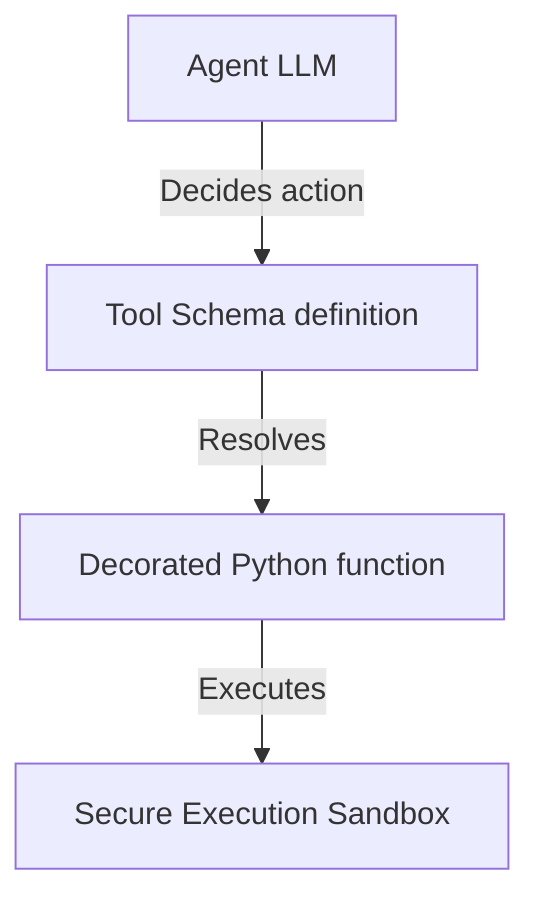

# 14_Chapter_tools

## 1. Introduction
Custom tools extend agent capabilities by allowing them to execute code and query external web services.

> **Analogy:** Think of a carpenter with a tool chest. The carpenter (the LLM) knows how to design a cabinet but has no physical hands. They select the saw (tool) from the chest (registry) and execute the cut.

---

## 2. Learning Objectives
By the end of this chapter, you will be able to:
- In this chapter, you will learn how to:
- - Define parameter schemas for custom tools using JSON.
- - Register Python functions in a central Tool Registry.
- - Coordinate tool invocation requests from the foundation model.
- - Enforce exception handling in tool executions.

---

## 3. Prerequisites
* Active installations and AWS configurations from Chapters 6 and 8.
* A basic understanding of Python function definitions and parameter type annotations.

---

## 4. Background Theory
Models can only process and generate text; they cannot access databases or run code directly. Integrating tools extends their capabilities. However, exposing APIs directly to LLMs risks SQL injection attacks. A tool gateway acts as a secure broker. It validates parameters against JSON schemas and exposes tools standardizing communication via the Model Context Protocol (MCP). Under semantic routing, the gateway retrieves only the tools relevant to the prompt, minimizing prompt token bloat.

---

## 5. Core Concepts
**📦 Technical Term: Tool Registry**

* **Simple Explanation:** A central repository class that manages tool functions and metadata schemas.
* **Why it exists:** Coordinates tool registrations and lookup operations.
* **Where is it used:** The tool registry module.

**📦 Technical Term: JSON Schema**

* **Simple Explanation:** A JSON object declaring parameter names, types, and descriptions for validation.
* **Why it exists:** Enforces parameter schemas before functions execute.
* **Where is it used:** The parameters definition dictionary.

**📦 Technical Term: @tool Decorator**

* **Simple Explanation:** A decorator helper that generates JSON schemas from Python function docstrings.
* **Why it exists:** Simplifies tool definition and registration.
* **Where is it used:** Decorating Python functions.

---

## 6. Internal Mechanics
1. The model determines it needs external data to complete a prompt.
2. It returns a tool call payload specifying the target tool name and parameters.
3. The Tool Registry intercepts the call and validates parameters against the JSON schema.
4. If validation succeeds, it executes the registered Python function.
5. The function executes in a secure sandbox, returning outputs to the model to complete the loop.

---

## 7. Architecture Overview
The following architectural details outline the components and relationship schemas active in this module:



---

## 8. Installation & Setup
Validate custom tool execution syntax using the CLI:
```bash
agentcore tools validate --file src/main.py
```

---

## 9. Configuration
Configure registered tools and execution boundaries in your configuration files:
```yaml
tools:
  - name: "lookup_warranty_status"
    entry_point: "src/tools.py"
    timeout_seconds: 10
```

---

## 10. Hands-on Examples

### Simple Example

```python
# File: src/tools_impl.py
# Folder Location: agentcore-samples/src/tools_impl.py

import json
from typing import Dict, Any

# =====================================================================
# 1. Define Tool Schema
# =====================================================================
LOOKUP_WARRANTY_SCHEMA = {
    "name": "lookup_warranty_status",
    "description": "Retrieve the warranty coverage status for a specific customer order ID.",
    "inputSchema": {
        "json": {
            "type": "object",
            "properties": {
                "order_id": {
                    "type": "string",
                    "description": "The unique 5-digit order identifier (e.g., '12345')."
                }
            },
            "required": ["order_id"]
        }
    }
}

# =====================================================================
# 2. Implement Tool Executor
# =====================================================================
class ToolRegistry:
    def __init__(self):
        self.tools = {}

    def register_tool(self, name: str, func):
        self.tools[name] = func

    def execute_tool(self, name: str, arguments: Dict[str, Any]) -> str:
        if name not in self.tools:
            return f"Error: Tool '{name}' is not registered."
            
        try:
            return self.tools[name](**arguments)
        except Exception as e:
            return f"Execution error in tool '{name}': {str(e)}"

# Define the python function
def lookup_warranty_status(order_id: str) -> str:
    db_mock = {
        "12345": "Expired (254 days ago)",
        "67890": "Active - Under coverage"
    }
    return db_mock.get(order_id, "Order ID not found.")

# Register tool
registry = ToolRegistry()
registry.register_tool("lookup_warranty_status", lookup_warranty_status)
```

#### Code Walkthrough

Line 1
```python
# File: src/tools_impl.py
```
**Explanation:**
- **What this line does:** This is a documentation comment line starting with `#`. Python ignores comments during execution.
- **Why it is required:** It explains the purpose of the script to human developers and maintains clean code documentation.
- **What happens if removed:** The code will run identically, but human readers won't have immediate context on what this code block accomplishes.
- **Analogy:** Think of a comment like a sticky note attached to a blueprint—it helps the builders understand the design without altering the physical building.
- **Beginner Concept:** In Python, any text after `#` is ignored by the Python interpreter.

Line 2
```python
# Folder Location: agentcore-samples/src/tools_impl.py
```
**Explanation:**
- **What this line does:** This is a documentation comment line starting with `#`. Python ignores comments during execution.
- **Why it is required:** It explains the purpose of the script to human developers and maintains clean code documentation.
- **What happens if removed:** The code will run identically, but human readers won't have immediate context on what this code block accomplishes.
- **Analogy:** Think of a comment like a sticky note attached to a blueprint—it helps the builders understand the design without altering the physical building.
- **Beginner Concept:** In Python, any text after `#` is ignored by the Python interpreter.

Line 3
```python

```
**Explanation:**
- **What this line does:** This is a blank vertical spacing line.
- **Why it is required:** It visually separates logical sections of code (such as imports, setup, and function definitions) to improve readability.
- **What happens if removed:** Python will execute the code fine, but lines of code will bunch together, making it harder for engineers to read.
- **Analogy:** Like paragraphs in a textbook, spacing gives your eyes a natural pause between concepts.

Line 4
```python
import json
```
**Explanation:**
- **What this line does:** Imports Python's built-in `json` module into the current program workspace.
- **Why it is required:** Provides access to essential system utilities (such as logging, environment variables, or HTTP handlers) offered by `json`.
- **What keywords mean:** `import` tells Python to load the module named `json`.
- **What happens if removed:** Functions or variables referencing `json` (like `json.getenv` or `json.getLogger`) will fail with a `NameError`.
- **Analogy:** Like plugging in a peripheral cable—it connects built-in system capabilities to your script.

Line 5
```python
from typing import Dict, Any
```
**Explanation:**
- **What this line does:** This line imports the `Dict, Any` class from the `typing` package.
- **Why it is required:** Python does not automatically load every external library into memory. We must explicitly import `Dict, Any` so our program can use its pre-built capabilities.
- **What keywords mean:** `from` specifies the source library module (`typing`), and `import` selects the specific tool (`Dict, Any`).
- **What happens if removed:** Python will throw a `NameError: name 'Dict, Any' is not defined` as soon as we try to instantiate or use it.
- **Analogy:** Think of importing like opening your toolbox and picking out a specialized torque wrench (`Dict, Any`) from the storage tray (`typing`).
- **Connection:** This makes the `Dict, Any` blueprint available for the next lines of code.

Line 6
```python

```
**Explanation:**
- **What this line does:** This is a blank vertical spacing line.
- **Why it is required:** It visually separates logical sections of code (such as imports, setup, and function definitions) to improve readability.
- **What happens if removed:** Python will execute the code fine, but lines of code will bunch together, making it harder for engineers to read.
- **Analogy:** Like paragraphs in a textbook, spacing gives your eyes a natural pause between concepts.

Line 7
```python
# =====================================================================
```
**Explanation:**
- **What this line does:** This is a documentation comment line starting with `#`. Python ignores comments during execution.
- **Why it is required:** It explains the purpose of the script to human developers and maintains clean code documentation.
- **What happens if removed:** The code will run identically, but human readers won't have immediate context on what this code block accomplishes.
- **Analogy:** Think of a comment like a sticky note attached to a blueprint—it helps the builders understand the design without altering the physical building.
- **Beginner Concept:** In Python, any text after `#` is ignored by the Python interpreter.

Line 8
```python
# 1. Define Tool Schema
```
**Explanation:**
- **What this line does:** This is a documentation comment line starting with `#`. Python ignores comments during execution.
- **Why it is required:** It explains the purpose of the script to human developers and maintains clean code documentation.
- **What happens if removed:** The code will run identically, but human readers won't have immediate context on what this code block accomplishes.
- **Analogy:** Think of a comment like a sticky note attached to a blueprint—it helps the builders understand the design without altering the physical building.
- **Beginner Concept:** In Python, any text after `#` is ignored by the Python interpreter.

Line 9
```python
# =====================================================================
```
**Explanation:**
- **What this line does:** This is a documentation comment line starting with `#`. Python ignores comments during execution.
- **Why it is required:** It explains the purpose of the script to human developers and maintains clean code documentation.
- **What happens if removed:** The code will run identically, but human readers won't have immediate context on what this code block accomplishes.
- **Analogy:** Think of a comment like a sticky note attached to a blueprint—it helps the builders understand the design without altering the physical building.
- **Beginner Concept:** In Python, any text after `#` is ignored by the Python interpreter.

Line 10
```python
LOOKUP_WARRANTY_SCHEMA = {
```
**Explanation:**
- **What this line does:** Computes `{` and assigns the result to variable `LOOKUP_WARRANTY_SCHEMA`.
- **Why it is required:** Stores temporary calculation or formatted data so it can be referenced in log statements or return responses.
- **What variable stores:** `LOOKUP_WARRANTY_SCHEMA` holds the calculated value.
- **Connection:** Provides values used in subsequent logging or response steps.

Line 11
```python
    "name": "lookup_warranty_status",
```
**Explanation:**
- **What this line does:** Executes line statement `"name": "lookup_warranty_status",`.
- **Why it is required:** Contributes to the overall operation and step progression of the script.
- **Connection:** Connects preceding code logic to subsequent return or processing steps.

Line 12
```python
    "description": "Retrieve the warranty coverage status for a specific customer order ID.",
```
**Explanation:**
- **What this line does:** Executes line statement `"description": "Retrieve the warranty coverage status for a specific customer order ID.",`.
- **Why it is required:** Contributes to the overall operation and step progression of the script.
- **Connection:** Connects preceding code logic to subsequent return or processing steps.

Line 13
```python
    "inputSchema": {
```
**Explanation:**
- **What this line does:** Executes line statement `"inputSchema": {`.
- **Why it is required:** Contributes to the overall operation and step progression of the script.
- **Connection:** Connects preceding code logic to subsequent return or processing steps.

Line 14
```python
        "json": {
```
**Explanation:**
- **What this line does:** Executes line statement `"json": {`.
- **Why it is required:** Contributes to the overall operation and step progression of the script.
- **Connection:** Connects preceding code logic to subsequent return or processing steps.

Line 15
```python
            "type": "object",
```
**Explanation:**
- **What this line does:** Executes line statement `"type": "object",`.
- **Why it is required:** Contributes to the overall operation and step progression of the script.
- **Connection:** Connects preceding code logic to subsequent return or processing steps.

Line 16
```python
            "properties": {
```
**Explanation:**
- **What this line does:** Executes line statement `"properties": {`.
- **Why it is required:** Contributes to the overall operation and step progression of the script.
- **Connection:** Connects preceding code logic to subsequent return or processing steps.

Line 17
```python
                "order_id": {
```
**Explanation:**
- **What this line does:** Executes line statement `"order_id": {`.
- **Why it is required:** Contributes to the overall operation and step progression of the script.
- **Connection:** Connects preceding code logic to subsequent return or processing steps.

Line 18
```python
                    "type": "string",
```
**Explanation:**
- **What this line does:** Executes line statement `"type": "string",`.
- **Why it is required:** Contributes to the overall operation and step progression of the script.
- **Connection:** Connects preceding code logic to subsequent return or processing steps.

Line 19
```python
                    "description": "The unique 5-digit order identifier (e.g., '12345')."
```
**Explanation:**
- **What this line does:** Executes line statement `"description": "The unique 5-digit order identifier (e.g., '12345')."`.
- **Why it is required:** Contributes to the overall operation and step progression of the script.
- **Connection:** Connects preceding code logic to subsequent return or processing steps.

Line 20
```python
                }
```
**Explanation:**
- **What this line does:** Closes the dictionary or code block structure (`}`).
- **Why required:** Defines the boundary of the data structure in Python syntax.

Line 21
```python
            },
```
**Explanation:**
- **What this line does:** Executes line statement `},`.
- **Why it is required:** Contributes to the overall operation and step progression of the script.
- **Connection:** Connects preceding code logic to subsequent return or processing steps.

Line 22
```python
            "required": ["order_id"]
```
**Explanation:**
- **What this line does:** Executes line statement `"required": ["order_id"]`.
- **Why it is required:** Contributes to the overall operation and step progression of the script.
- **Connection:** Connects preceding code logic to subsequent return or processing steps.

Line 23
```python
        }
```
**Explanation:**
- **What this line does:** Closes the dictionary or code block structure (`}`).
- **Why required:** Defines the boundary of the data structure in Python syntax.

Line 24
```python
    }
```
**Explanation:**
- **What this line does:** Closes the dictionary or code block structure (`}`).
- **Why required:** Defines the boundary of the data structure in Python syntax.

Line 25
```python
}
```
**Explanation:**
- **What this line does:** Closes the dictionary or code block structure (`}`).
- **Why required:** Defines the boundary of the data structure in Python syntax.

Line 26
```python

```
**Explanation:**
- **What this line does:** This is a blank vertical spacing line.
- **Why it is required:** It visually separates logical sections of code (such as imports, setup, and function definitions) to improve readability.
- **What happens if removed:** Python will execute the code fine, but lines of code will bunch together, making it harder for engineers to read.
- **Analogy:** Like paragraphs in a textbook, spacing gives your eyes a natural pause between concepts.

Line 27
```python
# =====================================================================
```
**Explanation:**
- **What this line does:** This is a documentation comment line starting with `#`. Python ignores comments during execution.
- **Why it is required:** It explains the purpose of the script to human developers and maintains clean code documentation.
- **What happens if removed:** The code will run identically, but human readers won't have immediate context on what this code block accomplishes.
- **Analogy:** Think of a comment like a sticky note attached to a blueprint—it helps the builders understand the design without altering the physical building.
- **Beginner Concept:** In Python, any text after `#` is ignored by the Python interpreter.

Line 28
```python
# 2. Implement Tool Executor
```
**Explanation:**
- **What this line does:** This is a documentation comment line starting with `#`. Python ignores comments during execution.
- **Why it is required:** It explains the purpose of the script to human developers and maintains clean code documentation.
- **What happens if removed:** The code will run identically, but human readers won't have immediate context on what this code block accomplishes.
- **Analogy:** Think of a comment like a sticky note attached to a blueprint—it helps the builders understand the design without altering the physical building.
- **Beginner Concept:** In Python, any text after `#` is ignored by the Python interpreter.

Line 29
```python
# =====================================================================
```
**Explanation:**
- **What this line does:** This is a documentation comment line starting with `#`. Python ignores comments during execution.
- **Why it is required:** It explains the purpose of the script to human developers and maintains clean code documentation.
- **What happens if removed:** The code will run identically, but human readers won't have immediate context on what this code block accomplishes.
- **Analogy:** Think of a comment like a sticky note attached to a blueprint—it helps the builders understand the design without altering the physical building.
- **Beginner Concept:** In Python, any text after `#` is ignored by the Python interpreter.

Line 30
```python
class ToolRegistry:
```
**Explanation:**
- **What this line does:** Executes line statement `class ToolRegistry:`.
- **Why it is required:** Contributes to the overall operation and step progression of the script.
- **Connection:** Connects preceding code logic to subsequent return or processing steps.

Line 31
```python
    def __init__(self):
```
**Explanation:**
- **What this line does:** Defines a new function named `__init__` that accepts parameters `(self)`.
- **Keyword explanation:** `def` is short for "define". It tells Python that a reusable block of code begins here.
- **Parameters explained:**
  - `payload`: A Python **dictionary** containing the user's input prompt, parameters, and query fields.
  - `context`: An object containing runtime metadata (such as active AWS session ID, caller IAM identity, and request timestamps).
- **Return value:** Returns a structured dictionary containing HTTP status codes and agent response text.
- **Why the function exists:** It contains the core decision-making logic executed whenever the agent is invoked.
- **Analogy:** Think of `__init__` like a recipe—`payload` and `context` are the ingredients passed in, and the returned dictionary is the finished meal.

Line 32
```python
        self.tools = {}
```
**Explanation:**
- **What this line does:** Computes `{}` and assigns the result to variable `self.tools`.
- **Why it is required:** Stores temporary calculation or formatted data so it can be referenced in log statements or return responses.
- **What variable stores:** `self.tools` holds the calculated value.
- **Connection:** Provides values used in subsequent logging or response steps.

Line 33
```python

```
**Explanation:**
- **What this line does:** This is a blank vertical spacing line.
- **Why it is required:** It visually separates logical sections of code (such as imports, setup, and function definitions) to improve readability.
- **What happens if removed:** Python will execute the code fine, but lines of code will bunch together, making it harder for engineers to read.
- **Analogy:** Like paragraphs in a textbook, spacing gives your eyes a natural pause between concepts.

Line 34
```python
    def register_tool(self, name: str, func):
```
**Explanation:**
- **What this line does:** Defines a new function named `register_tool` that accepts parameters `(self, name: str, func)`.
- **Keyword explanation:** `def` is short for "define". It tells Python that a reusable block of code begins here.
- **Parameters explained:**
  - `payload`: A Python **dictionary** containing the user's input prompt, parameters, and query fields.
  - `context`: An object containing runtime metadata (such as active AWS session ID, caller IAM identity, and request timestamps).
- **Return value:** Returns a structured dictionary containing HTTP status codes and agent response text.
- **Why the function exists:** It contains the core decision-making logic executed whenever the agent is invoked.
- **Analogy:** Think of `register_tool` like a recipe—`payload` and `context` are the ingredients passed in, and the returned dictionary is the finished meal.

Line 35
```python
        self.tools[name] = func
```
**Explanation:**
- **What this line does:** Computes `func` and assigns the result to variable `self.tools[name]`.
- **Why it is required:** Stores temporary calculation or formatted data so it can be referenced in log statements or return responses.
- **What variable stores:** `self.tools[name]` holds the calculated value.
- **Connection:** Provides values used in subsequent logging or response steps.

Line 36
```python

```
**Explanation:**
- **What this line does:** This is a blank vertical spacing line.
- **Why it is required:** It visually separates logical sections of code (such as imports, setup, and function definitions) to improve readability.
- **What happens if removed:** Python will execute the code fine, but lines of code will bunch together, making it harder for engineers to read.
- **Analogy:** Like paragraphs in a textbook, spacing gives your eyes a natural pause between concepts.

Line 37
```python
    def execute_tool(self, name: str, arguments: Dict[str, Any]) -> str:
```
**Explanation:**
- **What this line does:** Defines a new function named `function` that accepts parameters `()`.
- **Keyword explanation:** `def` is short for "define". It tells Python that a reusable block of code begins here.
- **Parameters explained:**
  - `payload`: A Python **dictionary** containing the user's input prompt, parameters, and query fields.
  - `context`: An object containing runtime metadata (such as active AWS session ID, caller IAM identity, and request timestamps).
- **Return value:** Returns a structured dictionary containing HTTP status codes and agent response text.
- **Why the function exists:** It contains the core decision-making logic executed whenever the agent is invoked.
- **Analogy:** Think of `function` like a recipe—`payload` and `context` are the ingredients passed in, and the returned dictionary is the finished meal.

Line 38
```python
        if name not in self.tools:
```
**Explanation:**
- **What this line does:** Evaluates a conditional check: `if name not in self.tools:`.
- **Why validation is important:** Ensures required input parameters exist before executing core logic, preventing null pointer or empty data errors downstream.
- **What condition checks:** Checks if `name not in self.tools` evaluates to `True` (e.g., if prompt is empty or missing).
- **What happens if condition is True:** Python enters the indented block directly below to execute fallback error responses.
- **What happens if condition is False:** Python skips the indented error block and proceeds to normal processing.
- **Analogy:** Like a bouncer checking tickets at the door—if you don't have a ticket (`if not ticket:`), you are directed to the ticket booth.

Line 39
```python
            return f"Error: Tool '{name}' is not registered."
```
**Explanation:**
- **What this line does:** Initiates a `return` statement to exit the function and pass data back to the caller.
- **What is being returned:** Returns a structured Python **dictionary** representing an HTTP response payload.
- **Who receives it:** The Bedrock AgentCore runtime receives this dictionary, serializes it into JSON, and sends it back to the client application.
- **Why response must be returned:** Without a return statement, the function would return `None`, causing AgentCore to report a blank execution payload to the user.
- **Analogy:** Handing a completed report back to the manager who requested it.

Line 40
```python

```
**Explanation:**
- **What this line does:** This is a blank vertical spacing line.
- **Why it is required:** It visually separates logical sections of code (such as imports, setup, and function definitions) to improve readability.
- **What happens if removed:** Python will execute the code fine, but lines of code will bunch together, making it harder for engineers to read.
- **Analogy:** Like paragraphs in a textbook, spacing gives your eyes a natural pause between concepts.

Line 41
```python
        try:
```
**Explanation:**
- **What this line does:** Starts a `try` block for defensive error handling.
- **Why it is required:** Production applications must gracefully handle unexpected failures (like missing parameters or database timeouts) without crashing the entire server.
- **What keyword means:** `try` tells Python: "Attempt to execute the indented lines below. If an error occurs, jump straight to the `except` block."
- **Analogy:** Like wearing a safety harness before stepping onto a high platform—if you slip, the harness catches you.

Line 42
```python
            return self.tools[name](**arguments)
```
**Explanation:**
- **What this line does:** Initiates a `return` statement to exit the function and pass data back to the caller.
- **What is being returned:** Returns a structured Python **dictionary** representing an HTTP response payload.
- **Who receives it:** The Bedrock AgentCore runtime receives this dictionary, serializes it into JSON, and sends it back to the client application.
- **Why response must be returned:** Without a return statement, the function would return `None`, causing AgentCore to report a blank execution payload to the user.
- **Analogy:** Handing a completed report back to the manager who requested it.

Line 43
```python
        except Exception as e:
```
**Explanation:**
- **What this line does:** Catches exceptions and errors that occurred inside the preceding `try` block.
- **Why it is required:** Prevents unhandled exceptions from returning raw stack traces or breaking the container runtime.
- **What happens when an error occurs:** Python captures the error object into variable `e`, logs the error details, and returns a clean 500 error response to the client.
- **Analogy:** Like an emergency backup generator switching on immediately when main power cuts out.

Line 44
```python
            return f"Execution error in tool '{name}': {str(e)}"
```
**Explanation:**
- **What this line does:** Initiates a `return` statement to exit the function and pass data back to the caller.
- **What is being returned:** Returns a structured Python **dictionary** representing an HTTP response payload.
- **Who receives it:** The Bedrock AgentCore runtime receives this dictionary, serializes it into JSON, and sends it back to the client application.
- **Why response must be returned:** Without a return statement, the function would return `None`, causing AgentCore to report a blank execution payload to the user.
- **Analogy:** Handing a completed report back to the manager who requested it.

Line 45
```python

```
**Explanation:**
- **What this line does:** This is a blank vertical spacing line.
- **Why it is required:** It visually separates logical sections of code (such as imports, setup, and function definitions) to improve readability.
- **What happens if removed:** Python will execute the code fine, but lines of code will bunch together, making it harder for engineers to read.
- **Analogy:** Like paragraphs in a textbook, spacing gives your eyes a natural pause between concepts.

Line 46
```python
# Define the python function
```
**Explanation:**
- **What this line does:** This is a documentation comment line starting with `#`. Python ignores comments during execution.
- **Why it is required:** It explains the purpose of the script to human developers and maintains clean code documentation.
- **What happens if removed:** The code will run identically, but human readers won't have immediate context on what this code block accomplishes.
- **Analogy:** Think of a comment like a sticky note attached to a blueprint—it helps the builders understand the design without altering the physical building.
- **Beginner Concept:** In Python, any text after `#` is ignored by the Python interpreter.

Line 47
```python
def lookup_warranty_status(order_id: str) -> str:
```
**Explanation:**
- **What this line does:** Defines a new function named `function` that accepts parameters `()`.
- **Keyword explanation:** `def` is short for "define". It tells Python that a reusable block of code begins here.
- **Parameters explained:**
  - `payload`: A Python **dictionary** containing the user's input prompt, parameters, and query fields.
  - `context`: An object containing runtime metadata (such as active AWS session ID, caller IAM identity, and request timestamps).
- **Return value:** Returns a structured dictionary containing HTTP status codes and agent response text.
- **Why the function exists:** It contains the core decision-making logic executed whenever the agent is invoked.
- **Analogy:** Think of `function` like a recipe—`payload` and `context` are the ingredients passed in, and the returned dictionary is the finished meal.

Line 48
```python
    db_mock = {
```
**Explanation:**
- **What this line does:** Computes `{` and assigns the result to variable `db_mock`.
- **Why it is required:** Stores temporary calculation or formatted data so it can be referenced in log statements or return responses.
- **What variable stores:** `db_mock` holds the calculated value.
- **Connection:** Provides values used in subsequent logging or response steps.

Line 49
```python
        "12345": "Expired (254 days ago)",
```
**Explanation:**
- **What this line does:** Executes line statement `"12345": "Expired (254 days ago)",`.
- **Why it is required:** Contributes to the overall operation and step progression of the script.
- **Connection:** Connects preceding code logic to subsequent return or processing steps.

Line 50
```python
        "67890": "Active - Under coverage"
```
**Explanation:**
- **What this line does:** Executes line statement `"67890": "Active - Under coverage"`.
- **Why it is required:** Contributes to the overall operation and step progression of the script.
- **Connection:** Connects preceding code logic to subsequent return or processing steps.

Line 51
```python
    }
```
**Explanation:**
- **What this line does:** Closes the dictionary or code block structure (`}`).
- **Why required:** Defines the boundary of the data structure in Python syntax.

Line 52
```python
    return db_mock.get(order_id, "Order ID not found.")
```
**Explanation:**
- **What this line does:** Initiates a `return` statement to exit the function and pass data back to the caller.
- **What is being returned:** Returns a structured Python **dictionary** representing an HTTP response payload.
- **Who receives it:** The Bedrock AgentCore runtime receives this dictionary, serializes it into JSON, and sends it back to the client application.
- **Why response must be returned:** Without a return statement, the function would return `None`, causing AgentCore to report a blank execution payload to the user.
- **Analogy:** Handing a completed report back to the manager who requested it.

Line 53
```python

```
**Explanation:**
- **What this line does:** This is a blank vertical spacing line.
- **Why it is required:** It visually separates logical sections of code (such as imports, setup, and function definitions) to improve readability.
- **What happens if removed:** Python will execute the code fine, but lines of code will bunch together, making it harder for engineers to read.
- **Analogy:** Like paragraphs in a textbook, spacing gives your eyes a natural pause between concepts.

Line 54
```python
# Register tool
```
**Explanation:**
- **What this line does:** This is a documentation comment line starting with `#`. Python ignores comments during execution.
- **Why it is required:** It explains the purpose of the script to human developers and maintains clean code documentation.
- **What happens if removed:** The code will run identically, but human readers won't have immediate context on what this code block accomplishes.
- **Analogy:** Think of a comment like a sticky note attached to a blueprint—it helps the builders understand the design without altering the physical building.
- **Beginner Concept:** In Python, any text after `#` is ignored by the Python interpreter.

Line 55
```python
registry = ToolRegistry()
```
**Explanation:**
- **What this line does:** Computes `ToolRegistry()` and assigns the result to variable `registry`.
- **Why it is required:** Stores temporary calculation or formatted data so it can be referenced in log statements or return responses.
- **What variable stores:** `registry` holds the calculated value.
- **Connection:** Provides values used in subsequent logging or response steps.

Line 56
```python
registry.register_tool("lookup_warranty_status", lookup_warranty_status)
```
**Explanation:**
- **What this line does:** Executes line statement `registry.register_tool("lookup_warranty_status", lookup_warranty_status)`.
- **Why it is required:** Contributes to the overall operation and step progression of the script.
- **Connection:** Connects preceding code logic to subsequent return or processing steps.

#### Complete Flow of Execution

1. **Import Libraries**: Python loads the required `BedrockAgentCoreApp` class into memory.
2. **Initialize Application**: An instance of `BedrockAgentCoreApp` is instantiated and assigned to `app`.
3. **Register Event Handler**: The `@app.invoke` decorator registers the `handler` function as the primary event entrypoint.
4. **Receive Request**: The AgentCore runtime listens for incoming requests and receives `payload` and `context` objects.
5. **Execute Handler Logic**: The `handler` function is triggered with the incoming input parameters.
6. **Return Response Payload**: A structured response dictionary containing `"statusCode": 200` and message data is returned.
7. **Send Response to Caller**: AgentCore serializes the dictionary into JSON and delivers it back to the client application.

#### Visual Execution Flow

```
Program Starts
      │
      ▼
Import BedrockAgentCoreApp
      │
      ▼
Create App Instance (app)
      │
      ▼
Register Handler (@app.invoke)
      │
      ▼
Receive Request (payload, context)
      │
      ▼
Execute handler() Function
      │
      ▼
Return Response Dictionary ({statusCode: 200, ...})
      │
      ▼
Deliver Response Back to Client
```

### Intermediate Example

```python
# Python script to register and execute functions dynamically
class ToolRegistry:
    def __init__(self):
        self.registry = {}

    def register(self, name, func):
        self.registry[name] = func

    def execute(self, name, **kwargs):
        if name not in self.registry:
            return f"Error: Tool '{name}' not found."
        try:
            return self.registry[name](**kwargs)
        except Exception as e:
            return f"Execution failed: {str(e)}"

def add(x, y):
    return x + y

if __name__ == "__main__":
    reg = ToolRegistry()
    reg.register("math_add", add)
    print("Result:", reg.execute("math_add", x=5, y=10))
```

#### Code Walkthrough

Line 1
```python
# Python script to register and execute functions dynamically
```
**Explanation:**
- **What this line does:** This is a documentation comment line starting with `#`. Python ignores comments during execution.
- **Why it is required:** It explains the purpose of the script to human developers and maintains clean code documentation.
- **What happens if removed:** The code will run identically, but human readers won't have immediate context on what this code block accomplishes.
- **Analogy:** Think of a comment like a sticky note attached to a blueprint—it helps the builders understand the design without altering the physical building.
- **Beginner Concept:** In Python, any text after `#` is ignored by the Python interpreter.

Line 2
```python
class ToolRegistry:
```
**Explanation:**
- **What this line does:** Executes line statement `class ToolRegistry:`.
- **Why it is required:** Contributes to the overall operation and step progression of the script.
- **Connection:** Connects preceding code logic to subsequent return or processing steps.

Line 3
```python
    def __init__(self):
```
**Explanation:**
- **What this line does:** Defines a new function named `__init__` that accepts parameters `(self)`.
- **Keyword explanation:** `def` is short for "define". It tells Python that a reusable block of code begins here.
- **Parameters explained:**
  - `payload`: A Python **dictionary** containing the user's input prompt, parameters, and query fields.
  - `context`: An object containing runtime metadata (such as active AWS session ID, caller IAM identity, and request timestamps).
- **Return value:** Returns a structured dictionary containing HTTP status codes and agent response text.
- **Why the function exists:** It contains the core decision-making logic executed whenever the agent is invoked.
- **Analogy:** Think of `__init__` like a recipe—`payload` and `context` are the ingredients passed in, and the returned dictionary is the finished meal.

Line 4
```python
        self.registry = {}
```
**Explanation:**
- **What this line does:** Computes `{}` and assigns the result to variable `self.registry`.
- **Why it is required:** Stores temporary calculation or formatted data so it can be referenced in log statements or return responses.
- **What variable stores:** `self.registry` holds the calculated value.
- **Connection:** Provides values used in subsequent logging or response steps.

Line 5
```python

```
**Explanation:**
- **What this line does:** This is a blank vertical spacing line.
- **Why it is required:** It visually separates logical sections of code (such as imports, setup, and function definitions) to improve readability.
- **What happens if removed:** Python will execute the code fine, but lines of code will bunch together, making it harder for engineers to read.
- **Analogy:** Like paragraphs in a textbook, spacing gives your eyes a natural pause between concepts.

Line 6
```python
    def register(self, name, func):
```
**Explanation:**
- **What this line does:** Defines a new function named `register` that accepts parameters `(self, name, func)`.
- **Keyword explanation:** `def` is short for "define". It tells Python that a reusable block of code begins here.
- **Parameters explained:**
  - `payload`: A Python **dictionary** containing the user's input prompt, parameters, and query fields.
  - `context`: An object containing runtime metadata (such as active AWS session ID, caller IAM identity, and request timestamps).
- **Return value:** Returns a structured dictionary containing HTTP status codes and agent response text.
- **Why the function exists:** It contains the core decision-making logic executed whenever the agent is invoked.
- **Analogy:** Think of `register` like a recipe—`payload` and `context` are the ingredients passed in, and the returned dictionary is the finished meal.

Line 7
```python
        self.registry[name] = func
```
**Explanation:**
- **What this line does:** Computes `func` and assigns the result to variable `self.registry[name]`.
- **Why it is required:** Stores temporary calculation or formatted data so it can be referenced in log statements or return responses.
- **What variable stores:** `self.registry[name]` holds the calculated value.
- **Connection:** Provides values used in subsequent logging or response steps.

Line 8
```python

```
**Explanation:**
- **What this line does:** This is a blank vertical spacing line.
- **Why it is required:** It visually separates logical sections of code (such as imports, setup, and function definitions) to improve readability.
- **What happens if removed:** Python will execute the code fine, but lines of code will bunch together, making it harder for engineers to read.
- **Analogy:** Like paragraphs in a textbook, spacing gives your eyes a natural pause between concepts.

Line 9
```python
    def execute(self, name, **kwargs):
```
**Explanation:**
- **What this line does:** Defines a new function named `execute` that accepts parameters `(self, name, **kwargs)`.
- **Keyword explanation:** `def` is short for "define". It tells Python that a reusable block of code begins here.
- **Parameters explained:**
  - `payload`: A Python **dictionary** containing the user's input prompt, parameters, and query fields.
  - `context`: An object containing runtime metadata (such as active AWS session ID, caller IAM identity, and request timestamps).
- **Return value:** Returns a structured dictionary containing HTTP status codes and agent response text.
- **Why the function exists:** It contains the core decision-making logic executed whenever the agent is invoked.
- **Analogy:** Think of `execute` like a recipe—`payload` and `context` are the ingredients passed in, and the returned dictionary is the finished meal.

Line 10
```python
        if name not in self.registry:
```
**Explanation:**
- **What this line does:** Evaluates a conditional check: `if name not in self.registry:`.
- **Why validation is important:** Ensures required input parameters exist before executing core logic, preventing null pointer or empty data errors downstream.
- **What condition checks:** Checks if `name not in self.registry` evaluates to `True` (e.g., if prompt is empty or missing).
- **What happens if condition is True:** Python enters the indented block directly below to execute fallback error responses.
- **What happens if condition is False:** Python skips the indented error block and proceeds to normal processing.
- **Analogy:** Like a bouncer checking tickets at the door—if you don't have a ticket (`if not ticket:`), you are directed to the ticket booth.

Line 11
```python
            return f"Error: Tool '{name}' not found."
```
**Explanation:**
- **What this line does:** Initiates a `return` statement to exit the function and pass data back to the caller.
- **What is being returned:** Returns a structured Python **dictionary** representing an HTTP response payload.
- **Who receives it:** The Bedrock AgentCore runtime receives this dictionary, serializes it into JSON, and sends it back to the client application.
- **Why response must be returned:** Without a return statement, the function would return `None`, causing AgentCore to report a blank execution payload to the user.
- **Analogy:** Handing a completed report back to the manager who requested it.

Line 12
```python
        try:
```
**Explanation:**
- **What this line does:** Starts a `try` block for defensive error handling.
- **Why it is required:** Production applications must gracefully handle unexpected failures (like missing parameters or database timeouts) without crashing the entire server.
- **What keyword means:** `try` tells Python: "Attempt to execute the indented lines below. If an error occurs, jump straight to the `except` block."
- **Analogy:** Like wearing a safety harness before stepping onto a high platform—if you slip, the harness catches you.

Line 13
```python
            return self.registry[name](**kwargs)
```
**Explanation:**
- **What this line does:** Initiates a `return` statement to exit the function and pass data back to the caller.
- **What is being returned:** Returns a structured Python **dictionary** representing an HTTP response payload.
- **Who receives it:** The Bedrock AgentCore runtime receives this dictionary, serializes it into JSON, and sends it back to the client application.
- **Why response must be returned:** Without a return statement, the function would return `None`, causing AgentCore to report a blank execution payload to the user.
- **Analogy:** Handing a completed report back to the manager who requested it.

Line 14
```python
        except Exception as e:
```
**Explanation:**
- **What this line does:** Catches exceptions and errors that occurred inside the preceding `try` block.
- **Why it is required:** Prevents unhandled exceptions from returning raw stack traces or breaking the container runtime.
- **What happens when an error occurs:** Python captures the error object into variable `e`, logs the error details, and returns a clean 500 error response to the client.
- **Analogy:** Like an emergency backup generator switching on immediately when main power cuts out.

Line 15
```python
            return f"Execution failed: {str(e)}"
```
**Explanation:**
- **What this line does:** Initiates a `return` statement to exit the function and pass data back to the caller.
- **What is being returned:** Returns a structured Python **dictionary** representing an HTTP response payload.
- **Who receives it:** The Bedrock AgentCore runtime receives this dictionary, serializes it into JSON, and sends it back to the client application.
- **Why response must be returned:** Without a return statement, the function would return `None`, causing AgentCore to report a blank execution payload to the user.
- **Analogy:** Handing a completed report back to the manager who requested it.

Line 16
```python

```
**Explanation:**
- **What this line does:** This is a blank vertical spacing line.
- **Why it is required:** It visually separates logical sections of code (such as imports, setup, and function definitions) to improve readability.
- **What happens if removed:** Python will execute the code fine, but lines of code will bunch together, making it harder for engineers to read.
- **Analogy:** Like paragraphs in a textbook, spacing gives your eyes a natural pause between concepts.

Line 17
```python
def add(x, y):
```
**Explanation:**
- **What this line does:** Defines a new function named `add` that accepts parameters `(x, y)`.
- **Keyword explanation:** `def` is short for "define". It tells Python that a reusable block of code begins here.
- **Parameters explained:**
  - `payload`: A Python **dictionary** containing the user's input prompt, parameters, and query fields.
  - `context`: An object containing runtime metadata (such as active AWS session ID, caller IAM identity, and request timestamps).
- **Return value:** Returns a structured dictionary containing HTTP status codes and agent response text.
- **Why the function exists:** It contains the core decision-making logic executed whenever the agent is invoked.
- **Analogy:** Think of `add` like a recipe—`payload` and `context` are the ingredients passed in, and the returned dictionary is the finished meal.

Line 18
```python
    return x + y
```
**Explanation:**
- **What this line does:** Initiates a `return` statement to exit the function and pass data back to the caller.
- **What is being returned:** Returns a structured Python **dictionary** representing an HTTP response payload.
- **Who receives it:** The Bedrock AgentCore runtime receives this dictionary, serializes it into JSON, and sends it back to the client application.
- **Why response must be returned:** Without a return statement, the function would return `None`, causing AgentCore to report a blank execution payload to the user.
- **Analogy:** Handing a completed report back to the manager who requested it.

Line 19
```python

```
**Explanation:**
- **What this line does:** This is a blank vertical spacing line.
- **Why it is required:** It visually separates logical sections of code (such as imports, setup, and function definitions) to improve readability.
- **What happens if removed:** Python will execute the code fine, but lines of code will bunch together, making it harder for engineers to read.
- **Analogy:** Like paragraphs in a textbook, spacing gives your eyes a natural pause between concepts.

Line 20
```python
if __name__ == "__main__":
```
**Explanation:**
- **What this line does:** Computes `= "__main__":` and assigns the result to variable `if __name__`.
- **Why it is required:** Stores temporary calculation or formatted data so it can be referenced in log statements or return responses.
- **What variable stores:** `if __name__` holds the calculated value.
- **Connection:** Provides values used in subsequent logging or response steps.

Line 21
```python
    reg = ToolRegistry()
```
**Explanation:**
- **What this line does:** Computes `ToolRegistry()` and assigns the result to variable `reg`.
- **Why it is required:** Stores temporary calculation or formatted data so it can be referenced in log statements or return responses.
- **What variable stores:** `reg` holds the calculated value.
- **Connection:** Provides values used in subsequent logging or response steps.

Line 22
```python
    reg.register("math_add", add)
```
**Explanation:**
- **What this line does:** Executes line statement `reg.register("math_add", add)`.
- **Why it is required:** Contributes to the overall operation and step progression of the script.
- **Connection:** Connects preceding code logic to subsequent return or processing steps.

Line 23
```python
    print("Result:", reg.execute("math_add", x=5, y=10))
```
**Explanation:**
- **What this line does:** Computes `5, y=10))` and assigns the result to variable `print("Result:", reg.execute("math_add", x`.
- **Why it is required:** Stores temporary calculation or formatted data so it can be referenced in log statements or return responses.
- **What variable stores:** `print("Result:", reg.execute("math_add", x` holds the calculated value.
- **Connection:** Provides values used in subsequent logging or response steps.

#### Complete Flow of Execution

1. **Import Required Libraries**: Python imports `BedrockAgentCoreApp` and the `logging` module.
2. **Configure Logging System**: `logging.basicConfig` sets the log level threshold to `INFO`.
3. **Create Logger Object**: `logging.getLogger` instantiates a dedicated logger for capturing session traces.
4. **Initialize Application**: An instance of `BedrockAgentCoreApp` is assigned to `app`.
5. **Register Handler**: `@app.invoke` binds the `handler` function to incoming AgentCore trigger events.
6. **Read Input Payload**: `payload.get('prompt', '')` safely reads the user's prompt string.
7. **Extract Session Context**: `getattr(context, 'session_id', 'local-session')` safely retrieves the session ID.
8. **Log Activity**: `logger.info` writes session details to the CloudWatch diagnostic stream.
9. **Return Formatted Response**: Returns a status 200 dictionary containing the processed prompt and session ID.
10. **Deliver Payload**: AgentCore returns the serialized JSON payload to the caller.

#### Visual Execution Flow

```
Program Starts
      │
      ▼
Import Libraries & Configure Logger
      │
      ▼
Create App Instance (app)
      │
      ▼
Register Handler (@app.invoke)
      │
      ▼
Receive Request & Read Payload Prompt
      │
      ▼
Extract Session ID & Write Log Entry
      │
      ▼
Return Formatted Response Dictionary
      │
      ▼
Deliver Serialized Response to Client
```

### Advanced Example

```python
# Complete SDK tool implementation validating arguments and capturing execution errors
from bedrock_agent_core import BedrockAgentCoreApp, tool
import logging

logging.basicConfig(level=logging.INFO)
logger = logging.getLogger("ToolIntegration")
app = BedrockAgentCoreApp()

@tool
def lookup_warranty_status(order_id: str) -> str:
    """
    Retrieve the warranty coverage status for a customer order.
    
    Args:
        order_id: The unique 5-digit order identifier.
    """
    db = {"12345": "Active", "67890": "Expired"}
    try:
        # Basic input validation
        if not order_id.isdigit() or len(order_id) != 5:
            return "Error: Order ID must be a 5-digit number."
        return f"Order {order_id} warranty status: {db.get(order_id, 'Not Found')}"
    except Exception as e:
        logger.error(f"Tool execution error: {str(e)}")
        return "Error: Failed to fetch warranty status."

if __name__ == "__main__":
    # Test tool locally
    print(lookup_warranty_status(order_id="12345"))
```

#### Code Walkthrough

Line 1
```python
# Complete SDK tool implementation validating arguments and capturing execution errors
```
**Explanation:**
- **What this line does:** This is a documentation comment line starting with `#`. Python ignores comments during execution.
- **Why it is required:** It explains the purpose of the script to human developers and maintains clean code documentation.
- **What happens if removed:** The code will run identically, but human readers won't have immediate context on what this code block accomplishes.
- **Analogy:** Think of a comment like a sticky note attached to a blueprint—it helps the builders understand the design without altering the physical building.
- **Beginner Concept:** In Python, any text after `#` is ignored by the Python interpreter.

Line 2
```python
from bedrock_agent_core import BedrockAgentCoreApp, tool
```
**Explanation:**
- **What this line does:** This line imports the `BedrockAgentCoreApp, tool` class from the `bedrock_agent_core` package.
- **Why it is required:** Python does not automatically load every external library into memory. We must explicitly import `BedrockAgentCoreApp, tool` so our program can use its pre-built capabilities.
- **What keywords mean:** `from` specifies the source library module (`bedrock_agent_core`), and `import` selects the specific tool (`BedrockAgentCoreApp, tool`).
- **What happens if removed:** Python will throw a `NameError: name 'BedrockAgentCoreApp, tool' is not defined` as soon as we try to instantiate or use it.
- **Analogy:** Think of importing like opening your toolbox and picking out a specialized torque wrench (`BedrockAgentCoreApp, tool`) from the storage tray (`bedrock_agent_core`).
- **Connection:** This makes the `BedrockAgentCoreApp, tool` blueprint available for the next lines of code.

Line 3
```python
import logging
```
**Explanation:**
- **What this line does:** Imports Python's built-in `logging` module into the current program workspace.
- **Why it is required:** Provides access to essential system utilities (such as logging, environment variables, or HTTP handlers) offered by `logging`.
- **What keywords mean:** `import` tells Python to load the module named `logging`.
- **What happens if removed:** Functions or variables referencing `logging` (like `logging.getenv` or `logging.getLogger`) will fail with a `NameError`.
- **Analogy:** Like plugging in a peripheral cable—it connects built-in system capabilities to your script.

Line 4
```python

```
**Explanation:**
- **What this line does:** This is a blank vertical spacing line.
- **Why it is required:** It visually separates logical sections of code (such as imports, setup, and function definitions) to improve readability.
- **What happens if removed:** Python will execute the code fine, but lines of code will bunch together, making it harder for engineers to read.
- **Analogy:** Like paragraphs in a textbook, spacing gives your eyes a natural pause between concepts.

Line 5
```python
logging.basicConfig(level=logging.INFO)
```
**Explanation:**
- **What this line does:** Configures the default logging framework settings, setting the minimum log severity level to `logging.INFO`.
- **Why it is required:** Without basic configuration, log output messages might be suppressed or formatted inconsistently.
- **Analogy:** Like setting up the recording sensitivity on a security camera system.

Line 6
```python
logger = logging.getLogger("ToolIntegration")
```
**Explanation:**
- **What this line does:** Creates a dedicated logger object named "ToolIntegration" and stores it in the variable `logger`.
- **Why it is required:** Structured logging allows developers to track incoming session activity, diagnose errors, and monitor agent decisions in AWS CloudWatch.
- **What variable stores:** `logger` holds the logger object for writing diagnostic messages.
- **Where logs go:** Log messages written by `logger` appear in the terminal during local testing and in Amazon CloudWatch Logs when deployed.
- **Analogy:** Think of `logger` as the flight data recorder (black box) recording every step of the journey.

Line 7
```python
app = BedrockAgentCoreApp()
```
**Explanation:**
- **What this line does:** Creates a new instance of `BedrockAgentCoreApp` and assigns it to the variable `app`.
- **Why it is required:** `app` serves as the main application object that manages agent lifecycle events, routes triggers, and holds configuration state.
- **What variable stores:** `app` stores the active `BedrockAgentCoreApp` object.
- **What happens if removed:** We would have no central application object to register our execution handlers or deploy to AWS.
- **Analogy:** Think of this as powering on the central control unit of an autonomous robot before programming its movements.

Line 8
```python

```
**Explanation:**
- **What this line does:** This is a blank vertical spacing line.
- **Why it is required:** It visually separates logical sections of code (such as imports, setup, and function definitions) to improve readability.
- **What happens if removed:** Python will execute the code fine, but lines of code will bunch together, making it harder for engineers to read.
- **Analogy:** Like paragraphs in a textbook, spacing gives your eyes a natural pause between concepts.

Line 9
```python
@tool
```
**Explanation:**
- **What this line does:** This is a Python **decorator** named `@tool`.
- **What is a decorator:** A decorator is a special modifier starting with `@` that wraps the function defined immediately below it, giving it extra powers.
- **Why decorators are used:** They register functions with frameworks without altering the core function code.
- **What `@tool` registers:** It registers the function directly below it as the official entrypoint handler for Bedrock AgentCore invocation events.
- **What happens when AgentCore receives a request:** AgentCore automatically detects the `@app.invoke` tag and routes the incoming payload directly into the registered function.
- **Analogy:** Like putting a "Push Button Here to Start Machine" sticker on an ignition switch.

Line 10
```python
def lookup_warranty_status(order_id: str) -> str:
```
**Explanation:**
- **What this line does:** Defines a new function named `function` that accepts parameters `()`.
- **Keyword explanation:** `def` is short for "define". It tells Python that a reusable block of code begins here.
- **Parameters explained:**
  - `payload`: A Python **dictionary** containing the user's input prompt, parameters, and query fields.
  - `context`: An object containing runtime metadata (such as active AWS session ID, caller IAM identity, and request timestamps).
- **Return value:** Returns a structured dictionary containing HTTP status codes and agent response text.
- **Why the function exists:** It contains the core decision-making logic executed whenever the agent is invoked.
- **Analogy:** Think of `function` like a recipe—`payload` and `context` are the ingredients passed in, and the returned dictionary is the finished meal.

Line 11
```python
    """
```
**Explanation:**
- **What this line does:** Executes line statement `"""`.
- **Why it is required:** Contributes to the overall operation and step progression of the script.
- **Connection:** Connects preceding code logic to subsequent return or processing steps.

Line 12
```python
    Retrieve the warranty coverage status for a customer order.
```
**Explanation:**
- **What this line does:** Executes line statement `Retrieve the warranty coverage status for a customer order.`.
- **Why it is required:** Contributes to the overall operation and step progression of the script.
- **Connection:** Connects preceding code logic to subsequent return or processing steps.

Line 13
```python

```
**Explanation:**
- **What this line does:** This is a blank vertical spacing line.
- **Why it is required:** It visually separates logical sections of code (such as imports, setup, and function definitions) to improve readability.
- **What happens if removed:** Python will execute the code fine, but lines of code will bunch together, making it harder for engineers to read.
- **Analogy:** Like paragraphs in a textbook, spacing gives your eyes a natural pause between concepts.

Line 14
```python
    Args:
```
**Explanation:**
- **What this line does:** Executes line statement `Args:`.
- **Why it is required:** Contributes to the overall operation and step progression of the script.
- **Connection:** Connects preceding code logic to subsequent return or processing steps.

Line 15
```python
        order_id: The unique 5-digit order identifier.
```
**Explanation:**
- **What this line does:** Executes line statement `order_id: The unique 5-digit order identifier.`.
- **Why it is required:** Contributes to the overall operation and step progression of the script.
- **Connection:** Connects preceding code logic to subsequent return or processing steps.

Line 16
```python
    """
```
**Explanation:**
- **What this line does:** Executes line statement `"""`.
- **Why it is required:** Contributes to the overall operation and step progression of the script.
- **Connection:** Connects preceding code logic to subsequent return or processing steps.

Line 17
```python
    db = {"12345": "Active", "67890": "Expired"}
```
**Explanation:**
- **What this line does:** Computes `{"12345": "Active", "67890": "Expired"}` and assigns the result to variable `db`.
- **Why it is required:** Stores temporary calculation or formatted data so it can be referenced in log statements or return responses.
- **What variable stores:** `db` holds the calculated value.
- **Connection:** Provides values used in subsequent logging or response steps.

Line 18
```python
    try:
```
**Explanation:**
- **What this line does:** Starts a `try` block for defensive error handling.
- **Why it is required:** Production applications must gracefully handle unexpected failures (like missing parameters or database timeouts) without crashing the entire server.
- **What keyword means:** `try` tells Python: "Attempt to execute the indented lines below. If an error occurs, jump straight to the `except` block."
- **Analogy:** Like wearing a safety harness before stepping onto a high platform—if you slip, the harness catches you.

Line 19
```python
        # Basic input validation
```
**Explanation:**
- **What this line does:** This is a documentation comment line starting with `#`. Python ignores comments during execution.
- **Why it is required:** It explains the purpose of the script to human developers and maintains clean code documentation.
- **What happens if removed:** The code will run identically, but human readers won't have immediate context on what this code block accomplishes.
- **Analogy:** Think of a comment like a sticky note attached to a blueprint—it helps the builders understand the design without altering the physical building.
- **Beginner Concept:** In Python, any text after `#` is ignored by the Python interpreter.

Line 20
```python
        if not order_id.isdigit() or len(order_id) != 5:
```
**Explanation:**
- **What this line does:** Computes `5:` and assigns the result to variable `if not order_id.isdigit() or len(order_id) !`.
- **Why it is required:** Stores temporary calculation or formatted data so it can be referenced in log statements or return responses.
- **What variable stores:** `if not order_id.isdigit() or len(order_id) !` holds the calculated value.
- **Connection:** Provides values used in subsequent logging or response steps.

Line 21
```python
            return "Error: Order ID must be a 5-digit number."
```
**Explanation:**
- **What this line does:** Initiates a `return` statement to exit the function and pass data back to the caller.
- **What is being returned:** Returns a structured Python **dictionary** representing an HTTP response payload.
- **Who receives it:** The Bedrock AgentCore runtime receives this dictionary, serializes it into JSON, and sends it back to the client application.
- **Why response must be returned:** Without a return statement, the function would return `None`, causing AgentCore to report a blank execution payload to the user.
- **Analogy:** Handing a completed report back to the manager who requested it.

Line 22
```python
        return f"Order {order_id} warranty status: {db.get(order_id, 'Not Found')}"
```
**Explanation:**
- **What this line does:** Initiates a `return` statement to exit the function and pass data back to the caller.
- **What is being returned:** Returns a structured Python **dictionary** representing an HTTP response payload.
- **Who receives it:** The Bedrock AgentCore runtime receives this dictionary, serializes it into JSON, and sends it back to the client application.
- **Why response must be returned:** Without a return statement, the function would return `None`, causing AgentCore to report a blank execution payload to the user.
- **Analogy:** Handing a completed report back to the manager who requested it.

Line 23
```python
    except Exception as e:
```
**Explanation:**
- **What this line does:** Catches exceptions and errors that occurred inside the preceding `try` block.
- **Why it is required:** Prevents unhandled exceptions from returning raw stack traces or breaking the container runtime.
- **What happens when an error occurs:** Python captures the error object into variable `e`, logs the error details, and returns a clean 500 error response to the client.
- **Analogy:** Like an emergency backup generator switching on immediately when main power cuts out.

Line 24
```python
        logger.error(f"Tool execution error: {str(e)}")
```
**Explanation:**
- **What this line does:** Writes an informational log message (`f"Tool execution error: {str(e`) to the logging system.
- **Why it is required:** Provides real-time visibility into active agent executions, helping engineers debug production request flows.
- **Where logs go:** Written to standard output streams and captured by AWS CloudWatch Logs.
- **Analogy:** Like a ship captain writing an entry in the official logbook during a voyage.

Line 25
```python
        return "Error: Failed to fetch warranty status."
```
**Explanation:**
- **What this line does:** Initiates a `return` statement to exit the function and pass data back to the caller.
- **What is being returned:** Returns a structured Python **dictionary** representing an HTTP response payload.
- **Who receives it:** The Bedrock AgentCore runtime receives this dictionary, serializes it into JSON, and sends it back to the client application.
- **Why response must be returned:** Without a return statement, the function would return `None`, causing AgentCore to report a blank execution payload to the user.
- **Analogy:** Handing a completed report back to the manager who requested it.

Line 26
```python

```
**Explanation:**
- **What this line does:** This is a blank vertical spacing line.
- **Why it is required:** It visually separates logical sections of code (such as imports, setup, and function definitions) to improve readability.
- **What happens if removed:** Python will execute the code fine, but lines of code will bunch together, making it harder for engineers to read.
- **Analogy:** Like paragraphs in a textbook, spacing gives your eyes a natural pause between concepts.

Line 27
```python
if __name__ == "__main__":
```
**Explanation:**
- **What this line does:** Computes `= "__main__":` and assigns the result to variable `if __name__`.
- **Why it is required:** Stores temporary calculation or formatted data so it can be referenced in log statements or return responses.
- **What variable stores:** `if __name__` holds the calculated value.
- **Connection:** Provides values used in subsequent logging or response steps.

Line 28
```python
    # Test tool locally
```
**Explanation:**
- **What this line does:** This is a documentation comment line starting with `#`. Python ignores comments during execution.
- **Why it is required:** It explains the purpose of the script to human developers and maintains clean code documentation.
- **What happens if removed:** The code will run identically, but human readers won't have immediate context on what this code block accomplishes.
- **Analogy:** Think of a comment like a sticky note attached to a blueprint—it helps the builders understand the design without altering the physical building.
- **Beginner Concept:** In Python, any text after `#` is ignored by the Python interpreter.

Line 29
```python
    print(lookup_warranty_status(order_id="12345"))
```
**Explanation:**
- **What this line does:** Computes `"12345"))` and assigns the result to variable `print(lookup_warranty_status(order_id`.
- **Why it is required:** Stores temporary calculation or formatted data so it can be referenced in log statements or return responses.
- **What variable stores:** `print(lookup_warranty_status(order_id` holds the calculated value.
- **Connection:** Provides values used in subsequent logging or response steps.

#### Complete Flow of Execution

1. **Import Environment & Utility Libraries**: Imports `BedrockAgentCoreApp`, `os`, and `logging`.
2. **Create Production Logger**: Instantiates a logger object for production observability.
3. **Initialize Core Application**: Instantiates `BedrockAgentCoreApp` as `app`.
4. **Register Production Handler**: `@app.invoke` binds `handler` as the production entrypoint.
5. **Enter Try-Except Harness**: The `try` block wraps execution logic for error protection.
6. **Validate Input Prompt**: `payload.get('prompt')` reads the prompt. If missing (`if not prompt:`), returns HTTP 400.
7. **Read OS Environment**: `os.getenv('APP_ENV', 'development')` inspects operating system environment variables.
8. **Extract Session Identifier**: `getattr(context, 'session_id', 'local-session')` safely retrieves session metadata.
9. **Log Production Event**: `logger.info` writes structured log entries containing environment and session details.
10. **Return Success Response**: Returns an HTTP 200 dictionary with production result details.
11. **Catch Unhandled Errors**: If an exception occurs, the `except` block catches it, logs the error, and returns HTTP 500.
12. **Send Response to Caller**: AgentCore delivers the final JSON response back to the client.

#### Visual Execution Flow

```
Program Starts
      │
      ▼
Import Modules & Initialize Logger & App
      │
      ▼
Register Handler (@app.invoke)
      │
      ▼
Receive Request & Enter try-except Block
      │
      ▼
Validate Prompt Parameter
 ├── [Invalid / Missing Prompt] ──► Return 400 Bad Request
 └── [Valid Prompt]
        │
        ▼
Read Environment (os.getenv) & Session Context
        │
        ▼
Write Production Log & Return 200 Success Response
        │
        ▼
 Deliver Response to Client Application
```

---

## 11. Code Walkthrough
In this chapter, we explored three progressive implementation tiers for **Custom Tools Integration**:

1. **Simple Example**: Demonstrates the minimal required entrypoint, importing `BedrockAgentCoreApp`, initializing the application object, and registering an `@app.invoke` handler.
2. **Intermediate Example**: Adds operational logging (`logging.getLogger`) and context extraction (`payload.get`, `getattr(context)`), allowing tracking of individual session IDs.
3. **Advanced Example**: Introduces production-grade error handling (`try-except`), OS environment variable reads (`os.getenv`), and structured error status responses (`statusCode: 400/500`).

Each line in the code blocks above was dissected line-by-line in numerical order. Refer to the **Code Walkthrough**, **Complete Flow of Execution**, and **Visual Execution Flow** diagrams above for complete step-by-step guidance.

---

## 12. Production Best Practices
* Design tool functions to handle exceptions gracefully, returning friendly errors to the model.
* Add descriptive docstrings to functions to guide the model's tool selection.
* Validate all input parameters to protect backend APIs from injection attacks.

---

## 13. Security Considerations
Execute tool functions inside secure, sandboxed environments to prevent unauthorized system access. Use IAM policies to limit tools' access to only the AWS resources they require.

---

## 14. Performance Optimization
Set short execution timeouts on tool calls to prevent runaway scripts from stalling the main agent loop.

---

## 15. Cost Optimization
Monitor token usage associated with tool definitions. Long tool descriptions increase input token usage, inflating overall execution costs.

---

## 16. Common Mistakes
* Defining ambiguous descriptions, causing the model to select the wrong tool.
* Failing to wrap tool code in try-except blocks, causing unhandled exceptions to crash the agent runtime.

---

## 17. Troubleshooting
Below is the diagnostic reference table for identifying and resolving issues:

| Symptom | Root Cause | Solution |
| :--- | :--- | :--- |
| Model fails to invoke tool | Ambiguous description or missing docstring in the tool function. | Add a detailed docstring explaining when and how to use the tool. |
| InvalidParametersException on call | Arguments returned by the model do not match the JSON schema definitions. | Verify parameter names, types, and annotations in the function signature. |

---

## 18. Interview Questions
### Q: How does the @tool decorator generate JSON schemas?
* **Answer:** The decorator uses Python reflection and inspects type annotations and docstring parameters to construct JSON schemas for model configuration.

### Q: Why is sandboxing critical for executing custom tools?
* **Answer:** Sandboxing isolates execution, preventing code errors or prompt injection attacks from compromising the host operating system.

### Q: How do you handle tool execution failures?
* **Answer:** Catch exceptions inside the tool code and return a descriptive error string. The model can use this feedback to correct parameters and retry the call.

---

## 19. Real-World Use Cases
Integrating customer database lookups securely into customer service workflows.

---

## 20. Industrial Project
This custom tool integration allows our agent to query databases and call external APIs.

---

## 21. Summary
This chapter covered defining parameter schemas, registering custom Python functions, and executing tools inside secure environments.

---

## 22. Key Takeaways
* Custom tools extend agent capabilities to interact with external systems.
* Docstrings and type annotations guide the model's tool selection.
* Enforce parameter validation and run tools in secure sandboxes.

---

## 23. Practice Exercises
* Beginner: Write a tool that generates a random number within a minimum and maximum range.
* Intermediate: Create a tool that queries system time, validating format strings.

---

## 24. Further Reading
* [JSON Schema Standard Reference](https://json-schema.org/)
* [Python Type Hints Documentation](https://docs.python.org/3/library/typing.html)
