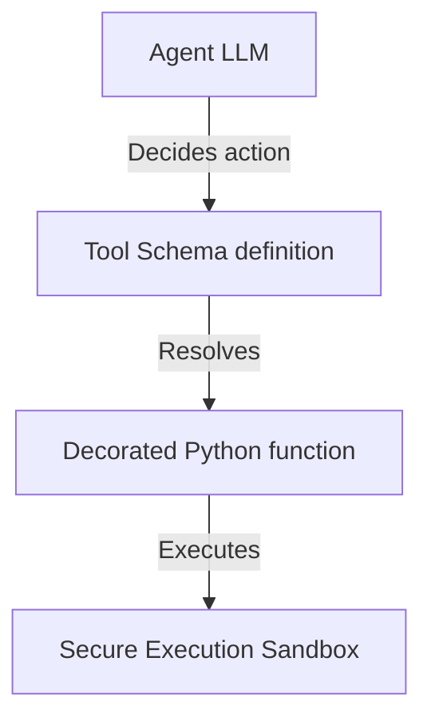

# 14_Chapter_tools

## 1. Introduction
Custom tools extend agent capabilities by allowing them to execute code and query external web services.

> **Analogy:** Think of a carpenter with a tool chest. The carpenter (the LLM) knows how to design a cabinet but has no physical hands. They select the saw (tool) from the chest (registry) and execute the cut.

---

## 2. Learning Objectives
By the end of this chapter, you will be able to:
- In this chapter, you will learn how to:
- - Define parameter schemas for custom tools using JSON.
- - Register Python functions in a central Tool Registry.
- - Coordinate tool invocation requests from the foundation model.
- - Enforce exception handling in tool executions.

---

## 3. Prerequisites
* Active installations and AWS configurations from Chapters 6 and 8.
* A basic understanding of Python function definitions and parameter type annotations.

---

## 4. Background Theory
Models can only process and generate text; they cannot access databases or run code directly. Integrating tools extends their capabilities. However, exposing APIs directly to LLMs risks SQL injection attacks. A tool gateway acts as a secure broker. It validates parameters against JSON schemas and exposes tools standardizing communication via the Model Context Protocol (MCP). Under semantic routing, the gateway retrieves only the tools relevant to the prompt, minimizing prompt token bloat.

---

## 5. Core Concepts
**📦 Technical Term: Tool Registry**

* **Simple Explanation:** A central repository class that manages tool functions and metadata schemas.
* **Why it exists:** Coordinates tool registrations and lookup operations.
* **Where is it used:** The tool registry module.

**📦 Technical Term: JSON Schema**

* **Simple Explanation:** A JSON object declaring parameter names, types, and descriptions for validation.
* **Why it exists:** Enforces parameter schemas before functions execute.
* **Where is it used:** The parameters definition dictionary.

**📦 Technical Term: @tool Decorator**

* **Simple Explanation:** A decorator helper that generates JSON schemas from Python function docstrings.
* **Why it exists:** Simplifies tool definition and registration.
* **Where is it used:** Decorating Python functions.

---

## 6. Internal Mechanics
1. The model determines it needs external data to complete a prompt.
2. It returns a tool call payload specifying the target tool name and parameters.
3. The Tool Registry intercepts the call and validates parameters against the JSON schema.
4. If validation succeeds, it executes the registered Python function.
5. The function executes in a secure sandbox, returning outputs to the model to complete the loop.

---

## 7. Architecture Overview
The following architectural details outline the components and relationship schemas active in this module:



---

## 8. Installation & Setup
Validate custom tool execution syntax using the CLI:
```bash
agentcore tools validate --file src/main.py
```

---

## 9. Configuration
Configure registered tools and execution boundaries in your configuration files:
```yaml
tools:
  - name: "lookup_warranty_status"
    entry_point: "src/tools.py"
    timeout_seconds: 10
```

---

## 10. Hands-on Examples
### Simple Example
```python
# File: src/tools_impl.py
# Folder Location: agentcore-samples/src/tools_impl.py

import json
from typing import Dict, Any

# =====================================================================
# 1. Define Tool Schema
# =====================================================================
LOOKUP_WARRANTY_SCHEMA = {
    "name": "lookup_warranty_status",
    "description": "Retrieve the warranty coverage status for a specific customer order ID.",
    "inputSchema": {
        "json": {
            "type": "object",
            "properties": {
                "order_id": {
                    "type": "string",
                    "description": "The unique 5-digit order identifier (e.g., '12345')."
                }
            },
            "required": ["order_id"]
        }
    }
}

# =====================================================================
# 2. Implement Tool Executor
# =====================================================================
class ToolRegistry:
    def __init__(self):
        self.tools = {}

    def register_tool(self, name: str, func):
        self.tools[name] = func

    def execute_tool(self, name: str, arguments: Dict[str, Any]) -> str:
        if name not in self.tools:
            return f"Error: Tool '{name}' is not registered."
            
        try:
            return self.tools[name](**arguments)
        except Exception as e:
            return f"Execution error in tool '{name}': {str(e)}"

# Define the python function
def lookup_warranty_status(order_id: str) -> str:
    db_mock = {
        "12345": "Expired (254 days ago)",
        "67890": "Active - Under coverage"
    }
    return db_mock.get(order_id, "Order ID not found.")

# Register tool
registry = ToolRegistry()
registry.register_tool("lookup_warranty_status", lookup_warranty_status)
```

### Intermediate Example
```python
# Python script to register and execute functions dynamically
class ToolRegistry:
    def __init__(self):
        self.registry = {}

    def register(self, name, func):
        self.registry[name] = func

    def execute(self, name, **kwargs):
        if name not in self.registry:
            return f"Error: Tool '{name}' not found."
        try:
            return self.registry[name](**kwargs)
        except Exception as e:
            return f"Execution failed: {str(e)}"

def add(x, y):
    return x + y

if __name__ == "__main__":
    reg = ToolRegistry()
    reg.register("math_add", add)
    print("Result:", reg.execute("math_add", x=5, y=10))
```

### Advanced Example
```python
# Complete SDK tool implementation validating arguments and capturing execution errors
from bedrock_agent_core import BedrockAgentCoreApp, tool
import logging

logging.basicConfig(level=logging.INFO)
logger = logging.getLogger("ToolIntegration")
app = BedrockAgentCoreApp()

@tool
def lookup_warranty_status(order_id: str) -> str:
    """
    Retrieve the warranty coverage status for a customer order.
    
    Args:
        order_id: The unique 5-digit order identifier.
    """
    db = {"12345": "Active", "67890": "Expired"}
    try:
        # Basic input validation
        if not order_id.isdigit() or len(order_id) != 5:
            return "Error: Order ID must be a 5-digit number."
        return f"Order {order_id} warranty status: {db.get(order_id, 'Not Found')}"
    except Exception as e:
        logger.error(f"Tool execution error: {str(e)}")
        return "Error: Failed to fetch warranty status."

if __name__ == "__main__":
    # Test tool locally
    print(lookup_warranty_status(order_id="12345"))
```

---

## 11. Code Walkthrough
Let's perform a line-by-line code walk of the core logic implementation:

```python
# File: src/tools_impl.py
# Folder Location: agentcore-samples/src/tools_impl.py

import json
from typing import Dict, Any

# =====================================================================
# 1. Define Tool Schema
# =====================================================================
LOOKUP_WARRANTY_SCHEMA = {
    "name": "lookup_warranty_status",
    "description": "Retrieve the warranty coverage status for a specific customer order ID.",
    "inputSchema": {
        "json": {
            "type": "object",
            "properties": {
                "order_id": {
                    "type": "string",
                    "description": "The unique 5-digit order identifier (e.g., '12345')."
                }
            },
            "required": ["order_id"]
        }
    }
}

# =====================================================================
# 2. Implement Tool Executor
# =====================================================================
class ToolRegistry:
    def __init__(self):
        self.tools = {}

    def register_tool(self, name: str, func):
        self.tools[name] = func

    def execute_tool(self, name: str, arguments: Dict[str, Any]) -> str:
        if name not in self.tools:
            return f"Error: Tool '{name}' is not registered."
            
        try:
            return self.tools[name](**arguments)
        except Exception as e:
            return f"Execution error in tool '{name}': {str(e)}"

# Define the python function
def lookup_warranty_status(order_id: str) -> str:
    db_mock = {
        "12345": "Expired (254 days ago)",
        "67890": "Active - Under coverage"
    }
    return db_mock.get(order_id, "Order ID not found.")

# Register tool
registry = ToolRegistry()
registry.register_tool("lookup_warranty_status", lookup_warranty_status)
```

* **`import` statements:** Load libraries and core modules required by the package.
* **Initialization:** Instantiates execution frameworks and logs operational events.
* **Handler logic:** Executes input validations and triggers core business routines.

---

## 12. Production Best Practices
* Design tool functions to handle exceptions gracefully, returning friendly errors to the model.
* Add descriptive docstrings to functions to guide the model's tool selection.
* Validate all input parameters to protect backend APIs from injection attacks.

---

## 13. Security Considerations
Execute tool functions inside secure, sandboxed environments to prevent unauthorized system access. Use IAM policies to limit tools' access to only the AWS resources they require.

---

## 14. Performance Optimization
Set short execution timeouts on tool calls to prevent runaway scripts from stalling the main agent loop.

---

## 15. Cost Optimization
Monitor token usage associated with tool definitions. Long tool descriptions increase input token usage, inflating overall execution costs.

---

## 16. Common Mistakes
* Defining ambiguous descriptions, causing the model to select the wrong tool.
* Failing to wrap tool code in try-except blocks, causing unhandled exceptions to crash the agent runtime.

---

## 17. Troubleshooting
Below is the diagnostic reference table for identifying and resolving issues:

| Symptom | Root Cause | Solution |
| :--- | :--- | :--- |
| Model fails to invoke tool | Ambiguous description or missing docstring in the tool function. | Add a detailed docstring explaining when and how to use the tool. |
| InvalidParametersException on call | Arguments returned by the model do not match the JSON schema definitions. | Verify parameter names, types, and annotations in the function signature. |

---

## 18. Interview Questions
### Q: How does the @tool decorator generate JSON schemas?
* **Answer:** The decorator uses Python reflection and inspects type annotations and docstring parameters to construct JSON schemas for model configuration.

### Q: Why is sandboxing critical for executing custom tools?
* **Answer:** Sandboxing isolates execution, preventing code errors or prompt injection attacks from compromising the host operating system.

### Q: How do you handle tool execution failures?
* **Answer:** Catch exceptions inside the tool code and return a descriptive error string. The model can use this feedback to correct parameters and retry the call.

---

## 19. Real-World Use Cases
Integrating customer database lookups securely into customer service workflows.

---

## 20. Industrial Project
This custom tool integration allows our agent to query databases and call external APIs.

---

## 21. Summary
This chapter covered defining parameter schemas, registering custom Python functions, and executing tools inside secure environments.

---

## 22. Key Takeaways
* Custom tools extend agent capabilities to interact with external systems.
* Docstrings and type annotations guide the model's tool selection.
* Enforce parameter validation and run tools in secure sandboxes.

---

## 23. Practice Exercises
* Beginner: Write a tool that generates a random number within a minimum and maximum range.
* Intermediate: Create a tool that queries system time, validating format strings.

---

## 24. Further Reading
* [JSON Schema Standard Reference](https://json-schema.org/)
* [Python Type Hints Documentation](https://docs.python.org/3/library/typing.html)
