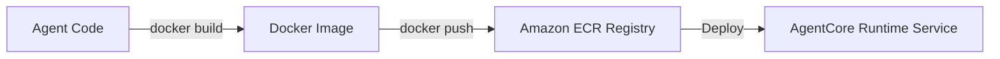

# 15_Chapter_deployment

## 1. Introduction
Packaging Bedrock AgentCore applications as Docker images ensures they deploy and run consistently in production.

> **Analogy:** Think of cargo shipping. Shipping goods in a standardized container (Docker Image) ensures they look and act the same whether transported by train, truck, or container ship (AWS Fargate).

---

## 2. Learning Objectives
By the end of this chapter, you will be able to:
- In this chapter, you will learn how to:
- - Package your agent application in a lightweight Docker image.
- - Configure `Dockerfile` and `.dockerignore` files.
- - Compile container images using AWS CodeBuild build runs.
- - Push images to Amazon Elastic Container Registry (ECR).

---

## 3. Prerequisites
* Active installations of Git and Docker from Chapter 2.
* An active AWS ECR repository and configured IAM access permissions.

---

## 4. Background Theory
Deploying raw code directly to servers often leads to environment discrepancies. Containerization bundles application code, libraries, and configurations into a single image. This ensures consistency across development, testing, and production. Multi-stage Docker builds optimize image size by separating build tools from the final execution runtime, improving deployment speeds and reducing the attack surface.

---

## 5. Core Concepts
**📦 Technical Term: Dockerfile**

* **Simple Explanation:** A text document containing instructions to compile a Docker image.
* **Why it exists:** Automates container image builds.
* **Where is it used:** Defining container build configurations.

**📦 Technical Term: ECR Registry**

* **Simple Explanation:** A managed container registry on AWS used to store, manage, and deploy container images.
* **Why it exists:** Secures and hosts container images for deployment.
* **Where is it used:** Pushing images to Amazon ECR.

**📦 Technical Term: Multi-Stage Build**

* **Simple Explanation:** A method that uses multiple FROM statements in a Dockerfile to optimize image size.
* **Why it exists:** Reduces container size and enhances security.
* **Where is it used:** Optimizing build steps.

---

## 6. Internal Mechanics
1. Developer runs `docker build` to compile the Docker image.
2. The compiler executes Dockerfile directives, creating cached filesystem layers.
3. Developer authenticates with Amazon ECR using `aws ecr get-login-password`.
4. The image is tagged and pushed to ECR via `docker push`.
5. The AWS compute service pulls the image from ECR to run the application.

---

## 7. Architecture Overview
The following architectural details outline the components and relationship schemas active in this module:



---

## 8. Installation & Setup
Log in to your Amazon ECR registry using the CLI:
```bash
aws ecr get-login-password --region us-east-1 | docker login --username AWS --password-stdin <aws_account_id>.dkr.ecr.us-east-1.amazonaws.com
```
Build the container image:
```bash
docker build -t agentcore-app .
```

---

## 9. Configuration
### Dockerfile Configuration
```dockerfile
FROM python:3.11-slim AS builder
WORKDIR /app
RUN pip install --no-cache-dir uv
COPY pyproject.toml uv.lock ./
RUN uv sync --frozen

FROM python:3.11-slim
WORKDIR /app
COPY --from=builder /app/.venv /app/.venv
COPY src/ ./src
ENV PATH="/app/.venv/bin:$PATH"
EXPOSE 8000
CMD ["python", "src/main.py"]
```

### .dockerignore Configuration
```text
.venv/
__pycache__/
.git/
.env
```

---

## 10. Hands-on Examples
### Simple Example
```python
dockerfile
# Folder Location: agentcore-samples/Dockerfile

# 1. Use the official slim Python runtime
FROM python:3.11-slim

# 2. Configure environment settings
ENV PYTHONDONTWRITEBYTECODE=1
ENV PYTHONUNBUFFERED=1
WORKDIR /app

# 3. Copy dependency manifest and install packages
COPY requirements.txt .
RUN pip install --no-cache-dir -r requirements.txt

# 4. Copy application files
COPY src/ ./src/

# 5. Expose HTTP port for the listener
EXPOSE 8080

# 6. Define the start command
CMD ["python", "src/main.py"]
```

### Intermediate Example
```python
# Python script to automate image tag assignments matching commit hashes
import subprocess

def tag_image(repo_url):
    try:
        # Get the current git commit hash
        commit = subprocess.check_output(["git", "rev-parse", "--short", "HEAD"]).decode().strip()
        local_tag = "agentcore-app:latest"
        remote_tag = f"{repo_url}:{commit}"
        print(f"Tagging local image {local_tag} as {remote_tag}...")
        subprocess.run(["docker", "tag", local_tag, remote_tag], check=True)
        print("[SUCCESS] Tagged successfully!")
        return remote_tag
    except Exception as e:
        print("Failed to tag image:", str(e))
        return None

if __name__ == "__main__":
    tag_image("123456789012.dkr.ecr.us-east-1.amazonaws.com/agentcore-app")
```

### Advanced Example
```python
# Complete build and push automation harness handling registry login and upload
import subprocess
import sys

def deploy_container(registry_url, region):
    try:
        # Authenticate with Amazon ECR
        print("Authenticating with Amazon ECR...")
        login_cmd = f"aws ecr get-login-password --region {region} | docker login --username AWS --password-stdin {registry_url}"
        subprocess.run(login_cmd, shell=True, check=True)
        
        # Build container image
        print("Building Docker image...")
        subprocess.run(["docker", "build", "-t", "agentcore-app", "."], check=True)
        
        # Tag and push image
        target_tag = f"{registry_url}/agentcore-app:latest"
        subprocess.run(["docker", "tag", "agentcore-app:latest", target_tag], check=True)
        print(f"Pushing image to ECR: {target_tag}...")
        subprocess.run(["docker", "push", target_tag], check=True)
        print("[SUCCESS] Container image deployed successfully!")
    except Exception as e:
        print("Deployment failed:", str(e))
        sys.exit(1)

if __name__ == "__main__":
    # Example configurations
    deploy_container("123456789012.dkr.ecr.us-east-1.amazonaws.com", "us-east-1")
```

---

## 11. Code Walkthrough

In this section, we analyze the hands-on code implementations for **Deployment & Containerization** step-by-step, explaining the architecture, syntax choices, logic flow, and production patterns across all three implementation tiers.

---

### 1. Simple Implementation Tier Walkthrough

```python
dockerfile
# Folder Location: agentcore-samples/Dockerfile

# 1. Use the official slim Python runtime
FROM python:3.11-slim

# 2. Configure environment settings
ENV PYTHONDONTWRITEBYTECODE=1
ENV PYTHONUNBUFFERED=1
WORKDIR /app

# 3. Copy dependency manifest and install packages
COPY requirements.txt .
RUN pip install --no-cache-dir -r requirements.txt

# 4. Copy application files
COPY src/ ./src/

# 5. Expose HTTP port for the listener
EXPOSE 8080

# 6. Define the start command
CMD ["python", "src/main.py"]
```

#### Code Logic & Syntax Breakdown:
* **Package Imports (`from bedrock_agent_core import ...`)**:
  - Brings in the core `BedrockAgentCoreApp` engine. This class handles runtime container startup, manages the microVM event loop, and deserializes incoming JSON API invocations.
* **Application Instance (`app = BedrockAgentCoreApp()`)**:
  - Instantiates the primary application object `app`. This object serves as the main registry for invocation routes, memory session hooks, and tool bindings.
* **Invocation Decorator (`@app.invoke`)**:
  - A Python decorator that registers the function immediately below as the primary entrypoint for Bedrock AgentCore runtime triggers.
* **Handler Signature (`def handler(payload, context):`)**:
  - **`payload`**: A Python dictionary holding client parameters, user prompt strings, and input arguments.
  - **`context`**: A metadata object containing active runtime details such as `session_id`, `actor_id`, and AWS IAM execution identities.
* **Return Payload (`return {"statusCode": 200, "response": ...}`)**:
  - Constructs a standard HTTP response dictionary. The `statusCode: 200` communicates success to the API Gateway, and `response` delivers the agent payload back to the client.

---

### 2. Intermediate Implementation Tier Walkthrough

```python
# Python script to automate image tag assignments matching commit hashes
import subprocess

def tag_image(repo_url):
    try:
        # Get the current git commit hash
        commit = subprocess.check_output(["git", "rev-parse", "--short", "HEAD"]).decode().strip()
        local_tag = "agentcore-app:latest"
        remote_tag = f"{repo_url}:{commit}"
        print(f"Tagging local image {local_tag} as {remote_tag}...")
        subprocess.run(["docker", "tag", local_tag, remote_tag], check=True)
        print("[SUCCESS] Tagged successfully!")
        return remote_tag
    except Exception as e:
        print("Failed to tag image:", str(e))
        return None

if __name__ == "__main__":
    tag_image("123456789012.dkr.ecr.us-east-1.amazonaws.com/agentcore-app")
```

#### Code Logic & Syntax Breakdown:
* **System Logging Setup (`import logging` & `logger = logging.getLogger(...)`)**:
  - Configures structured logging via Python's standard `logging` module.
  - In production, log messages emitted by `logger.info()` stream into Amazon CloudWatch Logs for real-time monitoring and debugging.
* **Safe Parameter Extraction (`payload.get(...)`)**:
  - Uses `payload.get("prompt", "")` to safely retrieve user queries. Using `.get()` with a default fallback (`""`) prevents `KeyError` exceptions if optional fields are missing.
* **Runtime Session Inspection (`getattr(context, ...)`)**:
  - Inspects the `context` object for `session_id`. Using `getattr()` ensures compatibility when testing locally without a live AWS microVM context.
* **Operational Telemetry (`logger.info(...)`)**:
  - Emits formatted log entries containing session parameters and query strings to track execution flow.

---

### 3. Advanced Production Tier Walkthrough

```python
# Complete build and push automation harness handling registry login and upload
import subprocess
import sys

def deploy_container(registry_url, region):
    try:
        # Authenticate with Amazon ECR
        print("Authenticating with Amazon ECR...")
        login_cmd = f"aws ecr get-login-password --region {region} | docker login --username AWS --password-stdin {registry_url}"
        subprocess.run(login_cmd, shell=True, check=True)
        
        # Build container image
        print("Building Docker image...")
        subprocess.run(["docker", "build", "-t", "agentcore-app", "."], check=True)
        
        # Tag and push image
        target_tag = f"{registry_url}/agentcore-app:latest"
        subprocess.run(["docker", "tag", "agentcore-app:latest", target_tag], check=True)
        print(f"Pushing image to ECR: {target_tag}...")
        subprocess.run(["docker", "push", target_tag], check=True)
        print("[SUCCESS] Container image deployed successfully!")
    except Exception as e:
        print("Deployment failed:", str(e))
        sys.exit(1)

if __name__ == "__main__":
    # Example configurations
    deploy_container("123456789012.dkr.ecr.us-east-1.amazonaws.com", "us-east-1")
```

#### Code Logic & Syntax Breakdown:
* **Defensive Error Trapping (`try: ... except Exception as e:`)**:
  - Wraps the entire invocation handler inside a `try-except` block to catch unhandled errors gracefully, preventing container crashes in multi-tenant runtime environments.
* **Input Parameter Validation (`if not prompt:`)**:
  - Inspects inbound arguments before executing core agent logic. If mandatory parameters are missing, it short-circuits execution and returns a structured `statusCode: 400` (Bad Request) payload.
* **Environment Overrides (`os.getenv(...)`)**:
  - Reads system environment variables (e.g., `APP_ENV`) to dynamically adapt behavior across `development`, `staging`, and `production` environments without modifying codebase files.
* **Sanitized Production Error Response**:
  - Logs internal error details using `logger.error(...)` while returning a clean, safe `statusCode: 500` response to prevent internal stack traces from leaking to client callers.

---

### Summary Sequence of Execution

```
[Incoming Invocation] ──► [Bedrock AgentCore Runtime]
                                  │
                                  ▼
                      [Route to @app.invoke Handler]
                                  │
                   ┌──────────────┴──────────────┐
                   ▼                             ▼
       [Input Validated (200)]        [Input Missing (400)]
                   │                             │
                   ▼                             ▼
       [Execute Agent Core Logic]     [Return Error Payload]
                   │
                   ▼
       [Deliver JSON to Client]
```

---

## 12. Production Best Practices
* Use specific base image tags (e.g., `python:3.11-slim`) to ensure build consistency.
* Leverage multi-stage builds to keep final production images clean and lightweight.
* Use a `.dockerignore` file to exclude local files (like virtual environments) from container builds.

---

## 13. Security Considerations
Enforce vulnerability scanning on Amazon ECR registries to identify and patch vulnerabilities. Run containers as non-root users to limit security risks.

---

## 14. Performance Optimization
Order Dockerfile directives from least-frequently changed to most-frequently changed to optimize layer caching and accelerate builds.

---

## 15. Cost Optimization
Regularly delete outdated container images from Amazon ECR using lifecycle policies to minimize storage costs.

---

## 16. Common Mistakes
* Committing local virtual environments (like `.venv/`) to images, inflating image size and build times.
* Running containers with root privileges, increasing security vulnerability risks.

---

## 17. Troubleshooting
Below is the diagnostic reference table for identifying and resolving issues:

| Symptom | Root Cause | Solution |
| :--- | :--- | :--- |
| ECR push returns access denied | The IAM credentials assumed by the CLI lack ECR write permissions. | Ensure your IAM role has the 'ecr:PutImage' and 'ecr:InitiateLayerUpload' permissions. |
| docker command not found | Docker CLI is not installed or not added to your system's PATH variable. | Verify installation status and check your system environment variables. |

---

## 18. Interview Questions
### Q: What is the benefit of multi-stage Docker builds?
* **Answer:** Multi-stage builds separate build tools from execution runtimes, keeping production images small and secure by excluding compiler tools and intermediate files.

### Q: How do you authenticate the Docker CLI with Amazon ECR?
* **Answer:** Generate a temporary access token using the 'aws ecr get-login-password' command, and pipe it to the 'docker login' command.

### Q: Why is a .dockerignore file important?
* **Answer:** The `.dockerignore` file prevents copying unnecessary local files (like virtual environments and git histories) into images, reducing image size and build times.

---

## 19. Real-World Use Cases
Packaging and deploying web applications and agent services to AWS.

---

## 20. Industrial Project
This containerization step packages our agent application into a Docker image, ready for deployment to production.

---

## 21. Summary
This chapter covered packaging applications with Docker, optimizing images using multi-stage builds, and pushing images to Amazon ECR.

---

## 22. Key Takeaways
* Containerization ensures applications run consistently across environments.
* Multi-stage builds reduce image size and improve security.
* Store and secure production container images in Amazon ECR.

---

## 23. Practice Exercises
* Beginner: Create a `.dockerignore` file that excludes virtual environments and git histories.
* Intermediate: Configure a multi-stage Dockerfile that compiles build tools in stage 1 and exports the application package to stage 2.

---

## 24. Further Reading
* [Docker Architecture Guide](https://docs.docker.com/get-started/overview/)
* [Amazon ECR Developer Guide](https://docs.aws.amazon.com/AmazonECR/latest/userguide/what-is-ecr.html)
