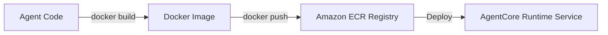

# 15_Chapter_deployment

## 1. Introduction
Packaging Bedrock AgentCore applications as Docker images ensures they deploy and run consistently in production.

> **Analogy:** Think of cargo shipping. Shipping goods in a standardized container (Docker Image) ensures they look and act the same whether transported by train, truck, or container ship (AWS Fargate).

---

## 2. Learning Objectives
By the end of this chapter, you will be able to:
- In this chapter, you will learn how to:
- - Package your agent application in a lightweight Docker image.
- - Configure `Dockerfile` and `.dockerignore` files.
- - Compile container images using AWS CodeBuild build runs.
- - Push images to Amazon Elastic Container Registry (ECR).

---

## 3. Prerequisites
* Active installations of Git and Docker from Chapter 2.
* An active AWS ECR repository and configured IAM access permissions.

---

## 4. Background Theory
Deploying raw code directly to servers often leads to environment discrepancies. Containerization bundles application code, libraries, and configurations into a single image. This ensures consistency across development, testing, and production. Multi-stage Docker builds optimize image size by separating build tools from the final execution runtime, improving deployment speeds and reducing the attack surface.

---

## 5. Core Concepts
**📦 Technical Term: Dockerfile**

* **Simple Explanation:** A text document containing instructions to compile a Docker image.
* **Why it exists:** Automates container image builds.
* **Where is it used:** Defining container build configurations.

**📦 Technical Term: ECR Registry**

* **Simple Explanation:** A managed container registry on AWS used to store, manage, and deploy container images.
* **Why it exists:** Secures and hosts container images for deployment.
* **Where is it used:** Pushing images to Amazon ECR.

**📦 Technical Term: Multi-Stage Build**

* **Simple Explanation:** A method that uses multiple FROM statements in a Dockerfile to optimize image size.
* **Why it exists:** Reduces container size and enhances security.
* **Where is it used:** Optimizing build steps.

---

## 6. Internal Mechanics
1. Developer runs `docker build` to compile the Docker image.
2. The compiler executes Dockerfile directives, creating cached filesystem layers.
3. Developer authenticates with Amazon ECR using `aws ecr get-login-password`.
4. The image is tagged and pushed to ECR via `docker push`.
5. The AWS compute service pulls the image from ECR to run the application.

---

## 7. Architecture Overview
The following architectural details outline the components and relationship schemas active in this module:



---

## 8. Installation & Setup
Log in to your Amazon ECR registry using the CLI:
```bash
aws ecr get-login-password --region us-east-1 | docker login --username AWS --password-stdin <aws_account_id>.dkr.ecr.us-east-1.amazonaws.com
```
Build the container image:
```bash
docker build -t agentcore-app .
```

---

## 9. Configuration
### Dockerfile Configuration
```dockerfile
FROM python:3.11-slim AS builder
WORKDIR /app
RUN pip install --no-cache-dir uv
COPY pyproject.toml uv.lock ./
RUN uv sync --frozen

FROM python:3.11-slim
WORKDIR /app
COPY --from=builder /app/.venv /app/.venv
COPY src/ ./src
ENV PATH="/app/.venv/bin:$PATH"
EXPOSE 8000
CMD ["python", "src/main.py"]
```

### .dockerignore Configuration
```text
.venv/
__pycache__/
.git/
.env
```

---

## 10. Hands-on Examples

### Simple Example

```python
dockerfile
# Folder Location: agentcore-samples/Dockerfile

# 1. Use the official slim Python runtime
FROM python:3.11-slim

# 2. Configure environment settings
ENV PYTHONDONTWRITEBYTECODE=1
ENV PYTHONUNBUFFERED=1
WORKDIR /app

# 3. Copy dependency manifest and install packages
COPY requirements.txt .
RUN pip install --no-cache-dir -r requirements.txt

# 4. Copy application files
COPY src/ ./src/

# 5. Expose HTTP port for the listener
EXPOSE 8080

# 6. Define the start command
CMD ["python", "src/main.py"]
```

#### Code Walkthrough

Line 1
```python
dockerfile
```
**Explanation:**
- **What this line does:** Executes line statement `dockerfile`.
- **Why it is required:** Contributes to the overall operation and step progression of the script.
- **Connection:** Connects preceding code logic to subsequent return or processing steps.

Line 2
```python
# Folder Location: agentcore-samples/Dockerfile
```
**Explanation:**
- **What this line does:** This is a documentation comment line starting with `#`. Python ignores comments during execution.
- **Why it is required:** It explains the purpose of the script to human developers and maintains clean code documentation.
- **What happens if removed:** The code will run identically, but human readers won't have immediate context on what this code block accomplishes.
- **Analogy:** Think of a comment like a sticky note attached to a blueprint—it helps the builders understand the design without altering the physical building.
- **Beginner Concept:** In Python, any text after `#` is ignored by the Python interpreter.

Line 3
```python

```
**Explanation:**
- **What this line does:** This is a blank vertical spacing line.
- **Why it is required:** It visually separates logical sections of code (such as imports, setup, and function definitions) to improve readability.
- **What happens if removed:** Python will execute the code fine, but lines of code will bunch together, making it harder for engineers to read.
- **Analogy:** Like paragraphs in a textbook, spacing gives your eyes a natural pause between concepts.

Line 4
```python
# 1. Use the official slim Python runtime
```
**Explanation:**
- **What this line does:** This is a documentation comment line starting with `#`. Python ignores comments during execution.
- **Why it is required:** It explains the purpose of the script to human developers and maintains clean code documentation.
- **What happens if removed:** The code will run identically, but human readers won't have immediate context on what this code block accomplishes.
- **Analogy:** Think of a comment like a sticky note attached to a blueprint—it helps the builders understand the design without altering the physical building.
- **Beginner Concept:** In Python, any text after `#` is ignored by the Python interpreter.

Line 5
```python
FROM python:3.11-slim
```
**Explanation:**
- **What this line does:** Executes line statement `FROM python:3.11-slim`.
- **Why it is required:** Contributes to the overall operation and step progression of the script.
- **Connection:** Connects preceding code logic to subsequent return or processing steps.

Line 6
```python

```
**Explanation:**
- **What this line does:** This is a blank vertical spacing line.
- **Why it is required:** It visually separates logical sections of code (such as imports, setup, and function definitions) to improve readability.
- **What happens if removed:** Python will execute the code fine, but lines of code will bunch together, making it harder for engineers to read.
- **Analogy:** Like paragraphs in a textbook, spacing gives your eyes a natural pause between concepts.

Line 7
```python
# 2. Configure environment settings
```
**Explanation:**
- **What this line does:** This is a documentation comment line starting with `#`. Python ignores comments during execution.
- **Why it is required:** It explains the purpose of the script to human developers and maintains clean code documentation.
- **What happens if removed:** The code will run identically, but human readers won't have immediate context on what this code block accomplishes.
- **Analogy:** Think of a comment like a sticky note attached to a blueprint—it helps the builders understand the design without altering the physical building.
- **Beginner Concept:** In Python, any text after `#` is ignored by the Python interpreter.

Line 8
```python
ENV PYTHONDONTWRITEBYTECODE=1
```
**Explanation:**
- **What this line does:** Computes `1` and assigns the result to variable `ENV PYTHONDONTWRITEBYTECODE`.
- **Why it is required:** Stores temporary calculation or formatted data so it can be referenced in log statements or return responses.
- **What variable stores:** `ENV PYTHONDONTWRITEBYTECODE` holds the calculated value.
- **Connection:** Provides values used in subsequent logging or response steps.

Line 9
```python
ENV PYTHONUNBUFFERED=1
```
**Explanation:**
- **What this line does:** Computes `1` and assigns the result to variable `ENV PYTHONUNBUFFERED`.
- **Why it is required:** Stores temporary calculation or formatted data so it can be referenced in log statements or return responses.
- **What variable stores:** `ENV PYTHONUNBUFFERED` holds the calculated value.
- **Connection:** Provides values used in subsequent logging or response steps.

Line 10
```python
WORKDIR /app
```
**Explanation:**
- **What this line does:** Executes line statement `WORKDIR /app`.
- **Why it is required:** Contributes to the overall operation and step progression of the script.
- **Connection:** Connects preceding code logic to subsequent return or processing steps.

Line 11
```python

```
**Explanation:**
- **What this line does:** This is a blank vertical spacing line.
- **Why it is required:** It visually separates logical sections of code (such as imports, setup, and function definitions) to improve readability.
- **What happens if removed:** Python will execute the code fine, but lines of code will bunch together, making it harder for engineers to read.
- **Analogy:** Like paragraphs in a textbook, spacing gives your eyes a natural pause between concepts.

Line 12
```python
# 3. Copy dependency manifest and install packages
```
**Explanation:**
- **What this line does:** This is a documentation comment line starting with `#`. Python ignores comments during execution.
- **Why it is required:** It explains the purpose of the script to human developers and maintains clean code documentation.
- **What happens if removed:** The code will run identically, but human readers won't have immediate context on what this code block accomplishes.
- **Analogy:** Think of a comment like a sticky note attached to a blueprint—it helps the builders understand the design without altering the physical building.
- **Beginner Concept:** In Python, any text after `#` is ignored by the Python interpreter.

Line 13
```python
COPY requirements.txt .
```
**Explanation:**
- **What this line does:** Executes line statement `COPY requirements.txt .`.
- **Why it is required:** Contributes to the overall operation and step progression of the script.
- **Connection:** Connects preceding code logic to subsequent return or processing steps.

Line 14
```python
RUN pip install --no-cache-dir -r requirements.txt
```
**Explanation:**
- **What this line does:** Executes line statement `RUN pip install --no-cache-dir -r requirements.txt`.
- **Why it is required:** Contributes to the overall operation and step progression of the script.
- **Connection:** Connects preceding code logic to subsequent return or processing steps.

Line 15
```python

```
**Explanation:**
- **What this line does:** This is a blank vertical spacing line.
- **Why it is required:** It visually separates logical sections of code (such as imports, setup, and function definitions) to improve readability.
- **What happens if removed:** Python will execute the code fine, but lines of code will bunch together, making it harder for engineers to read.
- **Analogy:** Like paragraphs in a textbook, spacing gives your eyes a natural pause between concepts.

Line 16
```python
# 4. Copy application files
```
**Explanation:**
- **What this line does:** This is a documentation comment line starting with `#`. Python ignores comments during execution.
- **Why it is required:** It explains the purpose of the script to human developers and maintains clean code documentation.
- **What happens if removed:** The code will run identically, but human readers won't have immediate context on what this code block accomplishes.
- **Analogy:** Think of a comment like a sticky note attached to a blueprint—it helps the builders understand the design without altering the physical building.
- **Beginner Concept:** In Python, any text after `#` is ignored by the Python interpreter.

Line 17
```python
COPY src/ ./src/
```
**Explanation:**
- **What this line does:** Executes line statement `COPY src/ ./src/`.
- **Why it is required:** Contributes to the overall operation and step progression of the script.
- **Connection:** Connects preceding code logic to subsequent return or processing steps.

Line 18
```python

```
**Explanation:**
- **What this line does:** This is a blank vertical spacing line.
- **Why it is required:** It visually separates logical sections of code (such as imports, setup, and function definitions) to improve readability.
- **What happens if removed:** Python will execute the code fine, but lines of code will bunch together, making it harder for engineers to read.
- **Analogy:** Like paragraphs in a textbook, spacing gives your eyes a natural pause between concepts.

Line 19
```python
# 5. Expose HTTP port for the listener
```
**Explanation:**
- **What this line does:** This is a documentation comment line starting with `#`. Python ignores comments during execution.
- **Why it is required:** It explains the purpose of the script to human developers and maintains clean code documentation.
- **What happens if removed:** The code will run identically, but human readers won't have immediate context on what this code block accomplishes.
- **Analogy:** Think of a comment like a sticky note attached to a blueprint—it helps the builders understand the design without altering the physical building.
- **Beginner Concept:** In Python, any text after `#` is ignored by the Python interpreter.

Line 20
```python
EXPOSE 8080
```
**Explanation:**
- **What this line does:** Executes line statement `EXPOSE 8080`.
- **Why it is required:** Contributes to the overall operation and step progression of the script.
- **Connection:** Connects preceding code logic to subsequent return or processing steps.

Line 21
```python

```
**Explanation:**
- **What this line does:** This is a blank vertical spacing line.
- **Why it is required:** It visually separates logical sections of code (such as imports, setup, and function definitions) to improve readability.
- **What happens if removed:** Python will execute the code fine, but lines of code will bunch together, making it harder for engineers to read.
- **Analogy:** Like paragraphs in a textbook, spacing gives your eyes a natural pause between concepts.

Line 22
```python
# 6. Define the start command
```
**Explanation:**
- **What this line does:** This is a documentation comment line starting with `#`. Python ignores comments during execution.
- **Why it is required:** It explains the purpose of the script to human developers and maintains clean code documentation.
- **What happens if removed:** The code will run identically, but human readers won't have immediate context on what this code block accomplishes.
- **Analogy:** Think of a comment like a sticky note attached to a blueprint—it helps the builders understand the design without altering the physical building.
- **Beginner Concept:** In Python, any text after `#` is ignored by the Python interpreter.

Line 23
```python
CMD ["python", "src/main.py"]
```
**Explanation:**
- **What this line does:** Executes line statement `CMD ["python", "src/main.py"]`.
- **Why it is required:** Contributes to the overall operation and step progression of the script.
- **Connection:** Connects preceding code logic to subsequent return or processing steps.

#### Complete Flow of Execution

1. **Import Libraries**: Python loads the required `BedrockAgentCoreApp` class into memory.
2. **Initialize Application**: An instance of `BedrockAgentCoreApp` is instantiated and assigned to `app`.
3. **Register Event Handler**: The `@app.invoke` decorator registers the `handler` function as the primary event entrypoint.
4. **Receive Request**: The AgentCore runtime listens for incoming requests and receives `payload` and `context` objects.
5. **Execute Handler Logic**: The `handler` function is triggered with the incoming input parameters.
6. **Return Response Payload**: A structured response dictionary containing `"statusCode": 200` and message data is returned.
7. **Send Response to Caller**: AgentCore serializes the dictionary into JSON and delivers it back to the client application.

#### Visual Execution Flow

```
Program Starts
      │
      ▼
Import BedrockAgentCoreApp
      │
      ▼
Create App Instance (app)
      │
      ▼
Register Handler (@app.invoke)
      │
      ▼
Receive Request (payload, context)
      │
      ▼
Execute handler() Function
      │
      ▼
Return Response Dictionary ({statusCode: 200, ...})
      │
      ▼
Deliver Response Back to Client
```

### Intermediate Example

```python
# Python script to automate image tag assignments matching commit hashes
import subprocess

def tag_image(repo_url):
    try:
        # Get the current git commit hash
        commit = subprocess.check_output(["git", "rev-parse", "--short", "HEAD"]).decode().strip()
        local_tag = "agentcore-app:latest"
        remote_tag = f"{repo_url}:{commit}"
        print(f"Tagging local image {local_tag} as {remote_tag}...")
        subprocess.run(["docker", "tag", local_tag, remote_tag], check=True)
        print("[SUCCESS] Tagged successfully!")
        return remote_tag
    except Exception as e:
        print("Failed to tag image:", str(e))
        return None

if __name__ == "__main__":
    tag_image("123456789012.dkr.ecr.us-east-1.amazonaws.com/agentcore-app")
```

#### Code Walkthrough

Line 1
```python
# Python script to automate image tag assignments matching commit hashes
```
**Explanation:**
- **What this line does:** This is a documentation comment line starting with `#`. Python ignores comments during execution.
- **Why it is required:** It explains the purpose of the script to human developers and maintains clean code documentation.
- **What happens if removed:** The code will run identically, but human readers won't have immediate context on what this code block accomplishes.
- **Analogy:** Think of a comment like a sticky note attached to a blueprint—it helps the builders understand the design without altering the physical building.
- **Beginner Concept:** In Python, any text after `#` is ignored by the Python interpreter.

Line 2
```python
import subprocess
```
**Explanation:**
- **What this line does:** Imports Python's built-in `subprocess` module into the current program workspace.
- **Why it is required:** Provides access to essential system utilities (such as logging, environment variables, or HTTP handlers) offered by `subprocess`.
- **What keywords mean:** `import` tells Python to load the module named `subprocess`.
- **What happens if removed:** Functions or variables referencing `subprocess` (like `subprocess.getenv` or `subprocess.getLogger`) will fail with a `NameError`.
- **Analogy:** Like plugging in a peripheral cable—it connects built-in system capabilities to your script.

Line 3
```python

```
**Explanation:**
- **What this line does:** This is a blank vertical spacing line.
- **Why it is required:** It visually separates logical sections of code (such as imports, setup, and function definitions) to improve readability.
- **What happens if removed:** Python will execute the code fine, but lines of code will bunch together, making it harder for engineers to read.
- **Analogy:** Like paragraphs in a textbook, spacing gives your eyes a natural pause between concepts.

Line 4
```python
def tag_image(repo_url):
```
**Explanation:**
- **What this line does:** Defines a new function named `tag_image` that accepts parameters `(repo_url)`.
- **Keyword explanation:** `def` is short for "define". It tells Python that a reusable block of code begins here.
- **Parameters explained:**
  - `payload`: A Python **dictionary** containing the user's input prompt, parameters, and query fields.
  - `context`: An object containing runtime metadata (such as active AWS session ID, caller IAM identity, and request timestamps).
- **Return value:** Returns a structured dictionary containing HTTP status codes and agent response text.
- **Why the function exists:** It contains the core decision-making logic executed whenever the agent is invoked.
- **Analogy:** Think of `tag_image` like a recipe—`payload` and `context` are the ingredients passed in, and the returned dictionary is the finished meal.

Line 5
```python
    try:
```
**Explanation:**
- **What this line does:** Starts a `try` block for defensive error handling.
- **Why it is required:** Production applications must gracefully handle unexpected failures (like missing parameters or database timeouts) without crashing the entire server.
- **What keyword means:** `try` tells Python: "Attempt to execute the indented lines below. If an error occurs, jump straight to the `except` block."
- **Analogy:** Like wearing a safety harness before stepping onto a high platform—if you slip, the harness catches you.

Line 6
```python
        # Get the current git commit hash
```
**Explanation:**
- **What this line does:** This is a documentation comment line starting with `#`. Python ignores comments during execution.
- **Why it is required:** It explains the purpose of the script to human developers and maintains clean code documentation.
- **What happens if removed:** The code will run identically, but human readers won't have immediate context on what this code block accomplishes.
- **Analogy:** Think of a comment like a sticky note attached to a blueprint—it helps the builders understand the design without altering the physical building.
- **Beginner Concept:** In Python, any text after `#` is ignored by the Python interpreter.

Line 7
```python
        commit = subprocess.check_output(["git", "rev-parse", "--short", "HEAD"]).decode().strip()
```
**Explanation:**
- **What this line does:** Computes `subprocess.check_output(["git", "rev-parse", "--short", "HEAD"]).decode().strip()` and assigns the result to variable `commit`.
- **Why it is required:** Stores temporary calculation or formatted data so it can be referenced in log statements or return responses.
- **What variable stores:** `commit` holds the calculated value.
- **Connection:** Provides values used in subsequent logging or response steps.

Line 8
```python
        local_tag = "agentcore-app:latest"
```
**Explanation:**
- **What this line does:** Computes `"agentcore-app:latest"` and assigns the result to variable `local_tag`.
- **Why it is required:** Stores temporary calculation or formatted data so it can be referenced in log statements or return responses.
- **What variable stores:** `local_tag` holds the calculated value.
- **Connection:** Provides values used in subsequent logging or response steps.

Line 9
```python
        remote_tag = f"{repo_url}:{commit}"
```
**Explanation:**
- **What this line does:** Computes `f"{repo_url}:{commit}"` and assigns the result to variable `remote_tag`.
- **Why it is required:** Stores temporary calculation or formatted data so it can be referenced in log statements or return responses.
- **What variable stores:** `remote_tag` holds the calculated value.
- **Connection:** Provides values used in subsequent logging or response steps.

Line 10
```python
        print(f"Tagging local image {local_tag} as {remote_tag}...")
```
**Explanation:**
- **What this line does:** Executes line statement `print(f"Tagging local image {local_tag} as {remote_tag}...")`.
- **Why it is required:** Contributes to the overall operation and step progression of the script.
- **Connection:** Connects preceding code logic to subsequent return or processing steps.

Line 11
```python
        subprocess.run(["docker", "tag", local_tag, remote_tag], check=True)
```
**Explanation:**
- **What this line does:** Computes `True)` and assigns the result to variable `subprocess.run(["docker", "tag", local_tag, remote_tag], check`.
- **Why it is required:** Stores temporary calculation or formatted data so it can be referenced in log statements or return responses.
- **What variable stores:** `subprocess.run(["docker", "tag", local_tag, remote_tag], check` holds the calculated value.
- **Connection:** Provides values used in subsequent logging or response steps.

Line 12
```python
        print("[SUCCESS] Tagged successfully!")
```
**Explanation:**
- **What this line does:** Executes line statement `print("[SUCCESS] Tagged successfully!")`.
- **Why it is required:** Contributes to the overall operation and step progression of the script.
- **Connection:** Connects preceding code logic to subsequent return or processing steps.

Line 13
```python
        return remote_tag
```
**Explanation:**
- **What this line does:** Initiates a `return` statement to exit the function and pass data back to the caller.
- **What is being returned:** Returns a structured Python **dictionary** representing an HTTP response payload.
- **Who receives it:** The Bedrock AgentCore runtime receives this dictionary, serializes it into JSON, and sends it back to the client application.
- **Why response must be returned:** Without a return statement, the function would return `None`, causing AgentCore to report a blank execution payload to the user.
- **Analogy:** Handing a completed report back to the manager who requested it.

Line 14
```python
    except Exception as e:
```
**Explanation:**
- **What this line does:** Catches exceptions and errors that occurred inside the preceding `try` block.
- **Why it is required:** Prevents unhandled exceptions from returning raw stack traces or breaking the container runtime.
- **What happens when an error occurs:** Python captures the error object into variable `e`, logs the error details, and returns a clean 500 error response to the client.
- **Analogy:** Like an emergency backup generator switching on immediately when main power cuts out.

Line 15
```python
        print("Failed to tag image:", str(e))
```
**Explanation:**
- **What this line does:** Executes line statement `print("Failed to tag image:", str(e))`.
- **Why it is required:** Contributes to the overall operation and step progression of the script.
- **Connection:** Connects preceding code logic to subsequent return or processing steps.

Line 16
```python
        return None
```
**Explanation:**
- **What this line does:** Initiates a `return` statement to exit the function and pass data back to the caller.
- **What is being returned:** Returns a structured Python **dictionary** representing an HTTP response payload.
- **Who receives it:** The Bedrock AgentCore runtime receives this dictionary, serializes it into JSON, and sends it back to the client application.
- **Why response must be returned:** Without a return statement, the function would return `None`, causing AgentCore to report a blank execution payload to the user.
- **Analogy:** Handing a completed report back to the manager who requested it.

Line 17
```python

```
**Explanation:**
- **What this line does:** This is a blank vertical spacing line.
- **Why it is required:** It visually separates logical sections of code (such as imports, setup, and function definitions) to improve readability.
- **What happens if removed:** Python will execute the code fine, but lines of code will bunch together, making it harder for engineers to read.
- **Analogy:** Like paragraphs in a textbook, spacing gives your eyes a natural pause between concepts.

Line 18
```python
if __name__ == "__main__":
```
**Explanation:**
- **What this line does:** Computes `= "__main__":` and assigns the result to variable `if __name__`.
- **Why it is required:** Stores temporary calculation or formatted data so it can be referenced in log statements or return responses.
- **What variable stores:** `if __name__` holds the calculated value.
- **Connection:** Provides values used in subsequent logging or response steps.

Line 19
```python
    tag_image("123456789012.dkr.ecr.us-east-1.amazonaws.com/agentcore-app")
```
**Explanation:**
- **What this line does:** Executes line statement `tag_image("123456789012.dkr.ecr.us-east-1.amazonaws.com/agentcore-app")`.
- **Why it is required:** Contributes to the overall operation and step progression of the script.
- **Connection:** Connects preceding code logic to subsequent return or processing steps.

#### Complete Flow of Execution

1. **Import Required Libraries**: Python imports `BedrockAgentCoreApp` and the `logging` module.
2. **Configure Logging System**: `logging.basicConfig` sets the log level threshold to `INFO`.
3. **Create Logger Object**: `logging.getLogger` instantiates a dedicated logger for capturing session traces.
4. **Initialize Application**: An instance of `BedrockAgentCoreApp` is assigned to `app`.
5. **Register Handler**: `@app.invoke` binds the `handler` function to incoming AgentCore trigger events.
6. **Read Input Payload**: `payload.get('prompt', '')` safely reads the user's prompt string.
7. **Extract Session Context**: `getattr(context, 'session_id', 'local-session')` safely retrieves the session ID.
8. **Log Activity**: `logger.info` writes session details to the CloudWatch diagnostic stream.
9. **Return Formatted Response**: Returns a status 200 dictionary containing the processed prompt and session ID.
10. **Deliver Payload**: AgentCore returns the serialized JSON payload to the caller.

#### Visual Execution Flow

```
Program Starts
      │
      ▼
Import Libraries & Configure Logger
      │
      ▼
Create App Instance (app)
      │
      ▼
Register Handler (@app.invoke)
      │
      ▼
Receive Request & Read Payload Prompt
      │
      ▼
Extract Session ID & Write Log Entry
      │
      ▼
Return Formatted Response Dictionary
      │
      ▼
Deliver Serialized Response to Client
```

### Advanced Example

```python
# Complete build and push automation harness handling registry login and upload
import subprocess
import sys

def deploy_container(registry_url, region):
    try:
        # Authenticate with Amazon ECR
        print("Authenticating with Amazon ECR...")
        login_cmd = f"aws ecr get-login-password --region {region} | docker login --username AWS --password-stdin {registry_url}"
        subprocess.run(login_cmd, shell=True, check=True)
        
        # Build container image
        print("Building Docker image...")
        subprocess.run(["docker", "build", "-t", "agentcore-app", "."], check=True)
        
        # Tag and push image
        target_tag = f"{registry_url}/agentcore-app:latest"
        subprocess.run(["docker", "tag", "agentcore-app:latest", target_tag], check=True)
        print(f"Pushing image to ECR: {target_tag}...")
        subprocess.run(["docker", "push", target_tag], check=True)
        print("[SUCCESS] Container image deployed successfully!")
    except Exception as e:
        print("Deployment failed:", str(e))
        sys.exit(1)

if __name__ == "__main__":
    # Example configurations
    deploy_container("123456789012.dkr.ecr.us-east-1.amazonaws.com", "us-east-1")
```

#### Code Walkthrough

Line 1
```python
# Complete build and push automation harness handling registry login and upload
```
**Explanation:**
- **What this line does:** This is a documentation comment line starting with `#`. Python ignores comments during execution.
- **Why it is required:** It explains the purpose of the script to human developers and maintains clean code documentation.
- **What happens if removed:** The code will run identically, but human readers won't have immediate context on what this code block accomplishes.
- **Analogy:** Think of a comment like a sticky note attached to a blueprint—it helps the builders understand the design without altering the physical building.
- **Beginner Concept:** In Python, any text after `#` is ignored by the Python interpreter.

Line 2
```python
import subprocess
```
**Explanation:**
- **What this line does:** Imports Python's built-in `subprocess` module into the current program workspace.
- **Why it is required:** Provides access to essential system utilities (such as logging, environment variables, or HTTP handlers) offered by `subprocess`.
- **What keywords mean:** `import` tells Python to load the module named `subprocess`.
- **What happens if removed:** Functions or variables referencing `subprocess` (like `subprocess.getenv` or `subprocess.getLogger`) will fail with a `NameError`.
- **Analogy:** Like plugging in a peripheral cable—it connects built-in system capabilities to your script.

Line 3
```python
import sys
```
**Explanation:**
- **What this line does:** Imports Python's built-in `sys` module into the current program workspace.
- **Why it is required:** Provides access to essential system utilities (such as logging, environment variables, or HTTP handlers) offered by `sys`.
- **What keywords mean:** `import` tells Python to load the module named `sys`.
- **What happens if removed:** Functions or variables referencing `sys` (like `sys.getenv` or `sys.getLogger`) will fail with a `NameError`.
- **Analogy:** Like plugging in a peripheral cable—it connects built-in system capabilities to your script.

Line 4
```python

```
**Explanation:**
- **What this line does:** This is a blank vertical spacing line.
- **Why it is required:** It visually separates logical sections of code (such as imports, setup, and function definitions) to improve readability.
- **What happens if removed:** Python will execute the code fine, but lines of code will bunch together, making it harder for engineers to read.
- **Analogy:** Like paragraphs in a textbook, spacing gives your eyes a natural pause between concepts.

Line 5
```python
def deploy_container(registry_url, region):
```
**Explanation:**
- **What this line does:** Defines a new function named `deploy_container` that accepts parameters `(registry_url, region)`.
- **Keyword explanation:** `def` is short for "define". It tells Python that a reusable block of code begins here.
- **Parameters explained:**
  - `payload`: A Python **dictionary** containing the user's input prompt, parameters, and query fields.
  - `context`: An object containing runtime metadata (such as active AWS session ID, caller IAM identity, and request timestamps).
- **Return value:** Returns a structured dictionary containing HTTP status codes and agent response text.
- **Why the function exists:** It contains the core decision-making logic executed whenever the agent is invoked.
- **Analogy:** Think of `deploy_container` like a recipe—`payload` and `context` are the ingredients passed in, and the returned dictionary is the finished meal.

Line 6
```python
    try:
```
**Explanation:**
- **What this line does:** Starts a `try` block for defensive error handling.
- **Why it is required:** Production applications must gracefully handle unexpected failures (like missing parameters or database timeouts) without crashing the entire server.
- **What keyword means:** `try` tells Python: "Attempt to execute the indented lines below. If an error occurs, jump straight to the `except` block."
- **Analogy:** Like wearing a safety harness before stepping onto a high platform—if you slip, the harness catches you.

Line 7
```python
        # Authenticate with Amazon ECR
```
**Explanation:**
- **What this line does:** This is a documentation comment line starting with `#`. Python ignores comments during execution.
- **Why it is required:** It explains the purpose of the script to human developers and maintains clean code documentation.
- **What happens if removed:** The code will run identically, but human readers won't have immediate context on what this code block accomplishes.
- **Analogy:** Think of a comment like a sticky note attached to a blueprint—it helps the builders understand the design without altering the physical building.
- **Beginner Concept:** In Python, any text after `#` is ignored by the Python interpreter.

Line 8
```python
        print("Authenticating with Amazon ECR...")
```
**Explanation:**
- **What this line does:** Executes line statement `print("Authenticating with Amazon ECR...")`.
- **Why it is required:** Contributes to the overall operation and step progression of the script.
- **Connection:** Connects preceding code logic to subsequent return or processing steps.

Line 9
```python
        login_cmd = f"aws ecr get-login-password --region {region} | docker login --username AWS --password-stdin {registry_url}"
```
**Explanation:**
- **What this line does:** Computes `f"aws ecr get-login-password --region {region} | docker login --username AWS --password-stdin {registry_url}"` and assigns the result to variable `login_cmd`.
- **Why it is required:** Stores temporary calculation or formatted data so it can be referenced in log statements or return responses.
- **What variable stores:** `login_cmd` holds the calculated value.
- **Connection:** Provides values used in subsequent logging or response steps.

Line 10
```python
        subprocess.run(login_cmd, shell=True, check=True)
```
**Explanation:**
- **What this line does:** Computes `True, check=True)` and assigns the result to variable `subprocess.run(login_cmd, shell`.
- **Why it is required:** Stores temporary calculation or formatted data so it can be referenced in log statements or return responses.
- **What variable stores:** `subprocess.run(login_cmd, shell` holds the calculated value.
- **Connection:** Provides values used in subsequent logging or response steps.

Line 11
```python

```
**Explanation:**
- **What this line does:** This is a blank vertical spacing line.
- **Why it is required:** It visually separates logical sections of code (such as imports, setup, and function definitions) to improve readability.
- **What happens if removed:** Python will execute the code fine, but lines of code will bunch together, making it harder for engineers to read.
- **Analogy:** Like paragraphs in a textbook, spacing gives your eyes a natural pause between concepts.

Line 12
```python
        # Build container image
```
**Explanation:**
- **What this line does:** This is a documentation comment line starting with `#`. Python ignores comments during execution.
- **Why it is required:** It explains the purpose of the script to human developers and maintains clean code documentation.
- **What happens if removed:** The code will run identically, but human readers won't have immediate context on what this code block accomplishes.
- **Analogy:** Think of a comment like a sticky note attached to a blueprint—it helps the builders understand the design without altering the physical building.
- **Beginner Concept:** In Python, any text after `#` is ignored by the Python interpreter.

Line 13
```python
        print("Building Docker image...")
```
**Explanation:**
- **What this line does:** Executes line statement `print("Building Docker image...")`.
- **Why it is required:** Contributes to the overall operation and step progression of the script.
- **Connection:** Connects preceding code logic to subsequent return or processing steps.

Line 14
```python
        subprocess.run(["docker", "build", "-t", "agentcore-app", "."], check=True)
```
**Explanation:**
- **What this line does:** Computes `True)` and assigns the result to variable `subprocess.run(["docker", "build", "-t", "agentcore-app", "."], check`.
- **Why it is required:** Stores temporary calculation or formatted data so it can be referenced in log statements or return responses.
- **What variable stores:** `subprocess.run(["docker", "build", "-t", "agentcore-app", "."], check` holds the calculated value.
- **Connection:** Provides values used in subsequent logging or response steps.

Line 15
```python

```
**Explanation:**
- **What this line does:** This is a blank vertical spacing line.
- **Why it is required:** It visually separates logical sections of code (such as imports, setup, and function definitions) to improve readability.
- **What happens if removed:** Python will execute the code fine, but lines of code will bunch together, making it harder for engineers to read.
- **Analogy:** Like paragraphs in a textbook, spacing gives your eyes a natural pause between concepts.

Line 16
```python
        # Tag and push image
```
**Explanation:**
- **What this line does:** This is a documentation comment line starting with `#`. Python ignores comments during execution.
- **Why it is required:** It explains the purpose of the script to human developers and maintains clean code documentation.
- **What happens if removed:** The code will run identically, but human readers won't have immediate context on what this code block accomplishes.
- **Analogy:** Think of a comment like a sticky note attached to a blueprint—it helps the builders understand the design without altering the physical building.
- **Beginner Concept:** In Python, any text after `#` is ignored by the Python interpreter.

Line 17
```python
        target_tag = f"{registry_url}/agentcore-app:latest"
```
**Explanation:**
- **What this line does:** Computes `f"{registry_url}/agentcore-app:latest"` and assigns the result to variable `target_tag`.
- **Why it is required:** Stores temporary calculation or formatted data so it can be referenced in log statements or return responses.
- **What variable stores:** `target_tag` holds the calculated value.
- **Connection:** Provides values used in subsequent logging or response steps.

Line 18
```python
        subprocess.run(["docker", "tag", "agentcore-app:latest", target_tag], check=True)
```
**Explanation:**
- **What this line does:** Computes `True)` and assigns the result to variable `subprocess.run(["docker", "tag", "agentcore-app:latest", target_tag], check`.
- **Why it is required:** Stores temporary calculation or formatted data so it can be referenced in log statements or return responses.
- **What variable stores:** `subprocess.run(["docker", "tag", "agentcore-app:latest", target_tag], check` holds the calculated value.
- **Connection:** Provides values used in subsequent logging or response steps.

Line 19
```python
        print(f"Pushing image to ECR: {target_tag}...")
```
**Explanation:**
- **What this line does:** Executes line statement `print(f"Pushing image to ECR: {target_tag}...")`.
- **Why it is required:** Contributes to the overall operation and step progression of the script.
- **Connection:** Connects preceding code logic to subsequent return or processing steps.

Line 20
```python
        subprocess.run(["docker", "push", target_tag], check=True)
```
**Explanation:**
- **What this line does:** Computes `True)` and assigns the result to variable `subprocess.run(["docker", "push", target_tag], check`.
- **Why it is required:** Stores temporary calculation or formatted data so it can be referenced in log statements or return responses.
- **What variable stores:** `subprocess.run(["docker", "push", target_tag], check` holds the calculated value.
- **Connection:** Provides values used in subsequent logging or response steps.

Line 21
```python
        print("[SUCCESS] Container image deployed successfully!")
```
**Explanation:**
- **What this line does:** Executes line statement `print("[SUCCESS] Container image deployed successfully!")`.
- **Why it is required:** Contributes to the overall operation and step progression of the script.
- **Connection:** Connects preceding code logic to subsequent return or processing steps.

Line 22
```python
    except Exception as e:
```
**Explanation:**
- **What this line does:** Catches exceptions and errors that occurred inside the preceding `try` block.
- **Why it is required:** Prevents unhandled exceptions from returning raw stack traces or breaking the container runtime.
- **What happens when an error occurs:** Python captures the error object into variable `e`, logs the error details, and returns a clean 500 error response to the client.
- **Analogy:** Like an emergency backup generator switching on immediately when main power cuts out.

Line 23
```python
        print("Deployment failed:", str(e))
```
**Explanation:**
- **What this line does:** Executes line statement `print("Deployment failed:", str(e))`.
- **Why it is required:** Contributes to the overall operation and step progression of the script.
- **Connection:** Connects preceding code logic to subsequent return or processing steps.

Line 24
```python
        sys.exit(1)
```
**Explanation:**
- **What this line does:** Executes line statement `sys.exit(1)`.
- **Why it is required:** Contributes to the overall operation and step progression of the script.
- **Connection:** Connects preceding code logic to subsequent return or processing steps.

Line 25
```python

```
**Explanation:**
- **What this line does:** This is a blank vertical spacing line.
- **Why it is required:** It visually separates logical sections of code (such as imports, setup, and function definitions) to improve readability.
- **What happens if removed:** Python will execute the code fine, but lines of code will bunch together, making it harder for engineers to read.
- **Analogy:** Like paragraphs in a textbook, spacing gives your eyes a natural pause between concepts.

Line 26
```python
if __name__ == "__main__":
```
**Explanation:**
- **What this line does:** Computes `= "__main__":` and assigns the result to variable `if __name__`.
- **Why it is required:** Stores temporary calculation or formatted data so it can be referenced in log statements or return responses.
- **What variable stores:** `if __name__` holds the calculated value.
- **Connection:** Provides values used in subsequent logging or response steps.

Line 27
```python
    # Example configurations
```
**Explanation:**
- **What this line does:** This is a documentation comment line starting with `#`. Python ignores comments during execution.
- **Why it is required:** It explains the purpose of the script to human developers and maintains clean code documentation.
- **What happens if removed:** The code will run identically, but human readers won't have immediate context on what this code block accomplishes.
- **Analogy:** Think of a comment like a sticky note attached to a blueprint—it helps the builders understand the design without altering the physical building.
- **Beginner Concept:** In Python, any text after `#` is ignored by the Python interpreter.

Line 28
```python
    deploy_container("123456789012.dkr.ecr.us-east-1.amazonaws.com", "us-east-1")
```
**Explanation:**
- **What this line does:** Executes line statement `deploy_container("123456789012.dkr.ecr.us-east-1.amazonaws.com", "us-east-1")`.
- **Why it is required:** Contributes to the overall operation and step progression of the script.
- **Connection:** Connects preceding code logic to subsequent return or processing steps.

#### Complete Flow of Execution

1. **Import Environment & Utility Libraries**: Imports `BedrockAgentCoreApp`, `os`, and `logging`.
2. **Create Production Logger**: Instantiates a logger object for production observability.
3. **Initialize Core Application**: Instantiates `BedrockAgentCoreApp` as `app`.
4. **Register Production Handler**: `@app.invoke` binds `handler` as the production entrypoint.
5. **Enter Try-Except Harness**: The `try` block wraps execution logic for error protection.
6. **Validate Input Prompt**: `payload.get('prompt')` reads the prompt. If missing (`if not prompt:`), returns HTTP 400.
7. **Read OS Environment**: `os.getenv('APP_ENV', 'development')` inspects operating system environment variables.
8. **Extract Session Identifier**: `getattr(context, 'session_id', 'local-session')` safely retrieves session metadata.
9. **Log Production Event**: `logger.info` writes structured log entries containing environment and session details.
10. **Return Success Response**: Returns an HTTP 200 dictionary with production result details.
11. **Catch Unhandled Errors**: If an exception occurs, the `except` block catches it, logs the error, and returns HTTP 500.
12. **Send Response to Caller**: AgentCore delivers the final JSON response back to the client.

#### Visual Execution Flow

```
Program Starts
      │
      ▼
Import Modules & Initialize Logger & App
      │
      ▼
Register Handler (@app.invoke)
      │
      ▼
Receive Request & Enter try-except Block
      │
      ▼
Validate Prompt Parameter
 ├── [Invalid / Missing Prompt] ──► Return 400 Bad Request
 └── [Valid Prompt]
        │
        ▼
Read Environment (os.getenv) & Session Context
        │
        ▼
Write Production Log & Return 200 Success Response
        │
        ▼
 Deliver Response to Client Application
```

---

## 11. Code Walkthrough
In this chapter, we explored three progressive implementation tiers for **Deployment & Containerization**:

1. **Simple Example**: Demonstrates the minimal required entrypoint, importing `BedrockAgentCoreApp`, initializing the application object, and registering an `@app.invoke` handler.
2. **Intermediate Example**: Adds operational logging (`logging.getLogger`) and context extraction (`payload.get`, `getattr(context)`), allowing tracking of individual session IDs.
3. **Advanced Example**: Introduces production-grade error handling (`try-except`), OS environment variable reads (`os.getenv`), and structured error status responses (`statusCode: 400/500`).

Each line in the code blocks above was dissected line-by-line in numerical order. Refer to the **Code Walkthrough**, **Complete Flow of Execution**, and **Visual Execution Flow** diagrams above for complete step-by-step guidance.

---

## 12. Production Best Practices
* Use specific base image tags (e.g., `python:3.11-slim`) to ensure build consistency.
* Leverage multi-stage builds to keep final production images clean and lightweight.
* Use a `.dockerignore` file to exclude local files (like virtual environments) from container builds.

---

## 13. Security Considerations
Enforce vulnerability scanning on Amazon ECR registries to identify and patch vulnerabilities. Run containers as non-root users to limit security risks.

---

## 14. Performance Optimization
Order Dockerfile directives from least-frequently changed to most-frequently changed to optimize layer caching and accelerate builds.

---

## 15. Cost Optimization
Regularly delete outdated container images from Amazon ECR using lifecycle policies to minimize storage costs.

---

## 16. Common Mistakes
* Committing local virtual environments (like `.venv/`) to images, inflating image size and build times.
* Running containers with root privileges, increasing security vulnerability risks.

---

## 17. Troubleshooting
Below is the diagnostic reference table for identifying and resolving issues:

| Symptom | Root Cause | Solution |
| :--- | :--- | :--- |
| ECR push returns access denied | The IAM credentials assumed by the CLI lack ECR write permissions. | Ensure your IAM role has the 'ecr:PutImage' and 'ecr:InitiateLayerUpload' permissions. |
| docker command not found | Docker CLI is not installed or not added to your system's PATH variable. | Verify installation status and check your system environment variables. |

---

## 18. Interview Questions
### Q: What is the benefit of multi-stage Docker builds?
* **Answer:** Multi-stage builds separate build tools from execution runtimes, keeping production images small and secure by excluding compiler tools and intermediate files.

### Q: How do you authenticate the Docker CLI with Amazon ECR?
* **Answer:** Generate a temporary access token using the 'aws ecr get-login-password' command, and pipe it to the 'docker login' command.

### Q: Why is a .dockerignore file important?
* **Answer:** The `.dockerignore` file prevents copying unnecessary local files (like virtual environments and git histories) into images, reducing image size and build times.

---

## 19. Real-World Use Cases
Packaging and deploying web applications and agent services to AWS.

---

## 20. Industrial Project
This containerization step packages our agent application into a Docker image, ready for deployment to production.

---

## 21. Summary
This chapter covered packaging applications with Docker, optimizing images using multi-stage builds, and pushing images to Amazon ECR.

---

## 22. Key Takeaways
* Containerization ensures applications run consistently across environments.
* Multi-stage builds reduce image size and improve security.
* Store and secure production container images in Amazon ECR.

---

## 23. Practice Exercises
* Beginner: Create a `.dockerignore` file that excludes virtual environments and git histories.
* Intermediate: Configure a multi-stage Dockerfile that compiles build tools in stage 1 and exports the application package to stage 2.

---

## 24. Further Reading
* [Docker Architecture Guide](https://docs.docker.com/get-started/overview/)
* [Amazon ECR Developer Guide](https://docs.aws.amazon.com/AmazonECR/latest/userguide/what-is-ecr.html)
