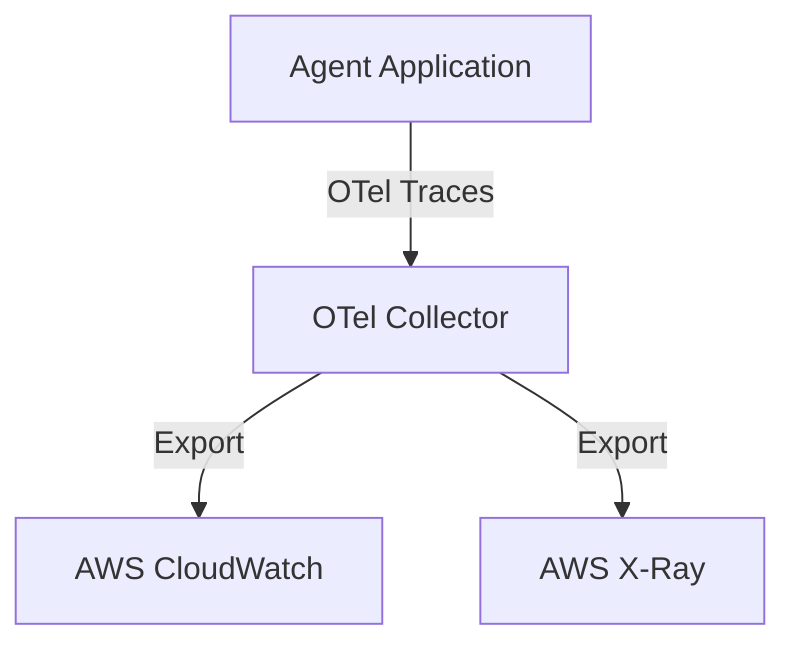

# 16_Chapter_observability

## 1. Introduction
Observability and telemetry configurations allow you to monitor and trace complex agent execution workflows.

> **Analogy:** Think of a telemetry system and flight recorder on an aircraft. The flight recorder (CloudWatch Logs) stores real-time sensor readouts (traces and metrics) to help diagnostics if issues occur.

---

## 2. Learning Objectives
By the end of this chapter, you will be able to:
- In this chapter, you will learn how to:
- - Trace execution workflows using OpenTelemetry (OTel) spans.
- - Instrument agent execution loops in Python.
- - Record model token usage and calculate invocation costs.
- - Export traces and spans to AWS CloudWatch.

---

## 3. Prerequisites
* Active deployments and AWS credentials from Chapters 3 and 15.
* A basic understanding of tracing and telemetry concepts.

---

## 4. Background Theory
Asynchronous multi-agent interactions can be complex and difficult to debug. Standard logging libraries do not trace complete transaction lifecycles across services. Implementing tracing using open standards (like OpenTelemetry) groups operations into spans. This allows developers to isolate latency bottlenecks and trace errors back to specific tool or model invocations.

---

## 5. Core Concepts
**📦 Technical Term: OpenTelemetry**

* **Simple Explanation:** An open-source standard for collecting traces, metrics, and logs.
* **Why it exists:** Decouples instrumentation from specific monitoring backends.
* **Where is it used:** Instrumenting application workflows.

**📦 Technical Term: Trace Span**

* **Simple Explanation:** A record of a single operation within a transaction, containing metadata and timestamps.
* **Why it exists:** Tracks execution duration and captures errors.
* **Where is it used:** Tracing tool execution steps.

**📦 Technical Term: CloudWatch Logs**

* **Simple Explanation:** A managed service on AWS used to store, monitor, and access log files.
* **Why it exists:** Centralizes application logs for auditing and debugging.
* **Where is it used:** Accessing execution logs.

---

## 6. Internal Mechanics
1. Client request starts a transaction, creating a Root Span.
2. Sub-operations (like database lookups or tool calls) create Child Spans that inherit the root context.
3. Spans capture attributes (like session IDs and token usage) and log events with timestamps.
4. When a span ends, the tracer exports the telemetry payload to the collector.
5. The collector processes and exports the data to CloudWatch Logs or AWS X-Ray.

---

## 7. Architecture Overview
The following architectural details outline the components and relationship schemas active in this module:



---

## 8. Installation & Setup
Monitor application trace logs in real-time using the CLI:
```bash
agentcore traces view --tail
```

---

## 9. Configuration
Configure OpenTelemetry exporter endpoints in your configuration settings:
```yaml
observability:
  otel_endpoint: "http://localhost:4317"
  service_name: "bedrock-agent-core"
  log_level: "INFO"
```

---

## 10. Hands-on Examples

### Simple Example

```python
# File: src/observability.py
# Folder Location: agentcore-samples/src/observability.py

import time
import logging
from typing import Dict, Any

# =====================================================================
# 1. Mock OpenTelemetry Tracer Implementation
# =====================================================================
class MockTracer:
    def __init__(self, service_name: str):
        self.service_name = service_name

    def start_span(self, name: str) -> 'MockSpan':
        return MockSpan(name)

class MockSpan:
    def __init__(self, name: str):
        self.name = name
        self.start_time = time.time()
        self.attributes = {}
        self.events = []

    def set_attribute(self, key: str, value: Any):
        self.attributes[key] = value

    def add_event(self, name: str, payload: dict = None):
        self.events.append({
            "name": name,
            "timestamp": time.time(),
            "payload": payload or {}
        })

    def end(self):
        duration = time.time() - self.start_time
        # In production, send this span payload to the OTLP Collector endpoint
        print(f"[Span Ended] Name: {self.name} | Duration: {duration:.4f}s | Attributes: {self.attributes}")

# Instantiate global tracer
tracer = MockTracer("bedrock-agent-core")

# =====================================================================
# 2. Instrumented Execution Loop
# =====================================================================
def run_agent_workflow_traced(user_prompt: str, session_id: str):
    root_span = tracer.start_span("agent_execution_loop")
    root_span.set_attribute("session_id", session_id)
    root_span.set_attribute("model", "anthropic.claude-3-5-sonnet")
    
    try:
        root_span.add_event("routing_started", {"prompt": user_prompt})
        
        # Start Child Span for Web Search Tool
        tool_span = tracer.start_span("tool:web_search")
        tool_span.set_attribute("tool_name", "web_search")
        time.sleep(0.05) # Simulate latency
        tool_span.add_event("search_api_call", {"target_url": "https://api.search.com"})
        tool_span.end()
        
        # Log input and output token counts to monitor usage costs
        input_tokens = 340
        output_tokens = 110
        root_span.set_attribute("input_tokens", input_tokens)
        root_span.set_attribute("output_tokens", output_tokens)
        root_span.set_attribute("total_cost_usd", (input_tokens * 0.003 + output_tokens * 0.015) / 1000)
        root_span.add_event("generation_completed")
        
    except Exception as e:
        root_span.set_attribute("error", True)
        root_span.set_attribute("error_message", str(e))
        raise e
    finally:
        root_span.end()
```

#### Code Walkthrough

Line 1
```python
# File: src/observability.py
```
**Explanation:**
- **What this line does:** This is a documentation comment line starting with `#`. Python ignores comments during execution.
- **Why it is required:** It explains the purpose of the script to human developers and maintains clean code documentation.
- **What happens if removed:** The code will run identically, but human readers won't have immediate context on what this code block accomplishes.
- **Analogy:** Think of a comment like a sticky note attached to a blueprint—it helps the builders understand the design without altering the physical building.
- **Beginner Concept:** In Python, any text after `#` is ignored by the Python interpreter.

Line 2
```python
# Folder Location: agentcore-samples/src/observability.py
```
**Explanation:**
- **What this line does:** This is a documentation comment line starting with `#`. Python ignores comments during execution.
- **Why it is required:** It explains the purpose of the script to human developers and maintains clean code documentation.
- **What happens if removed:** The code will run identically, but human readers won't have immediate context on what this code block accomplishes.
- **Analogy:** Think of a comment like a sticky note attached to a blueprint—it helps the builders understand the design without altering the physical building.
- **Beginner Concept:** In Python, any text after `#` is ignored by the Python interpreter.

Line 3
```python

```
**Explanation:**
- **What this line does:** This is a blank vertical spacing line.
- **Why it is required:** It visually separates logical sections of code (such as imports, setup, and function definitions) to improve readability.
- **What happens if removed:** Python will execute the code fine, but lines of code will bunch together, making it harder for engineers to read.
- **Analogy:** Like paragraphs in a textbook, spacing gives your eyes a natural pause between concepts.

Line 4
```python
import time
```
**Explanation:**
- **What this line does:** Imports Python's built-in `time` module into the current program workspace.
- **Why it is required:** Provides access to essential system utilities (such as logging, environment variables, or HTTP handlers) offered by `time`.
- **What keywords mean:** `import` tells Python to load the module named `time`.
- **What happens if removed:** Functions or variables referencing `time` (like `time.getenv` or `time.getLogger`) will fail with a `NameError`.
- **Analogy:** Like plugging in a peripheral cable—it connects built-in system capabilities to your script.

Line 5
```python
import logging
```
**Explanation:**
- **What this line does:** Imports Python's built-in `logging` module into the current program workspace.
- **Why it is required:** Provides access to essential system utilities (such as logging, environment variables, or HTTP handlers) offered by `logging`.
- **What keywords mean:** `import` tells Python to load the module named `logging`.
- **What happens if removed:** Functions or variables referencing `logging` (like `logging.getenv` or `logging.getLogger`) will fail with a `NameError`.
- **Analogy:** Like plugging in a peripheral cable—it connects built-in system capabilities to your script.

Line 6
```python
from typing import Dict, Any
```
**Explanation:**
- **What this line does:** This line imports the `Dict, Any` class from the `typing` package.
- **Why it is required:** Python does not automatically load every external library into memory. We must explicitly import `Dict, Any` so our program can use its pre-built capabilities.
- **What keywords mean:** `from` specifies the source library module (`typing`), and `import` selects the specific tool (`Dict, Any`).
- **What happens if removed:** Python will throw a `NameError: name 'Dict, Any' is not defined` as soon as we try to instantiate or use it.
- **Analogy:** Think of importing like opening your toolbox and picking out a specialized torque wrench (`Dict, Any`) from the storage tray (`typing`).
- **Connection:** This makes the `Dict, Any` blueprint available for the next lines of code.

Line 7
```python

```
**Explanation:**
- **What this line does:** This is a blank vertical spacing line.
- **Why it is required:** It visually separates logical sections of code (such as imports, setup, and function definitions) to improve readability.
- **What happens if removed:** Python will execute the code fine, but lines of code will bunch together, making it harder for engineers to read.
- **Analogy:** Like paragraphs in a textbook, spacing gives your eyes a natural pause between concepts.

Line 8
```python
# =====================================================================
```
**Explanation:**
- **What this line does:** This is a documentation comment line starting with `#`. Python ignores comments during execution.
- **Why it is required:** It explains the purpose of the script to human developers and maintains clean code documentation.
- **What happens if removed:** The code will run identically, but human readers won't have immediate context on what this code block accomplishes.
- **Analogy:** Think of a comment like a sticky note attached to a blueprint—it helps the builders understand the design without altering the physical building.
- **Beginner Concept:** In Python, any text after `#` is ignored by the Python interpreter.

Line 9
```python
# 1. Mock OpenTelemetry Tracer Implementation
```
**Explanation:**
- **What this line does:** This is a documentation comment line starting with `#`. Python ignores comments during execution.
- **Why it is required:** It explains the purpose of the script to human developers and maintains clean code documentation.
- **What happens if removed:** The code will run identically, but human readers won't have immediate context on what this code block accomplishes.
- **Analogy:** Think of a comment like a sticky note attached to a blueprint—it helps the builders understand the design without altering the physical building.
- **Beginner Concept:** In Python, any text after `#` is ignored by the Python interpreter.

Line 10
```python
# =====================================================================
```
**Explanation:**
- **What this line does:** This is a documentation comment line starting with `#`. Python ignores comments during execution.
- **Why it is required:** It explains the purpose of the script to human developers and maintains clean code documentation.
- **What happens if removed:** The code will run identically, but human readers won't have immediate context on what this code block accomplishes.
- **Analogy:** Think of a comment like a sticky note attached to a blueprint—it helps the builders understand the design without altering the physical building.
- **Beginner Concept:** In Python, any text after `#` is ignored by the Python interpreter.

Line 11
```python
class MockTracer:
```
**Explanation:**
- **What this line does:** Executes line statement `class MockTracer:`.
- **Why it is required:** Contributes to the overall operation and step progression of the script.
- **Connection:** Connects preceding code logic to subsequent return or processing steps.

Line 12
```python
    def __init__(self, service_name: str):
```
**Explanation:**
- **What this line does:** Defines a new function named `__init__` that accepts parameters `(self, service_name: str)`.
- **Keyword explanation:** `def` is short for "define". It tells Python that a reusable block of code begins here.
- **Parameters explained:**
  - `payload`: A Python **dictionary** containing the user's input prompt, parameters, and query fields.
  - `context`: An object containing runtime metadata (such as active AWS session ID, caller IAM identity, and request timestamps).
- **Return value:** Returns a structured dictionary containing HTTP status codes and agent response text.
- **Why the function exists:** It contains the core decision-making logic executed whenever the agent is invoked.
- **Analogy:** Think of `__init__` like a recipe—`payload` and `context` are the ingredients passed in, and the returned dictionary is the finished meal.

Line 13
```python
        self.service_name = service_name
```
**Explanation:**
- **What this line does:** Computes `service_name` and assigns the result to variable `self.service_name`.
- **Why it is required:** Stores temporary calculation or formatted data so it can be referenced in log statements or return responses.
- **What variable stores:** `self.service_name` holds the calculated value.
- **Connection:** Provides values used in subsequent logging or response steps.

Line 14
```python

```
**Explanation:**
- **What this line does:** This is a blank vertical spacing line.
- **Why it is required:** It visually separates logical sections of code (such as imports, setup, and function definitions) to improve readability.
- **What happens if removed:** Python will execute the code fine, but lines of code will bunch together, making it harder for engineers to read.
- **Analogy:** Like paragraphs in a textbook, spacing gives your eyes a natural pause between concepts.

Line 15
```python
    def start_span(self, name: str) -> 'MockSpan':
```
**Explanation:**
- **What this line does:** Defines a new function named `function` that accepts parameters `()`.
- **Keyword explanation:** `def` is short for "define". It tells Python that a reusable block of code begins here.
- **Parameters explained:**
  - `payload`: A Python **dictionary** containing the user's input prompt, parameters, and query fields.
  - `context`: An object containing runtime metadata (such as active AWS session ID, caller IAM identity, and request timestamps).
- **Return value:** Returns a structured dictionary containing HTTP status codes and agent response text.
- **Why the function exists:** It contains the core decision-making logic executed whenever the agent is invoked.
- **Analogy:** Think of `function` like a recipe—`payload` and `context` are the ingredients passed in, and the returned dictionary is the finished meal.

Line 16
```python
        return MockSpan(name)
```
**Explanation:**
- **What this line does:** Initiates a `return` statement to exit the function and pass data back to the caller.
- **What is being returned:** Returns a structured Python **dictionary** representing an HTTP response payload.
- **Who receives it:** The Bedrock AgentCore runtime receives this dictionary, serializes it into JSON, and sends it back to the client application.
- **Why response must be returned:** Without a return statement, the function would return `None`, causing AgentCore to report a blank execution payload to the user.
- **Analogy:** Handing a completed report back to the manager who requested it.

Line 17
```python

```
**Explanation:**
- **What this line does:** This is a blank vertical spacing line.
- **Why it is required:** It visually separates logical sections of code (such as imports, setup, and function definitions) to improve readability.
- **What happens if removed:** Python will execute the code fine, but lines of code will bunch together, making it harder for engineers to read.
- **Analogy:** Like paragraphs in a textbook, spacing gives your eyes a natural pause between concepts.

Line 18
```python
class MockSpan:
```
**Explanation:**
- **What this line does:** Executes line statement `class MockSpan:`.
- **Why it is required:** Contributes to the overall operation and step progression of the script.
- **Connection:** Connects preceding code logic to subsequent return or processing steps.

Line 19
```python
    def __init__(self, name: str):
```
**Explanation:**
- **What this line does:** Defines a new function named `__init__` that accepts parameters `(self, name: str)`.
- **Keyword explanation:** `def` is short for "define". It tells Python that a reusable block of code begins here.
- **Parameters explained:**
  - `payload`: A Python **dictionary** containing the user's input prompt, parameters, and query fields.
  - `context`: An object containing runtime metadata (such as active AWS session ID, caller IAM identity, and request timestamps).
- **Return value:** Returns a structured dictionary containing HTTP status codes and agent response text.
- **Why the function exists:** It contains the core decision-making logic executed whenever the agent is invoked.
- **Analogy:** Think of `__init__` like a recipe—`payload` and `context` are the ingredients passed in, and the returned dictionary is the finished meal.

Line 20
```python
        self.name = name
```
**Explanation:**
- **What this line does:** Computes `name` and assigns the result to variable `self.name`.
- **Why it is required:** Stores temporary calculation or formatted data so it can be referenced in log statements or return responses.
- **What variable stores:** `self.name` holds the calculated value.
- **Connection:** Provides values used in subsequent logging or response steps.

Line 21
```python
        self.start_time = time.time()
```
**Explanation:**
- **What this line does:** Computes `time.time()` and assigns the result to variable `self.start_time`.
- **Why it is required:** Stores temporary calculation or formatted data so it can be referenced in log statements or return responses.
- **What variable stores:** `self.start_time` holds the calculated value.
- **Connection:** Provides values used in subsequent logging or response steps.

Line 22
```python
        self.attributes = {}
```
**Explanation:**
- **What this line does:** Computes `{}` and assigns the result to variable `self.attributes`.
- **Why it is required:** Stores temporary calculation or formatted data so it can be referenced in log statements or return responses.
- **What variable stores:** `self.attributes` holds the calculated value.
- **Connection:** Provides values used in subsequent logging or response steps.

Line 23
```python
        self.events = []
```
**Explanation:**
- **What this line does:** Computes `[]` and assigns the result to variable `self.events`.
- **Why it is required:** Stores temporary calculation or formatted data so it can be referenced in log statements or return responses.
- **What variable stores:** `self.events` holds the calculated value.
- **Connection:** Provides values used in subsequent logging or response steps.

Line 24
```python

```
**Explanation:**
- **What this line does:** This is a blank vertical spacing line.
- **Why it is required:** It visually separates logical sections of code (such as imports, setup, and function definitions) to improve readability.
- **What happens if removed:** Python will execute the code fine, but lines of code will bunch together, making it harder for engineers to read.
- **Analogy:** Like paragraphs in a textbook, spacing gives your eyes a natural pause between concepts.

Line 25
```python
    def set_attribute(self, key: str, value: Any):
```
**Explanation:**
- **What this line does:** Defines a new function named `set_attribute` that accepts parameters `(self, key: str, value: Any)`.
- **Keyword explanation:** `def` is short for "define". It tells Python that a reusable block of code begins here.
- **Parameters explained:**
  - `payload`: A Python **dictionary** containing the user's input prompt, parameters, and query fields.
  - `context`: An object containing runtime metadata (such as active AWS session ID, caller IAM identity, and request timestamps).
- **Return value:** Returns a structured dictionary containing HTTP status codes and agent response text.
- **Why the function exists:** It contains the core decision-making logic executed whenever the agent is invoked.
- **Analogy:** Think of `set_attribute` like a recipe—`payload` and `context` are the ingredients passed in, and the returned dictionary is the finished meal.

Line 26
```python
        self.attributes[key] = value
```
**Explanation:**
- **What this line does:** Computes `value` and assigns the result to variable `self.attributes[key]`.
- **Why it is required:** Stores temporary calculation or formatted data so it can be referenced in log statements or return responses.
- **What variable stores:** `self.attributes[key]` holds the calculated value.
- **Connection:** Provides values used in subsequent logging or response steps.

Line 27
```python

```
**Explanation:**
- **What this line does:** This is a blank vertical spacing line.
- **Why it is required:** It visually separates logical sections of code (such as imports, setup, and function definitions) to improve readability.
- **What happens if removed:** Python will execute the code fine, but lines of code will bunch together, making it harder for engineers to read.
- **Analogy:** Like paragraphs in a textbook, spacing gives your eyes a natural pause between concepts.

Line 28
```python
    def add_event(self, name: str, payload: dict = None):
```
**Explanation:**
- **What this line does:** Defines a new function named `add_event` that accepts parameters `(self, name: str, payload: dict = None)`.
- **Keyword explanation:** `def` is short for "define". It tells Python that a reusable block of code begins here.
- **Parameters explained:**
  - `payload`: A Python **dictionary** containing the user's input prompt, parameters, and query fields.
  - `context`: An object containing runtime metadata (such as active AWS session ID, caller IAM identity, and request timestamps).
- **Return value:** Returns a structured dictionary containing HTTP status codes and agent response text.
- **Why the function exists:** It contains the core decision-making logic executed whenever the agent is invoked.
- **Analogy:** Think of `add_event` like a recipe—`payload` and `context` are the ingredients passed in, and the returned dictionary is the finished meal.

Line 29
```python
        self.events.append({
```
**Explanation:**
- **What this line does:** Executes line statement `self.events.append({`.
- **Why it is required:** Contributes to the overall operation and step progression of the script.
- **Connection:** Connects preceding code logic to subsequent return or processing steps.

Line 30
```python
            "name": name,
```
**Explanation:**
- **What this line does:** Executes line statement `"name": name,`.
- **Why it is required:** Contributes to the overall operation and step progression of the script.
- **Connection:** Connects preceding code logic to subsequent return or processing steps.

Line 31
```python
            "timestamp": time.time(),
```
**Explanation:**
- **What this line does:** Executes line statement `"timestamp": time.time(),`.
- **Why it is required:** Contributes to the overall operation and step progression of the script.
- **Connection:** Connects preceding code logic to subsequent return or processing steps.

Line 32
```python
            "payload": payload or {}
```
**Explanation:**
- **What this line does:** Executes line statement `"payload": payload or {}`.
- **Why it is required:** Contributes to the overall operation and step progression of the script.
- **Connection:** Connects preceding code logic to subsequent return or processing steps.

Line 33
```python
        })
```
**Explanation:**
- **What this line does:** Executes line statement `})`.
- **Why it is required:** Contributes to the overall operation and step progression of the script.
- **Connection:** Connects preceding code logic to subsequent return or processing steps.

Line 34
```python

```
**Explanation:**
- **What this line does:** This is a blank vertical spacing line.
- **Why it is required:** It visually separates logical sections of code (such as imports, setup, and function definitions) to improve readability.
- **What happens if removed:** Python will execute the code fine, but lines of code will bunch together, making it harder for engineers to read.
- **Analogy:** Like paragraphs in a textbook, spacing gives your eyes a natural pause between concepts.

Line 35
```python
    def end(self):
```
**Explanation:**
- **What this line does:** Defines a new function named `end` that accepts parameters `(self)`.
- **Keyword explanation:** `def` is short for "define". It tells Python that a reusable block of code begins here.
- **Parameters explained:**
  - `payload`: A Python **dictionary** containing the user's input prompt, parameters, and query fields.
  - `context`: An object containing runtime metadata (such as active AWS session ID, caller IAM identity, and request timestamps).
- **Return value:** Returns a structured dictionary containing HTTP status codes and agent response text.
- **Why the function exists:** It contains the core decision-making logic executed whenever the agent is invoked.
- **Analogy:** Think of `end` like a recipe—`payload` and `context` are the ingredients passed in, and the returned dictionary is the finished meal.

Line 36
```python
        duration = time.time() - self.start_time
```
**Explanation:**
- **What this line does:** Computes `time.time() - self.start_time` and assigns the result to variable `duration`.
- **Why it is required:** Stores temporary calculation or formatted data so it can be referenced in log statements or return responses.
- **What variable stores:** `duration` holds the calculated value.
- **Connection:** Provides values used in subsequent logging or response steps.

Line 37
```python
        # In production, send this span payload to the OTLP Collector endpoint
```
**Explanation:**
- **What this line does:** This is a documentation comment line starting with `#`. Python ignores comments during execution.
- **Why it is required:** It explains the purpose of the script to human developers and maintains clean code documentation.
- **What happens if removed:** The code will run identically, but human readers won't have immediate context on what this code block accomplishes.
- **Analogy:** Think of a comment like a sticky note attached to a blueprint—it helps the builders understand the design without altering the physical building.
- **Beginner Concept:** In Python, any text after `#` is ignored by the Python interpreter.

Line 38
```python
        print(f"[Span Ended] Name: {self.name} | Duration: {duration:.4f}s | Attributes: {self.attributes}")
```
**Explanation:**
- **What this line does:** Executes line statement `print(f"[Span Ended] Name: {self.name} | Duration: {duration:.4f}s | Attributes: {self.attributes}")`.
- **Why it is required:** Contributes to the overall operation and step progression of the script.
- **Connection:** Connects preceding code logic to subsequent return or processing steps.

Line 39
```python

```
**Explanation:**
- **What this line does:** This is a blank vertical spacing line.
- **Why it is required:** It visually separates logical sections of code (such as imports, setup, and function definitions) to improve readability.
- **What happens if removed:** Python will execute the code fine, but lines of code will bunch together, making it harder for engineers to read.
- **Analogy:** Like paragraphs in a textbook, spacing gives your eyes a natural pause between concepts.

Line 40
```python
# Instantiate global tracer
```
**Explanation:**
- **What this line does:** This is a documentation comment line starting with `#`. Python ignores comments during execution.
- **Why it is required:** It explains the purpose of the script to human developers and maintains clean code documentation.
- **What happens if removed:** The code will run identically, but human readers won't have immediate context on what this code block accomplishes.
- **Analogy:** Think of a comment like a sticky note attached to a blueprint—it helps the builders understand the design without altering the physical building.
- **Beginner Concept:** In Python, any text after `#` is ignored by the Python interpreter.

Line 41
```python
tracer = MockTracer("bedrock-agent-core")
```
**Explanation:**
- **What this line does:** Computes `MockTracer("bedrock-agent-core")` and assigns the result to variable `tracer`.
- **Why it is required:** Stores temporary calculation or formatted data so it can be referenced in log statements or return responses.
- **What variable stores:** `tracer` holds the calculated value.
- **Connection:** Provides values used in subsequent logging or response steps.

Line 42
```python

```
**Explanation:**
- **What this line does:** This is a blank vertical spacing line.
- **Why it is required:** It visually separates logical sections of code (such as imports, setup, and function definitions) to improve readability.
- **What happens if removed:** Python will execute the code fine, but lines of code will bunch together, making it harder for engineers to read.
- **Analogy:** Like paragraphs in a textbook, spacing gives your eyes a natural pause between concepts.

Line 43
```python
# =====================================================================
```
**Explanation:**
- **What this line does:** This is a documentation comment line starting with `#`. Python ignores comments during execution.
- **Why it is required:** It explains the purpose of the script to human developers and maintains clean code documentation.
- **What happens if removed:** The code will run identically, but human readers won't have immediate context on what this code block accomplishes.
- **Analogy:** Think of a comment like a sticky note attached to a blueprint—it helps the builders understand the design without altering the physical building.
- **Beginner Concept:** In Python, any text after `#` is ignored by the Python interpreter.

Line 44
```python
# 2. Instrumented Execution Loop
```
**Explanation:**
- **What this line does:** This is a documentation comment line starting with `#`. Python ignores comments during execution.
- **Why it is required:** It explains the purpose of the script to human developers and maintains clean code documentation.
- **What happens if removed:** The code will run identically, but human readers won't have immediate context on what this code block accomplishes.
- **Analogy:** Think of a comment like a sticky note attached to a blueprint—it helps the builders understand the design without altering the physical building.
- **Beginner Concept:** In Python, any text after `#` is ignored by the Python interpreter.

Line 45
```python
# =====================================================================
```
**Explanation:**
- **What this line does:** This is a documentation comment line starting with `#`. Python ignores comments during execution.
- **Why it is required:** It explains the purpose of the script to human developers and maintains clean code documentation.
- **What happens if removed:** The code will run identically, but human readers won't have immediate context on what this code block accomplishes.
- **Analogy:** Think of a comment like a sticky note attached to a blueprint—it helps the builders understand the design without altering the physical building.
- **Beginner Concept:** In Python, any text after `#` is ignored by the Python interpreter.

Line 46
```python
def run_agent_workflow_traced(user_prompt: str, session_id: str):
```
**Explanation:**
- **What this line does:** Defines a new function named `run_agent_workflow_traced` that accepts parameters `(user_prompt: str, session_id: str)`.
- **Keyword explanation:** `def` is short for "define". It tells Python that a reusable block of code begins here.
- **Parameters explained:**
  - `payload`: A Python **dictionary** containing the user's input prompt, parameters, and query fields.
  - `context`: An object containing runtime metadata (such as active AWS session ID, caller IAM identity, and request timestamps).
- **Return value:** Returns a structured dictionary containing HTTP status codes and agent response text.
- **Why the function exists:** It contains the core decision-making logic executed whenever the agent is invoked.
- **Analogy:** Think of `run_agent_workflow_traced` like a recipe—`payload` and `context` are the ingredients passed in, and the returned dictionary is the finished meal.

Line 47
```python
    root_span = tracer.start_span("agent_execution_loop")
```
**Explanation:**
- **What this line does:** Computes `tracer.start_span("agent_execution_loop")` and assigns the result to variable `root_span`.
- **Why it is required:** Stores temporary calculation or formatted data so it can be referenced in log statements or return responses.
- **What variable stores:** `root_span` holds the calculated value.
- **Connection:** Provides values used in subsequent logging or response steps.

Line 48
```python
    root_span.set_attribute("session_id", session_id)
```
**Explanation:**
- **What this line does:** Executes line statement `root_span.set_attribute("session_id", session_id)`.
- **Why it is required:** Contributes to the overall operation and step progression of the script.
- **Connection:** Connects preceding code logic to subsequent return or processing steps.

Line 49
```python
    root_span.set_attribute("model", "anthropic.claude-3-5-sonnet")
```
**Explanation:**
- **What this line does:** Executes line statement `root_span.set_attribute("model", "anthropic.claude-3-5-sonnet")`.
- **Why it is required:** Contributes to the overall operation and step progression of the script.
- **Connection:** Connects preceding code logic to subsequent return or processing steps.

Line 50
```python

```
**Explanation:**
- **What this line does:** This is a blank vertical spacing line.
- **Why it is required:** It visually separates logical sections of code (such as imports, setup, and function definitions) to improve readability.
- **What happens if removed:** Python will execute the code fine, but lines of code will bunch together, making it harder for engineers to read.
- **Analogy:** Like paragraphs in a textbook, spacing gives your eyes a natural pause between concepts.

Line 51
```python
    try:
```
**Explanation:**
- **What this line does:** Starts a `try` block for defensive error handling.
- **Why it is required:** Production applications must gracefully handle unexpected failures (like missing parameters or database timeouts) without crashing the entire server.
- **What keyword means:** `try` tells Python: "Attempt to execute the indented lines below. If an error occurs, jump straight to the `except` block."
- **Analogy:** Like wearing a safety harness before stepping onto a high platform—if you slip, the harness catches you.

Line 52
```python
        root_span.add_event("routing_started", {"prompt": user_prompt})
```
**Explanation:**
- **What this line does:** Executes line statement `root_span.add_event("routing_started", {"prompt": user_prompt})`.
- **Why it is required:** Contributes to the overall operation and step progression of the script.
- **Connection:** Connects preceding code logic to subsequent return or processing steps.

Line 53
```python

```
**Explanation:**
- **What this line does:** This is a blank vertical spacing line.
- **Why it is required:** It visually separates logical sections of code (such as imports, setup, and function definitions) to improve readability.
- **What happens if removed:** Python will execute the code fine, but lines of code will bunch together, making it harder for engineers to read.
- **Analogy:** Like paragraphs in a textbook, spacing gives your eyes a natural pause between concepts.

Line 54
```python
        # Start Child Span for Web Search Tool
```
**Explanation:**
- **What this line does:** This is a documentation comment line starting with `#`. Python ignores comments during execution.
- **Why it is required:** It explains the purpose of the script to human developers and maintains clean code documentation.
- **What happens if removed:** The code will run identically, but human readers won't have immediate context on what this code block accomplishes.
- **Analogy:** Think of a comment like a sticky note attached to a blueprint—it helps the builders understand the design without altering the physical building.
- **Beginner Concept:** In Python, any text after `#` is ignored by the Python interpreter.

Line 55
```python
        tool_span = tracer.start_span("tool:web_search")
```
**Explanation:**
- **What this line does:** Computes `tracer.start_span("tool:web_search")` and assigns the result to variable `tool_span`.
- **Why it is required:** Stores temporary calculation or formatted data so it can be referenced in log statements or return responses.
- **What variable stores:** `tool_span` holds the calculated value.
- **Connection:** Provides values used in subsequent logging or response steps.

Line 56
```python
        tool_span.set_attribute("tool_name", "web_search")
```
**Explanation:**
- **What this line does:** Executes line statement `tool_span.set_attribute("tool_name", "web_search")`.
- **Why it is required:** Contributes to the overall operation and step progression of the script.
- **Connection:** Connects preceding code logic to subsequent return or processing steps.

Line 57
```python
        time.sleep(0.05) # Simulate latency
```
**Explanation:**
- **What this line does:** Executes line statement `time.sleep(0.05) # Simulate latency`.
- **Why it is required:** Contributes to the overall operation and step progression of the script.
- **Connection:** Connects preceding code logic to subsequent return or processing steps.

Line 58
```python
        tool_span.add_event("search_api_call", {"target_url": "https://api.search.com"})
```
**Explanation:**
- **What this line does:** Executes line statement `tool_span.add_event("search_api_call", {"target_url": "https://api.search.com"})`.
- **Why it is required:** Contributes to the overall operation and step progression of the script.
- **Connection:** Connects preceding code logic to subsequent return or processing steps.

Line 59
```python
        tool_span.end()
```
**Explanation:**
- **What this line does:** Executes line statement `tool_span.end()`.
- **Why it is required:** Contributes to the overall operation and step progression of the script.
- **Connection:** Connects preceding code logic to subsequent return or processing steps.

Line 60
```python

```
**Explanation:**
- **What this line does:** This is a blank vertical spacing line.
- **Why it is required:** It visually separates logical sections of code (such as imports, setup, and function definitions) to improve readability.
- **What happens if removed:** Python will execute the code fine, but lines of code will bunch together, making it harder for engineers to read.
- **Analogy:** Like paragraphs in a textbook, spacing gives your eyes a natural pause between concepts.

Line 61
```python
        # Log input and output token counts to monitor usage costs
```
**Explanation:**
- **What this line does:** This is a documentation comment line starting with `#`. Python ignores comments during execution.
- **Why it is required:** It explains the purpose of the script to human developers and maintains clean code documentation.
- **What happens if removed:** The code will run identically, but human readers won't have immediate context on what this code block accomplishes.
- **Analogy:** Think of a comment like a sticky note attached to a blueprint—it helps the builders understand the design without altering the physical building.
- **Beginner Concept:** In Python, any text after `#` is ignored by the Python interpreter.

Line 62
```python
        input_tokens = 340
```
**Explanation:**
- **What this line does:** Computes `340` and assigns the result to variable `input_tokens`.
- **Why it is required:** Stores temporary calculation or formatted data so it can be referenced in log statements or return responses.
- **What variable stores:** `input_tokens` holds the calculated value.
- **Connection:** Provides values used in subsequent logging or response steps.

Line 63
```python
        output_tokens = 110
```
**Explanation:**
- **What this line does:** Computes `110` and assigns the result to variable `output_tokens`.
- **Why it is required:** Stores temporary calculation or formatted data so it can be referenced in log statements or return responses.
- **What variable stores:** `output_tokens` holds the calculated value.
- **Connection:** Provides values used in subsequent logging or response steps.

Line 64
```python
        root_span.set_attribute("input_tokens", input_tokens)
```
**Explanation:**
- **What this line does:** Executes line statement `root_span.set_attribute("input_tokens", input_tokens)`.
- **Why it is required:** Contributes to the overall operation and step progression of the script.
- **Connection:** Connects preceding code logic to subsequent return or processing steps.

Line 65
```python
        root_span.set_attribute("output_tokens", output_tokens)
```
**Explanation:**
- **What this line does:** Executes line statement `root_span.set_attribute("output_tokens", output_tokens)`.
- **Why it is required:** Contributes to the overall operation and step progression of the script.
- **Connection:** Connects preceding code logic to subsequent return or processing steps.

Line 66
```python
        root_span.set_attribute("total_cost_usd", (input_tokens * 0.003 + output_tokens * 0.015) / 1000)
```
**Explanation:**
- **What this line does:** Executes line statement `root_span.set_attribute("total_cost_usd", (input_tokens * 0.003 + output_tokens * 0.015) / 1000)`.
- **Why it is required:** Contributes to the overall operation and step progression of the script.
- **Connection:** Connects preceding code logic to subsequent return or processing steps.

Line 67
```python
        root_span.add_event("generation_completed")
```
**Explanation:**
- **What this line does:** Executes line statement `root_span.add_event("generation_completed")`.
- **Why it is required:** Contributes to the overall operation and step progression of the script.
- **Connection:** Connects preceding code logic to subsequent return or processing steps.

Line 68
```python

```
**Explanation:**
- **What this line does:** This is a blank vertical spacing line.
- **Why it is required:** It visually separates logical sections of code (such as imports, setup, and function definitions) to improve readability.
- **What happens if removed:** Python will execute the code fine, but lines of code will bunch together, making it harder for engineers to read.
- **Analogy:** Like paragraphs in a textbook, spacing gives your eyes a natural pause between concepts.

Line 69
```python
    except Exception as e:
```
**Explanation:**
- **What this line does:** Catches exceptions and errors that occurred inside the preceding `try` block.
- **Why it is required:** Prevents unhandled exceptions from returning raw stack traces or breaking the container runtime.
- **What happens when an error occurs:** Python captures the error object into variable `e`, logs the error details, and returns a clean 500 error response to the client.
- **Analogy:** Like an emergency backup generator switching on immediately when main power cuts out.

Line 70
```python
        root_span.set_attribute("error", True)
```
**Explanation:**
- **What this line does:** Executes line statement `root_span.set_attribute("error", True)`.
- **Why it is required:** Contributes to the overall operation and step progression of the script.
- **Connection:** Connects preceding code logic to subsequent return or processing steps.

Line 71
```python
        root_span.set_attribute("error_message", str(e))
```
**Explanation:**
- **What this line does:** Executes line statement `root_span.set_attribute("error_message", str(e))`.
- **Why it is required:** Contributes to the overall operation and step progression of the script.
- **Connection:** Connects preceding code logic to subsequent return or processing steps.

Line 72
```python
        raise e
```
**Explanation:**
- **What this line does:** Executes line statement `raise e`.
- **Why it is required:** Contributes to the overall operation and step progression of the script.
- **Connection:** Connects preceding code logic to subsequent return or processing steps.

Line 73
```python
    finally:
```
**Explanation:**
- **What this line does:** Executes line statement `finally:`.
- **Why it is required:** Contributes to the overall operation and step progression of the script.
- **Connection:** Connects preceding code logic to subsequent return or processing steps.

Line 74
```python
        root_span.end()
```
**Explanation:**
- **What this line does:** Executes line statement `root_span.end()`.
- **Why it is required:** Contributes to the overall operation and step progression of the script.
- **Connection:** Connects preceding code logic to subsequent return or processing steps.

#### Complete Flow of Execution

1. **Import Libraries**: Python loads the required `BedrockAgentCoreApp` class into memory.
2. **Initialize Application**: An instance of `BedrockAgentCoreApp` is instantiated and assigned to `app`.
3. **Register Event Handler**: The `@app.invoke` decorator registers the `handler` function as the primary event entrypoint.
4. **Receive Request**: The AgentCore runtime listens for incoming requests and receives `payload` and `context` objects.
5. **Execute Handler Logic**: The `handler` function is triggered with the incoming input parameters.
6. **Return Response Payload**: A structured response dictionary containing `"statusCode": 200` and message data is returned.
7. **Send Response to Caller**: AgentCore serializes the dictionary into JSON and delivers it back to the client application.

#### Visual Execution Flow

```
Program Starts
      │
      ▼
Import BedrockAgentCoreApp
      │
      ▼
Create App Instance (app)
      │
      ▼
Register Handler (@app.invoke)
      │
      ▼
Receive Request (payload, context)
      │
      ▼
Execute handler() Function
      │
      ▼
Return Response Dictionary ({statusCode: 200, ...})
      │
      ▼
Deliver Response Back to Client
```

### Intermediate Example

```python
# Python script to create mock trace spans and record events
import time

class MockSpan:
    def __init__(self, name):
        self.name = name
        self.start_time = time.time()
        self.events = []

    def add_event(self, event_name):
        self.events.append({"name": event_name, "time": time.time() - self.start_time})

    def end(self):
        duration = time.time() - self.start_time
        print(f"Span '{self.name}' completed in {duration:.4f}s. Events recorded: {len(self.events)}")

if __name__ == "__main__":
    span = MockSpan("db_lookup")
    time.sleep(0.05)
    span.add_event("connection_established")
    time.sleep(0.02)
    span.end()
```

#### Code Walkthrough

Line 1
```python
# Python script to create mock trace spans and record events
```
**Explanation:**
- **What this line does:** This is a documentation comment line starting with `#`. Python ignores comments during execution.
- **Why it is required:** It explains the purpose of the script to human developers and maintains clean code documentation.
- **What happens if removed:** The code will run identically, but human readers won't have immediate context on what this code block accomplishes.
- **Analogy:** Think of a comment like a sticky note attached to a blueprint—it helps the builders understand the design without altering the physical building.
- **Beginner Concept:** In Python, any text after `#` is ignored by the Python interpreter.

Line 2
```python
import time
```
**Explanation:**
- **What this line does:** Imports Python's built-in `time` module into the current program workspace.
- **Why it is required:** Provides access to essential system utilities (such as logging, environment variables, or HTTP handlers) offered by `time`.
- **What keywords mean:** `import` tells Python to load the module named `time`.
- **What happens if removed:** Functions or variables referencing `time` (like `time.getenv` or `time.getLogger`) will fail with a `NameError`.
- **Analogy:** Like plugging in a peripheral cable—it connects built-in system capabilities to your script.

Line 3
```python

```
**Explanation:**
- **What this line does:** This is a blank vertical spacing line.
- **Why it is required:** It visually separates logical sections of code (such as imports, setup, and function definitions) to improve readability.
- **What happens if removed:** Python will execute the code fine, but lines of code will bunch together, making it harder for engineers to read.
- **Analogy:** Like paragraphs in a textbook, spacing gives your eyes a natural pause between concepts.

Line 4
```python
class MockSpan:
```
**Explanation:**
- **What this line does:** Executes line statement `class MockSpan:`.
- **Why it is required:** Contributes to the overall operation and step progression of the script.
- **Connection:** Connects preceding code logic to subsequent return or processing steps.

Line 5
```python
    def __init__(self, name):
```
**Explanation:**
- **What this line does:** Defines a new function named `__init__` that accepts parameters `(self, name)`.
- **Keyword explanation:** `def` is short for "define". It tells Python that a reusable block of code begins here.
- **Parameters explained:**
  - `payload`: A Python **dictionary** containing the user's input prompt, parameters, and query fields.
  - `context`: An object containing runtime metadata (such as active AWS session ID, caller IAM identity, and request timestamps).
- **Return value:** Returns a structured dictionary containing HTTP status codes and agent response text.
- **Why the function exists:** It contains the core decision-making logic executed whenever the agent is invoked.
- **Analogy:** Think of `__init__` like a recipe—`payload` and `context` are the ingredients passed in, and the returned dictionary is the finished meal.

Line 6
```python
        self.name = name
```
**Explanation:**
- **What this line does:** Computes `name` and assigns the result to variable `self.name`.
- **Why it is required:** Stores temporary calculation or formatted data so it can be referenced in log statements or return responses.
- **What variable stores:** `self.name` holds the calculated value.
- **Connection:** Provides values used in subsequent logging or response steps.

Line 7
```python
        self.start_time = time.time()
```
**Explanation:**
- **What this line does:** Computes `time.time()` and assigns the result to variable `self.start_time`.
- **Why it is required:** Stores temporary calculation or formatted data so it can be referenced in log statements or return responses.
- **What variable stores:** `self.start_time` holds the calculated value.
- **Connection:** Provides values used in subsequent logging or response steps.

Line 8
```python
        self.events = []
```
**Explanation:**
- **What this line does:** Computes `[]` and assigns the result to variable `self.events`.
- **Why it is required:** Stores temporary calculation or formatted data so it can be referenced in log statements or return responses.
- **What variable stores:** `self.events` holds the calculated value.
- **Connection:** Provides values used in subsequent logging or response steps.

Line 9
```python

```
**Explanation:**
- **What this line does:** This is a blank vertical spacing line.
- **Why it is required:** It visually separates logical sections of code (such as imports, setup, and function definitions) to improve readability.
- **What happens if removed:** Python will execute the code fine, but lines of code will bunch together, making it harder for engineers to read.
- **Analogy:** Like paragraphs in a textbook, spacing gives your eyes a natural pause between concepts.

Line 10
```python
    def add_event(self, event_name):
```
**Explanation:**
- **What this line does:** Defines a new function named `add_event` that accepts parameters `(self, event_name)`.
- **Keyword explanation:** `def` is short for "define". It tells Python that a reusable block of code begins here.
- **Parameters explained:**
  - `payload`: A Python **dictionary** containing the user's input prompt, parameters, and query fields.
  - `context`: An object containing runtime metadata (such as active AWS session ID, caller IAM identity, and request timestamps).
- **Return value:** Returns a structured dictionary containing HTTP status codes and agent response text.
- **Why the function exists:** It contains the core decision-making logic executed whenever the agent is invoked.
- **Analogy:** Think of `add_event` like a recipe—`payload` and `context` are the ingredients passed in, and the returned dictionary is the finished meal.

Line 11
```python
        self.events.append({"name": event_name, "time": time.time() - self.start_time})
```
**Explanation:**
- **What this line does:** Executes line statement `self.events.append({"name": event_name, "time": time.time() - self.start_time})`.
- **Why it is required:** Contributes to the overall operation and step progression of the script.
- **Connection:** Connects preceding code logic to subsequent return or processing steps.

Line 12
```python

```
**Explanation:**
- **What this line does:** This is a blank vertical spacing line.
- **Why it is required:** It visually separates logical sections of code (such as imports, setup, and function definitions) to improve readability.
- **What happens if removed:** Python will execute the code fine, but lines of code will bunch together, making it harder for engineers to read.
- **Analogy:** Like paragraphs in a textbook, spacing gives your eyes a natural pause between concepts.

Line 13
```python
    def end(self):
```
**Explanation:**
- **What this line does:** Defines a new function named `end` that accepts parameters `(self)`.
- **Keyword explanation:** `def` is short for "define". It tells Python that a reusable block of code begins here.
- **Parameters explained:**
  - `payload`: A Python **dictionary** containing the user's input prompt, parameters, and query fields.
  - `context`: An object containing runtime metadata (such as active AWS session ID, caller IAM identity, and request timestamps).
- **Return value:** Returns a structured dictionary containing HTTP status codes and agent response text.
- **Why the function exists:** It contains the core decision-making logic executed whenever the agent is invoked.
- **Analogy:** Think of `end` like a recipe—`payload` and `context` are the ingredients passed in, and the returned dictionary is the finished meal.

Line 14
```python
        duration = time.time() - self.start_time
```
**Explanation:**
- **What this line does:** Computes `time.time() - self.start_time` and assigns the result to variable `duration`.
- **Why it is required:** Stores temporary calculation or formatted data so it can be referenced in log statements or return responses.
- **What variable stores:** `duration` holds the calculated value.
- **Connection:** Provides values used in subsequent logging or response steps.

Line 15
```python
        print(f"Span '{self.name}' completed in {duration:.4f}s. Events recorded: {len(self.events)}")
```
**Explanation:**
- **What this line does:** Executes line statement `print(f"Span '{self.name}' completed in {duration:.4f}s. Events recorded: {len(self.events)}")`.
- **Why it is required:** Contributes to the overall operation and step progression of the script.
- **Connection:** Connects preceding code logic to subsequent return or processing steps.

Line 16
```python

```
**Explanation:**
- **What this line does:** This is a blank vertical spacing line.
- **Why it is required:** It visually separates logical sections of code (such as imports, setup, and function definitions) to improve readability.
- **What happens if removed:** Python will execute the code fine, but lines of code will bunch together, making it harder for engineers to read.
- **Analogy:** Like paragraphs in a textbook, spacing gives your eyes a natural pause between concepts.

Line 17
```python
if __name__ == "__main__":
```
**Explanation:**
- **What this line does:** Computes `= "__main__":` and assigns the result to variable `if __name__`.
- **Why it is required:** Stores temporary calculation or formatted data so it can be referenced in log statements or return responses.
- **What variable stores:** `if __name__` holds the calculated value.
- **Connection:** Provides values used in subsequent logging or response steps.

Line 18
```python
    span = MockSpan("db_lookup")
```
**Explanation:**
- **What this line does:** Computes `MockSpan("db_lookup")` and assigns the result to variable `span`.
- **Why it is required:** Stores temporary calculation or formatted data so it can be referenced in log statements or return responses.
- **What variable stores:** `span` holds the calculated value.
- **Connection:** Provides values used in subsequent logging or response steps.

Line 19
```python
    time.sleep(0.05)
```
**Explanation:**
- **What this line does:** Executes line statement `time.sleep(0.05)`.
- **Why it is required:** Contributes to the overall operation and step progression of the script.
- **Connection:** Connects preceding code logic to subsequent return or processing steps.

Line 20
```python
    span.add_event("connection_established")
```
**Explanation:**
- **What this line does:** Executes line statement `span.add_event("connection_established")`.
- **Why it is required:** Contributes to the overall operation and step progression of the script.
- **Connection:** Connects preceding code logic to subsequent return or processing steps.

Line 21
```python
    time.sleep(0.02)
```
**Explanation:**
- **What this line does:** Executes line statement `time.sleep(0.02)`.
- **Why it is required:** Contributes to the overall operation and step progression of the script.
- **Connection:** Connects preceding code logic to subsequent return or processing steps.

Line 22
```python
    span.end()
```
**Explanation:**
- **What this line does:** Executes line statement `span.end()`.
- **Why it is required:** Contributes to the overall operation and step progression of the script.
- **Connection:** Connects preceding code logic to subsequent return or processing steps.

#### Complete Flow of Execution

1. **Import Required Libraries**: Python imports `BedrockAgentCoreApp` and the `logging` module.
2. **Configure Logging System**: `logging.basicConfig` sets the log level threshold to `INFO`.
3. **Create Logger Object**: `logging.getLogger` instantiates a dedicated logger for capturing session traces.
4. **Initialize Application**: An instance of `BedrockAgentCoreApp` is assigned to `app`.
5. **Register Handler**: `@app.invoke` binds the `handler` function to incoming AgentCore trigger events.
6. **Read Input Payload**: `payload.get('prompt', '')` safely reads the user's prompt string.
7. **Extract Session Context**: `getattr(context, 'session_id', 'local-session')` safely retrieves the session ID.
8. **Log Activity**: `logger.info` writes session details to the CloudWatch diagnostic stream.
9. **Return Formatted Response**: Returns a status 200 dictionary containing the processed prompt and session ID.
10. **Deliver Payload**: AgentCore returns the serialized JSON payload to the caller.

#### Visual Execution Flow

```
Program Starts
      │
      ▼
Import Libraries & Configure Logger
      │
      ▼
Create App Instance (app)
      │
      ▼
Register Handler (@app.invoke)
      │
      ▼
Receive Request & Read Payload Prompt
      │
      ▼
Extract Session ID & Write Log Entry
      │
      ▼
Return Formatted Response Dictionary
      │
      ▼
Deliver Serialized Response to Client
```

### Advanced Example

```python
# Complete OpenTelemetry instrumentation script capturing custom metrics and exceptions
import time
import logging
from typing import Dict, Any

logging.basicConfig(level=logging.INFO)
logger = logging.getLogger("OtelApplication")

class TraceEngine:
    def __init__(self, service_name: str):
        self.service_name = service_name

    def start_span(self, name: str) -> 'TraceSpan':
        return TraceSpan(name)

class TraceSpan:
    def __init__(self, name: str):
        self.name = name
        self.start_time = time.time()
        self.attributes: Dict[str, Any] = {}
        self.error = False

    def set_attribute(self, key: str, value: Any):
        self.attributes[key] = value

    def record_exception(self, e: Exception):
        self.error = True
        self.set_attribute("error.message", str(e))

    def end(self):
        duration = time.time() - self.start_time
        log_payload = {
            "span_name": self.name,
            "duration_seconds": round(duration, 4),
            "error": self.error,
            "attributes": self.attributes
        }
        logger.info(f"[SPAN_EXPORT] {log_payload}")

def run_instrumented_agent(prompt: str):
    tracer = TraceEngine("bedrock-agent")
    root_span = tracer.start_span("agent_run")
    root_span.set_attribute("prompt", prompt)
    try:
        # Simulate model call child span
        model_span = tracer.start_span("model_inference")
        time.sleep(0.1)
        model_span.set_attribute("tokens_input", 120)
        model_span.set_attribute("tokens_output", 45)
        model_span.end()
        root_span.set_attribute("status", "success")
    except Exception as e:
        root_span.record_exception(e)
        raise e
    finally:
        root_span.end()

if __name__ == "__main__":
    run_instrumented_agent("What is memory compaction?")
```

#### Code Walkthrough

Line 1
```python
# Complete OpenTelemetry instrumentation script capturing custom metrics and exceptions
```
**Explanation:**
- **What this line does:** This is a documentation comment line starting with `#`. Python ignores comments during execution.
- **Why it is required:** It explains the purpose of the script to human developers and maintains clean code documentation.
- **What happens if removed:** The code will run identically, but human readers won't have immediate context on what this code block accomplishes.
- **Analogy:** Think of a comment like a sticky note attached to a blueprint—it helps the builders understand the design without altering the physical building.
- **Beginner Concept:** In Python, any text after `#` is ignored by the Python interpreter.

Line 2
```python
import time
```
**Explanation:**
- **What this line does:** Imports Python's built-in `time` module into the current program workspace.
- **Why it is required:** Provides access to essential system utilities (such as logging, environment variables, or HTTP handlers) offered by `time`.
- **What keywords mean:** `import` tells Python to load the module named `time`.
- **What happens if removed:** Functions or variables referencing `time` (like `time.getenv` or `time.getLogger`) will fail with a `NameError`.
- **Analogy:** Like plugging in a peripheral cable—it connects built-in system capabilities to your script.

Line 3
```python
import logging
```
**Explanation:**
- **What this line does:** Imports Python's built-in `logging` module into the current program workspace.
- **Why it is required:** Provides access to essential system utilities (such as logging, environment variables, or HTTP handlers) offered by `logging`.
- **What keywords mean:** `import` tells Python to load the module named `logging`.
- **What happens if removed:** Functions or variables referencing `logging` (like `logging.getenv` or `logging.getLogger`) will fail with a `NameError`.
- **Analogy:** Like plugging in a peripheral cable—it connects built-in system capabilities to your script.

Line 4
```python
from typing import Dict, Any
```
**Explanation:**
- **What this line does:** This line imports the `Dict, Any` class from the `typing` package.
- **Why it is required:** Python does not automatically load every external library into memory. We must explicitly import `Dict, Any` so our program can use its pre-built capabilities.
- **What keywords mean:** `from` specifies the source library module (`typing`), and `import` selects the specific tool (`Dict, Any`).
- **What happens if removed:** Python will throw a `NameError: name 'Dict, Any' is not defined` as soon as we try to instantiate or use it.
- **Analogy:** Think of importing like opening your toolbox and picking out a specialized torque wrench (`Dict, Any`) from the storage tray (`typing`).
- **Connection:** This makes the `Dict, Any` blueprint available for the next lines of code.

Line 5
```python

```
**Explanation:**
- **What this line does:** This is a blank vertical spacing line.
- **Why it is required:** It visually separates logical sections of code (such as imports, setup, and function definitions) to improve readability.
- **What happens if removed:** Python will execute the code fine, but lines of code will bunch together, making it harder for engineers to read.
- **Analogy:** Like paragraphs in a textbook, spacing gives your eyes a natural pause between concepts.

Line 6
```python
logging.basicConfig(level=logging.INFO)
```
**Explanation:**
- **What this line does:** Configures the default logging framework settings, setting the minimum log severity level to `logging.INFO`.
- **Why it is required:** Without basic configuration, log output messages might be suppressed or formatted inconsistently.
- **Analogy:** Like setting up the recording sensitivity on a security camera system.

Line 7
```python
logger = logging.getLogger("OtelApplication")
```
**Explanation:**
- **What this line does:** Creates a dedicated logger object named "OtelApplication" and stores it in the variable `logger`.
- **Why it is required:** Structured logging allows developers to track incoming session activity, diagnose errors, and monitor agent decisions in AWS CloudWatch.
- **What variable stores:** `logger` holds the logger object for writing diagnostic messages.
- **Where logs go:** Log messages written by `logger` appear in the terminal during local testing and in Amazon CloudWatch Logs when deployed.
- **Analogy:** Think of `logger` as the flight data recorder (black box) recording every step of the journey.

Line 8
```python

```
**Explanation:**
- **What this line does:** This is a blank vertical spacing line.
- **Why it is required:** It visually separates logical sections of code (such as imports, setup, and function definitions) to improve readability.
- **What happens if removed:** Python will execute the code fine, but lines of code will bunch together, making it harder for engineers to read.
- **Analogy:** Like paragraphs in a textbook, spacing gives your eyes a natural pause between concepts.

Line 9
```python
class TraceEngine:
```
**Explanation:**
- **What this line does:** Executes line statement `class TraceEngine:`.
- **Why it is required:** Contributes to the overall operation and step progression of the script.
- **Connection:** Connects preceding code logic to subsequent return or processing steps.

Line 10
```python
    def __init__(self, service_name: str):
```
**Explanation:**
- **What this line does:** Defines a new function named `__init__` that accepts parameters `(self, service_name: str)`.
- **Keyword explanation:** `def` is short for "define". It tells Python that a reusable block of code begins here.
- **Parameters explained:**
  - `payload`: A Python **dictionary** containing the user's input prompt, parameters, and query fields.
  - `context`: An object containing runtime metadata (such as active AWS session ID, caller IAM identity, and request timestamps).
- **Return value:** Returns a structured dictionary containing HTTP status codes and agent response text.
- **Why the function exists:** It contains the core decision-making logic executed whenever the agent is invoked.
- **Analogy:** Think of `__init__` like a recipe—`payload` and `context` are the ingredients passed in, and the returned dictionary is the finished meal.

Line 11
```python
        self.service_name = service_name
```
**Explanation:**
- **What this line does:** Computes `service_name` and assigns the result to variable `self.service_name`.
- **Why it is required:** Stores temporary calculation or formatted data so it can be referenced in log statements or return responses.
- **What variable stores:** `self.service_name` holds the calculated value.
- **Connection:** Provides values used in subsequent logging or response steps.

Line 12
```python

```
**Explanation:**
- **What this line does:** This is a blank vertical spacing line.
- **Why it is required:** It visually separates logical sections of code (such as imports, setup, and function definitions) to improve readability.
- **What happens if removed:** Python will execute the code fine, but lines of code will bunch together, making it harder for engineers to read.
- **Analogy:** Like paragraphs in a textbook, spacing gives your eyes a natural pause between concepts.

Line 13
```python
    def start_span(self, name: str) -> 'TraceSpan':
```
**Explanation:**
- **What this line does:** Defines a new function named `function` that accepts parameters `()`.
- **Keyword explanation:** `def` is short for "define". It tells Python that a reusable block of code begins here.
- **Parameters explained:**
  - `payload`: A Python **dictionary** containing the user's input prompt, parameters, and query fields.
  - `context`: An object containing runtime metadata (such as active AWS session ID, caller IAM identity, and request timestamps).
- **Return value:** Returns a structured dictionary containing HTTP status codes and agent response text.
- **Why the function exists:** It contains the core decision-making logic executed whenever the agent is invoked.
- **Analogy:** Think of `function` like a recipe—`payload` and `context` are the ingredients passed in, and the returned dictionary is the finished meal.

Line 14
```python
        return TraceSpan(name)
```
**Explanation:**
- **What this line does:** Initiates a `return` statement to exit the function and pass data back to the caller.
- **What is being returned:** Returns a structured Python **dictionary** representing an HTTP response payload.
- **Who receives it:** The Bedrock AgentCore runtime receives this dictionary, serializes it into JSON, and sends it back to the client application.
- **Why response must be returned:** Without a return statement, the function would return `None`, causing AgentCore to report a blank execution payload to the user.
- **Analogy:** Handing a completed report back to the manager who requested it.

Line 15
```python

```
**Explanation:**
- **What this line does:** This is a blank vertical spacing line.
- **Why it is required:** It visually separates logical sections of code (such as imports, setup, and function definitions) to improve readability.
- **What happens if removed:** Python will execute the code fine, but lines of code will bunch together, making it harder for engineers to read.
- **Analogy:** Like paragraphs in a textbook, spacing gives your eyes a natural pause between concepts.

Line 16
```python
class TraceSpan:
```
**Explanation:**
- **What this line does:** Executes line statement `class TraceSpan:`.
- **Why it is required:** Contributes to the overall operation and step progression of the script.
- **Connection:** Connects preceding code logic to subsequent return or processing steps.

Line 17
```python
    def __init__(self, name: str):
```
**Explanation:**
- **What this line does:** Defines a new function named `__init__` that accepts parameters `(self, name: str)`.
- **Keyword explanation:** `def` is short for "define". It tells Python that a reusable block of code begins here.
- **Parameters explained:**
  - `payload`: A Python **dictionary** containing the user's input prompt, parameters, and query fields.
  - `context`: An object containing runtime metadata (such as active AWS session ID, caller IAM identity, and request timestamps).
- **Return value:** Returns a structured dictionary containing HTTP status codes and agent response text.
- **Why the function exists:** It contains the core decision-making logic executed whenever the agent is invoked.
- **Analogy:** Think of `__init__` like a recipe—`payload` and `context` are the ingredients passed in, and the returned dictionary is the finished meal.

Line 18
```python
        self.name = name
```
**Explanation:**
- **What this line does:** Computes `name` and assigns the result to variable `self.name`.
- **Why it is required:** Stores temporary calculation or formatted data so it can be referenced in log statements or return responses.
- **What variable stores:** `self.name` holds the calculated value.
- **Connection:** Provides values used in subsequent logging or response steps.

Line 19
```python
        self.start_time = time.time()
```
**Explanation:**
- **What this line does:** Computes `time.time()` and assigns the result to variable `self.start_time`.
- **Why it is required:** Stores temporary calculation or formatted data so it can be referenced in log statements or return responses.
- **What variable stores:** `self.start_time` holds the calculated value.
- **Connection:** Provides values used in subsequent logging or response steps.

Line 20
```python
        self.attributes: Dict[str, Any] = {}
```
**Explanation:**
- **What this line does:** Computes `{}` and assigns the result to variable `self.attributes: Dict[str, Any]`.
- **Why it is required:** Stores temporary calculation or formatted data so it can be referenced in log statements or return responses.
- **What variable stores:** `self.attributes: Dict[str, Any]` holds the calculated value.
- **Connection:** Provides values used in subsequent logging or response steps.

Line 21
```python
        self.error = False
```
**Explanation:**
- **What this line does:** Computes `False` and assigns the result to variable `self.error`.
- **Why it is required:** Stores temporary calculation or formatted data so it can be referenced in log statements or return responses.
- **What variable stores:** `self.error` holds the calculated value.
- **Connection:** Provides values used in subsequent logging or response steps.

Line 22
```python

```
**Explanation:**
- **What this line does:** This is a blank vertical spacing line.
- **Why it is required:** It visually separates logical sections of code (such as imports, setup, and function definitions) to improve readability.
- **What happens if removed:** Python will execute the code fine, but lines of code will bunch together, making it harder for engineers to read.
- **Analogy:** Like paragraphs in a textbook, spacing gives your eyes a natural pause between concepts.

Line 23
```python
    def set_attribute(self, key: str, value: Any):
```
**Explanation:**
- **What this line does:** Defines a new function named `set_attribute` that accepts parameters `(self, key: str, value: Any)`.
- **Keyword explanation:** `def` is short for "define". It tells Python that a reusable block of code begins here.
- **Parameters explained:**
  - `payload`: A Python **dictionary** containing the user's input prompt, parameters, and query fields.
  - `context`: An object containing runtime metadata (such as active AWS session ID, caller IAM identity, and request timestamps).
- **Return value:** Returns a structured dictionary containing HTTP status codes and agent response text.
- **Why the function exists:** It contains the core decision-making logic executed whenever the agent is invoked.
- **Analogy:** Think of `set_attribute` like a recipe—`payload` and `context` are the ingredients passed in, and the returned dictionary is the finished meal.

Line 24
```python
        self.attributes[key] = value
```
**Explanation:**
- **What this line does:** Computes `value` and assigns the result to variable `self.attributes[key]`.
- **Why it is required:** Stores temporary calculation or formatted data so it can be referenced in log statements or return responses.
- **What variable stores:** `self.attributes[key]` holds the calculated value.
- **Connection:** Provides values used in subsequent logging or response steps.

Line 25
```python

```
**Explanation:**
- **What this line does:** This is a blank vertical spacing line.
- **Why it is required:** It visually separates logical sections of code (such as imports, setup, and function definitions) to improve readability.
- **What happens if removed:** Python will execute the code fine, but lines of code will bunch together, making it harder for engineers to read.
- **Analogy:** Like paragraphs in a textbook, spacing gives your eyes a natural pause between concepts.

Line 26
```python
    def record_exception(self, e: Exception):
```
**Explanation:**
- **What this line does:** Defines a new function named `record_exception` that accepts parameters `(self, e: Exception)`.
- **Keyword explanation:** `def` is short for "define". It tells Python that a reusable block of code begins here.
- **Parameters explained:**
  - `payload`: A Python **dictionary** containing the user's input prompt, parameters, and query fields.
  - `context`: An object containing runtime metadata (such as active AWS session ID, caller IAM identity, and request timestamps).
- **Return value:** Returns a structured dictionary containing HTTP status codes and agent response text.
- **Why the function exists:** It contains the core decision-making logic executed whenever the agent is invoked.
- **Analogy:** Think of `record_exception` like a recipe—`payload` and `context` are the ingredients passed in, and the returned dictionary is the finished meal.

Line 27
```python
        self.error = True
```
**Explanation:**
- **What this line does:** Computes `True` and assigns the result to variable `self.error`.
- **Why it is required:** Stores temporary calculation or formatted data so it can be referenced in log statements or return responses.
- **What variable stores:** `self.error` holds the calculated value.
- **Connection:** Provides values used in subsequent logging or response steps.

Line 28
```python
        self.set_attribute("error.message", str(e))
```
**Explanation:**
- **What this line does:** Executes line statement `self.set_attribute("error.message", str(e))`.
- **Why it is required:** Contributes to the overall operation and step progression of the script.
- **Connection:** Connects preceding code logic to subsequent return or processing steps.

Line 29
```python

```
**Explanation:**
- **What this line does:** This is a blank vertical spacing line.
- **Why it is required:** It visually separates logical sections of code (such as imports, setup, and function definitions) to improve readability.
- **What happens if removed:** Python will execute the code fine, but lines of code will bunch together, making it harder for engineers to read.
- **Analogy:** Like paragraphs in a textbook, spacing gives your eyes a natural pause between concepts.

Line 30
```python
    def end(self):
```
**Explanation:**
- **What this line does:** Defines a new function named `end` that accepts parameters `(self)`.
- **Keyword explanation:** `def` is short for "define". It tells Python that a reusable block of code begins here.
- **Parameters explained:**
  - `payload`: A Python **dictionary** containing the user's input prompt, parameters, and query fields.
  - `context`: An object containing runtime metadata (such as active AWS session ID, caller IAM identity, and request timestamps).
- **Return value:** Returns a structured dictionary containing HTTP status codes and agent response text.
- **Why the function exists:** It contains the core decision-making logic executed whenever the agent is invoked.
- **Analogy:** Think of `end` like a recipe—`payload` and `context` are the ingredients passed in, and the returned dictionary is the finished meal.

Line 31
```python
        duration = time.time() - self.start_time
```
**Explanation:**
- **What this line does:** Computes `time.time() - self.start_time` and assigns the result to variable `duration`.
- **Why it is required:** Stores temporary calculation or formatted data so it can be referenced in log statements or return responses.
- **What variable stores:** `duration` holds the calculated value.
- **Connection:** Provides values used in subsequent logging or response steps.

Line 32
```python
        log_payload = {
```
**Explanation:**
- **What this line does:** Computes `{` and assigns the result to variable `log_payload`.
- **Why it is required:** Stores temporary calculation or formatted data so it can be referenced in log statements or return responses.
- **What variable stores:** `log_payload` holds the calculated value.
- **Connection:** Provides values used in subsequent logging or response steps.

Line 33
```python
            "span_name": self.name,
```
**Explanation:**
- **What this line does:** Executes line statement `"span_name": self.name,`.
- **Why it is required:** Contributes to the overall operation and step progression of the script.
- **Connection:** Connects preceding code logic to subsequent return or processing steps.

Line 34
```python
            "duration_seconds": round(duration, 4),
```
**Explanation:**
- **What this line does:** Executes line statement `"duration_seconds": round(duration, 4),`.
- **Why it is required:** Contributes to the overall operation and step progression of the script.
- **Connection:** Connects preceding code logic to subsequent return or processing steps.

Line 35
```python
            "error": self.error,
```
**Explanation:**
- **What this line does:** Executes line statement `"error": self.error,`.
- **Why it is required:** Contributes to the overall operation and step progression of the script.
- **Connection:** Connects preceding code logic to subsequent return or processing steps.

Line 36
```python
            "attributes": self.attributes
```
**Explanation:**
- **What this line does:** Executes line statement `"attributes": self.attributes`.
- **Why it is required:** Contributes to the overall operation and step progression of the script.
- **Connection:** Connects preceding code logic to subsequent return or processing steps.

Line 37
```python
        }
```
**Explanation:**
- **What this line does:** Closes the dictionary or code block structure (`}`).
- **Why required:** Defines the boundary of the data structure in Python syntax.

Line 38
```python
        logger.info(f"[SPAN_EXPORT] {log_payload}")
```
**Explanation:**
- **What this line does:** Writes an informational log message (`f"[SPAN_EXPORT] {log_payload}"`) to the logging system.
- **Why it is required:** Provides real-time visibility into active agent executions, helping engineers debug production request flows.
- **Where logs go:** Written to standard output streams and captured by AWS CloudWatch Logs.
- **Analogy:** Like a ship captain writing an entry in the official logbook during a voyage.

Line 39
```python

```
**Explanation:**
- **What this line does:** This is a blank vertical spacing line.
- **Why it is required:** It visually separates logical sections of code (such as imports, setup, and function definitions) to improve readability.
- **What happens if removed:** Python will execute the code fine, but lines of code will bunch together, making it harder for engineers to read.
- **Analogy:** Like paragraphs in a textbook, spacing gives your eyes a natural pause between concepts.

Line 40
```python
def run_instrumented_agent(prompt: str):
```
**Explanation:**
- **What this line does:** Defines a new function named `run_instrumented_agent` that accepts parameters `(prompt: str)`.
- **Keyword explanation:** `def` is short for "define". It tells Python that a reusable block of code begins here.
- **Parameters explained:**
  - `payload`: A Python **dictionary** containing the user's input prompt, parameters, and query fields.
  - `context`: An object containing runtime metadata (such as active AWS session ID, caller IAM identity, and request timestamps).
- **Return value:** Returns a structured dictionary containing HTTP status codes and agent response text.
- **Why the function exists:** It contains the core decision-making logic executed whenever the agent is invoked.
- **Analogy:** Think of `run_instrumented_agent` like a recipe—`payload` and `context` are the ingredients passed in, and the returned dictionary is the finished meal.

Line 41
```python
    tracer = TraceEngine("bedrock-agent")
```
**Explanation:**
- **What this line does:** Computes `TraceEngine("bedrock-agent")` and assigns the result to variable `tracer`.
- **Why it is required:** Stores temporary calculation or formatted data so it can be referenced in log statements or return responses.
- **What variable stores:** `tracer` holds the calculated value.
- **Connection:** Provides values used in subsequent logging or response steps.

Line 42
```python
    root_span = tracer.start_span("agent_run")
```
**Explanation:**
- **What this line does:** Computes `tracer.start_span("agent_run")` and assigns the result to variable `root_span`.
- **Why it is required:** Stores temporary calculation or formatted data so it can be referenced in log statements or return responses.
- **What variable stores:** `root_span` holds the calculated value.
- **Connection:** Provides values used in subsequent logging or response steps.

Line 43
```python
    root_span.set_attribute("prompt", prompt)
```
**Explanation:**
- **What this line does:** Executes line statement `root_span.set_attribute("prompt", prompt)`.
- **Why it is required:** Contributes to the overall operation and step progression of the script.
- **Connection:** Connects preceding code logic to subsequent return or processing steps.

Line 44
```python
    try:
```
**Explanation:**
- **What this line does:** Starts a `try` block for defensive error handling.
- **Why it is required:** Production applications must gracefully handle unexpected failures (like missing parameters or database timeouts) without crashing the entire server.
- **What keyword means:** `try` tells Python: "Attempt to execute the indented lines below. If an error occurs, jump straight to the `except` block."
- **Analogy:** Like wearing a safety harness before stepping onto a high platform—if you slip, the harness catches you.

Line 45
```python
        # Simulate model call child span
```
**Explanation:**
- **What this line does:** This is a documentation comment line starting with `#`. Python ignores comments during execution.
- **Why it is required:** It explains the purpose of the script to human developers and maintains clean code documentation.
- **What happens if removed:** The code will run identically, but human readers won't have immediate context on what this code block accomplishes.
- **Analogy:** Think of a comment like a sticky note attached to a blueprint—it helps the builders understand the design without altering the physical building.
- **Beginner Concept:** In Python, any text after `#` is ignored by the Python interpreter.

Line 46
```python
        model_span = tracer.start_span("model_inference")
```
**Explanation:**
- **What this line does:** Computes `tracer.start_span("model_inference")` and assigns the result to variable `model_span`.
- **Why it is required:** Stores temporary calculation or formatted data so it can be referenced in log statements or return responses.
- **What variable stores:** `model_span` holds the calculated value.
- **Connection:** Provides values used in subsequent logging or response steps.

Line 47
```python
        time.sleep(0.1)
```
**Explanation:**
- **What this line does:** Executes line statement `time.sleep(0.1)`.
- **Why it is required:** Contributes to the overall operation and step progression of the script.
- **Connection:** Connects preceding code logic to subsequent return or processing steps.

Line 48
```python
        model_span.set_attribute("tokens_input", 120)
```
**Explanation:**
- **What this line does:** Executes line statement `model_span.set_attribute("tokens_input", 120)`.
- **Why it is required:** Contributes to the overall operation and step progression of the script.
- **Connection:** Connects preceding code logic to subsequent return or processing steps.

Line 49
```python
        model_span.set_attribute("tokens_output", 45)
```
**Explanation:**
- **What this line does:** Executes line statement `model_span.set_attribute("tokens_output", 45)`.
- **Why it is required:** Contributes to the overall operation and step progression of the script.
- **Connection:** Connects preceding code logic to subsequent return or processing steps.

Line 50
```python
        model_span.end()
```
**Explanation:**
- **What this line does:** Executes line statement `model_span.end()`.
- **Why it is required:** Contributes to the overall operation and step progression of the script.
- **Connection:** Connects preceding code logic to subsequent return or processing steps.

Line 51
```python
        root_span.set_attribute("status", "success")
```
**Explanation:**
- **What this line does:** Executes line statement `root_span.set_attribute("status", "success")`.
- **Why it is required:** Contributes to the overall operation and step progression of the script.
- **Connection:** Connects preceding code logic to subsequent return or processing steps.

Line 52
```python
    except Exception as e:
```
**Explanation:**
- **What this line does:** Catches exceptions and errors that occurred inside the preceding `try` block.
- **Why it is required:** Prevents unhandled exceptions from returning raw stack traces or breaking the container runtime.
- **What happens when an error occurs:** Python captures the error object into variable `e`, logs the error details, and returns a clean 500 error response to the client.
- **Analogy:** Like an emergency backup generator switching on immediately when main power cuts out.

Line 53
```python
        root_span.record_exception(e)
```
**Explanation:**
- **What this line does:** Executes line statement `root_span.record_exception(e)`.
- **Why it is required:** Contributes to the overall operation and step progression of the script.
- **Connection:** Connects preceding code logic to subsequent return or processing steps.

Line 54
```python
        raise e
```
**Explanation:**
- **What this line does:** Executes line statement `raise e`.
- **Why it is required:** Contributes to the overall operation and step progression of the script.
- **Connection:** Connects preceding code logic to subsequent return or processing steps.

Line 55
```python
    finally:
```
**Explanation:**
- **What this line does:** Executes line statement `finally:`.
- **Why it is required:** Contributes to the overall operation and step progression of the script.
- **Connection:** Connects preceding code logic to subsequent return or processing steps.

Line 56
```python
        root_span.end()
```
**Explanation:**
- **What this line does:** Executes line statement `root_span.end()`.
- **Why it is required:** Contributes to the overall operation and step progression of the script.
- **Connection:** Connects preceding code logic to subsequent return or processing steps.

Line 57
```python

```
**Explanation:**
- **What this line does:** This is a blank vertical spacing line.
- **Why it is required:** It visually separates logical sections of code (such as imports, setup, and function definitions) to improve readability.
- **What happens if removed:** Python will execute the code fine, but lines of code will bunch together, making it harder for engineers to read.
- **Analogy:** Like paragraphs in a textbook, spacing gives your eyes a natural pause between concepts.

Line 58
```python
if __name__ == "__main__":
```
**Explanation:**
- **What this line does:** Computes `= "__main__":` and assigns the result to variable `if __name__`.
- **Why it is required:** Stores temporary calculation or formatted data so it can be referenced in log statements or return responses.
- **What variable stores:** `if __name__` holds the calculated value.
- **Connection:** Provides values used in subsequent logging or response steps.

Line 59
```python
    run_instrumented_agent("What is memory compaction?")
```
**Explanation:**
- **What this line does:** Executes line statement `run_instrumented_agent("What is memory compaction?")`.
- **Why it is required:** Contributes to the overall operation and step progression of the script.
- **Connection:** Connects preceding code logic to subsequent return or processing steps.

#### Complete Flow of Execution

1. **Import Environment & Utility Libraries**: Imports `BedrockAgentCoreApp`, `os`, and `logging`.
2. **Create Production Logger**: Instantiates a logger object for production observability.
3. **Initialize Core Application**: Instantiates `BedrockAgentCoreApp` as `app`.
4. **Register Production Handler**: `@app.invoke` binds `handler` as the production entrypoint.
5. **Enter Try-Except Harness**: The `try` block wraps execution logic for error protection.
6. **Validate Input Prompt**: `payload.get('prompt')` reads the prompt. If missing (`if not prompt:`), returns HTTP 400.
7. **Read OS Environment**: `os.getenv('APP_ENV', 'development')` inspects operating system environment variables.
8. **Extract Session Identifier**: `getattr(context, 'session_id', 'local-session')` safely retrieves session metadata.
9. **Log Production Event**: `logger.info` writes structured log entries containing environment and session details.
10. **Return Success Response**: Returns an HTTP 200 dictionary with production result details.
11. **Catch Unhandled Errors**: If an exception occurs, the `except` block catches it, logs the error, and returns HTTP 500.
12. **Send Response to Caller**: AgentCore delivers the final JSON response back to the client.

#### Visual Execution Flow

```
Program Starts
      │
      ▼
Import Modules & Initialize Logger & App
      │
      ▼
Register Handler (@app.invoke)
      │
      ▼
Receive Request & Enter try-except Block
      │
      ▼
Validate Prompt Parameter
 ├── [Invalid / Missing Prompt] ──► Return 400 Bad Request
 └── [Valid Prompt]
        │
        ▼
Read Environment (os.getenv) & Session Context
        │
        ▼
Write Production Log & Return 200 Success Response
        │
        ▼
 Deliver Response to Client Application
```

---

## 11. Code Walkthrough
In this chapter, we explored three progressive implementation tiers for **Observability & Telemetry**:

1. **Simple Example**: Demonstrates the minimal required entrypoint, importing `BedrockAgentCoreApp`, initializing the application object, and registering an `@app.invoke` handler.
2. **Intermediate Example**: Adds operational logging (`logging.getLogger`) and context extraction (`payload.get`, `getattr(context)`), allowing tracking of individual session IDs.
3. **Advanced Example**: Introduces production-grade error handling (`try-except`), OS environment variable reads (`os.getenv`), and structured error status responses (`statusCode: 400/500`).

Each line in the code blocks above was dissected line-by-line in numerical order. Refer to the **Code Walkthrough**, **Complete Flow of Execution**, and **Visual Execution Flow** diagrams above for complete step-by-step guidance.

---

## 12. Production Best Practices
* Capture token counts from model responses to monitor costs.
* Export traces asynchronously to prevent monitoring from adding latency to request loops.
* Ensure child spans inherit the parent context to compile connected trace graphs.

---

## 13. Security Considerations
Filter logs and trace attributes to ensure sensitive user credentials or personally identifiable information (PII) are not exported to monitoring backends.

---

## 14. Performance Optimization
Set up alerts in CloudWatch to notify your team when average model call latency exceeds established service level agreements (SLAs).

---

## 15. Cost Optimization
Implement sampling filters in your tracer configurations to export only a percentage of successful traces to keep monitoring costs low.

---

## 16. Common Mistakes
* Creating detached child spans by failing to inherit parent context, resulting in fragmented trace logs.
* Neglecting to record model token usage, making it difficult to trace billing costs.

---

## 17. Troubleshooting
Below is the diagnostic reference table for identifying and resolving issues:

| Symptom | Root Cause | Solution |
| :--- | :--- | :--- |
| Traces show disconnected spans | Spans were created without inheriting active parent contexts. | Pass the active span context argument when instantiating child spans. |
| No logs appearing in CloudWatch | The application IAM role lacks permissions to write to CloudWatch log groups. | Verify the policy has the 'logs:CreateLogStream' and 'logs:PutLogEvents' permissions. |

---

## 18. Interview Questions
### Q: What is the difference between a Trace and a Log?
* **Answer:** A log is a text record of an isolated event. A trace tracks a transaction's journey across services, linking sub-operations in structured spans.

### Q: Why is OpenTelemetry preferred over vendor-specific monitoring SDKs?
* **Answer:** OpenTelemetry is an open standard, allowing developers to change monitoring backends (e.g., from Datadog to AWS X-Ray) without updating instrumentation code.

### Q: How do you trace latency bottlenecks in multi-agent workflows?
* **Answer:** Analyze span hierarchies and durations in trace dashboards to identify which agent, tool, or model call is introducing latency.

---

## 19. Real-World Use Cases
Monitoring execution times across services to optimize application performance.

---

## 20. Industrial Project
This telemetry setup monitors application health, providing execution traces for our chatbot system.

---

## 21. Summary
This chapter covered OpenTelemetry tracing, span context propagation, and exporting logs and metrics to CloudWatch.

---

## 22. Key Takeaways
* Observability is critical for debugging complex, asynchronous agent workflows.
* OpenTelemetry standardizes telemetry collection across backends.
* Monitor token usage and latency metrics to optimize cost and performance.

---

## 23. Practice Exercises
* Beginner: Add a warning log statement that prints when model response sizes exceed 1000 characters.
* Intermediate: Configure logs to export as structured JSON dictionaries.

---

## 24. Further Reading
* [OpenTelemetry Python Guide](https://opentelemetry.io/docs/languages/python/)
* [Amazon CloudWatch Logs Guide](https://docs.aws.amazon.com/AmazonCloudWatch/latest/logs/WhatIsCloudWatchLogs.html)
