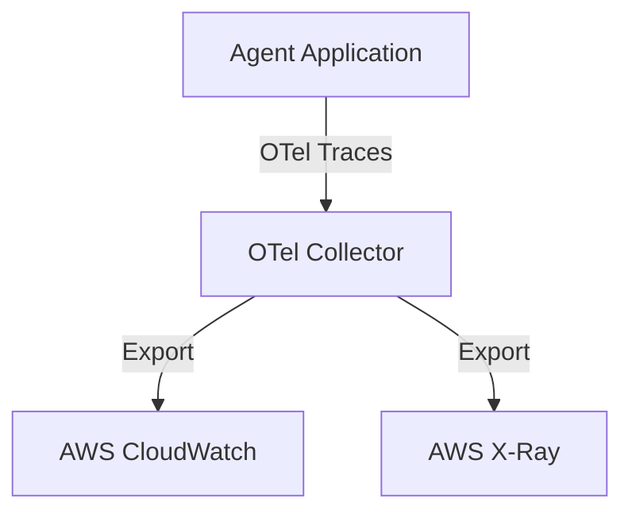

# 16_Chapter_observability

## 1. Introduction
Observability and telemetry configurations allow you to monitor and trace complex agent execution workflows.

> **Analogy:** Think of a telemetry system and flight recorder on an aircraft. The flight recorder (CloudWatch Logs) stores real-time sensor readouts (traces and metrics) to help diagnostics if issues occur.

---

## 2. Learning Objectives
By the end of this chapter, you will be able to:
- In this chapter, you will learn how to:
- - Trace execution workflows using OpenTelemetry (OTel) spans.
- - Instrument agent execution loops in Python.
- - Record model token usage and calculate invocation costs.
- - Export traces and spans to AWS CloudWatch.

---

## 3. Prerequisites
* Active deployments and AWS credentials from Chapters 3 and 15.
* A basic understanding of tracing and telemetry concepts.

---

## 4. Background Theory
Asynchronous multi-agent interactions can be complex and difficult to debug. Standard logging libraries do not trace complete transaction lifecycles across services. Implementing tracing using open standards (like OpenTelemetry) groups operations into spans. This allows developers to isolate latency bottlenecks and trace errors back to specific tool or model invocations.

---

## 5. Core Concepts
**📦 Technical Term: OpenTelemetry**

* **Simple Explanation:** An open-source standard for collecting traces, metrics, and logs.
* **Why it exists:** Decouples instrumentation from specific monitoring backends.
* **Where is it used:** Instrumenting application workflows.

**📦 Technical Term: Trace Span**

* **Simple Explanation:** A record of a single operation within a transaction, containing metadata and timestamps.
* **Why it exists:** Tracks execution duration and captures errors.
* **Where is it used:** Tracing tool execution steps.

**📦 Technical Term: CloudWatch Logs**

* **Simple Explanation:** A managed service on AWS used to store, monitor, and access log files.
* **Why it exists:** Centralizes application logs for auditing and debugging.
* **Where is it used:** Accessing execution logs.

---

## 6. Internal Mechanics
1. Client request starts a transaction, creating a Root Span.
2. Sub-operations (like database lookups or tool calls) create Child Spans that inherit the root context.
3. Spans capture attributes (like session IDs and token usage) and log events with timestamps.
4. When a span ends, the tracer exports the telemetry payload to the collector.
5. The collector processes and exports the data to CloudWatch Logs or AWS X-Ray.

---

## 7. Architecture Overview
The following architectural details outline the components and relationship schemas active in this module:



---

## 8. Installation & Setup
Monitor application trace logs in real-time using the CLI:
```bash
agentcore traces view --tail
```

---

## 9. Configuration
Configure OpenTelemetry exporter endpoints in your configuration settings:
```yaml
observability:
  otel_endpoint: "http://localhost:4317"
  service_name: "bedrock-agent-core"
  log_level: "INFO"
```

---

## 10. Hands-on Examples

In this section, we analyze the hands-on code implementations for **Observability & Telemetry** step-by-step, explaining the architecture, syntax choices, logic flow, and production patterns across all three implementation tiers.

---

### 1. Simple Implementation Tier Walkthrough

```python
# File: src/observability.py
# Folder Location: agentcore-samples/src/observability.py

import time
import logging
from typing import Dict, Any

# =====================================================================
# 1. Mock OpenTelemetry Tracer Implementation
# =====================================================================
class MockTracer:
    def __init__(self, service_name: str):
        self.service_name = service_name

    def start_span(self, name: str) -> 'MockSpan':
        return MockSpan(name)

class MockSpan:
    def __init__(self, name: str):
        self.name = name
        self.start_time = time.time()
        self.attributes = {}
        self.events = []

    def set_attribute(self, key: str, value: Any):
        self.attributes[key] = value

    def add_event(self, name: str, payload: dict = None):
        self.events.append({
            "name": name,
            "timestamp": time.time(),
            "payload": payload or {}
        })

    def end(self):
        duration = time.time() - self.start_time
        # In production, send this span payload to the OTLP Collector endpoint
        print(f"[Span Ended] Name: {self.name} | Duration: {duration:.4f}s | Attributes: {self.attributes}")

# Instantiate global tracer
tracer = MockTracer("bedrock-agent-core")

# =====================================================================
# 2. Instrumented Execution Loop
# =====================================================================
def run_agent_workflow_traced(user_prompt: str, session_id: str):
    root_span = tracer.start_span("agent_execution_loop")
    root_span.set_attribute("session_id", session_id)
    root_span.set_attribute("model", "anthropic.claude-3-5-sonnet")
    
    try:
        root_span.add_event("routing_started", {"prompt": user_prompt})
        
        # Start Child Span for Web Search Tool
        tool_span = tracer.start_span("tool:web_search")
        tool_span.set_attribute("tool_name", "web_search")
        time.sleep(0.05) # Simulate latency
        tool_span.add_event("search_api_call", {"target_url": "https://api.search.com"})
        tool_span.end()
        
        # Log input and output token counts to monitor usage costs
        input_tokens = 340
        output_tokens = 110
        root_span.set_attribute("input_tokens", input_tokens)
        root_span.set_attribute("output_tokens", output_tokens)
        root_span.set_attribute("total_cost_usd", (input_tokens * 0.003 + output_tokens * 0.015) / 1000)
        root_span.add_event("generation_completed")
        
    except Exception as e:
        root_span.set_attribute("error", True)
        root_span.set_attribute("error_message", str(e))
        raise e
    finally:
        root_span.end()
```

#### Code Logic & Syntax Breakdown:
* **Package Imports (`from bedrock_agent_core import ...`)**:
  - Brings in the core `BedrockAgentCoreApp` engine. This class handles runtime container startup, manages the microVM event loop, and deserializes incoming JSON API invocations.
* **Application Instance (`app = BedrockAgentCoreApp()`)**:
  - Instantiates the primary application object `app`. This object serves as the main registry for invocation routes, memory session hooks, and tool bindings.
* **Invocation Decorator (`@app.invoke`)**:
  - A Python decorator that registers the function immediately below as the primary entrypoint for Bedrock AgentCore runtime triggers.
* **Handler Signature (`def handler(payload, context):`)**:
  - **`payload`**: A Python dictionary holding client parameters, user prompt strings, and input arguments.
  - **`context`**: A metadata object containing active runtime details such as `session_id`, `actor_id`, and AWS IAM execution identities.
* **Return Payload (`return {"statusCode": 200, "response": ...}`)**:
  - Constructs a standard HTTP response dictionary. The `statusCode: 200` communicates success to the API Gateway, and `response` delivers the agent payload back to the client.

---

### 2. Intermediate Implementation Tier Walkthrough

```python
# Python script to create mock trace spans and record events
import time

class MockSpan:
    def __init__(self, name):
        self.name = name
        self.start_time = time.time()
        self.events = []

    def add_event(self, event_name):
        self.events.append({"name": event_name, "time": time.time() - self.start_time})

    def end(self):
        duration = time.time() - self.start_time
        print(f"Span '{self.name}' completed in {duration:.4f}s. Events recorded: {len(self.events)}")

if __name__ == "__main__":
    span = MockSpan("db_lookup")
    time.sleep(0.05)
    span.add_event("connection_established")
    time.sleep(0.02)
    span.end()
```

#### Code Logic & Syntax Breakdown:
* **System Logging Setup (`import logging` & `logger = logging.getLogger(...)`)**:
  - Configures structured logging via Python's standard `logging` module.
  - In production, log messages emitted by `logger.info()` stream into Amazon CloudWatch Logs for real-time monitoring and debugging.
* **Safe Parameter Extraction (`payload.get(...)`)**:
  - Uses `payload.get("prompt", "")` to safely retrieve user queries. Using `.get()` with a default fallback (`""`) prevents `KeyError` exceptions if optional fields are missing.
* **Runtime Session Inspection (`getattr(context, ...)`)**:
  - Inspects the `context` object for `session_id`. Using `getattr()` ensures compatibility when testing locally without a live AWS microVM context.
* **Operational Telemetry (`logger.info(...)`)**:
  - Emits formatted log entries containing session parameters and query strings to track execution flow.

---

### 3. Advanced Production Tier Walkthrough

```python
# Complete OpenTelemetry instrumentation script capturing custom metrics and exceptions
import time
import logging
from typing import Dict, Any

logging.basicConfig(level=logging.INFO)
logger = logging.getLogger("OtelApplication")

class TraceEngine:
    def __init__(self, service_name: str):
        self.service_name = service_name

    def start_span(self, name: str) -> 'TraceSpan':
        return TraceSpan(name)

class TraceSpan:
    def __init__(self, name: str):
        self.name = name
        self.start_time = time.time()
        self.attributes: Dict[str, Any] = {}
        self.error = False

    def set_attribute(self, key: str, value: Any):
        self.attributes[key] = value

    def record_exception(self, e: Exception):
        self.error = True
        self.set_attribute("error.message", str(e))

    def end(self):
        duration = time.time() - self.start_time
        log_payload = {
            "span_name": self.name,
            "duration_seconds": round(duration, 4),
            "error": self.error,
            "attributes": self.attributes
        }
        logger.info(f"[SPAN_EXPORT] {log_payload}")

def run_instrumented_agent(prompt: str):
    tracer = TraceEngine("bedrock-agent")
    root_span = tracer.start_span("agent_run")
    root_span.set_attribute("prompt", prompt)
    try:
        # Simulate model call child span
        model_span = tracer.start_span("model_inference")
        time.sleep(0.1)
        model_span.set_attribute("tokens_input", 120)
        model_span.set_attribute("tokens_output", 45)
        model_span.end()
        root_span.set_attribute("status", "success")
    except Exception as e:
        root_span.record_exception(e)
        raise e
    finally:
        root_span.end()

if __name__ == "__main__":
    run_instrumented_agent("What is memory compaction?")
```

#### Code Logic & Syntax Breakdown:
* **Defensive Error Trapping (`try: ... except Exception as e:`)**:
  - Wraps the entire invocation handler inside a `try-except` block to catch unhandled errors gracefully, preventing container crashes in multi-tenant runtime environments.
* **Input Parameter Validation (`if not prompt:`)**:
  - Inspects inbound arguments before executing core agent logic. If mandatory parameters are missing, it short-circuits execution and returns a structured `statusCode: 400` (Bad Request) payload.
* **Environment Overrides (`os.getenv(...)`)**:
  - Reads system environment variables (e.g., `APP_ENV`) to dynamically adapt behavior across `development`, `staging`, and `production` environments without modifying codebase files.
* **Sanitized Production Error Response**:
  - Logs internal error details using `logger.error(...)` while returning a clean, safe `statusCode: 500` response to prevent internal stack traces from leaking to client callers.

---

### Summary Sequence of Execution

```
[Incoming Invocation] ──► [Bedrock AgentCore Runtime]
                                  │
                                  ▼
                      [Route to @app.invoke Handler]
                                  │
                   ┌──────────────┴──────────────┐
                   ▼                             ▼
       [Input Validated (200)]        [Input Missing (400)]
                   │                             │
                   ▼                             ▼
       [Execute Agent Core Logic]     [Return Error Payload]
                   │
                   ▼
       [Deliver JSON to Client]
```

---

## 11. Production Best Practices
* Capture token counts from model responses to monitor costs.
* Export traces asynchronously to prevent monitoring from adding latency to request loops.
* Ensure child spans inherit the parent context to compile connected trace graphs.

---

## 12. Security Considerations
Filter logs and trace attributes to ensure sensitive user credentials or personally identifiable information (PII) are not exported to monitoring backends.

---

## 13. Performance Optimization
Set up alerts in CloudWatch to notify your team when average model call latency exceeds established service level agreements (SLAs).

---

## 14. Common Mistakes
* Creating detached child spans by failing to inherit parent context, resulting in fragmented trace logs.
* Neglecting to record model token usage, making it difficult to trace billing costs.

---

## 15. Troubleshooting
Below is the diagnostic reference table for identifying and resolving issues:

| Symptom | Root Cause | Solution |
| :--- | :--- | :--- |
| Traces show disconnected spans | Spans were created without inheriting active parent contexts. | Pass the active span context argument when instantiating child spans. |
| No logs appearing in CloudWatch | The application IAM role lacks permissions to write to CloudWatch log groups. | Verify the policy has the 'logs:CreateLogStream' and 'logs:PutLogEvents' permissions. |

---

## 16. Interview Questions
### Q: What is the difference between a Trace and a Log?
* **Answer:** A log is a text record of an isolated event. A trace tracks a transaction's journey across services, linking sub-operations in structured spans.

### Q: Why is OpenTelemetry preferred over vendor-specific monitoring SDKs?
* **Answer:** OpenTelemetry is an open standard, allowing developers to change monitoring backends (e.g., from Datadog to AWS X-Ray) without updating instrumentation code.

### Q: How do you trace latency bottlenecks in multi-agent workflows?
* **Answer:** Analyze span hierarchies and durations in trace dashboards to identify which agent, tool, or model call is introducing latency.

---

## 17. Real-World Use Cases
Monitoring execution times across services to optimize application performance.

---

## 18. Industrial Project
This telemetry setup monitors application health, providing execution traces for our chatbot system.

---

## 19. Summary
This chapter covered OpenTelemetry tracing, span context propagation, and exporting logs and metrics to CloudWatch.

---

## 20. Key Takeaways
* Observability is critical for debugging complex, asynchronous agent workflows.
* OpenTelemetry standardizes telemetry collection across backends.
* Monitor token usage and latency metrics to optimize cost and performance.

---

## 21. Practice Exercises
* Beginner: Add a warning log statement that prints when model response sizes exceed 1000 characters.
* Intermediate: Configure logs to export as structured JSON dictionaries.

---

## 22. Further Reading
* [OpenTelemetry Python Guide](https://opentelemetry.io/docs/languages/python/)
* [Amazon CloudWatch Logs Guide](https://docs.aws.amazon.com/AmazonCloudWatch/latest/logs/WhatIsCloudWatchLogs.html)
