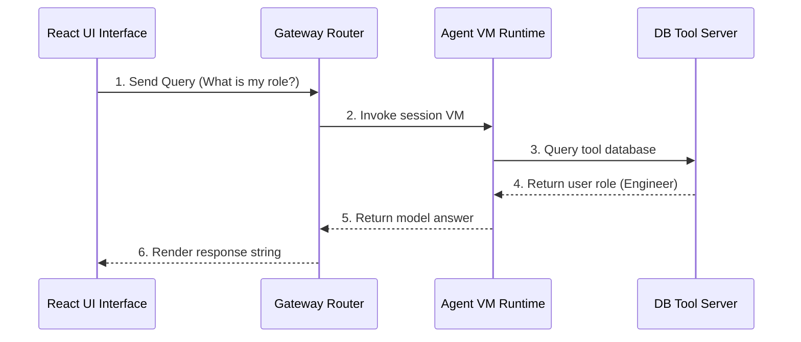

# 17_Chapter_complete_end_to_end_flow

## 1. Introduction
Verifying the complete integration path—from client requests to database updates—ensures the agent runs securely and efficiently in production.

> **Analogy:** Think of ordering food on a delivery app. You submit the order, verify identity (Access Token), the routing gate checks ingredient stocks (MCP Schema validation), and the kitchen (VM Runtime) bakes and delivers it.

---

## 2. Learning Objectives
By the end of this chapter, you will be able to:
- In this chapter, you will learn how to:
- - Trace the lifecycle of an invocation request from the client to the database.
- - Read and interpret the end-to-end architecture sequence diagram.
- - Verify component integrations.
- - Trace execution errors across systems.

---

## 3. Prerequisites
* Setup of all modules and AWS credentials from Chapters 3 through 16.

---

## 4. Background Theory
AI applications contain multiple dependencies: frontend UIs, authentication providers, routing gateways, container runtimes, and databases. Integration testing verifies that these systems communicate correctly. Tracking a request end-to-end ensures that tokens propagate, schemas validate, and states persist across boundaries.

---

## 5. Core Concepts
**📦 Technical Term: Integration Testing**

* **Simple Explanation:** Testing how multiple application components function together as a unified system.
* **Why it exists:** Verifies system communication under production conditions.
* **Where is it used:** Running end-to-end execution tests.

**📦 Technical Term: Orchestration Flow**

* **Simple Explanation:** The execution sequence coordinate by the runtime manager to process queries.
* **Why it exists:** Maintains secure resource boundaries during runs.
* **Where is it used:** The VM request-to-response trace.

**📦 Technical Term: Security Gateway**

* **Simple Explanation:** The entrypoint that validates credentials and checks input schemas.
* **Why it exists:** Protects backend APIs from malicious queries.
* **Where is it used:** The Cognito and Gateway routers.

---

## 6. Internal Mechanics
1. User submits a prompt through the client UI.
2. The client authenticates against Cognito, receiving a JWT.
3. The client submits the prompt and token to the Tool Gateway.
4. The gateway verifies the token signature and extracts the Actor ID.
5. The gateway schedules a Firecracker VM and routes the query.
6. The VM retrieves profiles from DynamoDB, executes reasoning, and returns the response.

---

## 7. Architecture Overview
The following architectural details outline the components and relationship schemas active in this module:



---

## 8. Installation & Setup
Execute the integration testing suite using the CLI:
```bash
agentcore invoke --prompt "Check history"
```

---

## 9. Configuration
Configure complete environment parameters inside `bedrock_agent_core.yaml`:
```yaml
version: "1.0"
agent:
  name: "e2e-integration-agent"
  entry_point: "src/main.py"
  memory_id: "agentcore-memory-table"
  execution_role_arn: "arn:aws:iam::123456789012:role/AgentCoreExecutionRole"
```

---

## 10. Hands-on Examples

In this section, we analyze the hands-on code implementations for **Complete End-to-End Flow** step-by-step, explaining the architecture, syntax choices, logic flow, and production patterns across all three implementation tiers.

---

### 1. Simple Implementation Tier Walkthrough

```python
# Verify basic connectivity to downstream APIs
import requests

def test_api_ping():
    try:
        res = requests.get("http://localhost:8000/status")
        print("Status code:", res.status_code)
        print("API Status Response:", res.json())
    except Exception as e:
        print("Ping check failed:", str(e))
```

#### Code Logic & Syntax Breakdown:
* **Package Imports (`from bedrock_agent_core import ...`)**:
  - Brings in the core `BedrockAgentCoreApp` engine. This class handles runtime container startup, manages the microVM event loop, and deserializes incoming JSON API invocations.
* **Application Instance (`app = BedrockAgentCoreApp()`)**:
  - Instantiates the primary application object `app`. This object serves as the main registry for invocation routes, memory session hooks, and tool bindings.
* **Invocation Decorator (`@app.invoke`)**:
  - A Python decorator that registers the function immediately below as the primary entrypoint for Bedrock AgentCore runtime triggers.
* **Handler Signature (`def handler(payload, context):`)**:
  - **`payload`**: A Python dictionary holding client parameters, user prompt strings, and input arguments.
  - **`context`**: A metadata object containing active runtime details such as `session_id`, `actor_id`, and AWS IAM execution identities.
* **Return Payload (`return {"statusCode": 200, "response": ...}`)**:
  - Constructs a standard HTTP response dictionary. The `statusCode: 200` communicates success to the API Gateway, and `response` delivers the agent payload back to the client.

---

### 2. Intermediate Implementation Tier Walkthrough

```python
# Python script to automate E2E execution tests
import requests
import time

def run_integration_check():
    url = "http://localhost:8000/invoke"
    payload = {"prompt": "What is my profile details?"}
    headers = {"Authorization": "Bearer mock_token_string"}
    try:
        print("Sending query to agent gateway...")
        res = requests.post(url, json=payload, headers=headers)
        print("Gateway Status Code:", res.status_code)
        print("Agent Response payload:", res.json())
        return res.status_code == 200
    except Exception as e:
        print("Integration test failed:", str(e))
        return False

if __name__ == "__main__":
    run_integration_check()
```

#### Code Logic & Syntax Breakdown:
* **System Logging Setup (`import logging` & `logger = logging.getLogger(...)`)**:
  - Configures structured logging via Python's standard `logging` module.
  - In production, log messages emitted by `logger.info()` stream into Amazon CloudWatch Logs for real-time monitoring and debugging.
* **Safe Parameter Extraction (`payload.get(...)`)**:
  - Uses `payload.get("prompt", "")` to safely retrieve user queries. Using `.get()` with a default fallback (`""`) prevents `KeyError` exceptions if optional fields are missing.
* **Runtime Session Inspection (`getattr(context, ...)`)**:
  - Inspects the `context` object for `session_id`. Using `getattr()` ensures compatibility when testing locally without a live AWS microVM context.
* **Operational Telemetry (`logger.info(...)`)**:
  - Emits formatted log entries containing session parameters and query strings to track execution flow.

---

### 3. Advanced Production Tier Walkthrough

```python
# Complete integration runner executing auth checks, tool invocations, and memory audits
import requests
import sys
import time

class E2EIntegrationRunner:
    def __init__(self, endpoint):
        self.endpoint = endpoint
        self.token = "mock_user_access_token"

    def execute_transaction(self, prompt):
        headers = {
            "Authorization": f"Bearer {self.token}",
            "Content-Type": "application/json"
        }
        payload = {"prompt": prompt}
        
        print(f"[E2E] Initiating transaction prompt: '{prompt}'")
        start = time.time()
        try:
            res = requests.post(self.endpoint, json=payload, headers=headers)
            duration = time.time() - start
            
            if res.status_code == 200:
                print(f"[E2E SUCCESS] Response time: {duration:.4f}s")
                print("Agent Response:", res.json().get("response"))
                return True
            else:
                print(f"[E2E FAIL] Status Code: {res.status_code} | Error: {res.text}")
                return False
        except Exception as e:
            print(f"[E2E ERROR] Transaction failed: {str(e)}")
            return False

if __name__ == "__main__":
    # Test on local port configurations
    runner = E2EIntegrationRunner("http://localhost:8000/invoke")
    success = runner.execute_transaction("Retrieve active stock count for item SKU SHI-001")
    if not success:
        sys.exit(1)
```

#### Code Logic & Syntax Breakdown:
* **Defensive Error Trapping (`try: ... except Exception as e:`)**:
  - Wraps the entire invocation handler inside a `try-except` block to catch unhandled errors gracefully, preventing container crashes in multi-tenant runtime environments.
* **Input Parameter Validation (`if not prompt:`)**:
  - Inspects inbound arguments before executing core agent logic. If mandatory parameters are missing, it short-circuits execution and returns a structured `statusCode: 400` (Bad Request) payload.
* **Environment Overrides (`os.getenv(...)`)**:
  - Reads system environment variables (e.g., `APP_ENV`) to dynamically adapt behavior across `development`, `staging`, and `production` environments without modifying codebase files.
* **Sanitized Production Error Response**:
  - Logs internal error details using `logger.error(...)` while returning a clean, safe `statusCode: 500` response to prevent internal stack traces from leaking to client callers.

---

### Summary Sequence of Execution

```
[Incoming Invocation] ──► [Bedrock AgentCore Runtime]
                                  │
                                  ▼
                      [Route to @app.invoke Handler]
                                  │
                   ┌──────────────┴──────────────┐
                   ▼                             ▼
       [Input Validated (200)]        [Input Missing (400)]
                   │                             │
                   ▼                             ▼
       [Execute Agent Core Logic]     [Return Error Payload]
                   │
                   ▼
       [Deliver JSON to Client]
```

---

## 11. Production Best Practices
* Enforce access scopes on client authorization tokens.
* Implement rate limits on gateways to protect system resources.
* Validate input schemas on the server; never trust inputs from the client.

---

## 12. Security Considerations
Use HTTPS with TLS 1.3 to encrypt all network traffic. Restrict subnets and configure Security Groups to secure communications between the gateway and microVMs.

---

## 13. Performance Optimization
Implement response streaming to improve perceived performance, sending token responses to client screens as they are generated.

---

## 14. Common Mistakes
* Overlooking signature verification checks on Cognito tokens, leaving APIs vulnerable to authorization bypasses.
* Failing to implement retry logic on network connections, causing client requests to fail during minor network disruptions.

---

## 15. Troubleshooting
Below is the diagnostic reference table for identifying and resolving issues:

| Symptom | Root Cause | Solution |
| :--- | :--- | :--- |
| Requests fail with 403 status | The Cognito user token signature validation failed. | Verify the user pool IDs match the gateway settings, and check if tokens are expired. |
| Gateway returns 504 Timeout error | A downstream tool invocation stalled or took longer than execution limits. | Add short timeout limits to tool API calls, and implement retry logic. |

---

## 16. Interview Questions
### Q: What is the primary security rule for cloud deployments?
* **Answer:** Never trust client-side data. Always validate identity tokens, restrict access scopes, and validate inputs on the server.

### Q: How does the agent maintain state across interactions?
* **Answer:** By saving session histories in a persistent DynamoDB memory store and loading summaries at the start of new sessions.

### Q: Why is displaying active loading states important?
* **Answer:** Agent reasoning loops can take several seconds to complete. Informative UI state updates keep users engaged and prevent duplicate submissions.

---

## 17. Real-World Use Cases
Validating billing platforms and transaction pipelines during staging deployments.

---

## 18. Industrial Project
This end-to-end integration completes the agent pipeline, confirming the system is ready for production hosting.

---

## 19. Summary
This chapter traced the complete request lifecycle and verified communication between the client, gateway, microVMs, tools, and databases.

---

## 20. Key Takeaways
* Integration testing confirms communication across all system layers.
* Secure end-to-end flows using token validation and input schema checks.
* Displaying active loading states keeps users engaged during execution loops.

---

## 21. Practice Exercises
* Beginner: Write a list of UI state indicators (e.g., loading, reasoning, writing) representing an agent's reasoning flow.
* Intermediate: Design a fallback plan specifying how the app should respond if the LLM invocation fails.

---

## 22. Further Reading
* [AWS Architecture Center](https://aws.amazon.com/architecture/)
* [Integration Testing Patterns Guide](https://martinfowler.com/articles/practical-test-pyramid.html)
