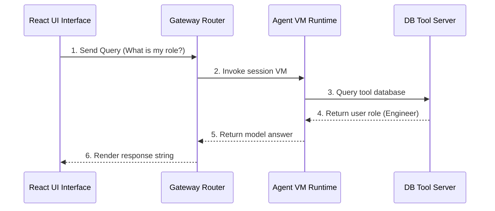

# 17_Chapter_complete_end_to_end_flow

## 1. Introduction
Verifying the complete integration path—from client requests to database updates—ensures the agent runs securely and efficiently in production.

> **Analogy:** Think of ordering food on a delivery app. You submit the order, verify identity (Access Token), the routing gate checks ingredient stocks (MCP Schema validation), and the kitchen (VM Runtime) bakes and delivers it.

---

## 2. Learning Objectives
By the end of this chapter, you will be able to:
- In this chapter, you will learn how to:
- - Trace the lifecycle of an invocation request from the client to the database.
- - Read and interpret the end-to-end architecture sequence diagram.
- - Verify component integrations.
- - Trace execution errors across systems.

---

## 3. Prerequisites
* Setup of all modules and AWS credentials from Chapters 3 through 16.

---

## 4. Background Theory
AI applications contain multiple dependencies: frontend UIs, authentication providers, routing gateways, container runtimes, and databases. Integration testing verifies that these systems communicate correctly. Tracking a request end-to-end ensures that tokens propagate, schemas validate, and states persist across boundaries.

---

## 5. Core Concepts
**📦 Technical Term: Integration Testing**

* **Simple Explanation:** Testing how multiple application components function together as a unified system.
* **Why it exists:** Verifies system communication under production conditions.
* **Where is it used:** Running end-to-end execution tests.

**📦 Technical Term: Orchestration Flow**

* **Simple Explanation:** The execution sequence coordinate by the runtime manager to process queries.
* **Why it exists:** Maintains secure resource boundaries during runs.
* **Where is it used:** The VM request-to-response trace.

**📦 Technical Term: Security Gateway**

* **Simple Explanation:** The entrypoint that validates credentials and checks input schemas.
* **Why it exists:** Protects backend APIs from malicious queries.
* **Where is it used:** The Cognito and Gateway routers.

---

## 6. Internal Mechanics
1. User submits a prompt through the client UI.
2. The client authenticates against Cognito, receiving a JWT.
3. The client submits the prompt and token to the Tool Gateway.
4. The gateway verifies the token signature and extracts the Actor ID.
5. The gateway schedules a Firecracker VM and routes the query.
6. The VM retrieves profiles from DynamoDB, executes reasoning, and returns the response.

---

## 7. Architecture Overview
The following architectural details outline the components and relationship schemas active in this module:



---

## 8. Installation & Setup
Execute the integration testing suite using the CLI:
```bash
agentcore invoke --prompt "Check history"
```

---

## 9. Configuration
Configure complete environment parameters inside `bedrock_agent_core.yaml`:
```yaml
version: "1.0"
agent:
  name: "e2e-integration-agent"
  entry_point: "src/main.py"
  memory_id: "agentcore-memory-table"
  execution_role_arn: "arn:aws:iam::123456789012:role/AgentCoreExecutionRole"
```

---

## 10. Hands-on Examples

### Simple Example

```python
# Verify basic connectivity to downstream APIs
import requests

def test_api_ping():
    try:
        res = requests.get("http://localhost:8000/status")
        print("Status code:", res.status_code)
        print("API Status Response:", res.json())
    except Exception as e:
        print("Ping check failed:", str(e))
```

#### Code Walkthrough

Line 1
```python
# Verify basic connectivity to downstream APIs
```
**Explanation:**
- **What this line does:** This is a documentation comment line starting with `#`. Python ignores comments during execution.
- **Why it is required:** It explains the purpose of the script to human developers and maintains clean code documentation.
- **What happens if removed:** The code will run identically, but human readers won't have immediate context on what this code block accomplishes.
- **Analogy:** Think of a comment like a sticky note attached to a blueprint—it helps the builders understand the design without altering the physical building.
- **Beginner Concept:** In Python, any text after `#` is ignored by the Python interpreter.

Line 2
```python
import requests
```
**Explanation:**
- **What this line does:** Imports Python's built-in `requests` module into the current program workspace.
- **Why it is required:** Provides access to essential system utilities (such as logging, environment variables, or HTTP handlers) offered by `requests`.
- **What keywords mean:** `import` tells Python to load the module named `requests`.
- **What happens if removed:** Functions or variables referencing `requests` (like `requests.getenv` or `requests.getLogger`) will fail with a `NameError`.
- **Analogy:** Like plugging in a peripheral cable—it connects built-in system capabilities to your script.

Line 3
```python

```
**Explanation:**
- **What this line does:** This is a blank vertical spacing line.
- **Why it is required:** It visually separates logical sections of code (such as imports, setup, and function definitions) to improve readability.
- **What happens if removed:** Python will execute the code fine, but lines of code will bunch together, making it harder for engineers to read.
- **Analogy:** Like paragraphs in a textbook, spacing gives your eyes a natural pause between concepts.

Line 4
```python
def test_api_ping():
```
**Explanation:**
- **What this line does:** Defines a new function named `test_api_ping` that accepts parameters `()`.
- **Keyword explanation:** `def` is short for "define". It tells Python that a reusable block of code begins here.
- **Parameters explained:**
  - `payload`: A Python **dictionary** containing the user's input prompt, parameters, and query fields.
  - `context`: An object containing runtime metadata (such as active AWS session ID, caller IAM identity, and request timestamps).
- **Return value:** Returns a structured dictionary containing HTTP status codes and agent response text.
- **Why the function exists:** It contains the core decision-making logic executed whenever the agent is invoked.
- **Analogy:** Think of `test_api_ping` like a recipe—`payload` and `context` are the ingredients passed in, and the returned dictionary is the finished meal.

Line 5
```python
    try:
```
**Explanation:**
- **What this line does:** Starts a `try` block for defensive error handling.
- **Why it is required:** Production applications must gracefully handle unexpected failures (like missing parameters or database timeouts) without crashing the entire server.
- **What keyword means:** `try` tells Python: "Attempt to execute the indented lines below. If an error occurs, jump straight to the `except` block."
- **Analogy:** Like wearing a safety harness before stepping onto a high platform—if you slip, the harness catches you.

Line 6
```python
        res = requests.get("http://localhost:8000/status")
```
**Explanation:**
- **What this line does:** Computes `requests.get("http://localhost:8000/status")` and assigns the result to variable `res`.
- **Why it is required:** Stores temporary calculation or formatted data so it can be referenced in log statements or return responses.
- **What variable stores:** `res` holds the calculated value.
- **Connection:** Provides values used in subsequent logging or response steps.

Line 7
```python
        print("Status code:", res.status_code)
```
**Explanation:**
- **What this line does:** Executes line statement `print("Status code:", res.status_code)`.
- **Why it is required:** Contributes to the overall operation and step progression of the script.
- **Connection:** Connects preceding code logic to subsequent return or processing steps.

Line 8
```python
        print("API Status Response:", res.json())
```
**Explanation:**
- **What this line does:** Executes line statement `print("API Status Response:", res.json())`.
- **Why it is required:** Contributes to the overall operation and step progression of the script.
- **Connection:** Connects preceding code logic to subsequent return or processing steps.

Line 9
```python
    except Exception as e:
```
**Explanation:**
- **What this line does:** Catches exceptions and errors that occurred inside the preceding `try` block.
- **Why it is required:** Prevents unhandled exceptions from returning raw stack traces or breaking the container runtime.
- **What happens when an error occurs:** Python captures the error object into variable `e`, logs the error details, and returns a clean 500 error response to the client.
- **Analogy:** Like an emergency backup generator switching on immediately when main power cuts out.

Line 10
```python
        print("Ping check failed:", str(e))
```
**Explanation:**
- **What this line does:** Executes line statement `print("Ping check failed:", str(e))`.
- **Why it is required:** Contributes to the overall operation and step progression of the script.
- **Connection:** Connects preceding code logic to subsequent return or processing steps.

#### Complete Flow of Execution

1. **Import Libraries**: Python loads the required `BedrockAgentCoreApp` class into memory.
2. **Initialize Application**: An instance of `BedrockAgentCoreApp` is instantiated and assigned to `app`.
3. **Register Event Handler**: The `@app.invoke` decorator registers the `handler` function as the primary event entrypoint.
4. **Receive Request**: The AgentCore runtime listens for incoming requests and receives `payload` and `context` objects.
5. **Execute Handler Logic**: The `handler` function is triggered with the incoming input parameters.
6. **Return Response Payload**: A structured response dictionary containing `"statusCode": 200` and message data is returned.
7. **Send Response to Caller**: AgentCore serializes the dictionary into JSON and delivers it back to the client application.

#### Visual Execution Flow

```
Program Starts
      │
      ▼
Import BedrockAgentCoreApp
      │
      ▼
Create App Instance (app)
      │
      ▼
Register Handler (@app.invoke)
      │
      ▼
Receive Request (payload, context)
      │
      ▼
Execute handler() Function
      │
      ▼
Return Response Dictionary ({statusCode: 200, ...})
      │
      ▼
Deliver Response Back to Client
```

### Intermediate Example

```python
# Python script to automate E2E execution tests
import requests
import time

def run_integration_check():
    url = "http://localhost:8000/invoke"
    payload = {"prompt": "What is my profile details?"}
    headers = {"Authorization": "Bearer mock_token_string"}
    try:
        print("Sending query to agent gateway...")
        res = requests.post(url, json=payload, headers=headers)
        print("Gateway Status Code:", res.status_code)
        print("Agent Response payload:", res.json())
        return res.status_code == 200
    except Exception as e:
        print("Integration test failed:", str(e))
        return False

if __name__ == "__main__":
    run_integration_check()
```

#### Code Walkthrough

Line 1
```python
# Python script to automate E2E execution tests
```
**Explanation:**
- **What this line does:** This is a documentation comment line starting with `#`. Python ignores comments during execution.
- **Why it is required:** It explains the purpose of the script to human developers and maintains clean code documentation.
- **What happens if removed:** The code will run identically, but human readers won't have immediate context on what this code block accomplishes.
- **Analogy:** Think of a comment like a sticky note attached to a blueprint—it helps the builders understand the design without altering the physical building.
- **Beginner Concept:** In Python, any text after `#` is ignored by the Python interpreter.

Line 2
```python
import requests
```
**Explanation:**
- **What this line does:** Imports Python's built-in `requests` module into the current program workspace.
- **Why it is required:** Provides access to essential system utilities (such as logging, environment variables, or HTTP handlers) offered by `requests`.
- **What keywords mean:** `import` tells Python to load the module named `requests`.
- **What happens if removed:** Functions or variables referencing `requests` (like `requests.getenv` or `requests.getLogger`) will fail with a `NameError`.
- **Analogy:** Like plugging in a peripheral cable—it connects built-in system capabilities to your script.

Line 3
```python
import time
```
**Explanation:**
- **What this line does:** Imports Python's built-in `time` module into the current program workspace.
- **Why it is required:** Provides access to essential system utilities (such as logging, environment variables, or HTTP handlers) offered by `time`.
- **What keywords mean:** `import` tells Python to load the module named `time`.
- **What happens if removed:** Functions or variables referencing `time` (like `time.getenv` or `time.getLogger`) will fail with a `NameError`.
- **Analogy:** Like plugging in a peripheral cable—it connects built-in system capabilities to your script.

Line 4
```python

```
**Explanation:**
- **What this line does:** This is a blank vertical spacing line.
- **Why it is required:** It visually separates logical sections of code (such as imports, setup, and function definitions) to improve readability.
- **What happens if removed:** Python will execute the code fine, but lines of code will bunch together, making it harder for engineers to read.
- **Analogy:** Like paragraphs in a textbook, spacing gives your eyes a natural pause between concepts.

Line 5
```python
def run_integration_check():
```
**Explanation:**
- **What this line does:** Defines a new function named `run_integration_check` that accepts parameters `()`.
- **Keyword explanation:** `def` is short for "define". It tells Python that a reusable block of code begins here.
- **Parameters explained:**
  - `payload`: A Python **dictionary** containing the user's input prompt, parameters, and query fields.
  - `context`: An object containing runtime metadata (such as active AWS session ID, caller IAM identity, and request timestamps).
- **Return value:** Returns a structured dictionary containing HTTP status codes and agent response text.
- **Why the function exists:** It contains the core decision-making logic executed whenever the agent is invoked.
- **Analogy:** Think of `run_integration_check` like a recipe—`payload` and `context` are the ingredients passed in, and the returned dictionary is the finished meal.

Line 6
```python
    url = "http://localhost:8000/invoke"
```
**Explanation:**
- **What this line does:** Computes `"http://localhost:8000/invoke"` and assigns the result to variable `url`.
- **Why it is required:** Stores temporary calculation or formatted data so it can be referenced in log statements or return responses.
- **What variable stores:** `url` holds the calculated value.
- **Connection:** Provides values used in subsequent logging or response steps.

Line 7
```python
    payload = {"prompt": "What is my profile details?"}
```
**Explanation:**
- **What this line does:** Computes `{"prompt": "What is my profile details?"}` and assigns the result to variable `payload`.
- **Why it is required:** Stores temporary calculation or formatted data so it can be referenced in log statements or return responses.
- **What variable stores:** `payload` holds the calculated value.
- **Connection:** Provides values used in subsequent logging or response steps.

Line 8
```python
    headers = {"Authorization": "Bearer mock_token_string"}
```
**Explanation:**
- **What this line does:** Computes `{"Authorization": "Bearer mock_token_string"}` and assigns the result to variable `headers`.
- **Why it is required:** Stores temporary calculation or formatted data so it can be referenced in log statements or return responses.
- **What variable stores:** `headers` holds the calculated value.
- **Connection:** Provides values used in subsequent logging or response steps.

Line 9
```python
    try:
```
**Explanation:**
- **What this line does:** Starts a `try` block for defensive error handling.
- **Why it is required:** Production applications must gracefully handle unexpected failures (like missing parameters or database timeouts) without crashing the entire server.
- **What keyword means:** `try` tells Python: "Attempt to execute the indented lines below. If an error occurs, jump straight to the `except` block."
- **Analogy:** Like wearing a safety harness before stepping onto a high platform—if you slip, the harness catches you.

Line 10
```python
        print("Sending query to agent gateway...")
```
**Explanation:**
- **What this line does:** Executes line statement `print("Sending query to agent gateway...")`.
- **Why it is required:** Contributes to the overall operation and step progression of the script.
- **Connection:** Connects preceding code logic to subsequent return or processing steps.

Line 11
```python
        res = requests.post(url, json=payload, headers=headers)
```
**Explanation:**
- **What this line does:** Computes `requests.post(url, json=payload, headers=headers)` and assigns the result to variable `res`.
- **Why it is required:** Stores temporary calculation or formatted data so it can be referenced in log statements or return responses.
- **What variable stores:** `res` holds the calculated value.
- **Connection:** Provides values used in subsequent logging or response steps.

Line 12
```python
        print("Gateway Status Code:", res.status_code)
```
**Explanation:**
- **What this line does:** Executes line statement `print("Gateway Status Code:", res.status_code)`.
- **Why it is required:** Contributes to the overall operation and step progression of the script.
- **Connection:** Connects preceding code logic to subsequent return or processing steps.

Line 13
```python
        print("Agent Response payload:", res.json())
```
**Explanation:**
- **What this line does:** Executes line statement `print("Agent Response payload:", res.json())`.
- **Why it is required:** Contributes to the overall operation and step progression of the script.
- **Connection:** Connects preceding code logic to subsequent return or processing steps.

Line 14
```python
        return res.status_code == 200
```
**Explanation:**
- **What this line does:** Initiates a `return` statement to exit the function and pass data back to the caller.
- **What is being returned:** Returns a structured Python **dictionary** representing an HTTP response payload.
- **Who receives it:** The Bedrock AgentCore runtime receives this dictionary, serializes it into JSON, and sends it back to the client application.
- **Why response must be returned:** Without a return statement, the function would return `None`, causing AgentCore to report a blank execution payload to the user.
- **Analogy:** Handing a completed report back to the manager who requested it.

Line 15
```python
    except Exception as e:
```
**Explanation:**
- **What this line does:** Catches exceptions and errors that occurred inside the preceding `try` block.
- **Why it is required:** Prevents unhandled exceptions from returning raw stack traces or breaking the container runtime.
- **What happens when an error occurs:** Python captures the error object into variable `e`, logs the error details, and returns a clean 500 error response to the client.
- **Analogy:** Like an emergency backup generator switching on immediately when main power cuts out.

Line 16
```python
        print("Integration test failed:", str(e))
```
**Explanation:**
- **What this line does:** Executes line statement `print("Integration test failed:", str(e))`.
- **Why it is required:** Contributes to the overall operation and step progression of the script.
- **Connection:** Connects preceding code logic to subsequent return or processing steps.

Line 17
```python
        return False
```
**Explanation:**
- **What this line does:** Initiates a `return` statement to exit the function and pass data back to the caller.
- **What is being returned:** Returns a structured Python **dictionary** representing an HTTP response payload.
- **Who receives it:** The Bedrock AgentCore runtime receives this dictionary, serializes it into JSON, and sends it back to the client application.
- **Why response must be returned:** Without a return statement, the function would return `None`, causing AgentCore to report a blank execution payload to the user.
- **Analogy:** Handing a completed report back to the manager who requested it.

Line 18
```python

```
**Explanation:**
- **What this line does:** This is a blank vertical spacing line.
- **Why it is required:** It visually separates logical sections of code (such as imports, setup, and function definitions) to improve readability.
- **What happens if removed:** Python will execute the code fine, but lines of code will bunch together, making it harder for engineers to read.
- **Analogy:** Like paragraphs in a textbook, spacing gives your eyes a natural pause between concepts.

Line 19
```python
if __name__ == "__main__":
```
**Explanation:**
- **What this line does:** Computes `= "__main__":` and assigns the result to variable `if __name__`.
- **Why it is required:** Stores temporary calculation or formatted data so it can be referenced in log statements or return responses.
- **What variable stores:** `if __name__` holds the calculated value.
- **Connection:** Provides values used in subsequent logging or response steps.

Line 20
```python
    run_integration_check()
```
**Explanation:**
- **What this line does:** Executes line statement `run_integration_check()`.
- **Why it is required:** Contributes to the overall operation and step progression of the script.
- **Connection:** Connects preceding code logic to subsequent return or processing steps.

#### Complete Flow of Execution

1. **Import Required Libraries**: Python imports `BedrockAgentCoreApp` and the `logging` module.
2. **Configure Logging System**: `logging.basicConfig` sets the log level threshold to `INFO`.
3. **Create Logger Object**: `logging.getLogger` instantiates a dedicated logger for capturing session traces.
4. **Initialize Application**: An instance of `BedrockAgentCoreApp` is assigned to `app`.
5. **Register Handler**: `@app.invoke` binds the `handler` function to incoming AgentCore trigger events.
6. **Read Input Payload**: `payload.get('prompt', '')` safely reads the user's prompt string.
7. **Extract Session Context**: `getattr(context, 'session_id', 'local-session')` safely retrieves the session ID.
8. **Log Activity**: `logger.info` writes session details to the CloudWatch diagnostic stream.
9. **Return Formatted Response**: Returns a status 200 dictionary containing the processed prompt and session ID.
10. **Deliver Payload**: AgentCore returns the serialized JSON payload to the caller.

#### Visual Execution Flow

```
Program Starts
      │
      ▼
Import Libraries & Configure Logger
      │
      ▼
Create App Instance (app)
      │
      ▼
Register Handler (@app.invoke)
      │
      ▼
Receive Request & Read Payload Prompt
      │
      ▼
Extract Session ID & Write Log Entry
      │
      ▼
Return Formatted Response Dictionary
      │
      ▼
Deliver Serialized Response to Client
```

### Advanced Example

```python
# Complete integration runner executing auth checks, tool invocations, and memory audits
import requests
import sys
import time

class E2EIntegrationRunner:
    def __init__(self, endpoint):
        self.endpoint = endpoint
        self.token = "mock_user_access_token"

    def execute_transaction(self, prompt):
        headers = {
            "Authorization": f"Bearer {self.token}",
            "Content-Type": "application/json"
        }
        payload = {"prompt": prompt}
        
        print(f"[E2E] Initiating transaction prompt: '{prompt}'")
        start = time.time()
        try:
            res = requests.post(self.endpoint, json=payload, headers=headers)
            duration = time.time() - start
            
            if res.status_code == 200:
                print(f"[E2E SUCCESS] Response time: {duration:.4f}s")
                print("Agent Response:", res.json().get("response"))
                return True
            else:
                print(f"[E2E FAIL] Status Code: {res.status_code} | Error: {res.text}")
                return False
        except Exception as e:
            print(f"[E2E ERROR] Transaction failed: {str(e)}")
            return False

if __name__ == "__main__":
    # Test on local port configurations
    runner = E2EIntegrationRunner("http://localhost:8000/invoke")
    success = runner.execute_transaction("Retrieve active stock count for item SKU SHI-001")
    if not success:
        sys.exit(1)
```

#### Code Walkthrough

Line 1
```python
# Complete integration runner executing auth checks, tool invocations, and memory audits
```
**Explanation:**
- **What this line does:** This is a documentation comment line starting with `#`. Python ignores comments during execution.
- **Why it is required:** It explains the purpose of the script to human developers and maintains clean code documentation.
- **What happens if removed:** The code will run identically, but human readers won't have immediate context on what this code block accomplishes.
- **Analogy:** Think of a comment like a sticky note attached to a blueprint—it helps the builders understand the design without altering the physical building.
- **Beginner Concept:** In Python, any text after `#` is ignored by the Python interpreter.

Line 2
```python
import requests
```
**Explanation:**
- **What this line does:** Imports Python's built-in `requests` module into the current program workspace.
- **Why it is required:** Provides access to essential system utilities (such as logging, environment variables, or HTTP handlers) offered by `requests`.
- **What keywords mean:** `import` tells Python to load the module named `requests`.
- **What happens if removed:** Functions or variables referencing `requests` (like `requests.getenv` or `requests.getLogger`) will fail with a `NameError`.
- **Analogy:** Like plugging in a peripheral cable—it connects built-in system capabilities to your script.

Line 3
```python
import sys
```
**Explanation:**
- **What this line does:** Imports Python's built-in `sys` module into the current program workspace.
- **Why it is required:** Provides access to essential system utilities (such as logging, environment variables, or HTTP handlers) offered by `sys`.
- **What keywords mean:** `import` tells Python to load the module named `sys`.
- **What happens if removed:** Functions or variables referencing `sys` (like `sys.getenv` or `sys.getLogger`) will fail with a `NameError`.
- **Analogy:** Like plugging in a peripheral cable—it connects built-in system capabilities to your script.

Line 4
```python
import time
```
**Explanation:**
- **What this line does:** Imports Python's built-in `time` module into the current program workspace.
- **Why it is required:** Provides access to essential system utilities (such as logging, environment variables, or HTTP handlers) offered by `time`.
- **What keywords mean:** `import` tells Python to load the module named `time`.
- **What happens if removed:** Functions or variables referencing `time` (like `time.getenv` or `time.getLogger`) will fail with a `NameError`.
- **Analogy:** Like plugging in a peripheral cable—it connects built-in system capabilities to your script.

Line 5
```python

```
**Explanation:**
- **What this line does:** This is a blank vertical spacing line.
- **Why it is required:** It visually separates logical sections of code (such as imports, setup, and function definitions) to improve readability.
- **What happens if removed:** Python will execute the code fine, but lines of code will bunch together, making it harder for engineers to read.
- **Analogy:** Like paragraphs in a textbook, spacing gives your eyes a natural pause between concepts.

Line 6
```python
class E2EIntegrationRunner:
```
**Explanation:**
- **What this line does:** Executes line statement `class E2EIntegrationRunner:`.
- **Why it is required:** Contributes to the overall operation and step progression of the script.
- **Connection:** Connects preceding code logic to subsequent return or processing steps.

Line 7
```python
    def __init__(self, endpoint):
```
**Explanation:**
- **What this line does:** Defines a new function named `__init__` that accepts parameters `(self, endpoint)`.
- **Keyword explanation:** `def` is short for "define". It tells Python that a reusable block of code begins here.
- **Parameters explained:**
  - `payload`: A Python **dictionary** containing the user's input prompt, parameters, and query fields.
  - `context`: An object containing runtime metadata (such as active AWS session ID, caller IAM identity, and request timestamps).
- **Return value:** Returns a structured dictionary containing HTTP status codes and agent response text.
- **Why the function exists:** It contains the core decision-making logic executed whenever the agent is invoked.
- **Analogy:** Think of `__init__` like a recipe—`payload` and `context` are the ingredients passed in, and the returned dictionary is the finished meal.

Line 8
```python
        self.endpoint = endpoint
```
**Explanation:**
- **What this line does:** Computes `endpoint` and assigns the result to variable `self.endpoint`.
- **Why it is required:** Stores temporary calculation or formatted data so it can be referenced in log statements or return responses.
- **What variable stores:** `self.endpoint` holds the calculated value.
- **Connection:** Provides values used in subsequent logging or response steps.

Line 9
```python
        self.token = "mock_user_access_token"
```
**Explanation:**
- **What this line does:** Computes `"mock_user_access_token"` and assigns the result to variable `self.token`.
- **Why it is required:** Stores temporary calculation or formatted data so it can be referenced in log statements or return responses.
- **What variable stores:** `self.token` holds the calculated value.
- **Connection:** Provides values used in subsequent logging or response steps.

Line 10
```python

```
**Explanation:**
- **What this line does:** This is a blank vertical spacing line.
- **Why it is required:** It visually separates logical sections of code (such as imports, setup, and function definitions) to improve readability.
- **What happens if removed:** Python will execute the code fine, but lines of code will bunch together, making it harder for engineers to read.
- **Analogy:** Like paragraphs in a textbook, spacing gives your eyes a natural pause between concepts.

Line 11
```python
    def execute_transaction(self, prompt):
```
**Explanation:**
- **What this line does:** Defines a new function named `execute_transaction` that accepts parameters `(self, prompt)`.
- **Keyword explanation:** `def` is short for "define". It tells Python that a reusable block of code begins here.
- **Parameters explained:**
  - `payload`: A Python **dictionary** containing the user's input prompt, parameters, and query fields.
  - `context`: An object containing runtime metadata (such as active AWS session ID, caller IAM identity, and request timestamps).
- **Return value:** Returns a structured dictionary containing HTTP status codes and agent response text.
- **Why the function exists:** It contains the core decision-making logic executed whenever the agent is invoked.
- **Analogy:** Think of `execute_transaction` like a recipe—`payload` and `context` are the ingredients passed in, and the returned dictionary is the finished meal.

Line 12
```python
        headers = {
```
**Explanation:**
- **What this line does:** Computes `{` and assigns the result to variable `headers`.
- **Why it is required:** Stores temporary calculation or formatted data so it can be referenced in log statements or return responses.
- **What variable stores:** `headers` holds the calculated value.
- **Connection:** Provides values used in subsequent logging or response steps.

Line 13
```python
            "Authorization": f"Bearer {self.token}",
```
**Explanation:**
- **What this line does:** Executes line statement `"Authorization": f"Bearer {self.token}",`.
- **Why it is required:** Contributes to the overall operation and step progression of the script.
- **Connection:** Connects preceding code logic to subsequent return or processing steps.

Line 14
```python
            "Content-Type": "application/json"
```
**Explanation:**
- **What this line does:** Executes line statement `"Content-Type": "application/json"`.
- **Why it is required:** Contributes to the overall operation and step progression of the script.
- **Connection:** Connects preceding code logic to subsequent return or processing steps.

Line 15
```python
        }
```
**Explanation:**
- **What this line does:** Closes the dictionary or code block structure (`}`).
- **Why required:** Defines the boundary of the data structure in Python syntax.

Line 16
```python
        payload = {"prompt": prompt}
```
**Explanation:**
- **What this line does:** Computes `{"prompt": prompt}` and assigns the result to variable `payload`.
- **Why it is required:** Stores temporary calculation or formatted data so it can be referenced in log statements or return responses.
- **What variable stores:** `payload` holds the calculated value.
- **Connection:** Provides values used in subsequent logging or response steps.

Line 17
```python

```
**Explanation:**
- **What this line does:** This is a blank vertical spacing line.
- **Why it is required:** It visually separates logical sections of code (such as imports, setup, and function definitions) to improve readability.
- **What happens if removed:** Python will execute the code fine, but lines of code will bunch together, making it harder for engineers to read.
- **Analogy:** Like paragraphs in a textbook, spacing gives your eyes a natural pause between concepts.

Line 18
```python
        print(f"[E2E] Initiating transaction prompt: '{prompt}'")
```
**Explanation:**
- **What this line does:** Executes line statement `print(f"[E2E] Initiating transaction prompt: '{prompt}'")`.
- **Why it is required:** Contributes to the overall operation and step progression of the script.
- **Connection:** Connects preceding code logic to subsequent return or processing steps.

Line 19
```python
        start = time.time()
```
**Explanation:**
- **What this line does:** Computes `time.time()` and assigns the result to variable `start`.
- **Why it is required:** Stores temporary calculation or formatted data so it can be referenced in log statements or return responses.
- **What variable stores:** `start` holds the calculated value.
- **Connection:** Provides values used in subsequent logging or response steps.

Line 20
```python
        try:
```
**Explanation:**
- **What this line does:** Starts a `try` block for defensive error handling.
- **Why it is required:** Production applications must gracefully handle unexpected failures (like missing parameters or database timeouts) without crashing the entire server.
- **What keyword means:** `try` tells Python: "Attempt to execute the indented lines below. If an error occurs, jump straight to the `except` block."
- **Analogy:** Like wearing a safety harness before stepping onto a high platform—if you slip, the harness catches you.

Line 21
```python
            res = requests.post(self.endpoint, json=payload, headers=headers)
```
**Explanation:**
- **What this line does:** Computes `requests.post(self.endpoint, json=payload, headers=headers)` and assigns the result to variable `res`.
- **Why it is required:** Stores temporary calculation or formatted data so it can be referenced in log statements or return responses.
- **What variable stores:** `res` holds the calculated value.
- **Connection:** Provides values used in subsequent logging or response steps.

Line 22
```python
            duration = time.time() - start
```
**Explanation:**
- **What this line does:** Computes `time.time() - start` and assigns the result to variable `duration`.
- **Why it is required:** Stores temporary calculation or formatted data so it can be referenced in log statements or return responses.
- **What variable stores:** `duration` holds the calculated value.
- **Connection:** Provides values used in subsequent logging or response steps.

Line 23
```python

```
**Explanation:**
- **What this line does:** This is a blank vertical spacing line.
- **Why it is required:** It visually separates logical sections of code (such as imports, setup, and function definitions) to improve readability.
- **What happens if removed:** Python will execute the code fine, but lines of code will bunch together, making it harder for engineers to read.
- **Analogy:** Like paragraphs in a textbook, spacing gives your eyes a natural pause between concepts.

Line 24
```python
            if res.status_code == 200:
```
**Explanation:**
- **What this line does:** Computes `= 200:` and assigns the result to variable `if res.status_code`.
- **Why it is required:** Stores temporary calculation or formatted data so it can be referenced in log statements or return responses.
- **What variable stores:** `if res.status_code` holds the calculated value.
- **Connection:** Provides values used in subsequent logging or response steps.

Line 25
```python
                print(f"[E2E SUCCESS] Response time: {duration:.4f}s")
```
**Explanation:**
- **What this line does:** Executes line statement `print(f"[E2E SUCCESS] Response time: {duration:.4f}s")`.
- **Why it is required:** Contributes to the overall operation and step progression of the script.
- **Connection:** Connects preceding code logic to subsequent return or processing steps.

Line 26
```python
                print("Agent Response:", res.json().get("response"))
```
**Explanation:**
- **What this line does:** Executes line statement `print("Agent Response:", res.json().get("response"))`.
- **Why it is required:** Contributes to the overall operation and step progression of the script.
- **Connection:** Connects preceding code logic to subsequent return or processing steps.

Line 27
```python
                return True
```
**Explanation:**
- **What this line does:** Initiates a `return` statement to exit the function and pass data back to the caller.
- **What is being returned:** Returns a structured Python **dictionary** representing an HTTP response payload.
- **Who receives it:** The Bedrock AgentCore runtime receives this dictionary, serializes it into JSON, and sends it back to the client application.
- **Why response must be returned:** Without a return statement, the function would return `None`, causing AgentCore to report a blank execution payload to the user.
- **Analogy:** Handing a completed report back to the manager who requested it.

Line 28
```python
            else:
```
**Explanation:**
- **What this line does:** Executes line statement `else:`.
- **Why it is required:** Contributes to the overall operation and step progression of the script.
- **Connection:** Connects preceding code logic to subsequent return or processing steps.

Line 29
```python
                print(f"[E2E FAIL] Status Code: {res.status_code} | Error: {res.text}")
```
**Explanation:**
- **What this line does:** Executes line statement `print(f"[E2E FAIL] Status Code: {res.status_code} | Error: {res.text}")`.
- **Why it is required:** Contributes to the overall operation and step progression of the script.
- **Connection:** Connects preceding code logic to subsequent return or processing steps.

Line 30
```python
                return False
```
**Explanation:**
- **What this line does:** Initiates a `return` statement to exit the function and pass data back to the caller.
- **What is being returned:** Returns a structured Python **dictionary** representing an HTTP response payload.
- **Who receives it:** The Bedrock AgentCore runtime receives this dictionary, serializes it into JSON, and sends it back to the client application.
- **Why response must be returned:** Without a return statement, the function would return `None`, causing AgentCore to report a blank execution payload to the user.
- **Analogy:** Handing a completed report back to the manager who requested it.

Line 31
```python
        except Exception as e:
```
**Explanation:**
- **What this line does:** Catches exceptions and errors that occurred inside the preceding `try` block.
- **Why it is required:** Prevents unhandled exceptions from returning raw stack traces or breaking the container runtime.
- **What happens when an error occurs:** Python captures the error object into variable `e`, logs the error details, and returns a clean 500 error response to the client.
- **Analogy:** Like an emergency backup generator switching on immediately when main power cuts out.

Line 32
```python
            print(f"[E2E ERROR] Transaction failed: {str(e)}")
```
**Explanation:**
- **What this line does:** Executes line statement `print(f"[E2E ERROR] Transaction failed: {str(e)}")`.
- **Why it is required:** Contributes to the overall operation and step progression of the script.
- **Connection:** Connects preceding code logic to subsequent return or processing steps.

Line 33
```python
            return False
```
**Explanation:**
- **What this line does:** Initiates a `return` statement to exit the function and pass data back to the caller.
- **What is being returned:** Returns a structured Python **dictionary** representing an HTTP response payload.
- **Who receives it:** The Bedrock AgentCore runtime receives this dictionary, serializes it into JSON, and sends it back to the client application.
- **Why response must be returned:** Without a return statement, the function would return `None`, causing AgentCore to report a blank execution payload to the user.
- **Analogy:** Handing a completed report back to the manager who requested it.

Line 34
```python

```
**Explanation:**
- **What this line does:** This is a blank vertical spacing line.
- **Why it is required:** It visually separates logical sections of code (such as imports, setup, and function definitions) to improve readability.
- **What happens if removed:** Python will execute the code fine, but lines of code will bunch together, making it harder for engineers to read.
- **Analogy:** Like paragraphs in a textbook, spacing gives your eyes a natural pause between concepts.

Line 35
```python
if __name__ == "__main__":
```
**Explanation:**
- **What this line does:** Computes `= "__main__":` and assigns the result to variable `if __name__`.
- **Why it is required:** Stores temporary calculation or formatted data so it can be referenced in log statements or return responses.
- **What variable stores:** `if __name__` holds the calculated value.
- **Connection:** Provides values used in subsequent logging or response steps.

Line 36
```python
    # Test on local port configurations
```
**Explanation:**
- **What this line does:** This is a documentation comment line starting with `#`. Python ignores comments during execution.
- **Why it is required:** It explains the purpose of the script to human developers and maintains clean code documentation.
- **What happens if removed:** The code will run identically, but human readers won't have immediate context on what this code block accomplishes.
- **Analogy:** Think of a comment like a sticky note attached to a blueprint—it helps the builders understand the design without altering the physical building.
- **Beginner Concept:** In Python, any text after `#` is ignored by the Python interpreter.

Line 37
```python
    runner = E2EIntegrationRunner("http://localhost:8000/invoke")
```
**Explanation:**
- **What this line does:** Computes `E2EIntegrationRunner("http://localhost:8000/invoke")` and assigns the result to variable `runner`.
- **Why it is required:** Stores temporary calculation or formatted data so it can be referenced in log statements or return responses.
- **What variable stores:** `runner` holds the calculated value.
- **Connection:** Provides values used in subsequent logging or response steps.

Line 38
```python
    success = runner.execute_transaction("Retrieve active stock count for item SKU SHI-001")
```
**Explanation:**
- **What this line does:** Computes `runner.execute_transaction("Retrieve active stock count for item SKU SHI-001")` and assigns the result to variable `success`.
- **Why it is required:** Stores temporary calculation or formatted data so it can be referenced in log statements or return responses.
- **What variable stores:** `success` holds the calculated value.
- **Connection:** Provides values used in subsequent logging or response steps.

Line 39
```python
    if not success:
```
**Explanation:**
- **What this line does:** Evaluates a conditional check: `if not success:`.
- **Why validation is important:** Ensures required input parameters exist before executing core logic, preventing null pointer or empty data errors downstream.
- **What condition checks:** Checks if `not success` evaluates to `True` (e.g., if prompt is empty or missing).
- **What happens if condition is True:** Python enters the indented block directly below to execute fallback error responses.
- **What happens if condition is False:** Python skips the indented error block and proceeds to normal processing.
- **Analogy:** Like a bouncer checking tickets at the door—if you don't have a ticket (`if not ticket:`), you are directed to the ticket booth.

Line 40
```python
        sys.exit(1)
```
**Explanation:**
- **What this line does:** Executes line statement `sys.exit(1)`.
- **Why it is required:** Contributes to the overall operation and step progression of the script.
- **Connection:** Connects preceding code logic to subsequent return or processing steps.

#### Complete Flow of Execution

1. **Import Environment & Utility Libraries**: Imports `BedrockAgentCoreApp`, `os`, and `logging`.
2. **Create Production Logger**: Instantiates a logger object for production observability.
3. **Initialize Core Application**: Instantiates `BedrockAgentCoreApp` as `app`.
4. **Register Production Handler**: `@app.invoke` binds `handler` as the production entrypoint.
5. **Enter Try-Except Harness**: The `try` block wraps execution logic for error protection.
6. **Validate Input Prompt**: `payload.get('prompt')` reads the prompt. If missing (`if not prompt:`), returns HTTP 400.
7. **Read OS Environment**: `os.getenv('APP_ENV', 'development')` inspects operating system environment variables.
8. **Extract Session Identifier**: `getattr(context, 'session_id', 'local-session')` safely retrieves session metadata.
9. **Log Production Event**: `logger.info` writes structured log entries containing environment and session details.
10. **Return Success Response**: Returns an HTTP 200 dictionary with production result details.
11. **Catch Unhandled Errors**: If an exception occurs, the `except` block catches it, logs the error, and returns HTTP 500.
12. **Send Response to Caller**: AgentCore delivers the final JSON response back to the client.

#### Visual Execution Flow

```
Program Starts
      │
      ▼
Import Modules & Initialize Logger & App
      │
      ▼
Register Handler (@app.invoke)
      │
      ▼
Receive Request & Enter try-except Block
      │
      ▼
Validate Prompt Parameter
 ├── [Invalid / Missing Prompt] ──► Return 400 Bad Request
 └── [Valid Prompt]
        │
        ▼
Read Environment (os.getenv) & Session Context
        │
        ▼
Write Production Log & Return 200 Success Response
        │
        ▼
 Deliver Response to Client Application
```

---

## 11. Code Walkthrough
In this chapter, we explored three progressive implementation tiers for **Complete End-to-End Flow**:

1. **Simple Example**: Demonstrates the minimal required entrypoint, importing `BedrockAgentCoreApp`, initializing the application object, and registering an `@app.invoke` handler.
2. **Intermediate Example**: Adds operational logging (`logging.getLogger`) and context extraction (`payload.get`, `getattr(context)`), allowing tracking of individual session IDs.
3. **Advanced Example**: Introduces production-grade error handling (`try-except`), OS environment variable reads (`os.getenv`), and structured error status responses (`statusCode: 400/500`).

Each line in the code blocks above was dissected line-by-line in numerical order. Refer to the **Code Walkthrough**, **Complete Flow of Execution**, and **Visual Execution Flow** diagrams above for complete step-by-step guidance.

---

## 12. Production Best Practices
* Enforce access scopes on client authorization tokens.
* Implement rate limits on gateways to protect system resources.
* Validate input schemas on the server; never trust inputs from the client.

---

## 13. Security Considerations
Use HTTPS with TLS 1.3 to encrypt all network traffic. Restrict subnets and configure Security Groups to secure communications between the gateway and microVMs.

---

## 14. Performance Optimization
Implement response streaming to improve perceived performance, sending token responses to client screens as they are generated.

---

## 15. Cost Optimization
Monitor token usage patterns across user sessions. Cache database lookups and tool responses where appropriate to minimize model invocations.

---

## 16. Common Mistakes
* Overlooking signature verification checks on Cognito tokens, leaving APIs vulnerable to authorization bypasses.
* Failing to implement retry logic on network connections, causing client requests to fail during minor network disruptions.

---

## 17. Troubleshooting
Below is the diagnostic reference table for identifying and resolving issues:

| Symptom | Root Cause | Solution |
| :--- | :--- | :--- |
| Requests fail with 403 status | The Cognito user token signature validation failed. | Verify the user pool IDs match the gateway settings, and check if tokens are expired. |
| Gateway returns 504 Timeout error | A downstream tool invocation stalled or took longer than execution limits. | Add short timeout limits to tool API calls, and implement retry logic. |

---

## 18. Interview Questions
### Q: What is the primary security rule for cloud deployments?
* **Answer:** Never trust client-side data. Always validate identity tokens, restrict access scopes, and validate inputs on the server.

### Q: How does the agent maintain state across interactions?
* **Answer:** By saving session histories in a persistent DynamoDB memory store and loading summaries at the start of new sessions.

### Q: Why is displaying active loading states important?
* **Answer:** Agent reasoning loops can take several seconds to complete. Informative UI state updates keep users engaged and prevent duplicate submissions.

---

## 19. Real-World Use Cases
Validating billing platforms and transaction pipelines during staging deployments.

---

## 20. Industrial Project
This end-to-end integration completes the agent pipeline, confirming the system is ready for production hosting.

---

## 21. Summary
This chapter traced the complete request lifecycle and verified communication between the client, gateway, microVMs, tools, and databases.

---

## 22. Key Takeaways
* Integration testing confirms communication across all system layers.
* Secure end-to-end flows using token validation and input schema checks.
* Displaying active loading states keeps users engaged during execution loops.

---

## 23. Practice Exercises
* Beginner: Write a list of UI state indicators (e.g., loading, reasoning, writing) representing an agent's reasoning flow.
* Intermediate: Design a fallback plan specifying how the app should respond if the LLM invocation fails.

---

## 24. Further Reading
* [AWS Architecture Center](https://aws.amazon.com/architecture/)
* [Integration Testing Patterns Guide](https://martinfowler.com/articles/practical-test-pyramid.html)
