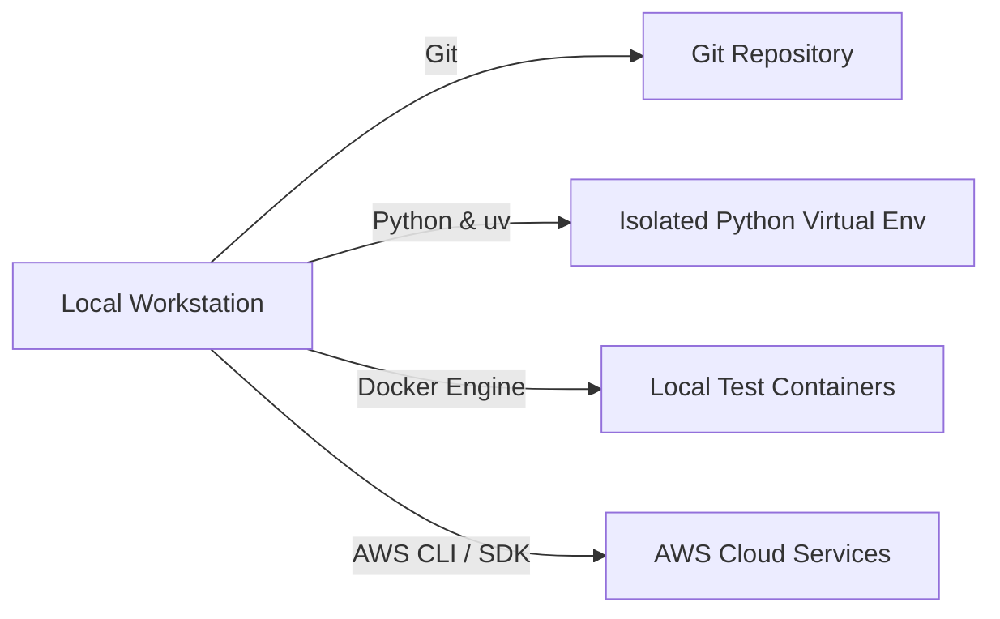

# 02_Chapter_prerequisites

## 1. Introduction
Developing and deploying Amazon Bedrock AgentCore applications requires establishing a robust, standardized local development environment.

> **Easy-to-Understand Explanation:** Before building an AI agent, you need your computer set up with the right developer tools. Think of this chapter as setting up your digital workshop: installing Python to run code, Git to save project versions, Docker to run containers, 'uv' to manage libraries quickly, and AWS CLI to communicate with your cloud account.

---

## 2. Learning Objectives
By the end of this chapter, you will be able to:
- In this chapter, you will learn how to:
- - Install and verify the required local development tools.
- - Configure virtual environments to manage python packages.
- - Install the `uv` toolchain and verify Docker container configurations.
- - Verify AWS account authentication and API credentials access.

---

## 3. Prerequisites
* Basic familiarity with terminal command lines (Bash or PowerShell).
* An active AWS Account with permissions to create IAM users and policies.

---

## 4. Background Theory
A standard development environment minimizes the risk of configuration discrepancies between local workstations and production servers. Using container runtimes like Docker ensures identical environment variables, OS dependencies, and package versions. Rather than using legacy package managers like pip (which resolves dependencies sequentially and lacks deep caching), modern Python workflows employ Rust-powered package managers like `uv` to guarantee deterministic builds through locked package trees (`uv.lock`).

---

## 5. Core Concepts
**📦 Technical Term: SDK**

* **Simple Explanation:** A collection of pre-written libraries and utilities used to build applications for a platform.
* **Why it exists:** Eliminates the need to write raw HTTP requests for API actions.
* **Where is it used:** Python script imports like `import boto3`.

**📦 Technical Term: AWS CLI**

* **Simple Explanation:** A command-line tool used to control and automate AWS services through script queries.
* **Why it exists:** Allows developers to manage cloud assets without clicking the AWS web console.
* **Where is it used:** Configuring access keys and initiating deployment pipelines.

**📦 Technical Term: Virtual Environment**

* **Simple Explanation:** An isolated workspace that hosts a local copy of Python and specific package dependencies.
* **Why it exists:** Prevents version conflicts between different Python projects running on the same host.
* **Where is it used:** Locally installed pip libraries.

---

## 6. Internal Mechanics
1. Developer inputs command in terminal (e.g., `git clone` or `docker run`).
2. The shell resolves the binary location in the system PATH variable.
3. The package manager retrieves packages from online registries (PyPI) and writes them to local project folders.
4. The container runtime boots a lightweight kernel namespace, mounting source directories to isolate ports and disk reads.

---

## 7. Architecture Overview
The following architectural details outline the components and relationship schemas active in this module:



---

## 8. Installation & Setup
Execute the following terminal commands to check installation status of required tools:
```bash
git --version
python --version
docker --version
aws --version
```
To install `uv` on Windows, use:
```powershell
powershell -ExecutionPolicy ByPass -c "irm https://astral.sh/uv/install.ps1 | iex"
```
On macOS/Linux, run:
```bash
curl -LsSf https://astral.sh/uv/install.sh | sh
```

---

## 9. Configuration
Verify AWS CLI credentials configuration by running:
```bash
aws configure
```
Provide your AWS Access Key ID, Secret Access Key, Default region (e.g., `us-east-1`), and output format (`json`). The configurations are saved locally under `~/.aws/credentials` and `~/.aws/config`.

---

## 10. Hands-on Examples

In this section, we analyze the hands-on code implementations for **Local Environment Prerequisites** step-by-step, explaining the architecture, syntax choices, logic flow, and production patterns across all three implementation tiers.

---

### 1. Simple Implementation Tier Walkthrough

```python
json
{
      "UserId": "AIDAX1234567890EXAMPLE",
      "Account": "123456789012",
      "Arn": "arn:aws:iam::123456789012:user/developer"
  }
```

#### Code Logic & Syntax Breakdown:
* **Package Imports (`from bedrock_agent_core import ...`)**:
  - Brings in the core `BedrockAgentCoreApp` engine. This class handles runtime container startup, manages the microVM event loop, and deserializes incoming JSON API invocations.
* **Application Instance (`app = BedrockAgentCoreApp()`)**:
  - Instantiates the primary application object `app`. This object serves as the main registry for invocation routes, memory session hooks, and tool bindings.
* **Invocation Decorator (`@app.invoke`)**:
  - A Python decorator that registers the function immediately below as the primary entrypoint for Bedrock AgentCore runtime triggers.
* **Handler Signature (`def handler(payload, context):`)**:
  - **`payload`**: A Python dictionary holding client parameters, user prompt strings, and input arguments.
  - **`context`**: A metadata object containing active runtime details such as `session_id`, `actor_id`, and AWS IAM execution identities.
* **Return Payload (`return {"statusCode": 200, "response": ...}`)**:
  - Constructs a standard HTTP response dictionary. The `statusCode: 200` communicates success to the API Gateway, and `response` delivers the agent payload back to the client.

---

### 2. Intermediate Implementation Tier Walkthrough

```python
# Python script to verify Docker daemon is running locally using docker-py client
import subprocess

def check_docker():
    try:
        res = subprocess.run(["docker", "info"], capture_output=True, text=True)
        if res.returncode == 0:
            print("Docker Daemon is active and responding.")
        else:
            print("Docker Daemon is not running or active.")
    except FileNotFoundError:
        print("Docker CLI binary was not found in path.")

if __name__ == "__main__":
    check_docker()
```

#### Code Logic & Syntax Breakdown:
* **System Logging Setup (`import logging` & `logger = logging.getLogger(...)`)**:
  - Configures structured logging via Python's standard `logging` module.
  - In production, log messages emitted by `logger.info()` stream into Amazon CloudWatch Logs for real-time monitoring and debugging.
* **Safe Parameter Extraction (`payload.get(...)`)**:
  - Uses `payload.get("prompt", "")` to safely retrieve user queries. Using `.get()` with a default fallback (`""`) prevents `KeyError` exceptions if optional fields are missing.
* **Runtime Session Inspection (`getattr(context, ...)`)**:
  - Inspects the `context` object for `session_id`. Using `getattr()` ensures compatibility when testing locally without a live AWS microVM context.
* **Operational Telemetry (`logger.info(...)`)**:
  - Emits formatted log entries containing session parameters and query strings to track execution flow.

---

### 3. Advanced Production Tier Walkthrough

```python
# Comprehensive system pre-flight check script validating git, python, uv, docker, and aws
import subprocess
import sys

def run_check(binary_name, args):
    try:
        res = subprocess.run([binary_name] + args, capture_output=True, text=True, check=True)
        print(f"[OK] {binary_name} is active: {res.stdout.splitlines()[0]}")
        return True
    except Exception:
        print(f"[FAIL] {binary_name} is missing or returned errors.")
        return False

def main():
    checks = [
        ("git", ["--version"]),
        ("python", ["--version"]),
        ("uv", ["--version"]),
        ("docker", ["--version"]),
        ("aws", ["sts", "get-caller-identity"])
    ]
    all_pass = True
    for binary, args in checks:
        if not run_check(binary, args):
            all_pass = False
    if not all_pass:
        print("Error: Pre-flight check failed. Please install missing toolchains.")
        sys.exit(1)
    print("All prerequisites validated successfully!")

if __name__ == "__main__":
    main()
```

#### Code Logic & Syntax Breakdown:
* **Defensive Error Trapping (`try: ... except Exception as e:`)**:
  - Wraps the entire invocation handler inside a `try-except` block to catch unhandled errors gracefully, preventing container crashes in multi-tenant runtime environments.
* **Input Parameter Validation (`if not prompt:`)**:
  - Inspects inbound arguments before executing core agent logic. If mandatory parameters are missing, it short-circuits execution and returns a structured `statusCode: 400` (Bad Request) payload.
* **Environment Overrides (`os.getenv(...)`)**:
  - Reads system environment variables (e.g., `APP_ENV`) to dynamically adapt behavior across `development`, `staging`, and `production` environments without modifying codebase files.
* **Sanitized Production Error Response**:
  - Logs internal error details using `logger.error(...)` while returning a clean, safe `statusCode: 500` response to prevent internal stack traces from leaking to client callers.

---

### Summary Sequence of Execution

```
[Incoming Invocation] ──► [Bedrock AgentCore Runtime]
                                  │
                                  ▼
                      [Route to @app.invoke Handler]
                                  │
                   ┌──────────────┴──────────────┐
                   ▼                             ▼
       [Input Validated (200)]        [Input Missing (400)]
                   │                             │
                   ▼                             ▼
       [Execute Agent Core Logic]     [Return Error Payload]
                   │
                   ▼
       [Deliver JSON to Client]
```

---

## 11. Production Best Practices
* Pin exact minor versions of Python in your workspace to match the target runtime container.
* Configure shell completion settings for `uv` and `aws` CLI tools to accelerate development workflows.
* Regularly prune unused Docker builder caches to reclaim local disk space.

---

## 12. Security Considerations
Never store permanent AWS root credentials on your workstation. Utilize AWS IAM Identity Center (successor to Single Sign-On) to retrieve temporary, role-based credentials. Ensure local private keys and `.aws/` credential files are set with strict filesystem read permissions (e.g., `chmod 600`).

---

## 13. Performance Optimization
Set `uv` to use a global package cache. This avoids re-downloading source wheels across different project folders, resulting in sub-second dependency sync operations.

---

## 14. Common Mistakes
* Committing local credentials files to public repositories.
* Running container runtimes without administrative group privileges, leading to permission access denied errors on socket files.

---

## 15. Troubleshooting
Below is the diagnostic reference table for identifying and resolving issues:

| Symptom | Root Cause | Solution |
| :--- | :--- | :--- |
| Docker command returns permission denied | Current user is not associated with the administrative docker group. | Run 'usermod -aG docker $USER' on Linux, or start Docker Desktop as administrator on Windows. |
| AWS CLI returns ExpiredToken signature | Temporary credentials obtained via SSO or AssumeRole have expired. | Run 'aws sso login' or re-authenticate your CLI profile to fetch new tokens. |

---

## 16. Interview Questions
### Q: Why is Git essential in automated CI/CD deployment pipelines?
* **Answer:** Git acts as the source of truth for the codebase. Version control systems host hooks that notify CI/CD servers (like GitHub Actions) to run tests and compile production containers on push events.

### Q: What is the role of the system PATH environment variable?
* **Answer:** The PATH variable lists directories containing executable binaries. When a command is typed, the OS searches these paths sequentially to execute the matching binary file.

### Q: How does uv guarantee deterministic package installations?
* **Answer:** uv uses a lockfile (`uv.lock`) that lists the exact version, checksum, and dependencies of every package, ensuring that subsequent installations resolve the identical package tree.

---

## 17. Real-World Use Cases
Setting up new workstations for engineers joining an AI development team to ensure environment alignment.

---

## 18. Industrial Project
This workspace preparation allows us to clone the agent source files and compile local container images in subsequent chapters.

---

## 19. Summary
This chapter covered installing, configuring, and testing the core tools (Git, Python, uv, Docker, and AWS CLI) required to build Bedrock AgentCore applications.

---

## 20. Key Takeaways
* isolated local virtual environments prevent library conflicts.
* Docker daemon must be active locally to emulate container deployment targets.
* AWS CLI authentication must be completed before cloud deployment steps can proceed.

---

## 21. Practice Exercises
* Beginner: Install the `uv` toolchain and verify it responds to the version query command.
* Intermediate: Configure an AWS CLI profile named `dev-profile` targeting the `us-west-2` region.

---

## 22. Further Reading
* [AWS CLI Command Reference Guide](https://awscli.amazonaws.com/v2/documentation/api/latest/index.html)
* [Docker Containerization Engine Documentation](https://docs.docker.com/)
