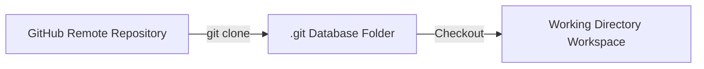

# 04_Chapter_clone_repository

## 1. Introduction
Developing Bedrock AgentCore applications begins by cloning and inspecting the official sample repository.

> **Analogy:** Before modifying a machine, an engineer downloads the manufacturing blueprint files. This ensures they have the correct schematics, part numbers, and files before changing the design.

---

## 2. Learning Objectives
By the end of this chapter, you will be able to:
- In this chapter, you will learn how to:
- - Clone the official AWS Bedrock AgentCore samples repository.
- - Verify the local directory structure.
- - Understand the roles of the core directories and files.

---

## 3. Prerequisites
* Active installations of Git and Python from Chapter 2.
* Network access to GitHub.

---

## 4. Background Theory
Version control systems (like Git) maintain the chronological history of a codebase. Cloning a remote repository downloads the entire commit tree, project metadata, and branches to your local machine. In enterprise software engineering, code changes are managed using branching strategies (e.g., GitFlow). This isolates updates and permits collaborative code reviews before changes are merged into production branches.

---

## 5. Core Concepts
> **📦 Technical Term: Repository**
>
> * **Simple Explanation:** A digital directory storing the project's source code, history, and configuration files.
> * **Why it exists:** Allows developers to track revisions and roll back changes.
> * **Where is it used:** A hosted repository on GitHub.

> **📦 Technical Term: Git Clone**
>
> * **Simple Explanation:** The command that copies a remote repository to a local workstation.
> * **Why it exists:** Enables local development and editing of codebase files.
> * **Where is it used:** Running `git clone <url>` in terminal.

> **📦 Technical Term: Workspace**
>
> * **Simple Explanation:** The local folder on your workstation where you edit code and run test scripts.
> * **Why it exists:** Contains untracked development configuration files like `.env`.
> * **Where is it used:** Your active project directory.

---

## 6. Internal Mechanics
1. Developer executes `git clone <url>`.
2. Git initiates an HTTP/SSH connection to the remote server.
3. The remote server packages the project object database into a packfile.
4. Git downloads the packfile, expands it into the `.git` directory, and checks out the default branch files into the workspace folder.

---

## 7. Architecture Overview
The following architectural details outline the components and relationship schemas active in this module:



---

## 8. Installation & Setup
Open your terminal and execute the cloning command:
```bash
git clone https://github.com/awslabs/agentcore-samples.git
```
Expected shell output:
```text
Cloning into 'agentcore-samples'...
remote: Enumerating objects: 142, done.
remote: Counting objects: 100% (142/142), done.
Receiving objects: 100% (142/142), 85.40 KiB | 2.50 MiB/s, done.
Resolving deltas: 100% (68/68), done.
```

---

## 9. Configuration
After cloning, enter the project directory to verify active branch status:
```bash
cd agentcore-samples
git status
```

---

## 10. Hands-on Examples
### Simple Example
```python
# Verify git repository details using terminal commands programmatically
import subprocess

def get_git_branch():
    try:
        res = subprocess.run(["git", "branch", "--show-current"], capture_output=True, text=True, check=True)
        print("Current active git branch:", res.stdout.strip())
    except Exception as e:
        print("Error reading branch:", str(e))

if __name__ == "__main__":
    get_git_branch()
```

### Intermediate Example
```python
# Script to list the contents of the root folder and verify file sizes
import os

def audit_project_root():
    target = "."
    print(f"Auditing directory: {os.path.abspath(target)}")
    for item in os.listdir(target):
        path = os.path.join(target, item)
        size = os.path.getsize(path) if os.path.isfile(path) else "Directory"
        print(f"- {item:<25} | Size: {size}")

if __name__ == "__main__":
    audit_project_root()
```

### Advanced Example
```python
# Complete diagnostic script checking for modified files and git config status
import subprocess
import sys

def verify_repository():
    try:
        # Check if we are inside a git directory
        res = subprocess.run(["git", "rev-parse", "--is-inside-work-tree"], capture_output=True, text=True, check=True)
        if "true" not in res.stdout.lower():
            print("Not inside a git work tree.")
            return False
        
        # Retrieve remote URL information
        res_url = subprocess.run(["git", "config", "--get", "remote.origin.url"], capture_output=True, text=True, check=True)
        print("Remote Repository URL:", res_url.stdout.strip())
        
        # Check for uncommitted changes
        res_status = subprocess.run(["git", "status", "--porcelain"], capture_output=True, text=True, check=True)
        changes = res_status.stdout.strip()
        if changes:
            print("WARNING: Uncommitted changes detected in workspace:")
            print(changes)
        else:
            print("Workspace is clean and synchronized.")
        return True
    except Exception as e:
        print("Git verification failed:", str(e))
        return False

if __name__ == "__main__":
    verify_repository()
```

---

## 11. Code Walkthrough
Let's perform a line-by-line code walk of the core logic implementation:

```python
# Verify git repository details using terminal commands programmatically
import subprocess

def get_git_branch():
    try:
        res = subprocess.run(["git", "branch", "--show-current"], capture_output=True, text=True, check=True)
        print("Current active git branch:", res.stdout.strip())
    except Exception as e:
        print("Error reading branch:", str(e))

if __name__ == "__main__":
    get_git_branch()
```

* **`import` statements:** Load libraries and core modules required by the package.
* **Initialization:** Instantiates execution frameworks and logs operational events.
* **Handler logic:** Executes input validations and triggers core business routines.

---

## 12. Production Best Practices
* Create a development branch (`git checkout -b feature/agent-setup`) instead of making changes directly on `main`.
* Configure a global `.gitignore` file to prevent system metadata files (like `.DS_Store` or `Thumbs.db`) from entering code repos.
* Commit small, logical changes with descriptive messages to simplify rollbacks.

---

## 13. Security Considerations
Enforce signature verification using GPG keys to sign commits. Configure branch protection rules on your remote repository (e.g., GitHub or Bitbucket) to block direct force-push updates to release branches.

---

## 14. Performance Optimization
If a repository contains large binary assets, use shallow clone configurations (`git clone --depth 1`) to download only the latest commits, reducing transfer times.

---

## 15. Cost Optimization
Git operations are processed locally or on free repository platforms. However, keep in mind that hosting private repositories with large file storage features can incur cost configurations under enterprise plans.

---

## 16. Common Mistakes
* Committing large package binaries or local virtual environment folders to repository history.
* Modifying files on checkout branches without first fetching the latest updates from the remote repository.

---

## 17. Troubleshooting
Below is the diagnostic reference table for identifying and resolving issues:

| Symptom | Root Cause | Solution |
| :--- | :--- | :--- |
| Could not resolve host error during clone | The terminal cannot resolve the hostname due to a network connection or DNS issue. | Verify internet connections or configure HTTP proxy variables if working behind an corporate gateway. |
| Permission denied (publickey) error | Your SSH public key is not registered with your remote git hosting profile. | Configure HTTPS credentials authentication or upload your public SSH key to the repository server settings. |

---

## 18. Interview Questions
### Q: What is the difference between git fetch and git pull?
* **Answer:** Git fetch downloads remote updates and references to your local `.git` metadata folder without altering your working files. Git pull downloads these updates and immediately runs a merge command to synchronize your workspace files.

### Q: Why should you avoid tracking files like .env in git?
* **Answer:** The `.env` file contains sensitive local access keys and database credentials. Tracking it in Git commits secrets to repository histories, exposing them to anyone with read permissions.

### Q: What is a git submodule?
* **Answer:** A git submodule allows you to keep another Git repository as a subdirectory of your main repository, enabling you to link dependencies while maintaining independent commit histories.

---

## 19. Real-World Use Cases
Retrieving standard codebase templates to establish uniform layouts for new projects.

---

## 20. Industrial Project
Cloning the repository sets up the baseline layout, including the `src/` source folders we will configure in Chapter 6.

---

## 21. Summary
This chapter covered cloning the project repository, navigating directories, and verifying the local folder layout.

---

## 22. Key Takeaways
* Git clone duplicates remote repositories to local workstations.
* Standard workspaces isolate source files from local settings configurations.
* Local changes should be managed using separate development branches.

---

## 23. Practice Exercises
* Beginner: Clone the sample repository and list root files in your shell.
* Intermediate: Create a local git branch named `setup-phase` and verify it is active.

---

## 24. Further Reading
* [Pro Git Book](https://git-scm.com/book/en/v2)
* [GitHub Documentation](https://docs.github.com/)
