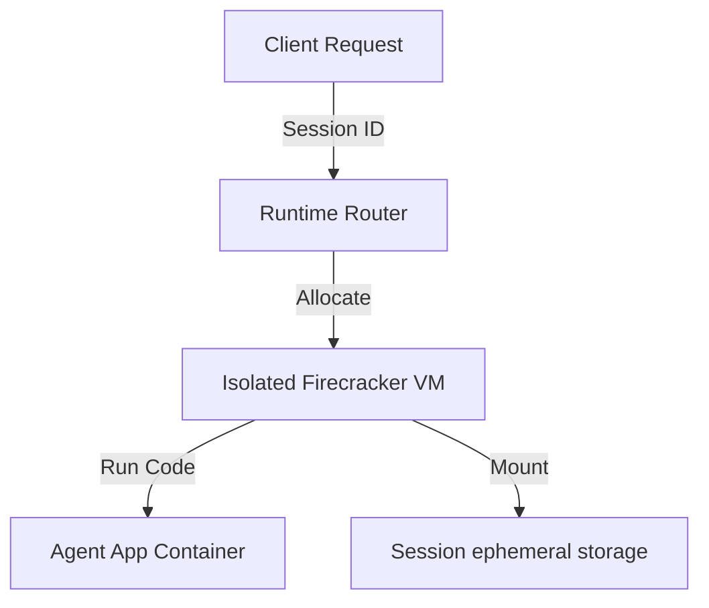

# 10_Chapter_agentcore_runtime

## 1. Introduction
The AgentCore runtime hosts agent containers inside secure, isolated virtual machine environments.

> **Analogy:** Think of renting a suite at a hotel. The suite (Firecracker VM) is an isolated space with its own secure lock and utilities. What happens inside does not affect other suites.

---

## 2. Learning Objectives
By the end of this chapter, you will be able to:
- In this chapter, you will learn:
- - How AWS Firecracker microVMs provide secure, hardware-isolated runtimes.
- - The difference between container execution and microVM isolation.
- - How AgentCore routes requests to active (warm) and new (cold) sessions.
- - The default execution bounds, timeouts, and limits.

---

## 3. Prerequisites
* Setup of configuration files and local container runtimes from Chapters 7 and 8.
* A basic understanding of virtualization concepts (VMs vs containers).

---

## 4. Background Theory
Deploying agents to the cloud requires secure execution environments. Traditional shared container runtimes share a single operating system kernel, risking cross-tenant data leaks. AWS designed Firecracker to combine the security isolation of traditional virtual machines with the speed and efficiency of containers. The AgentCore runtime spawns a dedicated Firecracker microVM for each user session, enforcing resource limits and security boundaries.

---

## 5. Core Concepts
> **📦 Technical Term: Firecracker**
>
> * **Simple Explanation:** An open-source virtualization technology designed to spawn secure, multitenant microVMs.
> * **Why it exists:** Combines the security isolation of traditional VMs with container speed.
> * **Where is it used:** The underlying hypervisor for AWS Lambda and Fargate.

> **📦 Technical Term: Cold Start**
>
> * **Simple Explanation:** The process of pulling container images and booting a new microVM for a session.
> * **Why it exists:** The initial boot latency when a session starts.
> * **Where is it used:** The initial request boot cycle.

> **📦 Technical Term: Warm Start**
>
> * **Simple Explanation:** Routing subsequent requests using the same session ID to an active microVM.
> * **Why it exists:** Bypasses the boot cycle for low-latency responses.
> * **Where is it used:** Subsequent requests within active session windows.

---

## 6. Internal Mechanics
1. Client sends an invocation request containing a unique `session_id`.
2. The runtime checks if an active microVM is allocated to that session.
3. If missing (Cold Start), it pulls the ECR container image and boots a new Firecracker microVM.
4. If active (Warm Start), it routes the request directly to the running container.
5. The microVM executes the request and remains active until the inactivity timeout or max session duration (8 hours) is reached.

---

## 7. Architecture Overview
The following architectural details outline the components and relationship schemas active in this module:



---

## 8. Installation & Setup
Inspect active session microVM status using the CLI:
```bash
agentcore runtime status
```

---

## 9. Configuration
Configure runtime limits and session timeouts in `bedrock_agent_core.yaml`:
```yaml
runtime:
  timeout_seconds: 3600
  memory_mb: 2048
  storage_gb: 10
```

---

## 10. Hands-on Examples
### Simple Example
```python
# Verify session details in execution context
def check_runtime_context(context):
    session_id = getattr(context, "session_id", "local-session")
    print("Running inside session VM:", session_id)
    return session_id
```

### Intermediate Example
```python
# Python script to verify local file isolation under /tmp
import os

def check_file_isolation():
    path = "/tmp/session_data.txt"
    if os.path.exists(path):
        with open(path, "r") as f:
            print("Read session data:", f.read())
    else:
        print("No session data found. Writing default...")
        with open(path, "w") as f:
            f.write("Session Active")

if __name__ == "__main__":
    check_file_isolation()
```

### Advanced Example
```python
# Complete script validating memory limits and executing timeout handlers
import time
import signal
import sys

def timeout_handler(signum, frame):
    print("[TIMEOUT] Execution time limit exceeded. Terminating task.")
    sys.exit(1)

def execute_with_bounds(duration):
    # Register signal handler for execution timeouts
    signal.signal(signal.SIGALRM, timeout_handler)
    signal.alarm(5) # Set timeout limit to 5 seconds
    try:
        print(f"Executing process for {duration} seconds...")
        time.sleep(duration)
        signal.alarm(0) # Disable alarm on success
        print("[SUCCESS] Task completed within limits.")
    except Exception as e:
        print("Execution error:", str(e))

if __name__ == "__main__":
    execute_with_bounds(3) # Succeeds
    execute_with_bounds(10) # Triggers timeout
```

---

## 11. Code Walkthrough
Let's perform a line-by-line code walk of the core logic implementation:

```python
# Verify session details in execution context
def check_runtime_context(context):
    session_id = getattr(context, "session_id", "local-session")
    print("Running inside session VM:", session_id)
    return session_id
```

* **`import` statements:** Load libraries and core modules required by the package.
* **Initialization:** Instantiates execution frameworks and logs operational events.
* **Handler logic:** Executes input validations and triggers core business routines.

---

## 12. Production Best Practices
* Design applications to boot quickly by minimizing the container image footprint.
* Never write persistent data to the local filesystem; write files to S3.
* Configure short timeouts to prevent runaway executions from inflating bills.

---

## 13. Security Considerations
Enforce strict resource allocations for RAM and CPU. Ensure that containers run as non-root users inside microVMs to prevent privilege escalation attacks.

---

## 14. Performance Optimization
Leverage warm starts for sequential requests to bypass boot latency and ensure fast response times.

---

## 15. Cost Optimization
Monitor microVM active runtimes closely. Inactive microVMs are automatically reclaimed by AWS after inactivity thresholds are met, minimizing idle resource charges.

---

## 16. Common Mistakes
* Expecting files written to `/tmp` to persist across sessions (sessions terminate after timeouts, destroying ephemeral storage).
* Overallocating RAM in configurations, leading to high resource reservation fees.

---

## 17. Troubleshooting
Below is the diagnostic reference table for identifying and resolving issues:

| Symptom | Root Cause | Solution |
| :--- | :--- | :--- |
| 504 Gateway Timeout error | The execution exceeded the configured timeout_seconds threshold. | Increase timeout limits in configuration or refactor logic to use streaming responses. |
| OutOfMemory error during execution | The application exceeded allocated microVM RAM limits. | Optimize memory usage patterns or increase memory_mb configurations. |

### Additional Reference Tables


| Limit Parameter | Default Value | Description |
| :--- | :--- | :--- |
| **Max Payload Size** | 100 MB | The maximum size of incoming request payloads, allowing for large files or attachments. |
| **Synchronous Timeout** | 15 Minutes | The execution timeout for a single, blocking request before returning a gateway error. |
| **Streaming Timeout** | 60 Minutes | The execution limit for streaming responses (e.g., long research loops). |
| **Max Session Duration** | 8 Hours | The maximum lifespan of a single microVM session. |


---

## 18. Interview Questions
### Q: What is the security advantage of Firecracker over standard containers?
* **Answer:** Standard containers share the host operating system kernel, making them vulnerable to kernel exploit leaks. Firecracker runs each container inside an isolated microVM with its own kernel, securing multi-tenant environments.

### Q: How do cold starts affect agent latency?
* **Answer:** Cold starts add boot latency (typically a few seconds) because the system must pull the container image and initialize the virtual machine before processing requests.

### Q: What happens to ephemeral data when a session terminates?
* **Answer:** When a session times out or reaches its limit, the microVM is destroyed, erasing all ephemeral storage data (including the `/tmp` folder).

---

## 19. Real-World Use Cases
Isolating user sessions in SaaS platforms to prevent multi-tenant data leaks.

---

## 20. Industrial Project
This runtime provides the secure host environment where our agent handler executes in production.

---

## 21. Summary
This chapter analyzed the virtualization architecture of AgentCore, detailing Firecracker microVMs, session isolation, and execution bounds.

---

## 22. Key Takeaways
* Session isolation is enforced using AWS Firecracker microVMs.
* Inactive microVMs are reclaimed to minimize idle resource charges.
* Write persistent files to S3 because microVM storage is ephemeral.

---

## 23. Practice Exercises
* Beginner: Configure `bedrock_agent_core.yaml` to set `timeout_seconds` to 600.
* Intermediate: Map the lifecycle of a runtime VM from boot to destruction in a flow chart.

---

## 24. Further Reading
* [AWS Firecracker Architecture Whitepaper](https://docs.aws.amazon.com/whitepapers/latest/aws-firecracker-design/aws-firecracker-design.html)
* [AWS Lambda Execution Environments](https://docs.aws.amazon.com/lambda/latest/dg/runtimes-context.html)
