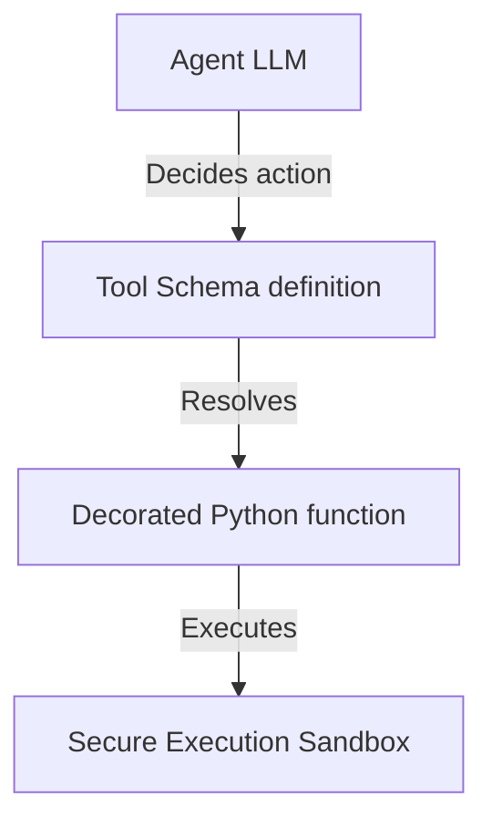

# 14_Chapter_tools

## 1. Introduction
Custom tools extend agent capabilities by allowing them to execute code and query external web services.

> **Easy-to-Understand Explanation:** Custom tools allow your AI agent to perform real-world actions, like looking up an order status or fetching current weather data. This chapter demonstrates how to write custom Python functions, decorate them, and let the agent call them automatically during conversations.

---

## 2. Learning Objectives
By the end of this chapter, you will be able to:
- In this chapter, you will learn how to:
- - Define parameter schemas for custom tools using JSON.
- - Register Python functions in a central Tool Registry.
- - Coordinate tool invocation requests from the foundation model.
- - Enforce exception handling in tool executions.

---

## 3. Prerequisites
* Active installations and AWS configurations from Chapters 6 and 8.
* A basic understanding of Python function definitions and parameter type annotations.

---

## 4. Background Theory
Models can only process and generate text; they cannot access databases or run code directly. Integrating tools extends their capabilities. However, exposing APIs directly to LLMs risks SQL injection attacks. A tool gateway acts as a secure broker. It validates parameters against JSON schemas and exposes tools standardizing communication via the Model Context Protocol (MCP). Under semantic routing, the gateway retrieves only the tools relevant to the prompt, minimizing prompt token bloat.

---

## 5. Core Concepts
**📦 Technical Term: Tool Registry**

* **Simple Explanation:** A central repository class that manages tool functions and metadata schemas.
* **Why it exists:** Coordinates tool registrations and lookup operations.
* **Where is it used:** The tool registry module.

**📦 Technical Term: JSON Schema**

* **Simple Explanation:** A JSON object declaring parameter names, types, and descriptions for validation.
* **Why it exists:** Enforces parameter schemas before functions execute.
* **Where is it used:** The parameters definition dictionary.

**📦 Technical Term: @tool Decorator**

* **Simple Explanation:** A decorator helper that generates JSON schemas from Python function docstrings.
* **Why it exists:** Simplifies tool definition and registration.
* **Where is it used:** Decorating Python functions.

---

## 6. Internal Mechanics
1. The model determines it needs external data to complete a prompt.
2. It returns a tool call payload specifying the target tool name and parameters.
3. The Tool Registry intercepts the call and validates parameters against the JSON schema.
4. If validation succeeds, it executes the registered Python function.
5. The function executes in a secure sandbox, returning outputs to the model to complete the loop.

---

## 7. Architecture Overview
The following architectural details outline the components and relationship schemas active in this module:



---

## 8. Installation & Setup
Validate custom tool execution syntax using the CLI:
```bash
agentcore tools validate --file src/main.py
```

---

## 9. Configuration
Configure registered tools and execution boundaries in your configuration files:
```yaml
tools:
  - name: "lookup_warranty_status"
    entry_point: "src/tools.py"
    timeout_seconds: 10
```

---

## 10. Hands-on Examples

In this section, we analyze the hands-on code implementations for **Custom Tools Integration** step-by-step, explaining the architecture, syntax choices, logic flow, and production patterns across all three implementation tiers.

---

### 1. Simple Implementation Tier Walkthrough

```python
# File: src/tools_impl.py
# Folder Location: agentcore-samples/src/tools_impl.py

import json
from typing import Dict, Any

# =====================================================================
# 1. Define Tool Schema
# =====================================================================
LOOKUP_WARRANTY_SCHEMA = {
    "name": "lookup_warranty_status",
    "description": "Retrieve the warranty coverage status for a specific customer order ID.",
    "inputSchema": {
        "json": {
            "type": "object",
            "properties": {
                "order_id": {
                    "type": "string",
                    "description": "The unique 5-digit order identifier (e.g., '12345')."
                }
            },
            "required": ["order_id"]
        }
    }
}

# =====================================================================
# 2. Implement Tool Executor
# =====================================================================
class ToolRegistry:
    def __init__(self):
        self.tools = {}

    def register_tool(self, name: str, func):
        self.tools[name] = func

    def execute_tool(self, name: str, arguments: Dict[str, Any]) -> str:
        if name not in self.tools:
            return f"Error: Tool '{name}' is not registered."
            
        try:
            return self.tools[name](**arguments)
        except Exception as e:
            return f"Execution error in tool '{name}': {str(e)}"

# Define the python function
def lookup_warranty_status(order_id: str) -> str:
    db_mock = {
        "12345": "Expired (254 days ago)",
        "67890": "Active - Under coverage"
    }
    return db_mock.get(order_id, "Order ID not found.")

# Register tool
registry = ToolRegistry()
registry.register_tool("lookup_warranty_status", lookup_warranty_status)
```

#### Code Logic & Syntax Breakdown:
* **Package Imports (`from bedrock_agent_core import ...`)**:
  - Brings in the core `BedrockAgentCoreApp` engine. This class handles runtime container startup, manages the microVM event loop, and deserializes incoming JSON API invocations.
* **Application Instance (`app = BedrockAgentCoreApp()`)**:
  - Instantiates the primary application object `app`. This object serves as the main registry for invocation routes, memory session hooks, and tool bindings.
* **Invocation Decorator (`@app.invoke`)**:
  - A Python decorator that registers the function immediately below as the primary entrypoint for Bedrock AgentCore runtime triggers.
* **Handler Signature (`def handler(payload, context):`)**:
  - **`payload`**: A Python dictionary holding client parameters, user prompt strings, and input arguments.
  - **`context`**: A metadata object containing active runtime details such as `session_id`, `actor_id`, and AWS IAM execution identities.
* **Return Payload (`return {"statusCode": 200, "response": ...}`)**:
  - Constructs a standard HTTP response dictionary. The `statusCode: 200` communicates success to the API Gateway, and `response` delivers the agent payload back to the client.

---

### 2. Intermediate Implementation Tier Walkthrough

```python
# Python script to register and execute functions dynamically
class ToolRegistry:
    def __init__(self):
        self.registry = {}

    def register(self, name, func):
        self.registry[name] = func

    def execute(self, name, **kwargs):
        if name not in self.registry:
            return f"Error: Tool '{name}' not found."
        try:
            return self.registry[name](**kwargs)
        except Exception as e:
            return f"Execution failed: {str(e)}"

def add(x, y):
    return x + y

if __name__ == "__main__":
    reg = ToolRegistry()
    reg.register("math_add", add)
    print("Result:", reg.execute("math_add", x=5, y=10))
```

#### Code Logic & Syntax Breakdown:
* **System Logging Setup (`import logging` & `logger = logging.getLogger(...)`)**:
  - Configures structured logging via Python's standard `logging` module.
  - In production, log messages emitted by `logger.info()` stream into Amazon CloudWatch Logs for real-time monitoring and debugging.
* **Safe Parameter Extraction (`payload.get(...)`)**:
  - Uses `payload.get("prompt", "")` to safely retrieve user queries. Using `.get()` with a default fallback (`""`) prevents `KeyError` exceptions if optional fields are missing.
* **Runtime Session Inspection (`getattr(context, ...)`)**:
  - Inspects the `context` object for `session_id`. Using `getattr()` ensures compatibility when testing locally without a live AWS microVM context.
* **Operational Telemetry (`logger.info(...)`)**:
  - Emits formatted log entries containing session parameters and query strings to track execution flow.

---

### 3. Advanced Production Tier Walkthrough

```python
# Complete SDK tool implementation validating arguments and capturing execution errors
from bedrock_agent_core import BedrockAgentCoreApp, tool
import logging

logging.basicConfig(level=logging.INFO)
logger = logging.getLogger("ToolIntegration")
app = BedrockAgentCoreApp()

@tool
def lookup_warranty_status(order_id: str) -> str:
    """
    Retrieve the warranty coverage status for a customer order.
    
    Args:
        order_id: The unique 5-digit order identifier.
    """
    db = {"12345": "Active", "67890": "Expired"}
    try:
        # Basic input validation
        if not order_id.isdigit() or len(order_id) != 5:
            return "Error: Order ID must be a 5-digit number."
        return f"Order {order_id} warranty status: {db.get(order_id, 'Not Found')}"
    except Exception as e:
        logger.error(f"Tool execution error: {str(e)}")
        return "Error: Failed to fetch warranty status."

if __name__ == "__main__":
    # Test tool locally
    print(lookup_warranty_status(order_id="12345"))
```

#### Code Logic & Syntax Breakdown:
* **Defensive Error Trapping (`try: ... except Exception as e:`)**:
  - Wraps the entire invocation handler inside a `try-except` block to catch unhandled errors gracefully, preventing container crashes in multi-tenant runtime environments.
* **Input Parameter Validation (`if not prompt:`)**:
  - Inspects inbound arguments before executing core agent logic. If mandatory parameters are missing, it short-circuits execution and returns a structured `statusCode: 400` (Bad Request) payload.
* **Environment Overrides (`os.getenv(...)`)**:
  - Reads system environment variables (e.g., `APP_ENV`) to dynamically adapt behavior across `development`, `staging`, and `production` environments without modifying codebase files.
* **Sanitized Production Error Response**:
  - Logs internal error details using `logger.error(...)` while returning a clean, safe `statusCode: 500` response to prevent internal stack traces from leaking to client callers.

---

### Summary Sequence of Execution

```
[Incoming Invocation] ──► [Bedrock AgentCore Runtime]
                                  │
                                  ▼
                      [Route to @app.invoke Handler]
                                  │
                   ┌──────────────┴──────────────┐
                   ▼                             ▼
       [Input Validated (200)]        [Input Missing (400)]
                   │                             │
                   ▼                             ▼
       [Execute Agent Core Logic]     [Return Error Payload]
                   │
                   ▼
       [Deliver JSON to Client]
```

---

## 11. Production Best Practices
* Design tool functions to handle exceptions gracefully, returning friendly errors to the model.
* Add descriptive docstrings to functions to guide the model's tool selection.
* Validate all input parameters to protect backend APIs from injection attacks.

---

## 12. Security Considerations
Execute tool functions inside secure, sandboxed environments to prevent unauthorized system access. Use IAM policies to limit tools' access to only the AWS resources they require.

---

## 13. Performance Optimization
Set short execution timeouts on tool calls to prevent runaway scripts from stalling the main agent loop.

---

## 14. Common Mistakes
* Defining ambiguous descriptions, causing the model to select the wrong tool.
* Failing to wrap tool code in try-except blocks, causing unhandled exceptions to crash the agent runtime.

---

## 15. Troubleshooting
Below is the diagnostic reference table for identifying and resolving issues:

| Symptom | Root Cause | Solution |
| :--- | :--- | :--- |
| Model fails to invoke tool | Ambiguous description or missing docstring in the tool function. | Add a detailed docstring explaining when and how to use the tool. |
| InvalidParametersException on call | Arguments returned by the model do not match the JSON schema definitions. | Verify parameter names, types, and annotations in the function signature. |

---

## 16. Interview Questions
### Q: How does the @tool decorator generate JSON schemas?
* **Answer:** The decorator uses Python reflection and inspects type annotations and docstring parameters to construct JSON schemas for model configuration.

### Q: Why is sandboxing critical for executing custom tools?
* **Answer:** Sandboxing isolates execution, preventing code errors or prompt injection attacks from compromising the host operating system.

### Q: How do you handle tool execution failures?
* **Answer:** Catch exceptions inside the tool code and return a descriptive error string. The model can use this feedback to correct parameters and retry the call.

---

## 17. Real-World Use Cases
Integrating customer database lookups securely into customer service workflows.

---

## 18. Industrial Project
This custom tool integration allows our agent to query databases and call external APIs.

---

## 19. Summary
This chapter covered defining parameter schemas, registering custom Python functions, and executing tools inside secure environments.

---

## 20. Key Takeaways
* Custom tools extend agent capabilities to interact with external systems.
* Docstrings and type annotations guide the model's tool selection.
* Enforce parameter validation and run tools in secure sandboxes.

---

## 21. Practice Exercises
* Beginner: Write a tool that generates a random number within a minimum and maximum range.
* Intermediate: Create a tool that queries system time, validating format strings.

---

## 22. Further Reading
* [JSON Schema Standard Reference](https://json-schema.org/)
* [Python Type Hints Documentation](https://docs.python.org/3/library/typing.html)
