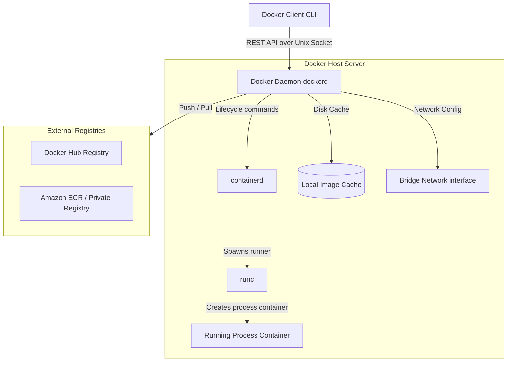
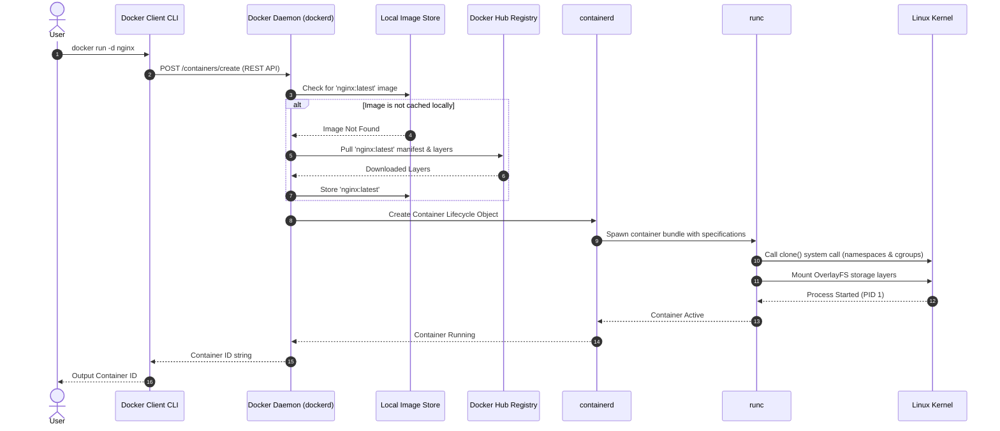

# Module 1 - Introduction to Containers & Docker

## 1. Learning Objectives
By the end of this module, you will be able to:
* Articulate the history and evolutionary timeline of containerization.
* Explain the core problems that Docker solves, specifically the "It works on my machine" dilemma and resource waste.
* Compare and contrast Virtual Machines and Containers in terms of architecture, performance, security, and resource allocation.
* Describe the internal Linux kernel mechanisms (Namespaces, cgroups, UnionFS) that make containerization possible.
* Diagram the high-level and component architecture of the Docker client-server model.
* Install and verify Docker across Windows, macOS, Linux (Ubuntu, RHEL, CentOS), and cloud environments.
* Troubleshooting local install failures, virtualization configurations, and Docker socket permission errors.

---

## 2. Introduction
In modern software engineering, consistency and speed are paramount. Historically, shipping software was a logistical nightmare. A software application is not merely a single script; it is a complex web of dependencies, system libraries, configuration files, and environmental requirements. If any of these dependencies are mismatched between the developer's laptop and the production server, the application fails.

To understand Docker, we must first understand the **Shipping Container Analogy**. 

Prior to the 1950s, transporting goods across oceans was slow, expensive, and chaotic. Cargo came in all shapes and sizes—barrels of wine, crates of machinery, sacks of flour, and bundles of steel. Stevedores had to load and unload each item manually. The process was slow, prone to damage, and highly inefficient. A port bottleneck would delay shipments for weeks.

The revolution came with the invention of the **standardized shipping container**. 

By defining a box with standard dimensions, locking mechanisms, and corner fittings, the shipping industry eliminated the need to care about what was inside the container. Whether a container held toys, cars, or bulk grains, it fit perfectly on standard ships, trains, trucks, and cranes. The container acted as an abstraction layer between the cargo and the transportation infrastructure.

```
+-------------------------------------------------------------+
|                      SHIPPING CONTAINER                     |
+---------------------+-------------------+-------------------+
|      Cargo: Toys    |    Cargo: Cars    |   Cargo: Grains   |
+---------------------+-------------------+-------------------+
|               Standard Intermodal Corner Castings           |
+-------------------------------------------------------------+
|               Ships  |  Trains  |  Trucks  |  Cranes        |
+-------------------------------------------------------------+
```

**Docker does exactly the same for software.** 

The application code, binary files, library runtimes, and configuration scripts represent the "cargo." The Docker container represents the standardized box. The operating systems (Ubuntu, Windows Server, RedHat) and infrastructure providers (AWS, Azure, bare-metal servers) represent the "ships and trucks." 

Docker abstracts the application from the underlying infrastructure, ensuring that the software runs identically regardless of where it is deployed.

---

## 3. Why This Topic Exists
Before the advent of containerization, deployment methodologies fell into two primary eras: **Bare-Metal Deployments** and **Hypervisor-Based Virtualization**. Both approaches presented systemic issues.

### The Bare-Metal Era (The Dependency Hell)
In a bare-metal environment, applications run directly on the host operating system. 
* **The Shared Resource Problem**: If Application A requires Python 2.7 and Application B requires Python 3.10, running both on the same server is extremely difficult. Upgrading a system library for one application could silently break another.
* **Lack of Isolation**: A memory leak or runaway process in Application A could consume 100% of the server's CPU, starving Application B and crashing the entire server.
* **Configuration Drift**: Over time, staging and production servers would accumulate manual configurations, security patches, and hotfixes. This resulted in "snowflake servers"—systems so unique that they could not be replicated.

### The Virtualization Era (The Hypervisor Bloat)
Hardware-level virtualization introduced the **Hypervisor** (e.g., VMware ESXi, KVM, Hyper-V), which allowed administrators to split a single physical server into multiple Virtual Machines (VMs).

```
+-------------------------------------------------------------+
|                       VIRTUAL MACHINES                      |
+----------------------+----------------------+---------------|
|  App A (Python 2.7)  |  App B (Python 3.10) |  App C (Go)   |
+----------------------+----------------------+---------------+
|  Libraries / Bins    |  Libraries / Bins    | Libs / Bins   |
+----------------------+----------------------+---------------+
|  Guest OS (Ubuntu)   |  Guest OS (RHEL)     | Guest OS (Win)|
+----------------------+----------------------+---------------+
|                      Hypervisor (Type 1 or 2)               |
+-------------------------------------------------------------+
|                      Physical Hardware                      |
+-------------------------------------------------------------+
```

While VMs solved the isolation and dependency problems, they introduced massive performance overhead:
1. **Resource Waste**: Every VM requires a complete **Guest Operating System**. A simple 10MB Go API requires a guest OS that consumes 1.5GB of RAM and 10GB of disk space.
2. **Slow Boot Times**: Starting a VM requires booting a full guest kernel, which takes 30 seconds to several minutes.
3. **Execution Latency**: Hypervisors translate guest OS hardware calls into physical CPU/memory calls, introducing system latency.

---

## 4. Theory & Internal Mechanics

### Virtualization vs Containerization
Containerization virtualizes the **Operating System (Kernel)** rather than the hardware. Instead of packaging a full guest OS, containers share the host machine's kernel.

```
+-------------------------------------------------------------+
|                          CONTAINERS                         |
+----------------------+----------------------+---------------|
|  App A (Python 2.7)  |  App B (Python 3.10) |  App C (Go)   |
+----------------------+----------------------+---------------+
|  Libraries / Bins    |  Libraries / Bins    | Libs / Bins   |
+----------------------+----------------------+---------------+
|                     Container Engine (Docker)               |
+-------------------------------------------------------------+
|                     Host Operating System Kernel            |
+-------------------------------------------------------------+
|                      Physical Hardware                      |
+-------------------------------------------------------------+
```

| Metric | Virtual Machines (VMs) | Containers (Docker) |
|---|---|---|
| **Architecture** | Virtualizes physical hardware | Virtualizes host operating system kernel |
| **Guest OS** | Required (Complete OS per VM) | None (Shares host OS kernel) |
| **Size** | Gigabytes (GB) | Megabytes (MB) |
| **Startup Time** | Minutes / Seconds | Milliseconds |
| **Resource Efficiency**| Low (Pre-allocated CPU/RAM) | High (Dynamic scaling based on load) |
| **Isolation** | Hardware-level (Highly Secure) | Process-level (Secure, but shares kernel) |
| **Portability** | Hypervisor dependent | Runs on any OS with a container engine |

### The Historical Evolution Timeline
Containerization did not appear overnight. It is the culmination of decades of Unix and Linux systems engineering:

* **1979 - chroot (Change Root)**: Introduced in Unix V7, `chroot` allowed changing the root directory of a process. This created a file system jail for processes, preventing them from accessing files outside the designated root folder.
* **2000 - FreeBSD Jails**: Enhanced `chroot` by adding process, user, and network device isolation.
* **2004 - Solaris Zones**: Provided full application resource boundaries and isolated filesystems.
* **2006 - Process Containers (Google)**: Designed by Google engineers to limit, account for, and isolate resource usage (CPU, memory, disk I/O) of a collection of processes. This was renamed **Control Groups (cgroups)** and merged into Linux kernel 2.6.24.
* **2008 - LXC (Linux Containers)**: Combined cgroups and Namespaces to create the first complete, out-of-the-box containerization system on Linux.
* **2013 - Docker Launch**: Solomon Hykes presented Docker at PyCon. Initially, Docker was a wrapper around LXC. It introduced an easy-to-use CLI, automated image builds (Dockerfile), and a central registry (Docker Hub).
* **2014 - libcontainer**: Docker replaced LXC with its own Go library, `libcontainer`, allowing native control over namespaces and cgroups.
* **2015 - OCI (Open Container Initiative)**: Formed by Docker, RedHat, CoreOS, Google, and others to define open standards for container runtimes and image specifications, preventing vendor lock-in.

### Linux Kernel Primitives: Under the Hood
Docker containers are not virtual machines; they are simply **isolated Linux processes** running on the host kernel. This isolation is achieved using three core Linux kernel primitives:

#### 1. Namespaces (Who am I?)
Namespaces provide the **isolation boundary**. A process inside a namespace thinks it is the only process running on the computer. There are several namespaces:
* **PID (Process ID)**: Isolates process numbers. The main process inside a container gets PID 1, while on the host it might be PID 49201.
* **NET (Network)**: Isolates network interfaces, IP routing tables, and port bindings.
* **MNT (Mount)**: Isolates file system mount points, giving the container its own `/` directory structure.
* **IPC (Interprocess Communication)**: Isolates shared memory, semaphores, and message queues.
* **UTS (UNIX Timesharing System)**: Isolates hostname and domain name parameters.
* **USER**: Isolates user IDs and group IDs. This allows a user to have root access inside the container while mapping to a non-privileged user on the host.

#### 2. Control Groups / cgroups (How much can I consume?)
Control Groups manage and restrict resource allocations. They ensure that a single container cannot exhaust the host's physical limits.
* Limits can be placed on **CPU Shares**, **Memory allocations**, **Disk write speeds (I/O)**, and **Network bandwidth**.
* Prevents "noisy neighbor" scenarios where one container starves others.

#### 3. Union File System (UnionFS / OverlayFS)
UnionFS is a branching filesystem that allows files and directories from separate layers to be overlaid, appearing as a single, cohesive filesystem.
* **Layers**: Docker images consist of read-only layers stacked on top of each other.
* **Copy-on-Write (CoW)**: When a container modifies an existing file, Docker copies the file from the read-only image layer up to the container's thin, writable top layer before applying modifications. The original image layers remain completely untouched.

---

## 5. Architecture & Request Flow

### High-Level Architecture
Docker uses a client-server architecture model. The client communicates with the Docker Daemon (`dockerd`) via a REST API over UNIX sockets or TCP.



### The Request Flow of `docker run nginx`
To understand how these components interact, let's trace the exact path of a `docker run` execution:



---

## 6. Installation & Environment Setup

This section covers the installation of Docker across various environments. Choose the appropriate instructions for your operating system.

### 6.1 Windows 10/11 & WSL2 Setup
Docker Desktop on Windows leverages Windows Subsystem for Linux (WSL2) for native performance.

1. **Enable Virtualization**: Ensure hardware virtualization (VT-x/AMD-V) is enabled in your system's BIOS/UEFI.
2. **Install WSL2**: Open PowerShell as Administrator and execute:
   ```powershell
   wsl --install
   ```
   Restart your PC if prompted. Set WSL2 as default:
   ```powershell
   wsl --set-default-version 2
   ```
3. **Install Docker Desktop**:
   * Download the installer from the [Docker Desktop Official Page](https://www.docker.com/products/docker-desktop/).
   * Run the installer. Ensure **"Use WSL 2 instead of Hyper-V"** is checked.
   * Click close and log out or restart your computer.
4. **Configure Integration**:
   * Open Docker Desktop. Go to **Settings** > **General** > Check **"Use the WSL 2 based engine"**.
   * Go to **Settings** > **Resources** > **WSL Integration** > Enable integration for your installed Linux distribution (e.g., Ubuntu).
5. **Verify**:
   * Open a command prompt or PowerShell and type:
     ```bash
     docker version
     ```

### 6.2 Linux installation: Ubuntu
For Ubuntu 20.04/22.04/24.04 LTS systems, do not install Docker from the default Ubuntu apt repository, as it may be outdated. Use the official Docker repository:

```bash
# 1. Update existing package list and install prerequisites
sudo apt-get update
sudo apt-get install -y ca-certificates curl gnupg lsb-release

# 2. Add Docker's official GPG key
sudo install -m 0755 -d /etc/apt/keyrings
curl -fsSL https://download.docker.com/linux/ubuntu/gpg | sudo gpg --dearmor -o /etc/apt/keyrings/docker.gpg
sudo chmod a+r /etc/apt/keyrings/docker.gpg

# 3. Set up the repository source list
echo \
  "deb [arch=$(dpkg --print-architecture) signed-by=/etc/apt/keyrings/docker.gpg] https://download.docker.com/linux/ubuntu \
  $(. /etc/os-release && echo "$VERSION_CODENAME") stable" | \
  sudo tee /etc/apt/sources.list.d/docker.list > /dev/null

# 4. Install Docker Engine, CLI, and containerd runtime
sudo apt-get update
sudo apt-get install -y docker-ce docker-ce-cli containerd.io docker-buildx-plugin docker-compose-plugin

# 5. Enable and start the systemd service
sudo systemctl enable docker
sudo systemctl start docker

# 6. Post-installation (Run docker without sudo)
sudo usermod -aG docker $USER
newgrp docker
```

### 6.3 Linux Installation: RHEL / CentOS / Rocky Linux
```bash
# 1. Remove legacy packages
sudo yum remove docker \
                  docker-client \
                  docker-client-latest \
                  docker-common \
                  docker-latest \
                  docker-latest-logrotate \
                  docker-logrotate \
                  docker-engine

# 2. Install yum-utils and add repo config
sudo yum install -y yum-utils
sudo yum-config-manager --add-repo https://download.docker.com/linux/centos/docker-ce.repo

# 3. Install packages
sudo yum install -y docker-ce docker-ce-cli containerd.io docker-buildx-plugin docker-compose-plugin

# 4. Start systemd service
sudo systemctl enable docker
sudo systemctl start docker

# 5. Post-installation group assignment
sudo usermod -aG docker $USER
newgrp docker
```

### 6.4 macOS Setup
Docker Desktop on macOS runs a lightweight Linux VM in the background (using the macOS hypervisor framework) since containers must run on a Linux kernel.

1. **Download**: Download the installer file `.dmg` matching your processor:
   * **Apple Silicon (M1/M2/M3)**: Choose Apple Chip version.
   * **Intel**: Choose Intel Chip version.
2. **Install**: Double-click the downloaded `.dmg` and drag the Docker icon to your `Applications` folder.
3. **Start**: Launch Docker from the Application folder and complete system security confirmations.

---

## 7. Configuration & daemon.json
The Docker daemon can be configured via a JSON file named `daemon.json`. 

* **Linux**: `/etc/docker/daemon.json`
* **Windows Desktop (WSL)**: `C:\Users\<username>\.docker\daemon.json`
* **RHEL/CentOS**: `/etc/docker/daemon.json`

### Production-ready Configuration Example
Here is a standardized, hardened production `daemon.json` layout:

```json
{
  "debug": false,
  "experimental": false,
  "storage-driver": "overlay2",
  "log-driver": "json-file",
  "log-opts": {
    "max-size": "50m",
    "max-file": "5"
  },
  "metrics-addr": "127.0.0.1:9323",
  "dns": ["8.8.8.8", "1.1.1.1"],
  "iptables": true,
  "live-restore": true
}
```

#### Explanation of Fields:
* `"storage-driver": "overlay2"`: Specifies the recommended union filesystem storage driver for modern Linux.
* `"log-opts": {"max-size": "50m", "max-file": "5"}`: Limits the logs file size of any container to 50MB and keeps a maximum of 5 logs rotations. **This prevents server out-of-disk crashes**.
* `"live-restore": true`: Keeps containers running even if the Docker daemon shuts down or updates.

To apply changes, restart the service:
```bash
sudo systemctl restart docker
```

---

## 8. Commands Deep Dive

### 8.1 docker --version
* **Purpose**: Displays the client CLI version info.
* **Syntax**: `docker --version`
* **Arguments**: None.
* **Example**:
  ```bash
  docker --version
  ```
* **Output**:
  ```
  Docker version 26.0.0, build 2ae9d75
  ```
* **Production usage**: Used in automation scripts to check compatibility bounds before running builds.

### 8.2 docker version
* **Purpose**: Outputs detailed platform client and server engine versions, including API, Go compilers, and OS parameters.
* **Syntax**: `docker version [options]`
* **Arguments**:
  * `--format`: Format output using Go templates.
* **Example**:
  ```bash
  docker version
  ```
* **Output**:
  ```
  Client: Docker Engine - Community
   Version:           26.0.0
   API version:       1.45
   Go version:        go1.21.8
   Git commit:        2ae9d75
   Built:             Wed Mar 20 15:18:14 2024
   OS/Arch:           linux/amd64

  Server: Docker Engine - Community
   Engine:
    Version:          26.0.0
    API version:      1.45 (minimum version 1.24)
    Go version:       go1.21.8
    Git commit:       8b79283
    Built:            Wed Mar 20 15:18:14 2024
    OS/Arch:          linux/amd64
    Experimental:     false
  ```
* **Common Mistakes**: Executing this command when the Docker daemon is stopped will result in a connection failure error on the Server section, though the Client block will still output successfully.

### 8.3 docker info
* **Purpose**: Displays system-wide configuration information of the Docker installation (running container counts, plugins, storage driver settings, kernel versions, memory capacity).
* **Syntax**: `docker info [options]`
* **Arguments**:
  * `-f, --format`: Go template format.
* **Example**:
  ```bash
  docker info
  ```
* **Output**:
  ```
  Client:
   Context:    default
   Debug Mode: false

  Server:
   Containers: 3
    Running: 1
    Paused: 0
    Stopped: 2
   Images: 12
   Server Version: 26.0.0
   Storage Driver: overlay2
    Backing Filesystem: extfs
   Logging Driver: json-file
   Cgroup Driver: systemd
   Kernel Version: 6.5.0-27-generic
   Operating System: Ubuntu 22.04.4 LTS
   CPUs: 4
   Total Memory: 15.61GiB
  ```
* **Production usage**: Infrastructure monitoring tools run this command to parse and scrape running container counts and monitor kernel/cgroup driver alignments.

---

## 9. Practical Labs

### Lab 1.1: Verify Docker Installation and Daemon Connection
**Goal**: Query system statuses, check versions, and confirm that the client CLI can successfully route calls to the system daemon.

1. Open your terminal or shell window.
2. Run `docker --version`. Note the CLI version details.
3. Run `docker info`.
   * **Verification Point**: Look for the `Storage Driver` key. It should read `overlay2`.
   * **Verification Point**: Observe the `Containers` counts.
4. If `docker info` fails with a message:
   `Cannot connect to the Docker daemon at unix:///var/run/docker.sock. Is the docker daemon running?`
   * Check daemon status: `systemctl status docker`.
   * Restart if stopped: `sudo systemctl start docker`.

[Insert Screenshot: Docker Version and Info Command Output]

### Lab 1.2: Validate Linux Namespace Isolation
**Goal**: Run an interactive container process and verify that its hostname and file processes are isolated from the host machine.

1. Start an interactive Ubuntu shell inside a container:
   ```bash
   docker run -it --name isolated-sandbox ubuntu bash
   ```
2. Once the shell opens, check the current processes running inside the container namespace:
   ```bash
   ps aux
   ```
   * **Expected Output**: You will only see two or three processes. The `bash` shell will have PID 1.
3. Check the hostname of the container:
   ```bash
   hostname
   ```
   * **Expected Output**: A random hexadecimal string (the container's ID) rather than your host's system hostname.
4. Exit the container shell:
   ```bash
   exit
   ```
5. Try running `ps aux` on your host terminal. Notice that thousands of host processes are visible, showing complete namespace separation.

---

## 10. Real Projects: Developer Sandbox Scaffolding
In this exercise, we will configure a standardized folder structure for local workspace development. This structure isolates project source files, custom configuration files, and custom Docker script utilities.

### Step 1: Create standard project directories
Run the following commands to create a workspace directory tree:
```bash
mkdir -p ~/docker-sandbox/{config,src,scripts}
cd ~/docker-sandbox
```

### Step 2: Configure custom daemon environment parameters
Create a local configuration verification script at `~/docker-sandbox/scripts/verify-env.sh`:
```bash
cat << 'EOF' > ~/docker-sandbox/scripts/verify-env.sh
#!/bin/bash
echo "=== Docker Environment Verification ==="
docker version --format 'Engine Version: {{.Server.Version}}'
docker info --format 'Storage Driver: {{.Server.StorageDriver}}'
docker info --format 'Cgroup Driver: {{.Server.CgroupDriver}}'
echo "======================================="
EOF

chmod +x ~/docker-sandbox/scripts/verify-env.sh
./scripts/verify-env.sh
```

---

## 11. Troubleshooting & Diagnostics

### 1. Error: "Cannot connect to the Docker daemon"
* **Error Message**:
  `docker: Cannot connect to the Docker daemon at unix:///var/run/docker.sock. Is the docker daemon running?`
* **Root Cause**: The client CLI is trying to call the UNIX socket `/var/run/docker.sock`, but the background daemon process is stopped or has crashed.
* **Solutions**:
  * **On Linux**: Run `sudo systemctl restart docker`.
  * **On Windows/macOS**: Open the Docker Desktop application and wait for the status indicator icon to turn green.
  * **Permissions Error**: If the error mentions permission denied, your user is not in the `docker` group. Run:
    ```bash
    sudo usermod -aG docker $USER
    newgrp docker
    ```

### 2. Error: "WSL 2 installation is incomplete" (Windows)
* **Error Message**:
  `WSL 2 requires an update to its kernel component.`
* **Root Cause**: The system's WSL subsystem does not have the latest Linux kernel package installed.
* **Solution**: Run `wsl --update` inside a PowerShell console as Administrator, then restart Docker Desktop.

### 3. Diagnostic Checklist
If Docker fails to run, execute these checks in order:
1. Is CPU Virtualization enabled in BIOS? (Task Manager > CPU > Look for "Virtualization: Enabled").
2. Is the Docker service active? (`systemctl status docker` on Linux).
3. Check daemon logs for startup crashes:
   ```bash
   sudo journalctl -u docker -n 50 --no-pager
   ```
4. Verify JSON syntax of `/etc/docker/daemon.json` using a validator tool. A missing comma will prevent daemon startup.

---

## 12. Production Examples

### How Industry Leaders Use Containers

#### Google (Borg)
Google was one of the early pioneers of container isolation. Long before Docker existed, Google developed cgroups to partition resource boundaries. Today, Google launches billions of containers every week. Every search query, Gmail access, and YouTube video stream executes inside a lightweight container orchestrated by Borg (the internal predecessor of Kubernetes).

#### Netflix
Netflix migrated its entire streaming infrastructure to containers. By packaging microservices as container images, Netflix can scale up thousands of instances across public clouds globally in response to massive traffic changes (e.g., when a popular show launches), which was impossible when relying on slow-booting virtual machine scaling groups.

---

## 13. Best Practices
* **Keep Images Minimal**: Avoid installing debugging packages, editors, or compilers in production containers.
* **One Process Per Container**: Run only one service per container (e.g., run Nginx and Python in separate containers, linked via networks) to align with microservice patterns.
* **Set Resource Boundaries**: Always declare CPU and memory constraints in production to prevent a single compromised container from crashing the physical host.
* **Protect the UNIX Socket**: Treat access to `/var/run/docker.sock` with the same security restrictions as root root-level command line access.

---

## 14. Interview Preparation

### Q1: Explain the difference between Virtual Machines and Docker Containers.
* **Answer**: Virtual Machines virtualize physical hardware. Each VM requires a complete guest operating system, hypervisor translation layer, and pre-allocated memory pools, making them heavy (GBs) and slow to boot. Containers virtualize the operating system kernel. They run as isolated processes sharing the host's kernel, making them lightweight (MBs) and capable of starting in milliseconds.

### Q2: What are Namespaces and Control Groups (cgroups) in Linux, and how does Docker use them?
* **Answer**: Namespaces and cgroups are the core Linux kernel primitives that enable containerization:
  * **Namespaces** provide **isolation**. They partition kernel resources so a process inside a namespace cannot see or affect resources in other namespaces (e.g., PID for process IDs, NET for networks, MNT for mount directories).
  * **Control Groups (cgroups)** provide **resource limits**. They restrict how much physical hardware (CPU, RAM, Disk I/O) a container process can consume.

### Q3: What is the copy-on-write (CoW) strategy, and how does it relate to Docker?
* **Answer**: The copy-on-write strategy is used by UnionFS to optimize container performance. Docker image layers are read-only. When a container runs, a thin writable layer is added to the top. If a container process wants to modify a file from a lower read-only layer, the storage driver copies the file up to the top writable layer, where the modifications are applied. The underlying image layer is never changed, enabling fast startup times and minimal disk space usage.

---

## 15. Cheat Sheet
| Command | Syntax | Common Usage |
|---|---|---|
| Check version | `docker --version` | `docker --version` |
| System version | `docker version` | `docker version` |
| Engine Info | `docker info` | `docker info` |
| View System Space | `docker system df` | Monitor container disk capacity |
| Show Daemon Logs | `journalctl -u docker` | Troubleshoot startup crashes |

---

## 16. Assignments

### Beginner Assignment
* Install Docker on your local environment. Run `docker info` and write a brief summary listing: the backing filesystem, number of CPU resources allocated, and total memory capacity available to the Docker engine.

### Intermediate Assignment
* Modify your local environment's Docker configuration (`daemon.json`) to adjust the default logging driver parameters. Configure it to use `json-file` with a maximum file size of `10m` and a maximum file rotation count of `3`. Verify the settings by starting a container and inspecting its log configurations.

---

## 17. Mini Project
Set up a local virtualized environment (using WSL2 or a Linux VM) and configure a script that logs all system events occurring inside the Docker daemon for 60 seconds (using `docker events`). Export these events to a text file for review.

---

## 18. References & Further Reading
* [Docker Documentation Home](https://docs.docker.com/)
* [Open Container Initiative (OCI) Specifications](https://opencontainers.org/)
* [Namespaces in Operation - Linux Programmer's Manual](https://man7.org/linux/man-pages/man7/namespaces.7.html)
* [cgroups - Linux Programmer's Manual](https://man7.org/linux/man-pages/man7/cgroups.7.html)
