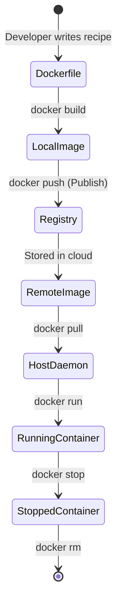
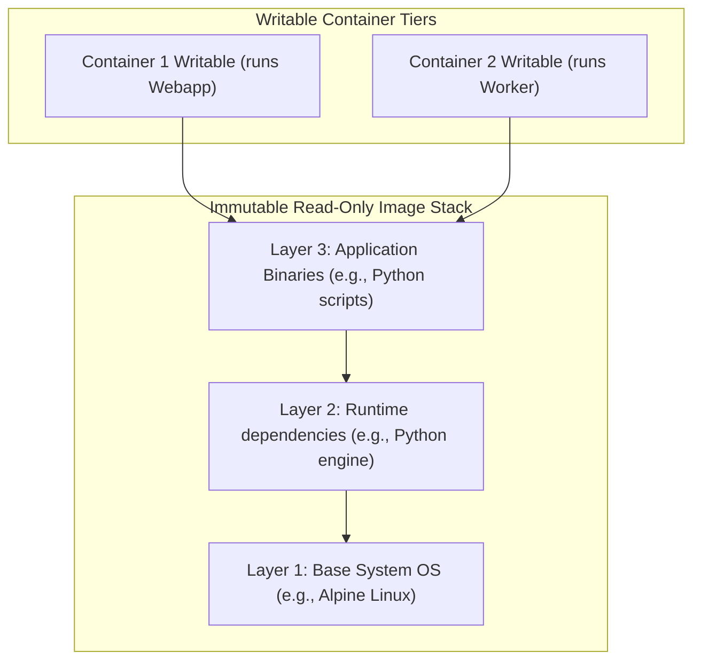

# Module 2 - Container Fundamentals

## 1. Learning Objectives
By the end of this module, you will be able to:
* Explain the concepts of Docker Images, Containers, and Registries.
* Detail the progression flow from a static text file (`Dockerfile`) to a distribution asset (`Image`) to a running process (`Container`).
* Distinguish between images and containers using Object-Oriented Programming (OOP) and culinary analogies.
* Inspect image layers and metadata layouts using the CLI.
* Configure authentication credentials and pull/push images from external registries.
* Run, list, stop, and clean up fundamental containers.
* Troubleshoot image download failures, registry access limits, and dangling image cache consumption.

---

## 2. Introduction
In standard software design, developers compile source code into executable binary assets. For example, Java compiles to `.jar` files, and C compiles to `.exe` files. However, these binaries do not contain the system configuration dependencies, filesystems, and networks needed to run them.

Containerization changes this by distributing software as a complete, self-contained system package called an **Image**. Once running, this package becomes a **Container**.

To explain these concepts, we use two classic analogies: the **Baking Analogy** and the **Object-Oriented Programming (OOP) Analogy**.

### The Baking Analogy
Imagine you want to start a bakery that produces identical chocolate cakes.
* **The Recipe (Dockerfile)**: A text document containing instructions on how to bake the cake (e.g., mix flour, add cocoa, bake at 350°F). You cannot eat a recipe. It is just instructions.
* **The Cake Mix / Cake Blueprint (Docker Image)**: The physical product prepared according to the recipe. It is frozen and packaged in a box. You can copy the box a million times, but it is cold and inactive. It is ready to be baked.
* **The Baked Cake (Docker Container)**: The hot, active, running instance of the cake mix. It occupies space in the real world (host memory). You can cut it, add icing (writable container layer), and eat it.
* **The Recipe Book Store (Docker Registry)**: A public library (like Docker Hub) where bakers share and download recipes and cake mixes.

```
+------------------+     Bake / Freeze     +-------------------+     Thaw / Run     +-----------------------+
|    Dockerfile    | ────────────────────► |    Docker Image   | ─────────────────► |    Docker Container   |
| (Text Recipe)    |                       | (Frozen Cake Mix) |                    | (Active Baked Cake)   |
+------------------+                       +-------------------+                    +-----------------------+
```

### The OOP Analogy
For software developers, the relationship maps directly to Object-Oriented Programming:
* **The Class (Docker Image)**: Defines the data, methods, structure, and attributes. The class is static and lives in your codebase directory.
* **The Object Instance (Docker Container)**: Instantiated in active RAM memory via the `new` operator. You can spin up multiple instances of a class, each maintaining its own isolated state while sharing the same underlying methods.

---

## 3. Why This Topic Exists
In traditional systems administration, deploying software required running installation scripts (like `apt-get install` or custom shell wrappers) on target servers. This introduced several problems:

1. **Non-Atomic Actions**: If an installation script failed midway due to a network timeout, the system was left in a broken, half-configured state.
2. **Slow Rollbacks**: If a software release had a bug, rolling back meant running uninstall scripts, which frequently left orphaned config files or broken dependencies.
3. **No Immutable Artifacts**: There was no single, read-only file representing the application environment. What was tested in staging was not physically the exact same binary package deployed to production.

Docker solves this by packaging the filesystem, binaries, configurations, and environment parameters into a single, immutable, hash-verified archive file: the **Docker Image**. This image guarantees **reproducibility** and **immutability**.

---

## 4. Theory & Internal Mechanics

### What is a Docker Image?
A Docker image is a read-only, multi-layered template that contains the exact filesystem structure, libraries, binaries, configurations, and metadata required to run an application.

#### Core Characteristics:
* **Immutable**: Once built, an image cannot be modified. If you need to change a configuration file, you must build a *new* image.
* **Layered**: Images are composed of stackable layers. If multiple images share the same base Linux operating system (e.g., `ubuntu:22.04`), they share the exact same physical storage layers on disk.
* **OCI Compliant**: Modern images conform to the Open Container Initiative (OCI) Image Specification, defining the manifest layout, layer tarballs, and configuration configurations.

### What is a Docker Container?
A container is a running, writeable instance of a Docker image.

When you start a container, the Docker engine mounts the image's read-only layers using a union filesystem and overlays a thin, writeable layer (known as the **Container Layer**) on top.

```
+-------------------------------------------------------------+
|                     RUNNING CONTAINER                       |
+-------------------------------------------------------------+
|   Thin, Writable Container Layer (All changes go here)      |
+-------------------------------------------------------------+
|   Read-only Layer 3: Application Code & Configs             |
+-------------------------------------------------------------+
|   Read-only Layer 2: Python / Runtime Packages              |
+-------------------------------------------------------------+
|   Read-only Layer 1: Base OS (Ubuntu / Alpine)              |
+-------------------------------------------------------------+
```

Any actions performed by the running container—such as writing log files, modifying configuration files, or installing temporary utilities—are written directly to this thin writable layer. 

If the container is deleted, the thin writable layer is destroyed, and all changes are lost. The underlying read-only image layers remain completely unchanged.

### What is a Docker Registry?
A Docker Registry is a centralized service that stores and distributes Docker images. 
* **Docker Hub**: The default public registry managed by Docker Inc.
* **ECR / ACR / GCR**: Cloud-specific managed registries (Amazon Elastic Container Registry, Azure Container Registry, Google Container Registry).
* **Private Registries**: On-premise secure registries (e.g., Sonatype Nexus, Harbor).

An image is identified by its registry path, repository name, and tag:
```
registry.hub.docker.com/library/ubuntu:22.04
└─────────┬──────────┘ └────┬──┘ └─┬──┘ └─┬─┘
     Registry Host        Owner   Repo   Tag
```

---

## 5. Architecture & Lifecycles

### The Image Lifecycle Map
This diagram shows the path of a container setup from writing a Dockerfile to storing images in a registry:



### Image Layer Layout
Here is how multiple running containers share the same underlying read-only image layers:



---

## 6. Configuration Metadata: The Manifest
Every image includes a JSON configuration metadata file called the **Manifest**. The manifest outlines the layer structural checksums, entrypoint execution configurations, environment configurations, and target CPU architectures.

Example manifest structure:
```json
{
  "schemaVersion": 2,
  "mediaType": "application/vnd.docker.distribution.manifest.v2+json",
  "config": {
    "mediaType": "application/vnd.docker.container.image.v1+json",
    "size": 7023,
    "digest": "sha256:8b8df2af300e84b5c775d7b51c..."
  },
  "layers": [
    {
      "mediaType": "application/vnd.docker.image.rootfs.diff.tar.gzip",
      "size": 2802931,
      "digest": "sha256:a05b31e9c20a8d54d..."
    },
    {
      "mediaType": "application/vnd.docker.image.rootfs.diff.tar.gzip",
      "size": 120421,
      "digest": "sha256:b12f20a9c20d..."
    }
  ]
}
```

---

## 7. Commands Reference

### 7.1 docker pull
* **Purpose**: Downloads an image from a registry to the local image cache.
* **Syntax**: `docker pull [options] NAME[:TAG|@DIGEST]`
* **Arguments**:
  * `-a, --all-tags`: Download all tagged images in the repository.
  * `--platform`: Set platform if server is multi-platform capable (e.g., `linux/amd64`).
* **Example**:
  ```bash
  docker pull alpine:3.19
  ```
* **Output**:
  ```
  3.19: Pulling from library/alpine
  d86a7ff2e4e1: Pull complete
  Digest: sha256:66367b189b83a54d500392f58e4d39c0953a7b1b369c0d51786522cbb54d2417
  Status: Downloaded newer image for alpine:3.19
  docker.io/library/alpine:3.19
  ```
* **Production usage**: Pre-pulling images in CI/CD deployment pipelines before scaling workloads to minimize system startup delays.

### 7.2 docker images
* **Purpose**: Lists all locally cached Docker images.
* **Syntax**: `docker images [options] [REPOSITORY[:TAG]]`
* **Arguments**:
  * `-a, --all`: Show all images (including intermediate layers).
  * `-q, --quiet`: Only show image IDs.
  * `--filter`: Filter output based on conditions (e.g. `dangling=true`).
* **Example**:
  ```bash
  docker images --filter "dangling=true"
  ```
* **Output**:
  ```
  REPOSITORY   TAG       IMAGE ID       CREATED        SIZE
  <none>       <none>    9e84bf9a2c10   2 hours ago    142MB
  ```
* **Production usage**: Automation scripts query `docker images -q` to identify and prune obsolete image caches.

### 7.3 docker rmi
* **Purpose**: Deletes local images from host cache storage.
* **Syntax**: `docker rmi [options] IMAGE [IMAGE...]`
* **Arguments**:
  * `-f, --force`: Force removal of the image (even if used by stopped containers).
  * `--no-prune`: Do not delete untagged parents.
* **Example**:
  ```bash
  docker rmi alpine:3.19
  ```
* **Output**:
  ```
  Untagged: alpine:3.19
  Untagged: alpine@sha256:66367b189b83a54d500392f58e4d39c0953a7b1b369c0d51786522cbb54d2417
  Deleted: sha256:05455a08881ea9cfb0da5b2de4b830d6621f3cd58525bf78e7d23d8c1c4f514b
  ```
* **Common Mistakes**: Attempting to delete an image that is currently referenced by a running or stopped container. You must delete the container (`docker rm`) before removing the image.

### 7.4 docker inspect
* **Purpose**: Returns low-level information on Docker objects (images, containers, volumes, networks) in JSON format.
* **Syntax**: `docker inspect [options] NAME|ID [NAME|ID...]`
* **Arguments**:
  * `-f, --format`: Format JSON parameters using Go templates.
* **Example**:
  ```bash
  docker inspect --format='{{.Config.Image}}' my-running-container
  ```
* **Output**:
  ```
  nginx:alpine
  ```

---

## 8. Practical Labs

### Lab 2.1: Pull, Inspect, and Delete Images
**Goal**: Manage local image caches, inspect JSON layer manifests, and clean up local images.

1. Open your host command shell.
2. Pull the lightweight `alpine` image:
   ```bash
   docker pull alpine:latest
   ```
3. List your local images to verify download:
   ```bash
   docker images
   ```
4. Query the underlying configuration manifest details of the Alpine image using `docker inspect`:
   ```bash
   docker inspect alpine:latest
   ```
   * **Verification Point**: Scroll down to the `RootFS` section of the JSON. Observe the list of filesystem layer digests. For Alpine, there should only be one layer.
5. Attempt to delete the image:
   ```bash
   docker rmi alpine:latest
   ```
   * **Expected Output**: Confirm the terminal outputs `Deleted:` followed by the image layer hashes.

[Insert Screenshot: Terminal showing docker pull and docker inspect execution]

### Lab 2.2: Writable Layer State Isolation
**Goal**: Run two containers from the same image and demonstrate that modifications in one container do not affect the other or the underlying image.

1. Start Container A interactively:
   ```bash
   docker run -it --name container-a alpine sh
   ```
2. Inside Container A, write a temporary text file to the filesystem:
   ```bash
   echo "Hello from Container A" > /tmp/demo-file.txt
   cat /tmp/demo-file.txt
   ```
3. Open a second terminal window. Start Container B from the same Alpine image:
   ```bash
   docker run -it --name container-b alpine sh
   ```
4. Inside Container B, verify that `/tmp/demo-file.txt` does **not** exist:
   ```bash
   cat /tmp/demo-file.txt
   ```
   * **Expected Output**: `cat: can't open '/tmp/demo-file.txt': No such file or directory`
5. Exit both containers.
6. Verify that the original `alpine` image remains clean and unmodified. The changes lived solely in Container A's temporary writable layer.

---

## 9. Real Projects: Deploying a Persistent Cache Layer
In production systems, Redis is used as a high-performance database cache. We will deploy Redis, connect to it, verify its operation, and examine how it manages runtime parameters.

### Step 1: Pull the official production Redis image
```bash
docker pull redis:7.2-alpine
```

### Step 2: Start the Redis container in detached background mode
```bash
docker run -d --name cache-store -p 6379:6379 redis:7.2-alpine
```

### Step 3: Connect to the running Redis container using redis-cli
Execute the interactive redis-cli tool inside the running container process:
```bash
docker exec -it cache-store redis-cli
```
Inside the redis-cli shell, set a value and retrieve it:
```redis
set app_status "active"
get app_status
exit
```

### Step 4: Clean up resources
```bash
docker stop cache-store
docker rm cache-store
```

---

## 10. Troubleshooting & Diagnostics

### 1. Error: "No such image" or "manifest unknown"
* **Error Message**:
  `Error response from daemon: manifest for library/nginx:wrong-tag not found: manifest unknown`
* **Root Cause**: The tag name requested does not exist in the remote repository or has been deleted.
* **Solution**: Check the tag spelling or search for valid tags on [Docker Hub](https://hub.docker.com/).

### 2. Error: "toomanyrequests: Too Many Requests"
* **Error Message**:
  `toomanyrequests: You have reached your pull rate limit.`
* **Root Cause**: Docker Hub enforces rate limits on anonymous pulls (typically 100 pulls per 6 hours per IP address).
* **Solution**: Authenticate with Docker Hub using your credentials to increase limits:
  ```bash
  docker login --username your_username
  ```

### 3. Cleaning Dangling Images
Images without tags (appearing as `<none>:<none>`) are called **dangling images**. They occur when you build an image with an existing tag name, stripping the tag from the older image.
To list dangling images:
```bash
docker images -f "dangling=true"
```
To clean them up:
```bash
docker image prune
```

---

## 11. Production Examples

### Spotify Image Pipelines
Spotify manages a microservice-based architecture composed of thousands of services running across thousands of host nodes. They use automated build pipelines that compile applications into immutable Docker images tagged with unique commit hashes. These images are pushed to a central, high-throughput Docker registry. 

When deploying updates, Spotify's orchestration engine pulls these cached image layers across the cluster. Because common dependency layers are cached locally on each host server, deployments take only a few seconds.

---

## 12. Best Practices
* **Use Specific Image Tags**: Avoid referencing the `latest` tag in production systems. Always pin images to specific versions (e.g., `redis:7.2-alpine`) to prevent breaking changes during automated restarts.
* **Keep Images Small**: Choose lightweight base distributions (like Alpine Linux, which is only 5MB) instead of full operating system images like Ubuntu (which is 70+MB).
* **Minimize Writable Layer Activity**: For high-performance I/O operations (like databases writing data), write to mapped persistent storage volumes rather than the thin writable container layer, which introduces system overhead.

---

## 13. Interview Preparation

### Q1: What is the difference between an Image and a Container?
* **Answer**: An image is a read-only, static package containing the filesystem configuration layers and metadata required to run an application. A container is a running, writable instance of that image. In programming terms, an image is like a Class, while a container is an instantiated Object of that Class.

### Q2: What are dangling images, and how do they occur?
* **Answer**: Dangling images are untagged images that display as `<none>:<none>` in the CLI. They occur when you build a new version of an image using a tag name already assigned to an older image. The tag is moved to the new image, leaving the older image layers untagged and orphaned. They can be cleaned up using the `docker image prune` command.

### Q3: Why is it bad practice to use the `latest` tag in production?
* **Answer**: The `latest` tag is not stable; it simply points to whatever image was most recently pushed to the registry. If a container restarts or auto-scales and pulls `latest`, it may pull a new, untested release containing breaking changes. Pining specific version tags (e.g., `nginx:1.25.3`) ensures deployment stability.

---

## 14. Cheat Sheet
| Task | CLI Command |
|---|---|
| Pull an image | `docker pull <image>:<tag>` |
| List local images | `docker images` |
| Delete an image | `docker rmi <image-id>` |
| Filter dangling images | `docker images -f "dangling=true"` |
| Clean unused images | `docker image prune` |
| View detailed metadata | `docker inspect <image-id>` |

---

## 15. Assignments

### Beginner Assignment
* Pull the latest `busybox` and `ubuntu` images. Use the `docker images` command to list them and identify their physical sizes. Document why the busybox image is significantly smaller than the Ubuntu image.

### Intermediate Assignment
* Pull the `postgres:15-alpine` image. Use `docker inspect` to extract the environment variables defined inside the image's metadata manifest. Write a CLI command that filters this output to return only the default config path (`PGDATA`).

---

## 16. Mini Project
1. Pull the official `nginx:alpine` image.
2. Save the image to a tar archive file named `nginx-alpine-backup.tar` using the command:
   ```bash
   docker save -o nginx-alpine-backup.tar nginx:alpine
   ```
3. Delete the local copy of the image from your Docker cache using `docker rmi`.
4. Load the image back into your Docker cache from the tar archive file:
   ```bash
   docker load -i nginx-alpine-backup.tar
   ```
5. Run the restored container to verify that it is fully operational.

---

## 17. References & Further Reading
* [Docker Image Specification - GitHub](https://github.com/opencontainers/image-spec)
* [OCI Image Manifest Specifications](https://opencontainers.org/)
* [Docker Hub official repository lists](https://hub.docker.com/)
