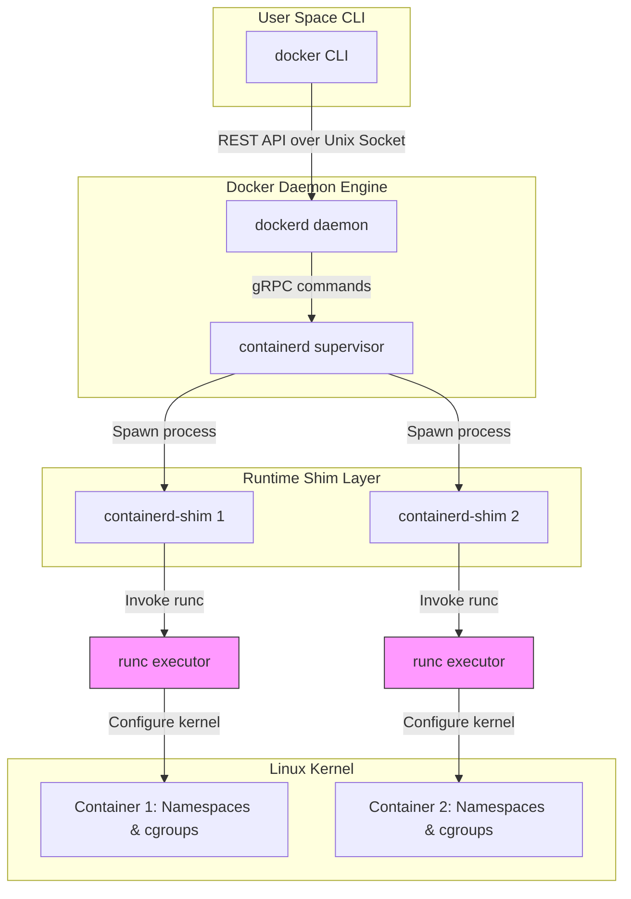

# Module 3 - Docker Architecture & Internals

## 1. Learning Objectives
By the end of this module, you will be able to:
* Outline the component layers of the Docker daemon architecture: `dockerd`, `containerd`, `containerd-shim`, and `runc`.
* Describe the exact system execution pipeline from user CLI request to container process execution.
* Explain the differences between Linux cgroups v1 and cgroups v2, and why driver alignment is critical.
* Diagram the directory structures of OverlayFS: `lowerdir`, `upperdir`, `merged`, and `workdir`.
* Query host-side process structures to locate container processes, system shims, and namespace mappings.
* Troubleshoot daemon-runtime communication failures, cgroup driver mismatches, and orphan shim processes.

---

## 2. Introduction
To the casual user, Docker is simply a single command line tool. You type `docker run` and a application starts. However, under the hood, Docker is not a single monolith. It is a highly modular system composed of multiple decoupled services, each responsible for a distinct phase of the container lifecycle.

To understand Docker's internals, consider the **Airport Ground Control Analogy**.

Imagine a massive international airport.
* **The Airport Director (dockerd)**: Manages high-level bookings, flight approvals, security rules, and customer inquiries. The director does not manually fuel the plane, direct traffic on the runway, or fly the aircraft.
* **The Air Traffic Controller (containerd)**: Coordinates active planes, schedules runways, keeps track of planes currently in transit, and instructs ground crews on which plane blueprint to prepare.
* **The Tug Car / Pushback Tractor (containerd-shim)**: Attaches to a specific airplane during its initial runway push. Once the plane's engines are running, the driver detaches, but stays near the plane to monitor its basic systems. If the main control tower temporarily loses power (rebooting), the tug car ensures the plane doesn't crash or lose direction.
* **The Engine Ignition Starter (runc)**: A highly specialized mechanic who walks up to the plane, starts the engines, sets up the cabin pressure (namespaces), locks the doors (cgroups), and immediately leaves. Once the plane is running, the mechanic's job is done.

This decoupled architecture makes Docker incredibly stable, fast, and compliant with open industry standards.

---

## 3. Why This Topic Exists
In early versions of Docker (pre-1.11), the Docker daemon (`docker daemon`) was a massive monolith. It handled the API client connections, image building, image downloading, volume mapping, network configuration, and container execution directly.

This monolithic design introduced critical production flaws:
1. **Daemon Crash = Cluster Death**: If the Docker daemon crashed or needed an upgrade, **every running container on the server was killed immediately**. There was no way to update Docker without causing a total application outage.
2. **Standard Mismatch**: Other companies wanted to build runtimes or registries, but they could not easily integrate with Docker's private monolithic codebase.

By splitting the daemon into separate components (`dockerd`, `containerd`, `runc`), Docker achieved **zero-downtime upgrades** (via the shim layer) and enabled the creation of the Open Container Initiative (OCI), allowing other systems (like Kubernetes) to reuse the core runtime.

---

## 4. Theory & Internal Mechanics

### The Modular Engine Components

#### 1. dockerd (The Docker Daemon)
The high-level orchestrator. It exposes the REST API socket (`/var/run/docker.sock`) that the client CLI calls. It handles credential management, local image builds, network bridges, volume creation, and authentication.

#### 2. containerd (The Container Supervisor)
A CNCF-hosted project that supervises the container lifecycle. It receives commands from `dockerd` over gRPC, downloads images, extracts filesystems, manages container network interfaces, and prepares the configuration specs for the low-level runtime.

#### 3. containerd-shim (The Connector)
The shim is a small process spawned for every running container. Its purpose is critical:
* **Decouples processes**: It acts as the parent of the container process instead of `containerd` or `dockerd`.
* **Zero-Downtime Daemon Upgrades**: If `dockerd` or `containerd` crash or restart, the container remains running because the shim holds its system file descriptors (stdin, stdout, stderr) open. When the daemon comes back online, it reconnects to the shim.
* **Reporting**: It reports exit status codes back to the daemon when the container process terminates.

#### 4. runc (The Executor)
The low-level OCI reference runtime. `runc` is a lightweight CLI tool that does the heavy lifting:
* It interacts directly with the Linux kernel to create namespaces and control groups.
* It mounts the root filesystem layers.
* It executes the entrypoint process.
* **runc exits immediately** after the container process starts, leaving the container running under the guardianship of the container shim.

---

### Linux Kernel Primitives Deep Dive

#### Namespaces
Namespaces isolate process views. When a container starts, `runc` issues the `clone()` system call with specific flags:

```c
// Conceptual Linux kernel system call made by runc
int container_pid = clone(container_main_function, 
                          container_stack + STACK_SIZE, 
                          CLONE_NEWPID | CLONE_NEWNET | CLONE_NEWNS | CLONE_NEWIPC | CLONE_NEWUTS | SIGCHLD, 
                          NULL);
```

* `CLONE_NEWPID`: Creates a new process ID tree. The container process becomes PID 1.
* `CLONE_NEWNET`: Disconnects the process from the host network stack, giving it a blank loopback interface and isolated routing tables.
* `CLONE_NEWNS`: Creates a new filesystem mount namespace, preventing the container from seeing host folders unless explicitly mounted.

#### Control Groups (cgroups v1 vs v2)
Control Groups limit physical resource consumption.
* **cgroups v1**: Managed resources in separate, parallel folder hierarchies (e.g., `/sys/fs/cgroup/memory` and `/sys/fs/cgroup/cpu`). This made coordinating limits difficult and introduced performance bugs.
* **cgroups v2**: Introduced a unified single-hierarchy model (`/sys/fs/cgroup/system.slice/...`), which makes resource accounting and limiting much cleaner and more stable. Most modern Linux distributions (Ubuntu 22.04+, RHEL 9+) default to cgroups v2.

#### UnionFS & OverlayFS Internals
Docker uses `OverlayFS` as its default storage driver. It merges two directories into a single unified filesystem view:

```
                  MERGED VIEW (What the container sees)
+-------------------------------------------------------------+
|                     /app/config.json (Modified)              |
|                     /app/server.go   (Unmodified)            |
+-------------------------------------------------------------+
                               ▲
      +────────────────────────┴────────────────────────+
      │                                                 │
+─────┴───────────────────────+                   +─────┴───────────────────────+
|          UPPERDIR           |                   |          LOWERDIR           |
| (Writable Container Layer)  |                   |    (Read-only Image)        |
|                             |                   |                             |
|  /app/config.json (New)     |                   |  /app/config.json (Old)     |
|                             |                   |  /app/server.go             |
+─────────────────────────────+                   +─────────────────────────────+
```

* **lowerdir**: The read-only image layers.
* **upperdir**: The container's writable layer. Any new files, modified files, or deleted file markers go here.
* **merged**: The actual mount path presented to the container. The kernel overlays upperdir over lowerdir.
* **workdir**: An internal transactional directory used to prepare files before they are committed to upperdir (helps prevent data corruption).

---

## 5. Component Flow Diagram
Here is the architecture of the components running inside the Docker host:



---

## 6. Commands Reference

### 6.1 lsns (Linux command)
* **Purpose**: Lists all active Linux namespaces on the host system.
* **Syntax**: `lsns [options]`
* **Arguments**:
  * `-t <type>`: Filter by namespace type (mnt, net, pid, ipc, uts, user).
* **Example**:
  ```bash
  sudo lsns -t net
  ```
* **Output**:
  ```
          NS TYPE NPROCS   PID USER    NETNSID NSFS
  4026531992 net      98     1 root          unassigned
  4026532241 net       1 12040 root          0 /run/netns/default
  ```
* **Production usage**: System administrators run this to identify orphaned network interfaces or trace network routing paths.

### 6.2 docker info (cgroup driver verification)
* **Purpose**: Query cgroup driver settings of the Docker engine.
* **Syntax**: `docker info --format '{{.CgroupDriver}}'`
* **Example**:
  ```bash
  docker info --format '{{.CgroupDriver}}'
  ```
* **Output**:
  ```
  systemd
  ```
* **Production usage**: Ensures the Docker daemon uses the `systemd` cgroup driver on Kubernetes host nodes, which prevents resource limit conflicts.

---

## 7. Practical Labs

### Lab 3.1: Trace the containerd-shim Process Tree on the Host
**Goal**: Start a container and trace the parent-child process tree on the host operating system to verify namespace separation.

1. Start a detached, long-running container:
   ```bash
   docker run -d --name trace-demo alpine sleep 3600
   ```
2. Find the host Process ID (PID) of the container process:
   ```bash
   docker inspect --format '{{.State.Pid}}' trace-demo
   ```
   * *Assume the output PID is `14520`.*
3. On the Linux host system, inspect the process hierarchy:
   ```bash
   ps -efj | grep 14520
   ```
   * **Expected Output**: You will see that the parent process of `14520` is `containerd-shim`.
4. Run `pstree` (if available on your host) to view the visual tree:
   ```bash
   pstree -p -s 14520
   ```
   * **Expected Output**: `systemd(1)───containerd(1020)───containerd-shim(14490)───sleep(14520)`
   * Notice that `runc` is nowhere to be seen because it exited immediately after spawning the container.

[Insert Screenshot: Terminal showing pstree process tree]

### Lab 3.2: Verify OverlayFS Directory Layers
**Goal**: Locate the physical file paths on the host system where OverlayFS mounts the container layers.

1. Start a container and modify a file inside it:
   ```bash
   docker run -it --name layer-demo alpine sh
   ```
2. Inside the container, write a unique file:
   ```bash
   echo "Under the hood details" > /root/internals.txt
   exit
   ```
3. Inspect the container configuration to find the storage paths:
   ```bash
   docker inspect layer-demo | grep -A 10 GraphDriver
   ```
   * **Expected Output**: You will see a JSON block containing keys for `LowerDir`, `UpperDir`, `MergedDir`, and `WorkDir`.
4. Switch to your root host user shell and list the contents of the `UpperDir` directory:
   ```bash
   sudo ls -la /var/lib/docker/overlay2/<long-id-string>/diff/root/
   ```
   * **Expected Output**: You will see `internals.txt` sitting inside the directory on the host's physical hard drive. This proves that any write actions inside a container are written to a specific host folder mapped by the OverlayFS driver.

---

## 8. Real Projects: Custom daemon.json Configuration
In this project, we will configure the Docker daemon to output debug logs and explicitly enforce cgroups limits.

### Step 1: Open the Docker daemon configuration file
Open `/etc/docker/daemon.json` (create it if it does not exist):
```json
{
  "exec-opts": ["native.cgroupdriver=systemd"],
  "log-level": "info",
  "storage-driver": "overlay2"
}
```

### Step 2: Restart the Docker service to apply changes
```bash
sudo systemctl restart docker
```

### Step 3: Verify the configuration changes
```bash
docker info | grep -i "cgroup driver"
```
* **Expected Output**: `Cgroup Driver: systemd`

---

## 9. Troubleshooting & Diagnostics

### 1. Error: "cgroup driver mismatch"
* **Symptoms**: The Docker daemon fails to start, or Kubernetes fails to spin up pods on the node.
* **Root Cause**: The host system uses systemd as its init manager, but the Docker daemon is configured to use the legacy `cgroupfs` driver. Having two different managers monitor resources leads to instability.
* **Solution**: Edit `/etc/docker/daemon.json`, add `"exec-opts": ["native.cgroupdriver=systemd"]`, and restart Docker.

### 2. Orphan Shim Processes
* **Symptoms**: The host machine runs slowly or runs out of process IDs (PIDs), but `docker ps` shows no running containers.
* **Root Cause**: If the Docker daemon crashes or is terminated forcefully (e.g. `kill -9`), container-shim processes may become orphaned, leaving containers running without daemon awareness.
* **Solution**: Identify orphan shims using `ps -ef | grep containerd-shim` and terminate them manually using `kill <shim-pid>`.

---

## 10. Production Examples

### Kubernetes & Containerd
Historically, Kubernetes called the Docker daemon to run containers. However, because `dockerd` introduced unnecessary overhead (like image building and REST API processing), the Kubernetes community bypassed Docker. Today, Kubernetes uses the Container Runtime Interface (CRI) to talk directly to `containerd`, streamlining production performance.

---

## 11. Best Practices
* **Use systemd Cgroup Driver**: Always align the container engine's cgroup driver with the host OS init system (`systemd`) in production environments.
* **Enable Live Restore**: Enable `"live-restore": true` in `daemon.json` to allow daemon updates without causing downtime for running containers.
* **Monitor Host Disk Usage**: Monitor the storage usage of `/var/lib/docker/overlay2/` to prevent host disk exhaustion.

---

## 12. Interview Preparation

### Q1: What is the purpose of `containerd-shim`?
* **Answer**: `containerd-shim` is a small helper process spawned for every container. It serves three main purposes:
  1. It handles container I/O streams (stdin/stdout/stderr) and exits codes.
  2. It keeps the container running even if the main Docker daemon or containerd restarts (enabling zero-downtime upgrades).
  3. It prevents containerd from having to maintain persistent open connections to every running container process.

### Q2: How does OverlayFS work? Explain `lowerdir` and `upperdir`.
* **Answer**: OverlayFS is a union filesystem driver that merges multiple directories into a single view. The `lowerdir` contains the read-only layers of the Docker image. The `upperdir` represents the writable container layer. When a container reads a file, it is loaded from `lowerdir` (or `upperdir` if modified). When a container writes or modifies a file, the changes are written exclusively to the `upperdir`.

### Q3: What is the difference between cgroups v1 and cgroups v2?
* **Answer**: cgroups v1 used separate, parallel hierarchies for each resource class (CPU, memory, disk I/O), which led to resource allocation conflicts. cgroups v2 introduces a unified resource hierarchy, enabling cleaner resource accounting, better stability, and easier configuration.

---

## 13. Cheat Sheet
| Component | Purpose |
|---|---|
| `dockerd` | High-level orchestrator, handles API calls |
| `containerd` | CNCF container lifecycle manager |
| `containerd-shim` | Process decoupling and zero-downtime connection keeper |
| `runc` | Low-level OCI executor, configures namespaces & cgroups |

---

## 14. Assignments

### Beginner Assignment
* Run a container in the background. Trace its process ID (PID) on the host machine using `docker inspect` and the Linux `ps` command. Take note of its parent process.

### Intermediate Assignment
* Stop the Docker daemon (`sudo systemctl stop docker`) while a container is running. Verify if the container is still running by checking the host process list. Document your findings and explain why the container did or did not survive.

---

## 15. Mini Project
Write a bash script that takes a container name as an argument, finds its host PID, and prints the namespace paths from `/proc/<PID>/ns/` for each namespace type.

---

## 16. References & Further Reading
* [containerd Architecture and Specifications](https://containerd.io/docs/)
* [runc GitHub repository documentation](https://github.com/opencontainers/runc)
* [OverlayFS Kernel documentation](https://www.kernel.org/doc/Documentation/filesystems/overlayfs.txt)
