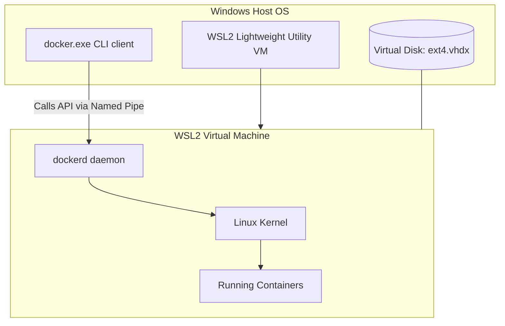

# Module 4 - Installation & Environment Setup

## 1. Learning Objectives
By the end of this module, you will be able to:
* Explain the virtualization methods used by Docker Desktop on Windows (WSL2) and macOS (Hypervisor.framework) compared to native Linux setups.
* Write a `.wslconfig` configuration file to constrain and optimize memory and CPU allocations for WSL2.
* Configure the Docker daemon to routing traffic through enterprise corporate proxies and secure registry mirrors.
* Create and manage multiple **Docker Contexts** to securely control remote Docker daemons over SSH.
* Implement an air-gapped Docker installation from raw binary tarballs.
* Troubleshoot host virtualization BIOS flags, GPG key validation errors, and context network timeouts.

---

## 2. Introduction
Before you can run containerized applications, you must install the runtime engine. While installing Docker on a personal laptop is often as simple as clicking an installer, running Docker in an enterprise environment requires a deep understanding of the virtualization layers, networking proxies, and resource boundaries.

To understand installation differences, consider the **Factory Space Analogy**.

* **Native Linux (The Factory Floor)**: Docker runs natively on Linux. Since containers are just Linux processes, there is no translation layer. The factory floor is right on the ground, and machines operate with zero overhead.
* **Windows with WSL2 (The Prefabricated Warehouse)**: Windows cannot run Linux processes directly. Windows Subsystem for Linux (WSL2) acts as a highly optimized, lightweight virtual warehouse built inside your main Windows factory. Inside this warehouse, a real Linux kernel runs, enabling native-speed container operations.
* **macOS (The Floating Dock)**: macOS is Unix-based but uses a completely different kernel than Linux. Docker Desktop on macOS must spin up a lightweight, virtualized Linux system (a floating dock) to run containers.

Depending on your host operating system, you will leverage different virtualization layers and resource constraints.

---

## 3. Why This Topic Exists
In local development, a common issue is **Host Resource Exhaustion**. By default, WSL2 on Windows can consume up to 50% (or more) of the host system's total RAM. If a developer runs a resource-intensive database container, WSL2 will expand to consume host memory, but it does not always return that memory to Windows when the container stops. This causes the host operating system to freeze.

Furthermore, enterprise environments are heavily protected by **Corporate Proxies** and **Private Registries**. A default out-of-the-box installation will fail to pull public images because its network traffic is blocked by corporate firewalls. 

This module teaches you how to configure resource limits, set up network paths, and establish secure remote connections.

---

## 4. Theory & Internal Mechanics

### Virtualization Mechanics across Platforms

#### 1. Windows with WSL2
WSL2 uses a lightweight utility VM to run a real Linux kernel.
* **WSL2 Integration**: Docker Desktop starts two specialized WSL2 distributions in the background: `docker-desktop` (the management engine) and `docker-desktop-data` (where images and containers are stored).
* **Virtual Disk Scaling**: Virtual disks are stored as `.vhdx` files. On Windows, they grow dynamically as you pull images, but they do not automatically shrink when you delete them.

#### 2. macOS Virtualization
macOS uses the native `Hypervisor.framework` to run a lightweight Linux VM in the background.
* **Architecture Mismatches**: On Apple Silicon (M1/M2/M3), Docker Desktop uses **Rosetta 2** to run Intel (`linux/amd64`) containers on ARM architecture. While convenient, running non-native images introduces performance overhead and emulation latency.

#### 3. Native Linux
On Linux, there is no virtual machine layer. Containers share the host kernel directly. This provides maximum I/O, network, and CPU speed, which is why **production environments run exclusively on native Linux**.

---

### WSL2 Component Diagram
This diagram shows how Windows routes calls to the Linux kernel running inside WSL2:



---

## 5. Environment Configurations

### 5.1 Restricting WSL2 Resource Usage (`.wslconfig`)
To prevent WSL2 from consuming all host RAM, create a configuration file at `C:\Users\<YourUsername>\.wslconfig`:

```ini
[wsl2]
# Limit memory allocation to 4GB
memory=4GB
# Limit CPU cores to 2
processors=2
# Enable localhost port sharing
localhostForwarding=true
```

To apply changes, open PowerShell and restart WSL:
```powershell
wsl --shutdown
```

### 5.2 Configuring Enterprise Proxies
If you are behind a corporate proxy, the Docker daemon must be configured to route traffic through the proxy.

#### For Linux (Systemd configuration):
1. Create a systemd drop-in directory:
   ```bash
   sudo mkdir -p /etc/systemd/system/docker.service.d
   ```
2. Create a file named `/etc/systemd/system/docker.service.d/http-proxy.conf`:
   ```ini
   [Service]
   Environment="HTTP_PROXY=http://proxy.example.com:8080/"
   Environment="HTTPS_PROXY=https://proxy.example.com:8080/"
   Environment="NO_PROXY=localhost,127.0.0.1,docker-registry.internal.com"
   ```
3. Reload systemd and restart Docker:
   ```bash
   sudo systemctl daemon-reload
   sudo systemctl restart docker
   ```

---

## 6. Commands Reference

### 6.1 docker context
* **Purpose**: Manages multiple environments (contexts) to control different Docker daemons (local, remote VMs, cloud engines) from a single host CLI.
* **Syntax**: `docker context [command]`
* **Subcommands**:
  * `create`: Create a new context.
  * `ls`: List available contexts.
  * `use`: Switch to a context.
* **Example (Create context for a remote Linux VM over SSH)**:
  ```bash
  docker context create remote-server --docker "host=ssh://user@192.168.1.50"
  ```
* **Output**:
  ```
  remote-server
  Successfully created context "remote-server"
  ```
* **Production usage**: Developers use contexts to control production or staging clusters directly from their local terminal without needing to SSH into the servers manually.

---

## 7. Practical Labs

### Lab 4.1: Configure and Switch Docker Contexts
**Goal**: Create a new context, configure SSH authentication, and use the local CLI to manage a remote Docker engine.

1. Generate an SSH key-pair (if you don't have one):
   ```bash
   ssh-keygen -t ed25519 -N "" -f ~/.ssh/id_docker
   ```
2. Copy the key to your remote server or VM:
   ```bash
   ssh-copy-id -i ~/.ssh/id_docker user@192.168.1.50
   ```
3. Create a new context pointing to the remote server:
   ```bash
   docker context create prod-vm --docker "host=ssh://user@192.168.1.50"
   ```
4. List available contexts:
   ```bash
   docker context ls
   ```
   * **Verification Point**: Look for the active context marked with an asterisk (`*`). By default, it will be `default`.
5. Switch to the remote context:
   ```bash
   docker context use prod-vm
   ```
6. Run `docker ps` or `docker info`. 
   * **Expected Result**: The output will display information from the remote server, not your local machine.
7. Switch back to your local engine:
   ```bash
   docker context use default
   ```

[Insert Screenshot: Terminal showing docker context ls and context switching]

---

## 8. Real Projects: Air-Gapped Installation
In highly secure government, financial, or corporate environments, servers do not have internet access. This is known as an **air-gapped environment**. In this project, we will install Docker natively on a Linux system using offline binaries.

### Step 1: Download the official binaries on an internet-connected machine
Download the tarball containing the engine binaries:
```bash
wget https://download.docker.com/linux/static/stable/x86_64/docker-26.0.0.tgz
```

### Step 2: Transfer the tarball to the air-gapped machine
Use a secure USB drive or internal file transfer network.

### Step 3: Extract the binaries
On the air-gapped machine, extract the archive:
```bash
tar -xvzf docker-26.0.0.tgz
```

### Step 4: Move the binaries to the system path
```bash
sudo cp docker/* /usr/bin/
```

### Step 5: Configure the Systemd service manually
Create `/etc/systemd/system/docker.service`:
```ini
[Unit]
Description=Docker Application Container Engine
Documentation=https://docs.docker.com
After=network-online.target firewalld.service
Wants=network-online.target

[Service]
Type=notify
ExecStart=/usr/bin/dockerd
ExecReload=/bin/kill -s HUP $MAINPID
LimitNOFILE=infinity
LimitNPROC=infinity
TasksMax=infinity
TimeoutStartSec=0
Delegate=yes
KillMode=process
Restart=on-failure

[Install]
WantedBy=multi-user.target
```

### Step 6: Start the service
```bash
sudo systemctl daemon-reload
sudo systemctl enable docker
sudo systemctl start docker
docker version
```

---

## 9. Troubleshooting & Diagnostics

### 1. Error: "WSL 2 kernel update required"
* **Symptoms**: Docker Desktop on Windows fails to start, displaying a popup warning about WSL.
* **Root Cause**: The host operating system's WSL subsystem contains an outdated Linux kernel package that lacks modern namespace compatibility.
* **Solution**: Run `wsl --update` in PowerShell as Administrator, then restart the machine.

### 2. Error: "ssh: handshake failed" (Context creation)
* **Symptoms**: Running `docker context use prod-vm` followed by any docker command fails with connection errors.
* **Root Cause**: The SSH key is not added to the SSH agent, or the SSH service on the target machine does not allow key authentication.
* **Solution**: Run `ssh-add ~/.ssh/id_docker` to register your credentials, and verify you can login via standard SSH without a password.

---

## 10. Production Examples

### Enterprise Proxy Traps
Large financial organizations route all external internet calls through proxy firewalls. If a developer tries to build an image that downloads packages (e.g. `npm install` or `pip install`), the build will fail unless the corporate proxy certificates are injected into the build environment. This is managed by configuring the proxy addresses inside the daemon configuration.

---

## 11. Best Practices
* **Constrain WSL2 Resources**: Always set CPU and RAM limits in `.wslconfig` on Windows hosts to prevent system freezes.
* **Use Named Contexts**: Avoid manually typing `-H` (host flag) to run commands on remote servers. Use `docker context` to avoid accidental commands on production hosts.
* **Verify Repository GPG Keys**: Always verify GPG keys when configuring Docker repositories on Linux to prevent MITM security threats.

---

## 12. Interview Preparation

### Q1: How does Docker Desktop run on Windows if Windows does not natively support Linux namespaces?
* **Answer**: Docker Desktop on Windows utilizes Windows Subsystem for Linux (WSL2). WSL2 spins up a lightweight utility virtual machine containing a real, custom-built Linux kernel. Docker Desktop runs the daemon inside this WSL2 VM, allowing container processes to run natively using Linux kernel primitives.

### Q2: What is the purpose of Docker Contexts?
* **Answer**: Docker Contexts allow you to define connection profiles for different Docker engines (local, staging VMs, production clusters). By switching contexts via `docker context use <name>`, you can control remote engines from your local CLI.

### Q3: How do you configure a Docker daemon to pull images through a proxy firewall?
* **Answer**: You configure the proxy by creating a systemd drop-in configuration file (`http-proxy.conf`) containing environment variables for `HTTP_PROXY`, `HTTPS_PROXY`, and `NO_PROXY`.

---

## 13. Cheat Sheet
| Task | Command |
|---|---|
| Configure WSL limits | Edit `~/.wslconfig` |
| List contexts | `docker context ls` |
| Create context | `docker context create <name> --docker "host=ssh://<user>@<ip>"` |
| Switch context | `docker context use <name>` |
| Test connection | `docker ping` |

---

## 14. Assignments

### Beginner Assignment
* Install Docker on your system, create a remote VM (or a local VM using VirtualBox/Multipass), configure SSH key authentication, and establish a new Docker Context linking your host machine to the VM.

### Intermediate Assignment
* Create a `.wslconfig` file on your Windows host that limits WSL2 to 2GB of RAM and 1 CPU core. Start Docker Desktop and verify that the resource limits have been applied by running `docker info`.

---

## 15. Mini Project
Write a shell script that automates the deployment of a Docker daemon on a remote Linux server via SSH, configures it to use Google's DNS servers (`8.8.8.8`), and registers a new context on your local development machine.

---

## 16. References & Further Reading
* [WSL 2 settings configuration documentation](https://learn.microsoft.com/en-us/windows/wsl/wsl-config)
* [Docker Desktop on macOS Virtualization internals](https://docs.docker.com/desktop/mac/)
* [Docker Context Management Reference Guide](https://docs.docker.com/engine/context/working-with-contexts/)
