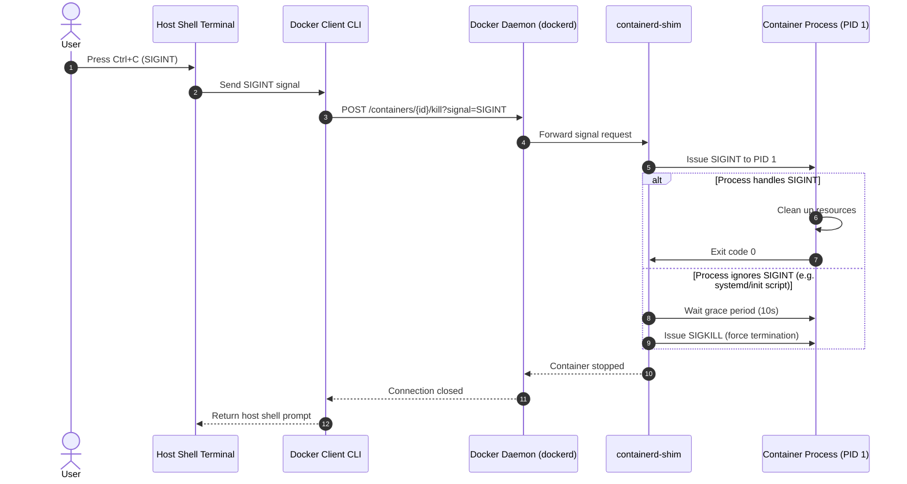

# Module 5 - Docker CLI & Essential Commands

## 1. Learning Objectives
By the end of this module, you will be able to:
* Describe the execution translation pipeline from local CLI command invocation to REST API payload transmissions.
* Run containers in interactive (`-it`) and detached (`-d`) modes, explaining stdin, stdout, and TTY routing.
* Write Go template query filters using the `--format` flag to parse complex JSON metadata from `docker inspect`.
* Administer running workloads using essential commands (`run`, `exec`, `stop`, `rm`, `ps`, `logs`, `inspect`).
* Troubleshoot host port conflicts, container auto-exits, and log buffer blockage.

---

## 2. Introduction
To control the Docker engine, you use the Docker Command Line Interface (CLI). The CLI is not the engine itself; it is a client program that translates your human-readable commands into REST API calls and sends them to the background daemon.

To understand the CLI, consider the **Cockpit Analogy**.

Imagine piloting a modern passenger jet.
* **The Cockpit Knobs & Lever (The CLI)**: The physical interfaces the pilot touches. When the pilot pulls the landing gear lever, the lever does not physically pull a wire to drop the wheels.
* **The Flight Computer (The REST API)**: The lever sends an electrical signal representing the request.
* **The Hydraulic Actuators (The Daemon/Engine)**: The flight computer processes the request, checks safety parameters, and instructs the hydraulic pumps to drop the wheels.

Whether you run a single container locally or automate deployments inside CI/CD scripts, you must understand how commands are parsed, how resources are mapped, and how terminal streams are routed.

---

## 3. Why This Topic Exists
In local development, a common point of confusion is **Why does my container exit immediately?** 

A developer runs:
```bash
docker run -d ubuntu
```
They expect a persistent running virtual machine environment. However, when they type `docker ps`, the container is gone. They check `docker ps -a` and see the container status is `Exited (0)`. 

Without understanding that a container requires a persistent foreground process (PID 1) and terminal stdin/TTY allocation to remain active, they will struggle to run basic workloads. This module explains the container lifecycle, terminal allocation, and process execution mechanics.

---

## 4. Theory & Internal Mechanics

### Shell Streaming: Interactive vs Detached Modes

When you execute a command inside a terminal, there are three primary standard streams:
1. **stdin (Standard Input - File Descriptor 0)**: Input from your keyboard.
2. **stdout (Standard Output - File Descriptor 1)**: Output text written to your terminal.
3. **stderr (Standard Error - File Descriptor 2)**: Error logs written to your terminal.

```
       +-----------------------------------------------+
       |               HOST TERMINAL                   |
       +──────┬────────────────────────────────┬───────+
              │                                ▲
        stdin │ (Keyboard)              stdout │ (Screen)
              ▼                                │
  +───────────┴────────────────────────────────┴───────────+
  |                   DOCKER CLIENT CLI                    |
  +───────────┬────────────────────────────────┴───────────+
              │                                ▲
              │ REST API over Unix Socket      │ stdout / stderr Streams
              ▼                                │
  +───────────┴────────────────────────────────┴───────────+
  |                CONTAINER EXECUTION ENGINE              |
  |                                                        |
  |  [stdin (FD 0)] ────►  Container Process  ───► [stdout]|
  |  [-i flag]             (PID 1)                 [-t TTY]|
  +────────────────────────────────────────────────────────+
```

* **`-i` (Interactive)**: Keeps the host's `stdin` open to the container, even if not attached. This allows you to type input to the container process.
* **`-t` (TTY)**: Allocates a pseudo-TTY (teletypewriter) terminal connection. This formats the terminal output, adding color support and prompt formatting (e.g., `root@container:/#`).
* **`-d` (Detached)**: Routes container output streams to background log buffers instead of your terminal. The CLI prints the container ID and exits immediately, returning control to your host shell prompt.

### Output Formatting with Go Templates
By default, Docker commands return structured text tables. In automated scripts, parsing tables is fragile. Docker supports formatting output using Go templates and the `--format` flag.

Common format parameters:
* `{{.ID}}`: Object UUID.
* `{{.Names}}`: Container name.
* `{{.State}}`: Running status.

---

## 5. Terminal Signal Propagation
When you issue a terminate signal (like pressing `Ctrl+C` in your host terminal), the signal must be routed from the CLI down to the running container process:



---

## 6. Commands Reference

### 6.1 docker run
* **Purpose**: Creates and starts a container from an image.
* **Syntax**: `docker run [options] IMAGE [COMMAND] [ARG...]`
* **Arguments**:
  * `-d, --detach`: Run container in background and print container ID.
  * `-p, --publish`: Map a host port to a container port (e.g., `-p 8080:80`).
  * `-v, --volume`: Mount a host volume (e.g., `-v /host/path:/container/path`).
  * `--name`: Assign a custom name to the container.
  * `--rm`: Automatically remove the container when it exits.
* **Example**:
  ```bash
  docker run -d -p 8080:80 --name web-nginx --rm nginx:alpine
  ```
* **Output**:
  ```
  f8b209d8c7ea1b20a300e84b5c775d7b51c...
  ```

### 6.2 docker exec
* **Purpose**: Runs a new command inside an *already running* container.
* **Syntax**: `docker exec [options] CONTAINER COMMAND [ARG...]`
* **Arguments**:
  * `-it`: Run the command interactively (opens a shell).
  * `-u, --user`: Username or UID to execute command as.
* **Example**:
  ```bash
  docker exec -it web-nginx sh
  ```

### 6.3 docker ps
* **Purpose**: Lists containers.
* **Syntax**: `docker ps [options]`
* **Arguments**:
  * `-a, --all`: Show all containers (default shows only running).
  * `-q, --quiet`: Only display container IDs.
  * `-f, --filter`: Filter output based on conditions (e.g., `status=exited`).
* **Example**:
  ```bash
  docker ps -a --filter "status=exited" --format "table {{.ID}}\t{{.Names}}\t{{.Status}}"
  ```
* **Output**:
  ```
  CONTAINER ID   NAMES        STATUS
  f8b209d8c7ea   web-nginx    Exited (0) 2 minutes ago
  ```

### 6.4 docker logs
* **Purpose**: Fetches the logs of a container.
* **Syntax**: `docker logs [options] CONTAINER`
* **Arguments**:
  * `-f, --follow`: Stream logs in real-time.
  * `-n, --tail`: Output a specific number of lines from the end of the logs.
  * `-t, --timestamps`: Add timestamps to log lines.
* **Example**:
  ```bash
  docker logs -f --tail 10 web-nginx
  ```

---

## 7. Practical Labs

### Lab 5.1: Web Application Deployment & Port Mapping
**Goal**: Run a background Nginx container, map a host port to the container, verify routing, inspect state, and clean up.

1. Start Nginx in the background on port `8080` of your host:
   ```bash
   docker run -d --name web-server -p 8080:80 nginx:alpine
   ```
2. Verify the container is running and check port mappings:
   ```bash
   docker ps
   ```
   * **Verification Point**: Look for the `PORTS` column. It should show `0.0.0.0:8080->80/tcp`.
3. Open your browser and navigate to `http://localhost:8080` (or run `curl http://localhost:8080` in your terminal).
   * **Expected Result**: You will see the default Nginx welcome page.
4. Stream the container logs to view the access log:
   ```bash
   docker logs --tail 5 web-server
   ```
   * Notice your HTTP request is logged showing HTTP status 200.
5. Inspect the container's IP address inside the internal Docker network using Go formatting:
   ```bash
   docker inspect --format='{{range .NetworkSettings.Networks}}{{.IPAddress}}{{end}}' web-server
   ```
   * **Expected Output**: An IP address like `172.17.0.2`.
6. Terminate and clean up the container:
   ```bash
   docker stop web-server
   |docker rm web-server
   ```

[Insert Screenshot: Terminal showing docker run, curl validation, and docker logs output]

---

## 8. Real Projects: Automated Log Monitor Script
In production environments, disk space is critical. This bash script checks for containers whose log files have exceeded 50MB and runs log rotation checks.

### Step 1: Create the monitoring script
Create `~/docker-sandbox/scripts/log-cleaner.sh`:
```bash
cat << 'EOF' > ~/docker-sandbox/scripts/log-cleaner.sh
#!/bin/bash
echo "=== Starting Docker Log Audits ==="
containers=$(docker ps -q)

for id in $containers; do
  # Find physical log path on host
  log_path=$(docker inspect --format='{{.LogPath}}' $id)
  if [ -f "$log_path" ]; then
    size=$(du -m "$log_path" | cut -f1)
    name=$(docker inspect --format='{{.Name}}' $id | tr -d '/')
    echo "Container: $name | Log Size: ${size}MB"
    
    if [ "$size" -gt 50 ]; then
      echo "⚠️ Log file for $name is too large! Truncating..."
      # Safely clear the log file without stopping the container
      sudo truncate -s 0 "$log_path"
    fi
  fi
done
echo "=== Audit Complete ==="
EOF

chmod +x ~/docker-sandbox/scripts/log-cleaner.sh
```

---

## 9. Troubleshooting & Diagnostics

### 1. Error: "port is already allocated"
* **Error Message**:
  `Error response from daemon: driver failed programming external connectivity on endpoint: Bind for 0.0.0.0:8080 failed: port is already allocated`
* **Root Cause**: Another application on your host machine (or another Docker container) is already listening on port 8080.
* **Solution**: Check what is running on that port:
  * **On Linux**: `sudo netstat -tulpn | grep 8080`
  * **On Windows**: `netstat -ano | findstr 8080`
  * Start your container on a different host port: `-p 9090:80`.

### 2. Container Exits Immediately (Status 0 or 1)
* **Symptoms**: Running a container in the background (e.g. `docker run -d ubuntu`) exits immediately.
* **Root Cause**: A container only runs as long as its primary process (PID 1) is active. The default process for Ubuntu is `/bin/bash`. Because `bash` does not run as a daemon and has no input terminal attached when run with `-d`, it exits immediately.
* **Solution**: Force a persistent foreground execution:
  ```bash
  docker run -d ubuntu sleep 3600
  ```

---

## 10. Production Examples

### CI/CD Pipeline Automation
In automated pipelines (such as GitHub Actions or Jenkins), operators use the `--format` flag to check the status of services:
```bash
if [ "$(docker inspect --format='{{.State.Running}}' db-service)" = "true" ]; then
  echo "Database is ready."
fi
```
This prevents pipelines from executing integration tests before dependencies are fully initialized.

---

## 11. Best Practices
* **Explicitly Name Containers**: Avoid random names like `focused_newton`. Use `--name app-service` to write reliable scripts.
* **Configure Log Rotation**: Always configure log limits (`max-size` and `max-file` in `daemon.json`) to prevent host filesystem crashes.
* **Never Run with `-it` in Pipelines**: CI/CD pipelines do not have keyboards attached. Running commands with interactive flags inside scripts will cause the pipeline to freeze.

---

## 12. Interview Preparation

### Q1: What is the difference between `docker run` and `docker exec`?
* **Answer**: `docker run` creates and starts a *new* container from an image. `docker exec` runs a new command inside an *already running* container.

### Q2: Why does `docker run -d ubuntu` exit immediately, and how do you fix it?
* **Answer**: A container exits when its primary foreground process (PID 1) terminates. The default command for the Ubuntu image is `/bin/bash`. Since `bash` has no interactive terminal attached when run in detached mode (`-d`), it exits immediately. You can fix this by overriding the default command with a long-running process (e.g., `docker run -d ubuntu sleep 3600`) or running it interactively (e.g., `docker run -it ubuntu`).

### Q3: How do you extract the IP address of a container using `docker inspect`?
* **Answer**: You can use the `--format` flag with Go template syntax:
  `docker inspect --format='{{range .NetworkSettings.Networks}}{{.IPAddress}}{{end}}' <container-name>`

---

## 13. Cheat Sheet
| Task | CLI Command |
|---|---|
| Run background container | `docker run -d -p <host-port>:<container-port> --name <name> <image>` |
| View active containers | `docker ps` |
| View all containers | `docker ps -a` |
| Get container logs | `docker logs -f --tail 100 <name>` |
| Execute command inside container | `docker exec -it <name> <command>` |
| Stop container | `docker stop <name>` |
| Remove container | `docker rm <name>` |

---

## 14. Assignments

### Beginner Assignment
* Spin up a detached Nginx container named `test-nginx` on port `8085`. Inspect its logs to verify startup, execute a shell inside it, find where the default web files are located (`/usr/share/nginx/html`), exit the shell, and remove the container.

### Intermediate Assignment
* Write a single-line command using `docker inspect` and the `--format` flag that returns the following comma-separated string for a container: `<Container Name>,<IP Address>,<Current State>`.

---

## 15. Mini Project
Write a shell script that checks if a container named `web-app` is running. If it is stopped or missing, the script should start a new instance of `nginx:alpine` named `web-app` on port `80` and append a timestamped entry to a log file (`~/app-recovery.log`).

---

## 16. References & Further Reading
* [Docker Command Line Interface (CLI) Reference](https://docs.docker.com/engine/reference/commandline/cli/)
* [Go Template Package Documentation](https://pkg.go.dev/text/template)
* [Linux Standard Streams (stdin, stdout, stderr) - Wikipedia](https://en.wikipedia.org/wiki/Standard_streams)
