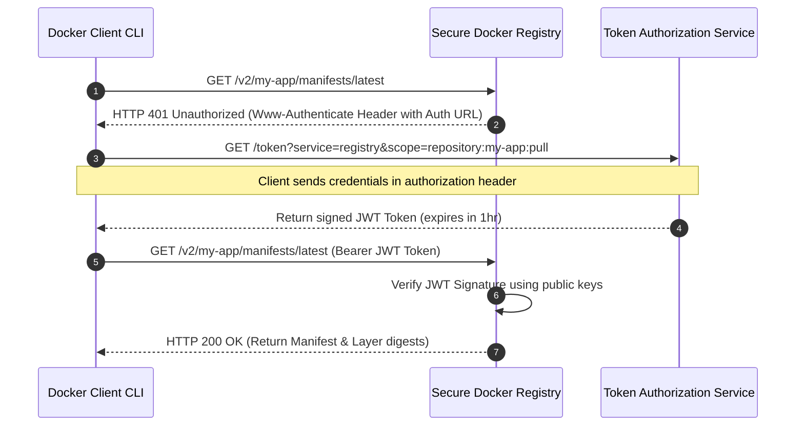

# Module 6 - Images, Layers & Registries

## 1. Learning Objectives
By the end of this module, you will be able to:
* Explain Content-Addressable Storage (CAS) and how Docker uses SHA256 hashes to reference image layers.
* Describe the Registry OAuth2 Token authentication handshake sequence.
* Build and publish multi-platform images using `docker buildx` and QEMU.
* Run a secure local private registry container and push images to it.
* Troubleshoot layer cache invalidation errors, registry authentication failures, and multi-arch build mismatches.

---

## 2. Introduction
In traditional software delivery, you download a complete, single installer file. If you download a patch, you must download a new installer or a massive patch archive. In containerized environments, software is structured as a stack of modular, read-only layers. If two different applications share the same base layer, you only store and download that base layer once.

To understand layers, consider the **Overhead Projector Analogy**.

In schools prior to digital screens, teachers used overhead projectors.
* **The Projector Stage (The Host OS)**: The light source that projects the image onto the wall.
* **The Base Transparency Film (Layer 1)**: A clear plastic sheet containing the basic map grid outline.
* **The Country Borders Film (Layer 2)**: Stacked on top of the base. It aligns perfectly with the map grid.
* **The City Names Film (Layer 3)**: Stacked on top of Layer 2.

When you look at the projection on the wall (the merged view), it appears as a single map containing roads, borders, and city names. If you decide to teach a different class using the same map grid but different city names, you do not recreate the map grid or borders. You simply swap the top sheet.

```
         WALL PROJECTION (Unified Map View)
+--------------------------------------------------+
|      [Paris]      [London]      [Berlin]         |
|   ----- Borders and Cities Map -----             |
+--------------------------------------------------+
                         ▲
                         │ (Light merges sheets)
+────────────────────────┴─────────────────────────+
| Transparency 3: [Paris]  [London]  [Berlin]      | <-- Top Layer
+──────────────────────────────────────────────────+
| Transparency 2: ------ Country Borders ------     |
+──────────────────────────────────────────────────+
| Transparency 1: ====== Base Map Grid ======      | <-- Base Layer
+──────────────────────────────────────────────────+
```

Docker images function identically. Each command in a Dockerfile adds a new transparency sheet (layer) to the stack.

---

## 3. Why This Topic Exists
In production deployment networks, **Bandwidth Consumption** and **Build Times** are primary bottlenecks. If a company deploys a 1GB microservice image 50 times a day, pulling 50GB of data across servers wastes significant bandwidth and slows down deployment pipelines.

By understanding how Docker caches layers, you can structure your builds so that only the modified layers (typically just a few megabytes of application code) are rebuilt and transferred. The heavy dependencies (like the OS, runtime engines, and libraries) remain cached on the host machines, reducing deploy times from minutes to seconds.

---

## 4. Theory & Internal Mechanics

### Content Addressable Storage (CAS)
Docker does not track image layers by name. It uses Content-Addressable Storage.
* **SHA256 digests**: Every layer is compressed into a tarball, and its cryptographic SHA256 hash is computed. The hash serves as the layer ID.
* **Deduplication**: If two images require the exact same layer hash, Docker only stores one copy on the physical host.
* **Verification**: During download, Docker recalculates the hashes. If the downloaded layer's hash does not match the manifest description, the layer is discarded, preventing tamper attacks.

### Multi-Architecture Builds (Buildx & QEMU)
Physical servers run on different CPU instruction sets:
* **`linux/amd64`**: Standard Intel/AMD 64-bit processors.
* **`linux/arm64`**: ARM-based processors (e.g., Apple M-chips, AWS Graviton instances, Raspberry Pi).

An image compiled for `amd64` cannot run on an `arm64` processor without translation.
* **Manifest Lists**: A manifest list contains references to multiple platform-specific images. When you pull `nginx:latest`, the Docker client checks your local system architecture, consults the manifest list, and downloads only the image matching your CPU.
* **Buildx**: An extension that uses **QEMU** (an open-source processor emulator) to compile and bundle binaries for multiple platforms simultaneously on a single host.

---

## 5. Registry Authentication Handshake
When you run `docker pull` from a protected private registry, the client CLI performs a multi-step OAuth2 handshake:



---

## 6. Commands Reference

### 6.1 docker buildx build
* **Purpose**: Builds an image from a Dockerfile using the BuildKit engine, supporting multi-platform builds.
* **Syntax**: `docker buildx build [options] PATH`
* **Arguments**:
  * `--platform`: Target architectures (comma-separated, e.g. `linux/amd64,linux/arm64`).
  * `-t, --tag`: Name and tag format (`name:tag`).
  * `--push`: Push the build results directly to the registry.
* **Example**:
  ```bash
  docker buildx build --platform linux/amd64,linux/arm64 -t my-username/app:1.0.0 --push .
  ```

### 6.2 docker tag
* **Purpose**: Creates a tag that references an existing source image.
* **Syntax**: `docker tag SOURCE_IMAGE[:TAG] TARGET_IMAGE[:TAG]`
* **Example**:
  ```bash
  docker tag alpine:latest localhost:5000/my-alpine:1.0
  ```

---

## 7. Practical Labs

### Lab 6.1: Deploy a Local Private Registry
**Goal**: Run a local registry container on your development machine, tag an image, push it to the local registry, and delete the cache to verify retrieval.

1. Start the official registry container on port `5000` in the background:
   ```bash
   docker run -d -p 5000:5000 --name local-registry registry:2
   ```
2. Pull a standard public image to act as a test subject:
   ```bash
   docker pull alpine:latest
   ```
3. Tag the image using the local registry prefix:
   ```bash
   docker tag alpine:latest localhost:5000/my-alpine:1.0
   ```
4. Push the tagged image to your local registry:
   ```bash
   docker push localhost:5000/my-alpine:1.0
   ```
   * **Verification Point**: Look for the console logs showing the upload layers and confirmation of the repository location.
5. Remove the local cached images to clear your system storage:
   ```bash
   docker rmi alpine:latest
   docker rmi localhost:5000/my-alpine:1.0
   ```
6. Pull the image back from your local private registry:
   ```bash
   docker pull localhost:5000/my-alpine:1.0
   ```
   * **Expected Result**: The image downloads successfully from the localhost registry, proving operations are functional.

[Insert Screenshot: Console output showing docker push and pull from localhost:5000]

---

## 8. Real Projects: Building Multi-Architecture Workloads
In this project, we will configure a Buildx builder instance and build a Node.js web application for both Intel (`amd64`) and ARM (`arm64`) architectures.

### Step 1: Install QEMU user emulator packages on the host
On Ubuntu/Debian host machines, run:
```bash
sudo apt-get install -y qemu-user-static
```

### Step 2: Initialize a new Buildx builder instance
Create and activate a builder named `multi-builder`:
```bash
docker buildx create --name multi-builder --use
docker buildx inspect --bootstrap
```
* **Expected Output**: The output will list the supported platforms, including `linux/amd64`, `linux/arm64`, `linux/386`, and others.

### Step 3: Create a basic Dockerfile
Create a test file `~/docker-sandbox/Dockerfile`:
```dockerfile
FROM alpine:3.19
RUN apk add --no-cache curl
CMD ["curl", "--version"]
```

### Step 4: Build and push the multi-platform image
```bash
docker buildx build --platform linux/amd64,linux/arm64 -t localhost:5000/multi-curl:1.0 --push ~/docker-sandbox
```

---

## 9. Troubleshooting & Diagnostics

### 1. Error: "http: server gave HTTP response to HTTPS client"
* **Symptoms**: Running `docker push` to a remote private registry fails with connection rejections.
* **Root Cause**: By default, the Docker daemon expects all registries to use secure HTTPS connections. If you connect to an insecure registry (HTTP), Docker blocks the connection.
* **Solution**: Add the registry to the `"insecure-registries"` list in `/etc/docker/daemon.json`:
  ```json
  {
    "insecure-registries": ["my-registry.internal.com:5000"]
  }
  ```
  Restart the daemon.

### 2. Cache Invalidation Bugs
* **Symptoms**: You modify your source files, but when you run `docker build`, Docker prints `Using cache` and does not compile your updates.
* **Root Cause**: The build engine checks instructions sequentially. If the instruction text matches, and previous source directory files look identical to the caching index, it reuses the cache.
* **Solution**: Order COPY actions after dependency setups, or run the build with the `--no-cache` flag:
  ```bash
  docker build --no-cache -t my-app .
  ```

---

## 10. Production Examples

### Uber Image Replication
Uber runs massive Kubernetes clusters across multiple datacenters globally. Pulling container images from a single central registry would saturate inter-datacenter network links and slow down scaling groups. Uber deploys peer-to-peer registry replication systems (like Kraken) that distribute image layers across host servers, allowing nodes to pull layers from nearby hosts rather than a central server.

---

## 11. Best Practices
* **Keep Base Layers Static**: Avoid modifying base OS dependencies. Package applications in top layers so builds only update small layers.
* **Pin Package Versions**: When running `apt-get install` or equivalent, pin package versions (e.g., `curl=7.81.0-1ubuntu1`) to prevent cache updates from breaking image parity over time.
* **Clean Package Manager Caches**: Always run `rm -rf /var/lib/apt/lists/*` or equivalent in the same instruction layer as installation to keep the final image size minimal.

---

## 12. Interview Preparation

### Q1: What is Content-Addressable Storage in Docker?
* **Answer**: Content-Addressable Storage is a design pattern where data is retrieved based on its content digest rather than a file path. Docker hashes each layer tarball using SHA256. This hash serves as the unique layer identifier. This prevents layer duplicates on disk and verifies data integrity during network transfers.

### Q2: How does Docker decide to reuse a build layer?
* **Answer**: During builds, the engine evaluates each Dockerfile instruction sequentially. It compares the current instruction text and file checksums with cached layers. If there is a match, it reuses the cached layer. However, if any instruction changes, that layer's cache is invalidated, which also invalidates all subsequent layers in the Dockerfile.

### Q3: What is the purpose of `docker buildx`?
* **Answer**: `docker buildx` is a CLI plugin that leverages the BuildKit engine to compile multi-platform images (e.g. `amd64` and `arm64`) using QEMU emulation.

---

## 13. Cheat Sheet
| Task | Command |
|---|---|
| Initialize builder | `docker buildx create --use` |
| View active builders | `docker buildx ls` |
| Build multi-arch | `docker buildx build --platform linux/amd64,linux/arm64 -t <tag> .` |
| Push to registry | `docker push <registry-url>/<name>:<tag>` |
| Inspect remote manifest | `docker manifest inspect <image>` |

---

## 14. Assignments

### Beginner Assignment
* Deploy a local private registry container on port `5000`. Pull the `busybox` image, tag it with your local registry endpoint, push it, and verify its storage by making a GET request to the registry catalog API: `curl http://localhost:5000/v2/_catalog`.

### Intermediate Assignment
* Configure a custom `buildx` builder on your development machine. Write a Dockerfile that prints the system architecture (`uname -m`), compile it for both `linux/amd64` and `linux/arm64`, and inspect the output manifest list to verify platform support.

---

## 15. Mini Project
Write a shell script that pulls an image from Docker Hub, tags and pushes it to an internal registry server, and writes a status report listing the network transit time and size of each image layer.

---

## 16. References & Further Reading
* [Docker Registry v2 API Specification](https://docs.docker.com/registry/spec/api/)
* [Docker Buildx User Guide](https://docs.docker.com/build/architecture/)
* [Open Container Initiative Image Format Specifications](https://github.com/opencontainers/image-spec)
