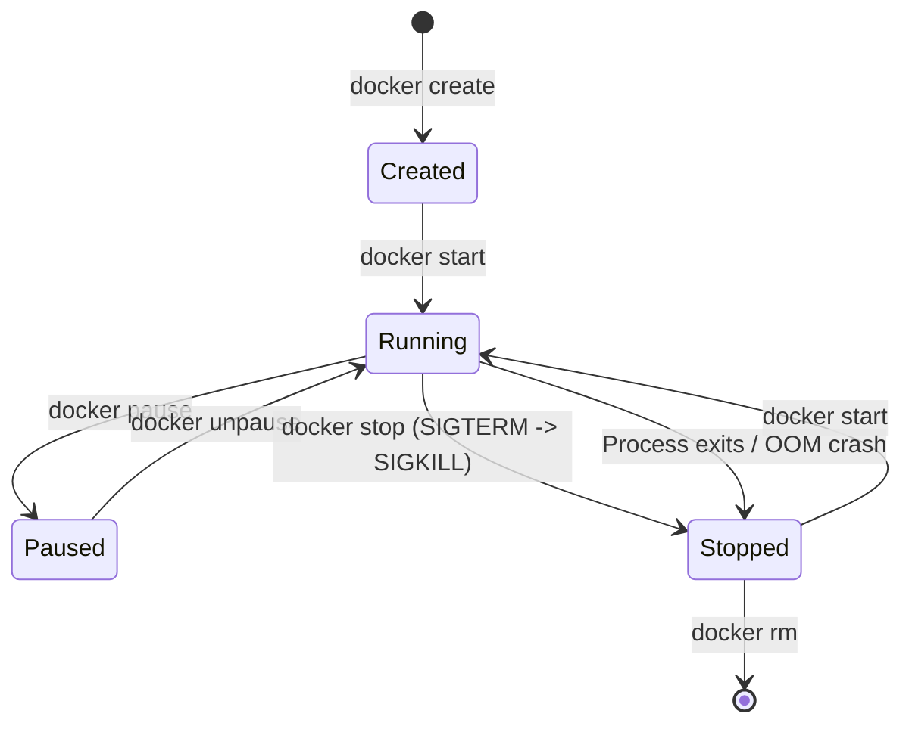

# Module 7 - Containers & Lifecycle Management

## 1. Learning Objectives
By the end of this module, you will be able to:
* Map the complete lifecycle states of a container: `Created`, `Running`, `Paused`, `Stopped`, and `Deleted`.
* Explain the responsibilities of PID 1 inside a namespace, focusing on signal forwarding and zombie process reaping.
* Distinguish between `docker stop` and `docker kill` in terms of signal routing and system exit codes.
* Configure Out-of-Memory (OOM) limits and adjust daemon `oom_score_adj` values.
* Integrate lightweight init systems (like `tini`) to prevent resource leaks in microservice applications.
* Diagnose container exit codes (e.g. 137, 143) and troubleshoot containers stuck in stopping states.

---

## 2. Introduction
Running a container is not a simple "on/off" switch. Just like real computers, containers transition through multiple execution states throughout their lifetime. Understanding these transitions, how signals are handled by application runtimes, and how resources are reclaimed by the host operating system is critical to building reliable production applications.

To understand the container lifecycle, consider the **Theater Actor Analogy**.

Imagine a theatrical production.
* **Backstage Waiting (Created State)**: The actor is dressed in their costume, holding their props, and standing in the wings. They are ready to perform, but they have not walked onto the stage yet. No spotlight is on them.
* **On Stage Performing (Running State)**: The actor walks onto the stage. They are active, speaking lines, and consuming stage resources.
* **Freeze Scene (Paused State)**: The director calls "Freeze!" The actor stops mid-motion. They remain on stage, their memory of the scene is intact, but they do not speak or move. They consume no active time.
* **Show Intermission (Stopped State)**: The actor leaves the stage and returns to the dressing room. Their props are set down. The stage is cleared, but their costume remains ready in the dressing room if they need to return.
* **Show Cancelled (Deleted State)**: The actor's contract is ended. The costumes are packed away, and the dressing room is cleared out.

In the container world, these transitions are governed by signals and lifecycle commands.

---

## 3. Why This Topic Exists
In production systems, a common deployment issue is **Service Interruption during Rollouts**. 

When a CI/CD pipeline deploys a new version of an application, it stops the old container and starts the new one. If the application running inside the old container is processing a database transaction and receives a shutdown signal, it must finish the transaction before exiting.

If the application is not configured to handle shutdown signals, it will terminate instantly when stopped. This leaves database writes incomplete, corrupts files, and drops active client connections. 

Understanding container states and signal propagation is essential for achieving **graceful shutdowns** and preventing data loss.

---

## 4. Theory & Internal Mechanics

### Container State Transitions
A container can exist in one of five states:



* **Created**: The container filesystem is prepared and resources are allocated, but the primary process is not running.
* **Running**: The primary process (PID 1) is executing inside its namespaces.
* **Paused**: The host operating system uses the cgroups freezer subsystem to suspend the container processes. The processes are frozen in memory, consuming no CPU cycles, but retaining their state.
* **Stopped**: The primary process has exited, or was terminated by a signal. No processes are running, but the container's writable filesystem layer and metadata remain intact.
* **Deleted**: All writable storage layers and configuration metadata are permanently removed from the host.

### The PID 1 Responsibility & Zombie Processes
In a Unix operating system, **Process ID 1** (init) is the parent of all processes. It has two critical jobs:
1. **Signal Propagation**: When the system sends a shutdown signal, PID 1 must forward it to all child processes.
2. **Zombie Reaping**: When a child process terminates, it becomes a "zombie" process until its parent reads its exit status. If the parent fails to do this, the zombie remains in the process table. If PID 1 does not reap these processes, the system will eventually run out of PIDs and freeze.

Many runtime engines (like Node.js, Python, or JVMs) are not designed to act as init systems. If they run as PID 1, they may ignore SIGTERM signals or fail to reap zombies, leading to resource leaks.

#### The `tini` Solution
To solve this, Docker includes a lightweight init system called `tini`. It is a tiny binary that runs as PID 1, forwards signals, and reaps zombies, while spawning your application as PID 2.

```
+---------------------------------------------------------+
|                  CONTAINER PROCESS TREE                 |
+---------------------------------------------------------+
|  [PID 1] tini (Init System)                             |
|    └─► [PID 2] node app.js (Your Application)           |
|          └─► [PID 12] child_process (Temporary script)  |
+---------------------------------------------------------+
```

### Out-of-Memory (OOM) Killer
If the host system runs out of physical memory, the Linux kernel's **OOM Killer** scans processes and terminates them to prevent a host system crash.
* **OOM Score**: Processes are assigned a score based on their memory consumption. The process with the highest score is terminated first.
* **`oom_score_adj`**: Docker adjusts the OOM score of container processes based on the memory boundaries defined during `docker run`. You can also configure a container's score manually to prevent the host from terminating critical database containers.

---

## 5. Commands Reference

### 5.1 docker stop
* **Purpose**: Gracefully stops a running container.
* **Syntax**: `docker stop [options] CONTAINER [CONTAINER...]`
* **Arguments**:
  * `-t, --time`: Seconds to wait before killing the container (default is 10).
* **Execution Flow**:
  1. Sends a **SIGTERM** (Signal 15) to PID 1 inside the container.
  2. Waits for the container process to exit.
  3. If the process does not exit within the timeout period (default 10s), sends a **SIGKILL** (Signal 9) to force termination.
* **Common Exit Code**: `143` (SIGTERM exit) or `137` (SIGKILL exit).

### 5.2 docker kill
* **Purpose**: Forces a running container to stop immediately.
* **Syntax**: `docker kill [options] CONTAINER [CONTAINER...]`
* **Arguments**:
  * `-s, --signal`: Send a custom signal instead of SIGKILL (e.g. `-s SIGINT`).
* **Execution Flow**:
  1. Sends a **SIGKILL** (Signal 9) directly to the container process.
* **Common Exit Code**: `137` (SIGKILL exit).

---

## 6. Practical Labs

### Lab 7.1: Signal Trapping inside a Container
**Goal**: Run a container with a custom script, observe how it handles signals, and contrast `docker stop` and `docker kill`.

1. Create a script named `~/docker-sandbox/src/trap-app.sh`:
   ```bash
   cat << 'EOF' > ~/docker-sandbox/src/trap-app.sh
   #!/bin/sh
   # Set up signal trap
   trap 'echo "📥 Received SIGTERM! Cleaning up..."; exit 0' SIGTERM
   trap 'echo "📥 Received SIGINT! Ignoring...";' SIGINT

   echo "🚀 Application started. PID: $$"
   while true; do
     sleep 1
   done
   EOF
   chmod +x ~/docker-sandbox/src/trap-app.sh
   ```
2. Create a basic Dockerfile to containerize the script:
   ```dockerfile
   cat << 'EOF' > ~/docker-sandbox/Dockerfile
   FROM alpine:3.19
   COPY src/trap-app.sh /app.sh
   CMD ["/app.sh"]
   EOF
   ```
3. Build the image:
   ```bash
   docker build -t trap-test ~/docker-sandbox
   ```
4. Start the container in the background:
   ```bash
   docker run -d --name trap-run trap-test
   ```
5. Stop the container and observe the logs:
   ```bash
   docker stop trap-run
   docker logs trap-run
   ```
   * **Expected Output**: The log will display `📥 Received SIGTERM! Cleaning up...`, proving the script trapped the signal and shut down gracefully.
6. Restart the container:
   ```bash
   docker start trap-run
   ```
7. Kill the container and observe the logs:
   ```bash
   docker kill trap-run
   docker logs trap-run
   ```
   * **Expected Output**: The logs will **not** show the cleanup message. The container was terminated instantly by SIGKILL, preventing the script from running its cleanup handler.
8. Query the exit code of the killed container:
   ```bash
   docker inspect --format='{{.State.ExitCode}}' trap-run
   ```
   * **Expected Output**: `137` (which represents exit code 128 + Signal 9).

[Insert Screenshot: Terminal showing docker stop vs kill exit codes]

---

## 7. Real Projects: Preventing Zombie Leakage in JVM Apps
Java applications often spawn multiple runtime sub-processes to run background tasks. If the primary JVM process runs as PID 1, it may fail to reap exited sub-processes, leading to zombie accumulation. In this project, we will use the `tini` init wrapper to resolve this issue.

### Step 1: Write a Dockerfile using the `--init` flag
You can run a container with `tini` by passing the `--init` flag to `docker run`, or you can package `tini` directly inside your image for platforms (like Kubernetes) that do not support the `--init` flag.

Create `~/docker-sandbox/Dockerfile.init`:
```dockerfile
FROM alpine:3.19
# Install tini
RUN apk add --no-cache tini
# Copy application files
COPY src/trap-app.sh /app.sh
# Declare tini as entrypoint
ENTRYPOINT ["/sbin/tini", "--"]
# Run app.sh as CMD
CMD ["/app.sh"]
```

### Step 2: Build the image
```bash
docker build -f ~/docker-sandbox/Dockerfile.init -t tini-app ~/docker-sandbox
```

### Step 3: Run the container and verify process hierarchy
```bash
docker run -d --name tini-run tini-app
docker exec tini-run ps aux
```
* **Expected Output**:
  ```
  PID   USER     TIME  COMMAND
      1 root      0:00 /sbin/tini -- /app.sh
      7 root      0:00 /bin/sh /app.sh
  ```
  Notice that `tini` runs as PID 1, while the application runs safely as PID 7. If `app.sh` spawns child processes that terminate, `tini` will automatically reap them.

---

## 8. Troubleshooting & Diagnostics

### 1. Exit Code 137 (OOM or SIGKILL)
* **Symptoms**: A container running in production stops unexpectedly, and `docker ps -a` shows exit code `137`.
* **Root Cause**: The container was either terminated forcefully using `docker kill` or was killed by the host system's OOM Killer due to high memory consumption.
* **Diagnostic Check**: Check the host kernel logs to verify if an OOM event occurred:
  ```bash
  dmesg -T | grep -i oom
  ```
  Or check the container's status metadata:
  ```bash
  docker inspect --format='{{.State.OOMKilled}}' <container-name>
  ```
  If it outputs `true`, you must increase the container's memory limits or optimize the application's memory usage.

### 2. Container Stuck in "Stopping" State
* **Symptoms**: Running `docker stop` hangs for 10 seconds, and the container takes a long time to exit.
* **Root Cause**: The application running inside the container as PID 1 is ignoring the SIGTERM signal. The Docker daemon is forced to wait for the 10-second timeout before sending SIGKILL to terminate the process.
* **Solution**: Ensure your entrypoint script uses the `exec` form (`CMD ["node", "app.js"]`) instead of the shell form (`CMD node app.js`), which wraps the application in a shell process that blocks signal propagation.

---

## 9. Production Examples

### Amazon ECS Task Rollouts
Amazon ECS (Elastic Container Service) routes traffic to tasks via load balancers. When deploying an update, ECS deregisters the old task from the load balancer, wait for active connections to drain, and then issues a `docker stop` command to the old container. If the container is configured with a 30-second graceful shutdown window, it can finish processing active API calls before terminating, ensuring zero dropped requests for clients.

---

## 10. Best Practices
* **Use the Exec Form in Dockerfiles**: Always declare command parameters as a JSON array (`CMD ["app", "arg"]`) rather than a raw string (`CMD app arg`) to ensure the application runs as PID 1 and receives system signals.
* **Implement Signal Traps**: Write handlers in your application code to trap SIGTERM, close database connections, and flush log buffers before exiting.
* **Leverage Init Wrappers**: Use `tini` (either via the `--init` flag or packaged inside the image) for applications that spawn child processes (e.g. Node.js, Java, Python subprocesses).

---

## 11. Interview Preparation

### Q1: What is the difference between `docker stop` and `docker kill`?
* **Answer**: `docker stop` gracefully shuts down a container. It sends a SIGTERM signal to PID 1 inside the container, waits for a grace period (default 10 seconds) to allow the application to clean up, and sends SIGKILL if the process is still running. `docker kill` terminates the container immediately by sending a SIGKILL signal, bypassing the graceful shutdown period.

### Q2: Why is the choice of Shell vs Exec form important in a Dockerfile?
* **Answer**: 
  * The **Shell form** (`CMD node app.js`) wraps the application in a shell process (`/bin/sh -c`). The shell runs as PID 1, and the application runs as a child process. Since standard shells do not forward signals to child processes, the application never receives the SIGTERM signal sent by `docker stop`.
  * The **Exec form** (`CMD ["node", "app.js"]`) runs the application directly as PID 1, ensuring it receives all system shutdown signals.

### Q3: What does Exit Code 137 indicate, and how do you diagnose it?
* **Answer**: Exit code 137 indicates that the container was terminated by Signal 9 (SIGKILL). This occurs when a user runs `docker kill`, or when the host kernel's OOM Killer terminates the container because it exceeded its memory limits. You can diagnose OOM events by checking `docker inspect` for `OOMKilled: true` or searching host system logs using `dmesg | grep -i oom`.

---

## 12. Cheat Sheet
| Exit Code | Meaning | Diagnosis |
|---|---|---|
| `0` | Successful exit | Process completed its work |
| `1` | Application error | Check application crash logs |
| `137` | SIGKILL (Signal 9) | Container was killed or ran out of memory |
| `143` | SIGTERM (Signal 15) | Container stopped gracefully |

---

## 13. Assignments

### Beginner Assignment
* Build a container that runs a shell loop script. Stop the container using `docker stop` and time how long it takes to exit. Re-write the command using the exec form, rebuild, restart, and measure the shutdown time again.

### Intermediate Assignment
* Start a container with a memory limit of `50m` (`-m 50m`). Write a script inside the container that allocates a massive array in memory, exceeding the limit. Check the container's exit code and locate the OOM event in the host's system logs.

---

## 14. Mini Project
Write a shell script that checks the status of all containers. If a container is stopped, the script should parse its exit code. If the exit code is non-zero, it should print the last 20 lines of the container logs to a diagnostics file (`~/container-errors.log`).

---

## 15. References & Further Reading
* [Docker Container Lifecycle command references](https://docs.docker.com/engine/reference/commandline/container/)
* [Tini Init System Repository](https://github.com/krallin/tini)
* [Linux Signal Propagation Specifications](https://man7.org/linux/man-pages/man7/signal.7.html)
