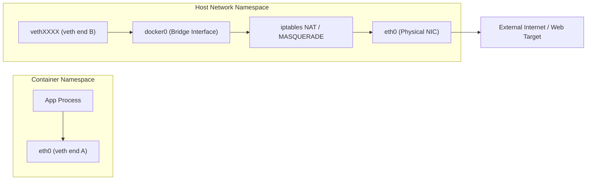

# Module 8 - Docker Networking (Deep Dive)

## 1. Learning Objectives
By the end of this module, you will be able to:
* Describe the Linux kernel networking primitives (`netns`, `veth` pairs, bridge interfaces, `iptables`).
* Classify the architecture and use cases for all Docker network drivers (`bridge`, `host`, `none`, `macvlan`, `overlay`).
* Execute manual network namespace creations and link them manually bypassing Docker.
* Configure custom bridge networks with static IP allocations, user-defined subnets, and DNS discovery.
* Audit Docker container routing tables, port forwardings, and namespace files on the host system.
* Troubleshoot container DNS resolution failures, port exposure conflicts, and inter-service routing blocks.

---

## 2. Introduction
In a containerized environment, applications must communicate with each other, the host machine, and external web services. Docker achieves this using a virtualized network virtualization layer.

To understand Docker networking, consider the **Office Telephone Intercom System Analogy**.
* **The Host Machine (The Office Building)**: The outer boundary. It has a main physical landline telephone connection (`eth0`) to the outside world.
* **Network Namespaces (Private Office Desks)**: Each worker sits at a desk behind closed doors. They cannot hear or talk to workers at other desks unless a line is run to their room.
* **Virtual Ethernet Pairs (Intercom Wires)**: A wire with two jacks. One jack plugs into Desk A (`eth0` inside the namespace), and the other jack plugs into the central office switchboard.
* **Docker Bridge (The Central Switchboard)**: A central hardware switch (`docker0`) on the wall where all the intercom wires connect. It allows any worker to call another worker inside the building directly using their desk extension number.
* **IPTables & NAT (The Switchboard Operator)**: If a worker wants to call an external phone number outside the office, the switchboard operator intercepts the call, translates it to the main building landline, dials out, and routes the return audio back to the correct desk.

---

## 3. Why This Topic Exists
In simple local development environments, port bindings like `docker run -p 8080:80` are enough. However, in production, security, service isolation, and performance require a structured approach:
1. **Security Isolation**: By default, all containers run on the same shared bridge, meaning any compromised container can scan and exploit services on adjacent containers. Custom isolated networks prevent this lateral movement.
2. **Service Discovery**: Hardcoding IP addresses is impossible in dynamic environments since containers are continuously destroyed and recreated with random IPs. Docker networking implements internal DNS lookups using container names.
3. **Multi-Host Clustering**: When scaling applications across multiple virtual servers, containers must reach each other across physical network card boundaries, requiring VXLAN overlays.

---

## 4. Theory & Internal Mechanics

### Linux Kernel Networking Primitives
Docker does not build a private networking stack. It uses Linux kernel features:
* **Network Namespaces (`netns`)**: Isolates the system network card listings, routing tables, and firewall rules. Each namespace has a private loopback (`lo`) and routing table.
* **Virtual Ethernet Pairs (`veth`)**: Software-defined wire connections operating as a bidirectional link. A packet entering one end automatically emerges at the other.
* **Linux Bridge (`br_netfilter`)**: A virtual Layer 2 switch. It forwards ethernet frames between connected network interfaces using MAC address tables.
* **IPTables & NAT**: Directs packet forwarding rules. Docker uses `Network Address Translation (NAT)` and IP masquerading to route container packets out through the host's physical network adapter (`eth0`).

---

## 5. Component Flow Diagram
This diagram shows how a packet routes from a container out to the external internet:



---

## 6. Commands Reference

### 6.1 ip netns (Linux utility)
* **Purpose**: Manage network namespaces on the host system.
* **Syntax**: `ip netns <command>`
* **Examples**:
  ```bash
  # List all namespaces managed by the system
  sudo ip netns list
  ```
* **Production usage**: System diagnostics to troubleshoot link states, routing tables, and interface associations outside of Docker's CLI.

### 6.2 docker network create
* **Purpose**: Allocate a new Docker-managed virtual network.
* **Syntax**: `docker network create [options] <network-name>`
* **Arguments**:
  * `--driver`: Specify the driver (`bridge`, `overlay`, `macvlan`).
  * `--subnet`: Define a custom IP subnet CIDR block (e.g. `172.28.0.0/16`).
  * `--gateway`: Set the gateway IP for the subnet (e.g. `172.28.0.1`).
* **Example**:
  ```bash
  docker network create --driver bridge --subnet 10.10.0.0/24 secure-bridge
  ```
* **Production usage**: Staging separate network layers for databases and APIs.

### 6.3 docker network inspect
* **Purpose**: Review configuration details and connected containers for a network.
* **Syntax**: `docker network inspect <network-name>`
* **Example**:
  ```bash
  docker network inspect bridge
  ```

---

## 7. Practical Labs

### Lab 8.1: Replicating Docker Bridge Networks Manually
**Goal**: Create two isolated network namespaces and connect them using a virtual ethernet pair and a bridge, bypassing Docker entirely to understand the underlying Linux commands.

1. Create two network namespaces:
   ```bash
   sudo ip netns add ns1
   sudo ip netns add ns2
   ```
2. Create a virtual bridge interface:
   ```bash
   sudo ip link add br-demo type bridge
   sudo ip link set br-demo up
   ```
3. Create veth pairs for both namespaces:
   ```bash
   sudo ip link add veth1 type veth peer name veth1-br
   sudo ip link add veth2 type veth peer name veth2-br
   ```
4. Attach one end of each pair to the bridge:
   ```bash
   sudo ip link set veth1-br master br-demo
   sudo ip link set veth2-br master br-demo
   sudo ip link set veth1-br up
   sudo ip link set veth2-br up
   ```
5. Move the other ends of the pairs into the namespaces:
   ```bash
   sudo ip link set veth1 netns ns1
   sudo ip link set veth2 netns ns2
   ```
6. Configure IPs and bring interfaces up inside namespaces:
   ```bash
   sudo ip netns exec ns1 ip addr add 10.0.0.10/24 dev veth1
   sudo ip netns exec ns1 ip link set veth1 up
   sudo ip netns exec ns1 ip link set lo up
   
   sudo ip netns exec ns2 ip addr add 10.0.0.20/24 dev veth2
   sudo ip netns exec ns2 ip link set veth2 up
   sudo ip netns exec ns2 ip link set lo up
   ```
7. Ping between the namespaces:
   ```bash
   sudo ip netns exec ns1 ping -c 3 10.0.0.20
   ```
   * **Expected Output**: 100% packet delivery. The packets route through the bridge interface just like in a Docker bridge network.

### Lab 8.2: Verify Internal DNS resolution on User-Defined Bridges
**Goal**: Verify that user-defined bridge networks resolve containers by name automatically, unlike the default bridge.

1. Create a user-defined bridge:
   ```bash
   docker network create custom-net
   ```
2. Launch two containers inside this network:
   ```bash
   docker run -d --name service-a --network custom-net alpine sleep 3600
   docker run -it --name service-b --network custom-net alpine sh
   ```
3. Inside `service-b`, ping `service-a` by name:
   ```bash
   ping -c 3 service-a
   ```
   * **Expected Output**: Packet transmission succeeds, resolving `service-a` to its container IP.

---

## 8. Real Projects: Multi-Tier Network Hardening
Secure a production application stack by creating separate network environments: an internet-facing frontend network and a completely isolated backend database network.

```
                  +----------------------------------+
                  |           Frontend-Net           |
                  +----------------------------------+
                     |                            |
                     v                            v
               +------------+              +------------+
               | Nginx-Web  |              |  Flask-API |
               +------------+              +------------+
                                                  |
                                                  v
                                           +------------+
                                           | PostgresDB |
                                           +------------+
                                                  ^
                                                  |
                               +----------------------------------+
                               |           Backend-Net            |
                               +----------------------------------+
```

### Step 1: Create Networks
```bash
docker network create web-ingress
docker network create db-isolated
```

### Step 2: Launch Databases on the Isolated Network
```bash
docker run -d --name secure-db \
  --network db-isolated \
  -e POSTGRES_PASSWORD=secret \
  postgres:16-alpine
```

### Step 3: Run the API connected to both Networks
```bash
docker run -d --name app-api \
  --network web-ingress \
  alpine sleep 3600

# Connect api to database network as well
docker network connect db-isolated app-api
```

### Step 4: Run the Web server strictly on web-ingress
```bash
docker run -d --name web-nginx \
  --network web-ingress \
  nginx:alpine
```
*This configuration guarantees that the database container `secure-db` has no routing path to `web-nginx` or the outside internet.*

---

## 9. Troubleshooting & Diagnostics

### 1. DNS Resolution Failures
* **Symptoms**: Containers fail to resolve other containers by name.
* **Root Cause**: Running containers on the default `bridge` network. Docker's embedded DNS server is only enabled on user-defined networks.
* **Solution**: Recreate the containers on a user-defined bridge network using `docker network create`.

### 2. Port Binding Conflicts
* **Symptoms**: Error message: `bind: address already in use`.
* **Root Cause**: Another container or host process is already listening on the requested host port.
* **Solution**: Check running ports using `ss -lntp` on the host, then switch to a different host port binding (e.g. `-p 8081:80`).

---

## 10. Production Examples
In large-scale production deployments (such as Kubernetes or Swarm clusters), container networking uses the **Overlay Network** driver. Overlay networks construct virtual tunnels (using VXLAN encapsulation) over physical network interfaces. This allows containers running on physical Server A to talk to containers on physical Server B as if they were sitting on the same local switch.

---

## 11. Best Practices
* **Avoid the Default Bridge in Production**: Always run containers on user-defined networks to enable DNS discovery and network isolation.
* **Use Host Network for High-Throughput API Gateways**: The `host` driver bypasses virtualization layers and iptables, yielding native host port latency.
* **Run Databases on Internal Networks**: Ensure databases have no routing access to ingress paths.

---

## 12. Interview Preparation

### Q1: What is the difference between the `bridge` and `host` network drivers in Docker?
* **Answer**:
  - The `bridge` driver creates a virtual bridge interface (`docker0` or user-defined) and allocates a separate network namespace for each container. Port mapping is required to expose ports to the host.
  - The `host` driver bypasses network namespace isolation. The container shares the host's network interfaces directly (e.g. running an app on port 80 inside the container binds port 80 on the host immediately). This improves network performance but removes port isolation.

### Q2: How does Docker implement internal container DNS resolution?
* **Answer**: Docker runs an embedded DNS server at the IP address `127.0.0.11` inside each container. When a container on a user-defined network makes a DNS request for another container name, the embedded DNS server resolves the container name to its internal IP address. If the query is for an external domain, it is forwarded to the host's configured DNS servers.

### Q3: Explain what a `veth` pair is and its role in Docker networking.
* **Answer**: A virtual ethernet (`veth`) pair is a bidirectional link of virtual network interfaces that acts like a physical network cable. One end of the veth pair is placed inside the container's network namespace (exposed as `eth0`), and the other end is attached to the virtual bridge interface (`docker0`) in the host's network namespace. This links the container to the host network.

---

## 13. Cheat Sheet
| Driver | Isolation | DNS Discovery | Use Case |
|---|---|---|---|
| `bridge` | Medium | Yes (User-defined only) | Default local services |
| `host` | None | No | High-performance, latency-sensitive apps |
| `none` | High | No | Batch jobs, offline calculations |
| `overlay` | Medium | Yes | Multi-host Docker Swarm clustering |
| `macvlan` | Low | No | Legacy apps requiring direct MAC addresses |

---

## 14. Assignments

### Beginner Assignment
* Create a custom bridge network `dev-net` with subnet `192.168.100.0/24`. Run a container inside it and verify its IP configuration matches the subnet parameters.

### Intermediate Assignment
* Deploy two containers on the default bridge. Attempt to ping one from the other by container name. Document the result. Then, move both to a user-defined bridge and test again. Explain the mechanism behind the change in behavior.

---

## 15. Mini Project
Write a bash script that cleans up all unused Docker networks, lists the remaining active networks, and displays the running containers connected to each.

---

## 16. References & Further Reading
* [Docker Container Networking Reference](https://docs.docker.com/network/)
* [Linux Kernel Bridge documentation](https://wiki.linuxfoundation.org/networking/bridge)
* [Deep dive into iptables rules for Docker](https://docs.docker.com/network/packet-filtering-firewalls/)
