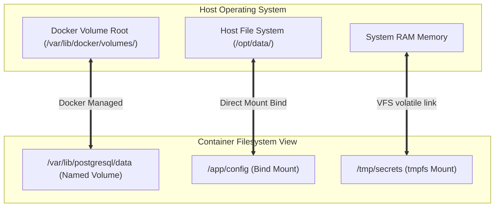

# Module 9 - Docker Storage (Volumes & Bind Mounts)

## 1. Learning Objectives
By the end of this module, you will be able to:
* Describe storage drivers and the Copy-on-Write (CoW) protocol and their performance impacts.
* Contrast the differences, security postures, and lifecycles of Volumes, Bind Mounts, and Tmpfs Mounts.
* Explain mount propagation rules (`shared`, `slave`, `private`) and their recursive applications.
* Deploy named volumes backed by external NFS shares dynamically.
* Troubleshoot UID/GID file permission mismatches and disk write slowdowns.
* Audit disk allocations and container storage utilization using native CLI tools.

---

## 2. Introduction
By default, Docker container filesystems are ephemeral. Any data created or modified inside a container's writable layer is permanently lost when the container is deleted. To address this, Docker decouples data persistence from the container execution layer.

To understand Docker storage, consider the **Warehouse File Cabinet System Analogy**.
* **Ephemeral Container Layer (The Temp Desk Space)**: You sit down at a rented desk. Any documents you write and leave on the desk will be thrown away by the night clean-up crew when you check out (stop the container).
* **Named Volumes (The Company Archives)**: A secure file cabinet room managed entirely by the warehouse staff (`/var/lib/docker/volumes/`). If you check out, the cabinets remain safe, locked, and managed. The next worker can open the same cabinet and continue working.
* **Bind Mounts (Direct Host Links)**: A hole cut in the wall with a direct link to your personal home office desk (a host path like `/opt/data/`). You can grab folders from your home desk directly, but if you change a file, it changes your home office disk. If someone reorganizes your home office, the warehouse link breaks.
* **Tmpfs Mounts (The Memory Whiteboard)**: A dry-erase whiteboard in your office. You write quick calculations on it. It is extremely fast to read and write, but when you turn off the lights and go home, the whiteboard is wiped clean.

---

## 3. Why This Topic Exists
In early container deployments, developers wrote application states (like database files or user uploads) directly to the container layer. This introduced major issues:
1. **Performance Bottlenecks**: The Copy-on-Write (CoW) mechanism of storage drivers like `overlay2` copy files to the writable layer on first write. This introduces substantial execution latencies for high-throughput DBs.
2. **Upgrade Loss**: Upgrading a database container requires destroying the old instance and creating a new one. Without persistent storage, database upgrades meant complete data deletion.
3. **Security Risks**: Mounting host directories with incorrect permissions can allow a container to rewrite host-level system configs (e.g. mounting `/etc`).

---

## 4. Theory & Internal Mechanics

### Storage Drivers & Copy-on-Write
* **overlay2**: Overlays two directories (read-only `lowerdir` and writable `upperdir`) to present a unified `merged` filesystem view.
* **Copy-on-Write (CoW)**: When a file in the read-only layer is modified:
  1. The storage driver locates the target file.
  2. The file is copied to the writable `upperdir`.
  3. The process modifies the copied version.
* **Performance Impact**: High-write databases must bypass CoW by writing directly to named volumes or bind mounts.

### Mount Types & Propagation
* **Volumes**: Stored in a directory managed by Docker.
* **Bind Mounts**: Maps any folder path on the host.
* **Tmpfs Mounts**: Writes data directly into host RAM.
* **Propagation settings**:
  - `shared`: Sub-mounts are visible to both host and container.
  - `slave`: Sub-mounts made on host are visible to container; container sub-mounts are invisible to host.
  - `private`: Mounts are isolated. Sub-mounts are not shared.

---

## 5. Component Flow Diagram
This diagram shows how different storage mount types interface with the container runtime:



---

## 6. Commands Reference

### 6.1 docker volume create
* **Purpose**: Allocate a new named volume.
* **Syntax**: `docker volume create [options] <volume-name>`
* **Arguments**:
  * `--driver`: Specify driver (defaults to `local`).
  * `--opt`: Driver-specific options (e.g. NFS configurations).
* **Example**:
  ```bash
  docker volume create --driver local db-data
  ```
* **Production usage**: Allocating persistent storage buckets before deploying database containers.

### 6.2 docker volume inspect
* **Purpose**: Query detailed configurations of a named volume.
* **Syntax**: `docker volume inspect <volume-name>`
* **Example**:
  ```bash
  docker volume inspect db-data
  ```

---

## 7. Practical Labs

### Lab 9.1: Configuring NFS-Backed Named Volumes
**Goal**: Configure a local NFS server on the host, export a directory, and mount it as a Docker named volume to demonstrate distributed storage.

1. Install NFS server utilities on host:
   ```bash
   sudo apt-get update && sudo apt-get install -y nfs-kernel-server
   ```
2. Create and export the shared path:
   ```bash
   sudo mkdir -p /opt/nfs/data
   sudo chown nobody:nogroup /opt/nfs/data
   sudo chmod 777 /opt/nfs/data
   echo "/opt/nfs/data 127.0.0.1(rw,sync,no_subtree_check)" | sudo tee -a /etc/exports
   sudo exportfs -a
   sudo systemctl restart nfs-kernel-server
   ```
3. Create the Docker volume pointing to the local NFS server:
   ```bash
   docker volume create --driver local \
     --opt type=nfs \
     --opt o=addr=127.0.0.1,rw,nolock,hard,nfsvers=4 \
     --opt device=:/opt/nfs/data \
     nfs-shared-vol
   ```
4. Run a container writing to this volume:
   ```bash
   docker run -d --name logger \
     -v nfs-shared-vol:/var/log/data \
     alpine sh -c "while true; do echo \$(date) >> /var/log/data/test.log; sleep 2; done"
   ```
5. Verify files appear directly on host:
   ```bash
   tail -n 5 /opt/nfs/data/test.log
   ```
   * **Expected Output**: Log lines written by the container are readable in the host path.

### Lab 9.2: Verifying Bind Mount Propagation Settings
**Goal**: Verify the difference between `private` and `rslave` propagation.

1. Create nested host directories:
   ```bash
   mkdir -p /tmp/parent/child
   ```
2. Run a container mounting `/tmp/parent` with `private` propagation:
   ```bash
   docker run -d --name prop-demo \
     -v /tmp/parent:/mount-point:private \
     alpine sleep 3600
   ```
3. On the host, mount a temporary filesystem to the child folder:
   ```bash
   sudo mount -t tmpfs tmpfs /tmp/parent/child
   ```
4. Check the container view:
   ```bash
   docker exec prop-demo ls -la /mount-point/child
   ```
   * **Expected Output**: The child folder is empty because `private` propagation prevents the host-level sub-mount from reflecting in the container.

---

## 8. Real Projects: PostgreSQL Database Persistence
Deploy a PostgreSQL database container with production performance settings, ensuring transaction logs write directly to disk.

### Step 1: Create a volume for PostgreSQL data
```bash
docker volume create pg-prod-data
```

### Step 2: Spin up the database container
```bash
docker run -d --name pg-server \
  -e POSTGRES_PASSWORD=dbpassword \
  -v pg-prod-data:/var/lib/postgresql/data \
  postgres:16-alpine
```

### Step 3: Verify the volume mount properties
```bash
docker inspect pg-server -f '{{ json .Mounts }}'
```
*Observe the JSON output to verify `Destination` points to `/var/lib/postgresql/data` and `Type` is `volume`.*

---

## 9. Troubleshooting & Diagnostics

### 1. "Permission Denied" Errors on Bind Mounts
* **Symptoms**: The process inside the container crashes with permission denied errors.
* **Root Cause**: The directory on the host belongs to host user root (`0:0`), but the container process runs as a non-root user (e.g. UID `1000`).
* **Solution**: Change ownership of the host folder to match the container's UID:
  ```bash
  sudo chown -R 1000:1000 /host/bind/path
  ```

### 2. Space Leakage on Deleted Containers
* **Symptoms**: Disk utilization remains high even after destroying containers.
* **Root Cause**: Unused named volumes remain on disk (orphaned volumes).
* **Solution**: Clean up dangling volumes:
  ```bash
  docker volume prune -f
  ```

---

## 10. Production Examples
In production platforms (like AWS or GCP), databases are never backed by standard ephemeral server disks. Cloud architects use specific **Volume Plugins** (such as AWS EBS CSI driver) to attach block storage. If a database container fails and rescheduling occurs on another host, the orchestration platform detaches the block device from the old host and attaches it to the new one before the container restarts.

---

## 11. Best Practices
* **Run Databases on Named Volumes**: Bypasses the CoW layer, avoiding massive write latency.
* **Mount Bindings in Read-Only Mode**: When sharing host configurations, append `:ro` to prevent container corruption of host files.
* **Use Tmpfs for Volatile Keys**: Mount secure tokens or encryption keys as tmpfs to prevent disk-level exposure.

---

## 12. Interview Preparation

### Q1: What is the difference between a bind mount and a named volume?
* **Answer**:
  - **Named Volumes** are managed by Docker and stored in a specific path inside `/var/lib/docker/volumes/`. They are portable, isolate host filesystem paths, and automatically initialize directories with files present in the container image.
  - **Bind Mounts** map any arbitrary path on the host system to the container. They depend on the host's folder layout, do not initialize files from the image, and can introduce security risks if host system directories are mounted.

### Q2: Why are volumes preferred over bind mounts for database persistence?
* **Answer**: Volumes abstract the underlying host path layout, making configurations highly portable. Furthermore, volumes support custom plugins to route storage directly to network file shares or cloud block devices, and they prevent container write processes from breaking if host directories undergo permission alterations.

### Q3: What is mount propagation, and when would you use `rslave`?
* **Answer**: Mount propagation defines whether sub-mounts created inside a mounted directory on the host are shared with the container. `rslave` propagation allows one-way propagation: if the host mounts an external disk inside the mapped directory at runtime, the container automatically accesses it, but container-made mounts are not shared back to the host.

---

## 13. Cheat Sheet
| Target | Command | Purpose |
|---|---|---|
| Create volume | `docker volume create <name>` | Pre-allocate storage bucket |
| List volumes | `docker volume ls` | Audit existing volumes |
| Inspect volume | `docker volume inspect <name>` | Check host mount path |
| Delete unused | `docker volume prune` | Free host disk space |

---

## 14. Assignments

### Beginner Assignment
* Create a named volume `data-bucket`. Spin up a container that writes a text file to `/data/hello.txt` inside this volume. Destroy the container, launch a new container mounting the same volume, and verify the file exists.

### Intermediate Assignment
* Mount a host folder to a container directory in read-only mode (`:ro`). Attempt to write a file from inside the container and document the exact error message returned by the operating system.

---

## 15. Mini Project
Write a bash script that checks the disk space utilized by each Docker volume in `/var/lib/docker/volumes/` and logs the volume names occupying more than 1GB.

---

## 16. References & Further Reading
* [Docker Volumes Reference Documentation](https://docs.docker.com/storage/volumes/)
* [Linux Mount Propagation Kernel Specification](https://www.kernel.org/doc/Documentation/filesystems/sharedsubtree.txt)
* [NFS Exports Configuration Guide](https://linux.die.net/man/5/exports)
