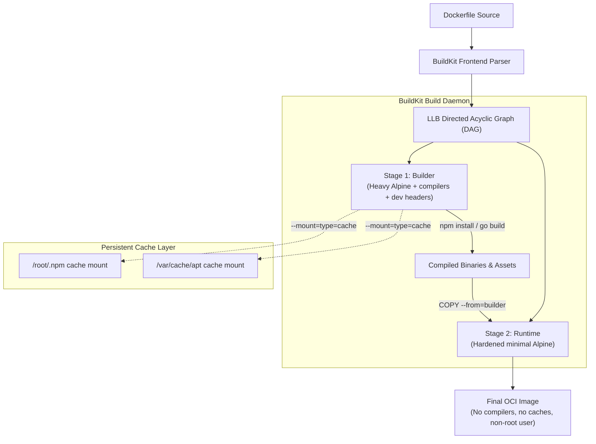

# Module 10 - Dockerfile Mastery

## 1. Learning Objectives
By the end of this module, you will be able to:
* Explain the internal architecture of BuildKit, Low-Level Builder (LLB) graphs, and parallel stage compilation.
* Implement BuildKit cache mounts (`--mount=type=cache`) to accelerate package manager installations across builds.
* Analyze the behavioral differences between shell form and exec form for `CMD` and `ENTRYPOINT` directives, particularly regarding PID 1 signal handling.
* Secure production containers by implementing multi-stage builds, non-root `USER` declarations, and BuildKit secret mounts.
* Audit image layers using `docker history` and scan for CVE vulnerabilities using `docker scout` or `trivy`.
* Prevent unnecessary build cache invalidations by strategically ordering Dockerfile instructions.

---

## 2. Introduction (with Real-World Analogy)
A Dockerfile is a text document containing the sequential commands used to assemble a container image. Writing high-quality Dockerfiles is essential for minimizing image sizes, optimizing build speeds, and hardening application security. A poorly written Dockerfile can produce images exceeding 1GB, leak credentials into layer history, and prevent graceful container shutdowns.

To understand Dockerfiles, consider the **Assembly Line Factory Blueprint Analogy**.

Imagine a modern automotive factory.
* **The Dockerfile (The Master Blueprint)**: The master set of assembly instructions that defines every step needed to build a finished car (the container image). Each instruction (`FROM`, `RUN`, `COPY`) is a station on the assembly line.
* **BuildKit Engine (The Smart Assembly Line Robot)**: Reads the blueprint and executes the steps. It is intelligent: if Station A (installing OS packages) and Station B (compiling frontend assets) do not depend on each other, it builds them both simultaneously using different robotic arms (parallel stage execution via LLB DAGs).
* **Build Cache (The Parts Staging Area)**: If the robot already assembled a sub-component yesterday, and the blueprint for that sub-component has not changed, it grabs the pre-built part from storage instead of rebuilding it from scratch (layer caching).
* **Multi-Stage Builds (The Clean Room Transfer)**: You build a complex engine inside a dirty machine shop containing metal shavings, heavy tools, and oil drums (compilers, development headers, build tools). Once the engine is assembled, you wipe it clean and transfer ONLY the finished engine into a pristine showroom (the minimal `scratch` or `alpine` runtime container). The machine shop waste never reaches the customer.

---

## 3. Why This Topic Exists
A basic, unoptimized Dockerfile usually starts with a heavy base image like `ubuntu:latest`, copies the entire workspace, runs `apt-get install` without cleanup, and launches the application as the `root` user. This naive approach introduces critical production issues:

1. **Bloated Layer Sizes**: Images routinely exceed 1GB when build tools, compilers, and package manager caches are left in the final image. This slows deployment speeds, increases cloud storage costs, and extends scaling operations during traffic spikes.
2. **Security Vulnerabilities**: Running as the root user inside a container exposes the host kernel to potential container breakout attacks. Compilers and shells left in the runtime image can be exploited by attackers who gain container access. Credentials passed via `ARG` or `ENV` are permanently baked into the image layer history.
3. **Broken Graceful Shutdowns**: Launching services via shell wrappers (`ENTRYPOINT npm start`) blocks system signals like `SIGTERM`. Docker waits 10 seconds for a response, then forcefully kills the process with `SIGKILL`, causing data corruption in databases and dropped connections for users.
4. **Slow CI/CD Pipelines**: Without proper instruction ordering and cache mount strategies, every minor code change triggers a full reinstallation of all dependencies, turning a 30-second build into a 10-minute pipeline bottleneck.

---

## 4. Theory & Internal Mechanics

### BuildKit Engine & Low-Level Builder (LLB)
BuildKit is the next-generation image build engine that replaced the legacy builder in Docker 23.0+. It translates high-level Dockerfile commands into Low-Level Builder (LLB) Directed Acyclic Graphs (DAGs). This architecture enables:
* **Concurrence**: Independent multi-stage steps are compiled in parallel across available CPU cores.
* **Pruning**: Unused build stages are automatically detected and skipped entirely.
* **Cache Mounts**: Package manager directories (e.g., `/root/.npm`, `/root/.m2`, `/var/cache/apt`) are preserved as persistent cache volumes across builds, eliminating redundant downloads.
* **Secret Mounts**: Sensitive data (API keys, SSH keys) can be mounted into a `RUN` step without being persisted in any image layer.

### Exec Form vs Shell Form

#### Exec Form (`["executable", "param"]`)
Starts the binary directly as Process ID 1 (PID 1). The process receives all system signals (like `SIGTERM`, `SIGINT`) directly from the Docker daemon and the host kernel. This allows the application to intercept the signal, flush buffers, close database connections, and shut down gracefully.

```dockerfile
# Exec form - node becomes PID 1
ENTRYPOINT ["node", "server.js"]
```

#### Shell Form (`executable param`)
Wraps the command in `/bin/sh -c "executable param"`. The shell process (`/bin/sh`) runs as PID 1 and intercepts all signals. Most shell implementations do **not** forward signals to child processes, so the actual application never receives `SIGTERM`. Docker waits 10 seconds for a graceful exit, times out, and sends `SIGKILL` to forcefully terminate the container.

```dockerfile
# Shell form - /bin/sh becomes PID 1, node is a child process
ENTRYPOINT node server.js
```

### COPY vs ADD
* **COPY**: Copies local files and directories from the build context into the image. It is explicit, predictable, and cache-safe.
* **ADD**: Has two additional behaviors: (1) it can fetch files from remote URLs, and (2) it automatically extracts compressed archives (`.tar`, `.tar.gz`). Because of these implicit behaviors, `ADD` can introduce cache invalidation issues and security risks. **Best practice**: Always use `COPY` unless you specifically need URL fetching or archive extraction.

### HEALTHCHECK Directive
The `HEALTHCHECK` instruction tells Docker how to test whether a container is still working. If the health check fails, the container is marked as `unhealthy`, which orchestrators like Docker Swarm or Kubernetes can use to trigger automatic restarts.

```dockerfile
HEALTHCHECK --interval=30s --timeout=5s --start-period=10s --retries=3 \
  CMD curl -f http://localhost:8080/health || exit 1
```

---

## 5. Component Flow / Architecture Diagram (Mermaid)
This diagram shows how BuildKit parses a Dockerfile and processes multi-stage builds:



---

## 6. Commands Reference (Purpose, Syntax, Arguments, Example, Output, Production usage)

### 6.1 docker build (with BuildKit)
* **Purpose**: Compile an OCI-compliant image from a Dockerfile.
* **Syntax**: `docker build [options] <path-or-url>`
* **Arguments**:
  - `-t <name:tag>`: Tag name and version (e.g., `app:v1.2.0`).
  - `--no-cache`: Force rebuild of all layers, ignoring any cached layers.
  - `--target <stage>`: Build only up to a specific named stage in a multi-stage Dockerfile.
  - `--build-arg <KEY=VALUE>`: Pass build-time variables accessible via `ARG` directives.
  - `--secret id=<id>,src=<path>`: Mount a secret file into the build context without persisting it.
  - `--platform <os/arch>`: Specify target platform (e.g., `linux/amd64`, `linux/arm64`).
* **Example**:
  ```bash
  export DOCKER_BUILDKIT=1
  docker build -t my-app:prod --target runtime .
  ```
* **Output**:
  ```
  [+] Building 2.4s (12/12) FINISHED
   => [internal] load build definition from Dockerfile
   => [internal] load .dockerignore
   => [internal] load metadata for docker.io/library/node:20-alpine
   => [auth] sharing credentials for docker.io
   => [builder 1/4] FROM docker.io/library/node:20-alpine@sha256:a1b2c3...
   => CACHED [builder 2/4] COPY package*.json ./
   => CACHED [builder 3/4] RUN npm ci --only=production
   => [runtime 1/3] COPY --from=builder /app/node_modules ./node_modules
   => exporting to image
  ```
* **Production usage**: Executed by CI/CD runners (GitHub Actions, Jenkins, GitLab CI) to build staging and production images. The `--target` flag is used to build test stages separately from runtime stages.

### 6.2 docker history
* **Purpose**: Inspect the layer sizes and command history of a built image.
* **Syntax**: `docker history [options] <image-name>`
* **Arguments**:
  - `--no-trunc`: Do not truncate the command column output.
  - `-q`: Only show layer IDs.
  - `--format`: Apply Go template formatting.
* **Example**:
  ```bash
  docker history --no-trunc node-secure:latest
  ```
* **Output**:
  ```
  IMAGE          CREATED        CREATED BY                                      SIZE      COMMENT
  a7e82b79a502   2 hours ago    ENTRYPOINT ["node" "server.js"]                 0B        
  <missing>      2 hours ago    EXPOSE 8080                                     0B        
  <missing>      2 hours ago    USER node                                       0B        
  <missing>      2 hours ago    COPY server.js .                                245B      
  <missing>      2 hours ago    COPY --from=builder /app/node_modules ./        12.4MB    
  ```
* **Production usage**: Used during security audits to detect bloated layers, identify commands that leak secrets or metadata, and verify that multi-stage builds correctly excluded build tools.

### 6.3 docker scout cves
* **Purpose**: Scan a built image for known CVE vulnerabilities.
* **Syntax**: `docker scout cves <image-name>`
* **Example**:
  ```bash
  docker scout cves node-secure:latest
  ```
* **Production usage**: Integrated into CI/CD gate checks. If critical or high-severity CVEs are detected, the pipeline blocks the push to production registries, forcing developers to update base images or patch vulnerable libraries.

---

## 7. Practical Labs (Lab 10.1, Lab 10.2 - Goal, Steps, Expected Output)

### Lab 10.1: Hardened Multi-Stage Build with BuildKit Cache Mounts
* **Goal**: Build a secure Node.js server using multi-stage builds, non-root users, and BuildKit package caching to demonstrate production-grade Dockerfile patterns.
* **Steps**:
  1. Create a simple server script `server.js`:
     ```javascript
     const http = require('http');
     const server = http.createServer((req, res) => {
         res.writeHead(200, {'Content-Type': 'text/plain'});
         res.end('Secure container response\n');
     });
     server.listen(8080, () => console.log('Listening on 8080'));
     ```
  2. Create `package.json`:
     ```json
     {
       "name": "secure-node-app",
       "version": "1.0.0",
       "dependencies": {
         "express": "^4.19.2"
       }
     }
     ```
  3. Create the `Dockerfile` with BuildKit cache mounts and multi-stage architecture:
     ```dockerfile
     # syntax=docker/dockerfile:1.4
     # Stage 1: Build dependencies in a heavy builder image
     FROM node:20-alpine AS builder
     WORKDIR /app
     COPY package*.json ./
     RUN --mount=type=cache,target=/root/.npm npm ci --only=production
     
     # Stage 2: Hardened Runtime (no compilers, no build tools)
     FROM node:20-alpine
     WORKDIR /app
     ENV NODE_ENV=production
     COPY --from=builder /app/node_modules ./node_modules
     COPY server.js ./
     USER node
     EXPOSE 8080
     HEALTHCHECK --interval=30s --timeout=3s CMD wget -qO- http://localhost:8080/ || exit 1
     ENTRYPOINT ["node", "server.js"]
     ```
  4. Build the image with BuildKit:
     ```bash
     DOCKER_BUILDKIT=1 docker build -t node-secure:latest .
     ```
  5. Run the container and verify the user is non-root:
     ```bash
     docker run -d --name test-node node-secure:latest
     docker exec test-node whoami
     ```
* **Expected Output**: Running `whoami` returns `node`, proving the container process runs with reduced privileges. Running `docker exec test-node id` confirms `uid=1000(node) gid=1000(node)`.

### Lab 10.2: Signal Trapping — Shell Form vs Exec Form
* **Goal**: Observe how shell form blocks `SIGTERM` signals, causing a 10-second forced shutdown delay, while exec form enables instant graceful termination.
* **Steps**:
  1. Create a Dockerfile using **Shell form**:
     ```dockerfile
     FROM alpine
     ENTRYPOINT sleep 3600
     ```
  2. Build and run the shell-form container:
     ```bash
     docker build -t shell-app -f Dockerfile.shell .
     docker run -d --name running-shell shell-app
     ```
  3. Stop the container and measure the exact time taken:
     ```bash
     time docker stop running-shell
     ```
  4. Now create a second Dockerfile using **Exec form**:
     ```dockerfile
     FROM alpine
     ENTRYPOINT ["sleep", "3600"]
     ```
  5. Build and run the exec-form container:
     ```bash
     docker build -t exec-app -f Dockerfile.exec .
     docker run -d --name running-exec exec-app
     ```
  6. Stop the exec-form container and compare the timing:
     ```bash
     time docker stop running-exec
     ```
* **Expected Output**: The shell-form container takes exactly **10 seconds** to stop because `/bin/sh` intercepts `SIGTERM` and refuses to forward it. Docker waits the full grace period and then issues `SIGKILL`. The exec-form container stops in under **1 second** because `sleep` receives `SIGTERM` directly as PID 1.

---

## 8. Real Projects / Configurations (Step-by-step setup)
Compile and package a statically linked Go microservice inside a 0MB `scratch` base image running as a custom non-root user. This represents the absolute minimum attack surface achievable in container security.

### Step 1: Write the microservice source code `main.go`
```go
package main

import (
	"fmt"
	"net/http"
	"os"
	"os/signal"
	"syscall"
)

func main() {
	http.HandleFunc("/", func(w http.ResponseWriter, r *http.Request) {
		fmt.Fprintf(w, "Hello from Scratch!")
	})
	http.HandleFunc("/health", func(w http.ResponseWriter, r *http.Request) {
		w.WriteHeader(http.StatusOK)
	})

	go http.ListenAndServe(":8080", nil)

	// Graceful shutdown on SIGTERM
	quit := make(chan os.Signal, 1)
	signal.Notify(quit, syscall.SIGTERM, syscall.SIGINT)
	<-quit
	fmt.Println("Shutting down gracefully...")
}
```

### Step 2: Write the secure multi-stage Dockerfile
```dockerfile
# Stage 1: Compiler (heavy image with Go toolchain)
FROM golang:1.22-alpine AS builder
WORKDIR /src

# Create a minimal passwd file for the non-root user
RUN mkdir -p /user && \
    echo 'appuser:x:10001:10001:App User:/:' > /user/passwd && \
    echo 'appgroup:x:10001:' > /user/group

COPY . .
RUN CGO_ENABLED=0 GOOS=linux go build -ldflags="-s -w" -o app .

# Stage 2: Scratch Runtime (0MB base, no shell, no OS)
FROM scratch
COPY --from=builder /user/passwd /etc/passwd
COPY --from=builder /user/group /etc/group
COPY --from=builder /src/app /app
USER appuser
EXPOSE 8080
ENTRYPOINT ["/app"]
```

### Step 3: Build the microservice
```bash
docker build -t go-scratch:latest .
```

### Step 4: Verify the final image size
```bash
docker images go-scratch:latest
```
**Expected Output**: The final image size is under **8MB** total (compared to 300MB+ if using a standard `golang` base image). The image contains zero shells, zero package managers, and zero compilers.

### Step 5: Run and test
```bash
docker run -d -p 8080:8080 --name go-service go-scratch:latest
curl http://localhost:8080/
```

---

## 9. Troubleshooting & Diagnostics (Symptom, Root Cause, Solution)

### 1. Inefficient Layer Cache Invalidation
* **Symptom**: Small code modifications (changing a single line in `app.js`) cause package managers to redownload all dependencies, turning a 30-second build into a 10-minute rebuild.
* **Root Cause**: The Dockerfile copies the entire workspace (`COPY . .`) before running package installations (`npm install` or `pip install`). Since the workspace changed, Docker invalidates all subsequent layers.
* **Solution**: Copy only dependency configuration files first, install dependencies, then copy the application code:
  ```dockerfile
  COPY package*.json ./
  RUN npm ci --only=production
  COPY . .
  ```

### 2. Leaking Credentials in Build Cache
* **Symptom**: API keys, SSH keys, or database passwords are exposed to anyone running `docker history --no-trunc` on the image.
* **Root Cause**: Passing secrets using `ARG` or `ENV` directives permanently bakes them into the image layer metadata, even if the variable is later unset.
* **Solution**: Use BuildKit secret mounts that exist only during the `RUN` step and are never written to any layer:
  ```dockerfile
  RUN --mount=type=secret,id=api_key \
      curl -H "Auth: $(cat /run/secrets/api_key)" https://api.internal/data
  ```
  Build with: `docker build --secret id=api_key,src=./api_key.txt .`

### 3. Container Exits Immediately After Start
* **Symptom**: Container starts and immediately exits with status code 0.
* **Root Cause**: Using `CMD` instead of `ENTRYPOINT` with a foreground process, or the process forks to the background and the main PID 1 exits.
* **Solution**: Ensure the application runs in the foreground. For Node.js, use `ENTRYPOINT ["node", "server.js"]`. For Nginx, use `CMD ["nginx", "-g", "daemon off;"]`.

---

## 10. Production Examples

### CI/CD Image Scanning Gates
In production deployment pipelines (like Jenkins, GitHub Actions, or GitLab CI), teams integrate container security scanning tools such as **Trivy**, **Docker Scout**, or **Snyk** directly into the build stage. After a Docker image is built but before it is pushed to a registry, the scanner analyzes every layer for known CVEs against vulnerability databases. If the scan detects critical or high-severity vulnerabilities, the pipeline fails and blocks the push operation to production registries, forcing developers to update base images or patch vulnerable libraries immediately.

### Distroless and Scratch in Financial Services
In regulated industries (banking, healthcare), engineering teams mandate the use of `distroless` or `scratch` base images for all production microservices. These images contain zero shells, zero package managers, and zero OS utilities, drastically reducing the attack surface. Google's `gcr.io/distroless/static` images are widely adopted for Go and Java services in environments that require SOC 2 and PCI-DSS compliance.

---

## 11. Best Practices
* **Run Rootless Containers**: Always declare `USER <non-root-uid>` to limit exploit privileges. Never run production containers as root.
* **Use Statically Compiled Binaries**: Package Go, Rust, or C++ programs inside `scratch` or `distroless` to minimize attack surface area to near zero.
* **Chain RUN Statements**: Combine updating, installing, and cache purging operations into a single `RUN` layer to prevent intermediate layers from retaining package manager caches:
  ```dockerfile
  RUN apt-get update && apt-get install -y --no-install-recommends curl \
      && rm -rf /var/lib/apt/lists/*
  ```
* **Order Instructions by Change Frequency**: Place instructions that change least frequently (base image, system packages) at the top and instructions that change most frequently (application code) at the bottom to maximize cache hits.
* **Use `.dockerignore`**: Exclude `.git/`, `node_modules/`, `__pycache__/`, and test directories from the build context to reduce context transfer time and prevent accidental inclusion of sensitive files.
* **Pin Base Image Versions**: Use specific tags or SHA digests (`node:20.11.1-alpine@sha256:abc123...`) instead of `latest` to ensure reproducible builds.

---

## 12. Interview Preparation (Q1, Q2, Q3 - QA-style)

### Q1: What is a multi-stage build, and what advantages does it offer?
* **Answer**: A multi-stage build uses multiple `FROM` instructions in a single Dockerfile. Each stage can use a different base image and serves a distinct purpose. Typically, a "builder" stage contains compilers, package managers, and header files needed for compilation. A separate "runtime" stage uses a minimal base image (`alpine`, `distroless`, or `scratch`) and copies only the compiled artifacts from the builder stage using `COPY --from=builder`. This pattern reduces final image size by 10x-50x, removes build tools from the production attack surface, and ensures that secrets or credentials used during compilation never persist in the final image layers.

### Q2: Why is the exec form preferred over the shell form for ENTRYPOINT?
* **Answer**: The exec form (`ENTRYPOINT ["node", "server.js"]`) runs the target binary directly as Process ID 1 (PID 1). This means the application receives standard system termination signals (`SIGTERM`, `SIGINT`) directly from the Docker daemon. The shell form (`ENTRYPOINT node server.js`) wraps the execution inside `/bin/sh -c`, making the shell PID 1. Most shell implementations do not forward signals to child processes, which means the application never receives `SIGTERM`. Docker waits the full 10-second grace period and then forcefully kills the container with `SIGKILL`, preventing graceful shutdown, buffer flushing, and connection draining.

### Q3: How do BuildKit cache mounts (`--mount=type=cache`) work?
* **Answer**: Cache mounts persist specific directories across builds. Instead of starting with a clean filesystem on every `RUN` instruction, a directory (such as `/root/.npm`, `/root/.m2/repository`, or `/var/cache/apt`) is mounted as a persistent cache volume managed by BuildKit. On subsequent builds, the package manager finds its previously downloaded packages, metadata, and index files already present, dramatically reducing install times. Unlike regular layer caching, cache mounts are not invalidated when upstream layers change — they persist independently. The syntax is `RUN --mount=type=cache,target=/root/.npm npm ci`.

---

## 13. Cheat Sheet (Summary Table)
| Directive | Execution Phase | Cache Safety | Purpose |
|---|---|---|---|
| `FROM` | Build-time | Foundation | Set the base image for a build stage |
| `COPY` | Build-time | High | Import local workspace files into the image |
| `ADD` | Build-time | Low | Copy files, fetch URLs, or extract tar archives |
| `RUN` | Build-time | High (if ordered) | Execute shell commands (install, compile) |
| `ENV` | Run-time | None | Set persistent environment variables |
| `ARG` | Build-time only | None | Set build-time variables (not in final image) |
| `CMD` | Run-time | None | Default command (overridable by `docker run`) |
| `ENTRYPOINT` | Run-time | None | Fixed executable (not overridable without `--entrypoint`) |
| `USER` | Run-time | None | Set the UID for subsequent instructions and runtime |
| `HEALTHCHECK` | Run-time | None | Define container health probe |
| `EXPOSE` | Documentation | None | Declare intended listening ports |

---

## 14. Assignments (Beginner and Intermediate)

### Beginner Assignment
* Create a Dockerfile that installs `curl` on an Ubuntu base, prints the HTML content of `https://example.com`, and cleans up the apt cache — all inside a single `RUN` layer to minimize the image footprint. Verify the final image size using `docker images` and compare it against a version that does not clean up the cache.

### Intermediate Assignment
* Write a multi-stage Dockerfile for a Python Flask application that:
  1. Uses a `python:3.12` builder stage to create a virtual environment and install dependencies from `requirements.txt`.
  2. Copies only the virtual environment and application code into a final `python:3.12-slim` runtime stage.
  3. Runs the Flask server as a non-root user.
  4. Includes a `HEALTHCHECK` that probes the `/health` endpoint.
* Compare the final image size against a single-stage build.

---

## 15. Mini Project (Practical coding/scripting task)
Write a bash script named `build_audit.sh` that:
1. Accepts a Dockerfile path as an argument.
2. Builds the Docker image with a timestamped tag.
3. Runs `docker history` to display layer sizes and identifies any layer exceeding 100MB.
4. Executes a security scan using `docker scout cves` (or `trivy image`) and captures the output.
5. Generates a structured build report in Markdown format containing: image name, total size, number of layers, largest layer size, and vulnerability summary (critical/high/medium/low counts).

---

## 16. References & Further Reading
* [BuildKit Architecture Documentation](https://docs.docker.com/build/buildkit/)
* [Dockerfile Best Practices Guide](https://docs.docker.com/develop/develop-images/dockerfile_best-practices/)
* [Docker Security & Non-Root Best Practices](https://docs.docker.com/engine/security/)
* [OCI Image Specification Guide](https://github.com/opencontainers/image-spec)
* [Google Distroless Container Images](https://github.com/GoogleContainerTools/distroless)
