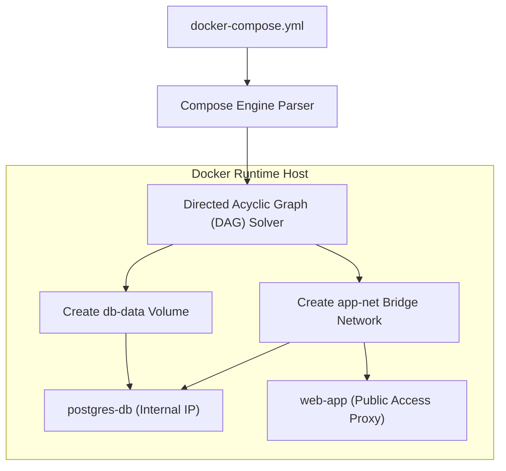

# Module 11 - Docker Compose

## 1. Learning Objectives
By the end of this module, you will be able to:
* Describe the syntax rules and structure of the Docker Compose specification.
* Configure healthcheck-based dependency sequences using `depends_on` conditions.
* Isolate development configs using multi-file inheritance and overrides.
* Constrain CPU, memory, and startup limitations within Compose service templates.
* Implement Compose profiles to toggle utility services on demand.
* Secure infrastructure keys using local configurations and secrets mounts.

---

## 2. Introduction
In a microservices-based application, running components manually using separate `docker run` statements is tedious and error-prone. Docker Compose provides a declarative mechanism to manage multi-container systems.

To understand Docker Compose, consider the **Orchestral Music Conductor Analogy**.
* **The Compose File (The Music Score)**: A single sheet of paper containing the parts for every instrument (API server, database, cache, proxy).
* **The Compose Engine (The Conductor)**: Reads the music score and signals the musicians. If the cellist (API server) must wait for the pianist (database) to finish tuning, the conductor holds the cellist back (`depends_on`).
* **Service Names (Instrument Identifiers)**: The cellist looks directly at the pianist using their title (service name) rather than trying to look up their seat coordinate (IP address).
* **Profiles (Special Orchestral Sections)**: The conductor can call for the full orchestra, or selectively run only the string section (profiles) for subset practices.

---

## 3. Why This Topic Exists
When managing applications with multiple services, configuring them individually creates major issues:
1. **Broken Startup Sequences**: The web server starts up and immediately crashes because the database is still running initial disk allocations.
2. **Brittle Network Linking**: Hardcoding container IPs breaks whenever containers restart.
3. **Configuration Drift**: Keeping commands in separate bash scripts makes version control and environment synchronization impossible.

---

## 4. Theory & Internal Mechanics

### Compose DAG Execution
Docker Compose parses the service definitions and constructs a **Directed Acyclic Graph (DAG)**. This graph maps out the order of container creations.
* **Network Resolution**: Compose automatically sets up a shared bridge network named `<project_name>_default`. Services automatically join this network and can resolve other services using DNS.
* **Variable Interpolation**: Compose replaces placeholder strings with environment variables pulled from local `.env` files or the shell.

---

## 5. Component Flow Diagram
This diagram shows how Docker Compose parses instructions and configures isolated networks and storage volumes:



---

## 6. Commands Reference

### 6.1 docker compose up
* **Purpose**: Build, recreate, and start container services defined in the YAML file.
* **Syntax**: `docker compose up [options] [services]`
* **Arguments**:
  * `-d`: Run in background (detached mode).
  * `--build`: Force compilation of images before starting.
* **Example**:
  ```bash
  docker compose up -d --build
  ```

### 6.2 docker compose down
* **Purpose**: Stop and remove containers, networks, and configurations created by `up`.
* **Syntax**: `docker compose down [options]`
* **Arguments**:
  * `-v`: Also delete volume storage mounts.
* **Example**:
  ```bash
  docker compose down -v
  ```

---

## 7. Practical Labs

### Lab 11.1: Healthcheck-based Dependencies
**Goal**: Configure a Node web app to wait until a PostgreSQL database is ready to receive connections before starting.

1. Create a `docker-compose.yml` file:
   ```yaml
   version: "3.8"
   services:
     web-app:
       image: node-app:prod
       environment:
         - DB_HOST=postgres-db
       depends_on:
         postgres-db:
           condition: service_healthy
       networks:
         - app-net
   
     postgres-db:
       image: postgres:16-alpine
       environment:
         - POSTGRES_PASSWORD=secret
         - POSTGRES_USER=postgres
         - POSTGRES_DB=test_db
       healthcheck:
         test: ["CMD-SHELL", "pg_isready -U postgres -d test_db"]
         interval: 5s
         timeout: 3s
         retries: 3
       networks:
         - app-net
   
   networks:
     app-net:
   ```
2. Start the stack:
   ```bash
   docker compose up
   ```
   * **Expected Output**: Note that `web-app` remains in a pending state until the postgres-db container finishes its initialization and passes the healthcheck test.

### Lab 11.2: Compose Profiles
**Goal**: Configure an optional administration tool container that only runs when explicitly requested.

1. Add a pgAdmin container configuration inside the compose file:
   ```yaml
     pgadmin:
       image: dpage/pgadmin4
       environment:
         - PGADMIN_DEFAULT_EMAIL=admin@admin.com
         - PGADMIN_DEFAULT_PASSWORD=admin
       ports:
         - "5050:80"
       profiles:
         - tools
       networks:
         - app-net
   ```
2. Start the standard stack:
   ```bash
   docker compose up -d
   ```
   * *Verify that `pgadmin` does not start.*
3. Start the stack including the tools profile:
   ```bash
   docker compose --profile tools up -d
   ```
   * *Verify that `pgadmin` starts and is accessible on port 5050.*

---

## 8. Real Projects: Microservice Stack with Network Separation
Orchestrate a microservices stack containing an ingress proxy, web application, and database. Ensure the database is completely isolated.

### Step 1: Write nginx.conf
```nginx
events { worker_connections 1024; }
http {
    upstream app_tier { server web-app:8080; }
    server {
        listen 80;
        location / {
            proxy_pass http://app_tier;
        }
    }
}
```

### Step 2: Write docker-compose.yml
```yaml
version: "3.8"
services:
  nginx-proxy:
    image: nginx:alpine
    ports:
      - "80:80"
    volumes:
      - ./nginx.conf:/etc/nginx/nginx.conf:ro
    depends_on:
      - web-app
    networks:
      - ingress-net

  web-app:
    image: node-app:prod
    environment:
      - DB_HOST=postgres-db
    depends_on:
      postgres-db:
        condition: service_healthy
    networks:
      - ingress-net
      - db-net

  postgres-db:
    image: postgres:16-alpine
    environment:
      - POSTGRES_PASSWORD=secret
    healthcheck:
      test: ["CMD-SHELL", "pg_isready -U postgres"]
      interval: 5s
      timeout: 3s
      retries: 3
    networks:
      - db-net

networks:
  ingress-net:
  db-net:
    internal: true
```

### Step 3: Launch and Verify
```bash
docker compose up -d
```
*Verify routing paths. The database is shielded from direct internet access.*

---

## 9. Troubleshooting & Diagnostics

### 1. Port Binding Collisions when Scaling Services
* **Symptoms**: Scaling command: `docker compose up --scale web-app=3` fails.
* **Root Cause**: The service definition has a host port mapped (e.g. `8080:8080`). When a second container tries to start, the host port is already occupied.
* **Solution**: Remove the host port binding from the service configuration (use `80` or `expose: - 80`), and place the containers behind an Nginx proxy load balancer.

### 2. Missing Environment Variables
* **Symptoms**: Ports map to null values, or credentials fall back to defaults.
* **Root Cause**: `.env` file is missing in the command path.
* **Solution**: Use `docker compose config` to dry-run variable values and locate formatting mistakes.

---

## 10. Production Examples
In production deployment frameworks, engineers use **Multi-File Inheritance** to manage staging and production environments without duplicating code. A master file (`docker-compose.yml`) defines the baseline container topology. A staging file (`docker-compose.staging.yml`) or production file (`docker-compose.prod.yml`) overrides volume drivers, port exposures, and resource constraints:
```bash
docker compose -f docker-compose.yml -f docker-compose.prod.yml up -d
```

---

## 11. Best Practices
* **Expose Only Ingress Ports**: Do not map host ports on backend databases or caching services.
* **Always Configure Healthchecks**: Prevents dependent containers from trying to connect before services are fully initialized.
* **Limit Resource Usage**: Set limits on CPU and memory usage to prevent a single service from exhausting host resources.

---

## 12. Interview Preparation

### Q1: What is the difference between `docker compose up`, `docker compose run`, and `docker compose start`?
* **Answer**:
  - `up` creates, configures, and starts the container stack, building missing images or updating configuration modifications.
  - `run` is used to run a one-off command container (e.g., database migrations) for a specific service.
  - `start` starts existing stopped containers without recreating them or checking for configuration adjustments.

### Q2: What happens when you scale a service in Docker Compose? How is routing handled?
* **Answer**: Scaling a service (`--scale service-name=N`) spins up multiple duplicate containers. If they use a host port mapping, they will collide. To handle routing, you should remove the host port mapping, and place the services behind a reverse proxy that queries the internal DNS name of the service, load-balancing traffic across all container IPs automatically.

### Q3: Explain why configs and secrets are preferred over environmental variables in production.
* **Answer**: Environmental variables can be inspected via `docker inspect` or read by any subprocess. Secrets and Configs are mounted as temporary, read-only files in memory (`/run/secrets/`), which protects sensitive keys from being exposed in image layers or metadata.

---

## 13. Cheat Sheet
| Task | Command |
|---|---|
| Start stack | `docker compose up -d` |
| Stop and purge | `docker compose down -v` |
| Validate YAML config | `docker compose config` |
| Stream service logs | `docker compose logs -f <service-name>` |

---

## 14. Assignments

### Beginner Assignment
* Configure a compose file that deploys a Flask container and a Redis container. Link them and verify connection from Flask to Redis.

### Intermediate Assignment
* Configure a compose file that mounts a secret file containing a fake API token into a service. Verify that the file appears in the container at `/run/secrets/api_token` in read-only mode.

---

## 15. Mini Project
Write a Python script that parses a `docker-compose.yml` file and validates that all database services have configured healthchecks and resource limits.

---

## 16. References & Further Reading
* [Docker Compose Specification Guide](https://docs.docker.com/compose/compose-file/)
* [Multi-file configurations in Compose](https://docs.docker.com/compose/extends/)
* [PostgreSQL pg_isready diagnostic CLI](https://www.postgresql.org/docs/current/app-pg-isready.html)
