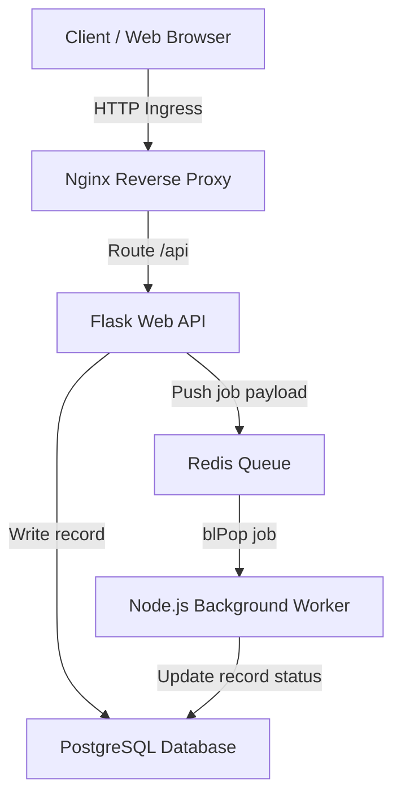

# Module 12 - Multi-Container Application Development

## 1. Learning Objectives
By the end of this module, you will be able to:
* Describe state distribution and service communication protocols in microservice clusters.
* Deploy a distributed task processing pipeline using API servers, message queues, databases, and reverse proxies.
* Implement hot-reloading (live-reloading) configurations inside active containers for development.
* Configure network mappings to attach remote IDE debuggers to containerized code execution.
* Audit multi-container request traces and system logs using native CLI filtering tools.
* Troubleshoot CORS headers, database migration synchronization blocks, and socket locks.

---

## 2. Introduction
Developing and testing applications composed of multiple microservices introduces complexity. In a local setup, developers need a way to run their services, monitor logs, modify code, and debug execution steps without rebuilding containers after every line change.

To understand multi-container environments, consider the **Post Office Message System Analogy**.
* **The Customers (The Frontend Web Clients)**: People sending letters to get tasks done.
* **The Mailbox Clerks (The Flask Web APIs)**: They take the letters from the customers, verify their identities, log the transaction in a ledger (the PostgreSQL database), and drop the envelopes into a processing box.
* **The Sorting Bin (The Redis Queue)**: Holds the letters in order.
* **The Backroom Workers (The Node.js Workers)**: They retrieve letters from the sorting bin one by one. If a task takes a long time, the worker processes it in the back, updates the ledger, and notes the job is done.
* **The Building Lobby Ingress (The Nginx Proxy)**: Directs people coming into the building, routing customer inquiries to the front desk clerks, and blocking them from wandering into the backroom database archives.

---

## 3. Why This Topic Exists
In simple monolothic apps, you run a single process. In microservices, developers face major runtime coordination issues:
1. **Slow Feedback Loops**: Having to wait 60 seconds to rebuild a container image just to verify a spelling correction in a logging statement.
2. **CORS Blockages**: Web browsers block front-end scripts from calling API containers due to security origins differences.
3. **Database Migration Failures**: App containers crash on boot because they execute database table creations before the DB container has fully allocated its folders.

---

## 4. Theory & Internal Mechanics

### Decoupled State & Service Communication
* **Synchronous Communication**: HTTP/REST calls made via reverse proxies to process fast CRUD operations.
* **Asynchronous Communication**: Message brokers (like Redis or RabbitMQ) store low-priority, high-latency job payloads. Workers poll the broker to execute tasks asynchronously.
* **Development Reloading (Hot-Reloading)**: Code directories on the host are bind-mounted into target containers. A file-system watcher (like `nodemon` or python's auto-reloader) running inside the container detects changes and restarts the app server process instantly.
* **Remote Debugger Port Mapping**: The runtime runtime daemon (e.g. Node inspector, Python debugpy) exposes a debugging TCP port (e.g. `9229`) inside the container. Mapping this port to the host allows an IDE to attach to the live container process.

---

## 5. Component Flow Diagram
This diagram shows how a task travels through the microservices pipeline:



---

## 6. Commands Reference

### 6.1 Node Inspector Expositions
* **Purpose**: Launch a Node process exposing the debugging port.
* **Syntax**: `node --inspect=<bind-ip>:<port> <file.js>`
* **Example**:
  ```bash
  node --inspect=0.0.0.0:9229 worker.js
  ```
* **Production usage**: Strict development flag only. Do not enable in production images due to performance and security concerns.

### 6.2 docker compose logs
* **Purpose**: Stream consolidated logs from all running services.
* **Syntax**: `docker compose logs [options] [services]`
* **Arguments**:
  * `-f`: Follow/stream logs in real-time.
  * `--tail`: Number of lines to show from end.
* **Example**:
  ```bash
  docker compose logs -f --tail 20 worker-srv
  ```

---

## 7. Practical Labs

### Lab 12.1: Distributed Task Queue Pipeline
**Goal**: Deploy a Python API that receives tasks, pushes them to Redis, and a Node worker that processes them and updates a PostgreSQL database.

1. Set up the project directories:
   ```
   app/
   ├── docker-compose.yml
   ├── nginx.conf
   ├── api/
   │   ├── app.py
   │   └── Dockerfile.dev
   └── worker/
       ├── worker.js
       ├── package.json
       └── Dockerfile.dev
   ```
2. Write the API `api/app.py`:
   ```python
   import os, redis, psycopg2
   from flask import Flask, request, jsonify
   app = Flask(__name__)
   
   r = redis.Redis(host=os.environ.get('REDIS_HOST', 'redis-srv'), port=6379)
   
   @app.route('/task', methods=['POST'])
   def create_task():
       data = request.get_json()
       title = data.get('title', 'Task')
       # Connect to PostgreSQL
       conn = psycopg2.connect(
           host=os.environ.get('DB_HOST', 'postgres-db'),
           database='tasks', user='postgres', password='pwd'
       )
       cur = conn.cursor()
       cur.execute("INSERT INTO tasks (title, status) VALUES (%s, 'pending') RETURNING id;", (title,))
       task_id = cur.fetchone()[0]
       conn.commit()
       cur.close()
       conn.close()
       
       # Queue task
       r.rpush('task_queue', task_id)
       return jsonify({"id": task_id, "status": "pending"}), 201
   
   if __name__ == '__main__':
       app.run(host='0.0.0.0', port=5000, debug=True)
   ```
3. Write the Worker `worker/worker.js`:
   ```javascript
   const { Client } = require('pg');
   const redis = require('redis');
   
   async function run() {
       const db = new Client({ host: 'postgres-db', database: 'tasks', user: 'postgres', password: 'pwd' });
       await db.connect();
       const r = redis.createClient({ url: 'redis://redis-srv:6379' });
       await r.connect();
       console.log("Worker waiting for tasks...");
       while (true) {
           const job = await r.blPop('task_queue', 0);
           const taskId = job.element;
           console.log(`Processing task: ${taskId}`);
           await new Promise(resolve => setTimeout(resolve, 3000)); // Simulate work
           await db.query("UPDATE tasks SET status = 'completed' WHERE id = $1", [taskId]);
           console.log(`Task ${taskId} completed`);
       }
   }
   run();
   ```
4. Build the complete environment using `docker-compose.yml`:
   *Configure the services, mounting the directories as volumes to enable hot-reloading.*

### Lab 12.2: Attaching Chrome DevTools Debugger to Node Container
**Goal**: Attach Google Chrome's debugger to the Node process running inside a container.

1. Ensure the Node service exposes port `9229` in `docker-compose.yml`.
2. Start the stack:
   ```bash
   docker compose up -d
   ```
3. Open Chrome and navigate to: `chrome://inspect`.
4. Click "Configure..." and add `localhost:9229`.
5. Under "Remote Target", locate the container worker script and click "Inspect".
6. Set a breakpoint in the file, trigger a task, and step through the code execution inside the container.

---

## 8. Real Projects: Dev Environment Hot-Reload Setup
Configure a development Compose file that mounts code volumes on the host system to live-reload changes.

### Step 1: Write Dockerfile.dev for Node.js
```dockerfile
FROM node:20-alpine
WORKDIR /app
COPY package*.json ./
RUN npm install
RUN npm install -g nodemon
COPY . .
ENTRYPOINT ["nodemon", "worker.js"]
```

### Step 2: Configure the service in docker-compose.yml
```yaml
  worker-srv:
    build:
      context: ./worker
      dockerfile: Dockerfile.dev
    volumes:
      - ./worker:/app
    environment:
      - REDIS_HOST=redis-srv
```

### Step 3: Edit and verify hot-reloads
Run the service, modify a log line in `worker/worker.js`, save the file, and inspect the terminal logs to verify nodemon automatically restarts the process.

---

## 9. Troubleshooting & Diagnostics

### 1. Database Schema Migrations Out of Sync
* **Symptoms**: Application containers start up, attempt to query a new table, and crash because the table does not exist.
* **Root Cause**: Running migrations before the database is initialized.
* **Solution**: Add migration commands inside a startup wrapper script (`wait-for-it.sh`) or delay execution until the database healthcheck is complete.

### 2. CORS Blockages
* **Symptoms**: Browser console blocks API requests, throwing "CORS policy" errors.
* **Root Cause**: The client calls the API using a different domain or port.
* **Solution**: Route all frontend and backend traffic through an Nginx proxy container that normalizes domains, or configure CORS response headers inside the API.

---

## 10. Production Examples
In production systems, hot-reloading and port exposures are strictly disabled. Containers are packaged as immutable images with static dependencies. To collect and trace logs across microservices, teams deploy centralized logging agents (like Fluentbit or Promtail) inside the host nodes, which scrape container standard outputs and forward them to dashboards (like Grafana Loki or Elasticsearch).

---

## 11. Best Practices
* **Keep Images Immutable in Staging/Prod**: Never use bind volumes or hot-reloading outside of local development.
* **Implement Healthchecks on Brokers**: Ensure Redis/RabbitMQ are fully ready before starting API processes.
* **Isolate Database Tiers**: Set `internal: true` on DB networks to block all outbound routing paths.

---

## 12. Interview Preparation

### Q1: How do you configure hot-reloading for containers during local development?
* **Answer**: Hot-reloading is configured by bind-mounting the host's application directory into the container's working directory (`volumes: - ./src:/app`). Inside the container, you run a filesystem watcher (like `nodemon` for Node or debug mode for Python) as the entrypoint. When a file is modified on the host, it changes inside the container, triggering the watcher to restart the process.

### Q2: What is the risk of keeping debugging ports exposed in production Dockerfiles?
* **Answer**: Exposing debugging ports (like Node's `9229` or Python's `5678`) allows anyone with network access to attach to the application process, execute arbitrary code, modify runtime state, or inspect memory contents, leading to security breaches.

### Q3: How do you handle database migration sequences in a multi-container stack?
* **Answer**:
  1. Configure a Docker healthcheck on the database service checking if it's accepting queries (e.g. using `pg_isready`).
  2. Configure `depends_on` with `condition: service_healthy` on the API or migration runner service.
  3. Wrap migration execution in a script that checks connectivity before writing schemas.

---

## 13. Cheat Sheet
| Target | Configuration | Purpose |
|---|---|---|
| Mapped Volume | `volumes: - ./code:/app` | Hot-reloading code edits |
| Debug Port | `ports: - "9229:9229"` | Attach IDE debuggers |
| Log Tracker | `docker compose logs -f` | Consolidated log streaming |
| Health Wait | `condition: service_healthy` | Safe startup sequencing |

---

## 14. Assignments

### Beginner Assignment
* Configure a Python/Flask container with live debugging enabled. Attach a browser debugger and step through a routing function.

### Intermediate Assignment
* Deploy a Compose stack containing Nginx, Python, and PostgreSQL. Implement a custom healthcheck that tests if PostgreSQL is accepting connections and blocks the Python API from launching until it passes.

---

## 15. Mini Project
Write a shell script that launches a multi-container stack, tests the health of each endpoint using curl, and alerts if any service fails to start within 30 seconds.

---

## 16. References & Further Reading
* [Node.js Debugging Guide](https://nodejs.org/en/docs/guides/debugging-getting-started/)
* [Centralized Logging in Docker Systems](https://docs.docker.com/config/containers/logging/)
* [CORS Policy Web Standards](https://developer.mozilla.org/en-US/docs/Web/HTTP/CORS)
