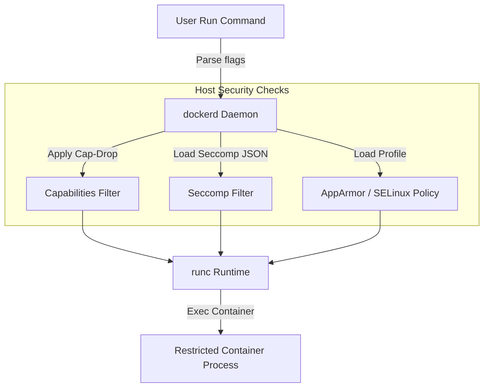

# Module 13 - Docker Security

## 1. Learning Objectives
By the end of this module, you will be able to:
* Describe the container isolation landscape, including namespaces, capabilities, seccomp, and LSMs.
* Harden container runtimes by dropping unused Linux Kernel Capabilities (`--cap-drop`).
* Restrict dangerous container system calls using custom Seccomp profiles (`--security-opt seccomp`).
* Deploy containers with a read-only root filesystem (`--read-only`) and custom volatile mount points.
* Configure rootless Docker runtimes to secure the host operating system from container escapes.
* Perform image vulnerability audits using tools like Trivy or Docker Scout.

---

## 2. Introduction
In standard operating systems, processes run with broad access permissions. Containers isolate processes, but by default, they share the host kernel. If a containerized process is compromised, it can attempt to escape to the host or hijack system resources. Docker security aims to minimize this attack surface.

To understand Docker security, consider the **High-Security Prison Facility Analogy**.
* **Host Kernel (The Prison Facility)**: The main building. If someone controls the building, they control everything.
* **Containers (Isolated Prison Cells)**: Cells separated by steel walls (namespaces).
* **Linux Capabilities (Keyrings)**: Instead of giving a guard a master keyring (root access), you give them a keyring with a single key that only opens the laundry room (`CAP_NET_BIND_SERVICE`). They cannot unlock the outer gate.
* **Seccomp Profiles (The Warden's Rules)**: A rulebook listing what actions a prisoner can perform. If a prisoner tries to tunnel through the floor (make a system call like `mount` or `reboot`), the warden detects this violation and stops the action immediately.
* **Read-Only Root Filesystem (Bolted Down Furniture)**: All items in the cell are welded to the floor. The prisoner can use them but cannot dismantle or modify them to build weapons (malware injection).

---

## 3. Why This Topic Exists
Many organizations run containers in their default configurations. This introduces critical security risks:
1. **Host Privilege Escalation**: A process running as `root` inside a container shares the UID `0` value on the host. If the container process executes a kernel vulnerability, it can gain full root access to the host server.
2. **Resource Exhaustion Attacks**: Without constraints, a single compromised container can run fork bombs to consume all PIDs, freezing the entire host system.
3. **Malware Injection**: If the container filesystem is writable, attackers can download and run malicious scripts (e.g. crypto miners) inside your app directories.

---

## 4. Theory & Internal Mechanics

### Kernel Isolation Layers
* **Linux Capabilities**: Splits the power of `root` into 40+ distinct privileges. By default, Docker drops dangerous capabilities (like `CAP_SYS_ADMIN` and `CAP_SYS_RAWIO`) and keeps only 14 basic ones.
* **Seccomp (Secure Computing Mode)**: A sandboxing mechanism in the Linux kernel that filters system calls. Docker's default seccomp profile blocks ~44 dangerous system calls out of 300+ (such as `reboot` and `sys_chroot`).
* **LSMs (Linux Security Modules)**: Mandatory Access Control (MAC) layers like **AppArmor** or **SELinux** that define profiles limiting what paths a process can read or write.

```
+-------------------------------------------------------+
|                 Container Application                 |
+-------------------------------------------------------+
                           │ (System Call)
                           ▼
┌───────────────────────────────────────────────────────┐
│              Kernel Capabilities Filter               │ (e.g. CAP_SYS_ADMIN?)
└───────────────────────────────────────────────────────┘
                           │ (Passes)
                           ▼
┌───────────────────────────────────────────────────────┐
│               Seccomp Syscall Filter                  │ (e.g. sys_reboot?)
└───────────────────────────────────────────────────────┘
                           │ (Passes)
                           ▼
┌───────────────────────────────────────────────────────┐
│             LSM Security (AppArmor/SELinux)           │ (e.g. write to /etc?)
└───────────────────────────────────────────────────────┘
                           │ (Passes)
                           ▼
+-------------------------------------------------------+
|                      Linux Kernel                     |
+-------------------------------------------------------+
```

---

## 5. Component Flow Diagram
This diagram shows how Docker processes security policies when executing a container:



---

## 6. Commands Reference

### 6.1 --cap-drop / --cap-add
* **Purpose**: Remove or append specific kernel privileges for a container.
* **Syntax**: `docker run --cap-drop=<capability> <image>`
* **Examples**:
  ```bash
  # Drop all capabilities, add only service port binding
  docker run -d --cap-drop=ALL --cap-add=NET_BIND_SERVICE nginx:alpine
  ```
* **Production usage**: Hardening ingress proxies to prevent network modifications.

### 6.2 --security-opt seccomp
* **Purpose**: Load custom system call restrictions from a JSON file.
* **Syntax**: `docker run --security-opt seccomp=<profile.json> <image>`
* **Example**:
  ```bash
  docker run -it --security-opt seccomp=custom_profile.json alpine sh
  ```

---

## 7. Practical Labs

### Lab 13.1: Securing a Web Service by Dropping Kernel Capabilities
**Goal**: Launch a container, demonstrate its ability to modify network configurations, then relaunch it dropping capabilities to block network attacks.

1. Launch a standard container with default capabilities:
   ```bash
   docker run -d --name cap-test alpine sleep 3600
   ```
2. Attempt to change the interface state inside the container:
   ```bash
   docker exec -it cap-test ip link set lo down
   ```
   * *Verify this command succeeds, disabling the loopback interface.*
3. Launch a hardened container dropping all capabilities:
   ```bash
   docker run -d --name cap-secure --cap-drop=ALL alpine sleep 3600
   ```
4. Attempt to run the same command:
   ```bash
   docker exec -it cap-secure ip link set lo down
   ```
   * **Expected Output**: `ip: SIOCSIFFLAGS: Operation not permitted` (demonstrates that dropping capabilities blocks root actions inside the container).

### Lab 13.2: Restricting Syscalls using a custom Seccomp profile
**Goal**: Build a custom seccomp profile that blocks the `mkdir` syscall, preventing directories from being created inside the container.

1. Save the following custom seccomp JSON as `block-mkdir.json`:
   ```json
   {
       "defaultAction": "SCMP_ACT_ALLOW",
       "architectures": [
           "SCMP_ARCH_X86_64",
           "SCMP_ARCH_X86"
       ],
       "syscalls": [
           {
               "name": "mkdir",
               "action": "SCMP_ACT_ERRNO",
               "args": []
           }
       ]
   }
   ```
2. Run a container loading this profile:
   ```bash
   docker run -it --security-opt seccomp=block-mkdir.json alpine sh
   ```
3. Inside the container, attempt to create a directory:
   ```bash
   mkdir /tmp/test-dir
   ```
   * **Expected Output**: `mkdir: can't create directory '/tmp/test-dir': Operation not permitted` (verifies that the seccomp profile blocked the syscall at the kernel level).

---

## 8. Real Projects: Hardened Rootless Nginx
Deploy an Nginx container running in a completely rootless, read-only configuration, preventing attackers from writing to root filesystems or binding privileged host ports.

### Step 1: Create a non-root Dockerfile for Nginx
```dockerfile
FROM nginx:alpine
# Configure Nginx to use non-root folders
RUN sed -i 's/listen       80;/listen       8080;/' /etc/nginx/conf.d/default.conf && \
    mkdir -p /tmp/nginx && \
    chown -R 101:101 /tmp/nginx /var/cache/nginx /var/run
COPY index.html /usr/share/nginx/html/index.html
USER 101
EXPOSE 8080
```

### Step 2: Write basic index.html
```html
<h1>Secure Nginx</h1>
```

### Step 3: Build the container
```bash
docker build -t rootless-nginx .
```

### Step 4: Launch container with read-only root filesystem
Mount temporary directories into RAM (`tmpfs`) to allow Nginx to write volatile cache and pid files:
```bash
docker run -d --name secure-web \
  --read-only \
  --tmpfs /tmp \
  --tmpfs /var/cache/nginx \
  --tmpfs /var/run \
  -p 8080:8080 \
  rootless-nginx
```
*Verify that writing to root directories fails, but the web service runs successfully.*

---

## 9. Troubleshooting & Diagnostics

### 1. "Read-only file system" Errors
* **Symptoms**: The application crashes on start, logging: `IOError: [Errno 30] Read-only file system: '/app/cache/log.txt'`.
* **Root Cause**: The container was launched with the `--read-only` flag, but the application attempts to write logs, temp files, or lock files to the disk.
* **Solution**: Mount a `tmpfs` volume to the specific writable path required by the application:
  ```bash
  docker run -d --read-only --tmpfs /app/cache my-app
  ```

### 2. Seccomp Syscall Blocking Crashes
* **Symptoms**: The process crashes with generic segmentation faults or exit code `159` (SIGSYS).
* **Root Cause**: The application executed a system call (like `clock_settime`) blocked by the default seccomp profile or a custom profile.
* **Solution**: Inspect the host logs using `journald` or `dmesg` to locate the blocked syscall, and adjust the seccomp JSON rules accordingly.

---

## 10. Production Examples
In production cloud clusters (such as Kubernetes), standard policy engines (like **Kyverno** or **OPA Gatekeeper**) enforce security policies. These platforms automatically reject any container deployment if its configuration lacks flags like `readOnlyRootFilesystem: true` or specifies privileged access execution.

---

## 11. Best Practices
* **Drop All Capabilities by Default**: Use `--cap-drop=ALL` and selectively add back only what is required (e.g. `--cap-add=NET_BIND_SERVICE`).
* **Run in Read-Only Mode**: Ensure container filesystems are immutable, mounting temporary paths to memory.
* **Use Distroless or Scratch Images**: Minimize the package surface to eliminate potential attack vectors.

---

## 12. Interview Preparation

### Q1: What is the difference between Linux Capabilities and Seccomp?
* **Answer**:
  - **Linux Capabilities** divide root-level privileges (UIDs) into distinct permissions (such as `CAP_CHOWN` or `CAP_NET_ADMIN`). They control what resources a process can modify.
  - **Seccomp** filters system calls (syscalls) made from user space to the kernel (such as `sys_reboot` or `sys_ptrace`). It controls what actions a process can request the kernel to perform.

### Q2: Why is the `--privileged` flag dangerous in production?
* **Answer**: The `--privileged` flag bypasses all namespace isolations, seccomp filters, and capabilities restrictions. The container gains full root access to the host's physical devices and files, allowing a simple breakout to compromise the host.

### Q3: What is "Rootless Mode" in Docker?
* **Answer**: Rootless mode runs both the Docker daemon (`dockerd`) and the containers as a non-root user. It leverages user namespaces to map container root permissions to unprivileged host UIDs, guaranteeing that a container breakout cannot compromise host system root folders.

---

## 13. Cheat Sheet
| Option | Command | Security Value |
|---|---|---|
| Drop Capabilities | `--cap-drop=ALL` | Disables root process privileges |
| Immutable Disk | `--read-only` | Prevents file system writes |
| Syscall Filter | `--security-opt seccomp=<file>` | Blocks dangerous kernel commands |
| RAM Mount | `--tmpfs <path>` | Directs temp writes to memory |

---

## 14. Assignments

### Beginner Assignment
* Scan a public Node.js image using `trivy image <image>` and count the number of high or critical vulnerabilities.

### Intermediate Assignment
* Launch an Nginx container with `--read-only` enabled and configure the necessary `--tmpfs` folders to allow Nginx to start without permission errors.

---

## 15. Mini Project
Write a bash script that audits all running containers on a host and logs any container running with root privileges, missing read-only roots, or having `SYS_ADMIN` capabilities enabled.

---

## 16. References & Further Reading
* [Docker Security Guidelines](https://docs.docker.com/engine/security/)
* [Linux Kernel Capabilities Specification](https://man7.org/linux/man-pages/man7/capabilities.7.html)
* [Default Docker Seccomp Profile Configuration](https://github.com/moby/moby/blob/master/profiles/seccomp/default.json)
