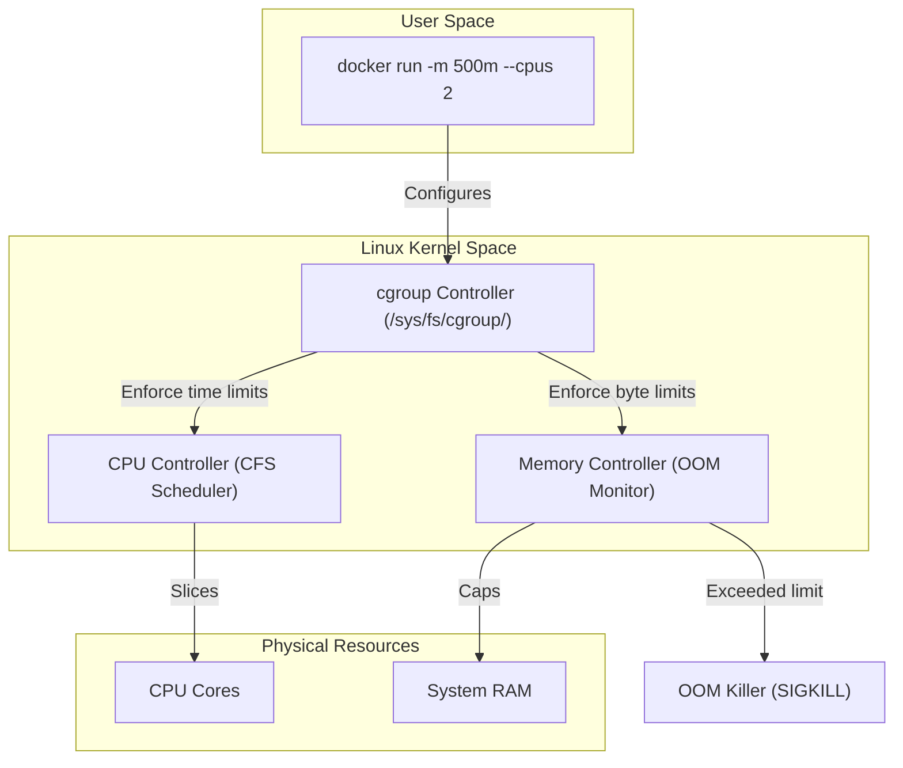

# Module 14 - Docker Performance & Optimization

## 1. Learning Objectives
By the end of this module, you will be able to:
* Explain how the Linux Kernel cgroups enforce CPU and memory limits on containers.
* Configure strict memory limits (`--memory`) and soft memory reservations (`--memory-reservation`).
* Allocate precise CPU allocations using fractional core mappings (`--cpus`) and CPU shares (`--cpu-shares`).
* Analyze real-time container resource consumption using `docker stats` and custom scripts.
* Trigger and diagnose Out-Of-Memory (OOM) killer terminations on resource-strained containers.
* Optimize network and storage configurations to reduce virtualized performance overhead.

---

## 2. Introduction
By default, a Docker container has no resource limits and can consume as much CPU and memory as the host operating system's kernel allows. In multi-tenant environments or production servers, a single container can exhaust system resources, starving neighboring services.

To understand container resource allocations, consider the **Office Shared Desk Room Analogy**.
* **The Host Machine (The Shared Desk Room)**: A room with 8 desks and a cooler containing 8 liters of water.
* **Containers (Working Teams)**: Groups of workers sitting in the room.
* **Memory Limits (Water Allocations)**: If a team has no limit, one thirsty worker can drink all 8 liters, causing other teams to collapse from dehydration (OOM-killer). A strict limit (`--memory=2g`) caps them at 2 liters.
* **CPU Shares (Desk Access Priority)**: When the room is empty, any worker can use all 8 desks. But when the room gets busy, the manager limits desks based on priority tickets (`--cpu-shares`). A team with 512 tickets gets half the desk time of a team with 1024 tickets.
* **CPU Cores (Dedicated Desks)**: Allocating dedicated desks (`--cpus=2`) ensures a team has 2 desks reserved exclusively for them, regardless of how busy the room becomes.

---

## 3. Why This Topic Exists
Unconstrained containers introduce major stability issues:
1. **Host Freezes (OOM Lockups)**: If a database or node app leaks memory, the Linux kernel will run out of RAM, occasionally killing host-level processes (like the SSH daemon or Docker engine itself) to survive.
2. **Noisy Neighbor Syndrome**: A CPU-heavy batch job container can consume 100% of the host's CPU cycles, causing latency spikes in adjacent API containers.
3. **Emulation Latency**: Running x86 images on ARM architectures (or vice versa) via emulation introduces high CPU overhead.

---

## 4. Theory & Internal Mechanics

### Cgroups v1 vs v2 Resource Allocation
* **Memory Limits**: The kernel tracks allocations in bytes. If a container exceeds its hard limit (`memory.max`), the kernel invokes the Out-Of-Memory (OOM) killer to terminate the main process.
* **CPU Limits**:
  - **CFS (Completely Fair Scheduler) Bandwidth**: CPU allocations are enforced over a period (usually 100ms). Setting `--cpus=1.5` translates to allowing 150ms of CPU run time every 100ms.
  - **CPU Shares**: A relative weight value. If CPU is fully saturated, shares determine the scheduling ratio.

---

## 5. Component Flow Diagram
This diagram shows how the Linux kernel monitors and limits container resource usage:



---

## 6. Commands Reference

### 6.1 Memory Limit Flags
* **Purpose**: Restrict container RAM and Swap usage.
* **Syntax**: `docker run [flags] <image>`
* **Arguments**:
  - `-m` or `--memory`: Hard memory limit (e.g. `512m`, `2g`).
  - `--memory-reservation`: Soft limit (must be less than `-m`). Docker only enforces this when the host runs low on memory.
  - `--memory-swap`: Total memory plus swap allocation.
* **Example**:
  ```bash
  docker run -d --memory=512m --memory-swap=1g nginx:alpine
  ```

### 6.2 CPU Limit Flags
* **Purpose**: Allocate CPU time.
* **Syntax**: `docker run [flags] <image>`
* **Arguments**:
  - `--cpus`: Fractional core count (e.g. `1.5` cores).
  - `--cpu-shares`: Weight value (defaults to `1024`).
* **Example**:
  ```bash
  docker run -d --cpus=2.5 --cpu-shares=512 alpine sleep 3600
  ```

---

## 7. Practical Labs

### Lab 14.1: Triggering the OOM-Killer
**Goal**: Launch a container with strict memory limits, execute a script that leaks memory, and observe how the Linux kernel terminates the container.

1. Write a simple Python script `leak.py` that allocates memory:
   ```python
   # leak.py
   import time
   data = []
   print("Starting memory allocation loop...")
   while True:
       data.append(' ' * 10**6) # Allocate 1MB
       print(f"Allocated: {len(data)} MB")
       time.sleep(0.1)
   ```
2. Create a Dockerfile:
   ```dockerfile
   FROM python:3.11-slim
   COPY leak.py .
   ENTRYPOINT ["python", "leak.py"]
   ```
3. Build the image:
   ```bash
   docker build -t oom-demo .
   ```
4. Run the container with a strict memory limit of 50MB:
   ```bash
   docker run --name leak-test --memory=50m oom-demo
   ```
5. Observe the output:
   * **Expected Output**: The allocation runs up to ~45-48 MB and then exits abruptly.
6. Verify the exit reason:
   ```bash
   docker inspect leak-test -f '{{.State.OOMKilled}}'
   ```
   * **Expected Output**: `true` (proves the container process was killed by the OOM-killer).

### Lab 14.2: Benchmarking Network Throughput: bridge vs host
**Goal**: Run network benchmark tests using `iperf3` to compare latency and throughput differences between bridge networking and host networking.

1. Start an `iperf3` server on the host machine:
   ```bash
   docker run -d --name iperf-srv -p 5201:5201 networkstatic/iperf3 -s
   ```
2. Run the client on the bridge network and test performance:
   ```bash
   docker run --rm networkstatic/iperf3 -c 172.17.0.1
   ```
   * *Record the throughput (e.g. 15 Gbits/sec).*
3. Relaunch the server using the `host` network driver:
   ```bash
   docker run -d --name iperf-host --network host networkstatic/iperf3 -s
   ```
4. Run the client on the host network:
   ```bash
   docker run --rm --network host networkstatic/iperf3 -c 127.0.0.1
   ```
   * **Expected Outcome**: Observe that host networking yields higher throughput and lower CPU utilization because it bypasses the virtual network bridge and iptables NAT lookups.

---

## 8. Real Projects: Compose Resource Constraint Enforcements
Configure a production `docker-compose.yml` file that defines CPU and memory limits for web and caching services, protecting the host system from resource starvation.

### Step 1: Write docker-compose.yml
```yaml
version: "3.8"
services:
  web-app:
    image: node:20-alpine
    command: ["node", "-e", "setInterval(() => {}, 1000)"]
    deploy:
      resources:
        limits:
          cpus: '0.50'
          memory: 256M
        reservations:
          cpus: '0.25'
          memory: 128M

  cache-redis:
    image: redis:alpine
    deploy:
      resources:
        limits:
          cpus: '1.0'
          memory: 512M
```

### Step 2: Deploy and verify constraints
```bash
docker compose up -d
```
*Verify that resource limits are applied:*
```bash
docker stats --no-stream
```
*Observe that the `MEM LIMIT` column matches the limits defined in the Compose file.*

---

## 9. Troubleshooting & Diagnostics

### 1. High CPU Throttling
* **Symptoms**: Application performance is extremely slow, and API requests time out, but `docker stats` shows CPU usage is below 100%.
* **Root Cause**: The container's CPU CFS period limits are too strict, causing the kernel to throttle container processes.
* **Solution**: Check cgroup throttling metrics:
  ```bash
  cat /sys/fs/cgroup/cpu/docker/<long-id>/cpu.stat
  ```
  *If `nr_throttled` is high, increase the `--cpus` allocation.*

### 2. Containers Exit with Exit Code 137
* **Symptoms**: Containers crash without logging any application error messages.
* **Root Cause**: Exit code `137` indicates the process was killed by a `SIGKILL` (128 + 9). This typically happens when the host kernel's OOM-killer terminates the container due to memory exhaustion.
* **Solution**: Increase the container memory limits (`-m`) or debug the application code for memory leaks.

---

## 10. Production Examples
In large enterprise clusters, platform engineers use **Resource Quotas** and **Limit Ranges**. They define baseline configurations that enforce CPU and memory reservations for every deployed container. This prevents developers from deploying unchecked configurations, ensuring stable co-existence on physical nodes.

---

## 11. Best Practices
* **Always Declare Memory Limits**: Never run containers without limits in production to prevent host OOM freezes.
* **Align Node/JVM heap settings**: Ensure language runtime memory configurations (e.g. `NODE_OPTIONS=--max-old-space-size`) are configured slightly below the container's hard memory limit (`-m`) to allow graceful internal handling before the OOM-killer intervenes.
* **Utilize CPU Reservations**: Use soft reservations (`--cpu-shares`) to maximize CPU utility on multi-tenant nodes.

---

## 12. Interview Preparation

### Q1: What happens when a container exceeds its memory limit vs its CPU limit?
* **Answer**:
  - When a container exceeds its **memory limit**, the kernel's OOM-killer immediately terminates the process inside the container, returning exit code `137`.
  - When a container exceeds its **CPU limit**, the process is not terminated. Instead, the kernel's CFS scheduler throttles (delays) the execution of its system cycles, which slows down application response times without stopping the process.

### Q2: What is the relationship between `--memory` and `--memory-swap`?
* **Answer**: `--memory` defines the hard limit of physical RAM the container can use. `--memory-swap` defines the total memory (RAM + swap disk space) the container can consume. If you set `--memory=512m` and `--memory-swap=1g`, the container can use 512MB of RAM and 512MB of swap space once RAM is exhausted.

### Q3: How do you verify if a container has been throttled?
* **Answer**: You can check the container's cgroup stats on the host filesystem under `/sys/fs/cgroup/` (for v2, `/sys/fs/cgroup/system.slice/...`). Inside the cgroup folder, read the `cpu.stat` file. If the `nr_throttled` count increases over time, the container is being actively throttled due to exceeding its CPU limits.

---

## 13. Cheat Sheet
| Target | Command | Purpose |
|---|---|---|
| Hard RAM Limit | `--memory=<size>` | Absolute RAM cap |
| Soft RAM Limit | `--memory-reservation=<size>` | Eviction threshold limit |
| Dedicated Cores | `--cpus=<count>` | Reserved scheduler cycles |
| CPU Weight | `--cpu-shares=<weight>` | Saturated CPU priority share |

---

## 14. Assignments

### Beginner Assignment
* Run a container with memory restricted to 128MB. Check its memory settings from inside the container by reading `/sys/fs/cgroup/memory/memory.limit_in_bytes` (or cgroups v2 equivalent).

### Intermediate Assignment
* Write a docker-compose file that runs two services: `service-low` with `--cpu-shares=256` and `service-high` with `--cpu-shares=1024`. Use a benchmarking tool (like `stress`) to load both services and verify the CPU distribution ratio under resource saturation.

---

## 15. Mini Project
Write a bash script that loops through all running containers, queries their memory utilization, and outputs a CSV report listing the containers consuming more than 80% of their configured memory limits.

---

## 16. References & Further Reading
* [Docker Resource Constraints Reference](https://docs.docker.com/config/containers/resource_constraints/)
* [Linux Kernel CFS Bandwidth Design Details](https://www.kernel.org/doc/Documentation/scheduler/sched-bwc.txt)
* [cgroups v2 Kernel Specification](https://www.kernel.org/doc/Documentation/cgroup-v2.txt)
