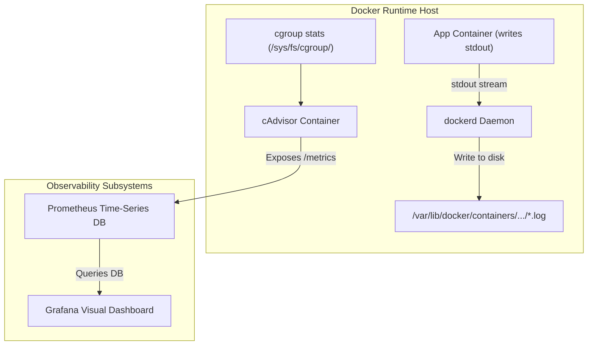

# Module 15 - Logging, Monitoring & Observability

## 1. Learning Objectives
By the end of this module, you will be able to:
* Describe the architecture of Docker's logging subsystems and the lifecycle of container stdout streams.
* Configure alternative logging drivers (`json-file`, `journald`, `fluentd`, `syslog`) globally and per-container.
* Set up automated log rotation policies in `daemon.json` to prevent disk space exhaustion.
* Deploy a containerized monitoring pipeline using cAdvisor, Prometheus, and Grafana.
* Track container metrics (CPU utilization, memory limits, network packets, storage I/O).
* Troubleshoot logging latencies, metrics collection failures, and empty Grafana dashboards.

---

## 2. Introduction
In a production container environment, you cannot debug applications by manually SSHing into servers and running commands. Observability—combining logs, metrics, and traces—is necessary to understand the health of distributed container systems.

To understand logging and monitoring, consider the **Hospital Patient Vital Tracker Analogy**.
* **The Patient (The Active Container)**: Running in isolation.
* **Standard Output/stdout (Patient Talking)**: Anything the patient says is immediately recorded in the chart by the nurse. In Docker, any text printed by the app process (`stdout` / `stderr`) is intercepted by the **Logging Driver** and written to a file on disk.
* **Log Rotator (The Chart Archiver)**: The patient's chart cannot grow forever. Once it reaches 10 pages (file size limit), the old pages are stored in a box, and a new chart is started. If there are too many boxes, the oldest ones are shredded (max files limit).
* **cAdvisor (The Vital Sign Monitor)**: A device attached to the patient tracking heart rate (CPU), blood pressure (memory), and oxygen levels (network throughput) in real-time.
* **Prometheus (The Medical Record Database)**: Periodically records the vital signs from the monitor every 15 seconds (scraping metrics) and saves them for analysis.
* **Grafana (The Nurse's Dashboard)**: A screen at the front desk showing pretty graphs of the vitals, flashing red if a patient's vitals drop too low (alerts).

---

## 3. Why This Topic Exists
Without managed observability, container operations suffer from critical failures:
1. **Dangling Log Disk Crashes**: By default, Docker stores logs as JSON files on the host (`/var/lib/docker/containers/...`). These logs grow infinitely. A high-traffic app printing logs can consume hundreds of gigabytes, filling the host disk and crashing the entire server.
2. **Missing Historical Data**: When a container crashes, its local state is lost. If logs are not forwarded to an external system, you cannot analyze why the crash occurred.
3. **Blind Scaling Decisions**: You cannot configure automated scaling (autoscaling) if you do not collect historical metrics on CPU and memory usage.

---

## 4. Theory & Internal Mechanics

### Docker Logging Architecture
When a containerized application writes to `stdout` or `stderr`, the process writes to a virtual terminal (TTY) or socket descriptor.
* **Daemon Interception**: The Docker daemon reads these descriptors, copies the lines, and passes them to the configured **Logging Driver**.
* **json-file driver**: Writes logs in JSON format, storing metadata like timestamps and stream source alongside the text.

### Metrics Infrastructure (cAdvisor & Prometheus)
* **cAdvisor (Container Advisor)**: A tool developed by Google that runs as a container. It reads raw resource statistics directly from the host Linux kernel's cgroup virtual directory tree (`/sys/fs/cgroup/...`) and exposes them as structured Prometheus text metrics.
* **Prometheus**: A time-series database that uses a pull-based model, querying cAdvisor's metric HTTP endpoint at regular intervals.

---

## 5. Component Flow Diagram
This diagram shows how logs and resource metrics flow from running containers to monitoring dashboards:



---

## 6. Commands Reference

### 6.1 docker logs
* **Purpose**: Retrieve and stream logs from a running container.
* **Syntax**: `docker logs [options] <container>`
* **Arguments**:
  - `-f` or `--follow`: Stream logs in real-time.
  - `--tail`: Display a specific number of lines from the end of the log.
  - `-t` or `--timestamps`: Prepend timestamps to each log line.
* **Example**:
  ```bash
  docker logs -f --tail 50 --timestamps web-srv
  ```

### 6.2 Checking Active Logging Driver
* **Purpose**: Find the default logging driver configured on the host.
* **Syntax**: `docker info --format '{{.LoggingDriver}}'`
* **Example**:
  ```bash
  docker info --format '{{.LoggingDriver}}'
  ```
* **Output**:
  ```
  json-file
  ```

---

## 7. Practical Labs

### Lab 15.1: Observability Stack Deployment
**Goal**: Launch a multi-container stack containing cAdvisor, Prometheus, and Grafana to collect and visualize host container metrics.

1. Create a directory structure:
   ```
   monitoring/
   ├── docker-compose.yml
   └── prometheus.yml
   ```
2. Write the Prometheus config `monitoring/prometheus.yml`:
   ```yaml
   global:
     scrape_interval: 5s
   
   scrape_configs:
     - job_name: 'cadvisor'
       static_configs:
         - targets: ['cadvisor:8080']
   ```
3. Create the `monitoring/docker-compose.yml` file:
   ```yaml
   version: '3.8'
   services:
     cadvisor:
       image: gcr.io/cadvisor/cadvisor:v0.47.0
       container_name: cadvisor
       volumes:
         - /:/rootfs:ro
         - /var/run:/var/run:ro
         - /sys:/sys:ro
         - /var/lib/docker/:/var/lib/docker:ro
         - /dev/disk/:/dev/disk:ro
       expose:
         - 8080
       networks:
         - monitor-net
   
     prometheus:
       image: prom/prometheus:v2.45.0
       container_name: prometheus
       volumes:
         - ./prometheus.yml:/etc/prometheus/prometheus.yml:ro
       ports:
         - "9090:9090"
       depends_on:
         - cadvisor
       networks:
         - monitor-net
   
     grafana:
       image: grafana/grafana:10.0.0
       container_name: grafana
       ports:
         - "3000:3000"
       depends_on:
         - prometheus
       networks:
         - monitor-net
   
   networks:
     monitor-net:
   ```
4. Start the stack:
   ```bash
   docker compose up -d
   ```
5. Verify access:
   * Open `http://localhost:9090` in your browser. Under Status -> Targets, verify that the `cadvisor` target is marked healthy (UP).
   * Open `http://localhost:3000` (default login: `admin` / `admin`) to design dashboards querying Prometheus.

### Lab 15.2: Implementing Global Log Rotation
**Goal**: Configure the Docker daemon to apply strict file size limits and file counts to all container log files.

1. Open `/etc/docker/daemon.json` (create if missing) and configure the logging properties:
   ```json
   {
     "log-driver": "json-file",
     "log-opts": {
       "max-size": "10m",
       "max-file": "3"
     }
   }
   ```
2. Restart the Docker service to load the settings:
   ```bash
   sudo systemctl restart docker
   ```
3. Launch a container that prints continuous log outputs:
   ```bash
   docker run -d --name chatty alpine sh -c "while true; do echo 'Continuous log payload string...'; done"
   ```
4. Inspect the host file directory to verify rotation limits:
   ```bash
   sudo ls -la /var/lib/docker/containers/$(docker inspect --format '{{.Id}}' chatty)/
   ```
   * **Expected Output**: You will see files like `*-json.log`, `*-json.log.1`, and `*-json.log.2`. The size of each file will not exceed 10MB.

---

## 8. Real Projects: Grafana Metric Dashboards
Configure a custom dashboard in Grafana showing real-time container CPU and memory resource usages.

### Step 1: Connect Prometheus Data Source in Grafana
* Open Grafana (`http://localhost:3000`).
* Navigate to **Connections** -> **Data Sources** -> **Add data source**.
* Select **Prometheus**, set the URL to `http://prometheus:9090`, and click **Save & Test**.

### Step 2: Import cAdvisor Dashboard
* Click the **+** icon in the top right -> **Import**.
* Enter dashboard ID `14282` (a popular community cAdvisor dashboard) and click **Load**.
* Select the Prometheus data source and click **Import**.
* *Verify that CPU graphs, memory cards, and network throughput charts load dynamically.*

---

## 9. Troubleshooting & Diagnostics

### 1. "Logs not available" Errors on Custom Drivers
* **Symptoms**: Running `docker logs <container>` returns: `Error response from daemon: configured logging driver does not support reading`.
* **Root Cause**: The container is configured with a forwarding logging driver (like `syslog` or `fluentd`). These drivers send logs immediately to remote servers, meaning the local Docker daemon does not store log copies.
* **Solution**: Query the logs from the central server destination, or switch to the `local` or `json-file` driver in development.

### 2. Host Disk Full due to Docker Logs
* **Symptoms**: The host machine crashes, and running `df -h` shows `/var` is 100% full.
* **Root Cause**: Log rotation was not configured, and container logs grew unchecked.
* **Solution**: Run the cleanup command:
  ```bash
  sudo find /var/lib/docker/containers/ -name "*-json.log" -exec truncate -s 0 {} \;
  ```
  *Ensure global log rotation is configured in `/etc/docker/daemon.json`.*

---

## 10. Production Examples
In production environments, logs are consolidated using the **ELK (Elasticsearch, Logstash, Kibana)** or **EFK (Elasticsearch, Fluentd, Kibana)** stack. Logging agents run on every physical server node, capturing log files and forwarding them to a centralized search engine. This allows teams to query logs across thousands of containers from a single interface.

---

## 11. Best Practices
* **Always Configure Log Rotation**: Set limits on file sizes and backup retention counts inside `/etc/docker/daemon.json`.
* **Write to stdout/stderr**: Never write logs to files inside containers. Let the application print to console streams, allowing the daemon to manage storage.
* **Isolate Monitoring Infrastructure**: Run monitoring tools (cAdvisor, Prometheus) on dedicated subnets to avoid network congestion.

---

## 12. Interview Preparation

### Q1: Why should you avoid configuring applications to write log files inside containers?
* **Answer**: Writing logs to files inside a container causes the writable layer to grow, leading to storage leaks. It also breaks the decoupled architecture of container management: Docker's log streaming CLI (`docker logs`) and external logging agents cannot access logs written to files inside containers.

### Q2: What is the purpose of cAdvisor in a container monitoring stack?
* **Answer**: cAdvisor (Container Advisor) is an open-source agent that collects, aggregates, and exports resource usage and performance metrics for running containers. It queries kernel namespaces and cgroups on the host, transforming raw data into structured Prometheus format metrics.

### Q3: Explain what the `local` logging driver does and why it was introduced.
* **Answer**: The `local` logging driver is designed to store container logs locally while automatically enforcing file rotation. It was introduced to address the disk-exhaustion vulnerabilities of the default `json-file` driver when rotation is not configured manually.

---

## 13. Cheat Sheet
| Target | Property / Command | Purpose |
|---|---|---|
| Stream logs | `docker logs -f` | Real-time troubleshooting |
| Rotation size | `"max-size": "10m"` | Cap maximum log file size |
| Rotation count | `"max-file": "3"` | Keep up to 3 old log backups |
| Log Location | `/var/lib/docker/containers/` | Host storage path for logs |

---

## 14. Assignments

### Beginner Assignment
* Configure a container to use the `journald` logging driver. Verify that you can read its logs using `journalctl -u docker`.

### Intermediate Assignment
* Write a docker-compose file that deploys an application, configures its logging options to limit log sizes to 1MB, and runs a script to fill the logs, verifying that old log entries are pruned automatically.

---

## 15. Mini Project
Write a Python script that connects to the Docker API socket, monitors container resource metrics (CPU and Memory) over 60 seconds, and highlights any container exceeding a defined resource utilization threshold.

---

## 16. References & Further Reading
* [Docker Logging Driver Configuration Guide](https://docs.docker.com/config/containers/logging/configure/)
* [cAdvisor GitHub Repository Documentation](https://github.com/google/cadvisor)
* [Prometheus Getting Started Guide](https://prometheus.io/docs/introduction/overview/)
