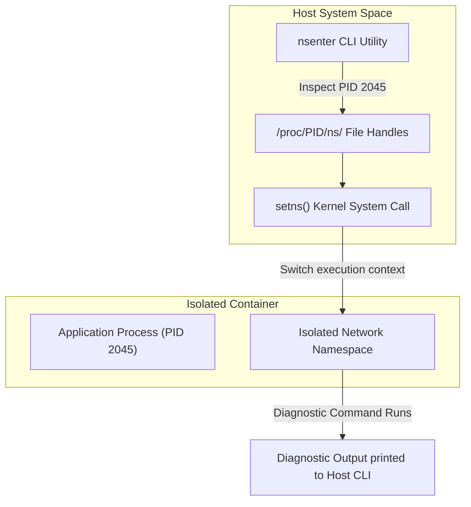

# Module 16 - Debugging & Troubleshooting

## 1. Learning Objectives
By the end of this module, you will be able to:
* Describe the diagnostic pipelines for checking container states, process logs, and host networking.
* Attach a diagnostic debugging container directly to a broken container's namespaces using `nsenter`.
* Trace network packets inside containers using `tcpdump` and shared network namespaces.
* Analyze application syscall execution paths using `strace` from the host system.
* Diagnose container zombie processes, database socket lockups, and kernel OOM events.
* Leverage sidecar patterns to inspect filesystem changes without modifying application code.

---

## 2. Introduction
Debugging a containerized application differs from standard system troubleshooting. Because containers isolate processes, you cannot simply run utilities like `htop`, `tcpdump`, or `strace` inside a hardened production image—it typically lacks the binaries. Troubleshooters must learn to cross namespace boundaries to inspect container state from the host.

To understand container debugging, consider the **Submarine Diagnostic Hatch Analogy**.
* **The Container (The Sealed Submarine)**: The crew is trapped inside with limited windows. If the engine fails, they cannot look outside, and they do not have tools to build replacement machinery.
* **The Host Machine (The Mother Ship)**: Controls the external docking bay.
* **Namespaces (Isolation Hatches)**: Sealed doors separating the crew's cabins from the external water and communication networks.
* **`nsenter` (The Diagnostic Interface Hatch)**: A tool that allows a technician from the mother ship to temporarily enter the submarine through a backup hatch, bringing their own toolkit (tools like `netstat` or `tcpdump`) to run diagnostics directly within the crew's cabin.
* **Sidecar Container (The Probe Drone)**: A separate drone docked alongside the submarine, sharing the submarine's life support and power (namespaces) to scan for leaks.

---

## 3. Why This Topic Exists
When containerized microservices fail in production, standard tools can fail developers:
1. **The "Empty Shell" Trap**: You run `docker exec -it web-srv sh` and get: `exec failed: No such file or directory`. The developer cannot run diagnostic commands because the production image has no shell.
2. **Zombie Process Accumulation**: Containers that run custom entrypoints without process reapers can accumulate zombie processes that block process IDs (PIDs), freezing container tasks.
3. **Intermittent Network Drops**: Containers suddenly fail to reach database servers, but traditional host network checkers show all routes are active.

---

## 4. Theory & Internal Mechanics

### Namespace Traversal Internals
Linux exposes namespaces as pseudo-files under `/proc/<PID>/ns/`.
* **The `/proc` Filesystem**: Each running process has a directory matching its Process ID (PID). Inside, files like `/proc/<PID>/ns/net` act as handles to the namespaces.
* **`setns()` system call**: Allows a process to associate itself with a target namespace. This is the kernel primitive used by both `docker exec` and `nsenter`.
* **Shared Network Namespaces**: You can run container B sharing container A's network namespace (`--network=container:container-A`). This allows B to run `tcpdump` to intercept A's traffic directly.

---

## 5. Component Flow Diagram
This diagram shows how a diagnostic tool on the host traverses the kernel namespace barriers to inspect container states:



---

## 6. Commands Reference

### 6.1 nsenter
* **Purpose**: Execute commands inside namespaces of another process.
* **Syntax**: `nsenter -t <target-pid> [options] [command]`
* **Arguments**:
  - `-t`: Target process ID (PID) on the host.
  - `-n`: Enter network namespace.
  - `-m`: Enter mount namespace.
  - `-p`: Enter PID namespace.
* **Example**:
  ```bash
  # Enter network namespace of PID 14201, run ip link
  sudo nsenter -t 14201 -n ip link
  ```
* **Production usage**: Hardcore low-level debug scans.

### 6.2 Stracing a Container Process
* **Purpose**: Intercept and log system calls made by a container process.
* **Syntax**: `strace -p <host-pid> [options]`
* **Example**:
  ```bash
  sudo strace -p 14201 -e trace=network
  ```

---

## 7. Practical Labs

### Lab 16.1: Tracing Network Packets using Namespace Sharing
**Goal**: Launch an Nginx container lacking troubleshooting tools, attach a debug sidecar container sharing its network namespace, and capture HTTP packets.

1. Launch Nginx:
   ```bash
   docker run -d --name target-nginx nginx:alpine
   ```
2. Attempt to run `tcpdump` inside Nginx:
   ```bash
   docker exec target-nginx tcpdump
   ```
   * **Expected Output**: `exec failed: tcpdump: command not found` (proves target lacks tools).
3. Start a troubleshooting container sharing the network namespace of Nginx:
   ```bash
   docker run -it --rm --network=container:target-nginx nicolaka/netshoot tcpdump -i any -nn -vv port 80
   ```
4. In another host terminal, send a request to the Nginx container:
   ```bash
   CONTAINER_IP=$(docker inspect -f '{{range .NetworkSettings.Networks}}{{.IPAddress}}{{end}}' target-nginx)
   curl http://$CONTAINER_IP/
   ```
5. Inspect the netshoot terminal:
   * **Expected Output**: You will see raw TCP handshakes and HTTP request frames captured by `tcpdump`. This confirms that the sidecar successfully intercepted network packets from the isolated target container.

### Lab 16.2: Sycall Tracing via Strace on the Host
**Goal**: Trace files opened by a containerized process by running `strace` on the host kernel.

1. Start an alpine container writing to a file:
   ```bash
   docker run -d --name strace-target alpine sh -c "while true; do echo 'log' >> /tmp/out.txt; sleep 1; done"
   ```
2. Find the host PID of the container process:
   ```bash
   PID=$(docker inspect --format '{{.State.Pid}}' strace-target)
   ```
3. Run `strace` on the host, targeting this PID:
   ```bash
   sudo strace -p $PID -e trace=write
   ```
   * **Expected Output**: You will see the system call log: `write(1, "log\n", 4) = 4` outputting every second. This demonstrates that you can audit container actions without changing the image configuration.

---

## 8. Real Projects: Diagnostics Sidecar Shell
Build a script that launches a diagnostic sidecar shell, mounting namespaces and filesystems of any crashed container for inspection.

### Step 1: Write diagnostic script `debug-container.sh`
```bash
#!/bin/bash
CONTAINER_NAME=$1
if [ -z "$CONTAINER_NAME" ]; then
    echo "Usage: $0 <container-name>"
    exit 1
fi

PID=$(docker inspect --format '{{.State.Pid}}' "$CONTAINER_NAME")
if [ "$PID" -eq 0 ]; then
    echo "Container $CONTAINER_NAME is not running."
    exit 1
fi

echo "Attaching diagnostic shell to container $CONTAINER_NAME (PID $PID)..."
sudo nsenter -t "$PID" -m -u -i -n -p /bin/sh
```

### Step 2: Test script
Launch a container, run the script, and check hostnames and network routes to verify you have bypassed the container boundaries.

---

## 9. Troubleshooting & Diagnostics

### 1. Zombie PID 1 Process Accumulation
* **Symptoms**: System slows down and run out of process slots (PIDs), but container logs look normal.
* **Root Cause**: The container's primary process (PID 1) does not reap child processes that exit, leaving them as zombie (`<defunct>`) processes.
* **Solution**: Launch the container using the `--init` flag, which mounts a lightweight init daemon (like `tini`) as PID 1 to reap zombie processes.

### 2. Network Port Bind Errors (EADDRINUSE)
* **Symptoms**: Container crashes with bind errors, but running `netstat` on the host shows the port is free.
* **Root Cause**: An orphaned shim process holds the network socket open inside a stale network namespace.
* **Solution**: Find the stale namespace using `sudo ip netns show` or `lsns -t net` and delete it manually to release the socket.

---

## 10. Production Examples
In production environments (like AWS ECS or Kubernetes), engineers deploy **Ephemeral Debug Containers**. Kubernetes v1.23+ supports `kubectl debug`, which dynamically mounts a troubleshooting container containing debug tools inside the pod namespace of a crashed, shell-less production pod.

---

## 11. Best Practices
* **Keep Images Minimal**: Avoid bundling debug tools (like `curl`, `telnet`, `tcpdump`) in production images. Use sidecar tools instead.
* **Use --init for Custom Shell Entries**: Always use process reapers to handle PID 1 responsibilities.
* **Log System Calls selectively**: When running `strace`, filter calls (`-e trace=file`) to avoid performance impacts on host system.

---

## 12. Interview Preparation

### Q1: What does `nsenter` do, and how does it assist in troubleshooting?
* **Answer**: `nsenter` is a command-line tool that allows a user to enter the kernel namespaces (network, PID, mount, IPC, UTS) of a target process running on the host. It assists in troubleshooting by allowing engineers to run host-level diagnostic tools directly within the container's isolated context, even if the container lacks shells or binaries.

### Q2: What is a zombie process, and how does Docker's `--init` flag prevent them?
* **Answer**: A zombie process is a process that has completed execution but remains in the host's process table because its parent process has not read its exit status. Docker's `--init` flag inserts a tiny init process (`tini`) as PID 1 inside the container. This init process acts as the default parent, harvesting exit codes and reaping orphaned child processes.

### Q3: How can you capture packets inside a container that has no network tools?
* **Answer**: You can capture packets by starting a troubleshooting container (e.g. `nicolaka/netshoot`) and joining it to the target container's network namespace using the `--network=container:<target-name>` flag. The debug container can then run `tcpdump` or `tshark` to intercept the target's traffic directly.

---

## 13. Cheat Sheet
| Target | Utility / Command | Purpose |
|---|---|---|
| Host Process ID | `docker inspect --format '{{.State.Pid}}'` | Find host PID |
| Traversal | `nsenter -t <pid> -n sh` | Enter net namespace |
| Signal Reap | `docker run --init` | Run with tini reaper |
| Shared Net | `--network=container:<name>` | Bind debugger to network |

---

## 14. Assignments

### Beginner Assignment
* Run an alpine container in the background. Find its host PID, and use the host's `nsenter` utility to execute the command `hostname` inside the container's namespace.

### Intermediate Assignment
* Create a container running a node script that spawns a child process and lets it exit without calling `wait()`. Verify it becomes a zombie process using the host's `ps` command. Rerun with `--init` and verify it gets reaped.

---

## 15. Mini Project
Write a bash script that detects if a target container's CPU usage exceeds 90%, and automatically runs `strace` on the container's host PID for 10 seconds to generate a system call execution log.

---

## 16. References & Further Reading
* [Debugging containers via namespaces](https://man7.org/linux/man-pages/man1/nsenter.1.html)
* [Linux Proc Filesystem Layout Guide](https://man7.org/linux/man-pages/man5/proc.5.html)
* [Tini Process Reaper Specification](https://github.com/krallin/tini)
