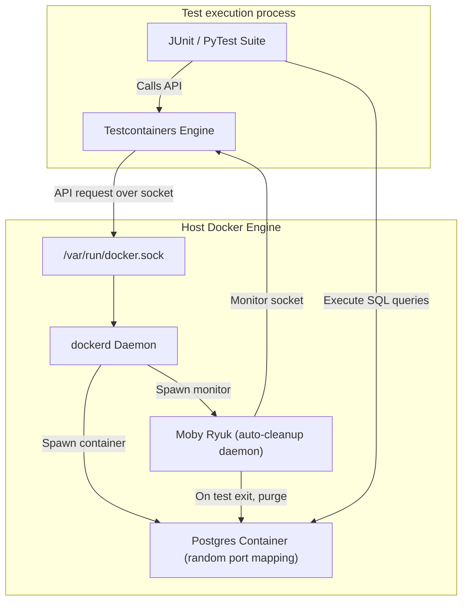

# Module 17 - Testing Containerized Applications

## 1. Learning Objectives
By the end of this module, you will be able to:
* Describe testing patterns for containerized applications, including unit, integration, and E2E layers.
* Spin up ephemeral database dependencies programmatically using the Testcontainers framework.
* Embed automated test suites inside Dockerfile multi-stage builds (`--target test`).
* Clean up orphaned test containers and network components using Ryuk sidecars.
* Configure Docker-in-Docker (DinD) and Docker-outside-of-Docker (DooD) pipelines in CI/CD.
* Troubleshoot test socket timeouts, database lockups, and runner permission blocks.

---

## 2. Introduction
Testing applications that rely on databases, message queues, or external APIs is challenging. Mocking these dependencies often fails to replicate real-world database behaviors. Testing containerized applications involves using ephemeral container instances to represent actual staging dependencies.

To understand container testing, consider the **Model Toy Kitchen Sandbox Analogy**.
* **The Recipe (The Application Code)**: The code you want to test.
* **Mocking (The Play-Doh Food)**: You pretend you have ingredients by shaping play-doh. It looks like food, but you cannot bake it, and it does not behave like real flour or eggs (mocking does not test real SQL constraints or database triggers).
* **Staging Databases (The Shared Kitchen)**: A real kitchen everyone in the house uses. If you bake your test cookies there, someone else might walk in, change the oven temperature, or throw away your cookies mid-bake (shared databases introduce test state pollution and race conditions).
* **Testcontainers (The Sandbox Play Kitchen)**: A magic sandbox where a miniature, fully functional oven and pantry appear instantly when you start baking. When you finish testing the recipe, the entire kitchen vanishes, returning the sandbox to its initial state.

---

## 3. Why This Topic Exists
Traditional testing strategies introduce critical issues when moving to cloud environments:
1. **Flaky Integration Tests**: Tests fail because the shared database contains stale tables from previous test runs, or has schema drift.
2. **Untested Production Configurations**: Code runs fine on the developer's machine but fails inside the container because the runtime dependencies (Node or Python versions) differ.
3. **CI/CD Resource Contention**: Multiple pipeline runners executing tests simultaneously on a shared database server block transactions, causing false negatives.

---

## 4. Theory & Internal Mechanics

### Testcontainers Architecture
Testcontainers is a library that allows code to call the host Docker API directly using a TCP socket connection (or Unix socket `/var/run/docker.sock`).
* **Dynamic Orchestration**: During test startup, the framework calls the host Docker API to pull and start containerized databases (like Postgres or Redis).
* **Ryuk Sidecar (Moby Ryuk)**: A small daemon container launched by Testcontainers. It monitors the test run. If the test runner crashes or exits, Ryuk automatically purges any containers, networks, or volumes created during the run, preventing storage leaks on the test node.

### CI/CD Runner Environments
* **Docker-outside-of-Docker (DooD)**: The pipeline container mounts the host's `/var/run/docker.sock`. Any container created by the runner runs side-by-side on the host system.
* **Docker-in-Docker (DinD)**: The runner container has its own private Docker daemon running inside it, completely isolated from the host.

---

## 5. Component Flow Diagram
This diagram shows how Testcontainers orchestrates database dependencies during a test run:



---

## 6. Commands Reference

### 6.1 Running Multi-stage Builds for Testing
* **Purpose**: Stop the build at a specific testing stage, running unit tests inside the container before final packaging.
* **Syntax**: `docker build --target <stage-name> -t <tag> .`
* **Example**:
  ```bash
  docker build --target test-runner -t app-tests .
  ```

### 6.2 Mount Host Socket to Container (DooD)
* **Purpose**: Grant a container the ability to launch other containers on the host.
* **Syntax**: `docker run -v /var/run/docker.sock:/var/run/docker.sock <image>`
* **Example**:
  ```bash
  docker run -it -v /var/run/docker.sock:/var/run/docker.sock alpine sh
  ```

---

## 7. Practical Labs

### Lab 17.1: Python Testcontainers with PostgreSQL
**Goal**: Write a Python integration test that uses the `testcontainers` library to boot an ephemeral PostgreSQL database, write schemas, and query data.

1. Install requirements:
   ```bash
   pip install pytest testcontainers psycopg2-binary
   ```
2. Write the test script `test_db.py`:
   ```python
   import psycopg2
   from testcontainers.postgres import PostgresContainer
   
   def test_database_connection():
       # Spin up ephemeral Postgres container
       with PostgresContainer("postgres:16-alpine") as postgres:
           # Get host port mapping allocated dynamically
           conn = psycopg2.connect(
               host=postgres.get_container_host_ip(),
               port=postgres.get_exposed_port(5432),
               user=postgres.username,
               password=postgres.password,
               database=postgres.dbname
           )
           cur = conn.cursor()
           
           # Create table and write record
           cur.execute("CREATE TABLE users (id SERIAL PRIMARY KEY, name VARCHAR(50));")
           cur.execute("INSERT INTO users (name) VALUES ('Nishant');")
           conn.commit()
           
           # Query record
           cur.execute("SELECT name FROM users;")
           name = cur.fetchone()[0]
           cur.close()
           conn.close()
           
           # Validate outcome
           assert name == 'Nishant'
           print("\nIntegration test passed successfully!")
   ```
3. Run the test:
   ```bash
   pytest -s test_db.py
   ```
   * **Expected Output**: Pytest boots the container, executes the query, prints the success line, and Ryuk destroys the container on exit.

### Lab 17.2: Running Unit Tests Inside Multi-Stage Builds
**Goal**: Package tests inside a Dockerfile so they run automatically during compile time. If tests fail, the build fails.

1. Write a simple Python module `app.py`:
   ```python
   def add(a, b):
       return a + b
   ```
2. Write a test file `test_app.py`:
   ```python
   from app import add
   def test_add():
       assert add(2, 3) == 5
   ```
3. Write a multi-stage Dockerfile containing a test target:
   ```dockerfile
   FROM python:3.11-slim AS base
   WORKDIR /app
   COPY app.py .
   
   # Stage 2: Test runner
   FROM base AS test-runner
   COPY test_app.py .
   RUN pip install pytest && pytest test_app.py
   
   # Stage 3: Hardened production runtime
   FROM base AS runtime
   ENTRYPOINT ["python", "app.py"]
   ```
4. Trigger the build targeting the runtime:
   ```bash
   docker build --target runtime -t calc-app .
   ```
   * *Observe that the test-runner stage executes unit tests before packaging.*
5. Edit `test_app.py` to assert a wrong calculation (`assert add(2,3) == 6`), then rebuild.
   * **Expected Output**: The build fails at the `RUN pytest` step, preventing the creation of a buggy image.

---

## 8. Real Projects: GitHub Actions Test Pipeline
Configure a GitHub Actions pipeline runner configuration that launches integration tests using a local Docker daemon database dependency.

### Step 1: Write `.github/workflows/test.yml`
```yaml
name: Integration Tests
on: [push]

jobs:
  run-tests:
    runs-on: ubuntu-latest
    steps:
      - name: Checkout Code
        uses: actions/checkout@v4

      - name: Set up Python
        uses: actions/setup-python@v4
        with:
          python-version: '3.11'

      - name: Install dependencies
        run: |
          pip install pytest testcontainers psycopg2-binary

      - name: Run PyTest
        run: |
          pytest -s test_db.py
```

---

## 9. Troubleshooting & Diagnostics

### 1. Orphaned Containers (Ryuk Connection Fails)
* **Symptoms**: Disk fills up with hundreds of running test database containers after multiple local pipeline runs.
* **Root Cause**: The test runner terminated abruptly, and the Ryuk cleanup sidecar was blocked from communicating with the Docker daemon or was disabled.
* **Solution**: Ensure your user has permissions to run containers on the host, and clean up manually:
  ```bash
  docker rm -f $(docker ps -a -q --filter label=org.testcontainers=true)
  ```

### 2. Port Binding Collisions in Concurrent Pipelines
* **Symptoms**: Tests fail with `port already in use` error when running multiple integration suites.
* **Root Cause**: Test configurations are hardcoded to map container ports to specific host ports (e.g. mapping PostgreSQL to host `5432`).
* **Solution**: Let Docker select random host ports (using `-p 5432` without host prefix or using Testcontainers' dynamic port getter), and query the assigned port at runtime.

---

## 10. Production Examples
In enterprise CI/CD systems (such as GitLab CI), runners use **Docker-outside-of-Docker (DooD)**. They mount the host's `/var/run/docker.sock` file inside the pipeline executor container. When the runner executes integration steps, it talks to the host engine, spinning up databases side-by-side on the host. This avoids the high CPU overhead and storage complexities of nesting engines (DinD).

---

## 11. Best Practices
* **Never Hardcode Ports**: Let Docker allocate random ephemeral ports for test containers to prevent pipeline collisions.
* **Use Ryuk for Cleanups**: Ensure Ryuk is allowed to run to prevent storage leaks on runner nodes.
* **Separate Test Targets**: Use multi-stage targets (`--target test`) to keep test packages (like mock libraries or pytest) out of production runtime images.

---

## 12. Interview Preparation

### Q1: What is the difference between Docker-in-Docker (DinD) and Docker-outside-of-Docker (DooD) in CI/CD?
* **Answer**:
  - **Docker-in-Docker (DinD)** runs an isolated, inner Docker daemon inside the runner container. It requires the container to run in `--privileged` mode, creating security risks, and uses nested storage drivers which slow down I/O.
  - **Docker-outside-of-Docker (DooD)** mounts the host daemon's socket (`/var/run/docker.sock`) inside the runner container. The runner talks to the host's Docker engine directly. Any container spun up runs as a sibling on the host, which is faster and more secure but can lead to port collisions if not configured dynamically.

### Q2: How does the Testcontainers framework prevent resource leaks on host servers?
* **Answer**: Testcontainers launches a tiny sidecar container called **Ryuk (Moby Ryuk)** when the test suite starts. Ryuk establishes a socket connection to the runner. If the connection drops or the test completes, Ryuk automatically sends delete calls to the Docker daemon to purge all containers, networks, and volumes tagged with the `org.testcontainers` label.

### Q3: Why is it beneficial to run tests inside a Dockerfile rather than on the host?
* **Answer**: Running tests inside the Dockerfile ensures that the tests execute in the exact same runtime environment (OS, dependencies, library versions) that will be deployed to production. It also enforces a strict quality gate: if any unit test fails, the image compilation fails, preventing broken code from being pushed to registries.

---

## 13. Cheat Sheet
| Target | Property / Command | Purpose |
|---|---|---|
| Socket Mapping | `-v /var/run/docker.sock:/var/run/docker.sock` | Enable DooD inside runners |
| Target Build | `docker build --target <stage>` | Run tests at compile time |
| Ryuk label | `label=org.testcontainers=true` | Filter test containers |
| Random Port | `-P` (uppercase) | Publish all exposed ports to random host ports |

---

## 14. Assignments

### Beginner Assignment
* Configure a Dockerfile with a test stage that installs pytest, runs a simple validation test, and stops before the final production package target.

### Intermediate Assignment
* Write a Python script using Testcontainers that launches a Redis container, writes a cache key, verifies it was saved, and exits, letting Ryuk handle container destruction.

---

## 15. Mini Project
Write a shell script that checks for orphaned test containers on a build runner node and purges any container running for more than 1 hour with the label `org.testcontainers`.

---

## 16. References & Further Reading
* [Testcontainers Framework Official Documentation](https://java.testcontainers.org/)
* [Docker in Docker (DinD) configuration details](https://hub.docker.com/_/docker)
* [GitHub Actions Runner Environments](https://docs.github.com/en/actions/using-github-hosted-runners/)
