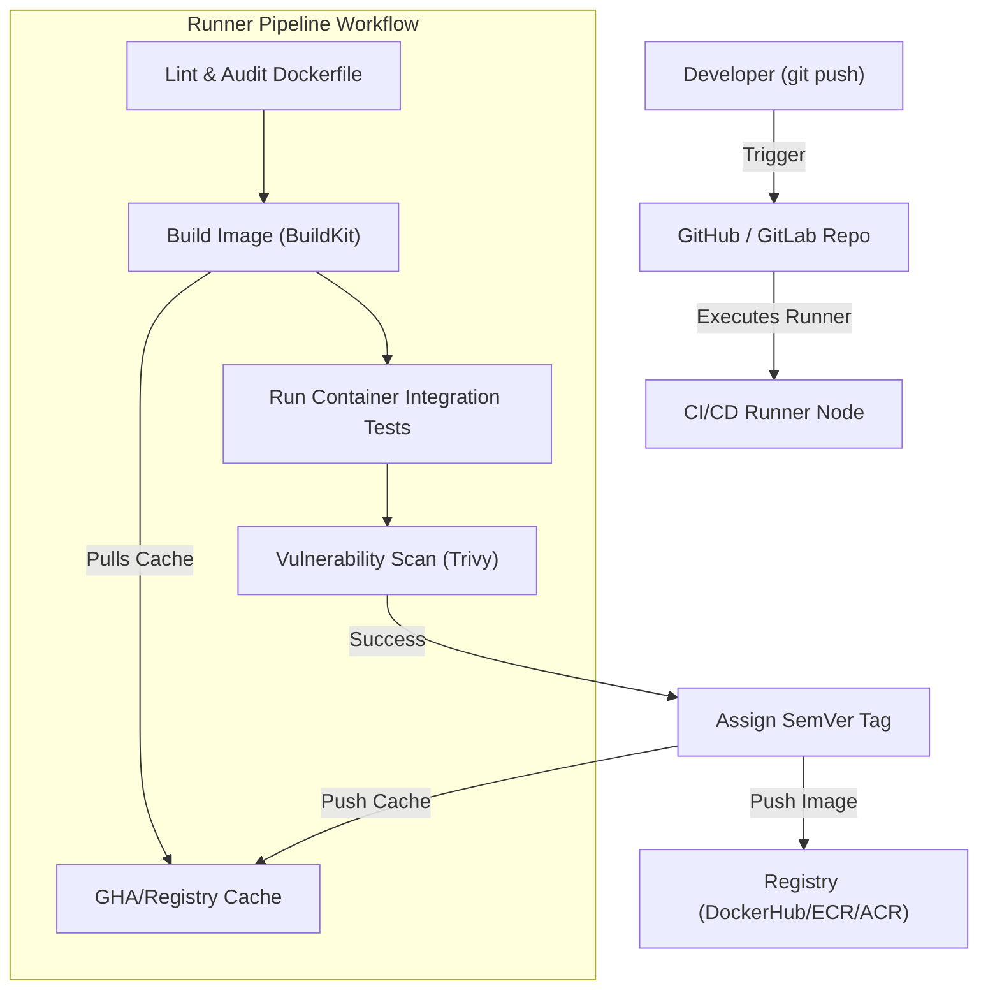

# Module 18 - CI/CD with Docker

## 1. Learning Objectives
By the end of this module, you will be able to:
* Integrate Docker workflows into modern CI/CD systems (GitHub Actions, GitLab CI).
* Optimize build speed in remote runners using BuildKit registry and inline cache exporters (`--cache-from`, `--cache-to`).
* Automate image tagging schemes based on Semantic Versioning (SemVer) and Git commit SHA tags.
* Secure container registry logins using OpenID Connect (OIDC) and masked credentials.
* Implement parallel multi-architecture builds using `docker buildx` builders.
* Troubleshoot runner cache misses, expired registry auth tokens, and network rate limits.

---

## 2. Introduction
In a professional DevOps workflow, developers do not build and push production Docker images from their local machines. Instead, a code modification pushed to a repository triggers an automated pipeline that builds, tests, scans, and deploys the image.

To understand Docker CI/CD pipelines, consider the **Automated Assembly Line Conveyor Belt Analogy**.
* **The Blueprint (The Dockerfile)**: The technical specs.
* **The Assembly Robot (The CI Runner)**: The physical worker on the assembly line.
* **The Component Box (The BuildKit Cache)**: Rather than manufacturing every single bolt and screw from scratch for every car, the robot grabs pre-assembled doors and engines from storage boxes (layers cache) to speed up assembly.
* **The Quality Inspector (The Test Stage)**: Checks the brakes and engine before the car leaves the factory. If a test fails, the belt stops.
* **The Serial Number (The SemVer Tag)**: Stamped on the chassis (e.g. `v1.2.0-rc1` or Git SHA) so technicians know exactly which revision they are handling.
* **The Showroom (The Container Registry)**: Where the finished cars are shipped (pushed) for dealerships to download (pull).

---

## 3. Why This Topic Exists
Without automated, optimized Docker pipelines, container deployment suffers from:
1. **Inefficient Build Pipelines**: Running generic `docker build` on a fresh VM pull starts from scratch every time, resulting in 20-minute pipelines.
2. **Tag Pollution**: Using the `latest` tag in production results in untraceable rollbacks, state synchronization failures, and registry overwrite issues.
3. **Secret Breaches**: Committing passwords, API keys, or private SSH keys into Dockerfiles exposes credentials to anyone pulling the image.

---

## 4. Theory & Internal Mechanics

### BuildKit Cache Exporters
Traditional local cache (`--cache-from=type=local`) is unavailable on ephemeral CI runners because the host VM is destroyed after each run. To resolve this, BuildKit introduces remote cache exporters:
* **Registry Cache (`type=registry`)**: Pushes build cache metadata directly to the container registry as a separate image tag. Runners can pull this cache layer without downloading the application image.
* **GitHub Actions Cache (`type=gha`)**: Saves cache directly to GitHub's internal cache storage, bypassing registry network usage.

---

## 5. Component Flow Diagram
This diagram shows how a git push triggers the automated Docker build, scan, and deploy pipeline:



---

## 6. Commands Reference

### 6.1 docker buildx build with Cache Exporters
* **Purpose**: Build an image utilizing remote caching backends to speed up execution.
* **Syntax**: `docker buildx build [options] --cache-to=<type> --cache-from=<type> .`
* **Example**:
  ```bash
  docker buildx build \
    --target production \
    --cache-to=type=registry,ref=myregistry.com/app:cache,mode=max \
    --cache-from=type=registry,ref=myregistry.com/app:cache \
    -t myregistry.com/app:v1.0.0 --push .
  ```

### 6.2 docker buildx create
* **Purpose**: Create a new isolated builder instance supporting advanced BuildKit drivers (like `docker-container`).
* **Syntax**: `docker buildx create --name <name> --use`
* **Example**:
  ```bash
  docker buildx create --name pipeline-builder --use
  docker buildx inspect --bootstrap
  ```

---

## 7. Practical Labs

### Lab 18.1: GitHub Actions CI Pipeline with Cache Optimization
**Goal**: Create a GitHub Actions workflow file that sets up Docker Buildx, logs into Docker Hub securely, and builds an image using `gha` caching.

1. Create the workflow file `.github/workflows/docker-ci.yml`:
   ```yaml
   name: Production Docker CI
   
   on:
     push:
       branches: [ "main" ]
       tags: [ "v*.*.*" ]
   
   jobs:
     build-and-push:
       runs-on: ubuntu-latest
       steps:
         - name: Checkout Code
           uses: actions/checkout@v4
   
         - name: Set up QEMU
           uses: docker/setup-qemu-action@v3
   
         - name: Set up Docker Buildx
           uses: docker/setup-buildx-action@v3
   
         - name: Log in to Docker Hub
           uses: docker/login-action@v3
           with:
             username: ${{ secrets.DOCKERHUB_USERNAME }}
             password: ${{ secrets.DOCKERHUB_TOKEN }}
   
         - name: Extract metadata (tags, labels)
           id: meta
           uses: docker/metadata-action@v5
           with:
             images: ${{ secrets.DOCKERHUB_USERNAME }}/my-app
             tags: |
               type=semver,pattern={{version}}
               type=sha,format=short
   
         - name: Build and Push Image
           uses: docker/build-push-action@v5
           with:
             context: .
             push: true
             tags: ${{ id.meta.outputs.tags }}
             labels: ${{ id.meta.outputs.labels }}
             cache-from: type=gha
             cache-to: type=gha,mode=max
   ```
2. Set up GitHub Secrets (`DOCKERHUB_USERNAME` and `DOCKERHUB_TOKEN`) inside repo settings.
3. Commit and push the file to trigger the runner, verifying the execution log and caching outputs.

### Lab 18.2: Automated SemVer Tagging Script
**Goal**: Write a script that checks the latest git tag, increments the patch version, and builds the container with both the new tag and the Git SHA.

1. Write `build-tagger.sh`:
   ```bash
   #!/bin/bash
   # Get latest git tag or default
   LATEST_TAG=$(git describe --tags --abbrev=0 2>/dev/null || echo "v0.0.0")
   GIT_SHA=$(git rev-parse --short HEAD)
   
   # Strip 'v' prefix
   VERSION=${LATEST_TAG#v}
   
   # Parse components
   IFS='.' read -r major minor patch <<< "$VERSION"
   NEW_PATCH=$((patch + 1))
   NEW_TAG="v$major.$minor.$NEW_PATCH"
   
   echo "Current tag: $LATEST_TAG"
   echo "New tag: $NEW_TAG"
   echo "Commit SHA: $GIT_SHA"
   
   # Build image
   docker build -t my-app:$NEW_TAG -t my-app:$GIT_SHA .
   ```
2. Make it executable and run it locally to verify output tags.

---

## 8. Real Projects: CI/CD Multi-Arch Build with Security Scanning
Configure a pipeline that builds an image for both AMD64 and ARM64 architectures, runs a Trivy vulnerability audit, and blocks execution if critical security failures are found.

### Step 1: Write GitHub Actions YAML with Scanning
```yaml
name: Secure Multi-Arch Build
on: [push]

jobs:
  secure-build:
    runs-on: ubuntu-latest
    steps:
      - name: Checkout
        uses: actions/checkout@v4
      - name: Set up QEMU
        uses: docker/setup-qemu-action@v3
      - name: Set up Buildx
        uses: docker/setup-buildx-action@v3
      - name: Build Local Image for Scan
        uses: docker/build-push-action@v5
        with:
          context: .
          load: true # Load into local daemon for scan
          tags: local-scan-target:latest
      - name: Run Trivy vulnerability scanner
        uses: aquasecurity/trivy-action@master
        with:
          image-ref: 'local-scan-target:latest'
          format: 'table'
          exit-code: '1' # Fail pipeline if vulnerabilities found
          ignore-unfixed: true
          vuln-type: 'os,library'
          severity: 'CRITICAL'
```

---

## 9. Troubleshooting & Diagnostics

### 1. Registry Network Rate Limits (429 Too Many Requests)
* **Symptoms**: Pipelines fail during `docker pull` stages, logging: `toomanyrequests: You have reached your pull rate limit`.
* **Root Cause**: Public runners (like GitHub Actions) share IP pools, causing Docker Hub to block anonymous pull requests.
* **Solution**: Always log into a Docker registry account at the beginning of the pipeline, or configure repository mirrors.

### 2. Multi-Stage Cache Invalidation
* **Symptoms**: Even small changes in codebase force the runner to rebuild heavy dependency installer layers.
* **Root Cause**: The `COPY` step copying the entire source directory is positioned *before* dependency installers (e.g. `npm install`), invalidating caches.
* **Solution**: Structure the Dockerfile to `COPY package*.json ./` first, run installation, and only copy code files later.

---

## 10. Production Examples
In large enterprise settings, organizations use private image registries (like **AWS ECR** or **JFrog Artifactory**) protected behind VPC firewalls. Pipelines use OIDC tokens instead of credentials. OIDC generates ephemeral authorization keys valid for single sessions, ensuring credentials cannot be stolen from pipeline configurations.

---

## 11. Best Practices
* **Use Specific Base Tags**: Never use `FROM node:latest` in build pipelines. Bind builds to minor/patch versions (`FROM node:20.11-alpine`).
* **Utilize Multi-Stage Targets**: Configure testing targets (`--target test`) and package binaries separately.
* **Prune Cache Regularly**: Clean runner registries regularly to control hosting costs.

---

## 12. Interview Preparation

### Q1: What is the benefit of using `--cache-to=type=registry`?
* **Answer**: It exports the BuildKit layer cache metadata and contents directly to the remote container registry. In ephemeral CI environment settings (where VM storage is discarded after each run), new runners can pull this remote cache layer on startup, allowing fast builds without storing local files.

### Q2: Why should you avoid using the `latest` tag in deployment pipelines?
* **Answer**: The `latest` tag is not unique or immutable. If multiple deployments use `latest`, rolling back is difficult because you cannot identify which commit the tag represents. It can also cause sync drift if different nodes in a cluster pull different versions of `latest` at different times.

### Q3: How does docker buildx build for multiple architectures (e.g., amd64 and arm64)?
* **Answer**: Buildx uses QEMU kernel emulation to build images. Under a custom builder instance (e.g. `docker-container`), buildx launches emulation runtimes that compile binary targets for other CPU architectures. Alternatively, it can direct build tasks to remote native build nodes over SSH.

---

## 13. Cheat Sheet
| Target | Property / Command | Purpose |
|---|---|---|
| Set up buildx | `uses: docker/setup-buildx-action@v3` | GHA BuildKit initializer |
| Registry Cache | `--cache-to=type=registry,ref=<ref>` | Push layer cache to registry |
| GHA Cache | `--cache-to=type=gha,mode=max` | Push layer cache to GitHub cache |
| Platform target | `--platform linux/amd64,linux/arm64` | Multi-architecture compile target |

---

## 14. Assignments

### Beginner Assignment
* Configure a GitHub Actions workflow that builds a container and uploads build logs as build artifacts.

### Intermediate Assignment
* Write a pipeline that builds a container, runs Trivy security scans, outputs the results in JSON format, and fails the build if any high severity vulnerabilities are found.

---

## 15. Mini Project
Write a bash script for a self-hosted runner node that audits local storage, alerts if image caches consume more than 80% of local disk space, and runs `docker builder prune -a` to free up space.

---

## 16. References & Further Reading
* [Docker BuildKit Caching Backends Reference](https://docs.docker.com/build/cache/backends/)
* [GitHub Actions Guide: Building Docker Images](https://docs.github.com/en/actions/publishing-packages/publishing-docker-images)
* [Trivy Container Security Scanner Documentation](https://aquasecurity.github.io/trivy/v0.18.3/)
