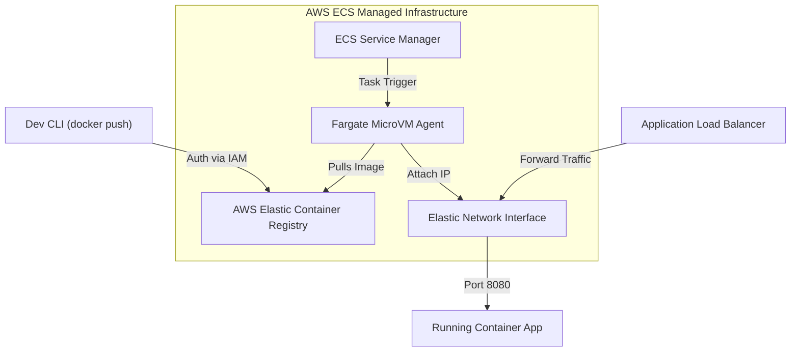

# Module 19 - Docker in AWS, Azure & GCP

## 1. Learning Objectives
By the end of this module, you will be able to:
* Navigate cloud container deployment environments across AWS (ECS, Fargate), Azure (ACI, Container Apps), and GCP (Cloud Run).
* Configure cloud container registries (AWS ECR, Azure ACR, Google Artifact Registry) to store images.
* Set up IAM authentication scopes using credentials helpers and command line tools.
* Deploy applications using serverless container models (Fargate / Cloud Run).
* Define container resource requirements and network mappings using infrastructure schemas.
* Troubleshoot cloud authorization issues, image download failures, and routing failures.

---

## 2. Introduction
Running containers locally is straightforward. However, running containers at scale in production requires migrating workloads to cloud platforms. These platforms handle scaling, networking, and server provisioning, allowing developers to focus on application code.

To understand cloud container models, consider the **Mobile Home Rental Parks Analogy**.
* **Your Container (The Mobile Home)**: A self-contained living unit with its own water, power connection, and furniture.
* **AWS ECR / ACR (The Mobile Home Depot Storage)**: A secure warehouse where you park your mobile homes while waiting for shipping.
* **AWS ECS EC2 Launch Type (The RV Trailer Park)**: You buy land, build access roads, set up power poles, and park your trailers. You must maintain the grounds, but you pay a fixed price for the plot (infrastructure management).
* **AWS ECS Fargate / GCP Cloud Run (The Managed Airbnb Resort)**: You tell the resort, "I want this mobile home placed in a slot for 3 days." The resort handles electricity, plumbing, and landscaping. You don't manage the land, and you pay only for the minutes the home is occupied (serverless containers).

---

## 3. Why This Topic Exists
Deploying containers to cloud platforms introduces new integration challenges:
1. **Security Authentication Scrapes**: Local containers use simple passwords. Cloud platforms require token exchanges (like IAM authentication) that rotate every few hours.
2. **Infrastructure Complexity**: You cannot deploy containers to the cloud with a simple `docker run`. You must define task definitions, IAM execution roles, Target Groups, and Load Balancers.
3. **High Cold-Start Latency**: Serverless runtimes scale containers to zero to save costs. When a new request arrives, downloading a heavy 2GB image can take 20 seconds, causing timeouts.

---

## 4. Theory & Internal Mechanics

### Serverless Container Architecture
* **Serverless Execution (AWS Fargate, GCP Cloud Run)**: The cloud provider manages the underlying VMs. When a task starts, the provider provisions a microVM, attaches a virtual network interface (ENI), pulls the image from the registry, and runs the container.
* **AWS ECR Credential Helper**: To pull images securely, host daemons use a helper program (`docker-credential-ecr-login`) that dynamically requests authentication tokens from the AWS Security Token Service (STS) using IAM roles.

---

## 5. Component Flow Diagram
This diagram shows how a container is deployed to AWS ECS Fargate:



---

## 6. Commands Reference

### 6.1 AWS ECR Login & Push
* **Purpose**: Authenticate Docker client to AWS ECR and push an image.
* **Syntax**: `aws ecr get-login-password --region <region> | docker login --username AWS --password-stdin <registry-url>`
* **Example**:
  ```bash
  # Log in
  aws ecr get-login-password --region us-east-1 | docker login --username AWS --password-stdin 123456789012.dkr.ecr.us-east-1.amazonaws.com
  
  # Tag and push
  docker tag web-app:latest 123456789012.dkr.ecr.us-east-1.amazonaws.com/web-app:v1
  docker push 123456789012.dkr.ecr.us-east-1.amazonaws.com/web-app:v1
  ```

### 6.2 Google Artifact Registry Authentication
* **Purpose**: Configure Docker credentials helper for GCP.
* **Syntax**: `gcloud auth configure-docker <region>-docker.pkg.dev`
* **Example**:
  ```bash
  gcloud auth configure-docker us-central1-docker.pkg.dev
  ```

---

## 7. Practical Labs

### Lab 19.1: Pushing Images to AWS ECR
**Goal**: Create an AWS ECR repository, authenticate your local Docker engine, and push a custom image.

1. Create a repository using the AWS CLI:
   ```bash
   aws ecr create-repository --repository-name my-cloud-app --region us-east-1
   ```
2. Retrieve login credentials and log in:
   ```bash
   aws ecr get-login-password --region us-east-1 | docker login --username AWS --password-stdin $(aws sts get-caller-identity --query Account --output text).dkr.ecr.us-east-1.amazonaws.com
   ```
3. Tag a local image:
   ```bash
   ACCOUNT_ID=$(aws sts get-caller-identity --query Account --output text)
   docker tag alpine:latest ${ACCOUNT_ID}.dkr.ecr.us-east-1.amazonaws.com/my-cloud-app:v1
   ```
4. Push the image:
   ```bash
   docker push ${ACCOUNT_ID}.dkr.ecr.us-east-1.amazonaws.com/my-cloud-app:v1
   ```
5. Verify the repository contents in the AWS Console.

### Lab 19.2: Running a Container Task on AWS ECS Fargate
**Goal**: Define and run an ECS task definition using the Fargate serverless launch type.

1. Save the following JSON configuration as `task-def.json`:
   ```json
   {
     "family": "web-fargate-task",
     "networkMode": "awsvpc",
     "containerDefinitions": [
       {
         "name": "web-server",
         "image": "nginx:alpine",
         "essential": true,
         "portMappings": [
           {
             "containerPort": 80,
             "hostPort": 80
           }
         ]
       }
     ],
     "requiresCompatibilities": [
       "FARGATE"
     ],
     "cpu": "256",
     "memory": "512"
   }
   ```
2. Register the task definition:
   ```bash
   aws ecs register-task-definition --cli-input-json file://task-def.json
   ```
3. Run the task within a VPC subnet:
   ```bash
   aws ecs run-task --cluster default --task-definition web-fargate-task --launch-type FARGATE --network-configuration "awsvpcConfiguration={subnets=[subnet-12345678],assignPublicIp=ENABLED}"
   ```
4. Inspect status:
   ```bash
   aws ecs list-tasks --cluster default
   ```

---

## 8. Real Projects: Terraform Deployment Configuration
Write a Terraform configuration module that provisions an AWS ECR repository and configures lifecycle policies to prune untagged images.

### Step 1: Write `main.tf`
```hcl
resource "aws_ecr_repository" "app_repo" {
  name                 = "enterprise-service"
  image_tag_mutability = "MUTABLE"

  image_scanning_configuration {
    scan_on_push = true
  }
}

resource "aws_ecr_lifecycle_policy" "repo_policy" {
  repository = aws_ecr_repository.app_repo.name

  policy = <<EOF
{
  "rules": [
    {
      "rulePriority": 1,
      "description": "Expire untagged images older than 14 days",
      "selection": {
        "tagStatus": "untagged",
        "countType": "sinceImagePushed",
        "countUnit": "days",
        "countNumber": 14
      },
      "action": {
        "type": "expire"
      }
    }
  ]
}
EOF
}
```

---

## 9. Troubleshooting & Diagnostics

### 1. ECR "Image pull access denied" Errors
* **Symptoms**: The ECS task crashes with: `CannotPullContainerError: Access denied`.
* **Root Cause**: The ECS Task Execution Role lacks permission to pull images from ECR, or the ECR repository policy blocks the ECS cluster.
* **Solution**: Add the managed policy `AmazonECSTaskExecutionRolePolicy` to the task execution role.

### 2. Task Loop Crashes (port binding mismatches)
* **Symptoms**: The Fargate task keeps starting and stopping in a continuous loop without throwing errors.
* **Root Cause**: The Application Load Balancer healthcheck points to a port (e.g. `80`) different from the container's exposed port (e.g. `8080`).
* **Solution**: Edit the target group settings to align ports, or configure the container to bind to the load balancer's check port.

---

## 10. Production Examples
In production platforms, teams avoid hardcoded IAM user keys (`AWS_ACCESS_KEY_ID`). Instead, CI/CD runners (like GitHub Actions) use **OIDC Roles** to assume IAM identities dynamically. Once authenticated, the pipeline pushes images to ECR, and triggers ECS to perform a rolling update on target services.

---

## 11. Best Practices
* **Use Serverless Execution (Fargate/Cloud Run)**: Avoid maintaining bare VMs unless you require kernel customizations.
* **Enforce Repository Scans**: Always enable `scan_on_push` on registries to detect vulnerabilities.
* **Keep Task Images Small**: Small base images reduce cold-start latencies on Fargate scale-up events.

---

## 12. Interview Preparation

### Q1: What is the difference between an ECS Task Role and an ECS Task Execution Role?
* **Answer**:
  - The **Task Execution Role** is used by the ECS container agent. It grants permissions to pull images from ECR, write container logs to CloudWatch, and retrieve secrets from AWS Secrets Manager.
  - The **Task Role** is used by the application process *running inside* the container. It grants permissions to call AWS services (like reading S3 buckets or writing to DynamoDB tables) from within the app code.

### Q2: What are the benefits of serverless container engines like Google Cloud Run or AWS Fargate?
* **Answer**: Serverless container engines eliminate the operational overhead of provisioning, patching, and scaling host virtual machines. They allow you to define container resources (CPU, Memory) directly. Additionally, engines like Cloud Run can scale down to zero containers when idle, reducing hosting costs.

### Q3: How do you configure public network access to containers running in an AWS ECS Fargate environment?
* **Answer**: Since Fargate tasks typically run in private subnets, you route public traffic through an **Application Load Balancer (ALB)**. The ALB runs in public subnets, receives HTTP/HTTPS traffic, and forwards requests to target groups mapped to the Fargate tasks' Elastic Network Interfaces (ENIs) on designated container ports.

---

## 13. Cheat Sheet
| Target | CLI / Resource | Purpose |
|---|---|---|
| ECR Login Token | `get-login-password` | Generate Docker registry password |
| Task Def Register | `register-task-definition` | Upload task config schema |
| ECS Run | `run-task --launch-type FARGATE` | Run serverless container instance |
| ECR Cleanup | `aws_ecr_lifecycle_policy` | Terraform resource for pruning old images |

---

## 14. Assignments

### Beginner Assignment
* Create a private container registry on Azure (ACR) or GCP, and push a locally compiled image to it.

### Intermediate Assignment
* Write a script that checks if a container image exists in ECR before running an ECS deployment, preventing deployment failures due to missing image tags.

---

## 15. Mini Project
Write a Python script that monitors ECR vulnerability scan results using the AWS SDK (`boto3`) and sends alerts if any new image containing CRITICAL vulnerabilities is pushed to the repository.

---

## 16. References & Further Reading
* [Amazon ECS Task Definitions Developer Guide](https://docs.aws.amazon.com/AmazonECS/latest/developerguide/task_definitions.html)
* [Google Cloud Run Architecture & Deployment](https://cloud.google.com/run/docs/overview/what-is-cloud-run)
* [Terraform Provider for AWS Container Registries](https://registry.terraform.io/providers/hashicorp/aws/latest/docs/resources/ecr_repository)
