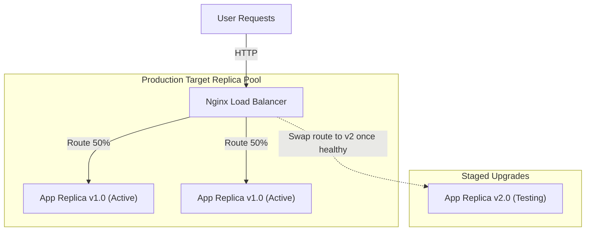

# Module 20 - Enterprise Architecture & Production Patterns

## 1. Learning Objectives
By the end of this module, you will be able to:
* Design High Availability (HA) topologies for running container workloads.
* Implement zero-downtime rolling updates and rolling upgrades using reverse proxies.
* Distribute incoming traffic across container replica pools using Nginx load balancers.
* Inject sensitive credentials dynamically using Docker Secrets and HashiCorp Vault.
* Explain the execution mechanics of Blue-Green and Canary deployment pipelines.
* Troubleshoot configuration drifts, session dropouts, and replication network splits.

---

## 2. Introduction
Deploying a single container on a server is suitable for development but not for production. Enterprise systems require High Availability, scaling, and the ability to update software without causing service interruptions (downtime).

To understand enterprise deployment patterns, consider the **Airport Runway Coordinator Analogy**.
* **The Airport Terminal (The Web Application)**: Must process a constant flow of travelers (users) without delays.
* **The Planes (Running Container Replicas)**: Multiple planes handling passenger loads. If one plane undergoes maintenance, others take off to prevent passenger backlogs.
* **The Air Traffic Controller (The Load Balancer)**: Directs arriving flights to open runways, distributing load evenly across runways.
* **Blue-Green Deployments (The Twin Terminals)**: The airport builds an identical new Terminal B (Green) next to Terminal A (Blue). While travelers use Terminal A, engineers test Terminal B. Once verified, the main entrance signs are changed overnight, directing passengers to Terminal B. Terminal A is then powered down for upgrades.
* **Canary Deployments (The Pilot Runway)**: Open a single new runway to 5% of incoming flights. If the pilots land safely without issues, the remaining 95% of traffic is routed to the new runway.

---

## 3. Why This Topic Exists
Standard single-instance configurations introduce key operational risks:
1. **Single Point of Failure (SPOF)**: If the physical host server crashes, the application goes offline immediately.
2. **Downtime During Updates**: Restarting a container to load a new version takes 5 to 30 seconds. During this window, users receive connection errors.
3. **Leaked DB Credentials**: Embedding database credentials inside environment variables exposes them in cleartext through standard diagnostic scans (like `docker inspect`).

---

## 4. Theory & Internal Mechanics

### Scaling & High Availability Topologies
* **Horizontal Scaling**: Launching multiple identical instances (replicas) of a container.
* **Load Balancer (Reverse Proxy)**: Acts as the entrypoint. It receives incoming TCP/HTTP requests and routes them to container replicas using algorithms like Round Robin or Least Connections.

### Secure Secret Injection
* **Docker Secrets (Compose / Swarm)**: Mounts sensitive strings (like certificates or passwords) directly into memory at `/run/secrets/<secret_name>` inside the container. Secrets are never written to disk or exposed in environment variables.

---

## 5. Component Flow Diagram
This diagram shows how traffic is load-balanced across scaled container replicas during a rolling update:



---

## 6. Commands Reference

### 6.1 docker compose scale
* **Purpose**: Increase or decrease the number of running container instances for a service.
* **Syntax**: `docker compose up -d --scale <service>=<count>`
* **Example**:
  ```bash
  docker compose up -d --scale web-app=5
  ```

### 6.2 Docker Secrets Injection (Compose)
* **Purpose**: Securely mount files as read-only memory files.
* **Syntax**: Defined within the Compose file; files are accessed at `/run/secrets/`.
* **Example**:
  ```yaml
  services:
    db:
      image: postgres
      secrets:
        - db_password
  secrets:
    db_password:
      file: ./db_password.txt
  ```

---

## 7. Practical Labs

### Lab 20.1: Load Balancing and Scaling Replicas
**Goal**: Deploy a load balancer (Nginx) that distributes incoming web requests across a dynamically scaled pool of three Node.js backend containers.

1. Create a directory structure:
   ```
   scale-lab/
   ├── docker-compose.yml
   ├── nginx.conf
   └── app/
       ├── server.js
       └── Dockerfile
   ```
2. Write the application code `app/server.js`:
   ```javascript
   const http = require('http');
   const os = require('os');
   const server = http.createServer((req, res) => {
       res.writeHead(200, { 'Content-Type': 'text/plain' });
       res.end(`Response served by host container: ${os.hostname()}\n`);
   });
   server.listen(3000, () => console.log('App running on port 3000'));
   ```
3. Write the Dockerfile `app/Dockerfile`:
   ```dockerfile
   FROM node:20-alpine
   WORKDIR /app
   COPY server.js .
   EXPOSE 3000
   ENTRYPOINT ["node", "server.js"]
   ```
4. Write the Nginx configuration `nginx.conf`:
   ```nginx
   events {}
   http {
       upstream app_cluster {
           server scale-lab-web-app-1:3000;
           server scale-lab-web-app-2:3000;
           server scale-lab-web-app-3:3000;
       }
       server {
           listen 80;
           location / {
               proxy_pass http://app_cluster;
           }
       }
   }
   ```
5. Write the `docker-compose.yml` file:
   ```yaml
   version: '3.8'
   services:
     web-app:
       build: ./app
       expose:
         - 3000
   
     load-balancer:
       image: nginx:alpine
       volumes:
         - ./nginx.conf:/etc/nginx/nginx.conf:ro
       ports:
         - "8080:80"
       depends_on:
         - web-app
   ```
6. Start the stack and scale the app container to 3 instances:
   ```bash
   docker compose up -d --scale web-app=3
   ```
7. Send multiple requests using `curl` and observe load distribution:
   ```bash
   for i in {1..6}; do curl http://localhost:8080/; done
   ```
   * **Expected Output**: You will see responses rotating among different host container IDs (e.g. `scale-lab-web-app-1`, `2`, `3`), confirming load-balancing is active.

### Lab 20.2: Simulating Zero-Downtime Rolling Updates
**Goal**: Run a rolling update script that spins up a new version of the app, updates the Nginx upstream targets, and prunes the old containers without dropping any HTTP connections.

1. Write `rolling-update.sh`:
   ```bash
   #!/bin/bash
   echo "Starting rolling update to version 2.0..."
   # 1. Spin up new container
   docker run -d --name app-v2 -p 3002:3000 my-app:v2
   sleep 3 # Wait for startup
   
   # 2. Update Load Balancer configuration (Nginx redirect)
   docker exec nginx-lb sed -i 's/app-v1:3000/app-v2:3000/g' /etc/nginx/nginx.conf
   docker exec nginx-lb nginx -s reload
   
   # 3. Stop and remove old container
   docker stop app-v1 && docker rm app-v1
   echo "Rolling update completed!"
   ```

---

## 8. Real Projects: Secure Secrets Mount with PostgreSQL
Deploy a database container using Compose, mounting credentials via Docker Secrets to avoid exposing password variables in cleartext logs.

### Step 1: Write Secrets Configuration
Create a password file on host `db_pwd.txt` containing `SuperSecretPwd123`.

### Step 2: Write docker-compose.yml
```yaml
version: '3.8'
services:
  db:
    image: postgres:16-alpine
    environment:
      POSTGRES_DB: main_db
      POSTGRES_USER: admin
      POSTGRES_PASSWORD_FILE: /run/secrets/db_password
    secrets:
      - db_password
    ports:
      - "5432:5432"

secrets:
  db_password:
    file: ./db_pwd.txt
```

### Step 3: Run and verify security
Deploy the database:
```bash
docker compose up -d
```
Run inspect:
```bash
docker inspect scale-lab-db-1 | grep POSTGRES_PASSWORD
```
*Verify that the secret password is not listed in the environment variables outputs.*

---

## 9. Troubleshooting & Diagnostics

### 1. Sticky Session Failures
* **Symptoms**: Users are repeatedly logged out of a web application when visiting the page, even though backend servers are healthy.
* **Root Cause**: The load balancer routes requests to different backend replicas randomly. If sessions are stored in memory inside the containers instead of a shared store (like Redis), changing servers loses the user session.
* **Solution**: Enable IP hashing (`ip_hash`) inside Nginx upstream configuration, or configure a Redis cluster to store sessions.

### 2. Configuration Drift across Replicas
* **Symptoms**: Some users report bugs while others see working pages, even though all containers run the same image.
* **Root Cause**: Replicas were deployed using different environment configurations, or bind mount configurations differed across host nodes.
* **Solution**: Use centralized config repositories or configuration management tools (like Ansible or Vault) to keep container variables in sync.

---

## 10. Production Examples
In production environments (like AWS EKS or GKE), the orchestrator (**Kubernetes**) natively manages rolling updates. It uses **Readiness Probes** to verify that a new container replica is accepting traffic before removing an old instance. If the new replica fails the probe, the update stops, preventing downtime.

---

## 11. Best Practices
* **Design Shared Sessions**: Never store state (such as user files or sessions) inside container memory. Store state in databases or Redis.
* **Mask Environment Credentials**: Use Docker Secrets or vault integrations instead of cleartext environment variables.
* **Expose Healthcheck Endpoints**: Ensure your services expose a `/health` endpoint for the load balancer to query.

---

## 12. Interview Preparation

### Q1: What is the difference between Blue-Green and Canary deployments?
* **Answer**:
  - **Blue-Green Deployments** deploy two identical production environments (Blue and Green). Only one environment is active at a time. The new version is deployed and tested in the inactive environment, and then traffic is cut over to it.
  - **Canary Deployments** roll out the new version to a small subset (e.g. 5%) of the active user base. If no errors are reported, the new version is progressively rolled out to the remaining users.

### Q2: Why should you avoid storing user session data in container memory?
* **Answer**: Storing session data in container memory violates the rule of stateless container design. In a scaled environment, the load balancer can route user requests to different container replicas. If a replica lacks the session data, the user is logged out. Additionally, containers are ephemeral; restarting a container destroys all session data.

### Q3: How do Docker Secrets differ from standard Docker environment variables?
* **Answer**: Docker Secrets are mounted as a read-only filesystem in RAM at `/run/secrets/` inside the container. They are never written to disk, and they do not show up in container log files or CLI inspect outputs. Environment variables, by contrast, are stored in cleartext in the container configuration and can be read by anyone with access to the Docker socket.

---

## 13. Cheat Sheet
| Target | Configuration / Command | Purpose |
|---|---|---|
| Auto Scale | `docker compose up --scale web=3` | Increase replica counts |
| Nginx Router | `proxy_pass http://<upstream>` | Load balance target backend |
| Memory Secret | `/run/secrets/<name>` | Location of mounted secrets |
| Session Stickiness | `ip_hash;` | Sticky routing by client IP |

---

## 14. Assignments

### Beginner Assignment
* Run an Nginx container as a load balancer and configure it to distribute requests to two apache containers running on a custom bridge network.

### Intermediate Assignment
* Write a Compose file that deploys a web application, uses Docker Secrets to mount database credentials, and scales the web application to 4 instances.

---

## 15. Mini Project
Write a shell script that checks the health of a scaled service's replicas and automatically decreases the scale count if host CPU usage exceeds 90%.

---

## 16. References & Further Reading
* [Nginx Load Balancing Guide](https://docs.nginx.com/nginx/admin-guide/load-balancer/http-load-balancer/)
* [Docker Compose Secret Management Specification](https://docs.docker.com/compose/use-secrets/)
* [High Availability Topologies in Microservices](https://microservices.io/patterns/apigateway.html)
