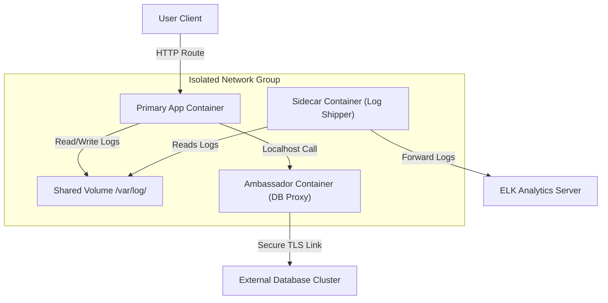

# Module 21 - Design Patterns & Anti-Patterns

## 1. Learning Objectives
By the end of this module, you will be able to:
* Identify and implement structural container design patterns (Sidecar, Ambassador, Adapter).
* Detect and refactor container anti-patterns, such as "Fat Containers" and "Hardcoded Secrets".
* Set up a shared volume system to allow sidecars to access application files.
* Secure outbound third-party API communication using an Ambassador proxy container.
* Unify logging outputs from multiple services using the Adapter pattern.
* Troubleshoot container startup races and volume synchronization issues.

---

## 2. Introduction
Containerizing an application requires more than wrapping a Dockerfile around your code. To design scalable systems, developers follow structural design patterns that separate concerns. Conversely, ignoring these patterns leads to anti-patterns that create security risks and maintenance issues.

To understand container design patterns, consider the **Courier Sidecar Analogy**.
* **The Motorcycle (The Primary Application Container)**: The vehicle responsible for moving packages from point A to point B. Its focus is speed and navigation.
* **The Sidecar Attachment (The Sidecar Container)**: A compartment attached to the motorcycle. It does not control the engine but helps by holding heavy cargo, a gps mapping tracker, or a safety shield. The motorcycle runs fine without it, but the sidecar adds value (e.g. logging agents or proxy helpers) without modifying the motorcycle.
* **The Ambassador (The Border Guide)**: A guide riding ahead of the motorcycle, handling passport verification and language translation at borders (e.g. security credential handshakes) so the courier doesn't have to manage customs forms.
* **The Fat Container Anti-Pattern (The Cargo-Overloaded Bike)**: Trying to weld a refrigerator, a tool chest, and a passenger bench directly onto the motorcycle frame. The motorcycle becomes heavy, hard to start, and prone to breaking down.

---

## 3. Why This Topic Exists
Without clean container design patterns, architectures degrade into:
1. **The "Fat Container" Monolith**: Running a web app, a cron job daemon, a database, and a logging helper inside a single container using supervisor scripts. This makes scaling individual components impossible.
2. **Hardcoded API Bindings**: The application directly handles complex retry logic, SSL handshakes, and token rotations when calling external APIs, leading to code duplication.
3. **Mismatched Log Formats**: Different microservices write logs in different formats (JSON, XML, plain text), making central parsing difficult.

---

## 4. Theory & Internal Mechanics

### Structural Design Patterns
* **Sidecar Pattern**: A secondary container runs alongside the primary application to extend its capabilities (e.g. log shippers, configuration reloaders).
* **Ambassador Pattern**: A proxy container acts as a local gateway, managing connections to external databases or APIs (handling retries, connection pooling, and SSL handshakes).
* **Adapter Pattern**: Standardizes interfaces. For example, an adapter container reads plain text logs from the primary application, transforms them into JSON, and prints them to stdout for centralized collection.

```
+-------------------------------------------------------+
|                    Pod / Host VM                      |
|                                                       |
|  +--------------------+       +--------------------+  |
|  |    Primary App     |       |      Sidecar       |  |
|  |  (Flask Web Server)|       |   (Log Collector)  |  |
|  +--------------------+       +--------------------+  |
|           │                            │              |
|           └───────────┬────────────────┘              |
|                       ▼ (Shared Volume)               |
|             [/var/log/app.log Shared File]            |
|                                                       |
+-------------------------------------------------------+
```

---

## 5. Component Flow Diagram
This diagram shows the relationship between the Primary App, a Sidecar (file watcher), and an Ambassador (API proxy):



---

## 6. Commands Reference

### 6.1 Shared Volume Mount Definition (Compose)
* **Purpose**: Map a volume to allow multiple containers to share a directory.
* **Syntax**: Define `volumes` in the service blocks, pointing to the same named volume hook.
* **Example**:
  ```yaml
  services:
    web:
      image: my-web-app
      volumes:
        - shared-logs:/var/log/app
    logger:
      image: log-shipper
      volumes:
        - shared-logs:/var/log/app:ro
  volumes:
    shared-logs:
  ```

---

## 7. Practical Labs

### Lab 21.1: SSL Termination Sidecar Pattern
**Goal**: Deploy an application container that only serves plain HTTP on port `8080`, and attach an Nginx sidecar container that manages SSL certificates and proxies traffic securely.

1. Create a directory structure:
   ```
   sidecar-lab/
   ├── docker-compose.yml
   ├── default.conf
   └── app/
       └── index.html
   ```
2. Write `default.conf` (Nginx configuration):
   ```nginx
   server {
       listen 80;
       server_name localhost;
       
       # Reverse proxy to the local app container
       location / {
           proxy_pass http://localhost:8080;
           proxy_set_header Host $host;
       }
   }
   ```
3. Write `docker-compose.yml` defining the network join:
   ```yaml
   version: '3.8'
   services:
     web-app:
       image: httpd:alpine
       volumes:
         - ./app:/usr/local/apache2/htdocs/
       expose:
         - "8080" # Not mapped to host ports

     nginx-proxy:
       image: nginx:alpine
       ports:
         - "8080:80" # Exposed to host
       volumes:
         - ./default.conf:/etc/nginx/conf.d/default.conf:ro
       depends_on:
         - web-app
       # Join the network namespace of the web-app container
       network_mode: "service:web-app"
   ```
4. Create a basic index page:
   ```bash
   mkdir app
   echo "<h1>Hello from Decoupled Nginx Sidecar Setup</h1>" > app/index.html
   ```
5. Deploy the stack:
   ```bash
   docker compose up -d
   ```
6. Verify Nginx serves the content by sending requests to `http://localhost:8080`.

### Lab 21.2: Decoupling a Bloated Monolithic Container
**Goal**: Take a bloated "Fat Container" image running both an API and a backup cron script, and refactor it into clean, decoupled primary and sidecar containers.

1. Examine the bloated Dockerfile:
   ```dockerfile
   # Bloated Monolith (Anti-Pattern)
   FROM ubuntu:22.04
   RUN apt-get update && apt-get install -y python3 cron supervisor
   COPY app.py /app/
   COPY backup.sh /app/
   COPY supervisord.conf /etc/supervisor/conf.d/supervisord.conf
   CMD ["/usr/bin/supervisord"]
   ```
2. Refactor it into a decoupled setup:
   - **Primary App Container**: Runs only `python3 app.py`.
   - **Sidecar Container**: Runs `backup.sh`, sharing the app's database data directory using a volume.
3. Write the refactored `docker-compose.yml` to run the services separately, coordinating their filesystems via a named volume.

---

## 8. Real Projects: Ambassador proxy pattern
Configure a web application container that connects to a local Ambassador container. The Ambassador container manages SSL encryption, routing paths, and authentication handshakes before forwarding requests to a database.

### Step 1: Write docker-compose.yml
```yaml
version: '3.8'
services:
  web-app:
    image: node:20-alpine
    command: ["node", "-e", "console.log('Connecting to db via local proxy...'); setInterval(() => {}, 1000)"]
    depends_on:
      - db-proxy

  db-proxy:
    image: HAProxy:alpine
    volumes:
      - ./haproxy.cfg:/usr/local/etc/haproxy/haproxy.cfg:ro
    ports:
      - "5432:5432"
```

---

## 9. Troubleshooting & Diagnostics

### 1. Startup Race Conditions (Sidecars Start Late)
* **Symptoms**: The primary application container crashes on boot because the sidecar (e.g. database proxy or configuration fetcher) has not finished starting.
* **Root Cause**: Docker starts containers in parallel. Even with `depends_on`, the application process can boot before the sidecar service is fully ready.
* **Solution**: Configure healthchecks on the sidecar service, and use `depends_on` with `condition: service_healthy` in the primary application configuration.

### 2. Dangling Shared Volumes Disk Bloats
* **Symptoms**: Disk space on host shrinks, but running `docker ps` shows no large containers.
* **Root Cause**: Shared volumes are not deleted when containers stop, leaving orphaned data directories on the host disk.
* **Solution**: Clean up dangling volumes using:
  ```bash
  docker volume prune -f
  ```

---

## 10. Production Examples
In production environments (like AWS EKS or Kubernetes), design patterns like Sidecars are widely used. Tools like **Istio** inject an Envoy proxy sidecar container into every application pod. This sidecar intercepts and manages all inbound and outbound network traffic, handling service discovery, TLS encryption, and telemetry without requiring code changes to the primary application.

---

## 11. Best Practices
* **Keep Containers Single-Purpose**: Ensure each container runs one process to allow components to scale independently.
* **Use Shared Volumes for File Transfers**: Let sidecars read application log directories using read-only volume mounts (`:ro`).
* **Manage Service Dependencies**: Implement startup scripts (like `wait-for-it.sh`) to prevent application crashes when dependencies are starting up.

---

## 12. Interview Preparation

### Q1: What is the Sidecar Pattern, and what is its main benefit?
* **Answer**: The Sidecar Pattern runs a helper container alongside the primary application container within the same lifecycle network context. The main benefit is separation of concerns: you can add utility features (like log forwarding, metric collection, or security proxies) to an application without modifying the primary application code or bloating its image.

### Q2: What is the "Fat Container" anti-pattern, and why should it be avoided?
* **Answer**: The "Fat Container" anti-pattern involves running multiple services (such as a web server, a database daemon, cron jobs, and logging tools) inside a single container image. This should be avoided because it breaks the single-responsibility principle. It makes log management difficult, prevents components from scaling independently, and complicates container orchestration.

### Q3: Explain the Ambassador Pattern.
* **Answer**: The Ambassador Pattern uses a helper container that acts as a network proxy for the primary application. Instead of the application handling connection pooling, SSL certificate checks, and retry logic for external databases or APIs, the application connects to `localhost`. The Ambassador container intercepts these connections and handles the external network routing.

---

## 13. Cheat Sheet
| Pattern | Mount / Network Setting | Purpose |
|---|---|---|
| Shared File Hook | `volumes: - shared:/dir:ro` | Sidecar read-only log access |
| Local Loopback | `network_mode: "container:<name>"` | Access proxy on localhost |
| Health Check Wait | `condition: service_healthy` | Synchronized service startup |
| Clean dangling | `docker volume prune` | Prune orphaned filesystems |

---

## 14. Assignments

### Beginner Assignment
* Deploy a web server container and attach a sidecar container that regularly creates backups of the web server's log folder.

### Intermediate Assignment
* Refactor a bloated container image running an API process and a log shipping daemon into two separate, coordinated containers.

---

## 15. Mini Project
Write a shell script that audits a Docker Compose project configuration, alerting if any service runs more than 3 processes or exposes credentials directly in environment variables.

---

## 16. References & Further Reading
* [Cloud Design Patterns: Sidecar Pattern](https://learn.microsoft.com/en-us/azure/architecture/patterns/sidecar)
* [Design Patterns for Container-based Distributed Systems](https://www.usenix.org/system/files/conference/hotcloud16/hotcloud16_burns.pdf)
* [Docker Compose File Reference guide](https://docs.docker.com/compose/compose-file/)
