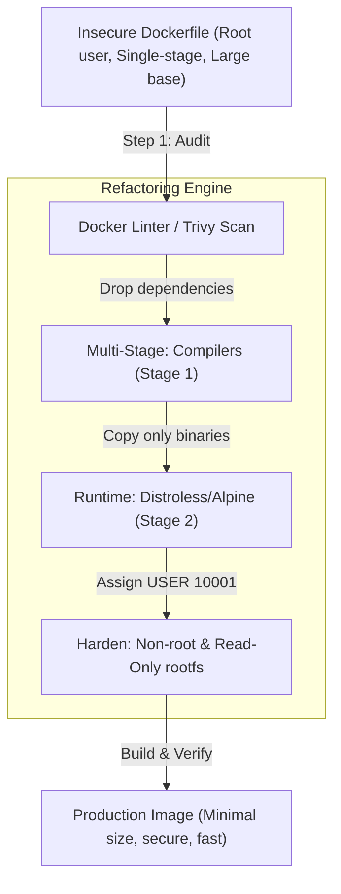

# Module 22 - Best Practices & Interview Preparation

## 1. Learning Objectives
By the end of this module, you will be able to:
* Evaluate container systems against a Production-Readiness Checklist.
* Answer core Docker architecture questions asked during systems engineering interviews.
* Audit Dockerfiles for security, build performance, and size optimizations.
* Refactor insecure, single-stage configurations into secure multi-stage builds.
* Diagnose container failures using log flows, network configurations, and host sockets.
* Design deployment architectures that scale to handle high-traffic workloads.

---

## 2. Introduction
Mastering Docker involves more than understanding syntax; it requires knowing how to build secure, optimized systems for production. This module consolidates that knowledge, providing auditing checklists, design patterns, and answers to technical interview questions.

To understand Docker auditing, consider the **Executive Technical Auditing Panel Analogy**.
* **The Blueprint (The Production Design)**: A master blueprint for a commercial building.
* **The Safety Inspector (The Security Audit)**: Reviews the building to ensure firewall placements, locked exits, and escape routes (non-root execution, seccomp filters) are in place.
* **The Logistics Coordinator (The Build Optimization)**: Reorganizes delivery paths to ensure heavy building blocks are delivered first (caching optimization), reducing completion times from months to days.
* **The Structural Engineer (The Interview Candidate)**: A candidate standing before a panel of builders, explaining why they selected steel arches over wooden pillars, and how they would recover the structure during an earthquake (system failure recovery).

---

## 3. Why This Topic Exists
Many candidates can write simple Dockerfiles but struggle in production environments:
1. **Inefficient Production Configurations**: Deploying 1.5GB development images (containing build compilers and test suites) straight to production clusters.
2. **Failure to Debug Under Pressure**: Struggling to troubleshoot container crash loops or network drops because they only know local `docker run` flows.
3. **Weak System Design Fundamentals**: Inability to explain how cgroups limit memory, how namespaces isolate networks, or how copy-on-write filesystems affect database I/O performance.

---

## 4. Theory & Internal Mechanics

### Production-Readiness Framework
An enterprise-grade container deployment must meet requirements across three areas:

```
+-----------------------------------------------------------------------+
|                      PRODUCTION READINESS MATRIX                       |
+----------------------------------+------------------------------------+
|             SECURITY             |             EFFICIENCY             |
+----------------------------------+------------------------------------+
| * Rootless user (UID > 10000)    | * Minimal base image size          |
| * Read-only root filesystem      | * Layer cache ordering             |
| * Dropped unused capabilities    | * Multi-stage compile patterns     |
| * Secrets injected via memory    | * Volume-backed database write paths|
+----------------------------------+------------------------------------+
|                            STABILITY                             |
+------------------------------------------------------------------+
| * Declared CPU and Memory hard constraints                       |
| * Healthcheck endpoints defined inside config schemas            |
| * Centralized log rotation policies                              |
+------------------------------------------------------------------+
```

---

## 5. Component Flow Diagram
This diagram shows the execution flow for auditing a Dockerfile and refactoring it for production deployment:



---

## 6. Commands Reference

### 6.1 Docker Image Auditing
* **Purpose**: Inspect the layer history and size distribution of an image.
* **Syntax**: `docker history [options] <image>`
* **Example**:
  ```bash
  docker history node:20-alpine
  ```

### 6.2 Checking Container Capabilities
* **Purpose**: Check the security capabilities granted to a running container.
* **Syntax**: `docker inspect --format '{{.HostConfig.CapAdd}}' <container>`
* **Example**:
  ```bash
  docker inspect --format '{{.HostConfig.CapAdd}}' web-server
  ```

---

## 7. Practical Labs

### Lab 22.1: Production-Readiness Dockerfile Audit
**Goal**: Audit an insecure, poorly-designed Dockerfile and refactor it into an optimized, secure production configuration.

1. Review the insecure Dockerfile:
   ```dockerfile
   # INSECURE DOCKERFILE
   FROM python:3.9
   WORKDIR /app
   COPY . .
   RUN pip install -r requirements.txt
   # Runs as root by default
   CMD ["python", "app.py"]
   ```
   *Issues identified: Large base image, files copied before dependencies (cache invalidation), runs as root.*
2. Refactor it into a production-ready Dockerfile:
   ```dockerfile
   # SECURE MULTI-STAGE DOCKERFILE
   # Stage 1: Build dependencies
   FROM python:3.9-slim AS builder
   WORKDIR /build
   COPY requirements.txt .
   RUN pip install --no-cache-dir --user -r requirements.txt
   
   # Stage 2: Final runtime
   FROM python:3.9-alpine
   WORKDIR /app
   # Copy installed packages from builder
   COPY --from=builder /root/.local /root/.local
   COPY app.py .
   
   # Update path and run as non-root user
   ENV PATH=/root/.local/bin:$PATH
   RUN addgroup -S appgroup && adduser -S appuser -G appgroup
   USER appuser
   
   EXPOSE 8080
   ENTRYPOINT ["python", "app.py"]
   ```
3. Build both versions and compare file sizes:
   ```bash
   # Compare sizes: python:3.9 (~900MB) vs python:3.9-alpine (~50MB)
   ```

### Lab 22.2: Troubleshooting a Container Crash Loop
**Goal**: Diagnose and fix a container that keeps exiting immediately on startup.

1. Start a container that fails on boot:
   ```bash
   docker run -d --name broken-app alpine sh -c "echo 'Initializing...'; sleep 2; exit 1"
   ```
2. Diagnose the failure using CLI commands:
   * **Check state**: `docker ps -a` (shows container exited with code 1).
   * **Check logs**: `docker logs broken-app` (shows exit trace).
   * **Inspect details**: `docker inspect broken-app --format '{{.State.ExitCode}}'` (returns exit code).
3. Fix the container environment configuration and relaunch it.

---

## 8. Real Projects: CI/CD Dockerfile Linter Integration
Configure a local linter script that runs `hadolint` (a Dockerfile linter) to validate code standards before building the image.

### Step 1: Run Hadolint via Docker
```bash
docker run --rm -i hadolint/hadolint < Dockerfile
```

### Step 2: Write an automated pre-commit script `lint-docker.sh`
```bash
#!/bin/bash
echo "Auditing Dockerfiles..."
FILES=$(find . -name "Dockerfile")
for f in $FILES; do
    echo "Scanning $f..."
    docker run --rm -i hadolint/hadolint < "$f"
    if [ $? -ne 0 ]; then
        echo "Lint errors found in $f. Build blocked."
        exit 1
    fi
done
echo "All Dockerfiles passed lint audit!"
```

---

## 9. Troubleshooting & Diagnostics

### 1. Inconsistent Layer Cache Hits
* **Symptoms**: The build pipeline is slow because the cache is ignored, even though no code changes were made.
* **Root Cause**: A build argument (e.g. `--build-arg BUILD_TIME=$(date)`) is declared early in the Dockerfile. Every build changes this value, invalidating the cache for all subsequent layers.
* **Solution**: Move dynamic build arguments (such as version numbers or build timestamps) to the very bottom of the Dockerfile.

---

## 10. Production Examples
In production platforms, enterprise security tools (like **Prisma Cloud** or **Sysdig Secure**) continuously audit running containers. If they detect a container running as `root` or containing critical CVEs, they automatically quarantine the container or evict it from the cluster.

---

## 11. Best Practices
* **Use Multi-Stage Builds**: Copy only compiled binaries into final runtime images to minimize the attack surface.
* **Always Declare a USER**: Avoid running container processes as root.
* **Optimize Cache Order**: Copy dependencies files first, run installers, and copy application source code last.

---

## 12. Interview Preparation

### Q1: How do you optimize a Docker image for production deployment?
* **Answer**:
  1. Use small, specific base images (like `alpine` or `distroless`).
  2. Implement multi-stage builds to keep build tools out of the runtime image.
  3. Place frequently modified layers (like application code) at the bottom of the Dockerfile to optimize caching.
  4. Avoid installing unnecessary packages and clean package manager caches (`rm -rf /var/cache/apk/*`).

### Q2: What is the copy-on-write (CoW) mechanism in Docker storage?
* **Answer**: The copy-on-write mechanism optimizes file creation and storage. When a container modifies an existing file from a lower image layer, the storage driver copies the file to the container's upper writable layer first, and then applies the changes there. The original image layer remains unchanged.

### Q3: How do namespaces and cgroups differ?
* **Answer**:
  - **Namespaces** provide virtual isolation by restricting what a container process can see (e.g., net namespaces isolate network interfaces, PID namespaces isolate process lists).
  - **Cgroups** (control groups) enforce resource constraints by restricting what a container process can consume (e.g., limiting CPU cycles, memory, and disk I/O).

---

## 13. Cheat Sheet
| Target | Command | Purpose |
|---|---|---|
| Trace History | `docker history <image>` | View image layer sizes |
| Find Exit Code | `docker inspect -f '{{.State.ExitCode}}'` | Retrieve container exit status |
| Audit Files | `hadolint Dockerfile` | Lint check Dockerfile standards |
| Clean Builder | `docker builder prune -a` | Reset BuildKit caches |

---

## 14. Assignments

### Beginner Assignment
* Audit a basic Dockerfile using `hadolint` and resolve all warnings.

### Intermediate Assignment
* Refactor a single-stage Java Spring Boot Dockerfile (which runs Maven package steps) into a two-stage build, reducing the final image size by at least 50%.

---

## 15. Mini Project
Write a bash script that audits all Docker images on a host, flags any image larger than 500MB, and checks if they run as root.

---

## 16. References & Further Reading
* [Hadolint Dockerfile Linter Rules](https://github.com/hadolint/hadolint)
* [Docker Best Practices for Image Builds](https://docs.docker.com/develop/develop-images/dockerfile_best-practices/)
* [OWASP Container Security Checklist](https://owasp.org/www-project-docker-top-10/)
