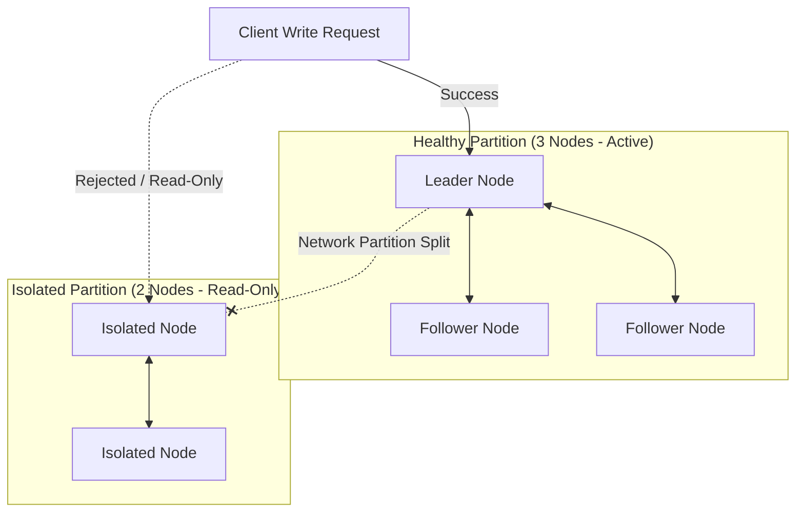

# Module 23 - Real-World Case Studies

## 1. Learning Objectives
By the end of this module, you will be able to:
* Analyze database replication architectures and clustered storage patterns.
* Recover from database storage node failures inside running container groups.
* Detect and resolve split-brain network partition anomalies in database clusters.
* Structure and execute automated disaster recovery failover processes.
* Trace and troubleshoot network routing issues in clustered setups.
* Write incident post-mortems and disaster recovery runbooks.

---

## 2. Introduction
In large-scale production environments, systems experience hardware failures, network splits, and disk corruption. Platform engineers must design architectures that survive these failures and know how to recover when disasters occur.

To understand cluster failures and recovery, consider the **Railway Switchboards Analogy**.
* **The Tracks (The Data Volumes)**: The physical paths where trains run. If a track breaks (disk corruption), trains stop.
* **The Trains (Container Database Replicas)**: Carrying passengers. Multiple trains run on parallel tracks to handle capacity.
* **The Central Controller (The Load Balancer)**: Directs trains to active tracks.
* **Split-Brain Anomaly (The Disconnected Station Controllers)**: The communication line between Station A and Station B is cut. Both stations think the other has shut down. To keep trains running, both controllers start scheduling trains onto the same shared track simultaneously, leading to a collision (data corruption).
* **Disaster Recovery (The Emergency Evacuation Team)**: A trained crew with emergency vehicles and backup switches, ready to reroute trains and restore services.

---

## 3. Why This Topic Exists
Ignoring disaster recovery and clustering mechanics leads to major operational failures:
1. **Split-Brain Data Corruption**: When database replicas lose contact and write conflicting data to storage, resolving the differences requires manual database audits.
2. **Permanent Data Loss**: Running database clusters without verifying volume backups can result in total data loss if the underlying storage nodes fail.
3. **High Mean Time to Resolution (MTTR)**: Without predefined runbooks, teams spend hours diagnosing basic database lockups.

---

## 4. Theory & Internal Mechanics

### Split-Brain in Clustered Databases
* **Consensus (Quorum)**: Clustered systems (such as Elasticsearch or Consul) use consensus algorithms (like Raft) requiring a majority of nodes ($N/2 + 1$) to elect a leader and commit writes.
* **Network Partition**: If a network split divides a 5-node cluster into a 2-node group and a 3-node group:
  - The 2-node group cannot reach quorum and disables writes.
  - The 3-node group reaches quorum, elects a leader, and continues writing.
  - This prevents conflicting writes (split-brain) across the network split.

---

## 5. Component Flow Diagram
This diagram shows how a consensus-based cluster handles a network partition:



---

## 6. Commands Reference

### 6.1 Checking Cluster Consensus States
* **Purpose**: Query Consul cluster members and leader status.
* **Syntax**: `consul members` and `consul operator raft list-peers`
* **Example**:
  ```bash
  docker exec -it consul-leader consul members
  ```

### 6.2 Database Failover Triggers
* **Purpose**: Trigger manual failover on PostgreSQL clusters managed by Patroni.
* **Syntax**: `patronictl -c <config> failover`
* **Example**:
  ```bash
  docker exec -it pg-node-1 patronictl -c /etc/patroni/patroni.yml failover
  ```

---

## 7. Practical Labs

### Lab 23.1: Replicating a Database Storage Node Failure
**Goal**: Deploy a primary-replica database setup, simulate a storage node crash, and promote the replica to primary.

1. Write a `docker-compose.yml` for PostgreSQL replication:
   ```yaml
   version: '3.8'
   services:
     db-primary:
       image: postgres:16-alpine
       environment:
         POSTGRES_DB: production
         POSTGRES_USER: admin
         POSTGRES_PASSWORD: pwd
       volumes:
         - primary-data:/var/lib/postgresql/data
   
     db-replica:
       image: postgres:16-alpine
       environment:
         POSTGRES_DB: production
         POSTGRES_USER: admin
         POSTGRES_PASSWORD: pwd
       depends_on:
         - db-primary
       volumes:
         - replica-data:/var/lib/postgresql/data
   
   volumes:
     primary-data:
     replica-data:
   ```
2. Start the services:
   ```bash
   docker compose up -d
   ```
3. Simulate a failure by stopping the primary database:
   ```bash
   docker compose stop db-primary
   ```
4. Promote the replica container to primary manually:
   ```bash
   docker exec -it scale-lab-db-replica-1 pg_ctl promote -D /var/lib/postgresql/data
   ```
5. Verify the replica accepts write queries:
   ```bash
   docker exec -it scale-lab-db-replica-1 psql -U admin -d production -c "CREATE TABLE test (id int);"
   ```

### Lab 23.2: Resolving a Split-Brain Cluster Sync
**Goal**: Simulate a network split between database nodes using `iptables` rules, and observe how the consensus cluster resolves the split.

1. Find the virtual network interface of the container:
   ```bash
   docker inspect --format '{{.NetworkSettings.SandboxKey}}' db-node-2
   ```
2. Drop all packets coming from Node 1 inside Node 2's namespace:
   ```bash
   sudo nsenter -t <pid> -n iptables -A INPUT -s <node-1-ip> -j DROP
   ```
3. Verify Node 2 rejects writes and Node 1 marks Node 2 as offline.
4. Remove the block and verify the cluster resynchronizes automatically.
   ```bash
   sudo nsenter -t <pid> -n iptables -F
   ```

---

## 8. Real Projects: Disaster Recovery Infrastructure
Configure a multi-node Redis cluster with automatic failover support using Redis Sentinel.

### Step 1: Write `docker-compose.yml`
```yaml
version: '3.8'
services:
  redis-master:
    image: redis:alpine
    ports:
      - "6379:6379"

  redis-slave:
    image: redis:alpine
    command: redis-server --replicaof redis-master 6379
    depends_on:
      - redis-master

  redis-sentinel:
    image: bitnami/redis-sentinel:latest
    environment:
      - REDIS_MASTER_HOST=redis-master
    depends_on:
      - redis-master
      - redis-slave
```

---

## 9. Troubleshooting & Diagnostics

### 1. Loss of Cluster Consensus (Quorum Failure)
* **Symptoms**: The cluster stops accepting write queries, and logs show: `quorum lost, shutting down writes`.
* **Root Cause**: More than half of the cluster nodes crashed, leaving the remaining nodes unable to reach quorum.
* **Solution**: Relaunch the failed nodes, or perform a manual bootstrap of the cluster using the surviving nodes.

### 2. Database Sync Delay (Replication Lag)
* **Symptoms**: Read requests return stale data when querying database replicas.
* **Root Cause**: High network latency or disk I/O bottlenecks on the replica nodes prevent them from writing sync updates in time.
* **Solution**: Monitor lag metrics using `pg_stat_replication` (for PostgreSQL), and optimize replica disk storage I/O limits.

---

## 10. Production Examples
In production platforms, organizations run database clusters across multiple availability zones (AZs). They use orchestrators (like **Kubernetes**) and operators (like **PostgreSQL Operator by Zalando** or **CloudNativePG**) to automate node provisioning, backup schedules, and failover routing.

---

## 11. Best Practices
* **Deploy Odd Node Counts**: Always use odd numbers of nodes (3, 5, 7) in consensus clusters to prevent tie votes during leader elections.
* **Expose Lag Metrics**: Monitor replication lag metrics and configure alerts for slow replication.
* **Test Failovers Regularly**: Perform failover drills in staging environments to verify recovery automation.

---

## 12. Interview Preparation

### Q1: What is a "split-brain" scenario in clustered databases, and how do you prevent it?
* **Answer**: A split-brain scenario occurs when a network partition divides a database cluster, and both isolated groups elect a leader. If both leaders accept writes, the database state drifts, causing data corruption. This is prevented by requiring a quorum ($N/2 + 1$) to elect leaders and commit writes, ensuring only the partition containing a majority of nodes can write data.

### Q2: What is the purpose of Redis Sentinel?
* **Answer**: Redis Sentinel manages Redis deployments. It monitors master and replica nodes, notifies administrators of failures, and handles automatic failover by promoting a replica to master if the master goes offline.

### Q3: How do you measure replication lag in PostgreSQL?
* **Answer**: You measure replication lag by querying the `pg_stat_replication` view on the primary node. It tracks the write, flush, and replay locations of each replica. Comparing these locations to the primary node's write location shows the replication lag in bytes.

---

## 13. Cheat Sheet
| Target | Command | Purpose |
|---|---|---|
| Promote Pg | `pg_ctl promote -D <dir>` | Force promote Pg replica |
| Check peers | `consul operator raft list-peers` | View raft cluster consensus |
| Show members | `consul members` | View active cluster nodes |
| Clear rules | `iptables -F` | Flush firewall blocks |

---

## 14. Assignments

### Beginner Assignment
* Run a Redis primary-replica pair, stop the primary, and verify that the replica still serves read queries.

### Intermediate Assignment
* Deploy a 3-node Consul cluster, stop 2 nodes, and verify that the remaining node rejects write requests due to loss of quorum.

---

## 15. Mini Project
Write a shell script that checks database replication status and triggers an alert if the replication lag exceeds 10MB.

---

## 16. References & Further Reading
* [Raft Consensus Algorithm Guide](https://raft.github.io/)
* [PostgreSQL Replication Administration](https://www.postgresql.org/docs/current/warm-standby.html)
* [Redis Sentinel Documentation](https://redis.io/docs/management/sentinel/)
