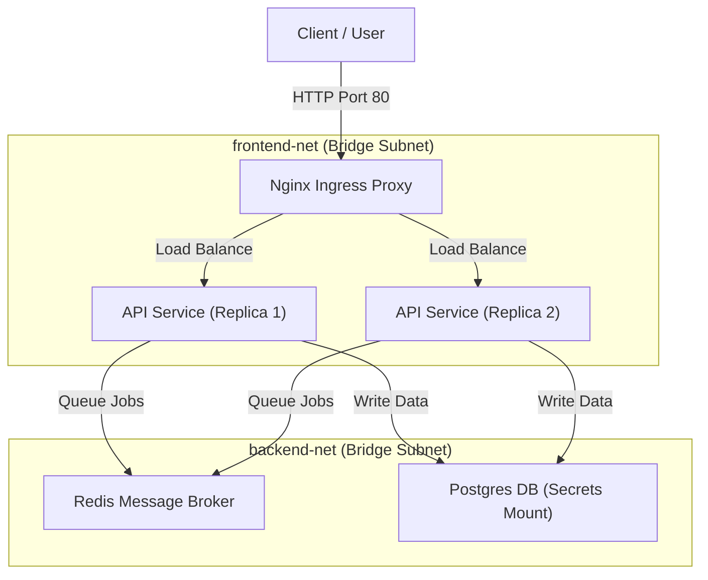

# Module 24 - Enterprise Capstone Project

## 1. Learning Objectives
By the end of this module, you will be able to:
* Architect a multi-tier microservice application stack using Docker Compose.
* Secure service interactions using isolated internal network subnets.
* Enforce resource consumption boundaries (limits and reservations) on every service.
* Inject sensitive database and registry credentials using memory-mapped Docker Secrets.
* Setup automated load testing loops to evaluate container stability under stress.
* Troubleshoot stack configuration conflicts, routing drops, and performance throttling.

---

## 2. Introduction
To apply everything you have learned about Docker, you will build an enterprise-level, production-ready microservices stack. This capstone project integrates security, networking, storage, Compose orchestration, resource optimization, observability, and debugging practices into a single system.

To understand this capstone architecture, consider the **Master Infrastructure Metro Blueprint Analogy**.
* **The Train Stations (The Application Microservices)**: Multiple stations handling passenger transfers.
* **The Transit Security Gates (Docker Secrets & isolated networks)**: Passengers must show tickets at security gates (secrets) and are restricted to specific platforms (isolated subnets) to prevent unauthorized entry.
* **The Passenger Capacity Limits (Resource Boundaries)**: Capping the maximum number of passengers allowed on a platform at one time (`cpus` and `memory` limits) to prevent overcrowding.
* **The Central Station Controller (The Nginx Load Balancer)**: Directs passengers to the least busy train cars (replicas).
* **The Maintenance Crew Logs (Observability Stack)**: Technicians monitoring the tracks and engines, logging vitals and repairing components.

---

## 3. Why This Topic Exists
A capstone project is necessary to consolidate individual skills:
1. **Integration Challenges**: Connecting microservices, databases, load balancers, and monitoring agents introduces configuration challenges that do not appear in single-service setups.
2. **Production Simulation**: Testing how systems behave under load, when storage nodes crash, or when resource constraints are reached.
3. **Portfolio Construction**: Creating a production-ready, audited architecture that demonstrates advanced systems engineering skills.

---

## 4. Theory & Internal Mechanics

### Architecture Specifications
The capstone architecture is composed of five distinct tiers:
1. **Ingress Load Balancing**: Nginx receives client requests and routes them to the API tier.
2. **API App Tier**: Scaled Node.js replicas that process requests, write to the database, and push jobs to Redis.
3. **Asynchronous Processing**: A Redis message queue coordinates task distribution.
4. **Data Persistence**: A PostgreSQL database stores transactional data.
5. **Observability Agent**: cAdvisor scrapes performance metrics from the host.

These tiers are isolated using dedicated bridge networks (`frontend-net` and `backend-net`), ensuring the database cannot be reached directly from the internet.

---

## 5. Component Flow Diagram
This diagram shows the complete multi-tier capstone system:



---

## 6. Commands Reference

### 6.1 Deploying the Stack
* **Purpose**: Build and launch the multi-container environment.
* **Syntax**: `docker compose up -d`
* **Example**:
  ```bash
  docker compose up -d --build
  ```

### 6.2 Verifying Ingress Traffic
* **Purpose**: Send HTTP requests to verify that Nginx distributes load across replicas.
* **Syntax**: `curl http://localhost/`
* **Example**:
  ```bash
  for i in {1..5}; do curl http://localhost/api/info; done
  ```

---

## 7. Practical Labs

### Lab 24.1: Writing the Capstone Orchestration Configuration
**Goal**: Create a `docker-compose.yml` file that defines isolated subnets, resource boundaries, secrets, and healthcheck-based startup dependencies.

1. Create the project directory structure:
   ```
   capstone-project/
   ├── docker-compose.yml
   ├── nginx.conf
   ├── db_password.txt
   ├── api/
   │   ├── Dockerfile
   │   └── index.js
   ```
2. Write the secure `docker-compose.yml` file:
   ```yaml
   version: '3.8'
   
   services:
     ingress-proxy:
       image: nginx:alpine
       ports:
         - "80:80"
       volumes:
         - ./nginx.conf:/etc/nginx/nginx.conf:ro
       networks:
         - frontend-net
       depends_on:
         api-service:
           condition: service_healthy

     api-service:
       build: ./api
       deploy:
         replicas: 2
         resources:
           limits:
             cpus: '0.50'
             memory: 256M
       environment:
         - PG_PASSWORD_FILE=/run/secrets/db_password
       secrets:
         - db_password
       networks:
         - frontend-net
         - backend-net
       healthcheck:
         test: ["CMD", "curl", "-f", "http://localhost:3000/health"]
         interval: 5s
         timeout: 3s
         retries: 3

     postgres-db:
       image: postgres:16-alpine
       environment:
         - POSTGRES_PASSWORD_FILE=/run/secrets/db_password
       secrets:
         - db_password
       networks:
         - backend-net
       volumes:
         - db-data:/var/lib/postgresql/data

   secrets:
     db_password:
       file: ./db_password.txt

   networks:
     frontend-net:
     backend-net:

   volumes:
     db-data:
   ```
3. Write the password file:
   ```bash
   echo "productionDBpassword123" > db_password.txt
   ```
4. Build and start the stack to verify all containers initialize correctly.

### Lab 24.2: Automated Load Testing under Resource Constraints
**Goal**: Simulate high traffic using `ab` (Apache Bench) and monitor how container resource constraints affect performance.

1. Install Apache Bench on the host machine:
   ```bash
   sudo apt-get install -y apache2-utils
   ```
2. Send 10,000 HTTP requests to the API gateway:
   ```bash
   ab -n 10000 -c 100 http://localhost/api/info
   ```
3. In another terminal, monitor resource usage:
   ```bash
   docker stats --no-stream
   ```
4. Observe that the API container CPU usage is capped at `50%` and memory remains below `256MB`, protecting the host system from resource exhaustion.

---

## 8. Real Projects: Ingress Load Balancer
Configure Nginx to act as an ingress load balancer, performing health checks and forwarding requests to the API replica pool.

### Step 1: Write `nginx.conf`
```nginx
events {}
http {
    upstream api_servers {
        server api-service:3000;
    }
    server {
        listen 80;
        location / {
            proxy_pass http://api_servers;
            proxy_set_header Host $host;
            proxy_set_header X-Real-IP $remote_addr;
        }
    }
}
```

---

## 9. Troubleshooting & Diagnostics

### 1. Database Connection Failures (Network Isolation Blockages)
* **Symptoms**: Application containers crash, logging: `dial tcp: lookup postgres-db on dns: no such host`.
* **Root Cause**: The application container is not on the same network subnet as the database container.
* **Solution**: Ensure both the application and database containers are joined to the same network (e.g. `backend-net`) in the Compose file.

### 2. Containers Terminated During Load Tests
* **Symptoms**: Containers crash during traffic spikes, and running `docker inspect` returns exit code `137`.
* **Root Cause**: The container exceeded its configured memory limits, triggering the host kernel's OOM-killer.
* **Solution**: Tune application memory settings (e.g. heap size limits) or increase the container memory limit in the Compose file.

---

## 10. Production Examples
In production cloud clusters (such as Kubernetes), these configurations translate to **Deployments**, **Services**, and **Ingress Controllers**. The orchestrator manages replica scaling, handles routing, and mounts secrets using native APIs instead of Compose scripts.

---

## 11. Best Practices
* **Enforce Strict Subnets**: Never put databases on public networks. Put databases on isolated internal subnets.
* **Apply Resource Limits**: Always define memory and CPU boundaries for every container to protect host stability.
* **Configure Healthchecks**: Define custom health checks to ensure the load balancer only routes requests to active, healthy containers.

---

## 12. Interview Preparation

### Q1: How do you secure database container credentials in a Compose project?
* **Answer**: You secure credentials by using Docker Secrets. You save the database password in a file on the host. In the Compose configuration, you mount this file as a secret. This mounts the password as a read-only file in RAM (`/run/secrets/db_password`) inside the container. You then configure the database and application to read this file, ensuring passwords are not exposed in environment variables or logs.

### Q2: Why is it beneficial to isolate frontend and backend networks in containerized architectures?
* **Answer**: Isolating networks enforces security zones. By creating separate frontend (`frontend-net`) and backend (`backend-net`) subnets, you restrict network routing. For example, database and caching containers only join the backend network, preventing them from receiving direct traffic from the internet or public-facing proxies.

### Q3: What happens when a container reaches its cgroup memory limit under load?
* **Answer**: When a container exceeds its cgroup memory limit, the Linux kernel's OOM-killer intervenes. It sends a `SIGKILL` (signal 9) to the main process inside the container, terminating the container immediately. The container exits with code `137`.

---

## 13. Cheat Sheet
| Target | Property / Command | Purpose |
|---|---|---|
| Ingress Entry | `ports: - "80:80"` | Expose public ingress port |
| Subnet Isolation | `networks: - backend-net` | Connect service to private subnet |
| Scale Replicas | `replicas: 2` | Scale service replicas in Compose |
| Resource Limit | `memory: 256M` | Enforce cgroup memory boundary |

---

## 14. Assignments

### Beginner Assignment
* Build the Capstone project structure and deploy the Nginx, Node.js, and PostgreSQL services on a single host.

### Intermediate Assignment
* Modify the Capstone project to include a Redis caching layer. Place Redis on the private backend network and configure the Node.js API to use it for caching queries.

---

## 15. Mini Project
Write a shell script that deployes the Capstone project, simulates a database failure, and verifies that the Nginx load balancer continues to serve error pages gracefully to clients.

---

## 16. References & Further Reading
* [Production Deployment Guidelines for Docker](https://docs.docker.com/config/containers/start-containers-automatically/)
* [Nginx Ingress Load Balancing Configuration](https://docs.nginx.com/nginx/admin-guide/web-server/reverse-proxy/)
* [Docker Compose Specification V2](https://docs.docker.com/compose/compose-file/)
