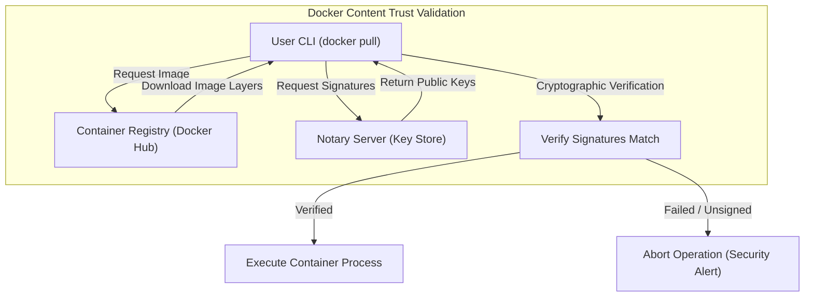

# Module 25 - Final Review, Certification Guide & Career Preparation

## 1. Learning Objectives
By the end of this module, you will be able to:
* Evaluate container runtimes against the Docker Certified Associate (DCA) syllabus.
* Configure Docker Content Trust (DCT) to sign and verify container images.
* Perform system audits to clean up unused containers, networks, volumes, and caches.
* Describe the standards defined by the Open Container Initiative (OCI) for images and runtimes.
* Answer advanced systems architecture questions required for Platform Engineering roles.
* Plan and prepare for technical interviews and systems engineering career pathways.

---

## 2. Introduction
This final module reviews the core concepts of the Docker curriculum, aligns them with industry certifications (such as the Docker Certified Associate), and provides career guidance for roles in Platform Engineering and DevOps.

To understand career progression in container orchestration, consider the **Master Builder Guild Certification Analogy**.
* **The Apprentice (Junior Developer)**: Learns to mix mortar (write basic Dockerfiles) and lay single bricks (run local containers).
* **The Journeyman (DevOps Engineer)**: Coordinates teams of builders to construct houses (orchestrate multi-container stacks with Compose, manage CI/CD pipelines).
* **The Master Mason (Platform/Enterprise Architect)**: Designs city infrastructure blueprints (high-availability clusters, cloud integrations, security guardrails).
* **The Guild Seal (The DCA Certification)**: An official seal confirming you have mastered the trade, verified by other master builders.

---

## 3. Why This Topic Exists
A final review and certification prep module serves several purposes:
1. **Certification Success**: Bridging the gap between practical operations and the specific multiple-choice questions found in the Docker Certified Associate (DCA) exam.
2. **Career Navigation**: Helping engineers transition from writing local configurations to designing enterprise platforms.
3. **System Pruning & Maintenance**: Learning to clean up host environments, freeing up space by removing unused files, logs, and caches.

---

## 4. Theory & Internal Mechanics

### Open Container Initiative (OCI) Compliance
The Open Container Initiative (OCI) defines industry standards for container engines:
* **Image Specification**: Defines the format of container image manifests, layer filesystems, and configuration files.
* **Runtime Specification**: Defines how to unpack and run an OCI image filesystem. Runtimes (like `runc`) receive an unpacked bundle and execute the container processes.

### Docker Content Trust (DCT)
* **Image Signing**: DCT uses digital signatures to verify the integrity and publisher of images pulled from registries.
* **Notary Service**: When DCT is enabled (`export DOCKER_CONTENT_TRUST=1`), Docker clients verify signatures against a Notary server before pulling or executing images, blocking unsigned or tampered images.

---

## 5. Component Flow Diagram
This diagram shows how Docker Content Trust (DCT) validates container image signatures before running them:



---

## 6. Commands Reference

### 6.1 Docker System Pruning
* **Purpose**: Clean up unused container resources to free host disk space.
* **Syntax**: `docker system prune [options]`
* **Arguments**:
  - `-a` or `--all`: Remove all unused images, not just dangling ones.
  - `--volumes`: Include unused volumes in the prune operation.
* **Example**:
  ```bash
  docker system prune -a --volumes -f
  ```

### 6.2 Enabling Docker Content Trust
* **Purpose**: Enforce signature verification on image pulls.
* **Syntax**: `export DOCKER_CONTENT_TRUST=1`
* **Example**:
  ```bash
  export DOCKER_CONTENT_TRUST=1
  docker pull secure-app:v1
  ```

---

## 7. Practical Labs

### Lab 25.1: DCA Certification Mock Exam Challenge
**Goal**: Attempt a mock test containing five sample DCA examination questions, and audit the answers against system mechanics.

1. **Question 1**: Which Docker CLI command displays the detailed configuration parameters of a network?
   * *A) docker network show*
   * *B) docker network inspect*
   * *C) docker network ls*
   * *D) docker network status*
   * **Answer**: **B** (Verify by running `docker network inspect bridge` on the host).
2. **Question 2**: How does a container process receive environment variables defined in a Compose file?
   * *A) Through temporary host files*
   * *B) Via standard environment variables exposed to the container process*
   * *C) By mounting the compose configuration file into the container*
   * *D) Through specialized network sockets*
   * **Answer**: **B** (Exposed as process env variables).
3. **Question 3**: What is the default port used by the Docker Notary service?
   * *Answer*: TCP port `4443`.
4. Review the remaining questions and verify your answers using local command outputs.

### Lab 25.2: Host Cleanups and System Pruning
**Goal**: Clean up your local Docker development host, removing unused layers, networks, volumes, and build caches.

1. Display current disk usage:
   ```bash
   docker system df
   ```
   *Record the reclaimable space.*
2. Execute a complete prune:
   ```bash
   docker system prune -a --volumes -f
   ```
3. Re-evaluate disk usage:
   ```bash
   docker system df
   ```
   *Verify that reclaimable space is zero.*

---

## 8. Real Projects: Career Progression Blueprint
Build a career development checklist targeting DevOps and Platform Engineering roles.

### Platform Engineering Stack Checklist
* [x] **Container Fundamentals**: Namespaces, cgroups, Layered filesystems (overlay2).
* [x] **Orchestration & Coordination**: Compose multi-container configuration networks, dependency resolutions.
* [x] **CI/CD Optimization**: BuildKit cache backends, SemVer automation.
* [x] **Security Hardening**: Dropped capabilities, Custom Seccomp profiles, Rootless runtime.
* [ ] **Cluster Orchestration**: Kubernetes deployments, Helm charts, Service Meshes.

---

## 9. Troubleshooting & Diagnostics

### 1. "Unsigned image" Pull Refusals
* **Symptoms**: Running `docker pull <image>` fails with: `Error: remote trust data does not exist`.
* **Root Cause**: Docker Content Trust is enabled (`DOCKER_CONTENT_TRUST=1`), but the image you are trying to pull has not been signed.
* **Solution**: Sign the image using your publisher keys, or temporarily disable DCT (`export DOCKER_CONTENT_TRUST=0`) to pull the unsigned image.

### 2. Disk Space Refuses to Clear after System Prune
* **Symptoms**: Run `docker system prune` but host disk usage remains unchanged.
* **Root Cause**: Active (running or stopped) containers are still using the images or volumes, preventing Docker from pruning them.
* **Solution**: Stop and remove all containers before running the prune command:
  ```bash
  docker rm -f $(docker ps -a -q)
  docker system prune -a --volumes -f
  ```

---

## 10. Production Examples
In enterprise environments, platforms enforce **Docker Content Trust** and **Admission Controllers**. Any image pushed to the registry is automatically signed. When deploying, the orchestrator validates these signatures, blocking execution of any container image that lacks a trusted signature.

---

## 11. Best Practices
* **Enforce Content Trust in CI/CD**: Sign all production images before pushing them to registries.
* **Perform Regular System Pruning**: Configure cron jobs to clean up unused build caches and dangling images on build nodes.
* **Keep Images OCI-Compliant**: Ensure Dockerfiles produce standard images that can run on any OCI-compliant runtime.

---

## 12. Interview Preparation

### Q1: What is the purpose of Docker Content Trust (DCT)?
* **Answer**: Docker Content Trust (DCT) uses digital signatures to verify the integrity and publisher of images pulled from registries. When enabled, it prevents the Docker client from pulling or running images that are unsigned or have been modified since they were published.

### Q2: What is the Open Container Initiative (OCI), and why is it important?
* **Answer**: The Open Container Initiative (OCI) is a governance project that defines open industry standards for container formats and runtimes. It ensures that container images created by one tool (like Docker) can run on any OCI-compliant container engine (like containerd, Podman, or CRI-O).

### Q3: How do you clean up all unused Docker resources on a host?
* **Answer**: You clean up resources using the `docker system prune` command. To perform a complete cleanup, use the flags `-a` (removes all unused images, not just dangling ones) and `--volumes` (removes all unused named volumes): `docker system prune -a --volumes -f`.

---

## 13. Cheat Sheet
| Target | Command | Purpose |
|---|---|---|
| Enforce Trust | `export DOCKER_CONTENT_TRUST=1` | Turn on signature validation |
| Prune System | `docker system prune -a --volumes` | Full local system cleanup |
| Disk Audit | `docker system df` | View container storage breakdown |
| Notary Port | `4443` | Default port for Notary service |

---

## 14. Assignments

### Beginner Assignment
* Enable Docker Content Trust on your machine, attempt to pull an unsigned public image, and inspect the resulting security error.

### Intermediate Assignment
* Write a bash script that schedules a weekly prune operation on a host machine, logging the reclaimed disk space to a file.

---

## 15. Mini Project
Write a shell script that checks the Docker host environment for OCI compliance, audits image signatures, and generates a security report.

---

## 16. References & Further Reading
* [Docker Certified Associate (DCA) Exam Syllabus](https://training.mirantis.com/certification/dca-certification-exam/)
* [Open Container Initiative (OCI) Specifications](https://opencontainers.org/)
* [Docker Content Trust (DCT) Technical details](https://docs.docker.com/engine/security/trust/)
