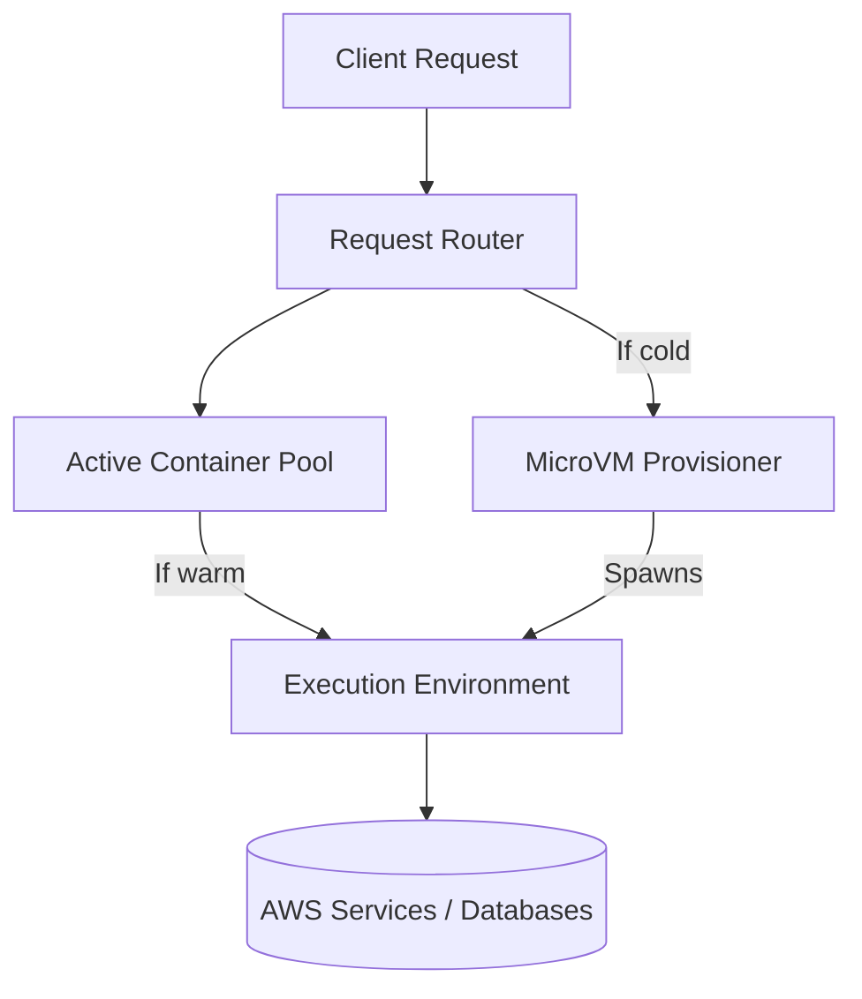

# Section 1 – Introduction to Serverless Computing

## 1. Learning Objectives
* Understand the history, evolution, benefits, and limitations of Serverless Computing.

## 2. Introduction (with Real-World Analogy)
Serverless is like taking a taxi or rideshare (Uber/Lyft). You don't buy the car, patch the engine, or pay for it while it sits in your garage. You only pay for the exact duration of the ride, and the fleet company manages maintenance.

## 3. Why This Topic Exists
Traditional bare-metal and VM hosting required paying for idle resources 24/7, manual OS patching, and complex scaling configurations. Serverless eliminates infrastructure overhead.

## 4. Theory & Internal Mechanics
Cloud providers dynamically manage container provisioning, resource allocation, and request routing on shared hardware clusters using lightweight virtualization engines.

## 5. Component Flow / Architecture Diagram (Mermaid)

## 6. Commands Reference (Purpose, Syntax, Arguments, Example, Output, Production usage)
| Tool | Action | Example |
|---|---|---|
| AWS Console | View dashboard | Navigate to lambda home |
| AWS CLI | List regional resources | `aws lambda list-functions` |

## 7. Practical Labs (Lab 1.1 - Goal, Steps, Expected Output)
**Lab 1.1**: Set up your local development space and check your AWS account credentials via CLI.

## 8. Real Projects / Configurations (Step-by-step setup)
**Project 1**: Architecture design diagram mapping VM-based web servers to serverless cloud compute.

## 9. Troubleshooting & Diagnostics (Symptom, Root Cause, Solution)
**Symptom**: Cold start latency spike on initial request.  
**Root Cause**: MicroVM boot and runtime initialization takes time.  
**Solution**: Configure Provisioned Concurrency or optimize package sizes.

## 10. Production Examples
Coca-Cola migrated their vending machine backend to AWS Lambda, reducing operating costs from millions to a fraction by paying only when drinks are dispensed.

## 11. Best Practices
* Always optimize package dependencies to decrease cold start overhead.

## 12. Interview Preparation (Q1, Q2, Q3 - QA-style)

### Q1: Is serverless truly serverless?
*Answer*: No, servers still exist, but they are fully managed, scaled, and provisioned by the cloud provider, abstracted away from the developer.

### Q2: What is a cold start?
*Answer*: The initialization delay that occurs when a function is invoked after inactivity, requiring the provider to spin up a new container instance.

## 13. Cheat Sheet (Summary Table)
| Metric | Limit |
|---|---|
| Default Timeout | 3 Seconds |
| Max Timeout | 15 Minutes |

## 14. Assignments (Beginner and Intermediate)
* Create a diagram comparing EC2 virtual hosting costs to Lambda pay-per-use metrics.

## 15. Mini Project (Practical coding/scripting task)
* Design a basic high-level architecture diagram for a serverless microservice.

## 16. References & Further Reading
* AWS Serverless Homepage, Cloud Native Computing Foundation specs.
