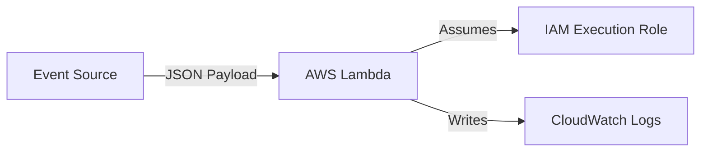

# Section 2 – What is AWS Lambda?

## 1. Learning Objectives
* Explain AWS Lambda, its core features, execution models, and relationship with FaaS.

## 2. Introduction (with Real-World Analogy)
AWS Lambda is like an automated vending machine. It stays completely idle and consumes zero resources until a customer presses a button (an event). Then it spins up, dispenses the item, and shuts down.

## 3. Why This Topic Exists
To provide a highly scalable, pay-as-you-go event-driven execution environment where code runs only in response to specific triggers.

## 4. Theory & Internal Mechanics
AWS Lambda runs functions inside Firecracker microVMs. These microVMs boot within milliseconds, execute the handler function, and are frozen or destroyed automatically.

## 5. Component Flow / Architecture Diagram (Mermaid)

## 6. Commands Reference (Purpose, Syntax, Arguments, Example, Output, Production usage)
| Command | Purpose | Example |
|---|---|---|
| `aws lambda get-function` | Retrieve function details | `aws lambda get-function --function-name MyFunc` |

## 7. Practical Labs (Lab 2.1 - Goal, Steps, Expected Output)
**Lab 2.1**: Invoke a mock lambda function payload using the AWS CLI.

## 8. Real Projects / Configurations (Step-by-step setup)
**Project 2**: Design a multi-service event schema tracking user sign-up registrations.

## 9. Troubleshooting & Diagnostics (Symptom, Root Cause, Solution)
**Symptom**: Concurrent request throttling.  
**Root Cause**: Account concurrent execution limit reached.  
**Solution**: Request a quota increase or apply Reserved Concurrency.

## 10. Production Examples
Netflix uses AWS Lambda to execute media encoding pipelines and security compliance sweeps automatically.

## 11. Best Practices
* Avoid writing monolithic applications inside a single Lambda function.

## 12. Interview Preparation (Q1, Q2, Q3 - QA-style)

### Q1: What is FaaS?
*Answer*: Function as a Service. A cloud execution model where developers write standalone functions triggered by events, paying only for execution time.

### Q2: What virtualization technology backs AWS Lambda?
*Answer*: Firecracker MicroVMs, which use Kernel-based Virtual Machines (KVM) for fast, secure isolation.

## 13. Cheat Sheet (Summary Table)
| Limit | Value |
|---|---|
| Concurrency | 1,000 per region (default) |

## 14. Assignments (Beginner and Intermediate)
* Outline the differences between AWS ECS (containers) and AWS Lambda (FaaS).

## 15. Mini Project (Practical coding/scripting task)
* Write a mock JSON event payload representing a user creation event.

## 16. References & Further Reading
* AWS Lambda developer guide.
