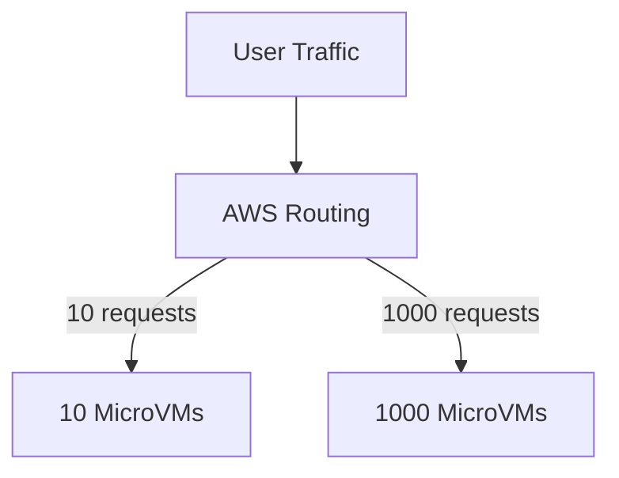

# Section 3 – Why do we use Lambda?

## 1. Learning Objectives
* Identify business cases, operational efficiency benefits, and cost advantages of Lambda.

## 2. Introduction (with Real-World Analogy)
Using Lambda is like hiring a contractor only for the hours they work, rather than hiring a full-time employee whom you must pay even when there is no work to do.

## 3. Why This Topic Exists
Traditional servers cost money even when idle. AWS Lambda allows organizations to run code with a cost curve that aligns perfectly with demand.

## 4. Theory & Internal Mechanics
Lambda scales out horizontally automatically. Each incoming request gets its own isolated execution environment, preventing resource sharing conflicts.

## 5. Component Flow / Architecture Diagram (Mermaid)

## 6. Commands Reference (Purpose, Syntax, Arguments, Example, Output, Production usage)
| Command | Purpose | Example |
|---|---|---|
| `aws lambda list-functions` | List all active functions | `aws lambda list-functions` |

## 7. Practical Labs (Lab 3.1 - Goal, Steps, Expected Output)
**Lab 3.1**: Run a local benchmarking script to observe scaling behaviors.

## 8. Real Projects / Configurations (Step-by-step setup)
**Project 3**: Cost calculation model comparing EC2 instance sizes with Lambda GB-second metrics.

## 9. Troubleshooting & Diagnostics (Symptom, Root Cause, Solution)
**Symptom**: Database connection exhaustion.  
**Root Cause**: Fast scaling of Lambda opens too many parallel DB links.  
**Solution**: Implement RDS Proxy.

## 10. Production Examples
Figma uses Lambda to scale image processing tasks dynamically when users export assets.

## 11. Best Practices
* Set memory sizes according to CPU needs. CPU scales proportionally with RAM.

## 12. Interview Preparation (Q1, Q2, Q3 - QA-style)

### Q1: When should you NOT use AWS Lambda?
*Answer*: For long-running tasks (>15 minutes), stateful legacy apps, or high-throughput constant-load tasks where EC2 is cheaper.

### Q2: How does Lambda scale?
*Answer*: It scales horizontally automatically, creating a new container for each concurrent request up to regional limits.

## 13. Cheat Sheet (Summary Table)
| Benefit | Description |
|---|---|
| Zero Idle Cost | $0 charge when 0 requests occur |

## 14. Assignments (Beginner and Intermediate)
* Create a list of 5 business workloads suited for Lambda and 5 that are not.

## 15. Mini Project (Practical coding/scripting task)
* Calculate the monthly cost for a Lambda running 500,000 times/day, 200ms per run, with 128MB RAM.

## 16. References & Further Reading
* Serverless Cost Optimization documentation.
